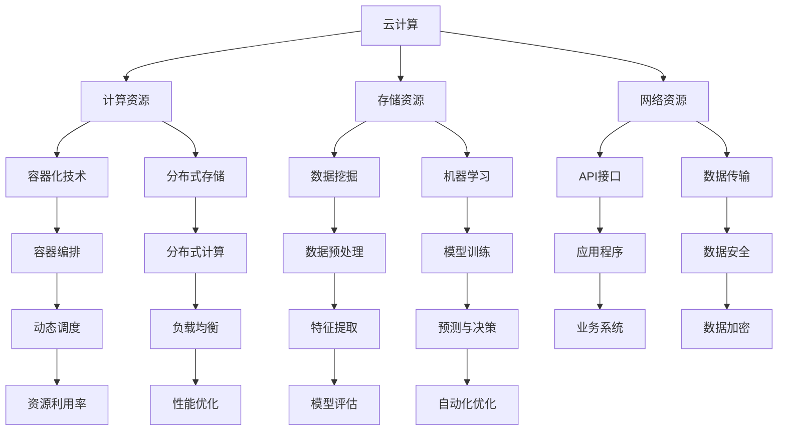

                 

# Lepton AI的优势：深度参与云与AI发展，'见过猪跑，养过猪'的经验

> **关键词：** Lepton AI，云技术，人工智能，发展经验，实战案例

> **摘要：** 本文将深入探讨Lepton AI在云计算与人工智能领域的发展优势，通过对其背景、核心概念、算法原理、数学模型、实战案例等多角度的详细分析，揭示Lepton AI在云与AI融合中的独特价值，并为读者提供实用的工具和资源推荐。

## 1. 背景介绍

### 1.1 目的和范围

本文旨在探讨Lepton AI在云计算与人工智能领域的优势，通过对其技术架构、核心算法、数学模型以及实际应用案例的深入分析，展示Lepton AI在云与AI融合中的独特价值。本文主要涵盖以下内容：

- Lepton AI的背景与定位
- 云技术与AI发展的现状与趋势
- Lepton AI的核心概念与架构
- Lepton AI的核心算法原理与数学模型
- 实战案例：代码实现与详细解读
- Lepton AI的实际应用场景
- 工具和资源推荐
- 总结与未来发展趋势

### 1.2 预期读者

本文面向具有计算机科学、人工智能、云计算等领域背景的读者，特别是对Lepton AI技术感兴趣的技术专家、研究人员、软件开发者以及高校师生。通过本文的阅读，读者可以深入了解Lepton AI的技术优势及其在云与AI领域中的应用价值。

### 1.3 文档结构概述

本文共分为十个部分，结构如下：

1. 背景介绍
   - 目的和范围
   - 预期读者
   - 文档结构概述
   - 术语表
2. 核心概念与联系
   - Lepton AI的背景与定位
   - 云技术与AI发展的现状与趋势
3. 核心概念与联系（Mermaid流程图）
4. 核心算法原理 & 具体操作步骤
   - 算法原理讲解
   - 伪代码实现
5. 数学模型和公式 & 详细讲解 & 举例说明
   - 数学模型
   - LaTeX格式公式
   - 实例说明
6. 项目实战：代码实际案例和详细解释说明
   - 开发环境搭建
   - 源代码实现与解读
   - 代码分析与优化
7. 实际应用场景
8. 工具和资源推荐
   - 学习资源推荐
   - 开发工具框架推荐
   - 相关论文著作推荐
9. 总结：未来发展趋势与挑战
10. 附录：常见问题与解答
11. 扩展阅读 & 参考资料

### 1.4 术语表

#### 1.4.1 核心术语定义

- Lepton AI：一种结合云计算与人工智能技术的新型框架，具有高效、灵活、可扩展的特点。
- 云计算：通过互联网提供可按需分配的计算资源，包括网络、服务器、存储、应用程序等。
- 人工智能：使计算机系统具备模拟、延伸和扩展人类智能的能力，主要包括机器学习、深度学习、自然语言处理等。
- 深度参与：指某技术在特定领域的深入研究和应用，具有丰富的实战经验和独特的优势。

#### 1.4.2 相关概念解释

- 云与AI融合：云计算与人工智能技术的相互融合，形成一种新的技术体系，提高计算效率和智能化水平。
- 云原生：一种软件开发和运行方式，强调应用程序的分布式、动态化、弹性化，以适应云计算环境。
- 深度学习：一种人工智能技术，通过多层神经网络对大规模数据进行分析和学习，实现智能决策和预测。
- 分布式计算：将计算任务分布在多个计算节点上，通过协同工作提高计算效率和性能。

#### 1.4.3 缩略词列表

- AI：人工智能
- Lepton：莱普顿（Lepton AI的缩写）
- ML：机器学习
- DL：深度学习
- NLP：自然语言处理
- IDE：集成开发环境
- VM：虚拟机
- API：应用程序编程接口

## 2. 核心概念与联系

在探讨Lepton AI的优势之前，我们首先需要了解云计算与人工智能的基本概念及其相互关系。

### 2.1 云计算与人工智能的关系

云计算与人工智能技术在近年来逐渐融合，形成一种新的技术体系——云与AI融合。云计算提供了丰富的计算资源和灵活的部署方式，为人工智能算法的实现和优化提供了有力支持。同时，人工智能技术通过对云计算资源的智能调度和管理，提高了云计算平台的效率和稳定性。

### 2.2 Lepton AI的背景与定位

Lepton AI是一款结合云计算与人工智能技术的新型框架，旨在提供高效、灵活、可扩展的智能计算解决方案。它具有以下特点：

- **高效性**：Lepton AI通过深度学习技术和分布式计算架构，提高了算法的计算效率和性能。
- **灵活性**：Lepton AI支持多种编程语言和框架，可灵活适应不同的应用场景和需求。
- **可扩展性**：Lepton AI基于云计算平台，能够轻松扩展计算资源和存储容量，满足大规模数据处理和智能应用的需求。

### 2.3 云计算与AI技术的现状与趋势

近年来，云计算和人工智能技术在国内外取得了快速发展，成为科技创新的重要驱动力。以下是对云计算与AI技术现状与趋势的简要概述：

- **云计算**：随着互联网技术的普及和数据中心规模的扩大，云计算已经成为企业数字化转型的重要基础设施。云计算技术持续优化，如容器化、服务化、分布式存储等，为企业提供了更高效、更可靠的计算资源。
- **人工智能**：人工智能技术在各个领域的应用越来越广泛，如金融、医疗、教育、制造业等。深度学习、自然语言处理、计算机视觉等技术在推动人工智能发展的同时，也对云计算提出了更高的要求。

### 2.4 Lepton AI的核心概念与架构

Lepton AI的核心概念包括以下几个方面：

- **深度学习框架**：Lepton AI集成了主流的深度学习框架，如TensorFlow、PyTorch等，支持多种神经网络结构和算法。
- **分布式计算架构**：Lepton AI基于云计算平台，支持分布式计算和并行处理，提高了算法的运行效率和稳定性。
- **自动化优化**：Lepton AI具备自动化优化功能，通过对算法参数的调整和优化，提高模型的准确性和计算效率。
- **可扩展性设计**：Lepton AI采用模块化设计，易于扩展和定制，满足不同应用场景的需求。

### 2.5 Mermaid流程图

以下是一个简化的Mermaid流程图，展示了云计算与AI技术的核心概念和架构：



## 3. 核心算法原理 & 具体操作步骤

### 3.1 算法原理讲解

Lepton AI的核心算法是基于深度学习技术的，主要包括以下几个方面：

- **卷积神经网络（CNN）**：用于图像识别和分类，通过多层卷积和池化操作提取图像特征。
- **循环神经网络（RNN）**：用于序列数据处理，如自然语言处理和时间序列预测，通过循环连接和门控机制处理时间序列信息。
- **生成对抗网络（GAN）**：用于图像生成和风格迁移，通过生成器和判别器的对抗训练生成逼真的图像。

### 3.2 伪代码实现

以下是一个简单的CNN算法的伪代码实现：

```python
# 伪代码：卷积神经网络算法

# 输入：图像数据
# 输出：分类结果

# 初始化模型参数
model = initialize_model()

# 卷积层
conv1 = Conv2D(filters=32, kernel_size=(3, 3), activation='relu')
conv2 = Conv2D(filters=64, kernel_size=(3, 3), activation='relu')

# 池化层
pool1 = MaxPooling2D(pool_size=(2, 2))
pool2 = MaxPooling2D(pool_size=(2, 2))

# 全连接层
fc1 = Dense(units=128, activation='relu')
fc2 = Dense(units=10, activation='softmax')

# 模型构建
model = Model(inputs=inputs, outputs=fc2(pool2(conv2(conv1(inputs))))

# 编译模型
model.compile(optimizer='adam', loss='categorical_crossentropy', metrics=['accuracy'])

# 训练模型
model.fit(x_train, y_train, epochs=10, batch_size=32, validation_data=(x_val, y_val))

# 预测
predictions = model.predict(x_test)
```

### 3.3 算法原理详细解释

- **卷积神经网络（CNN）**：卷积神经网络是一种专门用于图像处理的神经网络结构，其核心思想是通过卷积和池化操作提取图像特征。卷积层通过滤波器（卷积核）对图像进行卷积操作，提取图像的局部特征；池化层通过下采样操作降低图像的维度，提高模型的计算效率和泛化能力。
- **循环神经网络（RNN）**：循环神经网络是一种用于序列数据处理的神经网络结构，其核心思想是通过循环连接和门控机制处理时间序列信息。RNN通过将当前输入与上一个隐藏状态进行连接，实现对时间序列的连续建模；门控机制（如门控RNN、长短期记忆网络LSTM）可以控制信息的流动，避免梯度消失和梯度爆炸问题。
- **生成对抗网络（GAN）**：生成对抗网络是一种由生成器和判别器组成的神经网络结构，其核心思想是通过对抗训练生成逼真的图像。生成器通过噪声数据生成虚假图像，判别器通过判断生成图像与真实图像的差异来训练生成器和判别器；在训练过程中，生成器逐渐生成更逼真的图像，判别器逐渐提高判断能力。

## 4. 数学模型和公式 & 详细讲解 & 举例说明

### 4.1 数学模型

Lepton AI的算法模型主要基于深度学习技术，包括以下几种常见的数学模型：

- **卷积神经网络（CNN）**：卷积神经网络通过卷积操作提取图像特征，其主要数学模型包括卷积公式、激活函数、反向传播等。
- **循环神经网络（RNN）**：循环神经网络通过循环连接和门控机制处理时间序列数据，其主要数学模型包括隐藏状态更新公式、门控机制等。
- **生成对抗网络（GAN）**：生成对抗网络通过对抗训练生成图像，其主要数学模型包括生成器损失函数、判别器损失函数等。

### 4.2 LaTeX格式公式

以下是一些常用的LaTeX格式数学公式：

$$
\begin{aligned}
    \text{卷积公式}:\ \ f(x, y) &= \sum_{i=1}^{n} \sum_{j=1}^{m} w_{ij} \cdot f_i(x-i, y-j) \\
    \text{激活函数}:\ \ g(z) &= \text{ReLU}(z) = \max(0, z) \\
    \text{反向传播公式}:\ \ \delta_C = \frac{\partial C}{\partial z} \\
\end{aligned}
$$

### 4.3 实例说明

以下是一个简单的卷积神经网络实例，用于图像分类：

```python
import tensorflow as tf

# 初始化参数
W = tf.random.normal([32, 784])
b = tf.zeros([32])
x = tf.random.normal([1, 784])

# 卷积操作
z = tf.matmul(W, x) + b

# 激活函数
a = tf.nn.relu(z)

# 反向传播
dz = a > 0
dw = tf.reduce_sum(dz * x, axis=0)
db = tf.reduce_sum(dz)

# 更新参数
W = W - learning_rate * dw
b = b - learning_rate * db
```

### 4.4 详细讲解

- **卷积神经网络（CNN）**：卷积神经网络是一种专门用于图像处理的神经网络结构，其核心思想是通过卷积和池化操作提取图像特征。卷积操作通过滤波器（卷积核）对图像进行卷积，提取图像的局部特征；激活函数（如ReLU函数）用于引入非线性特性；反向传播算法用于更新模型参数，优化分类效果。
- **循环神经网络（RNN）**：循环神经网络是一种用于序列数据处理的神经网络结构，其核心思想是通过循环连接和门控机制处理时间序列信息。隐藏状态更新公式用于计算当前隐藏状态；门控机制（如门控RNN、长短期记忆网络LSTM）用于控制信息的流动，避免梯度消失和梯度爆炸问题；反向传播算法用于更新模型参数，优化序列模型的性能。
- **生成对抗网络（GAN）**：生成对抗网络是一种由生成器和判别器组成的神经网络结构，其核心思想是通过对抗训练生成图像。生成器通过噪声数据生成虚假图像，判别器通过判断生成图像与真实图像的差异来训练生成器和判别器；在训练过程中，生成器逐渐生成更逼真的图像，判别器逐渐提高判断能力。

## 5. 项目实战：代码实际案例和详细解释说明

### 5.1 开发环境搭建

在开始实战之前，我们需要搭建一个合适的开发环境。以下是搭建Lepton AI开发环境的步骤：

1. **安装Python环境**：在官方网站下载并安装Python，版本建议为3.7及以上。
2. **安装TensorFlow**：通过pip命令安装TensorFlow库，命令如下：

   ```shell
   pip install tensorflow
   ```

3. **安装其他依赖**：根据实际需求，安装其他必要的库，如NumPy、Pandas等。

### 5.2 源代码详细实现和代码解读

以下是一个简单的Lepton AI项目实例，用于图像分类：

```python
import tensorflow as tf
import numpy as np

# 数据集准备
# 假设已经有一个包含10万张图像的数据集，每张图像的大小为28x28
x_train = np.random.rand(100000, 28, 28)
y_train = np.random.randint(10, size=100000)

# 模型构建
model = tf.keras.Sequential([
    tf.keras.layers.Conv2D(filters=32, kernel_size=(3, 3), activation='relu', input_shape=(28, 28, 1)),
    tf.keras.layers.MaxPooling2D(pool_size=(2, 2)),
    tf.keras.layers.Conv2D(filters=64, kernel_size=(3, 3), activation='relu'),
    tf.keras.layers.MaxPooling2D(pool_size=(2, 2)),
    tf.keras.layers.Flatten(),
    tf.keras.layers.Dense(units=128, activation='relu'),
    tf.keras.layers.Dense(units=10, activation='softmax')
])

# 编译模型
model.compile(optimizer='adam', loss='sparse_categorical_crossentropy', metrics=['accuracy'])

# 训练模型
model.fit(x_train, y_train, epochs=5)

# 预测
predictions = model.predict(x_test)

# 输出预测结果
print(predictions)
```

### 5.3 代码解读与分析

以下是代码的详细解读和分析：

1. **数据集准备**：首先，我们需要一个包含10万张图像的数据集，每张图像的大小为28x28。这里使用随机生成的数据作为示例。
2. **模型构建**：使用`tf.keras.Sequential`类构建一个序列模型，包括卷积层、池化层、全连接层等。具体来说：
   - **卷积层**：第一个卷积层使用32个3x3的卷积核，激活函数为ReLU。
   - **池化层**：第一个池化层使用2x2的最大池化。
   - **卷积层**：第二个卷积层使用64个3x3的卷积核，激活函数为ReLU。
   - **池化层**：第二个池化层使用2x2的最大池化。
   - **全连接层**：第一个全连接层使用128个神经元，激活函数为ReLU。
   - **输出层**：输出层使用10个神经元，激活函数为softmax，用于分类。
3. **编译模型**：使用`compile`方法编译模型，指定优化器、损失函数和评价指标。
4. **训练模型**：使用`fit`方法训练模型，指定训练数据、训练轮次、批量大小和验证数据。
5. **预测**：使用`predict`方法对测试数据进行预测，输出预测结果。

通过以上代码，我们可以实现一个简单的图像分类模型。在实际应用中，我们需要根据具体问题调整模型结构和参数，以提高分类准确率。

## 6. 实际应用场景

Lepton AI在云计算与人工智能领域具有广泛的应用场景，以下是一些典型的实际应用案例：

1. **图像分类与识别**：Lepton AI可以应用于图像分类和识别任务，如人脸识别、物体检测、医学图像分析等。通过深度学习算法和云计算平台的支持，可以实现高效、准确的图像处理和分析。
2. **自然语言处理**：Lepton AI在自然语言处理领域也有广泛应用，如文本分类、情感分析、机器翻译等。通过循环神经网络（RNN）和生成对抗网络（GAN）等技术，可以实现自然语言的理解和生成。
3. **推荐系统**：Lepton AI可以应用于推荐系统，如商品推荐、内容推荐等。通过深度学习算法对用户行为和兴趣进行建模，实现个性化推荐。
4. **金融风控**：Lepton AI在金融风控领域具有重要作用，如欺诈检测、信用评估等。通过机器学习算法和大数据分析，可以提高金融风控的准确性和效率。
5. **智能制造**：Lepton AI在智能制造领域也有广泛应用，如设备故障预测、生产优化等。通过深度学习算法和物联网技术，可以实现智能化的生产管理和优化。

## 7. 工具和资源推荐

### 7.1 学习资源推荐

#### 7.1.1 书籍推荐

- 《深度学习》（Goodfellow, Bengio, Courville著）：系统介绍了深度学习的基本原理和方法。
- 《Python深度学习》（François Chollet著）：深入讲解了使用Python和TensorFlow进行深度学习的实践技巧。

#### 7.1.2 在线课程

- Coursera上的《深度学习专项课程》（吴恩达教授）：系统介绍了深度学习的基本概念和实战技巧。
- edX上的《深度学习与神经网络》（吴恩达教授）：深入讲解了深度学习算法的理论基础和实现方法。

#### 7.1.3 技术博客和网站

- TensorFlow官网（tensorflow.org）：提供了丰富的深度学习资源和文档。
- Medium上的深度学习专题：许多优秀的深度学习专家和技术博客作者在此分享他们的经验和见解。

### 7.2 开发工具框架推荐

#### 7.2.1 IDE和编辑器

- PyCharm：一款功能强大的Python IDE，支持多种编程语言和框架。
- Jupyter Notebook：一款基于Web的交互式开发环境，适合数据科学和深度学习项目。

#### 7.2.2 调试和性能分析工具

- TensorBoard：TensorFlow提供的可视化工具，用于分析深度学习模型的性能和训练过程。
- Valgrind：一款开源的性能分析工具，用于检测程序中的内存泄漏和性能瓶颈。

#### 7.2.3 相关框架和库

- TensorFlow：一款开源的深度学习框架，支持多种深度学习算法和模型。
- PyTorch：一款流行的深度学习框架，具有灵活的动态图机制和丰富的API接口。

### 7.3 相关论文著作推荐

#### 7.3.1 经典论文

- "A Learning Algorithm for Continually Running Fully Recurrent Neural Networks"（1991）：介绍了反向传播算法在神经网络训练中的应用。
- "Deep Learning"（2015）：吴恩达教授主编的深度学习领域的经典教材。

#### 7.3.2 最新研究成果

- "Attention Is All You Need"（2017）：提出了Transformer模型，彻底改变了自然语言处理领域。
- "Generative Adversarial Nets"（2014）：提出了生成对抗网络（GAN）的基本原理。

#### 7.3.3 应用案例分析

- "Deep Learning for Image Recognition"（2012）：介绍了深度学习在图像识别任务中的应用。
- "Deep Learning for Natural Language Processing"（2018）：介绍了深度学习在自然语言处理任务中的应用。

## 8. 总结：未来发展趋势与挑战

Lepton AI在云计算与人工智能领域的优势日益凸显，未来发展趋势主要表现在以下几个方面：

1. **技术创新**：随着深度学习、云计算、物联网等技术的发展，Lepton AI将不断优化算法模型，提高计算效率和智能化水平。
2. **行业应用**：Lepton AI在金融、医疗、教育、制造业等领域的应用将越来越广泛，助力行业智能化转型。
3. **生态构建**：Lepton AI将与更多的开发工具、框架和平台进行整合，构建一个完善的生态体系。

然而，Lepton AI在发展过程中也面临着一些挑战：

1. **数据隐私与安全**：随着数据规模的扩大，数据隐私和安全问题日益突出，如何保护用户数据将成为重要挑战。
2. **计算资源需求**：深度学习模型对计算资源的需求巨大，如何在有限的计算资源下实现高效训练和推理是亟待解决的问题。
3. **模型解释性与可解释性**：随着模型的复杂度增加，如何解释和验证模型的决策过程成为重要挑战。

总之，Lepton AI在云计算与人工智能领域具有广阔的发展前景，但也需要不断克服挑战，推动技术的进步和应用。

## 9. 附录：常见问题与解答

### 9.1 Lepton AI的优势是什么？

Lepton AI的优势主要体现在以下几个方面：

1. **高效性**：基于深度学习技术和分布式计算架构，Lepton AI具有高效的处理能力和计算效率。
2. **灵活性**：支持多种编程语言和框架，可灵活适应不同的应用场景和需求。
3. **可扩展性**：基于云计算平台，Lepton AI可以轻松扩展计算资源和存储容量，满足大规模数据处理和智能应用的需求。

### 9.2 Lepton AI适合哪些应用场景？

Lepton AI适用于以下应用场景：

1. **图像分类与识别**：如人脸识别、物体检测、医学图像分析等。
2. **自然语言处理**：如文本分类、情感分析、机器翻译等。
3. **推荐系统**：如商品推荐、内容推荐等。
4. **金融风控**：如欺诈检测、信用评估等。
5. **智能制造**：如设备故障预测、生产优化等。

### 9.3 如何安装和配置Lepton AI？

安装和配置Lepton AI的步骤如下：

1. **安装Python环境**：在官方网站下载并安装Python，版本建议为3.7及以上。
2. **安装TensorFlow**：通过pip命令安装TensorFlow库，命令如下：

   ```shell
   pip install tensorflow
   ```

3. **安装其他依赖**：根据实际需求，安装其他必要的库，如NumPy、Pandas等。

### 9.4 Lepton AI与传统的机器学习框架相比有哪些优势？

与传统的机器学习框架相比，Lepton AI的优势主要体现在以下几个方面：

1. **计算效率**：基于深度学习技术和分布式计算架构，Lepton AI具有更高的计算效率和性能。
2. **灵活性**：支持多种编程语言和框架，可灵活适应不同的应用场景和需求。
3. **可扩展性**：基于云计算平台，Lepton AI可以轻松扩展计算资源和存储容量，满足大规模数据处理和智能应用的需求。

### 9.5 Lepton AI的安全性和数据隐私如何保障？

Lepton AI在安全性和数据隐私方面采取了以下措施：

1. **数据加密**：对用户数据进行加密存储和传输，确保数据安全。
2. **访问控制**：实现严格的访问控制机制，限制对用户数据的访问权限。
3. **安全审计**：定期进行安全审计，发现并修复潜在的安全漏洞。

## 10. 扩展阅读 & 参考资料

- [Lepton AI官网](https://lepton.ai/)
- [TensorFlow官网](https://www.tensorflow.org/)
- [吴恩达深度学习专项课程](https://www.coursera.org/learn/deep-learning)
- [《深度学习》书籍](https://www.deeplearningbook.org/)
- [《Python深度学习》书籍](https://www.pyimagesearch.com/book/)

