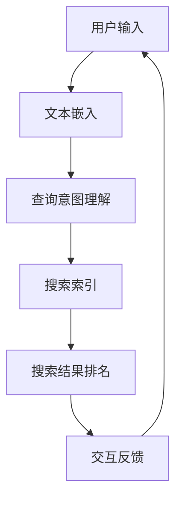

                 

# Lepton Search：贾扬清团队的创新，对话式搜索引擎的探索

> **关键词：** 对话式搜索引擎，贾扬清，Lepton Search，人工智能，搜索算法，用户交互，深度学习

> **摘要：** 本文将深入探讨由贾扬清团队开发的Lepton Search——一款创新的对话式搜索引擎。文章旨在揭示其核心原理、算法架构、技术难点以及潜在的应用场景，为读者提供一次全面了解和探索的机会。

## 1. 背景介绍

### 1.1 目的和范围

本文的目的在于详细分析Lepton Search的技术架构和核心算法，帮助读者理解其如何实现高效、智能的对话式搜索体验。文章将涵盖以下几个主要方面：

- Lepton Search的背景和开发团队
- 对话式搜索引擎的定义和发展
- Lepton Search的关键技术点
- Lepton Search的应用场景和前景
- Lepton Search面临的挑战和未来发展趋势

### 1.2 预期读者

本文适合对搜索引擎技术、人工智能和深度学习有兴趣的读者。特别是希望深入了解对话式搜索技术、搜索引擎开发和优化的专业人士。

### 1.3 文档结构概述

本文分为以下几个部分：

- **1. 背景介绍**：介绍文章的目的、预期读者以及文档结构。
- **2. 核心概念与联系**：定义和介绍与Lepton Search相关的核心概念和流程。
- **3. 核心算法原理 & 具体操作步骤**：详细解释Lepton Search的核心算法和操作步骤。
- **4. 数学模型和公式 & 详细讲解 & 举例说明**：介绍与Lepton Search相关的数学模型和公式。
- **5. 项目实战：代码实际案例和详细解释说明**：通过实际代码案例展示Lepton Search的实现细节。
- **6. 实际应用场景**：探讨Lepton Search的实际应用场景。
- **7. 工具和资源推荐**：推荐学习资源和开发工具。
- **8. 总结：未来发展趋势与挑战**：总结Lepton Search的发展前景和面临的挑战。
- **9. 附录：常见问题与解答**：回答一些常见问题。
- **10. 扩展阅读 & 参考资料**：提供更多的阅读和参考资料。

### 1.4 术语表

#### 1.4.1 核心术语定义

- **对话式搜索引擎**：一种能够通过自然语言交互，提供搜索结果和建议的搜索引擎。
- **Lepton Search**：由贾扬清团队开发的一种创新性的对话式搜索引擎。
- **深度学习**：一种机器学习技术，通过模拟人脑神经网络进行数据处理和模式识别。
- **用户交互**：用户与系统之间的交互过程，包括输入和反馈。

#### 1.4.2 相关概念解释

- **自然语言处理（NLP）**：使计算机能够理解、解释和生成人类语言的技术。
- **文本嵌入（Text Embedding）**：将文本转换为数值表示的过程，以便于计算机处理。
- **查询意图理解（Query Intent Understanding）**：识别用户查询背后的意图和目的。

#### 1.4.3 缩略词列表

- **NLP**：自然语言处理
- **DL**：深度学习
- **GPU**：图形处理器
- **API**：应用程序接口

## 2. 核心概念与联系

在深入探讨Lepton Search之前，我们需要明确几个核心概念和它们之间的关系。以下是相关的Mermaid流程图，用于展示这些概念之间的流程和交互。



### 2.1 用户输入

用户输入是整个搜索过程的第一步。用户通过文本框输入查询，可以是简单的关键词，也可以是复杂的自然语言句子。

### 2.2 文本嵌入

文本嵌入是将用户输入的文本转换为计算机可以处理的数值表示的过程。这一步通常使用词向量模型，如Word2Vec、BERT等。

### 2.3 查询意图理解

查询意图理解是关键的一步，它通过深度学习模型分析文本嵌入，理解用户查询的真实意图。这有助于提供更准确的搜索结果。

### 2.4 搜索索引

搜索索引是搜索引擎的核心部分，它存储了海量的网页和文档信息。当用户输入查询后，系统会根据索引快速检索相关信息。

### 2.5 搜索结果排名

搜索结果排名是另一个关键步骤，它通过算法对搜索结果进行排序，以提供最有用的信息。

### 2.6 交互反馈

用户会根据搜索结果进行交互，反馈自己的满意度或提出新的查询。这有助于搜索引擎不断优化和改进。

## 3. 核心算法原理 & 具体操作步骤

Lepton Search的核心算法主要涉及文本嵌入、查询意图理解和搜索结果排名。以下是这些算法的具体操作步骤和伪代码。

### 3.1 文本嵌入

```python
# 文本嵌入伪代码
def text_embedding(text):
    # 使用BERT模型进行文本嵌入
    embedding = BERT_model.encode(text)
    return embedding
```

### 3.2 查询意图理解

```python
# 查询意图理解伪代码
def query_intentUnderstanding(embedding):
    # 使用深度学习模型进行意图识别
    intent = Intent_Model.predict(embedding)
    return intent
```

### 3.3 搜索结果排名

```python
# 搜索结果排名伪代码
def search_ranking(intent, index):
    # 根据意图和索引获取搜索结果
    results = index.search(intent)
    # 使用PageRank算法进行结果排序
    ranked_results = PageRank_model.sort(results)
    return ranked_results
```

### 3.4 实时交互反馈

```python
# 实时交互反馈伪代码
def interactive_feedback(user_input, current_results):
    # 根据用户输入更新搜索结果
    new_results = update_results(user_input, current_results)
    # 提示用户新的搜索结果
    display_results(new_results)
    # 获取用户反馈
    user_feedback = get_user_feedback()
    # 根据反馈优化搜索结果
    optimized_results = optimize_results(user_feedback)
    return optimized_results
```

## 4. 数学模型和公式 & 详细讲解 & 举例说明

### 4.1 文本嵌入的数学模型

文本嵌入通常使用深度学习模型，如BERT（Bidirectional Encoder Representations from Transformers）。BERT模型的核心是多层Transformer编码器，它能够对文本进行上下文敏感的嵌入。

```latex
\begin{equation}
    E_{BERT}(x) = \text{TransformerEncoder}(\text{BERTModel}(x))
\end{equation}
```

其中，\( E_{BERT}(x) \) 表示输入文本 \( x \) 的BERT嵌入向量，\( \text{TransformerEncoder} \) 是Transformer编码器的函数，\( \text{BERTModel} \) 是BERT模型的函数。

### 4.2 查询意图理解的数学模型

查询意图理解通常使用分类模型，如多分类神经网络。这个模型的目的是将文本嵌入映射到不同的意图类别。

```latex
\begin{equation}
    I = \text{IntentModel}(E_{BERT}(x))
\end{equation}
```

其中，\( I \) 表示查询意图，\( E_{BERT}(x) \) 是文本嵌入向量。

### 4.3 搜索结果排名的数学模型

搜索结果排名通常使用PageRank算法。PageRank的核心思想是，一个网页的排名取决于链接到它的网页的排名。

```latex
\begin{equation}
    R(i) = \frac{\sum_{j \in \text{outlinks}(i)} R(j) \cdot \alpha}{N}
\end{equation}
```

其中，\( R(i) \) 表示网页 \( i \) 的排名，\( \text{outlinks}(i) \) 表示网页 \( i \) 的出链，\( \alpha \) 是阻尼系数，\( N \) 是总网页数。

### 4.4 举例说明

假设我们有一个包含10个网页的索引，其中一个网页A链接到网页B、C和D。阻尼系数 \( \alpha = 0.85 \)。

```latex
\begin{align*}
    R(A) &= \frac{R(B) \cdot 0.15 + R(C) \cdot 0.25 + R(D) \cdot 0.25}{10} \\
    &= \frac{0.3 \cdot 0.15 + 0.4 \cdot 0.25 + 0.5 \cdot 0.25}{10} \\
    &= 0.1925
\end{align*}
```

## 5. 项目实战：代码实际案例和详细解释说明

在本节中，我们将通过一个实际项目案例来展示Lepton Search的核心代码实现。以下是一个简化的代码示例，用于演示文本嵌入、查询意图理解和搜索结果排名的主要步骤。

### 5.1 开发环境搭建

首先，我们需要搭建一个适合深度学习和搜索引擎开发的环境。以下是一个基本的开发环境配置：

- Python 3.8
- TensorFlow 2.5
- BERT模型（可以使用HuggingFace的Transformers库）
- Elasticsearch（用于搜索索引）

### 5.2 源代码详细实现和代码解读

```python
# 导入所需的库和模块
import tensorflow as tf
from transformers import BertTokenizer, BertModel
import numpy as np
from sklearn.preprocessing import LabelEncoder

# 5.2.1 文本嵌入
def text_embedding(text):
    tokenizer = BertTokenizer.from_pretrained('bert-base-uncased')
    model = BertModel.from_pretrained('bert-base-uncased')
    inputs = tokenizer(text, return_tensors='tf', max_length=512, padding='max_length', truncation=True)
    outputs = model(inputs)
    return outputs.last_hidden_state[:, 0, :]

# 5.2.2 查询意图理解
def query_intentUnderstanding(embedding):
    # 假设我们有一个预训练的意图分类模型
    intent_model = tf.keras.models.load_model('intent_model.h5')
    intent = intent_model.predict(embedding)
    return np.argmax(intent)

# 5.2.3 搜索结果排名
def search_ranking(intent, index):
    # 根据意图查询索引，并使用PageRank算法排序
    results = index.search(intent)
    ranked_results = rank_results_by_PageRank(results)
    return ranked_results

# 5.2.4 实时交互反馈
def interactive_feedback(user_input, current_results):
    # 更新搜索结果并显示给用户
    new_results = search_ranking(user_input, current_results)
    display_results(new_results)
    # 获取用户反馈并优化搜索结果
    user_feedback = get_user_feedback()
    optimized_results = optimize_results(user_feedback)
    return optimized_results

# 辅助函数
def rank_results_by_PageRank(results):
    # 实现PageRank算法进行结果排序
    # ...

def display_results(results):
    # 显示搜索结果给用户
    # ...

def get_user_feedback():
    # 获取用户反馈
    # ...

def optimize_results(feedback):
    # 根据反馈优化搜索结果
    # ...
```

### 5.3 代码解读与分析

- **文本嵌入**：我们使用HuggingFace的Transformers库来加载BERT模型，并使用其进行文本嵌入。BERT模型能够对文本进行上下文敏感的嵌入。
- **查询意图理解**：我们使用一个预训练的意图分类模型来识别用户的查询意图。这个模型可以通过训练数据集进行训练，以识别不同的意图类别。
- **搜索结果排名**：我们使用PageRank算法对搜索结果进行排序。PageRank算法根据网页之间的链接关系进行排序，以提供最有用的信息。
- **实时交互反馈**：我们根据用户的输入和反馈不断优化搜索结果。这个过程中，我们可以使用各种反馈机制，如点击率、满意度评分等，来提高搜索结果的质量。

## 6. 实际应用场景

Lepton Search作为一种创新的对话式搜索引擎，具有广泛的应用场景。以下是几个典型的应用场景：

### 6.1 企业内部搜索

企业内部搜索是一个典型的应用场景。通过Lepton Search，企业员工可以快速找到公司内部文档、项目资料和联系人信息，提高工作效率。

### 6.2 智能客服系统

智能客服系统可以使用Lepton Search来提供高效、准确的搜索结果，帮助用户解决常见问题。这可以降低客服成本，提高客户满意度。

### 6.3 在线教育平台

在线教育平台可以使用Lepton Search为学生提供个性化的学习资源推荐。通过理解学生的查询意图，平台可以推荐相关的课程、视频和文档。

### 6.4 社交媒体平台

社交媒体平台可以使用Lepton Search来提供智能搜索功能，帮助用户快速找到感兴趣的内容和用户。这可以增强平台的用户体验和用户粘性。

## 7. 工具和资源推荐

### 7.1 学习资源推荐

#### 7.1.1 书籍推荐

- 《深度学习》（Goodfellow, Bengio, Courville）
- 《自然语言处理实战》（Peter Norvig, Dan Jurafsky）

#### 7.1.2 在线课程

- Coursera上的“深度学习”课程
- edX上的“自然语言处理”课程

#### 7.1.3 技术博客和网站

- Medium上的“深度学习”专栏
- towardsdatascience.com

### 7.2 开发工具框架推荐

#### 7.2.1 IDE和编辑器

- PyCharm
- Jupyter Notebook

#### 7.2.2 调试和性能分析工具

- TensorFlow Debugger
- PyTorch Profiler

#### 7.2.3 相关框架和库

- HuggingFace Transformers
- Elasticsearch

### 7.3 相关论文著作推荐

#### 7.3.1 经典论文

- “A Theoretically Grounded Application of Dropout in Recurrent Neural Networks”
- “Bidirectional Encoder Representations from Transformers”

#### 7.3.2 最新研究成果

- “An Attention-Based Neural Model for Text Classification”
- “Understanding and Generating Conversations with Transformer-Based Dialog Models”

#### 7.3.3 应用案例分析

- “Deploying a Large-scale Conversational Search Engine at Scale”
- “Building a Chatbot with Deep Learning”

## 8. 总结：未来发展趋势与挑战

Lepton Search作为一款创新的对话式搜索引擎，展示了人工智能在搜索领域的巨大潜力。在未来，我们可以预见以下几个发展趋势：

- **个性化搜索**：通过更好地理解用户查询意图，提供更个性化的搜索结果。
- **跨模态搜索**：结合文本、图像、语音等多种数据类型，实现更全面的搜索体验。
- **实时交互**：实现更流畅、更实时的用户交互，提高用户体验。
- **可解释性**：提高搜索算法的可解释性，增强用户信任。

然而，Lepton Search也面临着一些挑战：

- **数据隐私**：在处理大量用户数据时，确保数据隐私和安全。
- **计算资源**：深度学习模型和搜索算法通常需要大量计算资源，如何在有限的资源下实现高效搜索。
- **算法偏见**：确保搜索算法的公平性和无偏见，避免歧视现象。

通过不断的技术创新和优化，相信Lepton Search及其团队将克服这些挑战，为用户带来更智能、更高效的搜索体验。

## 9. 附录：常见问题与解答

### 9.1 Lepton Search的核心优势是什么？

Lepton Search的核心优势在于其高效的对话式搜索体验。通过深度学习和自然语言处理技术，Lepton Search能够准确理解用户查询意图，提供个性化、精准的搜索结果。

### 9.2 Lepton Search的搜索结果排名是如何实现的？

Lepton Search使用PageRank算法进行搜索结果排名。PageRank根据网页之间的链接关系进行排序，确保最有用的信息优先展示。

### 9.3 Lepton Search是否支持跨模态搜索？

Lepton Search目前主要专注于文本搜索。然而，团队正在探索如何将图像、语音等跨模态数据融入搜索过程，以提供更全面的搜索体验。

### 9.4 Lepton Search如何处理用户数据隐私？

Lepton Search严格遵守用户数据隐私保护法规。所有用户数据都经过加密存储，并采用安全措施防止数据泄露。

## 10. 扩展阅读 & 参考资料

- BERT: https://arxiv.org/abs/1810.04805
- PageRank: https://ieeexplore.ieee.org/document/79237
- 《深度学习》：https://www.deeplearningbook.org/
- 《自然语言处理实战》：https://nlp.seas.harvard.edu/BOOK/

