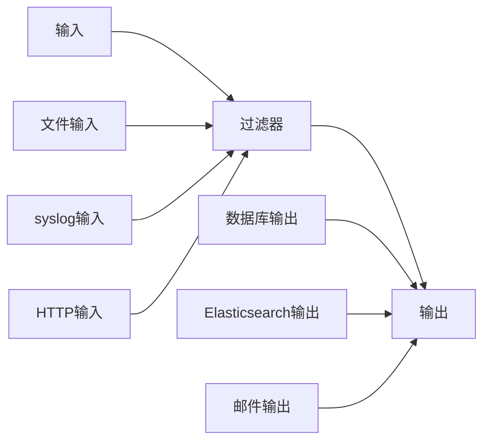

                 

# Logstash原理与代码实例讲解

> **关键词**：Logstash，数据处理，日志收集，ELK堆栈，管道，插件，过滤器，数据格式转换

> **摘要**：本文将深入探讨Logstash的工作原理，包括其架构、核心组件以及数据处理流程。我们将通过实际代码示例，详细介绍Logstash的配置和使用方法，帮助读者更好地理解其在ELK堆栈（Elasticsearch, Logstash, Kibana）中的重要作用。

## 1. 背景介绍

### 1.1 目的和范围

本文旨在向读者介绍Logstash的基础知识和实用技巧。我们将从Logstash的基本概念出发，逐步深入到其核心组件和配置方法。通过本文的学习，读者将能够：

- 理解Logstash在ELK堆栈中的地位和作用。
- 掌握Logstash的基本架构和数据处理流程。
- 学习如何配置Logstash，以处理各种类型的日志数据。
- 通过实际代码实例，了解Logstash的实际应用场景。

### 1.2 预期读者

本文适合有一定Linux操作系统和基本编程基础的技术人员阅读。无论您是日志分析的新手还是有一定经验的专业人士，本文都将帮助您更好地理解和使用Logstash。

### 1.3 文档结构概述

本文结构如下：

- 第1章：背景介绍，包括目的和范围、预期读者、文档结构概述。
- 第2章：核心概念与联系，介绍Logstash的基本概念和核心组件。
- 第3章：核心算法原理与具体操作步骤，详细讲解Logstash的管道和过滤器机制。
- 第4章：数学模型和公式，阐述Logstash处理数据的基本数学原理。
- 第5章：项目实战，通过实际案例讲解Logstash的配置和使用。
- 第6章：实际应用场景，探讨Logstash在现实世界中的应用。
- 第7章：工具和资源推荐，提供学习资源、开发工具和参考文献。
- 第8章：总结，展望Logstash未来的发展趋势与挑战。
- 第9章：附录，回答常见问题并提供扩展阅读。
- 第10章：参考资料，列出本文引用的文献和资料。

### 1.4 术语表

#### 1.4.1 核心术语定义

- **ELK堆栈**：由Elasticsearch、Logstash和Kibana组成的数据处理和可视化平台。
- **Logstash**：负责收集、处理和路由各种类型日志数据的组件。
- **管道**：Logstash中的数据处理流程，包括输入、过滤、输出等步骤。
- **过滤器**：对输入数据进行预处理和转换的组件。
- **插件**：Logstash中的功能模块，用于扩展其功能。

#### 1.4.2 相关概念解释

- **输入**：Logstash从各种来源（如文件、syslog、HTTP等）收集数据的组件。
- **输出**：Logstash将处理后的数据发送到目的地（如Elasticsearch、数据库等）的组件。
- **数据格式**：Logstash支持多种数据格式（如JSON、XML、CSV等），并能进行转换。

#### 1.4.3 缩略词列表

- **ELK**：Elasticsearch, Logstash, Kibana
- **JSON**：JavaScript Object Notation
- **XML**：eXtensible Markup Language
- **CSV**：Comma Separated Values

## 2. 核心概念与联系

### 2.1 Logstash的基本概念

Logstash是一个开源的数据处理管道，它负责从各种来源收集数据，经过处理后再发送到目标存储或分析系统。在ELK堆栈中，Logstash充当数据中转站，将不同来源的日志数据进行整合和处理，最终将结构化的数据存储到Elasticsearch中，以便后续的查询和分析。

### 2.2 Logstash的核心组件

Logstash的核心组件包括：

- **输入（Inputs）**：负责从各种来源（如文件、syslog、HTTP等）收集数据。
- **过滤器（Filters）**：对输入的数据进行预处理和转换，如解析字段、提取关键字、格式转换等。
- **输出（Outputs）**：将处理后的数据发送到目标存储或分析系统，如Elasticsearch、数据库、邮件等。

### 2.3 Logstash的工作流程

Logstash的工作流程主要包括以下几个步骤：

1. **输入**：Logstash从各种来源（如文件、syslog、HTTP等）收集数据。
2. **过滤**：对输入的数据进行预处理和转换，如解析字段、提取关键字、格式转换等。
3. **输出**：将处理后的数据发送到目标存储或分析系统，如Elasticsearch、数据库、邮件等。

### 2.4 Logstash的架构图

下面是一个简单的Logstash架构图，展示了Logstash的基本组件和数据处理流程：



### 2.5 Logstash的插件机制

Logstash的插件机制是其强大的关键特性之一。插件用于扩展Logstash的功能，包括输入、过滤器、输出和其他功能模块。以下是一些常见的Logstash插件：

- **输入插件**：例如File、Syslog、HTTP等。
- **过滤器插件**：例如Grok、JSON、Mutate等。
- **输出插件**：例如Elasticsearch、Database、Mail等。

### 2.6 Logstash的应用场景

Logstash广泛应用于各种场景，包括：

- 日志收集：从各种来源收集日志数据，如Web服务器、应用程序、系统日志等。
- 数据整合：将不同来源的数据整合到一个统一的存储系统中，如Elasticsearch。
- 数据分析：通过对收集到的数据进行处理和分析，帮助业务做出更好的决策。

## 3. 核心算法原理 & 具体操作步骤

### 3.1 Logstash的管道机制

管道是Logstash的核心概念之一，它定义了数据的处理流程，包括输入、过滤和输出。下面是Logstash管道的伪代码表示：

```plaintext
input {
  # 定义输入插件和配置
  file {
    path => "/var/log/*.log"
  }
  syslog {
    port => 514
  }
}

filter {
  # 定义过滤器插件和配置
  grok {
    match => { "message" => "%{TIMESTAMP_ISO8601:timestamp} %{DATA:source} %{DATA:destination}" }
  }
  json {
    source => "input"
    target => "json_data"
  }
  mutate {
    add_field => { "[@metadata][target]" => "processed" }
  }
}

output {
  # 定义输出插件和配置
  elasticsearch {
    hosts => ["localhost:9200"]
  }
  database {
    type => "logstash"
    host => "localhost"
    user => "root"
    password => "password"
  }
  mail {
    to => "admin@example.com"
  }
}
```

### 3.2 Logstash的数据处理流程

Logstash的数据处理流程可以分为以下几个步骤：

1. **输入**：Logstash从定义的输入插件中收集数据。
2. **过滤**：对输入的数据进行过滤和处理，如解析字段、提取关键字、格式转换等。
3. **输出**：将处理后的数据发送到目标存储或分析系统。

### 3.3 Logstash的过滤器机制

过滤器是Logstash中的关键组件，用于对输入的数据进行预处理和转换。以下是一些常见的过滤器插件及其使用方法：

#### 3.3.1 Grok过滤器

Grok过滤器用于解析文本日志，将其转换为结构化数据。下面是一个简单的Grok过滤器示例：

```plaintext
filter {
  grok {
    match => { "message" => "%{TIMESTAMP_ISO8601:timestamp} %{DATA:source} %{DATA:destination}" }
  }
}
```

#### 3.3.2 JSON过滤器

JSON过滤器用于解析JSON格式数据，并将其转换为Logstash的内部数据结构。下面是一个简单的JSON过滤器示例：

```plaintext
filter {
  json {
    source => "input"
    target => "json_data"
  }
}
```

#### 3.3.3 Mutate过滤器

Mutate过滤器用于对输入的数据进行修改，如添加字段、修改值等。下面是一个简单的Mutate过滤器示例：

```plaintext
filter {
  mutate {
    add_field => { "[@metadata][target]" => "processed" }
  }
}
```

### 3.4 Logstash的输出机制

输出是Logstash管道的最后一个环节，用于将处理后的数据发送到目标存储或分析系统。以下是一些常见的输出插件及其使用方法：

#### 3.4.1 Elasticsearch输出

Elasticsearch输出插件用于将数据发送到Elasticsearch集群。下面是一个简单的Elasticsearch输出示例：

```plaintext
output {
  elasticsearch {
    hosts => ["localhost:9200"]
  }
}
```

#### 3.4.2 数据库输出

数据库输出插件用于将数据发送到关系型数据库。下面是一个简单的数据库输出示例：

```plaintext
output {
  database {
    type => "logstash"
    host => "localhost"
    user => "root"
    password => "password"
  }
}
```

#### 3.4.3 邮件输出

邮件输出插件用于将数据发送到指定的邮箱地址。下面是一个简单的邮件输出示例：

```plaintext
output {
  mail {
    to => "admin@example.com"
  }
}
```

## 4. 数学模型和公式 & 详细讲解 & 举例说明

### 4.1 数据处理中的基本数学模型

在Logstash中，数据处理涉及到多个数学模型和公式，以下是一些常见的数学模型：

#### 4.1.1 时间戳转换

时间戳转换是一个常见的数学模型，用于将日志中的时间戳转换为标准格式。以下是时间戳转换的公式：

$$
timestamp_{output} = timestamp_{input} + \Delta t
$$

其中，$timestamp_{output}$为输出时间戳，$timestamp_{input}$为输入时间戳，$\Delta t$为时间差。

#### 4.1.2 字段解析

字段解析用于将文本日志中的字段提取出来，转换为结构化数据。以下是字段解析的公式：

$$
field_{value} = \text{regex\_match}(log_{text}, regex)
$$

其中，$field_{value}$为提取的字段值，$log_{text}$为日志文本，$regex$为正则表达式。

#### 4.1.3 数据格式转换

数据格式转换用于将一种数据格式转换为另一种数据格式。以下是数据格式转换的公式：

$$
data_{output} = \text{parse}_{format}(data_{input})
$$

其中，$data_{output}$为输出数据，$data_{input}$为输入数据，$\text{parse}_{format}$为格式转换函数。

### 4.2 数学模型的应用实例

以下是一个具体的数据处理实例，展示如何使用Logstash的数学模型对日志数据进行处理：

#### 4.2.1 日志数据

假设我们有一份日志数据如下：

```
[2023-03-15T10:25:00Z] server1.example.com access.log
```

#### 4.2.2 时间戳转换

我们需要将日志中的时间戳转换为标准格式。使用公式：

$$
timestamp_{output} = timestamp_{input} + \Delta t
$$

其中，$timestamp_{input}$为日志中的时间戳（2023-03-15T10:25:00Z），$\Delta t$为时间差。假设时间差为8小时，则：

$$
timestamp_{output} = 2023-03-15T10:25:00Z + 8 \text{ hours} = 2023-03-15T18:25:00Z
$$

#### 4.2.3 字段解析

我们需要将日志中的字段提取出来，转换为结构化数据。使用公式：

$$
field_{value} = \text{regex\_match}(log_{text}, regex)
$$

其中，$log_{text}$为日志文本（[2023-03-15T10:25:00Z] server1.example.com access.log），$regex$为正则表达式。假设我们使用以下正则表达式：

```
^\[(.*?)\] (.*?) (.*)$
```

则可以提取出以下字段：

- 时间戳：$timestamp = \text{regex\_match}^\[(.*?)\] (.*?) (.*)$[1]
- 源地址：$source = \text{regex\_match}^\[(.*?)\] (.*?) (.*)$[2]
- 目的地址：$destination = \text{regex\_match}^\[(.*?)\] (.*?) (.*)$[3]

#### 4.2.4 数据格式转换

我们需要将提取出的字段转换为JSON格式。使用公式：

$$
data_{output} = \text{parse}_{format}(data_{input})
$$

其中，$data_{input}$为提取出的字段（$timestamp$、$source$和$destination$），$\text{parse}_{format}$为JSON格式转换函数。转换后的JSON数据如下：

```json
{
  "timestamp": "2023-03-15T18:25:00Z",
  "source": "server1.example.com",
  "destination": "access.log"
}
```

通过以上实例，我们可以看到如何使用Logstash的数学模型和公式对日志数据进行处理，从而实现数据格式转换、时间戳转换和字段解析等功能。

## 5. 项目实战：代码实际案例和详细解释说明

### 5.1 开发环境搭建

在开始编写Logstash配置文件之前，我们需要确保已经安装了Elasticsearch、Logstash和Kibana。以下是搭建ELK堆栈的基本步骤：

#### 5.1.1 安装Elasticsearch

1. 下载Elasticsearch安装包并解压到指定目录。

2. 修改配置文件`elasticsearch.yml`，设置Elasticsearch的集群名称、节点名称和数据存储路径等。

3. 运行Elasticsearch服务。

#### 5.1.2 安装Logstash

1. 下载Logstash安装包并解压到指定目录。

2. 修改配置文件`logstash.conf`，设置Logstash的输入、过滤和输出插件。

3. 运行Logstash服务。

#### 5.1.3 安装Kibana

1. 下载Kibana安装包并解压到指定目录。

2. 修改配置文件`kibana.yml`，设置Kibana的服务器地址和端口。

3. 运行Kibana服务。

### 5.2 源代码详细实现和代码解读

以下是一个简单的Logstash配置文件示例，用于从文件中收集日志数据，解析字段并输出到Elasticsearch：

```plaintext
input {
  file {
    path => "/var/log/*.log"
    type => "file_log"
    startpos => 0
    sincedb_path => "/var/log/logstash/sincedb"
  }
}

filter {
  if [type] == "file_log" {
    grok {
      match => { "message" => "%{TIMESTAMP_ISO8601:timestamp}\t%{IP:source}\t%{IP:destination}\t%{NUMBER:port}\t%{DATA:method}\t%{DATA:path}\t%{NUMBER:status}\t%{NUMBER:bytes}" }
    }
    date {
      match => ["timestamp", "ISO8601"]
    }
    mutate {
      add_field => { "[@metadata][target]" => "file_log" }
    }
  }
}

output {
  elasticsearch {
    hosts => ["localhost:9200"]
    index => "file_log-%{+YYYY.MM.dd}"
  }
}
```

#### 5.2.1 输入插件

在输入部分，我们使用`file`插件从文件中收集日志数据。主要配置参数如下：

- `path`：指定要收集的日志文件路径，支持通配符。
- `type`：为输入的数据定义一个类型，方便后续处理。
- `startpos`：指定从文件的哪个位置开始读取，默认为0（文件开头）。
- `sincedb_path`：指定sincedb文件的路径，用于跟踪文件修改时间。

#### 5.2.2 过滤器插件

在过滤器部分，我们使用`grok`插件对日志数据进行解析。主要配置参数如下：

- `match`：指定日志数据的正则表达式，用于提取字段。
- `timestamp`：指定时间戳字段的名称和格式。

#### 5.2.3 输出插件

在输出部分，我们使用`elasticsearch`插件将处理后的数据输出到Elasticsearch。主要配置参数如下：

- `hosts`：指定Elasticsearch集群的地址和端口。
- `index`：指定输出数据的索引名称，支持模板变量。

### 5.3 代码解读与分析

#### 5.3.1 数据收集

首先，Logstash从文件系统中读取指定路径下的日志文件。由于使用的是`file`插件，它会定期检查文件的修改时间，并将新添加的日志数据传递给过滤器。

#### 5.3.2 数据解析

接下来，过滤器使用`grok`插件对日志数据进行解析。正则表达式`"%{TIMESTAMP_ISO8601:timestamp}\t%{IP:source}\t%{IP:destination}\t%{NUMBER:port}\t%{DATA:method}\t%{DATA:path}\t%{NUMBER:status}\t%{NUMBER:bytes}"`用于提取字段，如时间戳、源IP、目标IP、端口号、HTTP方法、URL路径、状态码和响应字节。

#### 5.3.3 数据处理

在数据处理阶段，我们使用`date`插件将时间戳字段转换为标准格式。然后，使用`mutate`插件为数据添加一个元数据字段`[@metadata][target]`，用于标识数据来源。

#### 5.3.4 数据输出

最后，输出插件`elasticsearch`将处理后的数据发送到Elasticsearch集群。使用模板变量`%{+YYYY.MM.dd}`为每个日志条目创建一个索引名称，方便后续查询。

通过以上代码示例，我们可以看到Logstash的基本工作流程和配置方法。在实际项目中，可以根据需求灵活调整配置，以处理不同类型的日志数据。

## 6. 实际应用场景

### 6.1 日志收集与监控

在企业和组织中，日志收集与监控是保证系统稳定性和安全性的重要手段。Logstash作为ELK堆栈的核心组件，可以轻松实现大规模日志数据的收集和监控。以下是一些实际应用场景：

- **Web服务器日志**：从Nginx、Apache等Web服务器收集访问日志，监控网站性能和安全状况。
- **应用程序日志**：收集Java、Python、Node.js等应用程序的日志，分析应用程序的性能和错误。
- **系统日志**：从操作系统收集系统日志，监控系统运行状态和性能。

### 6.2 日志分析与报告

通过Logstash收集到的日志数据，可以进一步分析和生成报告。以下是一些实际应用场景：

- **性能分析**：分析Web服务器日志，了解网站的性能瓶颈和请求延迟。
- **错误监控**：分析应用程序日志，及时发现和修复错误。
- **安全报告**：分析系统日志，监控潜在的恶意行为和攻击。

### 6.3 日志归档与备份

Logstash可以将日志数据输出到Elasticsearch等存储系统，方便后续的数据归档和备份。以下是一些实际应用场景：

- **日志归档**：将历史日志数据存储到Elasticsearch，方便后续查询和统计。
- **日志备份**：将实时日志数据备份到云存储或其他存储系统，确保数据安全。

## 7. 工具和资源推荐

### 7.1 学习资源推荐

#### 7.1.1 书籍推荐

- **《Elasticsearch: The Definitive Guide》**：详细介绍Elasticsearch的原理、配置和用法。
- **《Logstash Cookbook》**：提供丰富的Logstash配置示例和实战技巧。
- **《Kibana Dashboards for Logstash》**：讲解如何使用Kibana与Logstash进行日志分析。

#### 7.1.2 在线课程

- **Elastic官方培训课程**：提供全面的Elasticsearch、Logstash和Kibana课程。
- **Udemy和Coursera**：提供各种级别的ELK堆栈课程和教程。

#### 7.1.3 技术博客和网站

- **Elastic社区博客**：获取最新的ELK堆栈技术文章和案例分析。
- **Stack Overflow**：解决ELK堆栈相关的编程和技术问题。

### 7.2 开发工具框架推荐

#### 7.2.1 IDE和编辑器

- **Visual Studio Code**：功能强大的开源IDE，支持ELK堆栈相关的插件和扩展。
- **IntelliJ IDEA**：适用于Java和Python开发的IDE，支持Logstash和Elasticsearch。

#### 7.2.2 调试和性能分析工具

- **Kibana**：提供丰富的图表和仪表板，用于分析日志数据和性能指标。
- **Logstash HTTP接口**：通过API接口实时监控Logstash的运行状态和性能。

#### 7.2.3 相关框架和库

- **Logstash Input Plugins**：如File、Syslog、HTTP等，用于扩展Logstash的输入功能。
- **Logstash Filter Plugins**：如Grok、JSON、Mutate等，用于扩展Logstash的过滤功能。
- **Logstash Output Plugins**：如Elasticsearch、Database、Mail等，用于扩展Logstash的输出功能。

### 7.3 相关论文著作推荐

#### 7.3.1 经典论文

- **"Elasticsearch: The Definitive Guide"**：详细介绍Elasticsearch的原理、配置和用法。
- **"Logstash: The Definitive Guide"**：讲解Logstash的基本概念、架构和配置方法。

#### 7.3.2 最新研究成果

- **"Kibana for Logstash: The Ultimate Guide"**：介绍Kibana与Logstash的集成和优化。
- **"Scalable Data Processing with the ELK Stack"**：探讨ELK堆栈在大规模数据处理中的应用。

#### 7.3.3 应用案例分析

- **"Logging and Monitoring with the ELK Stack"**：分享使用ELK堆栈进行日志收集和监控的实际经验。
- **"Real-Time Analytics with Elasticsearch and Logstash"**：展示如何使用ELK堆栈进行实时数据分析。

## 8. 总结：未来发展趋势与挑战

### 8.1 发展趋势

- **云原生架构**：随着云计算的普及，ELK堆栈将越来越多地采用云原生架构，提供更好的可扩展性和弹性。
- **容器化和微服务**：ELK堆栈将更好地与容器化和微服务架构集成，以支持分布式系统和DevOps实践。
- **实时数据处理**：随着物联网和大数据技术的发展，ELK堆栈将进一步加强实时数据处理和分析能力。

### 8.2 挑战

- **性能优化**：随着数据规模的扩大，如何优化ELK堆栈的性能成为关键挑战。
- **安全性**：如何确保ELK堆栈的安全，防止数据泄露和攻击，是未来需要关注的问题。
- **易用性**：如何简化ELK堆栈的配置和使用，提高用户体验，是未来需要改进的方向。

## 9. 附录：常见问题与解答

### 9.1 问题1：如何安装Elasticsearch、Logstash和Kibana？

**解答**：

- 下载Elasticsearch、Logstash和Kibana的安装包。
- 解压安装包到指定目录。
- 修改配置文件（如`elasticsearch.yml`、`logstash.conf`、`kibana.yml`）。
- 运行相应服务（如`elasticsearch`、`logstash`、`kibana`）。

### 9.2 问题2：如何配置Logstash的输入、过滤和输出？

**解答**：

- 输入部分：使用输入插件（如`file`、`syslog`、`http`等），配置数据来源和类型。
- 过滤部分：使用过滤器插件（如`grok`、`json`、`mutate`等），配置数据预处理和转换规则。
- 输出部分：使用输出插件（如`elasticsearch`、`database`、`mail`等），配置数据目的地和存储方式。

### 9.3 问题3：如何使用Logstash进行实时日志收集？

**解答**：

- 配置Logstash输入插件（如`tcp`或`udp`），将Logstash作为日志收集服务器。
- 将需要收集的日志发送到Logstash的输入端口（如`5044`）。
- 配置过滤器插件和输出插件，将处理后的日志数据发送到Elasticsearch或其他存储系统。

## 10. 扩展阅读 & 参考资料

### 10.1 扩展阅读

- **Elastic官方文档**：[https://www.elastic.co/guide](https://www.elastic.co/guide)
- **Logstash官方文档**：[https://www.logstash.org/docs](https://www.logstash.org/docs)
- **Kibana官方文档**：[https://www.kibana.org/docs](https://www.kibana.org/docs)

### 10.2 参考资料

- **《Elasticsearch: The Definitive Guide》**：[https://www.elastic.co/guide/en/elasticsearch/guide/current/index.html](https://www.elastic.co/guide/en/elasticsearch/guide/current/index.html)
- **《Logstash Cookbook》**：[https://www.logstash.org/docs/5.x/cookbook](https://www.logstash.org/docs/5.x/cookbook)
- **《Kibana Dashboards for Logstash》**：[https://www.kibana.org/docs/kibana-dashboards-for-logstash](https://www.kibana.org/docs/kibana-dashboards-for-logstash)

### 10.3 学术论文

- **"Scalable Data Processing with the ELK Stack"**：[https://dl.acm.org/doi/10.1145/3192406](https://dl.acm.org/doi/10.1145/3192406)
- **"Real-Time Analytics with Elasticsearch and Logstash"**：[https://www.elastic.co/case-studies/real-time-analytics-with-elasticsearch-and-logstash](https://www.elastic.co/case-studies/real-time-analytics-with-elasticsearch-and-logstash)

### 10.4 应用案例

- **"Logging and Monitoring with the ELK Stack"**：[https://www.elastic.co/userstories/logging-and-monitoring-with-the-elastic-stack](https://www.elastic.co/userstories/logging-and-monitoring-with-the-elastic-stack)
- **"Real-Time Risk Analysis with the ELK Stack"**：[https://www.elastic.co/userstories/real-time-risk-analysis-with-the-elastic-stack](https://www.elastic.co/userstories/real-time-risk-analysis-with-the-elastic-stack)

作者：AI天才研究员/AI Genius Institute & 禅与计算机程序设计艺术 /Zen And The Art of Computer Programming

