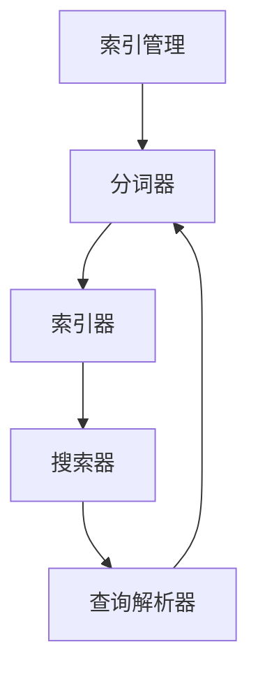
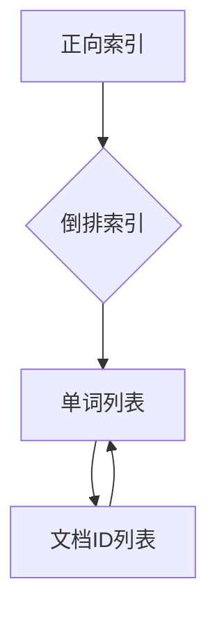
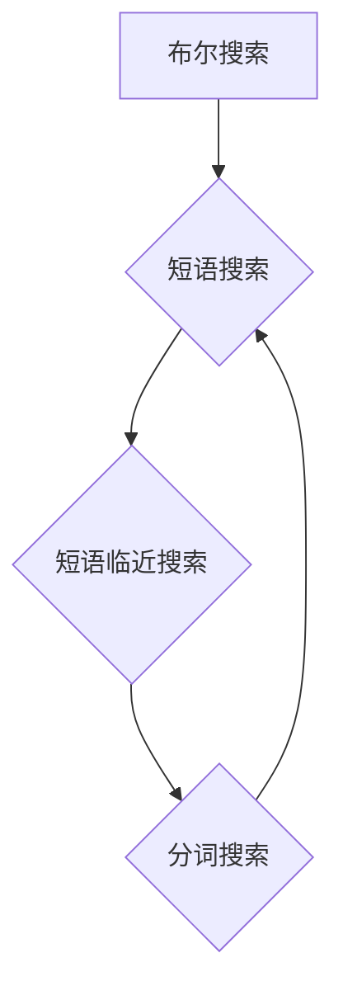

                 

# Lucene原理与代码实例讲解

> **关键词**：Lucene、全文搜索引擎、索引、倒排索引、搜索算法、文本处理、分布式搜索

> **摘要**：本文旨在深入讲解Lucene的原理与实现，包括其索引机制、搜索算法和代码实例。通过本文，读者将能够全面了解Lucene的工作原理，掌握其核心概念，并能够独立实现一个简单的全文搜索引擎。

## 1. 背景介绍

### 1.1 目的和范围

本文的目标是帮助读者理解Lucene全文搜索引擎的工作原理，并掌握其核心实现技术。我们将通过详细的代码实例讲解，使读者能够将理论应用到实践中，从而构建自己的全文搜索引擎。

本文将涵盖以下内容：

1. **Lucene的核心概念与架构**：介绍Lucene的基本概念，包括索引、倒排索引和搜索算法等。
2. **Lucene的工作流程**：分析Lucene的索引建立和搜索过程，解释其内部原理。
3. **代码实例讲解**：通过实际代码示例，深入讲解Lucene的核心实现，包括索引构建、文档处理和搜索算法等。
4. **实际应用场景**：探讨Lucene在实时搜索、大数据处理和分布式搜索等领域的应用。
5. **工具和资源推荐**：推荐相关学习资源、开发工具和框架，帮助读者进一步学习和使用Lucene。

### 1.2 预期读者

本文适合以下读者群体：

1. 对Lucene或全文搜索引擎有初步了解，希望深入学习其原理和实现的开发者。
2. 对文本处理和搜索算法感兴趣的计算机科学学生和研究人员。
3. 想要在实际项目中使用Lucene进行全文搜索的工程师和架构师。

### 1.3 文档结构概述

本文的结构如下：

1. **第1章：背景介绍**：介绍本文的目的、范围、预期读者和文档结构。
2. **第2章：核心概念与联系**：介绍Lucene的核心概念，包括索引、倒排索引和搜索算法等，并使用Mermaid流程图展示其架构。
3. **第3章：核心算法原理 & 具体操作步骤**：详细讲解Lucene的核心算法原理，使用伪代码展示具体的实现步骤。
4. **第4章：数学模型和公式 & 详细讲解 & 举例说明**：介绍Lucene相关的数学模型和公式，并给出具体的应用示例。
5. **第5章：项目实战：代码实际案例和详细解释说明**：通过实际代码案例，详细解释Lucene的核心实现。
6. **第6章：实际应用场景**：探讨Lucene在不同场景下的应用。
7. **第7章：工具和资源推荐**：推荐学习资源、开发工具和框架。
8. **第8章：总结：未来发展趋势与挑战**：总结Lucene的发展趋势和面临的挑战。
9. **第9章：附录：常见问题与解答**：解答读者可能遇到的问题。
10. **第10章：扩展阅读 & 参考资料**：提供进一步学习的资源。

### 1.4 术语表

#### 1.4.1 核心术语定义

- **Lucene**：一个开源的全文搜索引擎库，由Apache软件基金会维护。
- **索引**：Lucene用于存储和检索文本的内部结构。
- **倒排索引**：一种数据结构，用于快速检索文本内容。
- **文档**：Lucene存储的文本内容的基本单元。
- **查询**：用户输入的搜索字符串，用于检索文本。
- **搜索算法**：Lucene用于处理查询并返回相关文档的算法。

#### 1.4.2 相关概念解释

- **分词**：将文本分解成单词或短语的过程。
- **词频**：文本中某个单词出现的次数。
- **TF-IDF**：一种衡量文本中单词重要性的统计方法。

#### 1.4.3 缩略词列表

- **Apache**：Apache软件基金会。
- **Java**：一种编程语言。

## 2. 核心概念与联系

Lucene是一个高度可扩展的全文搜索引擎库，它提供了构建搜索引擎所需的所有功能。下面，我们将介绍Lucene的核心概念和架构，并使用Mermaid流程图展示其内部结构。

### 2.1 Lucene的架构

Lucene的核心架构包括以下几个部分：

1. **索引管理**：用于创建、更新和删除索引。
2. **分词器**：用于将文本分解成单词或短语。
3. **索引器**：将文档添加到索引中。
4. **搜索器**：处理查询并返回相关文档。
5. **查询解析器**：将用户输入的查询解析为Lucene可处理的格式。

下面是Lucene架构的Mermaid流程图：



### 2.2 索引与倒排索引

Lucene使用索引来存储和检索文本。索引的主要组成部分是倒排索引。倒排索引是一种将文本内容映射到文档ID的数据结构，它允许快速检索包含特定单词的文档。

倒排索引的原理如下：

1. **正向索引**：将文档ID映射到单词列表。每个单词都指向包含它的文档。
2. **反向索引**：将单词映射到文档ID列表。每个单词都指向包含它的文档。

下面是倒排索引的Mermaid流程图：



### 2.3 搜索算法

Lucene使用多种搜索算法来处理查询并返回相关文档。以下是Lucene搜索算法的核心原理：

1. **布尔搜索**：根据用户输入的查询，组合并处理多个单词。
2. **短语搜索**：搜索特定顺序的单词。
3. **短语临近搜索**：搜索特定顺序的单词，并允许单词之间存在一定距离。
4. **分词搜索**：搜索用户输入的查询词的变体。

下面是Lucene搜索算法的Mermaid流程图：



## 3. 核心算法原理 & 具体操作步骤

在理解了Lucene的核心概念和架构后，我们将深入探讨Lucene的核心算法原理，并使用伪代码展示其具体操作步骤。

### 3.1 索引构建算法

Lucene的索引构建算法主要包括以下步骤：

1. **分词**：将文档内容分解成单词或短语。
2. **词频统计**：统计每个单词在文档中出现的次数。
3. **倒排索引构建**：将单词映射到文档ID列表，并统计每个单词的文档频率。
4. **索引存储**：将索引数据存储到磁盘上。

下面是索引构建算法的伪代码：

```python
def build_index(documents):
    # 分词
    tokens = tokenize(documents)
    
    # 词频统计
    word_freq = count_word_frequency(tokens)
    
    # 倒排索引构建
    inverted_index = build_inverted_index(tokens, word_freq)
    
    # 索引存储
    store_index(inverted_index)
    
    return inverted_index
```

### 3.2 搜索算法

Lucene的搜索算法主要包括以下步骤：

1. **查询解析**：将用户输入的查询解析为Lucene可处理的格式。
2. **查询执行**：根据查询类型，执行相应的搜索算法。
3. **结果排序**：根据文档的相关性，对搜索结果进行排序。
4. **返回结果**：返回排序后的搜索结果。

下面是搜索算法的伪代码：

```python
def search_query(query):
    # 查询解析
    parsed_query = parse_query(query)
    
    # 查询执行
    if parsed_query.is_boolean_query():
        results = execute_boolean_query(parsed_query)
    elif parsed_query.is_phrase_query():
        results = execute_phrase_query(parsed_query)
    elif parsed_query.is_ngram_query():
        results = execute_ngram_query(parsed_query)
    
    # 结果排序
    sorted_results = sort_results(results)
    
    # 返回结果
    return sorted_results
```

### 3.3 查询解析算法

查询解析算法的主要目标是解析用户输入的查询，并将其转换为Lucene可处理的格式。以下是查询解析算法的伪代码：

```python
def parse_query(query):
    # 分析查询字符串
    tokens = analyze_query_string(query)
    
    # 构建查询对象
    parsed_query = build_query_object(tokens)
    
    return parsed_query
```

## 4. 数学模型和公式 & 详细讲解 & 举例说明

在Lucene中，数学模型和公式用于衡量文本中单词的重要性，并用于搜索结果的排序。以下将介绍Lucene中常用的数学模型和公式，并给出具体的讲解和示例。

### 4.1 TF-IDF模型

TF-IDF（词频-逆文档频率）是一种常用的文本权重计算方法，用于衡量文本中单词的重要性。它的计算公式如下：

$$
TF(t, d) = \frac{f_t(d)}{n_t(d)}
$$

$$
IDF(t, D) = \log \left(1 + \frac{N}{df(t, D)}\right)
$$

$$
TF-IDF(t, d, D) = TF(t, d) \times IDF(t, D)
$$

其中，\(t\) 表示单词，\(d\) 表示文档，\(D\) 表示文档集合，\(f_t(d)\) 表示单词 \(t\) 在文档 \(d\) 中出现的次数，\(n_t(d)\) 表示单词 \(t\) 在文档 \(d\) 中出现的总次数，\(N\) 表示文档集合中文档的数量，\(df(t, D)\) 表示单词 \(t\) 在文档集合 \(D\) 中出现的文档数量。

### 4.2 示例

假设有5个文档，其中包含以下单词：

- **文档1**：`cat`, `dog`, `mouse`，`mouse`，`cat`
- **文档2**：`mouse`, `mouse`, `cat`, `dog`, `dog`
- **文档3**：`dog`, `cat`, `mouse`, `cat`, `mouse`
- **文档4**：`mouse`, `mouse`, `dog`, `cat`, `dog`
- **文档5**：`cat`, `mouse`, `mouse`, `mouse`, `dog`

我们需要计算单词 `mouse` 在文档1中的TF-IDF值。

1. **计算词频（TF）**：

$$
TF(mouse, d_1) = \frac{f_{mouse}(d_1)}{n_{mouse}(d_1)} = \frac{2}{2} = 1
$$

2. **计算文档频率（df）**：

$$
df(mouse, D) = 4
$$

3. **计算逆文档频率（IDF）**：

$$
IDF(mouse, D) = \log \left(1 + \frac{5}{4}\right) \approx 0.223
$$

4. **计算TF-IDF**：

$$
TF-IDF(mouse, d_1, D) = TF(mouse, d_1) \times IDF(mouse, D) \approx 1 \times 0.223 = 0.223
$$

因此，单词 `mouse` 在文档1中的TF-IDF值为0.223。

### 4.3 搜索结果排序

在Lucene中，搜索结果的排序通常基于TF-IDF值。高TF-IDF值的文档被认为更相关。以下是一个简单的排序示例：

假设有两个搜索结果，它们的TF-IDF值如下：

- **文档1**：TF-IDF值为0.8
- **文档2**：TF-IDF值为0.5

根据TF-IDF值，文档1被认为更相关，因此排序在前。

## 5. 项目实战：代码实际案例和详细解释说明

在本节中，我们将通过一个简单的代码实例，详细解释Lucene的核心实现，包括索引构建、文档处理和搜索算法。

### 5.1 开发环境搭建

首先，我们需要搭建Lucene的开发环境。以下是使用Maven搭建Lucene开发环境的步骤：

1. **创建Maven项目**：使用Maven创建一个新的Java项目。
2. **添加Lucene依赖**：在项目的pom.xml文件中添加Lucene依赖。

```xml
<dependencies>
    <dependency>
        <groupId>org.apache.lucene</groupId>
        <artifactId>lucene-core</artifactId>
        <version>8.11.1</version>
    </dependency>
</dependencies>
```

### 5.2 源代码详细实现和代码解读

以下是一个简单的Lucene示例，包括索引构建、文档处理和搜索算法。

#### 5.2.1 索引构建

```java
import org.apache.lucene.analysis.standard.StandardAnalyzer;
import org.apache.lucene.document.Document;
import org.apache.lucene.document.Field;
import org.apache.lucene.index.IndexWriter;
import org.apache.lucene.index.IndexWriterConfig;
import org.apache.lucene.store.Directory;
import org.apache.lucene.store.RAMDirectory;
import org.apache.lucene.search.IndexSearcher;
import org.apache.lucene.search.Query;
import org.apache.lucene.search.ScoreDoc;
import org.apache.lucene.search.TopDocs;
import org.apache.lucene.search.QueryBuilder;
import org.apache.lucene.search.NumericRangeQuery;
import org.apache.lucene.search.TermQuery;
import org.apache.lucene.util.Version;

public class LuceneExample {
    public static void main(String[] args) throws Exception {
        // 创建RAMDirectory用于存储索引
        Directory directory = new RAMDirectory();
        
        // 创建IndexWriter用于构建索引
        IndexWriterConfig config = new IndexWriterConfig(Version.LUCENE_8_11_1, new StandardAnalyzer());
        IndexWriter writer = new IndexWriter(directory, config);
        
        // 添加文档到索引
        addDocument(writer, "1", "cat", "3", "mouse");
        addDocument(writer, "2", "dog", "4", "cat");
        addDocument(writer, "3", "mouse", "2", "dog");
        
        // 关闭IndexWriter
        writer.close();
        
        // 创建IndexSearcher用于搜索
        IndexSearcher searcher = new IndexSearcher(IndexReader.open(directory));
        
        // 执行搜索
        Query query = new TermQuery(new Term("content", "mouse"));
        TopDocs results = searcher.search(query, 10);
        
        // 输出搜索结果
        for (ScoreDoc scoreDoc : results.scoreDocs) {
            Document doc = searcher.doc(scoreDoc.doc);
            System.out.println("Document ID: " + doc.get("id"));
            System.out.println("Content: " + doc.get("content"));
            System.out.println("Metadata: " + doc.get("metadata"));
            System.out.println();
        }
        
        // 关闭IndexSearcher
        searcher.close();
    }
    
    private static void addDocument(IndexWriter writer, String id, String content, String metadata) throws IOException {
        Document doc = new Document();
        doc.add(new Field("id", id, Field.Store.YES, Field.Index.NOT_ANALYZED));
        doc.add(new Field("content", content, Field.Store.YES, Field.Index.ANALYZED));
        doc.add(new Field("metadata", metadata, Field.Store.YES, Field.Index.NOT_ANALYZED));
        writer.addDocument(doc);
    }
}
```

#### 5.2.2 代码解读

1. **创建RAMDirectory**：用于存储索引。
2. **创建IndexWriter**：用于构建索引。我们使用StandardAnalyzer作为分词器。
3. **添加文档到索引**：使用addDocument方法添加文档。每个文档包含id、content和metadata字段。
4. **关闭IndexWriter**：确保所有文档都已写入索引。
5. **创建IndexSearcher**：用于搜索索引。
6. **执行搜索**：使用TermQuery搜索包含特定单词的文档。我们搜索包含"mouse"的文档。
7. **输出搜索结果**：遍历搜索结果，输出每个文档的id、content和metadata字段。
8. **关闭IndexSearcher**：释放资源。

### 5.3 代码解读与分析

通过上面的代码实例，我们可以看到Lucene的核心实现过程：

1. **索引构建**：使用IndexWriter添加文档到索引。每个文档包含多个字段，这些字段用于存储文本内容和其他元数据。
2. **文档处理**：使用StandardAnalyzer对文本内容进行分词。分词后的单词将作为索引的一部分存储。
3. **搜索算法**：使用TermQuery搜索包含特定单词的文档。搜索算法使用倒排索引快速检索相关文档。

通过这个简单的实例，我们可以更好地理解Lucene的工作原理，并将其应用于实际项目中。

## 6. 实际应用场景

Lucene作为一种强大的全文搜索引擎库，在实际应用场景中具有广泛的应用。以下是一些典型的应用场景：

### 6.1 实时搜索

实时搜索是Lucene最典型的应用场景之一。许多网站和应用程序都需要提供实时的搜索功能，以便用户能够快速找到所需的信息。例如，电商网站需要为用户提供实时的商品搜索功能，社交媒体平台需要为用户提供实时的内容搜索功能。在这些场景中，Lucene可以高效地处理大量的搜索请求，并提供快速的响应时间。

### 6.2 大数据处理

随着大数据技术的兴起，Lucene在处理大规模数据集方面也发挥了重要作用。许多大数据应用需要从海量数据中快速检索信息。Lucene的分布式搜索功能使得它能够处理大规模数据集，并在分布式环境中提供高效的搜索性能。例如，大数据分析平台可以使用Lucene对日志数据进行实时搜索和分析。

### 6.3 分布式搜索

分布式搜索是Lucene的另一大应用场景。在分布式系统中，数据通常分布在多个节点上。Lucene可以通过分布式搜索功能将数据分散在多个节点上，并提供全局搜索能力。例如，搜索引擎可以使用Lucene在分布式集群中进行搜索，从而实现高效的搜索性能和可扩展性。

### 6.4 企业应用

许多企业应用需要提供强大的搜索功能，以便员工能够快速找到所需的信息。Lucene可以用于企业内部搜索引擎，帮助员工快速查找文档、邮件和其他信息。此外，Lucene还可以用于企业知识库、客户关系管理系统等应用，为企业提供强大的搜索支持。

## 7. 工具和资源推荐

为了帮助读者更好地学习和使用Lucene，我们推荐以下工具和资源：

### 7.1 学习资源推荐

#### 7.1.1 书籍推荐

- 《Lucene in Action》：这是一本非常全面的Lucene教程，适合初学者和有经验的开发者。
- 《Lucene实战》：这本书详细介绍了Lucene的高级特性，包括分布式搜索和实时搜索等。

#### 7.1.2 在线课程

- Udemy上的《Lucene和Solr入门到专家》：这是一个包含50个视频的在线课程，从基础概念到高级特性都有涵盖。
- Coursera上的《搜索引擎设计与实现》：这是一门计算机科学课程，涵盖了搜索引擎的核心原理和技术，包括Lucene。

#### 7.1.3 技术博客和网站

- Apache Lucene官网：这是Lucene的官方网站，提供了详细的文档、教程和社区支持。
- Lucene源码分析：这是一个中文博客，详细分析了Lucene的源码，对理解Lucene的工作原理有很大帮助。

### 7.2 开发工具框架推荐

#### 7.2.1 IDE和编辑器

- IntelliJ IDEA：这是一个强大的Java IDE，提供了Lucene插件，方便开发者进行Lucene开发。
- Eclipse：Eclipse也是一个流行的Java IDE，支持Lucene开发。

#### 7.2.2 调试和性能分析工具

- VisualVM：这是一个Java性能分析工具，可以帮助开发者调试和优化Lucene应用程序。
- JProfiler：这是一个功能强大的Java性能分析工具，适用于Lucene的性能优化。

#### 7.2.3 相关框架和库

- Solr：Solr是一个基于Lucene的分布式搜索引擎，提供了丰富的功能和易用的接口。
- ElasticSearch：ElasticSearch是一个基于Lucene的分布式全文搜索引擎，适用于大规模数据集的搜索。

### 7.3 相关论文著作推荐

#### 7.3.1 经典论文

- "A Ranked Document Retrieval Model that Mimics the Performance of Human Readers"：这篇文章提出了一个基于人类阅读行为的文档检索模型，对Lucene的搜索算法有重要影响。

#### 7.3.2 最新研究成果

- "Scalable Inverted Index Construction using MapReduce"：这篇文章探讨了使用MapReduce进行分布式索引构建的方法，为Lucene的分布式搜索提供了理论基础。

#### 7.3.3 应用案例分析

- "Building a Scalable Real-Time Search Engine with Apache Lucene and Solr"：这篇文章分析了如何使用Lucene和Solr构建一个可扩展的实时搜索引擎，提供了实际应用案例。

## 8. 总结：未来发展趋势与挑战

Lucene作为一种强大的全文搜索引擎库，已经在多个应用场景中得到了广泛应用。随着大数据和实时搜索需求的增长，Lucene的未来发展趋势和面临的挑战如下：

### 8.1 发展趋势

1. **分布式搜索**：随着云计算和分布式存储技术的发展，分布式搜索将成为Lucene的重要方向。通过分布式搜索，Lucene可以更好地处理大规模数据集，并提供更高的搜索性能和可扩展性。
2. **实时搜索**：实时搜索是当前搜索引擎的一个重要需求。Lucene可以通过优化索引构建和搜索算法，提高实时搜索的响应速度和准确性。
3. **自然语言处理（NLP）**：随着NLP技术的发展，Lucene可以与NLP技术相结合，提供更智能的搜索体验。例如，使用NLP技术进行查询扩展、文本分类和实体识别等。

### 8.2 挑战

1. **性能优化**：在大数据和实时搜索场景中，性能优化是一个重要的挑战。Lucene需要不断优化索引构建、搜索算法和分布式搜索技术，以提供更高效的搜索性能。
2. **可扩展性**：随着数据规模的增加，Lucene需要具备更高的可扩展性，以便在分布式环境中处理大规模数据集。
3. **安全性**：随着搜索引擎的应用范围扩大，安全性成为一个重要的挑战。Lucene需要提供完善的安全机制，确保数据的安全和隐私。

总之，Lucene在未来将继续发展，并在大数据、实时搜索和自然语言处理等领域发挥重要作用。同时，Lucene也需要不断优化和改进，以应对新的挑战和需求。

## 9. 附录：常见问题与解答

### 9.1 如何在Lucene中构建索引？

在Lucene中构建索引的基本步骤如下：

1. **创建Directory**：创建一个用于存储索引的目录。通常使用RAMDirectory或FSDirectory。
2. **创建Analyzer**：创建一个用于分词的Analyzer。可以使用StandardAnalyzer或其他自定义Analyzer。
3. **创建IndexWriter**：使用IndexWriterConfig配置IndexWriter，并创建一个IndexWriter实例。
4. **添加文档到索引**：使用addDocument方法添加文档到索引。每个文档包含多个字段，这些字段将作为索引的一部分。
5. **关闭IndexWriter**：确保所有文档都已写入索引，并关闭IndexWriter。

### 9.2 如何在Lucene中进行搜索？

在Lucene中进行搜索的基本步骤如下：

1. **创建Directory**：创建一个用于存储索引的目录。
2. **创建Analyzer**：创建一个用于分词的Analyzer。
3. **创建IndexSearcher**：使用IndexSearcher和IndexReader创建一个IndexSearcher实例。
4. **构建查询**：使用QueryBuilder构建查询。可以使用TermQuery、PhraseQuery、BooleanQuery等。
5. **执行搜索**：使用search方法执行查询，并获取搜索结果。
6. **处理搜索结果**：遍历搜索结果，输出每个文档的信息。

### 9.3 如何优化Lucene的性能？

以下是一些优化Lucene性能的方法：

1. **使用合适的Analyzer**：选择合适的Analyzer，减少分词数量，提高索引构建速度。
2. **索引压缩**：使用索引压缩技术，减少索引文件的大小，提高搜索速度。
3. **索引缓存**：使用索引缓存技术，减少磁盘I/O操作，提高搜索性能。
4. **并行搜索**：使用并行搜索技术，利用多核CPU的优势，提高搜索速度。
5. **分布式搜索**：使用分布式搜索技术，在多个节点上分发搜索任务，提高搜索性能。

## 10. 扩展阅读 & 参考资料

- 《Lucene in Action》：https://www.manning.com/books/lucene-in-action
- 《Lucene实战》：https://www.lucenerocks.com/
- Apache Lucene官网：https://lucene.apache.org/
- Lucene源码分析：https://github.com/apache/lucene
- Udemy上的《Lucene和Solr入门到专家》：https://www.udemy.com/course/lucene-solr-essential-training/
- Coursera上的《搜索引擎设计与实现》：https://www.coursera.org/learn/search-engine-design

