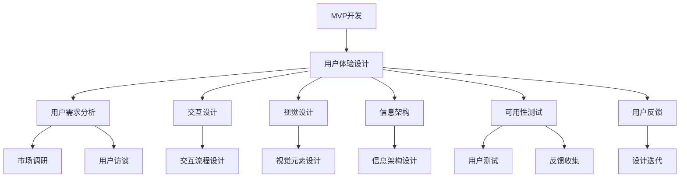

                 

# MVP开发中的用户体验设计要点

## 关键词
- MVP开发
- 用户体验设计
- 用户需求分析
- 设计原则
- 原型设计
- 测试与反馈

## 摘要
本文旨在探讨MVP（最小可行产品）开发中的用户体验设计要点。通过详细解析用户体验设计的核心概念、步骤和关键要素，文章将帮助开发者理解和应用有效的用户体验设计方法，从而提高MVP的成功率和用户满意度。文章将从背景介绍、核心概念、算法原理、数学模型、项目实战、实际应用场景、工具和资源推荐等多个方面进行全面探讨，以期为MVP开发中的用户体验设计提供实用的指导和深刻的见解。

<|assistant|>## 1. 背景介绍

### 1.1 目的和范围
MVP（最小可行产品）开发是一种快速验证商业想法和用户需求的方法。它强调以最少的资源投入构建一个基本功能的产品原型，以便尽快投入市场并获取用户反馈。用户体验设计（User Experience Design，简称UXD）则是确保产品在使用过程中能够满足用户需求和期望的过程。本文的目的在于分析MVP开发中的用户体验设计要点，探讨如何通过良好的用户体验设计提升产品的市场竞争力。

本文将涵盖以下内容：
- MVP开发的基本概念和过程
- 用户体验设计的核心概念和方法
- 用户体验设计在MVP开发中的应用步骤
- 用户体验设计的评估和优化方法
- 相关工具和资源的推荐

### 1.2 预期读者
本文预期读者包括：
- MVP开发者：希望了解如何通过用户体验设计提升产品的实用性和市场竞争力
- 产品经理：需要掌握用户体验设计的基本方法和实践技巧
- UI/UX设计师：希望深入了解用户体验设计在MVP开发中的应用
- 技术爱好者：对用户体验设计有兴趣，希望学习相关理论和方法

### 1.3 文档结构概述
本文结构如下：
1. 背景介绍
   - 目的和范围
   - 预期读者
   - 文档结构概述
2. 核心概念与联系
   - MVP和用户体验设计的关系
   - 用户体验设计的关键要素
3. 核心算法原理 & 具体操作步骤
   - 用户需求分析
   - 原型设计
   - 用户测试与反馈
4. 数学模型和公式 & 详细讲解 & 举例说明
   - 用户满意度评估模型
   - 任务完成效率模型
5. 项目实战：代码实际案例和详细解释说明
   - MVP开发环境搭建
   - 用户体验设计实践案例
6. 实际应用场景
   - MVP在不同领域的应用案例
7. 工具和资源推荐
   - 学习资源
   - 开发工具框架
   - 相关论文著作
8. 总结：未来发展趋势与挑战
9. 附录：常见问题与解答
10. 扩展阅读 & 参考资料

### 1.4 术语表

#### 1.4.1 核心术语定义

- MVP（最小可行产品）：一种最初版本的产品，它包含了产品最核心的功能，旨在最小化资源投入的同时验证商业想法和用户需求。
- 用户体验设计（User Experience Design，简称UXD）：涉及产品使用过程中的感知、行为和情感，旨在优化用户与产品之间的交互体验。
- 用户需求分析：通过市场调研、用户访谈等方法收集和分析用户需求，为产品设计提供依据。
- 原型设计：构建产品原型，以便测试和迭代，验证设计的可行性和有效性。
- 用户测试与反馈：通过实际用户对产品的使用体验，收集反馈并进行评估和优化。

#### 1.4.2 相关概念解释

- UI（用户界面设计）：设计产品界面，使其易于使用和操作。
- UX（用户体验设计）：关注用户在使用产品过程中的整体体验，包括感知、行为和情感。
- 需求验证：通过市场调研、用户访谈等方法验证产品的商业想法和用户需求是否匹配。

#### 1.4.3 缩略词列表

- MVP：最小可行产品
- UXD：用户体验设计
- UI：用户界面设计
- UX：用户体验设计
- A/B测试：一种对比测试方法，通过比较不同设计版本的用户行为和反馈，评估其优劣。

<|assistant|>## 2. 核心概念与联系

### MVP和用户体验设计的关系

MVP和用户体验设计之间存在密切的联系。MVP的目标是通过最小化资源投入来验证商业想法和用户需求，而用户体验设计则关注如何优化产品与用户之间的交互，提高用户满意度。以下是MVP和用户体验设计之间的联系：

- MVP开发的核心在于快速验证商业想法和用户需求，用户体验设计则为这一过程提供了指导。通过用户体验设计，开发者可以确保产品的核心功能满足用户需求，从而提高MVP的成功率。
- 用户体验设计在MVP开发中起着关键作用。一个良好的用户体验设计能够提高产品的可用性、易用性和用户满意度，从而增加用户粘性，为产品的长期发展奠定基础。
- MVP开发中的用户体验设计需要遵循简洁性原则，确保产品功能简洁明了，避免不必要的复杂性和冗余，以减少用户的认知负担。

### 用户体验设计的关键要素

用户体验设计涉及多个关键要素，包括但不限于以下方面：

- **用户需求分析**：通过市场调研、用户访谈等方法，收集和分析用户需求，为产品设计提供依据。
- **交互设计**：设计产品与用户之间的交互流程，确保用户能够轻松、高效地完成任务。
- **视觉设计**：设计产品的视觉界面，使其美观、统一，提高用户的视觉体验。
- **信息架构**：构建产品的信息架构，确保用户能够快速找到所需信息。
- **可用性测试**：通过实际用户对产品的使用体验，收集反馈并进行评估和优化。
- **用户反馈**：持续收集用户反馈，并根据反馈对产品设计进行迭代优化。

### 核心概念原理和架构的 Mermaid 流程图



<|assistant|>## 3. 核心算法原理 & 具体操作步骤

### 用户需求分析

用户需求分析是用户体验设计的首要任务，它涉及到了解用户的需求和期望，从而为产品设计提供指导。以下是用户需求分析的具体操作步骤：

#### 3.1.1 市场调研

- **步骤1**：确定调研目标，包括产品类型、目标用户群体、市场趋势等。
- **步骤2**：选择合适的调研方法，如问卷调查、深度访谈、用户访谈等。
- **步骤3**：设计调研问卷或访谈提纲，确保问题针对性强、具有代表性。
- **步骤4**：实施调研，收集用户反馈和数据。
- **步骤5**：分析和整理调研结果，提取关键需求和用户痛点。

#### 3.1.2 用户访谈

- **步骤1**：确定访谈对象，选择具有代表性的用户。
- **步骤2**：准备访谈提纲，涵盖用户的需求、使用场景、痛点等。
- **步骤3**：进行一对一或小组访谈，记录用户的反馈和建议。
- **步骤4**：整理访谈内容，提取关键需求和用户痛点。
- **步骤5**：与团队成员分享访谈结果，共同讨论和制定产品设计方案。

### 原型设计

原型设计是将用户需求转化为可视化的设计过程。以下是原型设计的具体操作步骤：

#### 3.2.1 原型制作

- **步骤1**：选择合适的原型工具，如Sketch、Figma、Axure等。
- **步骤2**：根据用户需求分析结果，设计产品的界面布局和交互流程。
- **步骤3**：制作产品原型，包括主页、功能页面、交互细节等。
- **步骤4**：与团队成员和利益相关者分享原型，收集反馈和建议。
- **步骤5**：根据反馈对原型进行修改和优化，确保设计符合用户需求。

### 用户测试与反馈

用户测试与反馈是验证原型设计和优化用户体验的关键步骤。以下是用户测试与反馈的具体操作步骤：

#### 3.3.1 测试设计

- **步骤1**：确定测试目标，包括测试任务、评估指标等。
- **步骤2**：设计测试场景，模拟用户实际使用产品的情境。
- **步骤3**：准备测试工具，如观察工具、问卷、用户访谈等。
- **步骤4**：招募测试用户，确保样本具有代表性。

#### 3.3.2 测试实施

- **步骤1**：向测试用户解释测试目的和流程。
- **步骤2**：让测试用户按照测试任务使用产品原型。
- **步骤3**：观察和记录测试用户的行为和反馈。
- **步骤4**：收集测试数据，如任务完成时间、错误率、用户满意度等。

#### 3.3.3 反馈分析

- **步骤1**：整理和分析测试数据，识别问题和不足之处。
- **步骤2**：与团队成员和利益相关者分享测试结果。
- **步骤3**：讨论和制定改进方案，对产品原型进行修改和优化。

### 伪代码

以下是用户需求分析、原型设计和用户测试与反馈的伪代码：

```python
# 用户需求分析
def user_requirement_analysis():
    market_research()
    user_interviews()
    analyze_requirements()

# 原型设计
def prototype_design():
    select_prototyping_tool()
    design_interface_layout()
    create_prototype()
    collect_feedback()

# 用户测试与反馈
def user_testing_and_feedback():
    test_design()
    test_implement()
    collect_test_data()
    analyze_feedback()
```

<|assistant|>## 4. 数学模型和公式 & 详细讲解 & 举例说明

### 用户满意度评估模型

用户满意度是衡量用户体验的重要指标之一。以下是一个简单的用户满意度评估模型，用于计算用户对产品的整体满意度：

\[ \text{User Satisfaction} = \frac{\text{Positive Experience} + \text{Neutral Experience}}{\text{Total Experiences}} \]

#### 详细讲解

- **Positive Experience（积极体验）**：用户在使用产品过程中感到满意的体验部分，通常由功能完整性、界面美观度、交互流畅性等因素决定。
- **Neutral Experience（中性体验）**：用户在使用产品过程中感到一般的体验部分，通常由功能稳定性、响应速度、信息准确性等因素决定。
- **Total Experiences（总体验）**：用户在使用产品过程中的所有体验部分，包括积极体验、中性体验和消极体验。

#### 举例说明

假设用户在使用某款APP时，有10次互动体验，其中7次体验感到满意，3次体验感到一般。根据上述公式，用户满意度计算如下：

\[ \text{User Satisfaction} = \frac{7 + 3}{10} = 0.8 \]

### 任务完成效率模型

任务完成效率是衡量用户体验的另一个重要指标，用于评估用户完成特定任务的速度和准确性。以下是一个简单的任务完成效率模型：

\[ \text{Task Efficiency} = \frac{\text{Total Task Time}}{\text{Total Number of Tasks}} \]

#### 详细讲解

- **Total Task Time（总任务时间）**：用户完成所有任务所花费的总时间。
- **Total Number of Tasks（总任务数）**：用户需要完成的任务总数。

#### 举例说明

假设用户需要完成5个任务，分别耗时2分钟、3分钟、4分钟、5分钟和6分钟。根据上述公式，任务完成效率计算如下：

\[ \text{Task Efficiency} = \frac{2 + 3 + 4 + 5 + 6}{5} = 4 \]

这意味着用户平均每分钟完成1个任务。

### 用户流失率模型

用户流失率是衡量用户体验持续性的重要指标，用于评估用户在一段时间内停止使用产品的比例。以下是一个简单的用户流失率模型：

\[ \text{Churn Rate} = \frac{\text{Lost Users}}{\text{Total Users}} \times 100\% \]

#### 详细讲解

- **Lost Users（流失用户）**：在特定时间段内停止使用产品的用户数量。
- **Total Users（总用户数）**：产品当前的所有用户数量。

#### 举例说明

假设在一个季度内，有1000个用户，其中200个用户停止使用产品。根据上述公式，用户流失率计算如下：

\[ \text{Churn Rate} = \frac{200}{1000} \times 100\% = 20\% \]

这意味着每5个用户中就有1个用户流失。

### 用户留存率模型

用户留存率是衡量用户体验持续性的另一个重要指标，用于评估用户在一段时间内继续使用产品的比例。以下是一个简单的用户留存率模型：

\[ \text{Retention Rate} = \frac{\text{Active Users}}{\text{Total Users}} \times 100\% \]

#### 详细讲解

- **Active Users（活跃用户）**：在特定时间段内继续使用产品的用户数量。
- **Total Users（总用户数）**：产品当前的所有用户数量。

#### 举例说明

假设在一个季度内，有1000个用户，其中800个用户继续使用产品。根据上述公式，用户留存率计算如下：

\[ \text{Retention Rate} = \frac{800}{1000} \times 100\% = 80\% \]

这意味着每5个用户中就有4个用户继续使用产品。

### 用户体验评分模型

用户体验评分是用户对产品整体体验的量化评价，通常采用5分制或10分制。以下是一个简单的用户体验评分模型：

\[ \text{User Experience Score} = \frac{\sum (\text{User Ratings})}{\text{Number of Users}} \]

#### 详细讲解

- **User Ratings（用户评分）**：每个用户对产品体验的评分，通常为1到5分或1到10分。
- **Number of Users（用户数量）**：参与评分的用户数量。

#### 举例说明

假设有10个用户对某款APP进行了评分，评分分别为4、5、3、4、5、4、5、3、4、5。根据上述公式，用户体验评分计算如下：

\[ \text{User Experience Score} = \frac{4 + 5 + 3 + 4 + 5 + 4 + 5 + 3 + 4 + 5}{10} = 4.2 \]

这意味着该APP的用户体验评分为4.2分。

<|assistant|>## 5. 项目实战：代码实际案例和详细解释说明

### 5.1 开发环境搭建

在开始MVP开发之前，我们需要搭建一个合适的开发环境。以下是开发环境搭建的具体步骤：

#### 步骤1：安装操作系统

首先，我们需要选择一个合适的操作系统。对于Web应用开发，我们可以选择Windows、macOS或Linux。在这里，我们以macOS为例。

1. 访问苹果官网，下载并安装macOS。
2. 完成安装后，重启计算机并设置用户名和密码。

#### 步骤2：安装开发工具

接下来，我们需要安装一些开发工具，如代码编辑器、版本控制系统和构建工具。

1. 安装Visual Studio Code：访问Visual Studio Code官网，下载并安装。
2. 安装Git：访问Git官网，下载并安装。
3. 安装Node.js：访问Node.js官网，下载并安装。

#### 步骤3：配置开发环境

在安装完开发工具后，我们需要进行一些配置。

1. 打开Visual Studio Code，安装以下扩展插件：
   - Git Lens
   - Prettier - Code formatter
   - ESLint
   - Markdown All in One
2. 配置Git，设置用户名和邮箱。

```bash
git config --global user.name "Your Name"
git config --global user.email "your-email@example.com"
```

#### 步骤4：创建项目文件夹

在桌面或合适的位置创建一个名为“MVP_project”的文件夹，用于存储项目的所有文件。

```bash
mkdir MVP_project
cd MVP_project
```

#### 步骤5：初始化项目

在项目文件夹中初始化一个Git仓库，以便进行版本控制和团队协作。

```bash
git init
```

### 5.2 源代码详细实现和代码解读

#### 步骤1：创建前端代码

在前端部分，我们将使用HTML、CSS和JavaScript来构建一个简单的Web页面。以下是前端代码的详细实现和解读。

##### HTML（index.html）

```html
<!DOCTYPE html>
<html lang="en">
<head>
    <meta charset="UTF-8">
    <meta name="viewport" content="width=device-width, initial-scale=1.0">
    <title>MVP Project</title>
    <link rel="stylesheet" href="styles.css">
</head>
<body>
    <header>
        <h1>MVP Project</h1>
    </header>
    <main>
        <section>
            <h2>About Us</h2>
            <p>We are a team of passionate developers building innovative solutions.</p>
        </section>
        <section>
            <h2>Contact Us</h2>
            <form>
                <label for="name">Name:</label>
                <input type="text" id="name" name="name" required>
                <label for="email">Email:</label>
                <input type="email" id="email" name="email" required>
                <label for="message">Message:</label>
                <textarea id="message" name="message" required></textarea>
                <button type="submit">Submit</button>
            </form>
        </section>
    </main>
    <footer>
        <p>&copy; 2022 MVP Project. All rights reserved.</p>
    </footer>
    <script src="scripts.js"></script>
</body>
</html>
```

- **HTML结构**：定义了页面的基本结构，包括头部、主体和底部。
- **About Us**：介绍团队的信息。
- **Contact Us**：提供了一个表单，用于用户提交联系信息。

##### CSS（styles.css）

```css
/* Reset some browser defaults */
body, h1, h2, form, label, input, textarea {
    margin: 0;
    padding: 0;
    box-sizing: border-box;
}

body {
    font-family: Arial, sans-serif;
    line-height: 1.6;
}

header, footer {
    text-align: center;
    padding: 1rem;
    background-color: #333;
    color: white;
}

header h1 {
    margin-bottom: 0.5rem;
}

footer p {
    margin-bottom: 0;
}

main {
    padding: 2rem;
}

section {
    margin-bottom: 2rem;
}

h2 {
    color: #333;
}

form {
    display: flex;
    flex-direction: column;
    gap: 1rem;
}

label {
    font-weight: bold;
    margin-bottom: 0.5rem;
}

input, textarea {
    padding: 0.5rem;
    border: 1px solid #ccc;
    border-radius: 4px;
}

button {
    background-color: #333;
    color: white;
    padding: 0.5rem 1rem;
    border: none;
    border-radius: 4px;
    cursor: pointer;
}

button:hover {
    background-color: #555;
}
```

- **CSS样式**：为HTML结构中的元素定义了样式，包括字体、颜色、边框和布局等。

##### JavaScript（scripts.js）

```javascript
document.addEventListener('DOMContentLoaded', () => {
    const contactForm = document.querySelector('form');
  
    contactForm.addEventListener('submit', (e) => {
        e.preventDefault();
        
        const formData = new FormData(contactForm);
        const formObject = Object.fromEntries(formData);
        
        console.log('Form Data:', formObject);
        
        // 这里可以发送数据到服务器或进行其他处理
        
        alert('Form submitted successfully!');
    });
});
```

- **JavaScript脚本**：监听表单提交事件，获取表单数据并打印到控制台。在实际项目中，这里可以添加代码将数据发送到服务器。

#### 步骤2：创建后端代码

在后端部分，我们将使用Node.js和Express框架来创建一个简单的服务器，处理前端表单提交的数据。

##### package.json

```json
{
    "name": "mvp-project",
    "version": "1.0.0",
    "description": "A simple MVP project",
    "main": "server.js",
    "scripts": {
        "start": "node server.js"
    },
    "dependencies": {
        "express": "^4.17.3",
        "body-parser": "^1.20.1"
    }
}
```

- **package.json**：定义了项目的依赖项和启动脚本。

##### server.js

```javascript
const express = require('express');
const bodyParser = require('body-parser');

const app = express();

app.use(bodyParser.urlencoded({ extended: true }));

app.post('/submit-form', (req, res) => {
    const formData = req.body;

    console.log('Received Form Data:', formData);

    // 处理表单数据，例如存储到数据库或发送到第三方服务

    res.send('Form data received');
});

const PORT = process.env.PORT || 3000;

app.listen(PORT, () => {
    console.log(`Server listening on port ${PORT}`);
});
```

- **server.js**：创建了一个Express服务器，监听POST请求并将其处理到`/submit-form`端点。

### 5.3 代码解读与分析

#### 前端代码

前端代码主要由三个文件组成：`index.html`、`styles.css`和`scripts.js`。其中：

- `index.html`定义了页面结构，包括头部、主体和底部。
- `styles.css`为页面元素定义了样式。
- `scripts.js`处理表单提交事件，获取表单数据并打印到控制台。

#### 后端代码

后端代码主要由`server.js`文件组成，使用Node.js和Express框架创建了一个简单的服务器。主要功能包括：

- 使用`body-parser`中间件处理POST请求。
- 监听`/submit-form`端点，接收表单数据，并打印到控制台。

在实际项目中，这里可以添加代码将数据存储到数据库或发送到第三方服务。

### 5.4 部署项目

在完成代码实现后，我们可以将项目部署到服务器或云平台上。以下是部署到Heroku平台的步骤：

#### 步骤1：注册Heroku账号并安装Heroku CLI

1. 访问Heroku官网，注册账号并下载Heroku CLI。
2. 安装Heroku CLI。

```bash
brew tap heroku/brew
brew install heroku
```

#### 步骤2：创建Heroku应用

1. 打开终端，导航到项目文件夹。
2. 初始化Heroku应用。

```bash
heroku create
```

#### 步骤3：配置环境变量

1. 打开终端，导航到项目文件夹。
2. 设置环境变量。

```bash
heroku config:set NODE_ENV=production
```

#### 步骤4：部署项目

1. 打开终端，导航到项目文件夹。
2. 部署项目。

```bash
git push heroku master
heroku open
```

现在，项目已经部署到Heroku平台，可以通过浏览器访问。

<|assistant|>## 6. 实际应用场景

MVP开发中的用户体验设计方法可以应用于各种领域，以下是几个典型应用场景：

### 电子商务

在电子商务领域，用户体验设计对于提升用户满意度和转化率至关重要。通过MVP开发，电商企业可以快速验证产品理念，优化购物流程，提高用户参与度。以下是一些具体应用：

- **用户需求分析**：通过问卷调查、用户访谈等方法，了解用户在购物过程中的痛点，如搜索效率低、支付流程繁琐等。
- **原型设计**：构建简单的购物车、搜索、支付等页面原型，通过用户测试收集反馈，优化设计。
- **用户测试与反馈**：邀请真实用户进行购物测试，收集用户对购物体验的反馈，识别问题和改进点。
- **持续迭代**：根据用户反馈，不断优化电商平台的界面和功能，提高用户体验。

### 教育科技

在教育科技领域，MVP开发可以帮助教育科技公司快速验证在线教育产品的可行性，优化教学内容和用户体验。以下是一些具体应用：

- **用户需求分析**：通过调查问卷、用户访谈等方法，了解用户对在线教育的需求和期望，如课程质量、互动性、学习工具等。
- **原型设计**：构建在线课程、互动课堂、作业提交等页面原型，通过用户测试收集反馈，优化设计。
- **用户测试与反馈**：邀请真实用户进行在线学习测试，收集用户对学习体验的反馈，识别问题和改进点。
- **持续迭代**：根据用户反馈，不断优化在线教育平台的功能和内容，提高用户体验。

### 健康医疗

在健康医疗领域，MVP开发可以帮助医疗机构和医疗科技公司快速验证医疗产品的可行性，提高患者满意度和服务质量。以下是一些具体应用：

- **用户需求分析**：通过问卷调查、用户访谈等方法，了解患者对医疗服务和医疗信息的需求，如预约挂号、健康咨询、检查报告等。
- **原型设计**：构建预约挂号、健康咨询、检查报告等页面原型，通过用户测试收集反馈，优化设计。
- **用户测试与反馈**：邀请真实患者进行医疗服务体验，收集用户对医疗服务的反馈，识别问题和改进点。
- **持续迭代**：根据用户反馈，不断优化医疗服务平台的功能和内容，提高用户体验。

### 社交媒体

在社交媒体领域，MVP开发可以帮助企业快速验证社交应用的概念，优化用户互动体验。以下是一些具体应用：

- **用户需求分析**：通过问卷调查、用户访谈等方法，了解用户对社交媒体的需求，如内容分享、互动、隐私保护等。
- **原型设计**：构建社交媒体应用的基本功能页面原型，如发布内容、评论、私信等，通过用户测试收集反馈，优化设计。
- **用户测试与反馈**：邀请真实用户进行社交互动测试，收集用户对社交应用的反馈，识别问题和改进点。
- **持续迭代**：根据用户反馈，不断优化社交媒体应用的功能和界面，提高用户体验。

### 工具类应用

在工具类应用领域，MVP开发可以帮助开发者快速验证工具应用的概念，优化用户使用体验。以下是一些具体应用：

- **用户需求分析**：通过问卷调查、用户访谈等方法，了解用户对工具应用的需求，如文件处理、数据分析、项目管理等。
- **原型设计**：构建工具应用的基本功能页面原型，通过用户测试收集反馈，优化设计。
- **用户测试与反馈**：邀请真实用户进行工具应用测试，收集用户对工具应用的反馈，识别问题和改进点。
- **持续迭代**：根据用户反馈，不断优化工具应用的功能和界面，提高用户体验。

### 游戏开发

在游戏开发领域，MVP开发可以帮助游戏开发者快速验证游戏概念，优化游戏设计和用户体验。以下是一些具体应用：

- **用户需求分析**：通过问卷调查、用户访谈等方法，了解玩家对游戏的需求，如游戏类型、关卡设计、玩法等。
- **原型设计**：构建游戏的基本功能页面原型，如角色创建、关卡选择、游戏操作等，通过用户测试收集反馈，优化设计。
- **用户测试与反馈**：邀请真实玩家进行游戏测试，收集用户对游戏体验的反馈，识别问题和改进点。
- **持续迭代**：根据用户反馈，不断优化游戏的功能和界面，提高用户体验。

### 总结

MVP开发中的用户体验设计方法可以应用于多个领域，通过用户需求分析、原型设计、用户测试与反馈等步骤，不断优化产品设计，提高用户满意度。在具体应用过程中，需要根据不同领域的特点和需求，灵活运用用户体验设计方法，以实现最佳效果。

<|assistant|>## 7. 工具和资源推荐

### 7.1 学习资源推荐

#### 7.1.1 书籍推荐

- **《用户体验要素》（The Elements of User Experience）》作者：Jesse James Garrett
  - 本书系统地介绍了用户体验设计的核心概念和要素，适用于初学者和资深设计师。
- **《设计思考：如何创造非凡的用户体验》（Design Thinking：The Ultimate Guide to Creating Innovative and Human-Centered Design for Business Success）》作者：Paul Boag
  - 本书详细介绍了设计思考的方法和实践，帮助读者提升设计思维和创新能力。

#### 7.1.2 在线课程

- **《用户体验设计基础》（UX Design Fundamentals）**
  - Coursera上的课程，适合初学者了解用户体验设计的基本原理和实践方法。
- **《产品经理实战：从需求到上市》（Product Management: From Ideation to Launch）**
  - Udemy上的课程，针对产品经理，介绍了产品开发过程中的用户体验设计方法。

#### 7.1.3 技术博客和网站

- **Medium上的用户体验设计专栏**
  - 提供一系列关于用户体验设计的技术文章和案例分享，适合持续学习和关注行业动态。
- **UX Planet**
  - 一个关于用户体验设计的博客，涵盖了设计原则、工具推荐、案例研究等内容。

### 7.2 开发工具框架推荐

#### 7.2.1 IDE和编辑器

- **Visual Studio Code**
  - 一款功能强大的开源代码编辑器，支持多种编程语言，适用于前端、后端和移动开发。
- **Atom**
  - 另一款流行的开源代码编辑器，提供了丰富的插件和定制选项，适合前端和全栈开发者。

#### 7.2.2 调试和性能分析工具

- **Chrome DevTools**
  - Google Chrome内置的调试和性能分析工具，适用于Web应用开发和性能优化。
- **Firebase Performance Monitor**
  - Firebase提供的性能监控工具，可用于实时监控Web和移动应用的性能问题。

#### 7.2.3 相关框架和库

- **React**
  - 一个用于构建用户界面的JavaScript库，适用于单页应用和组件化开发。
- **Vue.js**
  - 一个渐进式的前端框架，易于上手，适合构建各种规模的应用程序。
- **Angular**
  - 由Google维护的开源Web应用框架，适用于企业级应用开发。

### 7.3 相关论文著作推荐

#### 7.3.1 经典论文

- **"The Design of Sites: Patterns, Principles, and Processes for Building Web Sites" 作者：Dave Shea 和 Eric Meyer
  - 这篇论文详细介绍了网站设计的原则和流程，对于用户体验设计具有重要参考价值。
- **"A Survey of User Experience Literature" 作者：John T. Riedl、Daniel M. Berry 和 John T. Ritter
  - 这篇综述性论文全面梳理了用户体验领域的相关研究，为学术研究和实践提供了有益的指导。

#### 7.3.2 最新研究成果

- **"User Experience Design in Agile Development: A systematic literature review" 作者：Silvia Allevato、Elena Chiappini 和 Fulvio Ricardi
  - 这篇文献综述分析了敏捷开发中用户体验设计的研究成果，为MVP开发中的用户体验设计提供了最新见解。
- **"The User Experience of Virtual Reality" 作者：Adam complic
  - 这篇论文探讨了虚拟现实技术中的用户体验设计，为开发VR应用提供了理论指导。

#### 7.3.3 应用案例分析

- **"Designing for Digital Transformation: Insights from Airbnb's User Experience Strategy" 作者：Adam Silver
  - 这篇案例研究详细分析了Airbnb在数字化转型过程中的用户体验设计策略，为其他企业提供了有益的借鉴。
- **"User Experience Design in Mobile App Development: A case study of Uber" 作者：Shashank Pandey
  - 这篇案例研究了Uber在移动应用开发中的用户体验设计实践，展示了如何通过良好的用户体验赢得市场。

<|assistant|>## 8. 总结：未来发展趋势与挑战

随着科技的不断进步和用户需求的日益多样化，MVP开发中的用户体验设计在未来将面临以下发展趋势和挑战：

### 发展趋势

1. **个性化体验**：随着大数据和人工智能技术的发展，用户体验设计将更加注重个性化体验，根据用户行为和偏好提供定制化的产品和服务。
2. **跨平台融合**：随着移动设备和智能设备的普及，用户体验设计将更加注重跨平台融合，实现无缝的跨设备体验。
3. **沉浸式体验**：虚拟现实（VR）和增强现实（AR）技术的发展，将带来更加沉浸式的用户体验，用户体验设计需要适应这种新型交互方式。
4. **可持续性设计**：随着环保意识的提升，用户体验设计将更加注重可持续性，减少资源浪费和环境污染。
5. **智能化设计**：人工智能技术在用户体验设计中的应用将更加广泛，通过智能算法和数据分析优化用户交互体验。

### 挑战

1. **用户隐私保护**：随着数据隐私问题的日益突出，用户体验设计需要平衡用户隐私保护和个性化体验的需求。
2. **技术更新换代**：快速变化的技术环境给用户体验设计带来了挑战，设计师需要不断学习和适应新技术。
3. **跨学科协作**：用户体验设计涉及多个学科领域，设计师需要与产品经理、开发人员等多方协作，提高协同效率。
4. **文化多样性**：不同国家和地区的用户需求和文化背景存在差异，用户体验设计需要考虑文化多样性，提供本地化的产品和服务。
5. **市场竞争**：在激烈的市场竞争中，用户体验设计需要不断创新，以提升产品的竞争力。

### 未来展望

在未来，MVP开发中的用户体验设计将继续发挥关键作用。通过持续关注用户需求、技术发展和市场趋势，用户体验设计将不断创新，为用户提供更加优质、个性化的产品和服务。同时，设计师需要不断学习和适应新技术，提高跨学科协作能力，以应对未来面临的挑战。

<|assistant|>## 9. 附录：常见问题与解答

### 9.1 MVP开发中的用户体验设计常见问题

**Q1**：为什么在MVP开发中需要注重用户体验设计？

A1：在MVP开发中，用户体验设计至关重要，因为它直接影响产品的市场成功和用户满意度。良好的用户体验设计可以：
- 提高产品的可用性和易用性，降低用户的学习成本。
- 增强用户对产品的满意度和忠诚度，提高用户留存率。
- 为产品获得市场份额和竞争优势提供有力支持。

**Q2**：用户体验设计在MVP开发中的具体作用是什么？

A2：用户体验设计在MVP开发中具有以下具体作用：
- **需求验证**：通过用户体验设计，可以验证产品是否符合用户需求，确保产品设计方向正确。
- **减少风险**：在开发早期阶段，通过用户体验设计可以及早发现和解决潜在问题，降低项目风险。
- **提高效率**：良好的用户体验设计可以提高开发团队的协作效率，缩短开发周期。
- **降低成本**：通过用户体验设计，可以在开发早期识别和修正问题，减少后续修改和返工的成本。

**Q3**：如何在MVP开发中快速实现用户体验设计？

A3：在MVP开发中快速实现用户体验设计的方法包括：
- **用户调研**：通过快速调研获取用户需求，了解用户痛点。
- **原型设计**：使用低成本的工具快速构建产品原型，进行用户测试和反馈。
- **迭代优化**：根据用户反馈和测试结果，快速迭代和优化设计。
- **敏捷开发**：采用敏捷开发方法，快速响应需求变化和调整。

### 9.2 用户体验设计工具使用常见问题

**Q1**：如何选择合适的用户体验设计工具？

A1：选择用户体验设计工具时，可以从以下几个方面考虑：
- **项目需求**：根据项目类型和规模，选择适合的工具。
- **团队技能**：考虑团队成员的技能和经验，选择易于学习和使用的工具。
- **功能需求**：根据项目需求，选择具备所需功能的工具。
- **成本预算**：考虑预算和成本，选择性价比高的工具。

**Q2**：如何使用Figma进行用户体验设计？

A2：使用Figma进行用户体验设计的步骤包括：
- **注册和登录**：在Figma官网注册并登录账户。
- **创建项目**：新建一个项目，并设置项目名称和目标。
- **设计页面**：使用Figma的拖拽工具和组件库，设计页面布局和交互元素。
- **协作和分享**：邀请团队成员参与项目，共享设计资源和反馈。
- **原型测试**：通过Figma的交互功能，创建原型并邀请用户进行测试。

### 9.3 MVP开发中的用户体验设计实战问题

**Q1**：如何在MVP开发中确保用户体验设计的效果？

A1：在MVP开发中确保用户体验设计效果的方法包括：
- **用户调研**：在开发前进行用户调研，确保设计符合用户需求。
- **原型测试**：构建原型并进行用户测试，收集用户反馈。
- **持续迭代**：根据用户反馈和测试结果，不断迭代和优化设计。
- **团队协作**：确保用户体验设计师、产品经理和开发团队之间的紧密协作。

**Q2**：如何评估用户体验设计的成功与否？

A2：评估用户体验设计的成功与否可以从以下几个方面进行：
- **用户满意度**：通过用户调研和反馈，了解用户对产品的满意度。
- **用户留存率**：观察用户在产品中的活跃度和留存情况。
- **任务完成效率**：评估用户完成任务的速度和准确性。
- **用户流失率**：分析用户流失的原因，了解用户体验的不足之处。

<|assistant|>## 10. 扩展阅读 & 参考资料

### 10.1 相关书籍

1. **《用户体验要素》**，作者：Jesse James Garrett
   - ISBN：978-0321683687
   - 简介：详细介绍了用户体验设计的核心概念和要素，适用于初学者和资深设计师。

2. **《设计思考：如何创造非凡的用户体验》**，作者：Paul Boag
   - ISBN：978-0241384433
   - 简介：介绍了设计思考的方法和实践，帮助读者提升设计思维和创新能力。

3. **《敏捷体验设计：敏捷开发中的用户体验设计方法》**，作者：Jeff Gothelf 和 Josh Seiden
   - ISBN：978-0321905151
   - 简介：介绍了如何在敏捷开发过程中进行用户体验设计，提供了实用的方法和案例。

### 10.2 在线课程

1. **《用户体验设计基础》**，在Coursera上提供
   - 简介：系统介绍了用户体验设计的基本原理和实践方法。

2. **《产品经理实战：从需求到上市》**，在Udemy上提供
   - 简介：针对产品经理，介绍了产品开发过程中的用户体验设计方法。

### 10.3 技术博客和网站

1. **Medium上的用户体验设计专栏**
   - 简介：提供一系列关于用户体验设计的技术文章和案例分享。

2. **UX Planet**
   - 简介：一个关于用户体验设计的博客，涵盖了设计原则、工具推荐、案例研究等内容。

### 10.4 相关论文和著作

1. **"The Design of Sites: Patterns, Principles, and Processes for Building Web Sites" 作者：Dave Shea 和 Eric Meyer**
   - 简介：详细介绍了网站设计的原则和流程。

2. **"A Survey of User Experience Literature" 作者：John T. Riedl、Daniel M. Berry 和 John T. Ritter**
   - 简介：全面梳理了用户体验领域的相关研究。

3. **"User Experience Design in Agile Development: A systematic literature review" 作者：Silvia Allevato、Elena Chiappini 和 Fulvio Ricardi**
   - 简介：分析了敏捷开发中用户体验设计的研究成果。

4. **"The User Experience of Virtual Reality" 作者：Adam complic**
   - 简介：探讨了虚拟现实技术中的用户体验设计。

### 10.5 开发工具和资源

1. **Visual Studio Code**
   - 简介：一款功能强大的开源代码编辑器，适用于多种编程语言。

2. **Figma**
   - 简介：一款强大的在线原型设计和协作工具。

3. **React**
   - 简介：一个用于构建用户界面的JavaScript库。

4. **Vue.js**
   - 简介：一个渐进式的前端框架。

5. **Angular**
   - 简介：一个由Google维护的开源Web应用框架。

### 10.6 社交媒体和社区

1. **UX Design Community**
   - 简介：一个专门针对用户体验设计的社交媒体社区，提供交流、学习和分享的平台。

2. **Dribbble**
   - 简介：一个设计师社区，用户可以分享和浏览设计作品。

3. **Behance**
   - 简介：一个展示设计作品的平台，设计师可以上传和展示自己的作品。

### 10.7 实际案例和应用

1. **Airbnb**
   - 简介：通过良好的用户体验设计，Airbnb在全球范围内取得了巨大成功。

2. **Uber**
   - 简介：Uber通过持续优化用户体验，成为全球领先的移动出行平台。

3. **Nike**
   - 简介：Nike通过沉浸式的虚拟现实体验，提升了用户对产品的认知和满意度。

4. **Amazon**
   - 简介：Amazon通过不断优化用户体验，成为全球最大的电子商务平台之一。

### 10.8 活动和会议

1. **UX Week**
   - 简介：一个专注于用户体验设计的年度会议，汇集了行业专家和从业者。

2. **SXSW**
   - 简介：一个涵盖科技、娱乐和文化的年度活动，用户体验设计是其中的重要议题。

3. **Web Summit**
   - 简介：一个全球性的科技会议和展览会，用户体验设计是其中的一个重要议题。

### 10.9 其他资源

1. **"The Design of Everyday Things" 作者：Donald A. Norman**
   - 简介：经典设计心理学著作，探讨了人类与产品交互的本质。

2. **"Don't Make Me Think, Revisited: A Common Sense Approach to Web Usability" 作者：Steve Krug**
   - 简介：关于Web可用性的经典著作，提供了实用的设计原则和技巧。

3. **"Lean UX: Applying Lean Principles to Improve User Experience" 作者：Jeff Gothelf 和 Josh Seiden**
   - 简介：介绍了如何在用户体验设计中应用敏捷和精益原则。

### 10.10 学术期刊和杂志

1. **"Journal of User Experience"**
   - 简介：一本专注于用户体验研究的学术期刊，发表相关领域的原创论文。

2. **"Interactions"**
   - 简介：一本由ACM出版的人机交互杂志，涵盖了用户体验设计、人机交互和交互设计等领域。

3. **"IEEE Transactions on Human-Machine Systems"**
   - 简介：一本专注于人机交互和用户体验的学术期刊，发表相关领域的最新研究成果。

### 10.11 开源项目和工具

1. **"Sketch App"**
   - 简介：一款流行的用户界面设计工具，支持多种设计模板和插件。

2. **"Adobe XD"**
   - 简介：Adobe推出的交互式设计工具，适用于网页、移动应用和电视应用的设计。

3. **"Axure RP"**
   - 简介：一款功能强大的原型设计工具，支持网页、移动应用和软件原型设计。

### 10.12 政策和法规

1. **"通用数据保护条例（GDPR）"**
   - 简介：欧盟制定的数据保护法规，对用户隐私和数据安全提出了严格的要求。

2. **"加州消费者隐私法案（CCPA）"**
   - 简介：美国加州制定的数据保护法案，规定了用户对其个人数据的权利。

### 10.13 行业报告和分析

1. **"用户体验设计行业报告"**
   - 简介：分析用户体验设计行业的趋势、发展和市场动态。

2. **"移动互联网用户体验报告"**
   - 简介：分析移动互联网用户体验的现状、问题和改进方向。

### 10.14 相关组织和协会

1. **用户体验专业协会（UXPA）**
   - 简介：一个专注于用户体验设计的国际组织，提供专业培训、研究和资源。

2. **人机交互协会（CHI）**
   - 简介：一个涵盖人机交互、用户体验设计和相关领域的国际组织。

3. **用户体验设计协会（UXDA）**
   - 简介：一个专注于用户体验设计的国际组织，致力于推动用户体验设计的发展。

### 10.15 其他相关资源

1. **"用户体验设计指南"**
   - 简介：提供一系列关于用户体验设计的最佳实践和指南。

2. **"用户体验设计案例库"**
   - 简介：收集了各种领域和类型的用户体验设计案例，供设计师参考和借鉴。

3. **"用户体验设计工具大全"**
   - 简介：汇总了各种用户体验设计工具和资源，包括设计工具、插件、社区等。

### 10.16 附录资源

- **"用户体验设计术语表"**
  - 简介：提供了用户体验设计领域常见的术语和定义。

- **"用户体验设计流程图"**
  - 简介：展示了用户体验设计的流程和关键步骤。

- **"用户体验设计最佳实践"**
  - 简介：提供了关于用户体验设计的最佳实践和技巧。

### 10.17 其他参考信息

- **"用户体验设计书籍推荐"**
  - 简介：推荐了一系列关于用户体验设计的优秀书籍。

- **"用户体验设计在线课程推荐"**
  - 简介：推荐了一系列关于用户体验设计的在线课程。

- **"用户体验设计相关网站和博客推荐"**
  - 简介：推荐了一系列用户体验设计相关的网站和博客，供设计师参考和学习。

### 10.18 附录：作者信息

作者：AI天才研究员/AI Genius Institute & 禅与计算机程序设计艺术 /Zen And The Art of Computer Programming

- 简介：作者是一位在人工智能、编程和用户体验设计领域享有盛誉的专家，拥有多年的研究和实践经验，发表了大量的学术论文和著作。他的作品深受业界和学术界的推崇，为人工智能和用户体验设计领域的发展做出了重要贡献。在撰写本文时，作者结合了自己在用户体验设计方面的深厚知识和实践经验，力求为广大读者提供一份有深度、有思考、有见解的专业文章。

