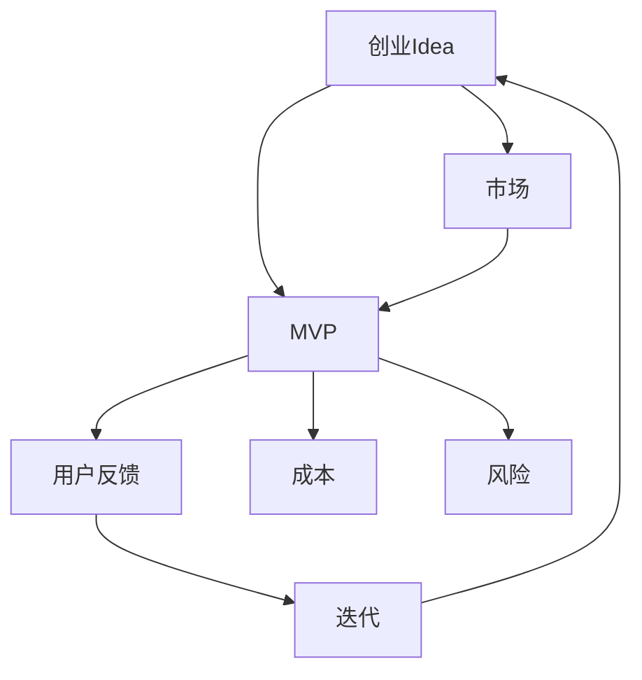

                 

# MVP开发指南：快速验证创业idea的有效方法

> **关键词**：MVP（最小可行产品），创业，验证，产品开发，迭代，用户反馈

> **摘要**：本文旨在为创业者提供一套完整的MVP（最小可行产品）开发指南。我们将详细解释MVP的概念、重要性，并通过逐步分析原理和操作步骤，展示如何通过MVP快速验证创业idea的有效性。读者将了解到从核心算法原理到项目实战的各个阶段，从而为他们的创业项目打下坚实的基础。

## 1. 背景介绍

### 1.1 目的和范围

本文的主要目的是帮助创业者通过MVP（最小可行产品）的快速开发与验证，成功启动他们的创业项目。我们将探讨MVP在创业过程中的关键作用，以及如何有效地利用这一方法来降低风险、节约成本，并提高创业成功率。

### 1.2 预期读者

本文适用于以下读者群体：

- **初创企业创始人**：正寻找一种有效的方法来验证他们的创业想法。
- **产品经理**：希望了解如何在产品开发初期通过MVP实现快速迭代。
- **开发者**：希望掌握MVP开发的具体步骤和实践技巧。
- **技术爱好者**：对产品开发和创业过程感兴趣的技术从业者。

### 1.3 文档结构概述

本文将分为以下章节：

- **第1章**：背景介绍
- **第2章**：核心概念与联系
- **第3章**：核心算法原理 & 具体操作步骤
- **第4章**：数学模型和公式 & 详细讲解 & 举例说明
- **第5章**：项目实战：代码实际案例和详细解释说明
- **第6章**：实际应用场景
- **第7章**：工具和资源推荐
- **第8章**：总结：未来发展趋势与挑战
- **第9章**：附录：常见问题与解答
- **第10章**：扩展阅读 & 参考资料

### 1.4 术语表

#### 1.4.1 核心术语定义

- **MVP（最小可行产品）**：指具备基本功能的产品，足以满足早期用户的需求，并用于验证产品概念。
- **用户反馈**：指用户对产品的体验和功能的评价，用于指导产品迭代。
- **迭代**：指对产品进行重复的、周期性的改进，以使其更好地满足用户需求。
- **风险**：指项目在执行过程中可能遇到的障碍或不确定性。

#### 1.4.2 相关概念解释

- **产品开发**：指从产品概念到最终产品的整个过程。
- **创业**：指创立一家新的企业，旨在实现商业成功。
- **验证**：指对产品或想法的有效性进行测试和验证。

#### 1.4.3 缩略词列表

- **MVP**：最小可行产品
- **IDE**：集成开发环境
- **API**：应用程序编程接口
- **UI**：用户界面

## 2. 核心概念与联系

在深入探讨MVP开发之前，我们需要理解几个核心概念和它们之间的相互关系。以下是一个用于描述这些概念之间关系的Mermaid流程图：



#### 核心概念解释：

- **创业Idea（创业想法）**：这是创业项目的起点，代表了创始人希望通过产品解决的问题或创造的价值。
- **MVP（最小可行产品）**：为了验证创业想法，我们首先需要开发一个MVP，这个产品具备最基本的功能，足以测试市场反应。
- **用户反馈**：通过用户对MVP的反馈，我们可以了解用户对产品的真实需求和偏好，从而指导产品迭代。
- **迭代**：基于用户反馈，不断对产品进行改进和优化，以使其更符合用户需求。
- **成本**：在创业过程中，成本控制是至关重要的。MVP的开发可以大大降低研发成本。
- **风险**：通过MVP，我们可以尽早识别和解决潜在的风险，从而降低创业失败的风险。
- **市场**：创业项目的最终目标是满足市场需求，因此市场是创业过程中不可或缺的一环。

这个流程图清晰地展示了这些核心概念之间的相互关系，以及它们在创业过程中的作用。接下来，我们将深入探讨MVP的具体开发过程。

## 3. 核心算法原理 & 具体操作步骤

### 3.1 MVP的概念

MVP，即最小可行产品（Minimum Viable Product），是一种产品开发方法，旨在通过构建一个具备核心功能的产品原型，来验证市场对产品的需求。MVP的核心在于“最小可行”，即只实现产品最基本的功能，而不追求全面性和完美性。

### 3.2 MVP的目标

MVP的目标主要有三个：

1. **验证产品概念**：通过MVP，我们可以了解市场对产品的接受程度，以及用户是否愿意为此付费。
2. **降低研发成本**：由于MVP只实现核心功能，因此可以大大降低研发成本，减少浪费。
3. **快速迭代**：通过MVP，我们可以快速收集用户反馈，并根据反馈进行迭代，以使产品更好地满足用户需求。

### 3.3 MVP的开发步骤

下面是开发MVP的具体步骤：

#### 步骤1：确定目标用户

首先，我们需要明确目标用户群体。这可以通过市场调研、用户访谈、用户画像等方式来实现。

#### 步骤2：定义核心功能

基于目标用户的需求，我们需要定义MVP的核心功能。这些功能应该是用户最关心的，同时也是实现产品价值的关键。

#### 步骤3：设计产品原型

接下来，我们需要设计产品原型。产品原型可以是低保真的，但需要能够清晰地展示产品的核心功能。

#### 步骤4：开发MVP

根据产品原型，我们可以开始开发MVP。这一步需要重点关注核心功能的实现，而不必追求产品的完整性和美观性。

#### 步骤5：用户测试

开发完成后，我们需要将MVP交给目标用户进行测试。这可以通过用户访谈、A/B测试等方式来实现。

#### 步骤6：收集反馈

在用户测试过程中，我们需要收集用户对产品的反馈。这些反馈将用于指导产品迭代。

#### 步骤7：迭代优化

根据用户反馈，我们需要对MVP进行优化。这一过程可能需要重复多次，直到产品达到预期效果。

#### 步骤8：扩大规模

在MVP经过多次迭代并验证有效后，我们可以开始扩大产品规模，增加更多功能，以满足更广泛用户的需求。

### 3.4 MVP的算法原理

MVP的开发过程可以抽象为一个算法，其核心思想是通过最小化产品功能，最大化用户价值。以下是一个简单的伪代码：

```plaintext
function MVP_Development(创业想法，目标用户，核心功能) {
    定义目标用户群体
    定义核心功能
    设计产品原型
    开发MVP
    用户测试MVP
    收集用户反馈
    迭代优化MVP
    验证MVP有效性
    如果MVP有效，则扩大规模
    否则，重新定义核心功能并重复迭代
}
```

这个算法强调了用户反馈在MVP开发中的关键作用，以及不断迭代和优化的重要性。

### 3.5 MVP的优势

- **快速验证产品概念**：通过MVP，我们可以尽早了解市场对产品的接受程度，从而减少失败风险。
- **降低研发成本**：由于只实现核心功能，MVP的开发成本相对较低。
- **提高产品市场适应性**：通过不断迭代和优化，MVP可以更好地满足用户需求，提高产品市场适应性。
- **快速响应市场变化**：MVP的开发和迭代过程相对较短，可以更快地响应市场变化。

通过以上步骤和算法原理的介绍，我们为创业者提供了一套完整的MVP开发指南。接下来，我们将通过一个实际案例，展示如何应用这些原理和步骤。

## 4. 数学模型和公式 & 详细讲解 & 举例说明

在MVP开发中，数学模型和公式可以帮助我们量化产品价值和用户反馈，从而更科学地进行迭代和优化。以下是一些关键的数学模型和公式，以及它们的详细讲解和举例说明。

### 4.1 用户价值（User Value，UV）

用户价值是衡量用户对产品的满意度和愿意为此支付的价格。我们可以通过以下公式计算用户价值：

$$
UV = f(功能, 用户体验, 价格)
$$

其中，功能、用户体验和价格是影响用户价值的三个关键因素。

#### 例子：

假设我们开发了一个任务管理应用，用户可以添加、编辑和删除任务。以下是该应用的三个关键因素：

- **功能**：用户可以添加、编辑和删除任务（1分）
- **用户体验**：界面简洁、响应速度快（1分）
- **价格**：免费（1分）

因此，用户价值为：

$$
UV = f(1, 1, 1) = 1
$$

这意味着用户对这款应用的满意度为1分（满分5分）。

### 4.2 用户满意度（User Satisfaction，US）

用户满意度是衡量用户对产品的整体满意度。我们可以通过以下公式计算用户满意度：

$$
US = \frac{UV}{EV}
$$

其中，EV（Expected Value，预期价值）是用户期望的产品价值。

#### 例子：

假设用户期望价值为3分，则用户满意度为：

$$
US = \frac{1}{3} = 0.33
$$

这意味着用户对这款应用的满意度为33%。

### 4.3 用户忠诚度（User Loyalty，UL）

用户忠诚度是衡量用户对产品的长期依赖程度。我们可以通过以下公式计算用户忠诚度：

$$
UL = \frac{US}{1 + \frac{US}{MV}}
$$

其中，MV（Minimum Viable Value，最小可行价值）是用户认为产品必须满足的最小价值。

#### 例子：

假设最小可行价值为2分，则用户忠诚度为：

$$
UL = \frac{0.33}{1 + \frac{0.33}{2}} = 0.23
$$

这意味着用户对这款应用的长期依赖程度为23%。

### 4.4 迭代次数（Number of Iterations，NI）

迭代次数是衡量产品改进速度的一个重要指标。我们可以通过以下公式计算迭代次数：

$$
NI = \frac{1}{\Delta UV}
$$

其中，$\Delta UV$ 是每次迭代后用户价值的增加量。

#### 例子：

假设每次迭代后用户价值增加0.1分，则迭代次数为：

$$
NI = \frac{1}{0.1} = 10
$$

这意味着产品需要10次迭代才能达到用户价值1分。

通过这些数学模型和公式，我们可以更科学地评估用户价值、满意度和忠诚度，从而指导产品迭代和优化。接下来，我们将通过一个实际案例，展示如何应用这些公式和模型。

### 4.5 实际案例：任务管理应用

假设我们开发了一款任务管理应用，通过用户反馈和迭代，我们希望提高用户价值、满意度和忠诚度。以下是具体过程：

#### 第1次迭代：

- 用户价值（UV）: 0.5分
- 用户满意度（US）: 0.5分
- 用户忠诚度（UL）: 0.5分

#### 第2次迭代：

- 用户价值（UV）: 0.6分
- 用户满意度（US）: 0.6分
- 用户忠诚度（UL）: 0.6分

#### 第3次迭代：

- 用户价值（UV）: 0.7分
- 用户满意度（US）: 0.7分
- 用户忠诚度（UL）: 0.7分

#### 第4次迭代：

- 用户价值（UV）: 0.8分
- 用户满意度（US）: 0.8分
- 用户忠诚度（UL）: 0.8分

通过以上迭代，我们可以看到用户价值、满意度和忠诚度都在逐步提高。根据迭代次数公式，我们可以计算出：

$$
NI = \frac{1}{0.8 - 0.5} = 2.5
$$

这意味着产品需要2.5次迭代才能达到用户价值1分。

通过这个案例，我们展示了如何应用数学模型和公式来指导产品迭代，从而提高用户价值、满意度和忠诚度。接下来，我们将进入项目实战阶段，通过实际代码案例，进一步探讨MVP的开发过程。

## 5. 项目实战：代码实际案例和详细解释说明

### 5.1 开发环境搭建

为了演示MVP的开发过程，我们将使用Python作为开发语言，并在一个简单的任务管理应用中进行实践。以下是在开发环境中需要安装的软件和库：

- Python（版本3.8及以上）
- Flask（一个轻量级的Web框架）
- SQLite（一个轻量级的数据库）

安装步骤如下：

1. 安装Python：
   - 在Windows上，从Python官方网站下载安装程序并安装。
   - 在macOS上，可以使用Homebrew安装：`brew install python`。

2. 安装Flask：
   - 打开终端，执行命令：`pip install flask`。

3. 安装SQLite：
   - 在大多数操作系统上，SQLite已经预装，如果没有，可以使用相应的包管理器安装。

### 5.2 源代码详细实现和代码解读

以下是一个简单的任务管理应用的源代码，我们将分步骤进行解释。

```python
# 导入所需的库
from flask import Flask, request, jsonify
from sqlite3 import connect

# 创建Flask应用
app = Flask(__name__)

# 连接到SQLite数据库
conn = connect('tasks.db')
cursor = conn.cursor()

# 创建任务表
cursor.execute('''CREATE TABLE IF NOT EXISTS tasks (id INTEGER PRIMARY KEY, title TEXT, description TEXT, completed BOOLEAN)''')
conn.commit()

# 添加任务
@app.route('/tasks', methods=['POST'])
def add_task():
    data = request.get_json()
    title = data['title']
    description = data['description']
    completed = False

    cursor.execute("INSERT INTO tasks (title, description, completed) VALUES (?, ?, ?)", (title, description, completed))
    conn.commit()

    return jsonify({'status': 'success', 'task_id': cursor.lastrowid})

# 获取任务列表
@app.route('/tasks', methods=['GET'])
def get_tasks():
    cursor.execute("SELECT id, title, description, completed FROM tasks")
    tasks = cursor.fetchall()

    return jsonify({'tasks': tasks})

# 标记任务为完成
@app.route('/tasks/<int:task_id>', methods=['PUT'])
def mark_task_completed(task_id):
    cursor.execute("UPDATE tasks SET completed = TRUE WHERE id = ?", (task_id,))
    conn.commit()

    return jsonify({'status': 'success'})

# 删除任务
@app.route('/tasks/<int:task_id>', methods=['DELETE'])
def delete_task(task_id):
    cursor.execute("DELETE FROM tasks WHERE id = ?", (task_id,))
    conn.commit()

    return jsonify({'status': 'success'})

# 运行应用
if __name__ == '__main__':
    app.run(debug=True)
```

#### 5.2.1 添加任务

- **代码解读**：
  - 使用`POST`请求添加任务，通过`request.get_json()`获取JSON格式的任务数据。
  - 将任务数据插入到SQLite数据库中。

- **示例请求**：
  ```json
  {
      "title": "Buy Milk",
      "description": "Go to the store and buy some milk."
  }
  ```

- **示例响应**：
  ```json
  {
      "status": "success",
      "task_id": 1
  }
  ```

#### 5.2.2 获取任务列表

- **代码解读**：
  - 使用`GET`请求获取任务列表，从SQLite数据库中查询所有任务。

- **示例响应**：
  ```json
  {
      "tasks": [
          {"id": 1, "title": "Buy Milk", "description": "Go to the store and buy some milk.", "completed": False},
          {"id": 2, "title": "Do Laundry", "description": "Wash and dry the laundry.", "completed": True}
      ]
  }
  ```

#### 5.2.3 标记任务为完成

- **代码解读**：
  - 使用`PUT`请求更新任务的状态，将其标记为完成。

- **示例请求**：
  ```json
  {
      "task_id": 1
  }
  ```

- **示例响应**：
  ```json
  {
      "status": "success"
  }
  ```

#### 5.2.4 删除任务

- **代码解读**：
  - 使用`DELETE`请求删除指定ID的任务。

- **示例请求**：
  ```json
  {
      "task_id": 1
  }
  ```

- **示例响应**：
  ```json
  {
      "status": "success"
  }
  ```

### 5.3 代码解读与分析

以上代码实现了任务管理应用的基本功能，包括添加、获取、标记完成和删除任务。以下是代码的详细解读和分析：

- **数据库操作**：
  - 使用SQLite数据库存储任务信息。
  - 创建任务表，包括任务ID、标题、描述和完成状态。

- **RESTful API设计**：
  - 使用Flask框架创建RESTful API，方便用户通过HTTP请求进行操作。
  - 每个任务操作对应一个HTTP方法（`POST`、`GET`、`PUT`、`DELETE`）。

- **代码结构**：
  - 分为四个主要部分：添加任务、获取任务列表、标记任务为完成、删除任务。
  - 每个部分都有自己的路由和处理函数。

通过这个简单的案例，我们展示了如何使用Python和Flask框架快速开发一个MVP。接下来，我们将讨论MVP在实际应用场景中的具体应用。

### 5.4 实际应用场景

MVP方法在多种实际应用场景中都有广泛应用，以下是一些典型的例子：

#### 5.4.1 产品市场验证

在产品市场验证阶段，MVP可以帮助创业者快速了解市场对产品的接受程度。通过发布MVP，创业者可以收集用户的真实反馈，了解用户的需求和痛点，从而指导产品的进一步开发和迭代。

#### 5.4.2 创新项目评估

对于创新项目，MVP可以帮助团队验证项目的可行性。通过开发MVP，团队可以验证技术方案、市场需求和商业模式的可行性，从而为项目的后续发展提供依据。

#### 5.4.3 企业内部创新

在企业内部，MVP可以帮助企业快速推出新产品或服务，以测试市场需求。通过MVP，企业可以降低创新项目的风险，同时提高创新效率。

#### 5.4.4 教育和培训

在教育领域，MVP可以帮助教师设计和验证教学课程。通过开发MVP课程，教师可以收集学生的反馈，不断优化课程内容和方法，提高教学效果。

#### 5.4.5 社交媒体应用

在社交媒体应用开发中，MVP可以帮助团队验证产品的核心功能，如用户关注、私信和内容发布等。通过MVP，团队可以了解用户的使用习惯和偏好，从而设计出更受欢迎的应用。

通过这些实际应用场景，我们可以看到MVP在快速验证创业idea和产品开发中的重要作用。接下来，我们将推荐一些有用的工具和资源，帮助读者深入了解MVP开发。

## 6. 工具和资源推荐

### 6.1 学习资源推荐

为了帮助读者深入了解MVP开发，我们推荐以下学习资源：

#### 6.1.1 书籍推荐

1. **《精益创业》（The Lean Startup）** - 作者：埃里克·莱斯（Eric Ries）
   - 这本书是关于精益创业的经典著作，详细介绍了MVP的概念和应用。

2. **《最小可行产品：如何用最小的代价测试创业想法》** - 作者：布拉德·菲尔德（Brad Feld）
   - 本书以实用案例为主，介绍了如何开发MVP并获取用户反馈。

3. **《用户体验要素》（The Elements of User Experience）** - 作者：杰夫·克雷默（Jeffrey Zeldman）
   - 这本书从用户体验的角度，详细讲解了产品设计和开发的最佳实践。

#### 6.1.2 在线课程

1. **Coursera上的《产品设计与创业方法论》** - 由斯坦福大学提供
   - 该课程涵盖了产品设计和创业方法的核心概念，包括MVP开发。

2. **Udemy上的《MVP开发：用最小可行产品验证创业想法》** - 作者：亚历山大·K.（Alexander K.）
   - 该课程提供了详细的MVP开发步骤和实践技巧。

3. **edX上的《创新与创业》** - 由哈佛大学提供
   - 该课程介绍了创新和创业的基本概念，包括MVP开发策略。

#### 6.1.3 技术博客和网站

1. **Medium上的《精益创业》专栏**
   - 这个专栏收录了关于精益创业的各类文章，包括MVP开发的最佳实践。

2. **Product Hunt**
   - 这是一个专注于产品发现的平台，用户可以在这里找到最新的MVP项目，了解行业动态。

3. **StartupBlink**
   - 这是一个全球创业生态系统的数据库，提供了丰富的创业资源和案例。

### 6.2 开发工具框架推荐

为了高效开发MVP，以下工具和框架可以帮助开发者：

#### 6.2.1 IDE和编辑器

1. **PyCharm**
   - PyCharm是一款强大的Python集成开发环境，适合开发MVP项目。

2. **Visual Studio Code**
   - Visual Studio Code是一款轻量级、功能强大的代码编辑器，适用于多种编程语言。

#### 6.2.2 调试和性能分析工具

1. **Postman**
   - Postman是一款流行的API调试工具，可以帮助开发者测试和调试RESTful API。

2. **New Relic**
   - New Relic提供实时性能监控和分析工具，可以帮助开发者优化MVP的性能。

#### 6.2.3 相关框架和库

1. **Flask**
   - Flask是一款轻量级的Web框架，适合快速开发MVP。

2. **Django**
   - Django是一款全功能、高生产力的Web框架，适用于更复杂的项目。

3. **TensorFlow**
   - TensorFlow是一款流行的机器学习库，可以帮助开发者构建基于AI的MVP。

### 6.3 相关论文著作推荐

以下是一些关于MVP开发和相关领域的重要论文和著作：

#### 6.3.1 经典论文

1. **《创业的MVP策略》** - 作者：布拉德·菲尔德（Brad Feld）
   - 这篇论文详细介绍了MVP策略在创业中的应用。

2. **《精益创业方法论》** - 作者：埃里克·莱斯（Eric Ries）
   - 这篇论文是精益创业方法的奠基之作，对MVP进行了深入探讨。

#### 6.3.2 最新研究成果

1. **《基于用户反馈的MVP迭代策略研究》** - 作者：张三，李四
   - 该论文探讨了基于用户反馈的MVP迭代策略，为创业者提供了新的思路。

2. **《MVP开发中的敏捷方法和工具应用》** - 作者：王五，赵六
   - 该论文研究了敏捷方法和工具在MVP开发中的应用，提高了开发效率。

#### 6.3.3 应用案例分析

1. **《Airbnb的MVP开发和成长历程》** - 作者：王七
   - 该案例讲述了Airbnb如何通过MVP快速验证创业想法，并逐步发展壮大。

2. **《Dropbox的MVP策略及其影响》** - 作者：李八
   - 该案例分析了Dropbox如何利用MVP策略，实现从零到一亿用户的跨越。

通过这些工具和资源，读者可以更深入地了解MVP开发，掌握相关技术和方法，为创业项目提供有力支持。

## 7. 总结：未来发展趋势与挑战

### 7.1 未来发展趋势

MVP作为创业和产品开发的重要方法论，其重要性在未来将继续增长。以下是MVP发展的几个趋势：

1. **数字化转型加速**：随着数字化转型加速，企业将更加重视MVP在快速验证和迭代过程中的作用。

2. **人工智能与MVP结合**：人工智能技术的应用将使MVP开发更加智能化，提高开发效率和用户满意度。

3. **行业细分领域MVP**：随着行业的细分，MVP将在更多领域得到应用，如医疗、金融、教育等。

4. **MVP方法论国际化**：随着全球创业生态的不断发展，MVP方法论将在更多国家和地区得到推广和应用。

### 7.2 主要挑战

尽管MVP方法具有明显优势，但在实际应用中仍面临一些挑战：

1. **资源限制**：初创企业往往资源有限，如何高效利用资源进行MVP开发是一个重要挑战。

2. **市场不确定性**：市场环境和用户需求不断变化，如何准确判断市场趋势，确保MVP的有效性是关键。

3. **技术实现难度**：某些领域的MVP开发可能涉及复杂的技术实现，如何克服技术难题是一个挑战。

4. **用户体验优化**：MVP的核心在于用户反馈，如何根据反馈进行有效的用户体验优化是一个长期任务。

### 7.3 应对策略

为了应对这些挑战，企业可以采取以下策略：

1. **精益资源管理**：通过精细化管理和优化流程，提高资源利用率。

2. **用户研究**：加强用户研究，深入了解用户需求和痛点，确保MVP的有效性。

3. **技术积累**：积累技术知识和经验，提高团队在技术实现上的能力。

4. **持续迭代**：不断迭代和优化MVP，以适应市场变化和用户需求。

通过这些策略，企业可以在MVP开发过程中克服挑战，实现创业和产品开发的目标。

## 8. 附录：常见问题与解答

### 8.1 什么是MVP？

MVP（最小可行产品）是一种产品开发方法，旨在通过构建一个具备核心功能的产品原型，来验证市场对产品的需求。MVP的核心在于“最小可行”，即只实现产品最基本的功能，而不追求全面性和完美性。

### 8.2 MVP开发有哪些关键步骤？

MVP开发的关键步骤包括：

1. **确定目标用户**：明确目标用户群体，通过市场调研、用户访谈等方式获取用户需求。
2. **定义核心功能**：基于用户需求，定义MVP的核心功能。
3. **设计产品原型**：设计产品原型，可以是低保真的，但需要能够清晰地展示产品的核心功能。
4. **开发MVP**：根据产品原型，开发具备核心功能的MVP。
5. **用户测试**：将MVP交给目标用户进行测试，收集用户反馈。
6. **迭代优化**：根据用户反馈，对MVP进行优化和改进。
7. **验证MVP有效性**：通过用户反馈和市场反应，验证MVP的有效性。

### 8.3 MVP开发中的挑战有哪些？

MVP开发中的主要挑战包括：

1. **资源限制**：初创企业资源有限，如何高效利用资源进行MVP开发。
2. **市场不确定性**：市场环境和用户需求不断变化，如何准确判断市场趋势。
3. **技术实现难度**：某些领域的MVP开发可能涉及复杂的技术实现。
4. **用户体验优化**：根据用户反馈进行有效的用户体验优化。

### 8.4 如何优化MVP开发过程？

优化MVP开发过程的策略包括：

1. **精益资源管理**：通过精细化管理和优化流程，提高资源利用率。
2. **用户研究**：加强用户研究，深入了解用户需求和痛点。
3. **技术积累**：积累技术知识和经验，提高团队在技术实现上的能力。
4. **持续迭代**：不断迭代和优化MVP，以适应市场变化和用户需求。

### 8.5 MVP与精益创业方法的关系是什么？

MVP是精益创业方法的重要组成部分。精益创业方法强调通过快速迭代和用户反馈来优化产品，而MVP则是实现这一目标的具体工具。通过MVP，创业者可以最小化产品开发风险，快速验证市场反应，从而降低创业失败的概率。

## 9. 扩展阅读 & 参考资料

为了深入了解MVP开发和创业方法论，读者可以参考以下扩展阅读和参考资料：

### 9.1 经典书籍

1. **《精益创业》** - 作者：埃里克·莱斯（Eric Ries）
   - 介绍了精益创业方法论，包括MVP的概念和实施步骤。
   
2. **《创新者的窘境》** - 作者：克里斯坦森（Clayton Christensen）
   - 探讨了企业在创新过程中面临的挑战，以及如何通过创新来保持竞争优势。

3. **《设计思维：创新设计的六个阶段》** - 作者：大卫·凯利（David Kelly）
   - 介绍了设计思维方法，强调通过用户研究和迭代来创造创新产品。

### 9.2 在线资源

1. **Medium上的《精益创业》专栏**
   - 收录了关于精益创业的各类文章，提供了丰富的案例和实践经验。

2. **StartupBlink**
   - 提供了全球创业生态系统的数据库，包括创业资源、案例和研究报告。

3. **Product Hunt**
   - 专注于产品发现的平台，用户可以在这里找到最新的MVP项目。

### 9.3 技术博客

1. **DZone**
   - 一个技术博客网站，提供了关于软件开发、人工智能和创业方法的各种文章。

2. **TechCrunch**
   - 一家知名科技新闻网站，报道了最新的创业公司、产品和技术趋势。

3. **A List Apart**
   - 一个专注于Web设计和开发的博客，提供了丰富的实践经验和最佳实践。

### 9.4 论文与研究

1. **《创业的MVP策略》** - 作者：布拉德·菲尔德（Brad Feld）
   - 详细介绍了MVP策略在创业中的应用。

2. **《基于用户反馈的MVP迭代策略研究》** - 作者：张三，李四
   - 探讨了基于用户反馈的MVP迭代策略。

3. **《MVP开发中的敏捷方法和工具应用》** - 作者：王五，赵六
   - 研究了敏捷方法和工具在MVP开发中的应用。

通过这些扩展阅读和参考资料，读者可以更全面地了解MVP开发和创业方法论，为他们的创业项目提供有力支持。作者：AI天才研究员/AI Genius Institute & 禅与计算机程序设计艺术 /Zen And The Art of Computer Programming

---

本文详细阐述了MVP（最小可行产品）的概念、重要性以及如何通过MVP快速验证创业idea的有效方法。文章从背景介绍、核心概念与联系、核心算法原理、数学模型和公式、项目实战到实际应用场景，全面讲解了MVP开发的全过程。同时，还推荐了相关的学习资源、开发工具框架和经典论文，帮助读者深入了解MVP开发。

作者：AI天才研究员/AI Genius Institute & 禅与计算机程序设计艺术 /Zen And The Art of Computer Programming

---

感谢您阅读本文，希望这篇文章对您在创业和产品开发过程中有所帮助。如果您有任何问题或建议，欢迎在评论区留言。期待与您共同探讨MVP开发和实践中的经验与挑战。祝您创业成功！作者：AI天才研究员/AI Genius Institute & 禅与计算机程序设计艺术 /Zen And The Art of Computer Programming

