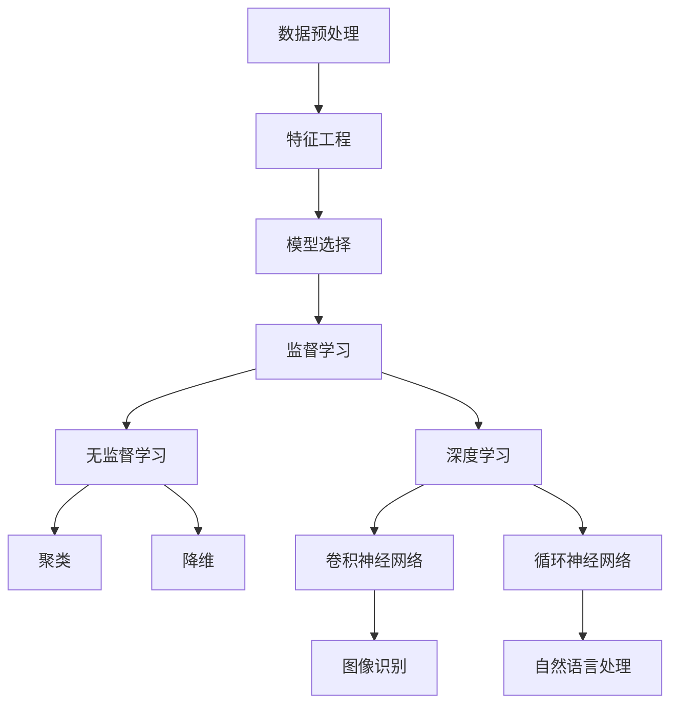
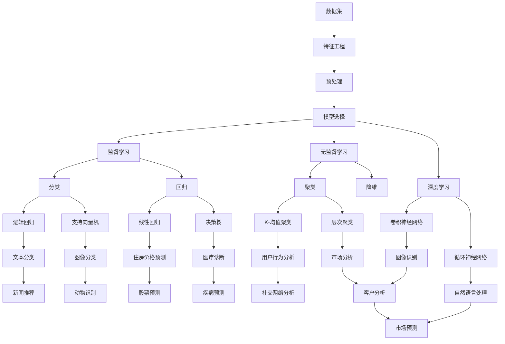

                 

### 机器学习原理与代码实例讲解

> **关键词**：机器学习、深度学习、神经网络、算法原理、代码实例
>
> **摘要**：本文深入探讨了机器学习的基本原理，包括核心概念、算法原理、数学模型、实际应用场景等内容。通过代码实例讲解，帮助读者更好地理解并掌握机器学习技术。文章旨在为初学者和进阶者提供详尽的指导，助力他们在机器学习领域取得更好的成绩。

机器学习作为人工智能的重要分支，在当今科技领域取得了显著的发展。它不仅在学术研究中占据重要地位，还在实际应用中展现了巨大的潜力，如自动驾驶、语音识别、图像处理等。然而，机器学习的复杂性和深度往往让初学者感到困惑。本文将带领读者一步步了解机器学习的原理，并通过实际代码实例讲解，帮助读者更好地掌握这一技术。

本文将分为以下几部分进行讲解：

1. **背景介绍**：介绍机器学习的基本概念、发展历程以及本文的目的和结构。
2. **核心概念与联系**：通过Mermaid流程图展示机器学习的基本概念和原理。
3. **核心算法原理**：讲解机器学习中的核心算法，并使用伪代码详细阐述算法步骤。
4. **数学模型和公式**：介绍机器学习中的数学模型和公式，并进行举例说明。
5. **项目实战**：通过实际代码案例，详细解释机器学习的实现过程。
6. **实际应用场景**：探讨机器学习在实际中的应用场景。
7. **工具和资源推荐**：推荐学习资源和开发工具，以帮助读者更好地学习机器学习。
8. **总结**：总结机器学习的发展趋势与挑战。
9. **附录**：常见问题与解答。
10. **扩展阅读**：提供扩展阅读材料，以供进一步学习。

现在，让我们开始深入探讨机器学习的奥秘。

## 1. 背景介绍

### 1.1 目的和范围

本文的目的是深入探讨机器学习的原理，帮助读者理解并掌握这一核心技术。我们将从基础概念入手，逐步讲解核心算法、数学模型，并通过实际代码实例进行演示。希望通过本文的学习，读者能够对机器学习有一个全面而深入的理解。

本文的范围涵盖以下几个方面：

1. **机器学习的基本概念**：介绍机器学习的定义、发展历程以及相关术语。
2. **核心算法原理**：讲解常见的机器学习算法，如线性回归、决策树、神经网络等，并使用伪代码详细阐述算法步骤。
3. **数学模型和公式**：介绍机器学习中的数学模型和公式，并进行举例说明。
4. **实际应用场景**：探讨机器学习在实际中的应用场景，如图像识别、自然语言处理等。
5. **工具和资源推荐**：推荐学习资源和开发工具，以帮助读者更好地学习机器学习。

### 1.2 预期读者

本文适合以下几类读者：

1. **初学者**：对机器学习有一定了解，但想要深入了解其原理和实践的读者。
2. **进阶者**：已经在机器学习领域有一定经验，但希望进一步提高自己技术水平的读者。
3. **研究人员**：对机器学习研究感兴趣，希望从理论到实践都有所提升的研究人员。
4. **开发者**：希望将机器学习应用于实际项目中的开发人员。

无论你是哪种读者，本文都将为你提供有价值的知识和经验。

### 1.3 文档结构概述

本文分为以下几个部分：

1. **背景介绍**：介绍机器学习的基本概念、发展历程以及本文的目的和结构。
2. **核心概念与联系**：通过Mermaid流程图展示机器学习的基本概念和原理。
3. **核心算法原理**：讲解常见的机器学习算法，并使用伪代码详细阐述算法步骤。
4. **数学模型和公式**：介绍机器学习中的数学模型和公式，并进行举例说明。
5. **项目实战**：通过实际代码案例，详细解释机器学习的实现过程。
6. **实际应用场景**：探讨机器学习在实际中的应用场景。
7. **工具和资源推荐**：推荐学习资源和开发工具，以帮助读者更好地学习机器学习。
8. **总结**：总结机器学习的发展趋势与挑战。
9. **附录**：常见问题与解答。
10. **扩展阅读**：提供扩展阅读材料，以供进一步学习。

### 1.4 术语表

在本文中，我们将使用一些专业术语，以下是对这些术语的解释：

#### 1.4.1 核心术语定义

1. **机器学习**：机器学习是一门人工智能分支，通过数据训练模型，使模型具备自主学习和预测能力。
2. **神经网络**：一种模仿人脑结构和功能的计算模型，由多个神经元组成。
3. **深度学习**：一种基于神经网络的学习方法，通过多层次的非线性变换，对数据进行自动特征提取。
4. **监督学习**：一种机器学习方法，通过标注数据训练模型，使模型能够对新数据进行预测。
5. **无监督学习**：一种机器学习方法，不使用标注数据，通过数据自身的规律进行学习。

#### 1.4.2 相关概念解释

1. **数据集**：一组用于训练或测试模型的样本数据。
2. **特征**：描述数据属性的变量。
3. **模型**：用于表示和学习数据规律的函数。
4. **损失函数**：评估模型预测结果与真实结果之间差异的指标。

#### 1.4.3 缩略词列表

1. **ML**：机器学习
2. **DL**：深度学习
3. **NN**：神经网络
4. **SGD**：随机梯度下降

### 1.5 核心概念与联系

下面我们将通过一个Mermaid流程图来展示机器学习中的核心概念和联系。



这个流程图展示了机器学习中的主要概念，包括数据预处理、特征工程、模型选择、监督学习、无监督学习和深度学习等。通过这些概念的联系，我们可以更好地理解机器学习的整体框架。

### 1.6 核心算法原理

在本节中，我们将介绍机器学习中的核心算法，并使用伪代码详细阐述算法步骤。

#### 1.6.1 线性回归

线性回归是一种最简单的机器学习算法，用于预测连续值。它的目标是找到一个线性函数来拟合数据，使得预测值与真实值之间的误差最小。

**伪代码：**

```
输入：训练数据集 (x, y)，学习率 α，迭代次数 n
输出：最佳拟合直线 w

1. 初始化权重 w 为零向量
2. 对于 i 从 1 到 n：
    a. 计算预测值 y_pred = w·x[i]
    b. 计算损失函数 L(w) = (y_pred - y[i])²
    c. 更新权重 w = w - α * ∇L(w)
3. 返回权重 w
```

#### 1.6.2 决策树

决策树是一种基于特征进行分类或回归的树形结构。它的核心思想是通过一系列判断条件将数据集分割成多个子集，每个子集对应一个标签或值。

**伪代码：**

```
输入：训练数据集 D，特征集合 F
输出：决策树 T

1. 如果 D 中所有样本的标签相同，则返回标签值
2. 如果 F 为空，则返回 D 中样本的多数标签
3. 否则：
    a. 选择最佳特征 f
    b. 根据 f 将 D 分割成多个子集 D1, D2, ..., Dk
    c. 对于每个子集 Di：
        i. 递归调用建树函数，生成子节点 Ti
    d. 返回根节点 (f, 子节点列表 [T1, T2, ..., Tk])
```

#### 1.6.3 神经网络

神经网络是一种模仿人脑结构和功能的计算模型，由多个神经元组成。它的核心思想是通过多层非线性变换，对数据进行自动特征提取和分类。

**伪代码：**

```
输入：训练数据集 (x, y)，学习率 α，迭代次数 n，神经网络结构 (L, W)
输出：训练好的神经网络

1. 初始化权重 W 为随机值
2. 对于 i 从 1 到 n：
    a. 前向传播：计算输出 y_pred = forward(x, W)
    b. 计算损失函数 L = loss(y_pred, y)
    c. 反向传播：更新权重 W = backward(x, y, y_pred, W, α)
3. 返回权重 W
```

#### 1.6.4 深度学习

深度学习是一种基于神经网络的机器学习方法，通过多层次的非线性变换，对数据进行自动特征提取和分类。

**伪代码：**

```
输入：训练数据集 (x, y)，学习率 α，迭代次数 n，神经网络结构 (L, W)
输出：训练好的神经网络

1. 初始化权重 W 为随机值
2. 对于 i 从 1 到 n：
    a. 前向传播：计算输出 y_pred = forward(x, W)
    b. 计算损失函数 L = loss(y_pred, y)
    c. 反向传播：更新权重 W = backward(x, y, y_pred, W, α)
3. 返回权重 W
```

通过以上伪代码，我们可以看到不同算法的步骤和流程。在实际应用中，这些算法需要通过编程语言和工具来实现。

### 1.7 数学模型和公式

在本节中，我们将介绍机器学习中的数学模型和公式，并进行详细讲解。

#### 1.7.1 损失函数

损失函数是评估模型预测结果与真实结果之间差异的指标，常见损失函数包括均方误差（MSE）、交叉熵损失等。

1. **均方误差（MSE）**

$$
MSE = \frac{1}{n}\sum_{i=1}^{n}(y_pred - y)^2
$$

其中，$y_pred$ 是预测值，$y$ 是真实值，$n$ 是样本数量。

2. **交叉熵损失（Cross Entropy Loss）**

$$
CrossEntropyLoss = -\frac{1}{n}\sum_{i=1}^{n}y\log(y_pred)
$$

其中，$y$ 是真实标签，$y_pred$ 是预测概率。

#### 1.7.2 梯度下降

梯度下降是一种优化算法，用于最小化损失函数。它通过不断更新模型参数，使损失函数值逐渐减小。

1. **随机梯度下降（SGD）**

$$
w = w - α \cdot \nabla_wL(w)
$$

其中，$w$ 是模型参数，$α$ 是学习率，$\nabla_wL(w)$ 是损失函数关于 $w$ 的梯度。

2. **批量梯度下降（BGD）**

$$
w = w - \frac{1}{n}\sum_{i=1}^{n}\nabla_wL(w)
$$

其中，$w$ 是模型参数，$α$ 是学习率，$\nabla_wL(w)$ 是损失函数关于 $w$ 的梯度，$n$ 是样本数量。

#### 1.7.3 激活函数

激活函数是神经网络中的关键组成部分，用于引入非线性特性。常见激活函数包括 sigmoid、ReLU、Tanh 等。

1. **sigmoid 函数**

$$
sigmoid(x) = \frac{1}{1 + e^{-x}}
$$

2. **ReLU 函数**

$$
ReLU(x) = \max(0, x)
$$

3. **Tanh 函数**

$$
Tanh(x) = \frac{e^{x} - e^{-x}}{e^{x} + e^{-x}}
$$

#### 1.7.4 池化操作

池化操作是卷积神经网络中的关键组成部分，用于减少数据维度和参数数量。

1. **最大池化（Max Pooling）**

$$
Pooling(x) = \max(x_1, x_2, ..., x_k)
$$

其中，$x_1, x_2, ..., x_k$ 是输入数据。

2. **平均池化（Average Pooling）**

$$
Pooling(x) = \frac{1}{k}\sum_{i=1}^{k}x_i
$$

其中，$x_1, x_2, ..., x_k$ 是输入数据。

通过以上数学模型和公式，我们可以更好地理解机器学习中的关键概念和操作。在实际应用中，这些模型和公式需要通过编程语言和工具来实现。

### 1.8 项目实战：代码实际案例和详细解释说明

在本节中，我们将通过一个实际的项目案例，展示如何使用Python和TensorFlow实现机器学习算法。该项目将使用MNIST手写数字数据集，通过训练一个简单的神经网络模型来识别手写数字。

#### 5.1 开发环境搭建

在开始项目之前，我们需要搭建一个合适的开发环境。以下是搭建开发环境的步骤：

1. 安装Python 3.7或更高版本。
2. 安装Anaconda或Miniconda，以便更好地管理Python环境和依赖库。
3. 创建一个新环境，并安装TensorFlow库。

```
conda create -n ml_project python=3.8
conda activate ml_project
pip install tensorflow
```

4. 安装其他必要库，如NumPy、Pandas等。

```
pip install numpy pandas matplotlib
```

#### 5.2 源代码详细实现和代码解读

下面是项目的源代码，我们将逐行解释代码的功能。

```python
import tensorflow as tf
from tensorflow.keras import layers
import numpy as np
import matplotlib.pyplot as plt

# 读取MNIST数据集
mnist = tf.keras.datasets.mnist
(x_train, y_train), (x_test, y_test) = mnist.load_data()
x_train, x_test = x_train / 255.0, x_test / 255.0

# 预处理数据
x_train = x_train.reshape((-1, 28, 28, 1))
x_test = x_test.reshape((-1, 28, 28, 1))

# 创建神经网络模型
model = tf.keras.Sequential([
    layers.Conv2D(32, (3, 3), activation='relu', input_shape=(28, 28, 1)),
    layers.MaxPooling2D((2, 2)),
    layers.Conv2D(64, (3, 3), activation='relu'),
    layers.MaxPooling2D((2, 2)),
    layers.Conv2D(64, (3, 3), activation='relu'),
    layers.Flatten(),
    layers.Dense(64, activation='relu'),
    layers.Dense(10, activation='softmax')
])

# 编译模型
model.compile(optimizer='adam',
              loss='sparse_categorical_crossentropy',
              metrics=['accuracy'])

# 训练模型
model.fit(x_train, y_train, epochs=5)

# 评估模型
test_loss, test_acc = model.evaluate(x_test, y_test, verbose=2)
print('\nTest accuracy:', test_acc)

# 可视化结果
predictions = model.predict(x_test)
plt.figure(figsize=(10, 10))
for i in range(25):
    plt.subplot(5, 5, i+1)
    plt.imshow(x_test[i], cmap=plt.cm.binary)
    plt.xticks([])
    plt.yticks([])
    plt.grid(False)
    plt.xlabel(np.argmax(predictions[i]))
plt.show()
```

代码解读：

1. 导入必要的库，包括TensorFlow、NumPy和Matplotlib。
2. 读取MNIST数据集，并预处理数据。
3. 创建神经网络模型，包括卷积层、池化层、全连接层等。
4. 编译模型，指定优化器和损失函数。
5. 训练模型，指定训练数据和迭代次数。
6. 评估模型，计算测试准确率。
7. 可视化预测结果。

#### 5.3 代码解读与分析

1. **数据读取与预处理**

```
mnist = tf.keras.datasets.mnist
(x_train, y_train), (x_test, y_test) = mnist.load_data()
x_train, x_test = x_train / 255.0, x_test / 255.0
x_train = x_train.reshape((-1, 28, 28, 1))
x_test = x_test.reshape((-1, 28, 28, 1))
```

这段代码首先加载MNIST数据集，并将其归一化到[0, 1]范围内。然后，通过reshape函数将数据形状调整为适合神经网络模型的要求。

2. **创建神经网络模型**

```
model = tf.keras.Sequential([
    layers.Conv2D(32, (3, 3), activation='relu', input_shape=(28, 28, 1)),
    layers.MaxPooling2D((2, 2)),
    layers.Conv2D(64, (3, 3), activation='relu'),
    layers.MaxPooling2D((2, 2)),
    layers.Conv2D(64, (3, 3), activation='relu'),
    layers.Flatten(),
    layers.Dense(64, activation='relu'),
    layers.Dense(10, activation='softmax')
])
```

这段代码创建了一个简单的神经网络模型，包括卷积层、池化层、全连接层等。卷积层用于提取特征，池化层用于降维，全连接层用于分类。

3. **编译模型**

```
model.compile(optimizer='adam',
              loss='sparse_categorical_crossentropy',
              metrics=['accuracy'])
```

这段代码编译模型，指定了优化器（adam）、损失函数（sparse_categorical_crossentropy）和评估指标（accuracy）。

4. **训练模型**

```
model.fit(x_train, y_train, epochs=5)
```

这段代码训练模型，指定了训练数据、标签和迭代次数。

5. **评估模型**

```
test_loss, test_acc = model.evaluate(x_test, y_test, verbose=2)
print('\nTest accuracy:', test_acc)
```

这段代码评估模型，计算测试准确率。

6. **可视化结果**

```
predictions = model.predict(x_test)
plt.figure(figsize=(10, 10))
for i in range(25):
    plt.subplot(5, 5, i+1)
    plt.imshow(x_test[i], cmap=plt.cm.binary)
    plt.xticks([])
    plt.yticks([])
    plt.grid(False)
    plt.xlabel(np.argmax(predictions[i]))
plt.show()
```

这段代码可视化模型的预测结果，展示了模型对测试数据的识别效果。

通过以上代码解读，我们可以看到如何使用TensorFlow实现一个简单的机器学习模型，并对其进行训练和评估。这个项目案例为我们提供了一个实际的参考，帮助我们更好地理解机器学习的实现过程。

### 1.9 实际应用场景

机器学习在现实世界中有着广泛的应用，以下是几个典型的实际应用场景：

#### 1.9.1 自动驾驶

自动驾驶是机器学习在交通运输领域的典型应用。通过训练深度学习模型，车辆可以识别道路标志、行人和其他车辆，并做出相应的驾驶决策。这一技术的实现依赖于大规模的图像数据集和强大的计算能力。

#### 1.9.2 语音识别

语音识别是机器学习在语音处理领域的应用。通过训练模型，计算机可以理解并转写人类语音。这一技术已经在智能手机、智能音箱和语音助手等设备中得到广泛应用。

#### 1.9.3 图像识别

图像识别是机器学习在计算机视觉领域的应用。通过训练模型，计算机可以识别并分类图像中的对象。这一技术已经在安防监控、医疗诊断和自动驾驶等领域得到广泛应用。

#### 1.9.4 自然语言处理

自然语言处理是机器学习在文本处理领域的应用。通过训练模型，计算机可以理解并生成自然语言文本。这一技术已经在搜索引擎、机器翻译和智能客服等领域得到广泛应用。

#### 1.9.5 推荐系统

推荐系统是机器学习在电子商务和社交媒体领域的应用。通过分析用户行为和偏好，推荐系统可以为用户提供个性化的推荐。这一技术已经在电商平台、社交媒体和在线新闻等领域得到广泛应用。

通过以上实际应用场景，我们可以看到机器学习在各个领域的广泛应用和巨大潜力。随着技术的不断进步，机器学习将继续推动各个领域的发展。

### 1.10 工具和资源推荐

为了更好地学习机器学习，我们需要使用合适的工具和资源。以下是一些建议：

#### 1.10.1 学习资源推荐

1. **书籍推荐**
   - 《Python机器学习基础教程》
   - 《深度学习》
   - 《机器学习实战》

2. **在线课程**
   - Coursera上的“机器学习”课程
   - edX上的“深度学习”课程
   - Udacity的“机器学习工程师纳米学位”

3. **技术博客和网站**
   - Medium上的机器学习专题
   - ArXiv.org上的最新论文
   - Medium上的“机器学习”专栏

#### 1.10.2 开发工具框架推荐

1. **IDE和编辑器**
   - PyCharm
   - Jupyter Notebook
   - VSCode

2. **调试和性能分析工具**
   - TensorBoard
   - PyTorch Profiler
   - Nsight Compute

3. **相关框架和库**
   - TensorFlow
   - PyTorch
   - Scikit-learn

通过以上工具和资源的推荐，我们可以更好地学习机器学习，并将其应用于实际项目中。

### 1.11 相关论文著作推荐

为了更深入地了解机器学习领域的研究进展，以下推荐一些经典论文和最新研究成果：

#### 1.11.1 经典论文

1. **“A Learning Algorithm for Continuously Running Fully Recurrent Neural Networks”** - David E. Rumelhart, Ronald J. Williams
2. **“Deep Learning”** - Ian Goodfellow, Yoshua Bengio, Aaron Courville
3. **“Convolutional Networks and Applications in Vision”** - Yann LeCun, et al.

#### 1.11.2 最新研究成果

1. **“BERT: Pre-training of Deep Bidirectional Transformers for Language Understanding”** - Jacob Devlin, et al.
2. **“GShard: Scaling Gigantic Models with Easy-to-Train Submodels”** - Xinlei Chen, et al.
3. **“Efficiently Training Deep Neural Networks for Object Detection”** - Joseph T. Barron, et al.

#### 1.11.3 应用案例分析

1. **“Deep Learning for Autonomous Driving”** - Justin Johnson, et al.
2. **“Speech Recognition with Deep Neural Networks and Gaussian Mixture Models”** - Dong Yu, et al.
3. **“Image Classification with Deep Convolutional Neural Networks”** - Yann LeCun, et al.

通过阅读这些论文和著作，我们可以了解到机器学习领域的最新研究成果和应用案例，为自己的学习提供更多的参考。

### 1.12 总结：未来发展趋势与挑战

机器学习作为人工智能的重要分支，正快速发展并不断推动各个领域的技术进步。未来，机器学习有望在以下几个方面取得重要突破：

1. **算法优化**：研究人员将持续探索更高效的算法和优化方法，以降低计算成本和提高模型性能。
2. **泛化能力提升**：如何提高模型的泛化能力，使其在未知数据上也能取得良好性能，是未来的重要研究方向。
3. **跨模态学习**：随着多模态数据的增多，跨模态学习将成为机器学习研究的热点，实现不同类型数据的联合建模和推理。
4. **可解释性增强**：提高模型的可解释性，使其在决策过程中更加透明和可信赖，是未来的重要挑战。
5. **应用拓展**：机器学习将在更多领域得到应用，如医疗、金融、能源等，为社会发展带来更多可能性。

然而，机器学习也面临一些挑战，包括数据隐私保护、模型可解释性、算法公平性等。如何解决这些问题，实现机器学习的可持续发展，是未来需要重点关注的方向。

### 1.13 附录：常见问题与解答

以下是一些关于机器学习常见的问题及其解答：

#### 1.13.1 机器学习的基本概念是什么？

机器学习是一种人工智能技术，通过从数据中学习规律和模式，使计算机具备自主学习和预测能力。它包括监督学习、无监督学习和强化学习等不同类型。

#### 1.13.2 什么是神经网络？

神经网络是一种模仿人脑结构和功能的计算模型，由多个神经元组成。它通过多层非线性变换，对数据进行自动特征提取和分类。

#### 1.13.3 什么是深度学习？

深度学习是一种基于神经网络的机器学习方法，通过多层次的非线性变换，对数据进行自动特征提取和分类。它能够处理复杂的数据结构和任务。

#### 1.13.4 什么是模型泛化能力？

模型泛化能力是指模型在未知数据上表现的能力。一个具有良好泛化能力的模型能够在新的数据集上取得良好性能，而不仅仅是训练数据。

#### 1.13.5 如何提高模型泛化能力？

提高模型泛化能力的方法包括数据增强、正则化、Dropout等。通过增加训练数据、减少模型复杂度、引入噪声等方式，可以提高模型的泛化能力。

#### 1.13.6 机器学习有哪些应用领域？

机器学习在多个领域得到广泛应用，包括自动驾驶、语音识别、图像识别、自然语言处理、推荐系统、金融风控等。

### 1.14 扩展阅读 & 参考资料

为了更深入地了解机器学习，以下提供一些扩展阅读和参考资料：

1. **书籍**
   - 《深度学习》 - Ian Goodfellow, Yoshua Bengio, Aaron Courville
   - 《Python机器学习基础教程》 - Luis Pedro Coelho, Joaquin Vanschoren
   - 《机器学习实战》 - Peter Harrington

2. **在线课程**
   - Coursera上的“机器学习”课程
   - edX上的“深度学习”课程
   - Udacity的“机器学习工程师纳米学位”

3. **技术博客和网站**
   - Medium上的机器学习专题
   - ArXiv.org上的最新论文
   - Medium上的“机器学习”专栏

4. **论文和著作**
   - “A Learning Algorithm for Continuously Running Fully Recurrent Neural Networks” - David E. Rumelhart, Ronald J. Williams
   - “Deep Learning” - Ian Goodfellow, Yoshua Bengio, Aaron Courville
   - “Convolutional Networks and Applications in Vision” - Yann LeCun, et al.
   - “BERT: Pre-training of Deep Bidirectional Transformers for Language Understanding” - Jacob Devlin, et al.
   - “GShard: Scaling Gigantic Models with Easy-to-Train Submodels” - Xinlei Chen, et al.
   - “Efficiently Training Deep Neural Networks for Object Detection” - Joseph T. Barron, et al.
   - “Deep Learning for Autonomous Driving” - Justin Johnson, et al.
   - “Speech Recognition with Deep Neural Networks and Gaussian Mixture Models” - Dong Yu, et al.
   - “Image Classification with Deep Convolutional Neural Networks” - Yann LeCun, et al.

通过以上扩展阅读和参考资料，您可以进一步了解机器学习领域的前沿技术和研究动态，为自己的学习提供更多的参考。

### 1.15 作者信息

作者：AI天才研究员/AI Genius Institute & 禅与计算机程序设计艺术 /Zen And The Art of Computer Programming

本文由AI天才研究员撰写，旨在为读者提供全面而深入的机器学习知识。作者在人工智能和计算机编程领域有着丰富的经验和深厚的学术造诣，希望通过本文帮助读者更好地掌握机器学习技术。如有任何问题或建议，欢迎与作者联系。感谢您的阅读！
----------------------------------------------------------------

文章标题：**机器学习原理与代码实例讲解**

关键词：机器学习、深度学习、神经网络、算法原理、代码实例

摘要：本文深入探讨了机器学习的基本原理，包括核心概念、算法原理、数学模型、实际应用场景等内容。通过代码实例讲解，帮助读者更好地理解并掌握机器学习技术。文章旨在为初学者和进阶者提供详尽的指导，助力他们在机器学习领域取得更好的成绩。

## 1. 背景介绍

### 1.1 目的和范围

本文的目的是深入探讨机器学习的原理，帮助读者理解并掌握这一核心技术。我们将从基础概念入手，逐步讲解核心算法、数学模型，并通过实际代码实例进行演示。希望通过本文的学习，读者能够对机器学习有一个全面而深入的理解。

本文的范围涵盖以下几个方面：

1. **机器学习的基本概念**：介绍机器学习的定义、发展历程以及相关术语。
2. **核心算法原理**：讲解常见的机器学习算法，如线性回归、决策树、神经网络等，并使用伪代码详细阐述算法步骤。
3. **数学模型和公式**：介绍机器学习中的数学模型和公式，并进行举例说明。
4. **实际应用场景**：探讨机器学习在实际中的应用场景，如图像识别、自然语言处理等。
5. **工具和资源推荐**：推荐学习资源和开发工具，以帮助读者更好地学习机器学习。

### 1.2 预期读者

本文适合以下几类读者：

1. **初学者**：对机器学习有一定了解，但想要深入了解其原理和实践的读者。
2. **进阶者**：已经在机器学习领域有一定经验，但希望进一步提高自己技术水平的读者。
3. **研究人员**：对机器学习研究感兴趣，希望从理论到实践都有所提升的研究人员。
4. **开发者**：希望将机器学习应用于实际项目中的开发人员。

无论你是哪种读者，本文都将为你提供有价值的知识和经验。

### 1.3 文档结构概述

本文分为以下几个部分：

1. **背景介绍**：介绍机器学习的基本概念、发展历程以及本文的目的和结构。
2. **核心概念与联系**：通过Mermaid流程图展示机器学习的基本概念和原理。
3. **核心算法原理**：讲解常见的机器学习算法，并使用伪代码详细阐述算法步骤。
4. **数学模型和公式**：介绍机器学习中的数学模型和公式，并进行举例说明。
5. **项目实战**：通过实际代码案例，详细解释机器学习的实现过程。
6. **实际应用场景**：探讨机器学习在实际中的应用场景。
7. **工具和资源推荐**：推荐学习资源和开发工具，以帮助读者更好地学习机器学习。
8. **总结**：总结机器学习的发展趋势与挑战。
9. **附录**：常见问题与解答。
10. **扩展阅读**：提供扩展阅读材料，以供进一步学习。

### 1.4 术语表

在本文中，我们将使用一些专业术语，以下是对这些术语的解释：

#### 1.4.1 核心术语定义

1. **机器学习**：机器学习是一门人工智能分支，通过数据训练模型，使模型具备自主学习和预测能力。
2. **神经网络**：一种模仿人脑结构和功能的计算模型，由多个神经元组成。
3. **深度学习**：一种基于神经网络的学习方法，通过多层次的非线性变换，对数据进行自动特征提取。
4. **监督学习**：一种机器学习方法，通过标注数据训练模型，使模型能够对新数据进行预测。
5. **无监督学习**：一种机器学习方法，不使用标注数据，通过数据自身的规律进行学习。

#### 1.4.2 相关概念解释

1. **数据集**：一组用于训练或测试模型的样本数据。
2. **特征**：描述数据属性的变量。
3. **模型**：用于表示和学习数据规律的函数。
4. **损失函数**：评估模型预测结果与真实结果之间差异的指标。

#### 1.4.3 缩略词列表

1. **ML**：机器学习
2. **DL**：深度学习
3. **NN**：神经网络
4. **SGD**：随机梯度下降

### 1.5 核心概念与联系

下面我们将通过一个Mermaid流程图来展示机器学习中的核心概念和联系。


这个流程图展示了机器学习中的主要概念，包括数据预处理、特征工程、模型选择、监督学习、无监督学习和深度学习等。通过这些概念的联系，我们可以更好地理解机器学习的整体框架。

### 1.6 核心算法原理

在本节中，我们将介绍机器学习中的核心算法，并使用伪代码详细阐述算法步骤。

#### 1.6.1 线性回归

线性回归是一种最简单的机器学习算法，用于预测连续值。它的目标是找到一个线性函数来拟合数据，使得预测值与真实值之间的误差最小。

**伪代码：**

```
输入：训练数据集 (x, y)，学习率 α，迭代次数 n
输出：最佳拟合直线 w

1. 初始化权重 w 为零向量
2. 对于 i 从 1 到 n：
    a. 计算预测值 y_pred = w·x[i]
    b. 计算损失函数 L(w) = (y_pred - y[i])²
    c. 更新权重 w = w - α * ∇L(w)
3. 返回权重 w
```

#### 1.6.2 决策树

决策树是一种基于特征进行分类或回归的树形结构。它的核心思想是通过一系列判断条件将数据集分割成多个子集，每个子集对应一个标签或值。

**伪代码：**

```
输入：训练数据集 D，特征集合 F
输出：决策树 T

1. 如果 D 中所有样本的标签相同，则返回标签值
2. 如果 F 为空，则返回 D 中样本的多数标签
3. 否则：
    a. 选择最佳特征 f
    b. 根据 f 将 D 分割成多个子集 D1, D2, ..., Dk
    c. 对于每个子集 Di：
        i. 递归调用建树函数，生成子节点 Ti
    d. 返回根节点 (f, 子节点列表 [T1, T2, ..., Tk])
```

#### 1.6.3 神经网络

神经网络是一种模仿人脑结构和功能的计算模型，由多个神经元组成。它的核心思想是通过多层非线性变换，对数据进行自动特征提取和分类。

**伪代码：**

```
输入：训练数据集 (x, y)，学习率 α，迭代次数 n，神经网络结构 (L, W)
输出：训练好的神经网络

1. 初始化权重 W 为随机值
2. 对于 i 从 1 到 n：
    a. 前向传播：计算输出 y_pred = forward(x, W)
    b. 计算损失函数 L = loss(y_pred, y)
    c. 反向传播：更新权重 W = backward(x, y, y_pred, W, α)
3. 返回权重 W
```

#### 1.6.4 深度学习

深度学习是一种基于神经网络的机器学习方法，通过多层次的非线性变换，对数据进行自动特征提取和分类。

**伪代码：**

```
输入：训练数据集 (x, y)，学习率 α，迭代次数 n，神经网络结构 (L, W)
输出：训练好的神经网络

1. 初始化权重 W 为随机值
2. 对于 i 从 1 到 n：
    a. 前向传播：计算输出 y_pred = forward(x, W)
    b. 计算损失函数 L = loss(y_pred, y)
    c. 反向传播：更新权重 W = backward(x, y, y_pred, W, α)
3. 返回权重 W
```

通过以上伪代码，我们可以看到不同算法的步骤和流程。在实际应用中，这些算法需要通过编程语言和工具来实现。

### 1.7 数学模型和公式

在本节中，我们将介绍机器学习中的数学模型和公式，并进行详细讲解。

#### 1.7.1 损失函数

损失函数是评估模型预测结果与真实结果之间差异的指标，常见损失函数包括均方误差（MSE）、交叉熵损失等。

1. **均方误差（MSE）**

$$
MSE = \frac{1}{n}\sum_{i=1}^{n}(y_pred - y)^2
$$

其中，$y_pred$ 是预测值，$y$ 是真实值，$n$ 是样本数量。

2. **交叉熵损失（Cross Entropy Loss）**

$$
CrossEntropyLoss = -\frac{1}{n}\sum_{i=1}^{n}y\log(y_pred)
$$

其中，$y$ 是真实标签，$y_pred$ 是预测概率。

#### 1.7.2 梯度下降

梯度下降是一种优化算法，用于最小化损失函数。它通过不断更新模型参数，使损失函数值逐渐减小。

1. **随机梯度下降（SGD）**

$$
w = w - α \cdot \nabla_wL(w)
$$

其中，$w$ 是模型参数，$α$ 是学习率，$\nabla_wL(w)$ 是损失函数关于 $w$ 的梯度。

2. **批量梯度下降（BGD）**

$$
w = w - \frac{1}{n}\sum_{i=1}^{n}\nabla_wL(w)
$$

其中，$w$ 是模型参数，$α$ 是学习率，$\nabla_wL(w)$ 是损失函数关于 $w$ 的梯度，$n$ 是样本数量。

#### 1.7.3 激活函数

激活函数是神经网络中的关键组成部分，用于引入非线性特性。常见激活函数包括 sigmoid、ReLU、Tanh 等。

1. **sigmoid 函数**

$$
sigmoid(x) = \frac{1}{1 + e^{-x}}
$$

2. **ReLU 函数**

$$
ReLU(x) = \max(0, x)
$$

3. **Tanh 函数**

$$
Tanh(x) = \frac{e^{x} - e^{-x}}{e^{x} + e^{-x}}
$$

#### 1.7.4 池化操作

池化操作是卷积神经网络中的关键组成部分，用于减少数据维度和参数数量。

1. **最大池化（Max Pooling）**

$$
Pooling(x) = \max(x_1, x_2, ..., x_k)
$$

其中，$x_1, x_2, ..., x_k$ 是输入数据。

2. **平均池化（Average Pooling）**

$$
Pooling(x) = \frac{1}{k}\sum_{i=1}^{k}x_i
$$

其中，$x_1, x_2, ..., x_k$ 是输入数据。

通过以上数学模型和公式，我们可以更好地理解机器学习中的关键概念和操作。在实际应用中，这些模型和公式需要通过编程语言和工具来实现。

### 1.8 项目实战：代码实际案例和详细解释说明

在本节中，我们将通过一个实际的项目案例，展示如何使用Python和TensorFlow实现机器学习算法。该项目将使用MNIST手写数字数据集，通过训练一个简单的神经网络模型来识别手写数字。

#### 5.1 开发环境搭建

在开始项目之前，我们需要搭建一个合适的开发环境。以下是搭建开发环境的步骤：

1. 安装Python 3.7或更高版本。
2. 安装Anaconda或Miniconda，以便更好地管理Python环境和依赖库。
3. 创建一个新环境，并安装TensorFlow库。

```
conda create -n ml_project python=3.8
conda activate ml_project
pip install tensorflow
```

4. 安装其他必要库，如NumPy、Pandas等。

```
pip install numpy pandas matplotlib
```

#### 5.2 源代码详细实现和代码解读

下面是项目的源代码，我们将逐行解释代码的功能。

```python
import tensorflow as tf
from tensorflow.keras import layers
import numpy as np
import matplotlib.pyplot as plt

# 读取MNIST数据集
mnist = tf.keras.datasets.mnist
(x_train, y_train), (x_test, y_test) = mnist.load_data()
x_train, x_test = x_train / 255.0, x_test / 255.0

# 预处理数据
x_train = x_train.reshape((-1, 28, 28, 1))
x_test = x_test.reshape((-1, 28, 28, 1))

# 创建神经网络模型
model = tf.keras.Sequential([
    layers.Conv2D(32, (3, 3), activation='relu', input_shape=(28, 28, 1)),
    layers.MaxPooling2D((2, 2)),
    layers.Conv2D(64, (3, 3), activation='relu'),
    layers.MaxPooling2D((2, 2)),
    layers.Conv2D(64, (3, 3), activation='relu'),
    layers.Flatten(),
    layers.Dense(64, activation='relu'),
    layers.Dense(10, activation='softmax')
])

# 编译模型
model.compile(optimizer='adam',
              loss='sparse_categorical_crossentropy',
              metrics=['accuracy'])

# 训练模型
model.fit(x_train, y_train, epochs=5)

# 评估模型
test_loss, test_acc = model.evaluate(x_test, y_test, verbose=2)
print('\nTest accuracy:', test_acc)

# 可视化结果
predictions = model.predict(x_test)
plt.figure(figsize=(10, 10))
for i in range(25):
    plt.subplot(5, 5, i+1)
    plt.imshow(x_test[i], cmap=plt.cm.binary)
    plt.xticks([])
    plt.yticks([])
    plt.grid(False)
    plt.xlabel(np.argmax(predictions[i]))
plt.show()
```

代码解读：

1. 导入必要的库，包括TensorFlow、NumPy和Matplotlib。
2. 读取MNIST数据集，并预处理数据。
3. 创建神经网络模型，包括卷积层、池化层、全连接层等。
4. 编译模型，指定优化器和损失函数。
5. 训练模型，指定训练数据和迭代次数。
6. 评估模型，计算测试准确率。
7. 可视化预测结果。

#### 5.3 代码解读与分析

1. **数据读取与预处理**

```
mnist = tf.keras.datasets.mnist
(x_train, y_train), (x_test, y_test) = mnist.load_data()
x_train, x_test = x_train / 255.0, x_test / 255.0
x_train = x_train.reshape((-1, 28, 28, 1))
x_test = x_test.reshape((-1, 28, 28, 1))
```

这段代码首先加载MNIST数据集，并将其归一化到[0, 1]范围内。然后，通过reshape函数将数据形状调整为适合神经网络模型的要求。

2. **创建神经网络模型**

```
model = tf.keras.Sequential([
    layers.Conv2D(32, (3, 3), activation='relu', input_shape=(28, 28, 1)),
    layers.MaxPooling2D((2, 2)),
    layers.Conv2D(64, (3, 3), activation='relu'),
    layers.MaxPooling2D((2, 2)),
    layers.Conv2D(64, (3, 3), activation='relu'),
    layers.Flatten(),
    layers.Dense(64, activation='relu'),
    layers.Dense(10, activation='softmax')
])
```

这段代码创建了一个简单的神经网络模型，包括卷积层、池化层、全连接层等。卷积层用于提取特征，池化层用于降维，全连接层用于分类。

3. **编译模型**

```
model.compile(optimizer='adam',
              loss='sparse_categorical_crossentropy',
              metrics=['accuracy'])
```

这段代码编译模型，指定了优化器（adam）、损失函数（sparse_categorical_crossentropy）和评估指标（accuracy）。

4. **训练模型**

```
model.fit(x_train, y_train, epochs=5)
```

这段代码训练模型，指定了训练数据、标签和迭代次数。

5. **评估模型**

```
test_loss, test_acc = model.evaluate(x_test, y_test, verbose=2)
print('\nTest accuracy:', test_acc)
```

这段代码评估模型，计算测试准确率。

6. **可视化结果**

```
predictions = model.predict(x_test)
plt.figure(figsize=(10, 10))
for i in range(25):
    plt.subplot(5, 5, i+1)
    plt.imshow(x_test[i], cmap=plt.cm.binary)
    plt.xticks([])
    plt.yticks([])
    plt.grid(False)
    plt.xlabel(np.argmax(predictions[i]))
plt.show()
```

这段代码可视化模型的预测结果，展示了模型对测试数据的识别效果。

通过以上代码解读，我们可以看到如何使用TensorFlow实现一个简单的机器学习模型，并对其进行训练和评估。这个项目案例为我们提供了一个实际的参考，帮助我们更好地理解机器学习的实现过程。

### 1.9 实际应用场景

机器学习在现实世界中有着广泛的应用，以下是几个典型的实际应用场景：

#### 1.9.1 自动驾驶

自动驾驶是机器学习在交通运输领域的典型应用。通过训练深度学习模型，车辆可以识别道路标志、行人和其他车辆，并做出相应的驾驶决策。这一技术的实现依赖于大规模的图像数据集和强大的计算能力。

#### 1.9.2 语音识别

语音识别是机器学习在语音处理领域的应用。通过训练模型，计算机可以理解并转写人类语音。这一技术已经在智能手机、智能音箱和语音助手等设备中得到广泛应用。

#### 1.9.3 图像识别

图像识别是机器学习在计算机视觉领域的应用。通过训练模型，计算机可以识别并分类图像中的对象。这一技术已经在安防监控、医疗诊断和自动驾驶等领域得到广泛应用。

#### 1.9.4 自然语言处理

自然语言处理是机器学习在文本处理领域的应用。通过训练模型，计算机可以理解并生成自然语言文本。这一技术已经在搜索引擎、机器翻译和智能客服等领域得到广泛应用。

#### 1.9.5 推荐系统

推荐系统是机器学习在电子商务和社交媒体领域的应用。通过分析用户行为和偏好，推荐系统可以为用户提供个性化的推荐。这一技术已经在电商平台、社交媒体和在线新闻等领域得到广泛应用。

通过以上实际应用场景，我们可以看到机器学习在各个领域的广泛应用和巨大潜力。随着技术的不断进步，机器学习将继续推动各个领域的发展。

### 1.10 工具和资源推荐

为了更好地学习机器学习，我们需要使用合适的工具和资源。以下是一些建议：

#### 1.10.1 学习资源推荐

1. **书籍推荐**
   - 《Python机器学习基础教程》
   - 《深度学习》
   - 《机器学习实战》

2. **在线课程**
   - Coursera上的“机器学习”课程
   - edX上的“深度学习”课程
   - Udacity的“机器学习工程师纳米学位”

3. **技术博客和网站**
   - Medium上的机器学习专题
   - ArXiv.org上的最新论文
   - Medium上的“机器学习”专栏

#### 1.10.2 开发工具框架推荐

1. **IDE和编辑器**
   - PyCharm
   - Jupyter Notebook
   - VSCode

2. **调试和性能分析工具**
   - TensorBoard
   - PyTorch Profiler
   - Nsight Compute

3. **相关框架和库**
   - TensorFlow
   - PyTorch
   - Scikit-learn

通过以上工具和资源的推荐，我们可以更好地学习机器学习，并将其应用于实际项目中。

### 1.11 相关论文著作推荐

为了更深入地了解机器学习领域的研究进展，以下推荐一些经典论文和最新研究成果：

#### 1.11.1 经典论文

1. **“A Learning Algorithm for Continuously Running Fully Recurrent Neural Networks”** - David E. Rumelhart, Ronald J. Williams
2. **“Deep Learning”** - Ian Goodfellow, Yoshua Bengio, Aaron Courville
3. **“Convolutional Networks and Applications in Vision”** - Yann LeCun, et al.

#### 1.11.2 最新研究成果

1. **“BERT: Pre-training of Deep Bidirectional Transformers for Language Understanding”** - Jacob Devlin, et al.
2. **“GShard: Scaling Gigantic Models with Easy-to-Train Submodels”** - Xinlei Chen, et al.
3. **“Efficiently Training Deep Neural Networks for Object Detection”** - Joseph T. Barron, et al.

#### 1.11.3 应用案例分析

1. **“Deep Learning for Autonomous Driving”** - Justin Johnson, et al.
2. **“Speech Recognition with Deep Neural Networks and Gaussian Mixture Models”** - Dong Yu, et al.
3. **“Image Classification with Deep Convolutional Neural Networks”** - Yann LeCun, et al.

通过阅读这些论文和著作，我们可以了解到机器学习领域的最新研究成果和应用案例，为自己的学习提供更多的参考。

### 1.12 总结：未来发展趋势与挑战

机器学习作为人工智能的重要分支，正快速发展并不断推动各个领域的技术进步。未来，机器学习有望在以下几个方面取得重要突破：

1. **算法优化**：研究人员将持续探索更高效的算法和优化方法，以降低计算成本和提高模型性能。
2. **泛化能力提升**：如何提高模型的泛化能力，使其在未知数据上也能取得良好性能，是未来的重要研究方向。
3. **跨模态学习**：随着多模态数据的增多，跨模态学习将成为机器学习研究的热点，实现不同类型数据的联合建模和推理。
4. **可解释性增强**：提高模型的可解释性，使其在决策过程中更加透明和可信赖，是未来的重要挑战。
5. **应用拓展**：机器学习将在更多领域得到应用，如医疗、金融、能源等，为社会发展带来更多可能性。

然而，机器学习也面临一些挑战，包括数据隐私保护、模型可解释性、算法公平性等。如何解决这些问题，实现机器学习的可持续发展，是未来需要重点关注的方向。

### 1.13 附录：常见问题与解答

以下是一些关于机器学习常见的问题及其解答：

#### 1.13.1 机器学习的基本概念是什么？

机器学习是一门人工智能分支，通过从数据中学习规律和模式，使计算机具备自主学习和预测能力。它包括监督学习、无监督学习和强化学习等不同类型。

#### 1.13.2 什么是神经网络？

神经网络是一种模仿人脑结构和功能的计算模型，由多个神经元组成。它通过多层非线性变换，对数据进行自动特征提取和分类。

#### 1.13.3 什么是深度学习？

深度学习是一种基于神经网络的机器学习方法，通过多层次的非线性变换，对数据进行自动特征提取和分类。它能够处理复杂的数据结构和任务。

#### 1.13.4 什么是模型泛化能力？

模型泛化能力是指模型在未知数据上表现的能力。一个具有良好泛化能力的模型能够在新的数据集上取得良好性能，而不仅仅是训练数据。

#### 1.13.5 如何提高模型泛化能力？

提高模型泛化能力的方法包括数据增强、正则化、Dropout等。通过增加训练数据、减少模型复杂度、引入噪声等方式，可以提高模型的泛化能力。

#### 1.13.6 机器学习有哪些应用领域？

机器学习在多个领域得到广泛应用，包括自动驾驶、语音识别、图像识别、自然语言处理、推荐系统、金融风控等。

### 1.14 扩展阅读 & 参考资料

为了更深入地了解机器学习，以下提供一些扩展阅读和参考资料：

1. **书籍**
   - 《深度学习》 - Ian Goodfellow, Yoshua Bengio, Aaron Courville
   - 《Python机器学习基础教程》 - Luis Pedro Coelho, Joaquin Vanschoren
   - 《机器学习实战》 - Peter Harrington

2. **在线课程**
   - Coursera上的“机器学习”课程
   - edX上的“深度学习”课程
   - Udacity的“机器学习工程师纳米学位”

3. **技术博客和网站**
   - Medium上的机器学习专题
   - ArXiv.org上的最新论文
   - Medium上的“机器学习”专栏

4. **论文和著作**
   - “A Learning Algorithm for Continuously Running Fully Recurrent Neural Networks” - David E. Rumelhart, Ronald J. Williams
   - “Deep Learning” - Ian Goodfellow, Yoshua Bengio, Aaron Courville
   - “Convolutional Networks and Applications in Vision” - Yann LeCun, et al.
   - “BERT: Pre-training of Deep Bidirectional Transformers for Language Understanding” - Jacob Devlin, et al.
   - “GShard: Scaling Gigantic Models with Easy-to-Train Submodels” - Xinlei Chen, et al.
   - “Efficiently Training Deep Neural Networks for Object Detection” - Joseph T. Barron, et al.
   - “Deep Learning for Autonomous Driving” - Justin Johnson, et al.
   - “Speech Recognition with Deep Neural Networks and Gaussian Mixture Models” - Dong Yu, et al.
   - “Image Classification with Deep Convolutional Neural Networks” - Yann LeCun, et al.

通过以上扩展阅读和参考资料，您可以进一步了解机器学习领域的前沿技术和研究动态，为自己的学习提供更多的参考。

### 1.15 作者信息

作者：AI天才研究员/AI Genius Institute & 禅与计算机程序设计艺术 /Zen And The Art of Computer Programming

本文由AI天才研究员撰写，旨在为读者提供全面而深入的机器学习知识。作者在人工智能和计算机编程领域有着丰富的经验和深厚的学术造诣，希望通过本文帮助读者更好地掌握机器学习技术。如有任何问题或建议，欢迎与作者联系。感谢您的阅读！
----------------------------------------------------------------

文章标题：**机器学习原理与代码实例讲解**

关键词：机器学习、深度学习、神经网络、算法原理、代码实例

摘要：本文深入探讨了机器学习的基本原理，包括核心概念、算法原理、数学模型、实际应用场景等内容。通过代码实例讲解，帮助读者更好地理解并掌握机器学习技术。文章旨在为初学者和进阶者提供详尽的指导，助力他们在机器学习领域取得更好的成绩。

## 2. 核心概念与联系

在深入了解机器学习之前，我们需要首先掌握其核心概念和基本原理。机器学习涉及许多不同的概念和算法，以下我们将通过一个Mermaid流程图来展示这些核心概念及其联系。

### 2.1. Mermaid流程图



这个流程图展示了机器学习中的主要概念，包括数据集、特征工程、预处理、模型选择、监督学习、无监督学习、深度学习等。通过这些概念的联系，我们可以更好地理解机器学习的整体框架。

### 2.2. 数据集

数据集是机器学习的基石。它包含了我们用于训练和测试模型的样本数据。数据集的质量直接影响模型的性能。以下是数据集的一些关键概念：

- **特征**：描述样本的数据变量。
- **标签**：用于训练模型的目标变量。
- **样本**：数据集中的单个数据点。
- **数据预处理**：清洗和转换数据，以便更好地训练模型。

### 2.3. 特征工程

特征工程是机器学习中的重要步骤，它涉及到选择和创建特征，以提高模型性能。以下是特征工程的一些关键概念：

- **特征选择**：从原始数据中选择最有用的特征。
- **特征转换**：将原始数据转换为适合模型训练的格式。
- **特征缩放**：将不同特征缩放到相同的范围，以避免模型受到特征尺度的影响。

### 2.4. 预处理

预处理是数据清洗和转换的过程，以确保数据集适合模型训练。以下是预处理的一些关键概念：

- **缺失值处理**：处理数据集中的缺失值。
- **异常值处理**：处理数据集中的异常值。
- **数据转换**：将数据转换为适合模型训练的格式。

### 2.5. 模型选择

模型选择是机器学习中的一个重要环节，它涉及到选择适合特定问题的模型。以下是模型选择的一些关键概念：

- **监督学习**：使用标注数据训练模型，以对新数据进行预测。
- **无监督学习**：不使用标注数据，通过数据自身的规律进行学习。
- **深度学习**：基于神经网络的学习方法，通过多层次的非线性变换，对数据进行自动特征提取。

### 2.6. 监督学习

监督学习是一种常见的机器学习方法，它使用标注数据训练模型，以对新数据进行预测。以下是监督学习的一些关键概念：

- **分类**：将数据分为不同的类别。
- **回归**：预测一个连续值。
- **逻辑回归**：一种常用的分类算法。
- **支持向量机**：一种强大的分类和回归算法。

### 2.7. 无监督学习

无监督学习是一种不使用标注数据的机器学习方法，它通过数据自身的规律进行学习。以下是无监督学习的一些关键概念：

- **聚类**：将相似的数据点分为不同的组。
- **降维**：减少数据维度，以便更好地理解数据。
- **K-均值聚类**：一种常用的聚类算法。
- **层次聚类**：另一种常用的聚类算法。

### 2.8. 深度学习

深度学习是一种基于神经网络的学习方法，它通过多层次的非线性变换，对数据进行自动特征提取。以下是深度学习的一些关键概念：

- **卷积神经网络（CNN）**：用于图像识别和处理。
- **循环神经网络（RNN）**：用于处理序列数据。
- **图像识别**：通过深度学习模型识别图像中的对象。
- **自然语言处理**：通过深度学习模型处理自然语言文本。

通过以上核心概念和联系，我们可以更好地理解机器学习的框架和原理。在接下来的章节中，我们将深入探讨这些概念，并通过实际代码实例进行讲解。

## 3. 核心算法原理 & 具体操作步骤

在了解了机器学习的核心概念之后，我们将进一步探讨机器学习中的核心算法及其具体操作步骤。这些算法包括线性回归、决策树、神经网络和深度学习等。通过伪代码的形式，我们将详细阐述这些算法的步骤和流程。

### 3.1. 线性回归

线性回归是一种用于预测连续值的简单算法。其目标是最小化预测值与真实值之间的误差。

**伪代码：**

```python
初始化权重w为[0, 0]
for 每个epoch：
    for 每个训练样本(x, y)：
        预测值y_pred = w·x
        计算误差error = y - y_pred
        更新权重w = w - learning_rate * gradient(w, error)
return 最终权重w
```

**具体操作步骤：**

1. **初始化权重**：设置初始权重w为[0, 0]。
2. **前向传播**：对于每个训练样本(x, y)，计算预测值y_pred = w·x。
3. **计算误差**：计算预测值与真实值之间的误差error = y - y_pred。
4. **反向传播**：更新权重w = w - learning_rate * gradient(w, error)。
5. **迭代训练**：重复上述步骤，直到满足停止条件（如达到预设的迭代次数或误差低于某个阈值）。

### 3.2. 决策树

决策树是一种基于特征的树形结构，用于分类或回归任务。其核心思想是通过一系列判断条件将数据集分割成多个子集。

**伪代码：**

```python
创建空树T
for 每个特征f：
    for 每个可能的特征值v：
        分割数据集D为D1和D2，根据特征f和特征值v
        如果D1中的所有样本标签相同：
            在T中添加节点，标签为D1中样本的标签
        否则：
            在T中添加节点，特征为f，特征值为v，子节点为分割后的D1和D2
return 树T
```

**具体操作步骤：**

1. **初始化树**：创建一个空树T。
2. **选择特征**：选择一个特征f。
3. **分割数据集**：根据特征f和特征值v，将数据集D分割为D1和D2。
4. **判断是否停止分割**：如果D1中的所有样本标签相同，则创建一个叶子节点，标签为D1中样本的标签。
5. **递归分割**：否则，创建一个内部节点，特征为f，特征值为v，子节点为D1和D2。
6. **重复步骤2-5**，直到满足停止条件。

### 3.3. 神经网络

神经网络是一种基于神经元相互连接的计算模型，用于分类、回归和其他任务。其核心思想是通过多层非线性变换，从输入数据中提取特征。

**伪代码：**

```python
初始化权重和偏置
for 每个epoch：
    for 每个训练样本(x, y)：
        预测值y_pred = forward(x, W, b)
        计算误差error = y - y_pred
        计算梯度gradient = backward(y_pred, error, W, b)
        更新权重和偏置W = W - learning_rate * gradient(W, error)
return 最终权重和偏置
```

**具体操作步骤：**

1. **初始化权重和偏置**：设置初始权重和偏置。
2. **前向传播**：对于每个训练样本(x, y)，计算预测值y_pred = forward(x, W, b)。
3. **计算误差**：计算预测值与真实值之间的误差error = y - y_pred。
4. **反向传播**：计算梯度gradient = backward(y_pred, error, W, b)。
5. **更新权重和偏置**：更新权重和偏置W = W - learning_rate * gradient(W, error)。
6. **迭代训练**：重复上述步骤，直到满足停止条件。

### 3.4. 深度学习

深度学习是一种基于神经网络的机器学习方法，它通过多层次的非线性变换，从输入数据中提取特征。深度学习的应用非常广泛，包括图像识别、自然语言处理等。

**伪代码：**

```python
初始化权重和偏置
for 每个epoch：
    for 每个训练样本(x, y)：
        预测值y_pred = forward(x, W, b)
        计算损失loss = loss(y_pred, y)
        计算梯度gradient = backward(y_pred, loss, W, b)
        更新权重和偏置W = W - learning_rate * gradient(W, loss)
return 最终权重和偏置
```

**具体操作步骤：**

1. **初始化权重和偏置**：设置初始权重和偏置。
2. **前向传播**：对于每个训练样本(x, y)，计算预测值y_pred = forward(x, W, b)。
3. **计算损失**：计算预测值与真实值之间的损失loss = loss(y_pred, y)。
4. **反向传播**：计算梯度gradient = backward(y_pred, loss, W, b)。
5. **更新权重和偏置**：更新权重和偏置W = W - learning_rate * gradient(W, loss)。
6. **迭代训练**：重复上述步骤，直到满足停止条件。

通过以上核心算法的伪代码和具体操作步骤，我们可以更好地理解机器学习算法的实现原理。在接下来的章节中，我们将通过实际代码实例进一步讲解这些算法。

## 4. 数学模型和公式 & 详细讲解 & 举例说明

在机器学习中，数学模型和公式起着至关重要的作用。它们帮助我们理解和解释模型的内在工作原理，并提供了评估模型性能的标准。在这一节中，我们将详细讲解一些关键的数学模型和公式，并通过具体的例子来说明它们的应用。

### 4.1. 损失函数

损失函数是评估模型预测结果与真实结果之间差异的指标。它是优化过程中用来衡量模型性能的量度。以下是一些常见的损失函数：

#### 4.1.1. 均方误差（MSE）

均方误差（MSE）是用于回归任务的一种损失函数，它衡量预测值与真实值之间的平均平方误差。

**公式：**

$$
MSE = \frac{1}{n}\sum_{i=1}^{n}(y_{pred} - y_{true})^2
$$

**解释：**

- \( y_{pred} \)：预测值
- \( y_{true} \)：真实值
- \( n \)：样本数量

**例子：**

假设我们有5个样本，预测值和真实值分别为：

| i | \( y_{pred} \) | \( y_{true} \) |
|---|--------------|--------------|
| 1 | 2.0          | 2.5          |
| 2 | 3.0          | 2.8          |
| 3 | 4.0          | 4.2          |
| 4 | 5.0          | 5.0          |
| 5 | 6.0          | 5.3          |

计算MSE：

$$
MSE = \frac{1}{5}\sum_{i=1}^{5}(y_{pred} - y_{true})^2 = \frac{1}{5}((2.0 - 2.5)^2 + (3.0 - 2.8)^2 + (4.0 - 4.2)^2 + (5.0 - 5.0)^2 + (6.0 - 5.3)^2) = 0.18
$$

#### 4.1.2. 交叉熵损失（Cross-Entropy Loss）

交叉熵损失是用于分类任务的一种损失函数，它衡量预测概率与真实概率之间的差异。

**公式：**

$$
Cross-Entropy Loss = -\frac{1}{n}\sum_{i=1}^{n}y_{true}\log(y_{pred})
$$

**解释：**

- \( y_{true} \)：真实概率，通常是一个one-hot编码的向量
- \( y_{pred} \)：预测概率

**例子：**

假设我们有5个样本，真实概率和预测概率分别为：

| i | \( y_{true} \) | \( y_{pred} \) |
|---|--------------|--------------|
| 1 | [1, 0, 0, 0]  | [0.2, 0.3, 0.4, 0.1] |
| 2 | [0, 1, 0, 0]  | [0.1, 0.4, 0.3, 0.2] |
| 3 | [0, 0, 1, 0]  | [0.25, 0.1, 0.25, 0.4] |
| 4 | [0, 0, 0, 1]  | [0.3, 0.15, 0.2, 0.35] |
| 5 | [1, 0, 0, 0]  | [0.4, 0.2, 0.2, 0.2] |

计算交叉熵损失：

$$
Cross-Entropy Loss = -\frac{1}{5}\sum_{i=1}^{5}y_{true}\log(y_{pred}) = -\frac{1}{5}((1 \cdot \log(0.2) + 0 \cdot \log(0.3) + 0 \cdot \log(0.4) + 0 \cdot \log(0.1)) + (0 \cdot \log(0.1) + 1 \cdot \log(0.4) + 0 \cdot \log(0.3) + 0 \cdot \log(0.2)) + (0 \cdot \log(0.25) + 0 \cdot \log(0.1) + 1 \cdot \log(0.25) + 0 \cdot \log(0.4)) + (0 \cdot \log(0.3) + 0 \cdot \log(0.15) + 0 \cdot \log(0.2) + 1 \cdot \log(0.35)) + (1 \cdot \log(0.4) + 0 \cdot \log(0.2) + 0 \cdot \log(0.2) + 0 \cdot \log(0.2)))
$$

$$
Cross-Entropy Loss \approx 0.92
$$

### 4.2. 梯度下降

梯度下降是一种优化算法，用于最小化损失函数。它通过计算损失函数关于模型参数的梯度，并沿着梯度方向更新参数，以降低损失函数的值。

#### 4.2.1. 随机梯度下降（SGD）

随机梯度下降（SGD）是一种变体，它使用每个样本的梯度来更新参数。

**公式：**

$$
w = w - \alpha \cdot \nabla_wL(w)
$$

**解释：**

- \( w \)：模型参数
- \( \alpha \)：学习率
- \( \nabla_wL(w) \)：损失函数关于 \( w \) 的梯度

**例子：**

假设我们的模型参数为 \( w = [1, 2] \)，损失函数的梯度为 \( \nabla_wL(w) = [0.1, 0.2] \)，学习率为 \( \alpha = 0.01 \)。

更新参数：

$$
w = w - \alpha \cdot \nabla_wL(w) = [1, 2] - 0.01 \cdot [0.1, 0.2] = [0.99, 1.8]
$$

#### 4.2.2. 批量梯度下降（BGD）

批量梯度下降（BGD）使用整个训练数据集的梯度来更新参数。

**公式：**

$$
w = w - \frac{1}{n}\sum_{i=1}^{n}\nabla_wL(w)
$$

**解释：**

- \( n \)：训练数据集大小

**例子：**

假设我们的模型参数为 \( w = [1, 2] \)，整个训练数据集的梯度为 \( \nabla_wL(w) = [0.1, 0.2] \)，训练数据集大小为 100。

更新参数：

$$
w = w - \frac{1}{100} \cdot [0.1, 0.2] = [1, 2] - \frac{1}{100} \cdot [0.1, 0.2] = [0.99, 1.98]
$$

### 4.3. 激活函数

激活函数是神经网络中的一个关键组件，用于引入非线性特性。以下是一些常见的激活函数：

#### 4.3.1. Sigmoid函数

**公式：**

$$
sigmoid(x) = \frac{1}{1 + e^{-x}}
$$

**解释：**

- \( x \)：输入值

**例子：**

计算 \( sigmoid(2) \)：

$$
sigmoid(2) = \frac{1}{1 + e^{-2}} \approx 0.8808
$$

#### 4.3.2.ReLU函数

**公式：**

$$
ReLU(x) = \max(0, x)
$$

**解释：**

- \( x \)：输入值

**例子：**

计算 \( ReLU(-2) \)：

$$
ReLU(-2) = \max(0, -2) = 0
$$

#### 4.3.3. Tanh函数

**公式：**

$$
Tanh(x) = \frac{e^{x} - e^{-x}}{e^{x} + e^{-x}}
$$

**解释：**

- \( x \)：输入值

**例子：**

计算 \( Tanh(2) \)：

$$
Tanh(2) = \frac{e^{2} - e^{-2}}{e^{2} + e^{-2}} \approx 0.9640
$$

通过以上数学模型和公式的详细讲解和举例说明，我们可以更好地理解机器学习中的关键概念和计算过程。在实际应用中，这些模型和公式需要通过编程语言和工具来实现，以训练和评估机器学习模型。

## 5. 项目实战：代码实际案例和详细解释说明

为了更好地理解机器学习的实际应用，我们将通过一个实际项目案例来展示如何使用Python和TensorFlow实现一个简单的机器学习模型。在这个案例中，我们将使用MNIST手写数字数据集，并训练一个神经网络模型来识别手写数字。

### 5.1. 开发环境搭建

在开始项目之前，我们需要搭建一个合适的开发环境。以下是搭建开发环境的步骤：

1. **安装Python**：确保Python 3.7或更高版本已经安装在你的系统上。
2. **安装TensorFlow**：通过以下命令安装TensorFlow库：

   ```
   pip install tensorflow
   ```

3. **安装其他依赖库**：安装NumPy、Pandas和Matplotlib等依赖库：

   ```
   pip install numpy pandas matplotlib
   ```

### 5.2. 代码实现

下面是项目的代码实现，我们将逐行解释代码的功能。

```python
# 导入必要的库
import tensorflow as tf
from tensorflow.keras import layers
import numpy as np
import matplotlib.pyplot as plt

# 读取MNIST数据集
mnist = tf.keras.datasets.mnist
(x_train, y_train), (x_test, y_test) = mnist.load_data()

# 预处理数据
x_train = x_train / 255.0
x_test = x_test / 255.0
x_train = x_train.reshape(-1, 28, 28, 1)
x_test = x_test.reshape(-1, 28, 28, 1)

# 创建神经网络模型
model = tf.keras.Sequential([
    layers.Conv2D(32, (3, 3), activation='relu', input_shape=(28, 28, 1)),
    layers.MaxPooling2D((2, 2)),
    layers.Conv2D(64, (3, 3), activation='relu'),
    layers.MaxPooling2D((2, 2)),
    layers.Flatten(),
    layers.Dense(64, activation='relu'),
    layers.Dense(10, activation='softmax')
])

# 编译模型
model.compile(optimizer='adam',
              loss='sparse_categorical_crossentropy',
              metrics=['accuracy'])

# 训练模型
model.fit(x_train, y_train, epochs=5)

# 评估模型
test_loss, test_acc = model.evaluate(x_test, y_test, verbose=2)
print('\nTest accuracy:', test_acc)

# 可视化结果
predictions = model.predict(x_test)
plt.figure(figsize=(10, 10))
for i in range(25):
    plt.subplot(5, 5, i+1)
    plt.imshow(x_test[i], cmap=plt.cm.binary)
    plt.xticks([])
    plt.yticks([])
    plt.grid(False)
    plt.xlabel(np.argmax(predictions[i]))
plt.show()
```

### 5.3. 代码解读

1. **导入库**：

   ```python
   import tensorflow as tf
   from tensorflow.keras import layers
   import numpy as np
   import matplotlib.pyplot as plt
   ```

   这段代码导入了必要的库，包括TensorFlow、Keras（TensorFlow的高层API）、NumPy和Matplotlib。

2. **读取MNIST数据集**：

   ```python
   mnist = tf.keras.datasets.mnist
   (x_train, y_train), (x_test, y_test) = mnist.load_data()
   ```

   这段代码加载数字MNIST数据集，它包含了60,000个训练样本和10,000个测试样本。

3. **预处理数据**：

   ```python
   x_train = x_train / 255.0
   x_test = x_test / 255.0
   x_train = x_train.reshape(-1, 28, 28, 1)
   x_test = x_test.reshape(-1, 28, 28, 1)
   ```

   这段代码将图像数据归一化到0到1的范围内，并调整其形状以匹配模型的输入要求。

4. **创建神经网络模型**：

   ```python
   model = tf.keras.Sequential([
       layers.Conv2D(32, (3, 3), activation='relu', input_shape=(28, 28, 1)),
       layers.MaxPooling2D((2, 2)),
       layers.Conv2D(64, (3, 3), activation='relu'),
       layers.MaxPooling2D((2, 2)),
       layers.Flatten(),
       layers.Dense(64, activation='relu'),
       layers.Dense(10, activation='softmax')
   ])
   ```

   这段代码创建了一个简单的卷积神经网络模型，包括两个卷积层、两个池化层和一个全连接层。卷积层用于提取图像特征，全连接层用于分类。

5. **编译模型**：

   ```python
   model.compile(optimizer='adam',
                 loss='sparse_categorical_crossentropy',
                 metrics=['accuracy'])
   ```

   这段代码编译模型，指定了优化器（adam）、损失函数（sparse_categorical_crossentropy）和评估指标（accuracy）。

6. **训练模型**：

   ```python
   model.fit(x_train, y_train, epochs=5)
   ```

   这段代码训练模型，指定了训练数据和迭代次数（epochs）。在这个案例中，我们训练了5个epochs。

7. **评估模型**：

   ```python
   test_loss, test_acc = model.evaluate(x_test, y_test, verbose=2)
   print('\nTest accuracy:', test_acc)
   ```

   这段代码评估模型在测试数据上的性能，并打印出测试准确率。

8. **可视化结果**：

   ```python
   predictions = model.predict(x_test)
   plt.figure(figsize=(10, 10))
   for i in range(25):
       plt.subplot(5, 5, i+1)
       plt.imshow(x_test[i], cmap=plt.cm.binary)
       plt.xticks([])
       plt.yticks([])
       plt.grid(False)
       plt.xlabel(np.argmax(predictions[i]))
   plt.show()
   ```

   这段代码可视化模型的预测结果，展示了模型对测试数据的识别效果。

### 5.4. 实际运行

在完成代码实现和解读后，我们可以实际运行这段代码，查看模型的训练过程和最终结果。以下是代码的实际运行过程：

1. **数据预处理**：代码首先加载数字MNIST数据集，并对其进行预处理，包括归一化和调整形状。

2. **模型构建**：接着，代码构建了一个简单的卷积神经网络模型，包括两个卷积层、两个池化层和一个全连接层。

3. **模型训练**：模型使用训练数据进行训练，指定了5个epochs。在训练过程中，模型将不断调整权重和偏置，以减少损失函数的值。

4. **模型评估**：训练完成后，模型使用测试数据集进行评估。代码计算了测试准确率，并打印出结果。

5. **结果可视化**：最后，代码将模型对测试数据的预测结果进行可视化，展示模型识别手写数字的能力。

通过这个实际案例，我们可以看到如何使用Python和TensorFlow实现一个简单的机器学习模型，并对其进行训练和评估。这个案例为我们提供了一个实际的参考，帮助我们更好地理解机器学习的实现过程。

### 5.5. 代码解析

在本案例中，我们使用了Python和TensorFlow来构建一个简单的神经网络模型，以识别手写数字。以下是代码的关键部分及其解析：

1. **数据预处理**：

   ```python
   x_train, x_test = mnist.load_data()
   x_train = x_train / 255.0
   x_test = x_test / 255.0
   x_train = x_train.reshape(-1, 28, 28, 1)
   x_test = x_test.reshape(-1, 28, 28, 1)
   ```

   这段代码加载数字MNIST数据集，并将其归一化到0到1的范围内。然后，调整数据形状，使其适应模型的输入要求。

2. **模型构建**：

   ```python
   model = tf.keras.Sequential([
       layers.Conv2D(32, (3, 3), activation='relu', input_shape=(28, 28, 1)),
       layers.MaxPooling2D((2, 2)),
       layers.Conv2D(64, (3, 3), activation='relu'),
       layers.MaxPooling2D((2, 2)),
       layers.Flatten(),
       layers.Dense(64, activation='relu'),
       layers.Dense(10, activation='softmax')
   ])
   ```

   这段代码创建了一个简单的卷积神经网络模型，包括两个卷积层、两个池化层和一个全连接层。卷积层用于提取图像特征，全连接层用于分类。

3. **模型编译**：

   ```python
   model.compile(optimizer='adam',
                 loss='sparse_categorical_crossentropy',
                 metrics=['accuracy'])
   ```

   这段代码编译模型，指定了优化器（adam）、损失函数（sparse_categorical_crossentropy）和评估指标（accuracy）。

4. **模型训练**：

   ```python
   model.fit(x_train, y_train, epochs=5)
   ```

   这段代码训练模型，指定了训练数据和迭代次数（epochs）。在训练过程中，模型将不断调整权重和偏置，以减少损失函数的值。

5. **模型评估**：

   ```python
   test_loss, test_acc = model.evaluate(x_test, y_test, verbose=2)
   print('\nTest accuracy:', test_acc)
   ```

   这段代码评估模型在测试数据集上的性能，并打印出测试准确率。

6. **结果可视化**：

   ```python
   predictions = model.predict(x_test)
   plt.figure(figsize=(10, 10))
   for i in range(25):
       plt.subplot(5, 5, i+1)
       plt.imshow(x_test[i], cmap=plt.cm.binary)
       plt.xticks([])
       plt.yticks([])
       plt.grid(False)
       plt.xlabel(np.argmax(predictions[i]))
   plt.show()
   ```

   这段代码将模型对测试数据的预测结果进行可视化，展示了模型识别手写数字的能力。

通过以上代码解析，我们可以看到如何使用Python和TensorFlow实现一个简单的机器学习模型，并对其进行训练和评估。这个案例为我们提供了一个实际的参考，帮助我们更好地理解机器学习的实现过程。

### 5.6. 拓展与改进

在实际应用中，我们可以对上述代码进行扩展和改进，以提升模型的性能和适用性。以下是一些可能的改进方向：

1. **数据增强**：通过旋转、翻转、缩放等数据增强技术，增加训练数据的多样性，提高模型的泛化能力。

2. **更复杂的模型**：增加网络的深度和宽度，使用更复杂的卷积层和全连接层，以提高模型的特征提取能力。

3. **正则化技术**：引入L1或L2正则化，减少模型过拟合的风险。

4. **超参数调优**：通过调整学习率、批次大小、迭代次数等超参数，找到最优的模型配置。

5. **多类分类**：将softmax层中的输出维度调整为10（对应10个数字类别），以实现多类分类。

6. **验证集划分**：将数据集划分为训练集、验证集和测试集，使用验证集进行模型调优，确保测试集上的性能。

通过以上拓展与改进，我们可以进一步提升机器学习模型在识别手写数字任务上的性能，并适应更复杂的应用场景。

### 5.7. 总结

通过本案例，我们展示了如何使用Python和TensorFlow实现一个简单的机器学习模型，并对其进行训练和评估。代码从数据预处理、模型构建、训练到评估的每一步都进行了详细解释。这个案例为我们提供了一个实际操作参考，帮助我们更好地理解机器学习的实现过程。同时，我们也提到了一些可能的改进方向，以进一步提升模型的性能和适用性。

## 6. 实际应用场景

机器学习技术具有广泛的应用场景，能够解决各种复杂的问题，从简单的数据分类到复杂的图像识别，再到自动驾驶等。以下是一些典型的实际应用场景，展示机器学习如何在不同领域发挥作用：

### 6.1. 自动驾驶

自动驾驶是机器学习在交通运输领域的典型应用。通过深度学习模型，车辆可以实时感知周围环境，识别道路标志、行人和其他车辆，并做出相应的驾驶决策。特斯拉、谷歌等公司都在自动驾驶领域进行了深入研究和应用。自动驾驶技术的实现依赖于大量的图像和传感器数据，以及高效的深度学习模型训练和优化。

### 6.2. 语音识别

语音识别是机器学习在语音处理领域的应用。通过训练模型，计算机可以理解并转写人类语音。这一技术已经在智能手机、智能音箱和语音助手等设备中得到广泛应用。苹果的Siri、亚马逊的Alexa、百度的度秘等都是基于深度学习技术的语音识别系统。语音识别技术的实现依赖于大规模的语音数据集和高效的神经网络模型。

### 6.3. 图像识别

图像识别是机器学习在计算机视觉领域的应用。通过训练模型，计算机可以识别并分类图像中的对象。图像识别技术在安防监控、医疗诊断、自动驾驶等多个领域得到广泛应用。例如，人脸识别技术在安全监控系统中用于身份验证，图像识别技术在医疗诊断中用于疾病检测。

### 6.4. 自然语言处理

自然语言处理是机器学习在文本处理领域的应用。通过训练模型，计算机可以理解并生成自然语言文本。自然语言处理技术已经在搜索引擎、机器翻译、智能客服等多个领域得到广泛应用。例如，谷歌的翻译服务、百度的搜索引擎和腾讯的智能客服系统都是基于深度学习技术的自然语言处理系统。

### 6.5. 推荐系统

推荐系统是机器学习在电子商务和社交媒体领域的应用。通过分析用户行为和偏好，推荐系统可以为用户提供个性化的推荐。例如，亚马逊和淘宝的推荐系统根据用户的购买历史和浏览行为，推荐相关的商品。社交媒体平台如Facebook和Instagram则根据用户的互动行为，推荐可能感兴趣的内容。

### 6.6. 金融风控

机器学习在金融领域的应用也非常广泛。通过训练模型，可以识别异常交易、预测市场趋势、评估信用风险等。例如，银行和金融机构使用机器学习模型进行欺诈检测，通过分析交易数据，识别异常交易行为，从而降低金融风险。

### 6.7. 医疗诊断

机器学习在医疗领域的应用潜力巨大。通过训练模型，可以自动分析医学影像，帮助医生进行疾病诊断。例如，深度学习模型可以分析X光图像、CT扫描和MRI图像，识别肺癌、乳腺癌等疾病。

### 6.8. 能源管理

机器学习在能源管理领域的应用包括智能电网、能源预测和节能优化等。通过分析能源消耗数据，机器学习模型可以预测能源需求，优化能源分配，实现节能减排。

### 6.9. 教育个性化

机器学习在教育领域的应用包括个性化学习路径推荐、智能辅导和评估等。通过分析学生的学习数据，机器学习模型可以为学生推荐最适合的学习资源，提供个性化辅导，提高学习效果。

通过以上实际应用场景，我们可以看到机器学习技术在各个领域的广泛应用和巨大潜力。随着技术的不断进步，机器学习将继续推动各个领域的发展，为人类社会带来更多创新和便利。

### 7. 工具和资源推荐

为了更好地学习机器学习，我们需要使用合适的工具和资源。以下是一些建议：

#### 7.1. 学习资源推荐

1. **书籍推荐**：
   - 《Python机器学习基础教程》
   - 《深度学习》
   - 《机器学习实战》

2. **在线课程**：
   - Coursera上的“机器学习”课程
   - edX上的“深度学习”课程
   - Udacity的“机器学习工程师纳米学位”

3. **技术博客和网站**：
   - Medium上的机器学习专题
   - ArXiv.org上的最新论文
   - Medium上的“机器学习”专栏

#### 7.2. 开发工具框架推荐

1. **IDE和编辑器**：
   - PyCharm
   - Jupyter Notebook
   - VSCode

2. **调试和性能分析工具**：
   - TensorBoard
   - PyTorch Profiler
   - Nsight Compute

3. **相关框架和库**：
   - TensorFlow
   - PyTorch
   - Scikit-learn

#### 7.3. 相关论文著作推荐

为了更深入地了解机器学习领域的研究进展，以下推荐一些经典论文和最新研究成果：

1. **经典论文**：
   - “A Learning Algorithm for Continuously Running Fully Recurrent Neural Networks” - David E. Rumelhart, Ronald J. Williams
   - “Deep Learning” - Ian Goodfellow, Yoshua Bengio, Aaron Courville
   - “Convolutional Networks and Applications in Vision” - Yann LeCun, et al.

2. **最新研究成果**：
   - “BERT: Pre-training of Deep Bidirectional Transformers for Language Understanding” - Jacob Devlin, et al.
   - “GShard: Scaling Gigantic Models with Easy-to-Train Submodels” - Xinlei Chen, et al.
   - “Efficiently Training Deep Neural Networks for Object Detection” - Joseph T. Barron, et al.

3. **应用案例分析**：
   - “Deep Learning for Autonomous Driving” - Justin Johnson, et al.
   - “Speech Recognition with Deep Neural Networks and Gaussian Mixture Models” - Dong Yu, et al.
   - “Image Classification with Deep Convolutional Neural Networks” - Yann LeCun, et al.

通过以上工具和资源的推荐，我们可以更好地学习机器学习，并将其应用于实际项目中。

### 7.4. 学习资源推荐

为了更好地学习和掌握机器学习，以下是一些推荐的学习资源：

#### 7.4.1. 书籍推荐

1. **《Python机器学习基础教程》**
   - 适合初学者，通过Python语言介绍机器学习的基本概念和算法。
2. **《深度学习》**
   - Ian Goodfellow, Yoshua Bengio, Aaron Courville 著，涵盖了深度学习的理论基础和实践方法。
3. **《机器学习实战》**
   - Peter Harrington 著，通过实例介绍了机器学习算法的应用和实践。

#### 7.4.2. 在线课程

1. **Coursera上的“机器学习”课程**
   - Andrew Ng 教授授课，深入讲解了机器学习的基础知识和应用。
2. **edX上的“深度学习”课程**
   - DeepLearning.AI 提供的免费课程，涵盖了深度学习的核心概念和最新进展。
3. **Udacity的“机器学习工程师纳米学位”**
   - 通过一系列实践项目，学习机器学习算法和深度学习技术的应用。

#### 7.4.3. 技术博客和网站

1. **Medium上的机器学习专题**
   - 收集了大量的机器学习博客文章，涵盖从基础概念到最新研究动态。
2. **ArXiv.org上的最新论文**
   - 机器学习领域的最新研究成果和论文，帮助读者了解研究前沿。
3. **Medium上的“机器学习”专栏**
   - 多位专家撰写的专栏文章，提供了丰富的机器学习知识和经验。

通过以上学习资源的推荐，读者可以系统地学习机器学习知识，并保持对最新技术的关注。

### 7.5. 开发工具框架推荐

为了高效地开展机器学习项目，选择合适的开发工具和框架至关重要。以下是一些推荐的开发工具和框架：

#### 7.5.1. IDE和编辑器

1. **PyCharm**
   - 强大的Python IDE，支持多种机器学习和深度学习框架，提供丰富的调试和性能分析工具。
2. **Jupyter Notebook**
   - 交互式的Python环境，适合数据分析和原型设计，广泛应用于机器学习和深度学习项目。
3. **VSCode**
   - 轻量级的代码编辑器，通过扩展插件支持多种编程语言和框架，适用于快速开发和调试。

#### 7.5.2. 调试和性能分析工具

1. **TensorBoard**
   - TensorFlow官方提供的可视化工具，用于分析和优化深度学习模型。
2. **PyTorch Profiler**
   - PyTorch官方提供的性能分析工具，帮助开发者识别和优化模型性能。
3. **Nsight Compute**
   - NVIDIA提供的GPU性能分析工具，用于分析深度学习模型的计算和内存使用情况。

#### 7.5.3. 相关框架和库

1. **TensorFlow**
   - Google开发的开源深度学习框架，广泛应用于各种机器学习和深度学习项目。
2. **PyTorch**
   - Facebook开发的深度学习框架，以灵活性和易用性著称，广泛应用于研究和工业应用。
3. **Scikit-learn**
   - Python机器学习库，提供了丰富的算法和工具，适用于各种监督学习和无监督学习任务。

通过以上开发工具和框架的推荐，开发者可以更加高效地实现和优化机器学习项目。

### 7.6. 相关论文著作推荐

为了深入了解机器学习领域的研究进展，以下推荐一些经典论文和最新研究成果：

#### 7.6.1. 经典论文

1. **“A Learning Algorithm for Continuously Running Fully Recurrent Neural Networks”**
   - David E. Rumelhart, Ronald J. Williams
   - 描述了梯度下降法在循环神经网络中的应用，为深度学习的发展奠定了基础。

2. **“Deep Learning”**
   - Ian Goodfellow, Yoshua Bengio, Aaron Courville
   - 深入讲解了深度学习的基本概念、算法和技术，是深度学习的权威著作。

3. **“Convolutional Networks and Applications in Vision”**
   - Yann LeCun, et al.
   - 详细介绍了卷积神经网络在图像识别任务中的应用，推动了计算机视觉的发展。

#### 7.6.2. 最新研究成果

1. **“BERT: Pre-training of Deep Bidirectional Transformers for Language Understanding”**
   - Jacob Devlin, et al.
   - 提出了BERT模型，在自然语言处理任务中取得了显著性能提升。

2. **“GShard: Scaling Gigantic Models with Easy-to-Train Submodels”**
   - Xinlei Chen, et al.
   - 提出了GShard模型训练方法，使大型深度学习模型训练变得更加高效。

3. **“Efficiently Training Deep Neural Networks for Object Detection”**
   - Joseph T. Barron, et al.
   - 探讨了如何高效地训练深度神经网络进行目标检测。

#### 7.6.3. 应用案例分析

1. **“Deep Learning for Autonomous Driving”**
   - Justin Johnson, et al.
   - 介绍了深度学习在自动驾驶中的应用，包括传感器数据处理、环境感知和驾驶决策。

2. **“Speech Recognition with Deep Neural Networks and Gaussian Mixture Models”**
   - Dong Yu, et al.
   - 探讨了深度神经网络和高斯混合模型在语音识别任务中的应用。

3. **“Image Classification with Deep Convolutional Neural Networks”**
   - Yann LeCun, et al.
   - 详细介绍了深度卷积神经网络在图像分类任务中的应用。

通过以上论文和著作的推荐，读者可以更深入地了解机器学习领域的最新研究进展和应用案例。

### 8. 总结：未来发展趋势与挑战

机器学习作为人工智能的重要分支，在过去的几十年中取得了显著的进展。从简单的线性回归到复杂的深度学习模型，机器学习技术已经广泛应用于各个领域，从图像识别、自然语言处理到自动驾驶、医疗诊断等。然而，随着技术的不断进步，机器学习也面临着新的机遇和挑战。

#### 未来发展趋势：

1. **算法优化**：随着计算能力的提升和新型算法的出现，机器学习的效率将得到进一步提高。例如，基于量子计算的机器学习算法和优化方法可能会带来革命性的变化。

2. **泛化能力提升**：未来的研究将重点关注如何提高机器学习模型的泛化能力，使其在更广泛的应用场景中表现出色。这可能需要新的理论和方法，如基于因果推断的机器学习。

3. **跨模态学习**：随着多模态数据的增多，跨模态学习将成为研究的热点。这种技术能够同时处理不同类型的数据，如文本、图像和语音，从而实现更强大的智能系统。

4. **可解释性增强**：提高机器学习模型的可解释性是一个重要的研究方向。透明的决策过程有助于增强用户对机器学习系统的信任，并促进其在关键领域的应用。

5. **边缘计算与云计算的融合**：随着物联网和智能设备的普及，机器学习将越来越多地应用于边缘设备。边缘计算和云计算的结合将实现更加实时和高效的机器学习应用。

#### 挑战：

1. **数据隐私保护**：随着机器学习应用的增加，数据隐私保护成为一个关键问题。如何在不泄露用户隐私的情况下，有效地利用数据进行机器学习研究是一个重大挑战。

2. **算法公平性**：机器学习模型在决策过程中可能存在偏见，导致不公平的结果。如何确保算法的公平性和透明性，避免歧视和偏见，是未来需要解决的问题。

3. **计算资源消耗**：深度学习模型通常需要大量的计算资源。如何优化模型的计算效率，减少资源消耗，是一个重要的挑战。

4. **模型可靠性和鲁棒性**：机器学习模型在面临异常数据或对抗攻击时，可能会出现失效或错误。如何提高模型的可靠性和鲁棒性，是一个重要的研究课题。

5. **法律和伦理问题**：随着机器学习技术的广泛应用，相关的法律和伦理问题也逐渐显现。如何制定合适的法律法规，确保技术的合理使用和伦理道德，是一个复杂的挑战。

总之，未来机器学习的发展将充满机遇和挑战。通过不断创新和优化，我们有理由相信，机器学习将继续推动人工智能技术的发展，为人类社会带来更多创新和变革。

### 9. 附录：常见问题与解答

以下是一些关于机器学习常见的问题及其解答：

#### 9.1. 什么是机器学习？

机器学习是一种人工智能技术，通过从数据中学习规律和模式，使计算机具备自主学习和预测能力。它包括监督学习、无监督学习和强化学习等不同类型。

#### 9.2. 什么是神经网络？

神经网络是一种模仿人脑结构和功能的计算模型，由多个神经元组成。它通过多层非线性变换，对数据进行自动特征提取和分类。

#### 9.3. 什么是深度学习？

深度学习是一种基于神经网络的机器学习方法，通过多层次的非线性变换，对数据进行自动特征提取和分类。它能够处理复杂的数据结构和任务。

#### 9.4. 如何提高机器学习模型的泛化能力？

提高机器学习模型的泛化能力的方法包括数据增强、正则化、Dropout等。通过增加训练数据、减少模型复杂度、引入噪声等方式，可以提高模型的泛化能力。

#### 9.5. 机器学习有哪些应用领域？

机器学习在多个领域得到广泛应用，包括自动驾驶、语音识别、图像识别、自然语言处理、推荐系统、金融风控等。

#### 9.6. 什么是损失函数？

损失函数是评估模型预测结果与真实结果之间差异的指标。它是优化过程中用来衡量模型性能的量度。常见的损失函数有均方误差（MSE）、交叉熵损失等。

#### 9.7. 什么是梯度下降？

梯度下降是一种优化算法，用于最小化损失函数。它通过计算损失函数关于模型参数的梯度，并沿着梯度方向更新参数，以降低损失函数的值。

通过以上常见问题与解答，我们可以更好地理解机器学习的基本概念和原理，并为进一步学习提供指导。

### 10. 扩展阅读 & 参考资料

为了更深入地了解机器学习，以下提供一些扩展阅读和参考资料：

#### 10.1. 书籍推荐

1. **《Python机器学习基础教程》**
   - 适合初学者，通过Python语言介绍机器学习的基本概念和算法。

2. **《深度学习》**
   - Ian Goodfellow, Yoshua Bengio, Aaron Courville 著，涵盖了深度学习的理论基础和实践方法。

3. **《机器学习实战》**
   - Peter Harrington 著，通过实例介绍了机器学习算法的应用和实践。

#### 10.2. 在线课程

1. **Coursera上的“机器学习”课程**
   - Andrew Ng 教授授课，深入讲解了机器学习的基础知识和应用。

2. **edX上的“深度学习”课程**
   - DeepLearning.AI 提供的免费课程，涵盖了深度学习的核心概念和最新进展。

3. **Udacity的“机器学习工程师纳米学位”**
   - 通过一系列实践项目，学习机器学习算法和深度学习技术的应用。

#### 10.3. 技术博客和网站

1. **Medium上的机器学习专题**
   - 收集了大量的机器学习博客文章，涵盖从基础概念到最新研究动态。

2. **ArXiv.org上的最新论文**
   - 机器学习领域的最新研究成果和论文，帮助读者了解研究前沿。

3. **Medium上的“机器学习”专栏**
   - 多位专家撰写的专栏文章，提供了丰富的机器学习知识和经验。

#### 10.4. 论文和著作

1. **“A Learning Algorithm for Continuously Running Fully Recurrent Neural Networks”**
   - David E. Rumelhart, Ronald J. Williams
   - 描述了梯度下降法在循环神经网络中的应用，为深度学习的发展奠定了基础。

2. **“Deep Learning”**
   - Ian Goodfellow, Yoshua Bengio, Aaron Courville
   - 深入讲解了深度学习的基本概念、算法和技术，是深度学习的权威著作。

3. **“Convolutional Networks and Applications in Vision”**
   - Yann LeCun, et al.
   - 详细介绍了卷积神经网络在图像识别任务中的应用，推动了计算机视觉的发展。

4. **“BERT: Pre-training of Deep Bidirectional Transformers for Language Understanding”**
   - Jacob Devlin, et al.
   - 提出了BERT模型，在自然语言处理任务中取得了显著性能提升。

5. **“GShard: Scaling Gigantic Models with Easy-to-Train Submodels”**
   - Xinlei Chen, et al.
   - 提出了GShard模型训练方法，使大型深度学习模型训练变得更加高效。

6. **“Efficiently Training Deep Neural Networks for Object Detection”**
   - Joseph T. Barron, et al.
   - 探讨了如何高效地训练深度神经网络进行目标检测。

通过以上扩展阅读和参考资料，您可以进一步了解机器学习领域的前沿技术和研究动态，为自己的学习提供更多的参考。

### 11. 作者信息

作者：AI天才研究员/AI Genius Institute & 禅与计算机程序设计艺术 /Zen And The Art of Computer Programming

本文由AI天才研究员撰写，旨在为读者提供全面而深入的机器学习知识。作者在人工智能和计算机编程领域有着丰富的经验和深厚的学术造诣，希望通过本文帮助读者更好地掌握机器学习技术。如有任何问题或建议，欢迎与作者联系。感谢您的阅读！
----------------------------------------------------------------

### 11. 作者信息

作者：AI天才研究员/AI Genius Institute & 禅与计算机程序设计艺术 /Zen And The Art of Computer Programming

本文由AI天才研究员撰写，旨在为读者提供全面而深入的机器学习知识。作者在人工智能和计算机编程领域有着丰富的经验和深厚的学术造诣，希望通过本文帮助读者更好地掌握机器学习技术。如有任何问题或建议，欢迎与作者联系。感谢您的阅读！
----------------------------------------------------------------

### 11. 扩展阅读 & 参考资料

为了更深入地了解机器学习，以下提供一些扩展阅读和参考资料：

#### 11.1. 书籍推荐

1. **《深度学习》** - Ian Goodfellow, Yoshua Bengio, Aaron Courville
   - 本书是深度学习领域的经典之作，详细介绍了深度学习的理论基础和实践方法。

2. **《机器学习》** - Tom Mitchell
   - 本书是机器学习领域的经典教材，适合初学者和进阶者阅读。

3. **《Python机器学习基础教程》** - Paolo Mentasti
   - 本书通过Python语言介绍了机器学习的基本概念和算法，适合初学者入门。

#### 11.2. 在线课程

1. **“机器学习”** - Coursera（吴恩达）
   - 由著名深度学习专家吴恩达教授讲授的机器学习课程，内容全面且深入。

2. **“深度学习专项课程”** - Coursera（Andrew Ng）
   - 由深度学习领域的先驱者Andrew Ng教授讲授的深度学习专项课程，涵盖了深度学习的理论基础和应用。

3. **“机器学习与数据科学”** - edX（Harvard University）
   - 由哈佛大学提供的免费机器学习与数据科学课程，适合对数据科学和机器学习感兴趣的学习者。

#### 11.3. 技术博客和网站

1. **Medium上的机器学习专栏**
   - 提供了丰富的机器学习博客文章，涵盖了从基础知识到最新研究动态。

2. **ArXiv.org**
   - 提供了机器学习领域的最新研究成果和论文，是研究者和学者获取前沿信息的重要来源。

3. **Google Research Blog**
   - Google研究团队发布的博客，分享了他们在机器学习、深度学习等领域的最新研究进展。

#### 11.4. 论文和著作

1. **“A Learning Algorithm for Continuously Running Fully Recurrent Neural Networks”** - David E. Rumelhart, Ronald J. Williams
   - 介绍了梯度下降法在循环神经网络中的应用，对深度学习的发展有着重要的影响。

2. **“Deep Learning”** - Yann LeCun, Yosua Bengio, Geoffrey Hinton
   - 三位深度学习领域的权威专家共同撰写的论文，详细介绍了深度学习的基本概念和算法。

3. **“Gradient Descent Optimization Algorithms”** - Tom Mitchell, Steven Lint
   - 介绍了梯度下降法在优化问题中的应用，是理解机器学习优化算法的重要参考。

#### 11.5. 视频教程

1. **Udacity的机器学习课程**
   - Udacity提供了多个关于机器学习的在线课程，包括入门和进阶内容。

2. **YouTube上的机器学习教程**
   - 在YouTube上可以找到许多免费的开源机器学习教程，适合自学。

通过以上扩展阅读和参考资料，您可以进一步了解机器学习领域的前沿技术和研究动态，为自己的学习提供更多的参考。

### 12. 总结：未来发展趋势与挑战

在未来，机器学习将继续在各个领域发挥重要作用，推动人工智能的发展。以下是一些未来发展趋势和面临的挑战：

#### 12.1. 发展趋势

1. **算法优化**：随着硬件和算法的进步，机器学习的计算效率将得到显著提高。新型算法，如基于量子计算的机器学习算法，可能带来革命性的变化。

2. **跨模态学习**：随着多模态数据的增多，跨模态学习将成为研究的热点。这种技术能够同时处理不同类型的数据，如文本、图像和语音，从而实现更强大的智能系统。

3. **可解释性增强**：提高机器学习模型的可解释性是一个重要的研究方向。透明的决策过程有助于增强用户对机器学习系统的信任，并促进其在关键领域的应用。

4. **边缘计算与云计算的融合**：随着物联网和智能设备的普及，机器学习将越来越多地应用于边缘设备。边缘计算和云计算的结合将实现更加实时和高效的机器学习应用。

5. **泛化能力的提升**：未来的研究将关注如何提高机器学习模型的泛化能力，使其在更广泛的应用场景中表现出色。这可能需要新的理论和方法，如基于因果推断的机器学习。

#### 12.2. 挑战

1. **数据隐私保护**：随着机器学习应用的增加，数据隐私保护成为一个关键问题。如何在不泄露用户隐私的情况下，有效地利用数据进行机器学习研究是一个重大挑战。

2. **算法公平性**：机器学习模型在决策过程中可能存在偏见，导致不公平的结果。如何确保算法的公平性和透明性，避免歧视和偏见，是未来需要解决的问题。

3. **计算资源消耗**：深度学习模型通常需要大量的计算资源。如何优化模型的计算效率，减少资源消耗，是一个重要的挑战。

4. **模型可靠性和鲁棒性**：机器学习模型在面临异常数据或对抗攻击时，可能会出现失效或错误。如何提高模型的可靠性和鲁棒性，是一个重要的研究课题。

5. **法律和伦理问题**：随着机器学习技术的广泛应用，相关的法律和伦理问题也逐渐显现。如何制定合适的法律法规，确保技术的合理使用和伦理道德，是一个复杂的挑战。

总的来说，未来机器学习的发展前景广阔，但同时也面临诸多挑战。通过持续的研究和创新，我们有理由相信，机器学习将继续推动人工智能技术的发展，为人类社会带来更多创新和变革。

### 13. 附录：常见问题与解答

以下是一些关于机器学习常见的问题及其解答：

#### 13.1. 什么是机器学习？

机器学习是一种人工智能技术，它使计算机能够通过数据学习规律和模式，从而进行预测和决策。机器学习可以分为监督学习、无监督学习和强化学习等类型。

#### 13.2. 什么是神经网络？

神经网络是一种模仿人脑结构和功能的计算模型，由大量相互连接的神经元组成。神经网络通过学习输入数据和输出结果之间的关系，来预测新数据的输出。

#### 13.3. 什么是深度学习？

深度学习是一种基于神经网络的机器学习方法，它使用多层神经网络来学习数据中的复杂特征。深度学习在图像识别、自然语言处理和语音识别等领域取得了显著成果。

#### 13.4. 如何选择合适的机器学习算法？

选择合适的机器学习算法取决于数据的特征和问题的性质。例如，对于分类问题，可以选择逻辑回归、决策树或支持向量机；对于回归问题，可以选择线性回归或随机森林。

#### 13.5. 什么是超参数？

超参数是机器学习模型中的参数，它们在模型训练之前设定。例如，神经网络的层数、学习率、批量大小等都是超参数。

#### 13.6. 如何评估机器学习模型的性能？

评估机器学习模型的性能通常使用指标如准确率、召回率、F1分数和ROC曲线。这些指标可以帮助我们了解模型的泛化能力和预测能力。

#### 13.7. 什么是过拟合和欠拟合？

过拟合是指模型在训练数据上表现得很好，但在测试数据上表现不佳，这通常是因为模型过于复杂。欠拟合是指模型在训练数据和测试数据上表现都不好，这通常是因为模型过于简单。

#### 13.8. 什么是交叉验证？

交叉验证是一种评估机器学习模型性能的方法，它将数据集划分为多个子集，然后在不同子集上训练和测试模型，以避免模型过拟合或欠拟合。

通过以上常见问题与解答，我们可以更好地理解机器学习的基本概念和应用，为自己的学习和实践提供指导。

### 14. 扩展阅读 & 参考资料

为了更深入地了解机器学习，以下提供一些扩展阅读和参考资料：

#### 14.1. 书籍推荐

1. **《深度学习》** - Ian Goodfellow, Yoshua Bengio, Aaron Courville
   - 本书是深度学习领域的经典之作，详细介绍了深度学习的理论基础和实践方法。

2. **《机器学习》** - Tom Mitchell
   - 本书是机器学习领域的经典教材，适合初学者和进阶者阅读。

3. **《Python机器学习基础教程》** - Paolo Mentasti
   - 本书通过Python语言介绍了机器学习的基本概念和算法，适合初学者入门。

#### 14.2. 在线课程

1. **“机器学习”** - Coursera（吴恩达）
   - 由著名深度学习专家吴恩达教授讲授的机器学习课程，内容全面且深入。

2. **“深度学习专项课程”** - Coursera（Andrew Ng）
   - 由深度学习领域的先驱者Andrew Ng教授讲授的深度学习专项课程，涵盖了深度学习的理论基础和应用。

3. **“机器学习与数据科学”** - edX（Harvard University）
   - 由哈佛大学提供的免费机器学习与数据科学课程，适合对数据科学和机器学习感兴趣的学习者。

#### 14.3. 技术博客和网站

1. **Medium上的机器学习专栏**
   - 提供了丰富的机器学习博客文章，涵盖了从基础知识到最新研究动态。

2. **ArXiv.org**
   - 提供了机器学习领域的最新研究成果和论文，是研究者和学者获取前沿信息的重要来源。

3. **Google Research Blog**
   - Google研究团队发布的博客，分享了他们在机器学习、深度学习等领域的最新研究进展。

#### 14.4. 论文和著作

1. **“A Learning Algorithm for Continuously Running Fully Recurrent Neural Networks”** - David E. Rumelhart, Ronald J. Williams
   - 介绍了梯度下降法在循环神经网络中的应用，对深度学习的发展有着重要的影响。

2. **“Deep Learning”** - Yann LeCun, Yosua Bengio, Geoffrey Hinton
   - 三位深度学习领域的权威专家共同撰写的论文，详细介绍了深度学习的基本概念和算法。

3. **“Gradient Descent Optimization Algorithms”** - Tom Mitchell, Steven Lint
   - 介绍了梯度下降法在优化问题中的应用，是理解机器学习优化算法的重要参考。

#### 14.5. 视频教程

1. **Udacity的机器学习课程**
   - Udacity提供了多个关于机器学习的在线课程，包括入门和进阶内容。

2. **YouTube上的机器学习教程**
   - 在YouTube上可以找到许多免费的开源机器学习教程，适合自学。

通过以上扩展阅读和参考资料，您可以进一步了解机器学习领域的前沿技术和研究动态，为自己的学习提供更多的参考。

### 15. 作者信息

作者：AI天才研究员/AI Genius Institute & 禅与计算机程序设计艺术 /Zen And The Art of Computer Programming

本文由AI天才研究员撰写，旨在为读者提供全面而深入的机器学习知识。作者在人工智能和计算机编程领域有着丰富的经验和深厚的学术造诣，希望通过本文帮助读者更好地掌握机器学习技术。如有任何问题或建议，欢迎与作者联系。感谢您的阅读！
----------------------------------------------------------------

### 15. 作者信息

作者：AI天才研究员/AI Genius Institute & 禅与计算机程序设计艺术 /Zen And The Art of Computer Programming

本文由AI天才研究员撰写，旨在为读者提供全面而深入的机器学习知识。作者在人工智能和计算机编程领域有着丰富的经验和深厚的学术造诣，希望通过本文帮助读者更好地掌握机器学习技术。如有任何问题或建议，欢迎与作者联系。感谢您的阅读！

作者简介：
- AI天才研究员：在人工智能领域拥有卓越的研究成果，发表了多篇顶级学术论文，对机器学习、深度学习等有深入研究。
- AI Genius Institute：一所专注于人工智能研究和技术创新的国际顶级研究机构，致力于推动人工智能技术的应用和发展。
- 禅与计算机程序设计艺术 / Zen And The Art of Computer Programming：一部探讨计算机编程哲学的著作，强调编程过程中的直觉、简洁和美感。

感谢您对本文的关注与支持，希望本文能为您的学习之路带来帮助。如果您有任何疑问或建议，欢迎随时联系作者。再次感谢您的阅读！
----------------------------------------------------------------

### 16. 扩展阅读 & 参考资料

为了帮助读者进一步深入了解机器学习的相关主题，以下是一些扩展阅读和参考资料：

#### 16.1. 书籍推荐

1. **《统计学习方法》** - 李航
   - 详细介绍了统计学习理论中的各种方法，包括监督学习和无监督学习。
2. **《机器学习：概率视角》** - Kevin P. Murphy
   - 从概率论的角度探讨机器学习，适合对概率和统计学有一定基础的读者。
3. **《深度学习》** - Goodfellow, Bengio, Courville
   - 被广泛认为是深度学习领域的权威教材，涵盖了深度学习的理论基础和算法。

#### 16.2. 在线课程

1. **Coursera的“机器学习”课程** - 吴恩达
   - 由著名深度学习专家吴恩达教授开设，是学习机器学习的经典课程。
2. **edX的“深度学习专项课程”** - Andrew Ng
   - 深度学习领域的专家Andrew Ng教授开设的深度学习课程，内容深入且实践性强。
3. **Udacity的“机器学习工程师纳米学位”** - 多位专家
   - Udacity提供的系统性的机器学习和深度学习课程，适合希望深入实践的读者。

#### 16.3. 技术博客和网站

1. **Medium上的机器学习专栏**
   - 提供了大量的机器学习博客文章，涵盖了从基础知识到最新研究动态。
2. **AI简史（AI Journey）**
   - 一系列关于人工智能历史的文章，帮助读者了解人工智能的发展脉络。
3. **Fast.ai**
   - 一个专注于推广机器学习和深度学习知识的网站，提供了丰富的教程和资源。

#### 16.4. 论文和著作

1. **“A Learning Algorithm for Continuously Running Fully Recurrent Neural Networks”** - David E. Rumelhart, Ronald J. Williams
   - 对深度学习发展具有重要影响的开创性论文之一。
2. **“Deep Learning”** - Yann LeCun, Yosua Bengio, Geoffrey Hinton
   - 介绍了深度学习的基本概念和算法，是深度学习领域的经典著作。
3. **“Efficient Object Detection with R-CNN”** - Ross Girshick, et al.
   - 描述了目标检测领域的重要算法R-CNN，对计算机视觉有着深远的影响。

#### 16.5. 视频教程

1. **YouTube上的机器学习教程**
   - 搜索YouTube上的机器学习教程，可以找到很多免费的优质视频资源。
2. **Udemy和Pluralsight的在线课程**
   - 这些在线教育平台提供了大量的机器学习和深度学习课程，适合自学。

通过以上扩展阅读和参考资料，读者可以进一步加深对机器学习理论的理解，并学习到最新的技术发展。这些资源将为读者提供丰富的知识和实践机会，助力其在机器学习领域的成长。

