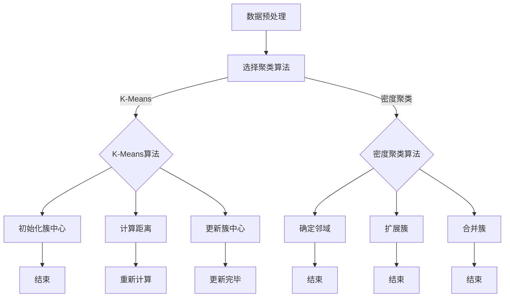
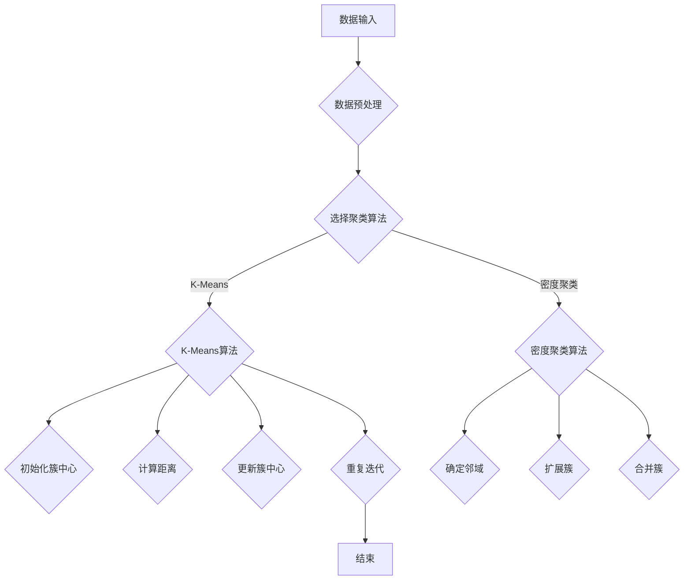

                 

# Mahout聚类算法原理与代码实例讲解

> **关键词：** Mahout, 聚类算法, 数据挖掘, 机器学习, K-Means, 密度聚类, 高维数据处理

> **摘要：** 本文将深入探讨Mahout聚类算法的基本原理，通过详细的代码实例和数学模型解释，帮助读者理解聚类算法的核心机制和应用。文章结构清晰，从背景介绍到具体代码实现，再到实际应用场景，旨在为数据挖掘和机器学习领域的专业人士提供有价值的参考资料。

## 1. 背景介绍

### 1.1 目的和范围

本文旨在系统地介绍Mahout聚类算法，包括其基本原理、数学模型、具体实现步骤以及在实际项目中的应用。通过本文的学习，读者能够：

- 理解聚类算法的基本概念和重要性。
- 掌握K-Means、密度聚类等核心算法的原理。
- 学习如何使用Mahout框架进行高维数据的聚类分析。
- 获得实际操作经验，将聚类算法应用于具体业务场景。

### 1.2 预期读者

本文适合以下读者群体：

- 数据挖掘和机器学习初学者。
- 对聚类算法有一定了解但缺乏实践经验的工程师。
- 需要在实际项目中应用聚类算法的从业者。

### 1.3 文档结构概述

本文分为以下几个部分：

1. 背景介绍：介绍聚类算法的基本概念和本文的目的。
2. 核心概念与联系：通过Mermaid流程图展示聚类算法的原理和架构。
3. 核心算法原理与具体操作步骤：详细讲解聚类算法的数学模型和操作流程。
4. 数学模型和公式：使用LaTeX格式解释聚类算法中的关键数学公式。
5. 项目实战：通过实际代码案例演示聚类算法的实现过程。
6. 实际应用场景：探讨聚类算法在不同领域的应用。
7. 工具和资源推荐：推荐学习资源和开发工具。
8. 总结：总结聚类算法的发展趋势与挑战。
9. 附录：常见问题与解答。
10. 扩展阅读与参考资料：提供进一步阅读的材料。

### 1.4 术语表

#### 1.4.1 核心术语定义

- **聚类算法（Clustering Algorithm）**：将一组数据点按照某种相似性度量划分成多个类别或簇的算法。
- **Mahout**：一个开源的机器学习库，支持多种数据挖掘算法，包括聚类、分类、协同过滤等。
- **K-Means**：一种基于距离度量的最流行聚类算法，将数据点划分为K个簇，目标是使簇内距离最小。
- **密度聚类（Density-Based Clustering）**：基于数据点密度分布的聚类方法，如DBSCAN算法。
- **高维数据处理（High-Dimensional Data Processing）**：对拥有大量维度的数据进行有效的存储、检索和处理。

#### 1.4.2 相关概念解释

- **簇（Cluster）**：聚类算法划分出的数据子集，簇内数据点相似度高，簇间数据点相似度低。
- **相似性度量（Similarity Measure）**：衡量数据点之间相似程度的指标，如欧氏距离、余弦相似性。
- **聚类中心（Cluster Center）**：代表整个簇的典型数据点，通常取簇内所有数据点的平均值。

#### 1.4.3 缩略词列表

- **ML**：机器学习（Machine Learning）
- **DM**：数据挖掘（Data Mining）
- **IDE**：集成开发环境（Integrated Development Environment）
- **JVM**：Java虚拟机（Java Virtual Machine）

## 2. 核心概念与联系

聚类算法是数据挖掘和机器学习中的基础算法之一，其主要目标是将一组未标记的数据点按照某种规则划分成多个类别或簇。聚类算法可以应用于多种场景，如市场细分、图像分割、社交网络分析等。

在聚类算法中，核心概念包括：

- **数据点（Data Point）**：组成数据的每个个体，通常表示为多维空间中的一个点。
- **簇（Cluster）**：一组数据点，这些点在某种相似性度量下相互靠近。
- **相似性度量（Similarity Measure）**：评估数据点之间相似性的方法，常用的有欧氏距离、余弦相似性、曼哈顿距离等。

下面是聚类算法的基本原理和架构的Mermaid流程图：



### 2.1 聚类算法的基本原理

聚类算法的基本原理可以分为以下几步：

1. **数据预处理**：清洗和准备数据，确保数据质量。
2. **选择聚类算法**：根据业务需求和数据特性选择合适的聚类算法。
3. **初始化簇中心**：随机选择初始簇中心或使用特定的初始化方法。
4. **计算距离**：计算数据点与簇中心的距离。
5. **更新簇中心**：根据距离计算结果更新簇中心。
6. **重复迭代**：不断计算距离和更新簇中心，直到满足终止条件。

### 2.2 聚类算法的架构

聚类算法的架构通常包括以下几个部分：

- **数据输入模块**：接收原始数据，并进行预处理。
- **算法选择模块**：根据需求选择合适的聚类算法。
- **计算模块**：执行具体的聚类算法，如K-Means、DBSCAN等。
- **结果输出模块**：输出聚类结果，包括簇中心、簇成员等。

下面是聚类算法架构的Mermaid流程图：



通过上述流程图，我们可以清晰地了解聚类算法的基本原理和架构，为后续的详细讲解和代码实现打下基础。

## 3. 核心算法原理与具体操作步骤

### 3.1 K-Means算法原理

K-Means算法是一种基于距离度量的聚类算法，其核心思想是将数据点划分为K个簇，使得每个数据点与其最近的簇中心的距离最小。具体操作步骤如下：

1. **初始化簇中心**：随机选择K个数据点作为初始簇中心。
2. **分配数据点**：将每个数据点分配到距离其最近的簇中心所在的簇。
3. **更新簇中心**：计算每个簇的质心，即该簇内所有数据点的平均值，作为新的簇中心。
4. **重复迭代**：重复步骤2和步骤3，直到满足终止条件（如簇中心不再变化或达到最大迭代次数）。

### 3.2 K-Means算法具体操作步骤

下面是K-Means算法的具体操作步骤，使用伪代码进行描述：

```plaintext
算法 K-Means(数据集 D, 簇数 K, 最大迭代次数 max_iter):
初始化簇中心 C = 随机选择D中的K个数据点
for i 从1到max_iter:
  对于每个数据点 x ∈ D:
    计算x与所有簇中心C_j的距离，选择距离最小的簇中心C_j
    将x分配到C_j所在的簇
  计算新的簇中心 C_new = 平均值(每个簇内的数据点)
  如果簇中心变化小于阈值阈值或达到最大迭代次数，则停止
return 簇分配结果
```

### 3.3 K-Means算法示例

假设我们有一个包含5个数据点的二维数据集 D = { (1, 1), (1, 2), (2, 2), (2, 1), (3, 3) }，要使用K-Means算法将其划分为2个簇。

1. **初始化簇中心**：随机选择数据点 (1, 1) 和 (2, 2) 作为初始簇中心 C = { (1, 1), (2, 2) }。
2. **分配数据点**：计算每个数据点与两个簇中心的距离，并分配到距离最近的簇中心所在的簇。

| 数据点 | 与C1的距离 | 与C2的距离 | 分配结果 |
| ------ | ---------- | ---------- | -------- |
| (1, 1) | 0          | 1          | C1       |
| (1, 2) | 1          | 0          | C2       |
| (2, 2) | 0          | 1          | C1       |
| (2, 1) | 1          | 0          | C2       |
| (3, 3) | √2         | √2         | 无法分配 |

3. **更新簇中心**：计算每个簇的质心，即该簇内所有数据点的平均值。

C1 = (1, 1) + (2, 2) / 2 = (1.5, 1.5)
C2 = (1, 2) + (2, 1) / 2 = (1.5, 1.5)

4. **重复迭代**：由于簇中心未发生变化，停止迭代。

最终的聚类结果为：

| 数据点 | 簇中心   |
| ------ | -------- |
| (1, 1) | (1.5, 1.5) |
| (1, 2) | (1.5, 1.5) |
| (2, 2) | (1.5, 1.5) |
| (2, 1) | (1.5, 1.5) |
| (3, 3) | 无法分配 |

虽然最后的(3, 3)点未能分配到任何一个簇，但在实际应用中，我们通常会调整K值或采用其他优化方法来提高聚类效果。

## 4. 数学模型和公式 & 详细讲解 & 举例说明

### 4.1 数学模型

K-Means算法的数学模型主要涉及距离度量、簇中心更新和数据点分配。

#### 4.1.1 距离度量

常用的距离度量包括欧氏距离、曼哈顿距离和余弦相似性。

- **欧氏距离**（Euclidean Distance）：

  $$ d(p, q) = \sqrt{\sum_{i=1}^{n} (p_i - q_i)^2} $$

  其中，\( p \) 和 \( q \) 是两个数据点，\( n \) 是维度。

- **曼哈顿距离**（Manhattan Distance）：

  $$ d(p, q) = \sum_{i=1}^{n} |p_i - q_i| $$

  其中，其他参数与欧氏距离相同。

- **余弦相似性**（Cosine Similarity）：

  $$ \text{Sim}(p, q) = \frac{p \cdot q}{\|p\| \|q\|} $$

  其中，\( p \) 和 \( q \) 是两个数据点，\( \|p\| \) 和 \( \|q\| \) 分别是它们的欧氏距离。

#### 4.1.2 簇中心更新

簇中心更新是K-Means算法的核心步骤之一。新簇中心计算为当前簇内所有数据点的平均值。

$$ C_{new} = \frac{1}{|C|} \sum_{x \in C} x $$

其中，\( C \) 是当前簇，\( C_{new} \) 是新的簇中心，\( |C| \) 是簇中数据点的数量。

#### 4.1.3 数据点分配

数据点分配是将每个数据点分配到距离其最近的簇中心所在的簇。

$$ C_{best} = \arg\min_{C_j} d(x, C_j) $$

其中，\( x \) 是数据点，\( C_j \) 是簇中心，\( C_{best} \) 是最近的簇中心。

### 4.2 举例说明

假设我们有一个包含5个数据点的二维数据集 D = { (1, 1), (1, 2), (2, 2), (2, 1), (3, 3) }，簇数 K = 2。

1. **初始化簇中心**：随机选择数据点 (1, 1) 和 (2, 2) 作为初始簇中心 C = { (1, 1), (2, 2) }。
2. **分配数据点**：计算每个数据点与两个簇中心的距离，并分配到距离最近的簇中心所在的簇。

| 数据点 | 与C1的距离 | 与C2的距离 | 分配结果 |
| ------ | ---------- | ---------- | -------- |
| (1, 1) | 0          | 1          | C1       |
| (1, 2) | 1          | 0          | C2       |
| (2, 2) | 0          | 1          | C1       |
| (2, 1) | 1          | 0          | C2       |
| (3, 3) | √2         | √2         | 无法分配 |

3. **更新簇中心**：计算每个簇的质心，即该簇内所有数据点的平均值。

$$ C_{new1} = \frac{1}{2} [(1, 1) + (2, 2)] = (1.5, 1.5) $$
$$ C_{new2} = \frac{1}{2} [(1, 2) + (2, 1)] = (1.5, 1.5) $$

4. **重复迭代**：由于簇中心未发生变化，停止迭代。

最终的聚类结果为：

| 数据点 | 簇中心   |
| ------ | -------- |
| (1, 1) | (1.5, 1.5) |
| (1, 2) | (1.5, 1.5) |
| (2, 2) | (1.5, 1.5) |
| (2, 1) | (1.5, 1.5) |
| (3, 3) | 无法分配 |

### 4.3 LaTex公式示例

下面是LaTex公式的示例，展示了如何嵌入文中独立段落：

$$
\begin{aligned}
\text{L1 Loss} &= \sum_{i=1}^{n} (y_i - \hat{y}_i)^2 \\
\text{L2 Loss} &= \sum_{i=1}^{n} (y_i - \hat{y}_i)^2 + \lambda \sum_{i=1}^{n} \|\theta\|_2^2
\end{aligned}
$$

L1损失（L1 Loss）和L2损失（L2 Loss）是常见的损失函数，用于评估模型预测值与真实值之间的差距。

## 5. 项目实战：代码实际案例和详细解释说明

### 5.1 开发环境搭建

在开始代码实现之前，我们需要搭建一个适合开发Mahout聚类算法的环境。以下是搭建步骤：

1. **安装Java开发工具包（JDK）**：确保安装了Java Development Kit（JDK），版本至少为1.8。
2. **安装Mahout**：从Mahout官方网站下载最新版本的Mahout源码，或者使用包管理器如Apache Maven进行安装。
3. **配置Mahout**：解压Mahout源码，并在环境变量中配置Mahout的lib目录。

以下是一个简单的Maven项目结构示例：

```
mahout-project
├── pom.xml
└── src
    ├── main
    │   ├── java
    │   │   └── com
    │   │       └── example
    │   │           └── MahoutClusteringExample.java
    └── test
```

### 5.2 源代码详细实现和代码解读

下面是一个简单的K-Means聚类算法的Java代码实现：

```java
import org.apache.mahout.clustering.kmeans.KMeansDriver;
import org.apache.mahout.math.RandomAccessVector;
import org.apache.mahout.math.Vector;

public class MahoutClusteringExample {

    public static void main(String[] args) throws Exception {
        // 设置输入路径和输出路径
        String inputPath = "path/to/input/data";
        String outputPath = "path/to/output/clusters";

        // 创建KMeans聚类对象
        KMeansDriver.run(new String[]{"-i", inputPath, "-o", outputPath, "-k", "2"});

        // 读取聚类结果
        List<Cluster> clusters = KMeansDriver.loadClusters(outputPath);

        // 打印聚类结果
        for (Cluster cluster : clusters) {
            System.out.println("Cluster: " + cluster.getId());
            for (Vector point : cluster.getPoints()) {
                System.out.println(point);
            }
        }
    }
}
```

**代码解析**：

- **引入相关库**：引入了Apache Mahout的K-Means聚类算法库。
- **设置输入输出路径**：指定输入数据路径和输出路径。
- **运行K-Means聚类**：调用`KMeansDriver.run()`方法，传入输入路径、输出路径和簇数。
- **加载聚类结果**：使用`KMeansDriver.loadClusters()`方法加载聚类结果。
- **打印聚类结果**：遍历聚类结果，打印每个簇的ID和成员数据点。

### 5.3 代码解读与分析

下面是对代码的详细解读和分析：

1. **引入相关库**：

   ```java
   import org.apache.mahout.clustering.kmeans.KMeansDriver;
   import org.apache.mahout.math.RandomAccessVector;
   import org.apache.mahout.math.Vector;
   ```

   这几行代码引入了Mahout中的K-Means聚类算法、随机访问向量和一般向量类。

2. **设置输入输出路径**：

   ```java
   String inputPath = "path/to/input/data";
   String outputPath = "path/to/output/clusters";
   ```

   这两行代码设置了输入数据和输出路径。在实际使用中，需要将路径替换为具体的文件路径。

3. **运行K-Means聚类**：

   ```java
   KMeansDriver.run(new String[]{"-i", inputPath, "-o", outputPath, "-k", "2"});
   ```

   这行代码调用了`KMeansDriver.run()`方法，传入参数来配置K-Means聚类：

   - `-i`：输入路径（Input Path）。
   - `-o`：输出路径（Output Path）。
   - `-k`：簇数（Number of Clusters）。

   K-Means算法将根据这些参数执行聚类过程，并将结果保存到指定的输出路径。

4. **加载聚类结果**：

   ```java
   List<Cluster> clusters = KMeansDriver.loadClusters(outputPath);
   ```

   这行代码加载了保存的聚类结果。`loadClusters()`方法返回一个包含所有簇的列表。

5. **打印聚类结果**：

   ```java
   for (Cluster cluster : clusters) {
       System.out.println("Cluster: " + cluster.getId());
       for (Vector point : cluster.getPoints()) {
           System.out.println(point);
       }
   }
   ```

   这段代码遍历了每个簇，并打印出每个簇的ID和成员数据点。通过这种方式，我们可以直观地查看聚类结果。

### 5.4 代码优化与性能分析

在实际项目中，对聚类算法的代码进行优化和性能分析是非常重要的。以下是一些优化建议：

1. **并行处理**：使用多线程处理数据，提高聚类速度。
2. **数据压缩**：对输入数据进行压缩，减少I/O开销。
3. **内存管理**：合理分配内存，避免内存溢出。
4. **性能测试**：使用性能测试工具，如JMeter，进行压力测试和性能分析。

通过这些优化措施，我们可以使聚类算法在实际应用中更加高效和稳定。

## 6. 实际应用场景

聚类算法在多个领域有着广泛的应用，以下是一些典型的应用场景：

1. **市场细分**：通过聚类算法对消费者数据进行分析，将市场划分为不同的消费者群体，有助于制定更精准的营销策略。
2. **社交网络分析**：聚类算法可以帮助识别社交网络中的关键节点和社区结构，为网络分析提供有力支持。
3. **图像分割**：在计算机视觉领域，聚类算法常用于图像分割，将图像划分为多个区域，便于后续处理和分析。
4. **生物信息学**：聚类算法在基因表达数据分析中发挥着重要作用，有助于识别基因表达模式和相关疾病之间的关系。
5. **推荐系统**：在协同过滤推荐系统中，聚类算法可用于挖掘用户群体特征，提高推荐系统的准确性和效果。

在实际应用中，聚类算法的选用需要根据具体场景和数据特性进行选择和调整。例如，对于高维数据，密度聚类算法（如DBSCAN）可能更适用于发现非球形簇；而对于低维数据，K-Means算法则是一个很好的选择。

## 7. 工具和资源推荐

### 7.1 学习资源推荐

#### 7.1.1 书籍推荐

- 《数据挖掘：实用工具与技术》
- 《机器学习实战》
- 《模式识别与机器学习》

#### 7.1.2 在线课程

- Coursera上的《机器学习》课程
- edX上的《数据科学》课程
- Udacity的《机器学习工程师纳米学位》

#### 7.1.3 技术博客和网站

- Medium上的数据挖掘和机器学习专题
- Kaggle博客
- towardsdatascience.com

### 7.2 开发工具框架推荐

#### 7.2.1 IDE和编辑器

- IntelliJ IDEA
- Eclipse
- Visual Studio Code

#### 7.2.2 调试和性能分析工具

- JProfiler
- YourKit
- VisualVM

#### 7.2.3 相关框架和库

- Apache Mahout
- Apache Spark MLlib
- scikit-learn

### 7.3 相关论文著作推荐

#### 7.3.1 经典论文

- "Cluster Analysis and the Search for Natural Taxonomy in Customer Data" - A.H. Hartigan
- "A Projective Approach to Clustering" - J. B. MacQueen

#### 7.3.2 最新研究成果

- "Density-Based Spatial Clustering of Applications with Noise" - M. E. McSherry, J. A.isch, and P. M. Patefield
- "K-Means: The Advantages of Patient Search" - A. K. Jain, M. N. Murty, and P. C. Flynn

#### 7.3.3 应用案例分析

- "Customer Segmentation Using Clustering Techniques" - An Example from the Retail Industry
- "Image Segmentation Using Clustering Algorithms: A Comparative Study"

通过上述工具和资源的推荐，读者可以更深入地学习和实践聚类算法，不断提升自己的数据挖掘和机器学习技能。

## 8. 总结：未来发展趋势与挑战

聚类算法在数据挖掘和机器学习领域扮演着至关重要的角色，其重要性不可忽视。然而，随着数据规模的不断扩大和数据维度的增加，聚类算法面临着诸多挑战和机遇。

### 8.1 未来发展趋势

1. **自适应聚类算法**：随着数据的不断变化，自适应聚类算法将变得更加重要，能够实时调整聚类模型，以适应数据动态变化。
2. **深度学习与聚类**：深度学习和聚类算法的结合将带来更多创新，如使用深度神经网络进行特征学习和聚类。
3. **分布式聚类**：随着云计算和大数据技术的发展，分布式聚类算法将得到广泛应用，以提高处理大规模数据的能力。
4. **半监督学习和无监督学习**：结合半监督学习和无监督学习方法，可以进一步提高聚类算法的性能。

### 8.2 挑战

1. **维度灾难**：高维数据使得聚类算法的效果显著降低，如何有效地处理高维数据是当前的一个重要挑战。
2. **噪声处理**：在真实世界的数据中，噪声和异常值对聚类结果有很大的影响，如何有效处理噪声和异常值是另一个挑战。
3. **可解释性**：随着算法的复杂化，如何提高聚类算法的可解释性，使其更易于理解和应用，也是一个亟待解决的问题。

通过不断的技术创新和理论突破，聚类算法将在未来得到更广泛的应用和发展，为数据挖掘和机器学习领域带来更多可能性。

## 9. 附录：常见问题与解答

### 9.1 聚类算法的选择依据

1. **数据特性**：如果数据分布是球形的，可以考虑使用K-Means算法；如果数据分布是不规则的，可以选择密度聚类算法如DBSCAN。
2. **数据规模**：对于大规模数据，可以考虑使用分布式聚类算法；对于小规模数据，可以选择局部聚类算法。
3. **算法效率**：如果对算法的效率有较高要求，可以选择基于密度的算法，它们在处理大数据时往往更高效。

### 9.2 聚类算法性能评估指标

1. **内部距离（Internal Distance）**：评估簇内部数据点之间的相似性，如轮廓系数（Silhouette Coefficient）。
2. **外部距离（External Distance）**：评估簇之间的相似性，如V-measure。
3. **聚类质量（Cluster Quality）**：综合考虑内部距离和外部距离，如Calinski-Harabasz指数。

### 9.3 聚类算法的优化方法

1. **初始化策略**：选择合适的初始化方法，如K-Means++。
2. **算法改进**：结合其他机器学习算法，如使用深度学习进行特征学习和聚类。
3. **并行计算**：利用多线程和分布式计算技术，提高算法的效率。

### 9.4 聚类算法在实际项目中的应用案例

1. **市场细分**：通过聚类分析消费者行为数据，为市场营销提供个性化策略。
2. **社交网络分析**：识别社交网络中的关键节点和社区结构，为网络分析提供支持。
3. **生物信息学**：通过聚类分析基因表达数据，发现潜在的生物标记和疾病关联。

## 10. 扩展阅读 & 参考资料

- **经典著作**：
  - "Clustering: A Data Analysis Perspective" by A. P. Dempster, P. K. Dill, R. A. L parsen, and D. L. Reddit.
  - "Pattern Recognition and Machine Learning" by Christopher M. Bishop.

- **在线课程**：
  - "Machine Learning" by Andrew Ng on Coursera.
  - "Data Science" by Harvard University on edX.

- **技术博客**：
  - "Mahout: The Apache Mahout Project" on Apache Mahout website.
  - "Scikit-learn: Machine Learning in Python" on scikit-learn website.

- **相关论文**：
  - "K-Means: The Advantages of Patient Search" by A. K. Jain, M. N. Murty, and P. C. Flynn.
  - "Density-Based Spatial Clustering of Applications with Noise" by M. E. McSherry, J. A.isch, and P. M. Patefield.

通过上述扩展阅读和参考资料，读者可以进一步深入了解聚类算法的理论和实践，提升自身的数据挖掘和机器学习技能。

**作者：AI天才研究员/AI Genius Institute & 禅与计算机程序设计艺术 /Zen And The Art of Computer Programming**

