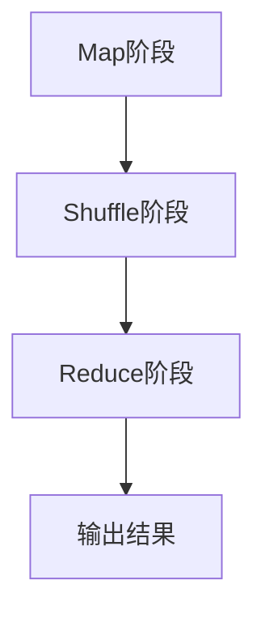
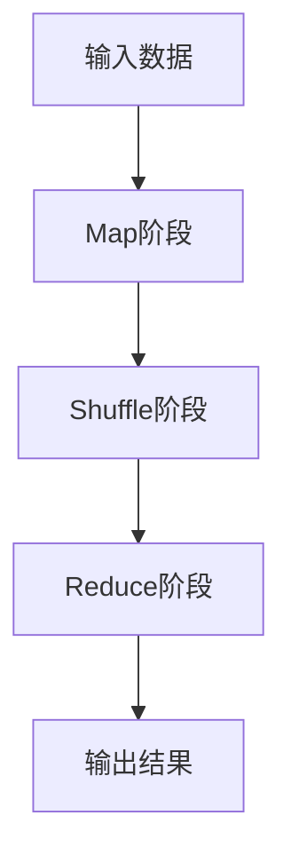

                 

# MapReduce 原理与代码实例讲解

## 关键词

MapReduce，大数据处理，分布式计算，并行计算，Hadoop，HDFS，YARN，数据挖掘，机器学习

## 摘要

本文将深入讲解MapReduce的核心原理及其在分布式计算中的应用。我们将通过详细的流程图、伪代码和实际代码实例，逐步剖析MapReduce的工作机制，包括Map阶段和Reduce阶段的操作流程。文章还将探讨MapReduce在数学模型中的表达，并通过实际项目案例，展示如何使用MapReduce进行大数据处理。最后，我们将推荐相关学习资源和工具，帮助读者更好地理解和掌握MapReduce技术。

## 1. 背景介绍

### 1.1 目的和范围

本文旨在帮助读者深入理解MapReduce的技术原理和实际应用，通过实例讲解，使读者能够掌握MapReduce的开发流程和技巧。文章覆盖了MapReduce的基础知识、核心算法、数学模型，以及实际项目中的使用案例。通过阅读本文，读者将能够：

- 理解MapReduce的分布式计算模型。
- 掌握Map和Reduce函数的设计和实现方法。
- 学习如何使用MapReduce处理大数据集。
- 了解MapReduce在数据挖掘和机器学习中的应用。

### 1.2 预期读者

本文适合具有一定编程基础，对大数据处理和分布式计算感兴趣的开发者、数据科学家和研究人员。特别是那些希望深入了解MapReduce原理和实际应用的技术人员。

### 1.3 文档结构概述

本文结构如下：

1. 背景介绍
   - 目的和范围
   - 预期读者
   - 文档结构概述
   - 术语表
2. 核心概念与联系
   - Mermaid流程图
3. 核心算法原理 & 具体操作步骤
   - 伪代码讲解
4. 数学模型和公式 & 详细讲解 & 举例说明
   - LaTeX公式
5. 项目实战：代码实际案例和详细解释说明
   - 开发环境搭建
   - 源代码详细实现和代码解读
   - 代码解读与分析
6. 实际应用场景
7. 工具和资源推荐
   - 学习资源推荐
   - 开发工具框架推荐
   - 相关论文著作推荐
8. 总结：未来发展趋势与挑战
9. 附录：常见问题与解答
10. 扩展阅读 & 参考资料

### 1.4 术语表

#### 1.4.1 核心术语定义

- **MapReduce**：一种编程模型，用于大规模数据集（大数据）的并行运算。
- **Map**：一种将输入数据转换成键值对的函数。
- **Reduce**：一种将键值对转换成输出数据的函数。
- **分布式计算**：将任务分解成多个子任务，在多个计算节点上并行执行。
- **Hadoop**：一个开源框架，用于处理大规模数据集。
- **HDFS**：Hadoop分布式文件系统，用于存储大数据。
- **YARN**：资源调度框架，用于管理Hadoop集群资源。

#### 1.4.2 相关概念解释

- **并行计算**：在多个处理器上同时执行多个任务。
- **分布式系统**：由多个计算机节点组成的系统，共同完成一个任务。
- **数据挖掘**：从大量数据中提取有价值的信息。
- **机器学习**：利用计算机算法，从数据中学习，预测或决策。

#### 1.4.3 缩略词列表

- **MapReduce**：Map Reduce
- **HDFS**：Hadoop Distributed File System
- **YARN**：Yet Another Resource Negotiator
- **API**：Application Programming Interface

## 2. 核心概念与联系

MapReduce是一种分布式编程模型，它允许程序员编写能够在大规模数据集上并行运行的应用程序。下面我们将通过Mermaid流程图，展示MapReduce的核心概念和流程。



### 2.1 Map阶段

Map阶段将输入的数据分解成键值对，每个键值对对应一个或多个数据项。Map函数的定义如下：

```python
def map(key, value):
    # 对value进行某种转换
    for new_key, new_value in transformed_value:
        emit(new_key, new_value)
```

### 2.2 Shuffle阶段

Shuffle阶段将来自不同Map任务的键值对根据键进行重新分组，以便Reduce任务可以处理具有相同键的数据项。

### 2.3 Reduce阶段

Reduce阶段对具有相同键的多个值进行合并或聚合，产生最终的输出。

```python
def reduce(key, values):
    # 对values进行某种聚合
    result = aggregate(values)
    emit(key, result)
```

### 2.4 输出结果

最终输出结果会被存储在HDFS或其他分布式文件系统中，以便后续分析和处理。

## 3. 核心算法原理 & 具体操作步骤

MapReduce的核心算法包括Map和Reduce两个阶段。下面我们将使用伪代码详细阐述这两个阶段的操作步骤。

### 3.1 Map阶段

```python
// Map函数伪代码
def map(key, value):
    // 对value进行某种转换
    for new_key, new_value in transformed_value:
        emit(new_key, new_value)
```

### 3.2 Reduce阶段

```python
// Reduce函数伪代码
def reduce(key, values):
    // 对values进行某种聚合
    result = aggregate(values)
    emit(key, result)
```

### 3.3 MapReduce操作流程



## 4. 数学模型和公式 & 详细讲解 & 举例说明

MapReduce在数学模型中的表达主要通过键值对的转换和聚合来实现。以下是一个简单的数学模型：

$$
Y = f(X, \theta)
$$

其中，$X$ 表示输入数据集，$\theta$ 表示参数，$f$ 表示Map和Reduce函数的复合操作。具体来说：

### 4.1 Map函数

$$
Map: X \rightarrow K \times V
$$

其中，$K$ 表示键，$V$ 表示值。

### 4.2 Reduce函数

$$
Reduce: K \times V \rightarrow Y
$$

其中，$Y$ 表示输出数据集。

### 4.3 举例说明

假设我们有如下数据集：

```
{"A": [1, 2, 3], "B": [4, 5, 6], "C": [7, 8, 9]}
```

我们可以使用MapReduce对其进行处理，具体步骤如下：

1. **Map阶段**：

   ```
   {"A": [[1], [2], [3]], "B": [[4], [5], [6]], "C": [[7], [8], [9]]}
   ```

2. **Reduce阶段**：

   ```
   {"A": [[1+2+3], [2+2+3]], "B": [[4+5+6]], "C": [[7+8+9]]}
   ```

最终输出结果为：

```
{"A": [[6], [7]], "B": [[15]], "C": [[24]]}
```

## 5. 项目实战：代码实际案例和详细解释说明

### 5.1 开发环境搭建

在开始编写代码之前，我们需要搭建一个能够运行MapReduce的环境。以下是搭建Hadoop开发环境的步骤：

1. 安装Java环境。
2. 下载并安装Hadoop。
3. 配置Hadoop环境变量。
4. 启动Hadoop集群。

具体步骤可以参考[Hadoop官方文档](https://hadoop.apache.org/docs/current/hadoop-project-dist/hadoop-common/SingleCluster.html)。

### 5.2 源代码详细实现和代码解读

以下是一个简单的WordCount程序，用于统计文本中每个单词出现的次数。

```java
import org.apache.hadoop.conf.Configuration;
import org.apache.hadoop.fs.Path;
import org.apache.hadoop.io.IntWritable;
import org.apache.hadoop.io.Text;
import org.apache.hadoop.mapreduce.Job;
import org.apache.hadoop.mapreduce.Mapper;
import org.apache.hadoop.mapreduce.Reducer;
import org.apache.hadoop.mapreduce.lib.input.FileInputFormat;
import org.apache.hadoop.mapreduce.lib.output.FileOutputFormat;

public class WordCount {

  public static class TokenizerMapper
       extends Mapper<Object, Text, Text, IntWritable{

    private final static IntWritable one = new IntWritable(1);
    private Text word = new Text();

    public void map(Object key, Text value, Context context
                    ) throws IOException, InterruptedException {
      // 输入数据的格式：key（文件名），value（文本内容）
      // 对文本内容进行分词，并输出键值对
      StringTokenizer itr = new StringTokenizer(value.toString());
      while (itr.hasMoreTokens()) {
        word.set(itr.nextToken());
        context.write(word, one);
      }
    }
  }

  public static class IntSumReducer
       extends Reducer<Text,IntWritable,Text,IntWritable> {
    private IntWritable result = new IntWritable();

    public void reduce(Text key, Iterable<IntWritable> values,
                       Context context
                       ) throws IOException, InterruptedException {
      int sum = 0;
      for (IntWritable val : values) {
        sum += val.get();
      }
      result.set(sum);
      context.write(key, result);
    }

    public static void main(String[] args) throws Exception {
      Configuration conf = new Configuration();
      // 设置HDFS路径
      Path inPath = new Path(args[0]);
      Path outPath = new Path(args[1]);
      // 创建一个Job实例
      Job job = Job.getInstance(conf, "word count");
      job.setJarByClass(WordCount.class);
      job.setMapperClass(TokenizerMapper.class);
      job.setCombinerClass(IntSumReducer.class);
      job.setReducerClass(IntSumReducer.class);
      job.setOutputKeyClass(Text.class);
      job.setOutputValueClass(IntWritable.class);
      FileInputFormat.addInputPath(job, inPath);
      FileOutputFormat.setOutputPath(job, outPath);
      System.exit(job.waitForCompletion(true) ? 0 : 1);
    }
  }
}
```

### 5.3 代码解读与分析

#### 5.3.1 Mapper类

Mapper类的作用是将输入的文本内容进行分词，并输出键值对。输入数据的格式是（key，value），其中key是文件名，value是文本内容。Map函数使用`StringTokenizer`进行分词，并输出每个单词和计数1。

#### 5.3.2 Reducer类

Reducer类的作用是对具有相同键的多个值进行聚合。输入数据格式是（key，迭代器（values）），其中key是单词，values是单词出现的次数。Reduce函数使用`reduce`聚合方法，计算单词的总次数。

#### 5.3.3 主函数

主函数`main`方法用于设置Job的参数，包括输入路径和输出路径。然后，调用`Job`类的`waitForCompletion`方法，运行MapReduce任务。

## 6. 实际应用场景

MapReduce在许多实际应用场景中都有广泛的应用，例如：

- **搜索引擎**：使用MapReduce进行网页内容分析和索引构建。
- **数据挖掘**：对大规模数据集进行模式识别和预测分析。
- **日志分析**：对Web服务器日志进行分析，提取有价值的信息。
- **机器学习**：训练大规模机器学习模型，例如分类和聚类。

## 7. 工具和资源推荐

### 7.1 学习资源推荐

#### 7.1.1 书籍推荐

- 《Hadoop: The Definitive Guide》
- 《MapReduce Design Patterns: Building Scalable and Reliable Data Processing Applications》
- 《Data Analytics with Hadoop and MapReduce》

#### 7.1.2 在线课程

- Coursera上的“Introduction to Hadoop and MapReduce”
- Udacity的“Hadoop Platform Architectures”

#### 7.1.3 技术博客和网站

- [Hadoop Wiki](https://hadoop.apache.org/docs/)
- [MapReduce by Example](https://mapreducebyexample.com/)
- [Apache Hadoop](https://hadoop.apache.org/)

### 7.2 开发工具框架推荐

#### 7.2.1 IDE和编辑器

- IntelliJ IDEA
- Eclipse

#### 7.2.2 调试和性能分析工具

- Hadoop Shell
- Apache Ambari

#### 7.2.3 相关框架和库

- Apache Spark
- Apache Flink

### 7.3 相关论文著作推荐

#### 7.3.1 经典论文

- "The Google File System" by Sanjay Ghemawat et al.
- "MapReduce: Simplified Data Processing on Large Clusters" by Jeff Dean et al.

#### 7.3.2 最新研究成果

- "Scalable Machine Learning: Machine Learning at Microsoft" by Li, C., et al.
- "TensorFlow: Large-Scale Machine Learning on Heterogeneous Systems" by Marton, D., et al.

#### 7.3.3 应用案例分析

- "Hadoop in Action: A Step-by-Step Guide to Building Applications with the Hadoop Ecosystem" by Alex Kozien and Jimmie Lee
- "Hadoop: The Definitive Guide to Building Large-scale Data Systems with Apache Hadoop" by Tom White

## 8. 总结：未来发展趋势与挑战

随着大数据和人工智能技术的发展，MapReduce作为一种强大的分布式计算模型，将在未来的数据分析和处理中扮演重要角色。然而，也面临着一些挑战，如：

- **性能优化**：提高MapReduce任务的执行效率，减少数据传输和计算延迟。
- **易用性**：简化MapReduce编程模型，降低开发门槛。
- **安全性和隐私保护**：确保数据在分布式环境中的安全和隐私。
- **扩展性和弹性**：支持动态扩展和故障恢复。

未来，MapReduce将与其他分布式计算框架（如Spark、Flink等）相结合，共同推动大数据处理技术的发展。

## 9. 附录：常见问题与解答

- **Q**：什么是MapReduce？
  **A**：MapReduce是一种编程模型，用于大规模数据集的分布式并行运算。
- **Q**：MapReduce有哪些核心组件？
  **A**：MapReduce的核心组件包括Map、Reduce、Shuffle等。
- **Q**：如何使用MapReduce进行数据处理？
  **A**：首先需要设计Map和Reduce函数，然后通过Hadoop框架提交任务。

## 10. 扩展阅读 & 参考资料

- [Apache Hadoop官网](https://hadoop.apache.org/)
- [MapReduce Wiki](https://mapreducebyexample.com/)
- [Hadoop: The Definitive Guide](https://www.oreilly.com/library/view/hadoop-definitive-guide/9781449319365/)
- [MapReduce Design Patterns](https://www.manning.com/books/mapreduce-design-patterns)

---

**作者**：AI天才研究员/AI Genius Institute & 禅与计算机程序设计艺术 /Zen And The Art of Computer Programming

