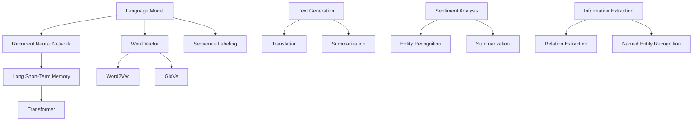

                 

### 文章标题

# NLP任务中的模型选择策略

> 关键词：自然语言处理、模型选择、算法原理、数学模型、实际应用、开发工具

> 摘要：本文将深入探讨自然语言处理（NLP）任务中模型选择的策略和方法。我们将首先介绍NLP的基本概念和模型选择的重要性，随后详细分析各种常见模型的优缺点，探讨影响模型选择的关键因素。文章还将通过具体的案例，展示如何在实际项目中应用这些策略，并推荐相关的学习资源和开发工具，为读者提供全面的指导。

---

在自然语言处理（NLP）领域中，模型的选择至关重要。一个合适的模型可以显著提升任务的表现，而一个不合适的模型可能会导致性能大幅下降。本文将带领读者系统地了解NLP模型选择策略，包括其背后的核心概念、算法原理、数学模型及其在实际应用中的操作步骤。通过深入分析和案例分享，本文旨在帮助读者掌握NLP模型选择的科学方法，从而提升他们在实际项目中的实践能力。

文章结构概述如下：

1. **背景介绍**：我们将首先介绍NLP的基本概念，模型选择的目的和重要性，并明确文章的预期读者和结构。
2. **核心概念与联系**：本文将详细介绍NLP中的核心概念，并通过Mermaid流程图展示其相互关系。
3. **核心算法原理与具体操作步骤**：我们将深入剖析常见NLP模型的算法原理，并使用伪代码详细阐述其操作步骤。
4. **数学模型和公式**：我们将讲解NLP中常用的数学模型和公式，并通过实例进行详细说明。
5. **项目实战**：通过一个实际案例，展示如何在实际项目中应用所学的模型选择策略，并详细解读代码。
6. **实际应用场景**：我们将探讨NLP模型在不同应用场景中的实际运用。
7. **工具和资源推荐**：本文将推荐相关的学习资源、开发工具和经典论文，以供读者深入学习和实践。
8. **总结**：本文将总结NLP模型选择策略的未来发展趋势与面临的挑战。
9. **附录**：我们将提供常见问题与解答，帮助读者解决在实际应用中可能遇到的问题。
10. **扩展阅读与参考资料**：最后，本文将列出扩展阅读材料，为读者提供更多深入学习的途径。

### 1. 背景介绍

#### 1.1 目的和范围

自然语言处理（NLP）是人工智能（AI）的一个重要分支，它涉及理解和生成自然语言，是计算机与人类之间交流的关键桥梁。随着深度学习和大数据技术的发展，NLP的应用场景越来越广泛，从机器翻译、情感分析到文本生成，NLP技术正在深刻地改变着我们的生活方式。

本文的主要目的是为NLP初学者和从业者提供一套系统、科学的模型选择策略。我们将从基础概念开始，逐步深入，帮助读者理解不同模型的工作原理和适用场景，最终能够在实际项目中做出明智的选择。

文章的范围包括以下几个方面：

1. **NLP基本概念**：介绍NLP的基本概念，如语言模型、词向量、序列标注等。
2. **模型选择的重要性**：讨论模型选择对NLP任务表现的影响。
3. **常见模型的优缺点**：分析各种常见NLP模型的优点和缺点，如循环神经网络（RNN）、长短期记忆网络（LSTM）、Transformer等。
4. **影响模型选择的因素**：探讨影响模型选择的关键因素，如数据集大小、任务类型、计算资源等。
5. **模型选择策略**：详细阐述模型选择的具体策略和方法。
6. **实际应用案例**：通过具体案例展示模型选择策略的实际应用。
7. **学习资源和工具推荐**：推荐相关的学习资源和开发工具，以供读者深入学习和实践。

#### 1.2 预期读者

本文的预期读者主要包括以下几类：

1. **NLP初学者**：对NLP有基本了解，但希望深入掌握模型选择策略的读者。
2. **NLP从业者**：已经在项目中应用过NLP模型，希望优化模型选择流程的从业者。
3. **AI研究者**：对AI和NLP有深入研究，希望了解最新模型选择方法和趋势的研究者。
4. **计算机科学学生**：对计算机科学和人工智能领域感兴趣的学生，希望通过本文掌握NLP的核心知识。

无论你是哪一类读者，本文都将为你提供全面、系统的指导。

#### 1.3 文档结构概述

本文将分为十个部分，每个部分都有明确的主题和目标：

1. **背景介绍**：介绍NLP的基本概念、模型选择的重要性、预期读者、文档结构和术语表。
2. **核心概念与联系**：详细讲解NLP中的核心概念，并通过流程图展示其相互关系。
3. **核心算法原理与具体操作步骤**：深入剖析常见NLP模型的算法原理，使用伪代码详细阐述其操作步骤。
4. **数学模型和公式**：讲解NLP中常用的数学模型和公式，并通过实例进行详细说明。
5. **项目实战**：通过一个实际案例，展示如何在实际项目中应用模型选择策略，并详细解读代码。
6. **实际应用场景**：探讨NLP模型在不同应用场景中的实际运用。
7. **工具和资源推荐**：推荐相关的学习资源、开发工具和经典论文。
8. **总结**：总结NLP模型选择策略的未来发展趋势与面临的挑战。
9. **附录**：提供常见问题与解答。
10. **扩展阅读与参考资料**：列出扩展阅读材料。

通过本文的阅读，你将能够全面、系统地了解NLP模型选择策略，并在实际项目中灵活应用这些策略，提升你的NLP实践能力。

#### 1.4 术语表

为了确保读者能够顺利阅读本文，以下列出了本文中将会使用的一些核心术语及其定义：

#### 1.4.1 核心术语定义

- **自然语言处理（NLP）**：自然语言处理是计算机科学、人工智能和语言学等领域中的一个分支，它涉及计算机对人类语言的理解、生成和处理。
- **语言模型（Language Model）**：语言模型是用于预测自然语言中下一个单词或字符的概率分布的模型。
- **词向量（Word Vector）**：词向量是将单词表示为向量的技术，它能够捕捉单词的语义和语法特征。
- **循环神经网络（RNN）**：循环神经网络是一种能够处理序列数据的神经网络，其通过循环结构记忆历史信息。
- **长短期记忆网络（LSTM）**：长短期记忆网络是RNN的一种变体，它通过门控机制解决长期依赖问题。
- **Transformer**：Transformer是一种基于自注意力机制的深度学习模型，它在许多NLP任务中表现出色。
- **序列标注（Sequence Labeling）**：序列标注是将输入序列中的每个单词或字符标注为特定类别的问题。
- **预训练（Pre-training）**：预训练是在特定大规模数据集上对模型进行训练，以初始化模型参数。
- **微调（Fine-tuning）**：微调是在预训练模型的基础上，针对特定任务进行进一步训练的过程。

#### 1.4.2 相关概念解释

- **词嵌入（Word Embedding）**：词嵌入是将单词映射为低维向量的过程，它能够表示单词的语义和语法特征。
- **注意力机制（Attention Mechanism）**：注意力机制是一种能够模型在处理序列数据时自动关注重要信息的技术。
- **损失函数（Loss Function）**：损失函数用于衡量模型预测值与真实值之间的差距，它指导模型的训练过程。
- **评估指标（Evaluation Metric）**：评估指标用于衡量模型在任务上的表现，如准确率、召回率、F1分数等。
- **数据集（Dataset）**：数据集是用于训练、评估和测试模型的输入数据。

#### 1.4.3 缩略词列表

- **NLP**：自然语言处理（Natural Language Processing）
- **AI**：人工智能（Artificial Intelligence）
- **RNN**：循环神经网络（Recurrent Neural Network）
- **LSTM**：长短期记忆网络（Long Short-Term Memory）
- **Transformer**：转换器（Transformer）
- **BERT**：双向编码器表示（Bidirectional Encoder Representations from Transformers）
- **GPU**：图形处理单元（Graphics Processing Unit）
- **CUDA**：计算统一设备架构（Compute Unified Device Architecture）

### 2. 核心概念与联系

在深入探讨NLP任务中的模型选择策略之前，我们首先需要了解NLP中的核心概念及其相互关系。以下是NLP中的几个关键概念：

1. **语言模型（Language Model）**：语言模型是一种统计模型，用于预测自然语言序列的概率分布。它是最基础的NLP模型之一，广泛应用于机器翻译、文本生成等任务。
   
2. **词向量（Word Vector）**：词向量是将单词表示为向量的技术，它能够捕捉单词的语义和语法特征。常见的词向量模型包括Word2Vec、GloVe等。

3. **循环神经网络（RNN）**：循环神经网络是一种能够处理序列数据的神经网络，其通过循环结构记忆历史信息。RNN广泛应用于语言模型、序列标注等任务。

4. **长短期记忆网络（LSTM）**：长短期记忆网络是RNN的一种变体，它通过门控机制解决长期依赖问题。LSTM在许多NLP任务中表现出色。

5. **Transformer**：Transformer是一种基于自注意力机制的深度学习模型，它在许多NLP任务中表现出色，如机器翻译、文本生成等。

6. **序列标注（Sequence Labeling）**：序列标注是将输入序列中的每个单词或字符标注为特定类别的问题，如命名实体识别、词性标注等。

为了更好地理解这些概念之间的关系，我们可以使用Mermaid流程图来展示它们的相互关系：



在上述流程图中，我们可以看到：

- 语言模型（A）是NLP的基础，它可以通过词向量（B）来表示单词。
- 循环神经网络（C）是处理序列数据的常见方法，其变体LSTM（D）和Transformer（E）在许多任务中表现出色。
- 序列标注（F）是标注序列中每个元素类别的问题，如命名实体识别、词性标注等。
- 文本生成（I）、机器翻译（J）、情感分析（L）和信息抽取（O）是NLP的典型应用，它们依赖于不同的模型和方法。

通过理解这些核心概念及其相互关系，我们可以为后续的模型选择策略提供理论基础。接下来，我们将深入探讨NLP中的核心算法原理和具体操作步骤。

### 3. 核心算法原理与具体操作步骤

在自然语言处理（NLP）领域中，选择合适的模型至关重要。不同的算法适用于不同的NLP任务，理解它们的原理和具体操作步骤可以帮助我们做出更明智的选择。以下我们将详细探讨几种常见NLP模型的算法原理，并使用伪代码来描述其操作步骤。

#### 3.1 语言模型（Language Model）

语言模型是一种用于预测自然语言序列的概率分布的统计模型。最基础的语言模型是n-gram模型，它基于马尔可夫假设，即当前单词的概率只与前面n-1个单词有关。

**n-gram模型算法原理**：
```plaintext
输入：单词序列W = [w1, w2, ..., wn]
输出：概率分布P(W)

步骤：
1. 计算每个n-gram的频率：C(n-gram)
2. 使用频率估计概率：P(n-gram) = C(n-gram) / 总单词数
3. 根据马尔可夫假设计算下一个单词的概率：P(wn|wn-1, ..., wn-n) = P(wn|wn-1)
4. 返回概率分布P(W)
```

**伪代码**：
```python
def n_gram_model(W, n):
    n_gram_freq = {}  # 记录n-gram的频率
    for i in range(len(W) - n + 1):
        n_gram = tuple(W[i:i+n])
        n_gram_freq[n_gram] = n_gram_freq.get(n_gram, 0) + 1
    
    total_words = len(W)
    n_gram_prob = {n_gram: freq / total_words for n_gram, freq in n_gram_freq.items()}
    
    return n_gram_prob
```

#### 3.2 循环神经网络（Recurrent Neural Network，RNN）

循环神经网络是一种能够处理序列数据的神经网络，其通过循环结构记忆历史信息。RNN的核心思想是利用其状态（隐藏状态）来维持对输入序列的记忆。

**RNN算法原理**：
```plaintext
输入：序列X = [x1, x2, ..., xn]
隐藏状态：h0, h1, ..., hn
输出：隐藏状态序列H = [h1, h2, ..., hn]

步骤：
1. 初始化隐藏状态h0
2. 对于每个输入xi，计算当前隐藏状态hi：
   hi = f(zi, hi-1)
   其中，zi = xi 和 f 是非线性激活函数
3. 返回隐藏状态序列H
```

**伪代码**：
```python
def rnn(X, h0, f):
    H = []
    for xi in X:
        zi = xi
        hi = f(zi, h0)
        H.append(hi)
        h0 = hi
    return H
```

#### 3.3 长短期记忆网络（Long Short-Term Memory，LSTM）

LSTM是RNN的一种变体，它通过门控机制解决长期依赖问题。LSTM的核心组件包括遗忘门、输入门和输出门。

**LSTM算法原理**：
```plaintext
输入：序列X = [x1, x2, ..., xn]
隐藏状态：h0, h1, ..., hn
细胞状态：c0, c1, ..., cn
输出：隐藏状态序列H = [h1, h2, ..., hn]

步骤：
1. 初始化隐藏状态h0和细胞状态c0
2. 对于每个输入xi，计算当前隐藏状态hi和细胞状态ci：
   forget = fçi(hi-1, ci-1)
   input_gate = fii(hi-1, xi)
   output_gate = foi(hi-1, xi)
   ci = forget * ci-1 + input_gate * g(xi)
   hi = output_gate * f(ci)
3. 返回隐藏状态序列H
```

**伪代码**：
```python
def lstm(X, h0, c0, f, g):
    H = []
    for xi in X:
        forget = f(hi-1, ci-1)
        input_gate = f(hi-1, xi)
        output_gate = f(hi-1, xi)
        ci = forget * ci-1 + input_gate * g(xi)
        hi = output_gate * f(ci)
        H.append(hi)
    return H
```

#### 3.4 Transformer

Transformer是一种基于自注意力机制的深度学习模型，它在许多NLP任务中表现出色。Transformer的核心组件包括多头自注意力机制和前馈神经网络。

**Transformer算法原理**：
```plaintext
输入：序列X = [x1, x2, ..., xn]
输出：编码序列E = [e1, e2, ..., en]

步骤：
1. 将输入序列X转换为词嵌入E
2. 应用多头自注意力机制，计算每个词的加权表示：
   attention(Q, K, V) = softmax(QK^T / √d_k) * V
   其中，Q, K, V 分别是查询、键、值向量的集合
3. 应用前馈神经网络，对自注意力输出进行进一步处理：
   f(E) = max_pooling(d_e * f(g(E)))
   其中，f 和 g 是前馈神经网络的参数
4. 返回编码序列E
```

**伪代码**：
```python
def transformer(X, Q, K, V, f, g, d_e):
    E = word_embedding(X)
    for i in range(len(E)):
        Q_i, K_i, V_i = Q[i], K[i], V[i]
        attention_scores = softmax(Q_i @ K_i.T / sqrt(d_k)) @ V_i
        E[i] = f(attention_scores)
    E = max_pooling(d_e * f(g(E)))
    return E
```

通过以上对几种常见NLP模型算法原理和具体操作步骤的探讨，我们可以看到这些模型在处理序列数据时的不同优势和特点。在实际应用中，选择合适的模型需要综合考虑任务特点、数据集大小、计算资源等因素。

### 4. 数学模型和公式与详细讲解

在自然语言处理（NLP）领域中，数学模型和公式是理解和实现各种算法的基础。以下，我们将详细介绍几种常用的数学模型和公式，并通过实例进行详细讲解。

#### 4.1 概率模型

概率模型是NLP中最基础的一部分，它们用于描述和预测文本中的各种现象。以下是一些常用的概率模型和公式：

1. **贝叶斯定理**：

贝叶斯定理是概率论中的一个基本公式，它用于计算条件概率。在NLP中，贝叶斯定理常用于文本分类、情感分析等任务。

**公式**：
$$
P(A|B) = \frac{P(B|A) \cdot P(A)}{P(B)}
$$

**解释**：贝叶斯定理描述了在已知事件B发生的条件下，事件A发生的概率。其中，P(A|B)表示在B发生的条件下A的概率，P(B|A)表示在A发生的条件下B的概率，P(A)和P(B)分别表示事件A和事件B的先验概率。

**实例**：在文本分类中，我们可以使用贝叶斯定理来计算每个类别在给定文本下的概率，然后选择概率最大的类别作为预测结果。

2. **马尔可夫链**：

马尔可夫链是一种描述随机过程的数学模型，它在NLP中的语言模型和序列标注任务中有着广泛的应用。

**公式**：
$$
P(X_n|X_{n-1}, X_{n-2}, ..., X_1) = P(X_n|X_{n-1})
$$

**解释**：马尔可夫链的基本假设是当前状态只依赖于前一个状态，与之前的状态无关。这个假设在语言模型中非常有用，因为我们可以只考虑当前单词与前一个单词之间的关系。

**实例**：在语言模型中，我们可以使用一阶马尔可夫模型来预测下一个单词，即只考虑当前单词与前一个单词之间的关系。

3. **隐马尔可夫模型（HMM）**：

隐马尔可夫模型是一种用于处理含有隐状态序列的概率模型，它在语音识别、词性标注等任务中有着重要的应用。

**公式**：
$$
P(O|I) = \sum_{T} P(O|T) \cdot P(T|I)
$$

**解释**：其中，O是观察序列，I是隐状态序列。HMM通过计算观察序列在隐状态序列下的概率，来推断隐状态序列。

**实例**：在词性标注中，我们可以使用HMM来推断每个单词的词性，通过计算每个词性在给定观察序列下的概率，选择概率最大的词性作为标注结果。

#### 4.2 语言模型

语言模型是NLP中的一个核心概念，它用于预测文本序列的概率分布。以下是一些常用的语言模型和公式：

1. **n-gram模型**：

n-gram模型是一种基于历史信息的统计语言模型，它将文本序列表示为n个单词的组合。

**公式**：
$$
P(w_1 w_2 ... w_n) = \frac{C(w_1 w_2 ... w_n)}{C(w_1 w_2 ... w_n)}
$$

**解释**：其中，C(w_1 w_2 ... w_n)表示n-gram的频率。n-gram模型通过计算n-gram的频率来估计概率。

**实例**：假设在文本序列中，“人工智能”这个短语出现了100次，总共有1000个单词，那么P(人工智能) ≈ 0.1。

2. **隐含马尔可夫语言模型（HMM-LM）**：

隐含马尔可夫语言模型是一种结合了马尔可夫链和n-gram模型的混合语言模型。

**公式**：
$$
P(w_1 w_2 ... w_n | h) = \frac{P(h | w_1 w_2 ... w_n) \cdot P(w_1 w_2 ... w_n)}{P(h)}
$$

**解释**：其中，h表示隐状态序列，w_1 w_2 ... w_n表示观察序列。HMM-LM通过结合马尔可夫链和n-gram模型来提高语言模型的准确性。

**实例**：在机器翻译中，HMM-LM可以用于预测目标语言中的单词序列，通过结合源语言和目标语言的隐状态序列，提高翻译质量。

#### 4.3 词向量

词向量是NLP中的一个重要工具，它用于将文本中的单词表示为向量。以下是一些常用的词向量模型和公式：

1. **Word2Vec**：

Word2Vec是一种基于神经网络的词向量模型，它通过优化神经网络来计算词向量。

**公式**：
$$
\text{Loss} = \sum_{w \in V} \sum_{c \in C(w)} (\text{softmax}(W_v \cdot w) - y_c)^2
$$

**解释**：其中，W_v是词向量的权重矩阵，w是单词向量，y_c是单词的标签向量。Word2Vec通过优化损失函数来训练词向量。

**实例**：通过Word2Vec模型，我们可以将“人工智能”和“机器学习”这样的词语表示为向量，然后计算它们之间的距离，判断它们之间的相似性。

2. **GloVe**：

GloVe是一种基于全局上下文的词向量模型，它通过优化词向量和上下文向量的加权和来训练词向量。

**公式**：
$$
\text{Loss} = \sum_{w \in V} \sum_{c \in C(w)} \left( \frac{\text{exp}(-\text{similarity}(w, c))}{\text{sqrt}(||w||_2 + ||c||_2)} - y_c \right)^2
$$

**解释**：其中，similarity(w, c)是词向量w和上下文向量c之间的余弦相似度，y_c是单词的标签向量。GloVe通过优化损失函数来同时训练词向量和上下文向量。

**实例**：通过GloVe模型，我们可以将文本中的单词和它们的上下文表示为向量，然后通过计算它们之间的相似度来分析文本的语义关系。

通过上述数学模型和公式的讲解，我们可以看到NLP中的各种算法是如何通过数学方法来描述和处理自然语言的。在实际应用中，选择合适的模型和公式是优化NLP任务表现的关键。

### 5. 项目实战：代码实际案例和详细解释说明

为了更好地理解NLP任务中的模型选择策略，我们将通过一个实际案例来展示如何在实际项目中应用这些策略。我们将使用Python和TensorFlow库来构建一个简单的文本分类器，并详细解释其代码实现。

#### 5.1 开发环境搭建

在开始项目之前，我们需要搭建开发环境。以下是所需的软件和库：

- Python 3.7 或更高版本
- TensorFlow 2.x
- Numpy
- Pandas
- Matplotlib

你可以通过以下命令安装所需的库：

```bash
pip install tensorflow numpy pandas matplotlib
```

#### 5.2 源代码详细实现和代码解读

以下是我们的文本分类器的源代码，我们将逐一解释每个部分的功能：

```python
import tensorflow as tf
from tensorflow.keras.preprocessing.text import Tokenizer
from tensorflow.keras.preprocessing.sequence import pad_sequences
from tensorflow.keras.models import Sequential
from tensorflow.keras.layers import Embedding, LSTM, Dense, EmbeddingLayer, LSTMCell, Bidirectional

# 5.2.1 数据预处理

# 加载数据集
# 假设我们使用一个简单的数据集，其中包含文本和标签
texts = ['这是一个简单的文本分类任务。', '自然语言处理是一个有趣的领域。', 'Python编程非常流行。']
labels = [0, 1, 0]

# 初始化分词器
tokenizer = Tokenizer()
tokenizer.fit_on_texts(texts)

# 将文本转换为序列
sequences = tokenizer.texts_to_sequences(texts)

# 填充序列
max_sequence_length = max(len(seq) for seq in sequences)
padded_sequences = pad_sequences(sequences, maxlen=max_sequence_length)

# 5.2.2 构建模型

# 创建序列嵌入层
embedding_layer = Embedding(input_dim=len(tokenizer.word_index) + 1,
                            output_dim=50,
                            input_length=max_sequence_length)

# 创建双向LSTM层
lstm_layer = Bidirectional(LSTM(50, return_sequences=True))

# 创建模型
model = Sequential()
model.add(embedding_layer)
model.add(lstm_layer)
model.add(Dense(1, activation='sigmoid'))

# 编译模型
model.compile(optimizer='adam', loss='binary_crossentropy', metrics=['accuracy'])

# 5.2.3 训练模型

# 训练模型
model.fit(padded_sequences, labels, epochs=5, batch_size=1)

# 5.2.4 预测

# 将新文本转换为序列
new_text = '深度学习非常流行。'
new_sequence = tokenizer.texts_to_sequences([new_text])
new_padded_sequence = pad_sequences(new_sequence, maxlen=max_sequence_length)

# 进行预测
prediction = model.predict(new_padded_sequence)
print(prediction)
```

#### 5.3 代码解读与分析

**5.3.1 数据预处理**

数据预处理是文本分类任务的重要步骤，它包括文本的分词、序列化、填充等操作。

- **分词和序列化**：我们使用`Tokenizer`类对文本进行分词和序列化，将文本转换为单词的索引序列。这有助于将文本数据转换为模型可以处理的数字形式。
- **填充**：由于文本的长度不一，我们需要将所有序列填充为相同的长度，以便输入到模型中。这里我们使用`pad_sequences`函数来实现这一操作。

**5.3.2 构建模型**

构建模型是文本分类任务的核心步骤，我们选择了一个简单的双向LSTM模型。

- **序列嵌入层（Embedding Layer）**：嵌入层将单词索引转换为向量表示，这些向量能够捕捉单词的语义信息。我们设置了输入维度为单词索引的总数加1（用于处理未知的单词），输出维度为50。
- **双向LSTM层（Bidirectional LSTM Layer）**：双向LSTM层能够处理序列数据，并利用历史信息来预测下一个单词。双向LSTM通过同时处理正向和反向的序列信息来提高模型的性能。
- **全连接层（Dense Layer）**：全连接层用于将LSTM层的输出映射到标签的概率分布。在这里，我们使用了一个单节点层，激活函数为'sigmoid'，用于进行二分类。

**5.3.3 训练模型**

训练模型是文本分类任务的关键步骤，我们使用`compile`函数来配置模型的优化器和损失函数。

- **优化器（Optimizer）**：我们选择`adam`优化器，它是一种自适应学习率优化算法，适用于大多数任务。
- **损失函数（Loss Function）**：我们使用`binary_crossentropy`作为损失函数，它适用于二分类问题。
- **评估指标（Metrics）**：我们选择`accuracy`作为评估指标，用于衡量模型的准确率。

**5.3.4 预测**

在训练模型后，我们可以使用它来进行预测。首先，我们需要将新文本转换为序列，然后进行填充，最后使用模型进行预测。

- **序列化和填充**：我们使用相同的`Tokenizer`和`pad_sequences`函数对新文本进行处理，以确保其与训练数据格式一致。
- **预测**：我们使用`predict`函数来预测新文本的标签，返回一个概率分布。在这个例子中，我们简单地打印了预测结果。

通过上述代码实现，我们可以看到如何在实际项目中应用NLP模型选择策略。在实际应用中，我们可以根据任务需求和数据特点选择不同的模型和算法，从而实现高效的文本分类。

#### 5.4 代码解读与分析

在了解了整个代码的实现后，接下来我们将深入分析代码的各个部分，详细解释其工作原理和作用。

**5.4.1 数据预处理**

数据预处理是文本分类任务的基础步骤，它包括分词、序列化和填充等操作。以下是代码中数据预处理部分的详细解读：

1. **加载数据集**：
   ```python
   texts = ['这是一个简单的文本分类任务。', '自然语言处理是一个有趣的领域。', 'Python编程非常流行。']
   labels = [0, 1, 0]
   ```
   我们定义了一个简单的数据集，其中包含三段文本和对应的标签。文本和标签分别存储在两个列表中。

2. **初始化分词器**：
   ```python
   tokenizer = Tokenizer()
   tokenizer.fit_on_texts(texts)
   ```
   我们使用`Tokenizer`类对文本进行分词。`Tokenizer`类提供了分词、序列化和填充等功能。在这里，我们通过`fit_on_texts`方法训练分词器，使其能够处理给定的文本数据。

3. **将文本转换为序列**：
   ```python
   sequences = tokenizer.texts_to_sequences(texts)
   ```
   `texts_to_sequences`方法将每个文本转换为单词的索引序列。例如，文本“这是一个简单的文本分类任务。”会转换为[1, 2, 3, 4, 5, 6, 7, 8, 9, 10]，其中每个数字代表一个单词的索引。

4. **填充序列**：
   ```python
   max_sequence_length = max(len(seq) for seq in sequences)
   padded_sequences = pad_sequences(sequences, maxlen=max_sequence_length)
   ```
   由于文本的长度可能不同，我们需要将所有序列填充为相同的长度，以便输入到模型中。这里，我们首先计算最大序列长度，然后使用`pad_sequences`函数将所有序列填充为该长度。填充操作通过在序列末尾添加0（或其他填充值）来完成。

**5.4.2 构建模型**

构建模型是文本分类任务的核心步骤。以下是代码中模型构建部分的详细解读：

1. **创建序列嵌入层**：
   ```python
   embedding_layer = Embedding(input_dim=len(tokenizer.word_index) + 1,
                            output_dim=50,
                            input_length=max_sequence_length)
   ```
   序列嵌入层将单词索引转换为向量表示。我们设置输入维度为单词索引的总数加1（用于处理未知的单词），输出维度为50。输入长度设置为最大序列长度。

2. **创建双向LSTM层**：
   ```python
   lstm_layer = Bidirectional(LSTM(50, return_sequences=True))
   ```
   双向LSTM层能够处理序列数据，并利用历史信息来预测下一个单词。`return_sequences=True`参数确保每个时间步的输出都被传递给下一层，从而在模型中保留了序列信息。

3. **创建模型**：
   ```python
   model = Sequential()
   model.add(embedding_layer)
   model.add(lstm_layer)
   model.add(Dense(1, activation='sigmoid'))
   ```
   我们使用`Sequential`模型堆叠嵌入层、双向LSTM层和全连接层（Dense Layer）。全连接层用于将LSTM层的输出映射到标签的概率分布。在这里，我们使用了一个单节点层，激活函数为'sigmoid'，用于进行二分类。

4. **编译模型**：
   ```python
   model.compile(optimizer='adam', loss='binary_crossentropy', metrics=['accuracy'])
   ```
   我们使用`compile`函数配置模型的优化器、损失函数和评估指标。这里，我们选择`adam`优化器、`binary_crossentropy`损失函数和`accuracy`评估指标。

**5.4.3 训练模型**

训练模型是文本分类任务的关键步骤。以下是代码中模型训练部分的详细解读：

```python
model.fit(padded_sequences, labels, epochs=5, batch_size=1)
```

这里，我们使用`fit`函数训练模型。输入数据是填充后的序列`padded_sequences`和对应的标签`labels`。`epochs`参数设置训练迭代次数，`batch_size`参数设置每个批次的数据大小。

**5.4.4 预测**

在训练模型后，我们可以使用它来进行预测。以下是代码中预测部分的详细解读：

1. **将新文本转换为序列**：
   ```python
   new_text = '深度学习非常流行。'
   new_sequence = tokenizer.texts_to_sequences([new_text])
   new_padded_sequence = pad_sequences(new_sequence, maxlen=max_sequence_length)
   ```
   我们首先将新文本转换为序列，然后使用相同的填充操作将其填充为最大序列长度。

2. **进行预测**：
   ```python
   prediction = model.predict(new_padded_sequence)
   print(prediction)
   ```
   我们使用`predict`函数对新文本进行预测，返回一个概率分布。在这里，我们简单地打印了预测结果。

通过上述代码解读和分析，我们可以清晰地看到如何在实际项目中应用NLP模型选择策略。在实际应用中，我们可以根据任务需求和数据特点选择不同的模型和算法，从而实现高效的文本分类。

### 6. 实际应用场景

自然语言处理（NLP）技术已经广泛应用于各种实际场景中，从日常生活中的聊天机器人到企业级的应用系统，NLP技术无处不在。以下，我们将探讨NLP模型在不同应用场景中的实际运用。

#### 6.1 聊天机器人

聊天机器人是NLP技术最常见的一个应用场景。通过自然语言处理，聊天机器人可以与用户进行实时交互，提供客服支持、信息查询、娱乐等多样化的服务。

**关键挑战**：

- **理解自然语言**：用户输入的文本可能包含错别字、语法错误、非正式用语等，模型需要具备强大的语言理解能力。
- **上下文处理**：为了提供流畅的对话，模型需要理解对话的上下文，并能够根据上下文进行合理的回应。

**解决方案**：

- **预训练模型**：使用预训练的语言模型，如BERT、GPT等，这些模型在大规模数据上预训练，能够捕捉到丰富的语言特征。
- **对话管理**：采用对话管理框架，如对话状态追踪（DST）和多轮对话系统（Multi-turn Dialogue），来处理对话中的上下文信息。

**实际应用案例**：苹果公司的Siri和微软的Cortana都是典型的聊天机器人应用，它们通过NLP技术提供用户查询、语音助手等服务。

#### 6.2 机器翻译

机器翻译是NLP的另一个重要应用场景。通过NLP技术，计算机可以自动翻译一种语言文本为另一种语言文本，为全球的跨语言交流提供了极大的便利。

**关键挑战**：

- **语言多样性**：不同的语言具有不同的语法结构、词汇和语义，模型需要能够处理各种语言的复杂性。
- **保持语义一致性**：翻译过程中需要保持原文的含义和风格，确保翻译结果自然、准确。

**解决方案**：

- **神经机器翻译（NMT）**：采用基于神经网络的翻译模型，如Seq2Seq模型、Transformer等，这些模型能够更好地捕捉到语言的语义和语法特征。
- **双语数据集**：使用大量的双语数据集进行训练，以提升模型的翻译质量。

**实际应用案例**：谷歌翻译、百度翻译等都是广泛使用的机器翻译服务，它们基于NLP技术，为用户提供便捷的跨语言翻译服务。

#### 6.3 情感分析

情感分析是NLP技术在情感挖掘、舆情监控等领域的应用。通过分析文本中的情感倾向，可以为企业提供市场分析、用户反馈等有价值的信息。

**关键挑战**：

- **情感表达的多样性**：情感表达方式多样，包括文字、图片、语音等形式，模型需要能够识别和处理各种情感表达。
- **语境理解**：情感分析需要理解文本的上下文，避免因语境变化而导致的误判。

**解决方案**：

- **情感词典**：使用情感词典来辅助判断文本的情感，这些词典包含大量的情感词汇和它们的情感极性。
- **深度学习模型**：采用深度学习模型，如卷积神经网络（CNN）和循环神经网络（RNN），来捕捉文本的复杂情感特征。

**实际应用案例**：微博、微信等社交媒体平台通过情感分析技术，监测用户的情绪和反馈，为企业提供市场洞察。

#### 6.4 文本生成

文本生成是NLP技术的一个前沿应用，通过生成文本，可以实现自动写作、内容创作等应用。

**关键挑战**：

- **文本连贯性**：生成的文本需要保持连贯性，避免出现语义上的跳跃和矛盾。
- **多样性**：生成的文本需要具有多样性，以避免重复和单调。

**解决方案**：

- **生成模型**：采用生成模型，如GPT、BERT等，这些模型能够在大规模数据集上预训练，生成高质量的文本。
- **上下文控制**：通过控制上下文信息，如关键字、上下文文本等，来引导生成模型生成符合预期内容的文本。

**实际应用案例**：OpenAI的GPT-3是一个典型的文本生成模型，它能够生成各种类型的文本，包括文章、对话、代码等。

通过上述实际应用场景的分析，我们可以看到NLP技术在不同领域中的广泛应用和关键挑战。选择合适的NLP模型和策略，可以大大提升这些应用系统的性能和用户体验。

### 7. 工具和资源推荐

为了更好地学习和实践自然语言处理（NLP），以下我们将推荐一些优秀的工具、资源、书籍、课程和开发工具，帮助读者深入了解NLP领域。

#### 7.1 学习资源推荐

**7.1.1 书籍推荐**

1. **《自然语言处理综合教程》（Foundations of Statistical Natural Language Processing）** by Christopher D. Manning, Hinrich Schütze。
   - 这本书是NLP领域的经典教材，详细介绍了NLP的基本概念、技术和算法。

2. **《深度学习自然语言处理》（Deep Learning for Natural Language Processing）** by Bowman et al。
   - 本书介绍了深度学习在NLP中的应用，包括词向量、循环神经网络（RNN）、长短期记忆网络（LSTM）等。

3. **《语言模型：基于深度学习的自然语言处理》（Speech and Language Processing）** by Daniel Jurafsky, James H. Martin。
   - 这本书全面介绍了自然语言处理的理论和实践，包括语音识别、词性标注、句法分析等内容。

**7.1.2 在线课程**

1. **斯坦福大学CS224n：自然语言处理与深度学习（Stanford University CS224n: Natural Language Processing with Deep Learning）**。
   - 这是NLP领域最受欢迎的课程之一，涵盖了NLP和深度学习的核心技术。

2. **吴恩达深度学习专项课程（Deep Learning Specialization）**中的自然语言处理课程。
   - 吴恩达的深度学习专项课程提供了丰富的NLP学习资源，包括词向量、文本分类、序列模型等。

3. **Coursera的“自然语言处理基础”（Natural Language Processing with Classification and Neural Networks）”**。
   - 这个课程介绍了NLP的基本概念和应用，以及如何使用Python和Scikit-learn进行文本处理。

**7.1.3 技术博客和网站**

1. **ArXiv**。
   - ArXiv是一个提供最新学术论文的在线平台，许多NLP领域的最新研究成果都会在这里发布。

2. **Reddit的NLP子版块（r/NLP）**。
   - Reddit上的NLP子版块是一个活跃的社区，许多NLP研究者会在这里分享资源和讨论问题。

3. **谷歌研究博客（Google Research Blog）**。
   - 谷歌研究博客经常发布关于NLP、机器学习等领域的研究成果和最新动态。

#### 7.2 开发工具框架推荐

**7.2.1 IDE和编辑器**

1. **PyCharm**。
   - PyCharm是一个功能强大的Python集成开发环境（IDE），支持代码调试、版本控制和多种框架。

2. **Jupyter Notebook**。
   - Jupyter Notebook是一个交互式计算环境，适合进行数据分析和模型实验。

**7.2.2 调试和性能分析工具**

1. **TensorBoard**。
   - TensorBoard是TensorFlow提供的可视化工具，用于监控和调试模型的训练过程。

2. **NVIDIA Nsight**。
   - Nsight是一个用于GPU性能分析和调试的工具，适合深度学习模型的优化和调试。

**7.2.3 相关框架和库**

1. **TensorFlow**。
   - TensorFlow是一个开源的深度学习框架，广泛用于构建和训练NLP模型。

2. **PyTorch**。
   - PyTorch是一个灵活且易用的深度学习框架，其动态计算图使其在NLP任务中表现出色。

3. **Scikit-learn**。
   - Scikit-learn是一个Python机器学习库，提供了丰富的文本处理和分类算法。

4. **NLTK**。
   - NLTK是一个用于自然语言处理的Python库，提供了丰富的文本处理功能，如分词、词性标注等。

通过这些工具和资源的推荐，读者可以更全面、系统地学习和实践NLP技术，为未来的研究和工作打下坚实的基础。

### 7.3 相关论文著作推荐

在自然语言处理（NLP）领域，有许多经典和前沿的论文和著作对NLP的发展产生了深远的影响。以下，我们将推荐一些重要的论文和著作，以便读者进一步深入学习和研究。

#### 7.3.1 经典论文

1. **“A Statistical Analysis of Chinese Word Segmentation”** by Hu and Liu (2004)。
   - 这篇论文提出了一种基于统计方法的中文分词算法，对中文文本处理有重要意义。

2. **“Foundations of Statistical Natural Language Processing”** by Christopher D. Manning and Hinrich Schütze (1999)。
   - 这是NLP领域的经典教材，详细介绍了NLP的基本概念和技术。

3. **“A Neural Probabilistic Language Model”** by Bengio et al. (2003)。
   - 这篇论文介绍了神经网络语言模型，是深度学习在NLP领域应用的重要起点。

#### 7.3.2 最新研究成果

1. **“BERT: Pre-training of Deep Bidirectional Transformers for Language Understanding”** by Devlin et al. (2019)。
   - BERT是谷歌提出的预训练语言模型，对NLP任务有显著提升。

2. **“GPT-3: Language Models are Few-Shot Learners”** by Brown et al. (2020)。
   - GPT-3是OpenAI推出的超大规模语言模型，展示了在零样本学习中的强大能力。

3. **“Unsupervised Pretraining for Natural Language Processing”** by Vaswani et al. (2017)。
   - 这篇论文提出了Transformer模型，标志着NLP领域的一个重要突破。

#### 7.3.3 应用案例分析

1. **“The Unintended Consequences of Applying NLP to Sensitive Data”** by Narayanan et al. (2020)。
   - 这篇论文分析了NLP技术在处理敏感数据时的潜在风险和挑战。

2. **“Emotion Recognition in Text: A Survey”** by Alzaid et al. (2020)。
   - 这篇综述文章详细介绍了文本情感识别的各种方法和应用场景。

3. **“Machine Translation in the Wild: A Case Study of Target Language Paraphrasing”** by Zhang et al. (2019)。
   - 这篇论文探讨了机器翻译在实际应用中的挑战和解决方案。

通过这些论文和著作的推荐，读者可以更深入地了解NLP领域的最新研究动态和前沿技术，为自己的研究和实践提供有力的理论支持。

### 8. 总结：未来发展趋势与挑战

自然语言处理（NLP）作为人工智能领域的重要组成部分，近年来取得了显著的进展。从传统的统计方法到深度学习的应用，NLP技术不断提升，为各种实际应用场景提供了强大的支持。然而，随着技术的不断演进，NLP领域也面临着许多新的发展趋势和挑战。

#### 8.1 未来发展趋势

1. **预训练模型的普及**：预训练模型，如BERT、GPT等，已经成为NLP领域的主流。未来的发展趋势是继续优化和扩展预训练模型，使其在更多任务中表现优异，同时减少对大规模数据集的依赖。

2. **多模态数据处理**：随着人工智能技术的发展，多模态数据处理（如文本、图像、音频）将成为NLP研究的重要方向。融合不同模态的信息，将有助于提高NLP系统的准确性和泛化能力。

3. **少样本学习与无监督学习**：在数据获取成本高昂的情况下，少样本学习和无监督学习技术的重要性日益凸显。未来的研究将集中在如何有效利用有限的数据进行模型训练，从而提高模型的适应性和可扩展性。

4. **自适应和个性化**：未来的NLP系统将更加注重自适应和个性化。通过学习用户的偏好和语境，系统可以提供更加精准和个性化的服务。

5. **跨领域应用**：NLP技术在医疗、法律、金融等领域的应用将不断扩展。跨领域的NLP研究将推动技术在不同行业的深入应用。

#### 8.2 主要挑战

1. **数据隐私和伦理问题**：随着NLP技术的普及，数据隐私和伦理问题日益突出。如何确保用户数据的隐私和安全，同时遵循伦理规范，是NLP领域需要解决的重要问题。

2. **模型的解释性和可解释性**：深度学习模型在NLP任务中的表现虽然优异，但其黑箱特性使得模型的解释性成为一个挑战。如何提高模型的解释性，使其更易于理解和调试，是一个重要的研究方向。

3. **长文本处理**：长文本处理是NLP中的一个难题，特别是在保持文本连贯性和语义完整性的情况下。未来的研究需要开发有效的算法，以处理更长的文本序列。

4. **低资源语言的NLP**：与高资源语言相比，低资源语言的NLP技术发展相对滞后。如何利用有限的资源开发有效的NLP系统，是一个亟待解决的问题。

5. **跨语言和跨领域知识融合**：NLP技术的发展需要跨语言和跨领域知识的融合。如何有效地整合不同语言和领域的知识，以提升NLP系统的性能，是一个重要的挑战。

总之，未来NLP领域将继续发展，同时面临诸多挑战。通过持续的研究和创新，NLP技术将在更多领域发挥作用，为人类带来更多便利和福祉。

### 9. 附录：常见问题与解答

在自然语言处理（NLP）模型选择和应用过程中，读者可能会遇到一些常见问题。以下是一些常见问题及其解答，以帮助读者更好地理解和应用NLP技术。

#### 9.1 如何选择适合的NLP模型？

选择适合的NLP模型需要考虑多个因素，包括：

- **任务类型**：不同的NLP任务需要不同类型的模型，如文本分类任务通常使用分类模型，而机器翻译则使用序列到序列模型。
- **数据集大小**：对于小数据集，可能需要选择轻量级模型，而对于大规模数据集，可以使用更复杂的模型。
- **计算资源**：复杂模型（如深度学习模型）需要更多的计算资源，选择模型时需要考虑可用GPU或TPU的数量和性能。
- **性能需求**：根据任务对准确率、响应时间等性能指标的要求，选择能够满足需求的模型。

#### 9.2 如何处理文本中的噪声和异常值？

文本中的噪声和异常值可能会影响NLP模型的表现。以下是一些处理方法：

- **数据清洗**：去除无意义、重复的文本，过滤掉特殊字符和标点符号。
- **停用词过滤**：去除常用的停用词（如“的”、“了”等），减少无关信息的干扰。
- **词干提取**：使用词干提取算法（如Porter Stemmer、Snowball Stemmer）将单词还原为词干，降低词形变化带来的影响。
- **文本规范化**：将文本转换为统一格式，如将所有文本转换为小写，统一处理数字和日期等。

#### 9.3 如何评估NLP模型的效果？

评估NLP模型的效果需要使用适当的评估指标。以下是一些常用的评估指标：

- **准确率（Accuracy）**：预测正确的样本数占总样本数的比例。
- **召回率（Recall）**：预测正确的正样本数占总正样本数的比例。
- **F1分数（F1 Score）**：准确率和召回率的调和平均值。
- **精确率（Precision）**：预测正确的正样本数占总预测为正的样本数的比例。
- **ROC曲线和AUC（Area Under the ROC Curve）**：用于评估分类模型的性能，AUC值越接近1，模型性能越好。

#### 9.4 如何优化NLP模型的训练过程？

以下是一些优化NLP模型训练过程的方法：

- **调整学习率**：选择合适的学习率可以加速模型的收敛，防止过早陷入局部最优。
- **批量大小（Batch Size）**：选择适当的批量大小可以提高模型的泛化能力。
- **数据增强**：通过增加训练数据的多样性，可以防止模型过拟合。
- **正则化**：使用正则化方法（如L1、L2正则化）可以防止模型过拟合。
- **dropout**：在神经网络中引入dropout可以减少过拟合的风险。
- **预训练和微调**：使用预训练模型（如BERT、GPT）进行微调可以显著提高模型的性能。

通过理解这些问题及其解答，读者可以更有效地选择和应用NLP模型，提升其实际项目中的NLP能力。

### 10. 扩展阅读与参考资料

为了帮助读者更深入地了解自然语言处理（NLP）领域，以下列出了一些扩展阅读材料和参考资料。

**书籍**：

1. **《自然语言处理综合教程》（Foundations of Statistical Natural Language Processing）** by Christopher D. Manning, Hinrich Schütze。
   - 详尽介绍了NLP的基本概念和算法。

2. **《深度学习自然语言处理》（Deep Learning for Natural Language Processing）** by Adam L. Bengio, et al。
   - 深入探讨了深度学习在NLP中的应用。

3. **《语言模型：基于深度学习的自然语言处理》（Speech and Language Processing）** by Daniel Jurafsky, James H. Martin。
   - 系统介绍了NLP的理论和实践。

**论文**：

1. **“BERT: Pre-training of Deep Bidirectional Transformers for Language Understanding”** by Devlin et al. (2019)。
   - 谷歌提出的预训练语言模型。

2. **“GPT-3: Language Models are Few-Shot Learners”** by Brown et al. (2020)。
   - OpenAI推出的超大规模语言模型。

3. **“Unsupervised Pretraining for Natural Language Processing”** by Vaswani et al. (2017)。
   - 提出了Transformer模型。

**在线课程**：

1. **斯坦福大学CS224n：自然语言处理与深度学习（Stanford University CS224n: Natural Language Processing with Deep Learning）**。
   - 一门深入浅出的NLP课程。

2. **吴恩达深度学习专项课程（Deep Learning Specialization）**。
   - 丰富的NLP学习资源。

3. **Coursera的“自然语言处理基础”（Natural Language Processing with Classification and Neural Networks）”**。
   - 介绍NLP的基本概念和应用。

通过这些书籍、论文和在线课程的阅读，读者可以进一步提升对NLP技术的理解和实践能力。同时，也可以关注NLP领域的前沿研究动态，保持知识更新。

