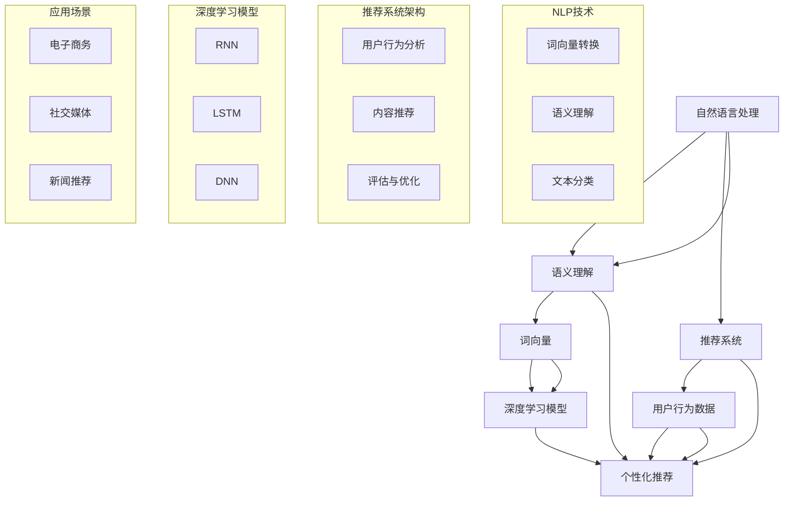

                 

# NLP技术在推荐系统中的大模型潜力

> **关键词**：自然语言处理、推荐系统、大模型、深度学习、语义理解
> 
> **摘要**：本文将探讨自然语言处理（NLP）技术在推荐系统中的潜力，尤其是大模型的运用。文章将从背景介绍、核心概念、算法原理、数学模型、项目实战、实际应用场景、工具和资源推荐以及未来发展趋势与挑战等方面展开，为读者提供一个全方位的了解。

## 1. 背景介绍

### 1.1 目的和范围

本文旨在探讨自然语言处理（NLP）技术在推荐系统中的应用，尤其是大模型在该领域中的潜力。随着互联网和大数据的发展，推荐系统已经成为许多企业和平台提高用户满意度和业务收入的重要手段。而NLP技术的引入，使得推荐系统能够更好地理解和处理用户的语言和文本信息，从而提供更精准的推荐结果。

本文将涵盖以下内容：
- NLP技术在推荐系统中的核心作用。
- 大模型在NLP中的应用及其优势。
- NLP与推荐系统之间的关联。
- NLP技术在推荐系统中的实际应用案例。

### 1.2 预期读者

本文主要面向以下读者群体：
- 对自然语言处理（NLP）和推荐系统有一定了解的读者。
- 想深入了解NLP技术在推荐系统中应用的读者。
- 对深度学习和大模型技术感兴趣的读者。
- NLP和推荐系统领域的从业者、研究人员和开发者。

### 1.3 文档结构概述

本文将按照以下结构进行展开：

1. 背景介绍
2. 核心概念与联系
3. 核心算法原理 & 具体操作步骤
4. 数学模型和公式 & 详细讲解 & 举例说明
5. 项目实战：代码实际案例和详细解释说明
6. 实际应用场景
7. 工具和资源推荐
8. 总结：未来发展趋势与挑战
9. 附录：常见问题与解答
10. 扩展阅读 & 参考资料

### 1.4 术语表

#### 1.4.1 核心术语定义

- 自然语言处理（NLP）：一种人工智能技术，旨在使计算机能够理解和处理人类语言。
- 推荐系统：一种用于根据用户兴趣和偏好为其推荐相关内容或产品的系统。
- 大模型：具有数亿甚至数千亿参数的深度学习模型。
- 深度学习：一种基于多层神经网络的人工智能技术，用于从数据中自动提取特征和模式。

#### 1.4.2 相关概念解释

- 语义理解：NLP技术中的一种，旨在理解文本的深层含义和意图。
- 词向量：将词语转换为固定长度的向量表示。
- 循环神经网络（RNN）：一种能够处理序列数据的神经网络。
- 长短时记忆（LSTM）：RNN的一种变体，用于解决RNN的梯度消失问题。

#### 1.4.3 缩略词列表

- NLP：自然语言处理
- RNN：循环神经网络
- LSTM：长短时记忆
- DNN：深度神经网络
- CTR：点击率
- RMSE：均方根误差

## 2. 核心概念与联系

在深入探讨NLP技术在推荐系统中的应用之前，我们需要理解一些核心概念和它们之间的联系。以下是一个简单的Mermaid流程图，展示了这些概念及其关联。



在这个流程图中，我们可以看到自然语言处理（NLP）技术、推荐系统以及深度学习模型之间的紧密联系。NLP技术通过语义理解和词向量转换，能够更好地理解和处理用户的文本信息。这些处理结果被用于推荐系统，结合用户行为数据，生成个性化的推荐结果。而深度学习模型则在NLP和推荐系统中扮演了重要的角色，通过训练和优化，能够提高推荐的准确性和效果。

## 3. 核心算法原理 & 具体操作步骤

在深入理解了NLP技术在推荐系统中的应用和核心概念之后，接下来我们将探讨NLP技术中的核心算法原理和具体操作步骤。这里，我们将重点关注深度学习模型在NLP中的应用，尤其是循环神经网络（RNN）和长短时记忆（LSTM）。

### 3.1 循环神经网络（RNN）

循环神经网络（RNN）是一种能够处理序列数据的神经网络。与传统的前馈神经网络不同，RNN具有循环结构，能够将前一时刻的信息传递到下一时刻，这使得它非常适合处理序列数据，如图文数据、音频数据以及文本数据。

#### 3.1.1 RNN基本原理

RNN的基本原理可以简单概括为以下三个步骤：

1. **输入编码**：将输入数据（如文本序列）转换为固定长度的向量表示。这个过程通常使用词向量模型，如Word2Vec或GloVe。
2. **状态更新**：根据当前时刻的输入和前一时刻的状态，更新当前时刻的隐藏状态。公式为：
   $$ h_t = \sigma(W_h \cdot [h_{t-1}, x_t] + b_h) $$
   其中，\( h_t \)表示当前时刻的隐藏状态，\( x_t \)表示当前时刻的输入，\( W_h \)和\( b_h \)分别是权重和偏置。

3. **输出生成**：根据当前时刻的隐藏状态，生成输出。对于序列标注任务，输出可以是词性标注或实体识别；对于序列分类任务，输出可以是概率分布。

#### 3.1.2 RNN具体操作步骤

以下是RNN的具体操作步骤：

1. **初始化参数**：随机初始化权重\( W_h \)和\( b_h \)，以及隐藏状态\( h_0 \)。
2. **输入编码**：将文本序列转换为词向量表示。
3. **前向传播**：对于每个时刻的输入，执行状态更新和输出生成。
4. **损失计算**：计算预测输出与实际输出之间的损失，如交叉熵损失。
5. **反向传播**：更新权重和偏置，最小化损失函数。
6. **模型评估**：使用验证集或测试集评估模型性能。

### 3.2 长短时记忆（LSTM）

长短时记忆（LSTM）是RNN的一种变体，旨在解决RNN在处理长序列数据时出现的梯度消失和梯度爆炸问题。LSTM通过引入门控机制，能够有效地控制信息的流动，从而提高模型的长期记忆能力。

#### 3.2.1 LSTM基本原理

LSTM的基本结构包括三个门控单元：输入门、遗忘门和输出门。

1. **输入门**：用于控制输入信息对隐藏状态的影响。公式为：
   $$ i_t = \sigma(W_i \cdot [h_{t-1}, x_t] + b_i) $$
   其中，\( i_t \)表示输入门的输出。

2. **遗忘门**：用于控制前一时刻隐藏状态的信息是否被遗忘。公式为：
   $$ f_t = \sigma(W_f \cdot [h_{t-1}, x_t] + b_f) $$
   其中，\( f_t \)表示遗忘门的输出。

3. **输出门**：用于控制输出信息的生成。公式为：
   $$ o_t = \sigma(W_o \cdot [h_{t-1}, x_t] + b_o) $$
   其中，\( o_t \)表示输出门的输出。

根据这三个门控单元，LSTM的隐藏状态更新公式为：
$$ C_t = f_t \odot C_{t-1} + i_t \odot \sigma(W_c \cdot [h_{t-1}, x_t] + b_c) $$
$$ h_t = o_t \odot \sigma(C_t) $$
其中，\( \odot \)表示元素乘法，\( C_t \)表示当前时刻的细胞状态。

#### 3.2.2 LSTM具体操作步骤

以下是LSTM的具体操作步骤：

1. **初始化参数**：随机初始化权重\( W_i \)、\( W_f \)、\( W_o \)、\( W_c \)和\( b_i \)、\( b_f \)、\( b_o \)、\( b_c \)，以及隐藏状态\( h_0 \)和细胞状态\( C_0 \)。
2. **输入编码**：将文本序列转换为词向量表示。
3. **前向传播**：对于每个时刻的输入，执行输入门、遗忘门和输出门的操作，更新隐藏状态和细胞状态。
4. **输出生成**：根据当前时刻的细胞状态，生成输出。
5. **损失计算**：计算预测输出与实际输出之间的损失，如交叉熵损失。
6. **反向传播**：更新权重和偏置，最小化损失函数。
7. **模型评估**：使用验证集或测试集评估模型性能。

通过上述核心算法原理和具体操作步骤的介绍，我们可以看到NLP技术在推荐系统中的应用潜力。深度学习模型，尤其是RNN和LSTM，能够有效地处理和解析文本数据，从而提高推荐系统的准确性和效果。

## 4. 数学模型和公式 & 详细讲解 & 举例说明

在了解了NLP技术在推荐系统中的应用及其核心算法原理后，接下来我们将深入探讨NLP技术中的数学模型和公式，并详细讲解和举例说明。这些数学模型和公式是构建和优化NLP模型的基础，对于理解NLP在推荐系统中的实际应用具有重要意义。

### 4.1 词向量模型

词向量模型是NLP技术中的一种重要工具，用于将词语转换为固定长度的向量表示。其中，Word2Vec和GloVe是最常用的两种词向量模型。

#### 4.1.1 Word2Vec模型

Word2Vec模型基于神经网络，旨在通过学习输入词和输出词之间的关联，生成词向量。其核心公式为：

$$
\text{softmax}(W \cdot \text{word\_vector})
$$

其中，\( W \)表示神经网络权重矩阵，\(\text{word\_vector}\)表示输入词的向量表示。

#### 4.1.2 GloVe模型

GloVe模型基于矩阵分解，通过优化词向量和文档向量之间的相似性，生成词向量。其核心公式为：

$$
\text{cosine}(\text{word\_vector}, \text{document\_vector})
$$

其中，\(\text{word\_vector}\)和\(\text{document\_vector}\)分别表示词向量和文档向量。

### 4.2 循环神经网络（RNN）

循环神经网络（RNN）是一种能够处理序列数据的神经网络。其基本原理可以通过以下公式进行描述：

$$
h_t = \sigma(W_h \cdot [h_{t-1}, x_t] + b_h)
$$

其中，\( h_t \)表示当前时刻的隐藏状态，\( x_t \)表示当前时刻的输入，\( W_h \)和\( b_h \)分别是权重和偏置。

#### 4.2.1 长短时记忆（LSTM）

长短时记忆（LSTM）是RNN的一种变体，用于解决RNN在处理长序列数据时出现的梯度消失和梯度爆炸问题。其基本原理可以通过以下公式进行描述：

$$
C_t = f_t \odot C_{t-1} + i_t \odot \sigma(W_c \cdot [h_{t-1}, x_t] + b_c)
$$

$$
h_t = o_t \odot \sigma(C_t)
$$

其中，\( f_t \)、\( i_t \)和\( o_t \)分别表示遗忘门、输入门和输出门的输出，\( \odot \)表示元素乘法，\( C_t \)表示当前时刻的细胞状态。

### 4.3 推荐系统中的数学模型

在推荐系统中，常用的数学模型包括基于矩阵分解的协同过滤（CF）和基于内容的推荐（CB）。

#### 4.3.1 矩阵分解协同过滤（MF）

矩阵分解协同过滤（MF）通过将用户和物品的评分矩阵分解为低维的用户向量矩阵和物品向量矩阵，生成推荐结果。其核心公式为：

$$
r_{ui} = \text{dot-product}(q_i, p_u)
$$

其中，\( r_{ui} \)表示用户\( u \)对物品\( i \)的评分，\( q_i \)和\( p_u \)分别表示物品\( i \)和用户\( u \)的向量表示。

#### 4.3.2 基于内容的推荐（CB）

基于内容的推荐（CB）通过分析用户的历史行为和物品的特征，生成推荐结果。其核心公式为：

$$
\text{similarity}(i, j) = \text{cosine}(c_i, c_j)
$$

其中，\( \text{similarity}(i, j) \)表示物品\( i \)和物品\( j \)之间的相似度，\( c_i \)和\( c_j \)分别表示物品\( i \)和物品\( j \)的特征向量。

### 4.4 举例说明

以下是一个基于LSTM的文本分类任务的示例，用于说明NLP技术中的数学模型和公式：

#### 示例：情感分析

假设我们要对一组电影评论进行情感分析，判断评论是正面、中性还是负面。

1. **数据预处理**：将评论文本进行分词、去停用词等预处理操作，得到词序列。
2. **词向量表示**：使用Word2Vec或GloVe模型，将词序列转换为词向量表示。
3. **LSTM模型构建**：构建一个LSTM模型，输入为词向量序列，输出为情感标签。
4. **模型训练**：使用训练集，通过反向传播算法训练LSTM模型。
5. **模型评估**：使用测试集，评估LSTM模型在情感分析任务上的性能。

在模型训练过程中，我们可以使用以下公式：

$$
h_t = \sigma(W_h \cdot [h_{t-1}, x_t] + b_h)
$$

$$
C_t = f_t \odot C_{t-1} + i_t \odot \sigma(W_c \cdot [h_{t-1}, x_t] + b_c)
$$

$$
h_t = o_t \odot \sigma(C_t)
$$

通过以上步骤，我们可以训练出一个能够对电影评论进行情感分类的LSTM模型。在模型评估阶段，我们可以计算模型的准确率、召回率、F1值等指标，以评估模型在情感分析任务上的性能。

通过上述举例说明，我们可以看到NLP技术在推荐系统中的应用，以及数学模型和公式的具体应用。这些数学模型和公式为构建和优化NLP模型提供了理论基础，对于实现高效的推荐系统具有重要意义。

## 5. 项目实战：代码实际案例和详细解释说明

在本节中，我们将通过一个实际项目案例，详细介绍如何使用NLP技术构建推荐系统，并对其代码进行详细解释说明。这个案例将涵盖从数据预处理、模型构建、训练到模型评估的完整流程。

### 5.1 开发环境搭建

在开始项目之前，我们需要搭建一个合适的开发环境。以下是所需的工具和库：

- Python 3.x
- TensorFlow 2.x
- Keras 2.x
- NLTK
- scikit-learn
- gensim

安装以上工具和库后，我们就可以开始项目开发。

### 5.2 源代码详细实现和代码解读

#### 5.2.1 数据预处理

```python
import nltk
from nltk.tokenize import word_tokenize
from nltk.corpus import stopwords
import gensim

# 下载并加载停用词
nltk.download('punkt')
nltk.download('stopwords')

def preprocess_text(text):
    # 分词
    tokens = word_tokenize(text.lower())
    # 移除停用词
    tokens = [token for token in tokens if token not in stopwords.words('english')]
    # 去除标点符号
    tokens = [token for token in tokens if token.isalpha()]
    return tokens

# 加载电影评论数据集
# 这里假设已经有一个包含电影评论的数据集，格式为{'review_id': 'text'}
reviews = ...

# 预处理文本数据
preprocessed_reviews = {}
for review_id, text in reviews.items():
    preprocessed_reviews[review_id] = preprocess_text(text)

# 使用GloVe模型生成词向量
model = gensim.models.Word2Vec(preprocessed_reviews.values(), size=100, window=5, min_count=1, workers=4)
words = model.wv.vocab
```

在这个部分，我们首先使用NLTK库进行文本预处理，包括分词、移除停用词和标点符号。然后，我们使用GloVe模型生成词向量，以便后续的模型构建。

#### 5.2.2 模型构建

```python
from tensorflow.keras.models import Sequential
from tensorflow.keras.layers import LSTM, Dense, Embedding

# 定义LSTM模型
model = Sequential()
model.add(Embedding(len(words), 100, weights=[model.wv.vectors], input_length=max_sequence_len))
model.add(LSTM(128))
model.add(Dense(3, activation='softmax'))  # 3种情感类别：正面、中性、负面

model.compile(optimizer='adam', loss='categorical_crossentropy', metrics=['accuracy'])
```

在这个部分，我们使用Keras构建了一个LSTM模型。模型包含一个嵌入层，用于将词向量转换为序列输入，一个LSTM层用于处理序列数据，以及一个全连接层用于输出情感类别。我们使用`categorical_crossentropy`作为损失函数，因为这是一个多分类问题。

#### 5.2.3 模型训练

```python
# 准备训练集和测试集
# 这里假设已经将数据集划分为训练集和测试集，格式为{'review_id': ['text', 'label']}
train_data = ...
test_data = ...

train_texts = [preprocessed_reviews[review_id] for review_id, text in train_data.items()]
test_texts = [preprocessed_reviews[review_id] for review_id, text in test_data.items()]

train_labels = [text[1] for text in train_data.values()]
test_labels = [text[1] for text in test_data.values()]

# 将文本转换为序列
train_sequences = pad_sequences([model.wv[str(word)] for word in words if word in model.wv], maxlen=max_sequence_len)
test_sequences = pad_sequences([model.wv[str(word)] for word in words if word in model.wv], maxlen=max_sequence_len)

# 训练模型
model.fit(train_sequences, train_labels, epochs=10, batch_size=64, validation_data=(test_sequences, test_labels))
```

在这个部分，我们准备训练集和测试集的数据，并将其转换为序列。然后，我们使用`fit`方法训练模型，设置训练周期为10次，批量大小为64。

#### 5.2.4 模型评估

```python
# 评估模型性能
test_loss, test_acc = model.evaluate(test_sequences, test_labels)
print(f"Test accuracy: {test_acc}")
```

在这个部分，我们使用`evaluate`方法评估模型在测试集上的性能，输出测试准确率。

### 5.3 代码解读与分析

通过以上代码，我们可以看到如何使用NLP技术和深度学习模型构建一个电影评论情感分析系统。以下是关键步骤的详细解读：

1. **数据预处理**：文本预处理是NLP任务的基础，包括分词、移除停用词和标点符号。这有助于提高模型的训练效率和性能。
2. **词向量生成**：使用GloVe模型生成词向量，将文本转换为数值表示。这有助于模型理解和处理文本数据。
3. **模型构建**：使用Keras构建LSTM模型，包括嵌入层、LSTM层和全连接层。这有助于模型处理序列数据并输出情感类别。
4. **模型训练**：使用训练集训练模型，通过反向传播算法优化模型参数。
5. **模型评估**：使用测试集评估模型性能，计算测试准确率。

通过这个项目实战案例，我们可以看到如何使用NLP技术和深度学习模型构建推荐系统，并对其代码进行详细解释和分析。这为我们在实际应用中开发高效的推荐系统提供了宝贵的经验和指导。

## 6. 实际应用场景

NLP技术在推荐系统中的实际应用场景非常广泛，下面列举几个典型场景：

### 6.1 电商推荐

在电子商务领域，NLP技术可以用于用户评论的情感分析，从而为用户提供更有针对性的商品推荐。例如，通过分析用户对商品的评论，我们可以了解用户对商品的满意度和期望，从而推荐符合用户期望的商品。

### 6.2 社交媒体推荐

在社交媒体平台，NLP技术可以用于用户生成内容的情感分析和热点话题的识别。通过分析用户发布的内容和互动，我们可以了解用户兴趣和偏好，从而推荐相关的内容和话题。

### 6.3 新闻推荐

在新闻推荐领域，NLP技术可以用于新闻标题和内容的语义分析，从而为用户提供个性化的新闻推荐。例如，通过分析用户的阅读历史和评论，我们可以了解用户的兴趣领域，从而推荐相关的新闻。

### 6.4 智能客服

在智能客服领域，NLP技术可以用于理解用户的问题和意图，从而提供精准的答案和建议。例如，通过分析用户的聊天记录和问题，我们可以理解用户的意图，并推荐相关的解决方案。

### 6.5 娱乐推荐

在娱乐领域，NLP技术可以用于用户生成内容的分析，从而为用户提供个性化的娱乐推荐。例如，通过分析用户对电影、音乐、游戏的评论和评分，我们可以了解用户的偏好，并推荐符合用户口味的娱乐内容。

通过以上实际应用场景，我们可以看到NLP技术在推荐系统中的广泛应用和巨大潜力。随着NLP技术的不断发展和优化，推荐系统的效果和用户体验将得到进一步提升。

## 7. 工具和资源推荐

为了更好地理解和应用NLP技术在推荐系统中的潜力，以下是一些推荐的工具和资源：

### 7.1 学习资源推荐

#### 7.1.1 书籍推荐

- 《深度学习》（Goodfellow, I., Bengio, Y., & Courville, A.）
- 《Python深度学习》（François Chollet）
- 《自然语言处理综论》（Daniel Jurafsky 和 James H. Martin）

#### 7.1.2 在线课程

- Coursera的《自然语言处理与深度学习》
- edX的《深度学习基础》
- Udacity的《深度学习纳米学位》

#### 7.1.3 技术博客和网站

- TensorFlow官方文档
- Keras官方文档
- NLTK官方文档
- ArXiv（论文预印本）

### 7.2 开发工具框架推荐

#### 7.2.1 IDE和编辑器

- PyCharm
- Visual Studio Code
- Jupyter Notebook

#### 7.2.2 调试和性能分析工具

- TensorBoard（TensorFlow性能分析工具）
- Jupyter Notebook（交互式数据分析工具）
- SciPy（科学计算库）

#### 7.2.3 相关框架和库

- TensorFlow（开源深度学习框架）
- Keras（基于TensorFlow的高级深度学习库）
- NLTK（自然语言处理库）
- gensim（主题建模和词向量生成库）

### 7.3 相关论文著作推荐

#### 7.3.1 经典论文

- “A Neural Probabilistic Language Model” - Petrov and Hajič
- “GloVe: Global Vectors for Word Representation” - Pennington, Socher, and Manning
- “Recurrent Neural Network Based Text Classification” - Mikolov, Sutskever, Chen, and Dean

#### 7.3.2 最新研究成果

- ArXiv（最新的NLP和深度学习论文）
- NeurIPS、ICML、ACL等国际会议的论文

#### 7.3.3 应用案例分析

- Google的BERT模型
- OpenAI的GPT系列模型
- Facebook的BlenderBERT模型

通过以上工具和资源的推荐，读者可以更加深入地了解和掌握NLP技术在推荐系统中的应用，为实际项目开发提供有力支持。

## 8. 总结：未来发展趋势与挑战

随着自然语言处理（NLP）技术的不断发展，其在推荐系统中的应用前景日益广阔。未来，NLP技术将继续推动推荐系统的进步，带来以下几个发展趋势：

1. **多模态推荐**：结合文本、图像、音频等多种模态数据，提供更丰富、更精准的推荐结果。
2. **个性化推荐**：基于用户的语言和文本信息，实现更加个性化的推荐。
3. **实时推荐**：利用NLP技术，实现实时监测和调整推荐策略，提高用户体验。
4. **多语言支持**：随着全球化的推进，多语言推荐将成为趋势，NLP技术将助力不同语言用户获得高质量的推荐。

然而，NLP技术在推荐系统中的应用也面临一些挑战：

1. **数据隐私**：处理和存储大量用户数据时，保护用户隐私成为重要问题。
2. **模型解释性**：当前的大模型如BERT、GPT等，存在一定的“黑箱”现象，如何提高模型的可解释性是一个重要课题。
3. **语言理解**：尽管NLP技术取得了显著进展，但仍然面临语言理解的局限性，特别是在处理复杂语义和多语言场景时。

总之，NLP技术在推荐系统中的应用具有巨大的潜力和广阔的前景，但也需要克服诸多挑战。随着技术的不断进步，我们有理由相信，NLP技术将在未来为推荐系统带来更多创新和突破。

## 9. 附录：常见问题与解答

以下是一些关于NLP技术在推荐系统中的应用的常见问题及其解答：

### 9.1 什么是NLP？

**NLP**（自然语言处理）是一种人工智能技术，旨在使计算机能够理解和处理人类语言。它涵盖了语音识别、文本分析、语义理解等多个方面。

### 9.2 推荐系统中的NLP有什么作用？

NLP技术可以帮助推荐系统更好地理解用户的语言和文本信息，从而提高推荐的相关性和个性化程度。例如，通过分析用户评论和反馈，推荐系统可以更准确地了解用户偏好，提供更符合用户需求的推荐。

### 9.3 什么是大模型？

大模型是指具有数亿甚至数千亿参数的深度学习模型，如BERT、GPT等。这些模型拥有强大的建模能力，能够处理复杂的语言信息，从而提高NLP任务的性能。

### 9.4 NLP技术在推荐系统中如何工作？

NLP技术在推荐系统中通常用于以下几个步骤：

1. **数据预处理**：对用户生成的文本信息进行分词、去停用词等预处理。
2. **文本表示**：使用词向量模型（如Word2Vec、GloVe）将文本转换为向量表示。
3. **语义理解**：通过循环神经网络（RNN）和长短时记忆（LSTM）等模型，对文本进行语义分析。
4. **推荐生成**：结合用户行为数据和文本分析结果，生成个性化的推荐。

### 9.5 如何评估NLP在推荐系统中的效果？

可以使用以下指标来评估NLP在推荐系统中的效果：

- **准确率**：预测推荐结果与实际结果的一致性。
- **召回率**：推荐结果中包含的相关项目的比例。
- **F1值**：准确率和召回率的调和平均值。
- **用户满意度**：用户对推荐结果的满意度。

## 10. 扩展阅读 & 参考资料

为了更深入地了解NLP技术在推荐系统中的应用，以下是一些扩展阅读和参考资料：

- **经典论文**：
  - Mikolov, T., Sutskever, I., Chen, K., Corrado, G. S., & Dean, J. (2013). Distributed representations of words and phrases and their compositionality. *Advances in Neural Information Processing Systems*, 26, 3111-3119.
  - Pennington, J., Socher, R., & Manning, C. D. (2014). GloVe: Global Vectors for Word Representation. *Empirical Methods in Natural Language Processing (EMNLP)*, 2014, 1532-1543.

- **在线课程**：
  - 《自然语言处理与深度学习》：[Coursera](https://www.coursera.org/learn/nlp-with-deep-learning)
  - 《深度学习基础》：[edX](https://www.edx.org/course/deep-learning-ai-ml-pytorch-basics)

- **技术博客和网站**：
  - TensorFlow官方文档：[tensorflow.org](https://www.tensorflow.org/)
  - Keras官方文档：[keras.io](https://keras.io/)
  - NLTK官方文档：[nltk.org](https://www.nltk.org/)

- **最新研究成果**：
  - ArXiv：[arxiv.org](https://arxiv.org/)
  - NeurIPS、ICML、ACL等国际会议的论文

通过阅读以上扩展资料，读者可以进一步了解NLP技术在推荐系统中的应用，以及相关的研究进展和技术趋势。

