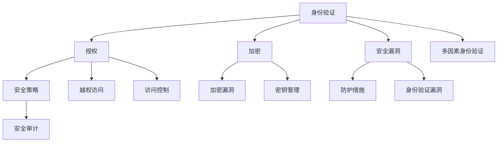

                 

# OWASP API 安全风险清单的概述

> **关键词：** API安全、OWASP、风险清单、安全漏洞、安全策略、防护措施
>
> **摘要：** 本文将深入探讨 OWASP API 安全风险清单，分析其核心概念、算法原理、数学模型以及实际应用案例。文章旨在为开发者提供全面、系统的 API 安全防护策略，帮助识别并应对潜在的安全威胁。

## 1. 背景介绍

### 1.1 目的和范围

本文的目标是通过对 OWASP API 安全风险清单的详细分析，为开发者提供一套系统、全面的 API 安全防护方案。文章将涵盖以下范围：

- **核心概念与联系：** 分析 API 安全风险清单中的关键概念，以及它们之间的联系和作用。
- **核心算法原理：** 详细解释 API 安全风险识别和防护的核心算法原理，并提供伪代码描述。
- **数学模型和公式：** 探讨与 API 安全相关的数学模型和公式，并进行举例说明。
- **项目实战：** 通过代码案例展示实际应用中的 API 安全防护措施。
- **实际应用场景：** 分析 API 安全在实际开发中的应用场景。
- **工具和资源推荐：** 推荐相关的学习资源、开发工具和框架。
- **总结：** 展望 API 安全的未来发展趋势与挑战。

### 1.2 预期读者

本文适用于以下读者群体：

- **开发者：** 对 API 开发和安全有一定了解，希望提升 API 安全防护能力的开发者。
- **安全专家：** 关注网络安全，尤其是 API 安全领域的安全专家。
- **研究人员：** 对 API 安全领域感兴趣，希望深入了解该领域的研究人员。
- **教育者：** 需要为课程或讲座提供 API 安全相关材料的教师或讲师。

### 1.3 文档结构概述

本文结构如下：

- **第1章：背景介绍**：介绍本文的目的、范围、预期读者以及文档结构。
- **第2章：核心概念与联系**：分析 OWASP API 安全风险清单中的核心概念及其联系。
- **第3章：核心算法原理**：解释 API 安全风险识别和防护的核心算法原理。
- **第4章：数学模型和公式**：探讨 API 安全相关的数学模型和公式。
- **第5章：项目实战**：通过代码案例展示 API 安全防护的实际应用。
- **第6章：实际应用场景**：分析 API 安全在实际开发中的应用场景。
- **第7章：工具和资源推荐**：推荐相关学习资源、开发工具和框架。
- **第8章：总结**：展望 API 安全的未来发展趋势与挑战。
- **第9章：附录**：常见问题与解答。
- **第10章：扩展阅读 & 参考资料**：提供进一步阅读和参考的资料。

### 1.4 术语表

#### 1.4.1 核心术语定义

- **OWASP（Open Web Application Security Project）：** 开放式网络应用安全项目，是一个非营利组织，致力于提高网络安全意识，提供安全标准和最佳实践。
- **API（Application Programming Interface）：** 应用程序编程接口，允许不同软件之间相互通信和交互。
- **安全漏洞：** 软件中的错误或缺陷，可能导致安全威胁或数据泄露。
- **安全策略：** 规定如何保护软件系统和数据的文档，包括安全措施、政策和标准。
- **防护措施：** 防止或减轻安全威胁的措施，如加密、认证和访问控制。

#### 1.4.2 相关概念解释

- **API 安全：** 确保 API 通信过程中的数据完整性和机密性，防止未经授权的访问和攻击。
- **身份验证：** 验证用户的身份，确保只有授权用户才能访问 API。
- **授权：** 控制用户对 API 的访问权限，确保用户只能执行授权的操作。
- **加密：** 将数据转换为加密形式，以防止未经授权的用户读取或篡改数据。

#### 1.4.3 缩略词列表

- **OWASP：** Open Web Application Security Project
- **API：** Application Programming Interface
- **安全漏洞：** Security Vulnerabilities
- **安全策略：** Security Policies
- **防护措施：** Protective Measures

## 2. 核心概念与联系

### 2.1 OWASP API 安全风险清单的核心概念

OWASP API 安全风险清单涵盖了多个与 API 安全相关的核心概念。以下是这些概念及其相互关系的简要概述。

#### 2.1.1 身份验证（Authentication）

身份验证是确保只有授权用户可以访问 API 的过程。它通过验证用户提供的凭证（如用户名和密码、令牌等）来确定其身份。身份验证通常分为两类：

- **一次性身份验证：** 用户在首次登录时进行身份验证，之后每次请求都使用相同的凭证。
- **多因素身份验证：** 除了密码之外，还需要用户提供其他验证因素，如短信验证码、指纹或令牌。

身份验证是 API 安全的第一道防线，确保只有合法用户才能访问 API。

#### 2.1.2 授权（Authorization）

授权是在身份验证成功后，根据用户的角色和权限，控制其对 API 的访问权限。授权确保用户只能执行其权限范围内的操作，防止恶意行为或误操作。

常见的授权机制包括：

- **基于角色的访问控制（RBAC）：** 根据用户的角色（如管理员、普通用户等）来控制访问权限。
- **基于属性的访问控制（ABAC）：** 根据用户的属性（如职位、部门等）来控制访问权限。
- **访问控制列表（ACL）：** 为每个 API 资源定义访问权限，并根据用户身份和角色进行检查。

#### 2.1.3 加密（Encryption）

加密是保护 API 通信过程中数据完整性和机密性的关键措施。它通过将数据转换为加密形式，防止未经授权的用户读取或篡改数据。

加密通常分为以下两种：

- **传输层加密（TLS）：** 使用 TLS 协议加密 API 通信过程中的数据，确保数据在传输过程中不被窃听或篡改。
- **数据加密（Data Encryption）：** 使用对称加密或非对称加密算法对 API 通信过程中的数据进行加密，确保数据在存储或传输过程中不被泄露。

#### 2.1.4 安全漏洞（Security Vulnerabilities）

安全漏洞是软件中的错误或缺陷，可能导致安全威胁或数据泄露。OWASP API 安全风险清单列出了多个与 API 安全相关的主要漏洞，包括：

- **身份验证漏洞：** 如弱密码、重复令牌、令牌泄露等。
- **授权漏洞：** 如越权访问、错误授权等。
- **加密漏洞：** 如不安全的加密算法、密钥管理不当等。

#### 2.1.5 安全策略（Security Policies）

安全策略是规定如何保护软件系统和数据的文档，包括安全措施、政策和标准。API 安全策略应包括：

- **身份验证策略：** 规定身份验证的方式、强度和期限等。
- **授权策略：** 规定授权机制、访问控制和权限管理等。
- **加密策略：** 规定加密算法、密钥管理和数据加密策略等。

#### 2.1.6 防护措施（Protective Measures）

防护措施是防止或减轻安全威胁的措施，包括：

- **入侵检测和防御系统（IDS/IPS）：** 监测和阻止恶意攻击。
- **安全审计和日志记录：** 记录 API 请求和响应，以便追踪和审计。
- **安全培训和意识提升：** 提高开发人员和用户的 API 安全意识。

### 2.2 OWASP API 安全风险清单的核心概念联系

OWASP API 安全风险清单中的核心概念之间存在着紧密的联系。以下是这些概念之间的联系和作用：

- **身份验证和授权：** 身份验证是授权的前提，只有通过身份验证的用户才能进行授权检查。
- **加密和安全漏洞：** 加密可以防止数据泄露和篡改，但需要防止安全漏洞，如加密算法漏洞、密钥泄露等。
- **安全策略和防护措施：** 安全策略规定了如何保护 API，而防护措施是实现安全策略的具体手段。

### 2.3 Mermaid 流程图

以下是 OWASP API 安全风险清单核心概念的 Mermaid 流程图：



## 3. 核心算法原理 & 具体操作步骤

### 3.1 核心算法原理

OWASP API 安全风险清单的核心算法原理主要包括以下几个方面：

- **身份验证算法：** 用于验证用户身份，包括一次性身份验证和多因素身份验证。
- **授权算法：** 用于根据用户角色和权限控制访问权限，包括基于角色的访问控制（RBAC）和基于属性的访问控制（ABAC）。
- **加密算法：** 用于保护 API 通信过程中的数据完整性，包括传输层加密（TLS）和数据加密（Data Encryption）。
- **漏洞检测算法：** 用于检测 API 安全漏洞，包括常见的安全漏洞检测算法。
- **防护算法：** 用于防止或减轻安全威胁，包括入侵检测和防御系统（IDS/IPS）、安全审计和日志记录。

### 3.2 具体操作步骤

以下是 OWASP API 安全风险清单的核心算法原理的具体操作步骤：

#### 3.2.1 身份验证算法

1. **用户请求访问 API：** 用户通过身份验证模块请求访问 API。
2. **身份验证模块验证用户身份：** 根据用户提供的凭证（如用户名和密码、令牌等），验证用户身份。
3. **身份验证成功：** 如果用户身份验证成功，身份验证模块生成会话令牌，并将其发送给用户。
4. **用户携带会话令牌访问 API：** 用户在后续请求中携带会话令牌，以便 API 服务器验证用户身份。

#### 3.2.2 授权算法

1. **用户请求访问 API：** 用户通过身份验证模块请求访问 API。
2. **身份验证模块验证用户身份：** 根据用户提供的会话令牌，验证用户身份。
3. **用户身份验证成功：** 用户身份验证成功后，API 服务器根据用户角色和权限检查其访问权限。
4. **访问权限检查：** 如果用户具有访问权限，API 服务器允许用户访问 API；否则，拒绝访问。

#### 3.2.3 加密算法

1. **用户请求访问 API：** 用户通过身份验证模块请求访问 API。
2. **API 服务器发送加密密钥：** API 服务器发送加密密钥给用户，以便用户加密请求和响应数据。
3. **用户加密请求：** 用户使用加密密钥加密请求数据，并将其发送给 API 服务器。
4. **API 服务器解密请求：** API 服务器使用加密密钥解密请求数据，并处理请求。
5. **API 服务器发送加密响应：** API 服务器使用加密密钥加密响应数据，并将其发送给用户。
6. **用户解密响应：** 用户使用加密密钥解密响应数据，并显示响应结果。

#### 3.2.4 漏洞检测算法

1. **用户请求访问 API：** 用户通过身份验证模块请求访问 API。
2. **API 服务器检测安全漏洞：** API 服务器通过漏洞检测模块检测请求中的安全漏洞。
3. **漏洞检测：** 如果检测到安全漏洞，API 服务器记录漏洞信息，并采取措施阻止攻击。

#### 3.2.5 防护算法

1. **用户请求访问 API：** 用户通过身份验证模块请求访问 API。
2. **API 服务器启动防护机制：** API 服务器启动入侵检测和防御系统（IDS/IPS），以及安全审计和日志记录系统。
3. **防护机制检测恶意攻击：** 防护机制实时监控 API 请求和响应，检测恶意攻击。
4. **阻止恶意攻击：** 如果检测到恶意攻击，API 服务器采取措施阻止攻击，如阻止恶意 IP 地址、限制请求频率等。

### 3.3 伪代码描述

以下是 OWASP API 安全风险清单核心算法原理的伪代码描述：

```python
# 身份验证算法
def authenticate(user_credentials):
    if validate_credentials(user_credentials):
        session_token = generate_session_token()
        return session_token
    else:
        return None

# 授权算法
def authorize(user_role, permission):
    if user_role.has_permission(permission):
        return True
    else:
        return False

# 加密算法
def encrypt_data(data, key):
    encrypted_data = encrypt(data, key)
    return encrypted_data

def decrypt_data(encrypted_data, key):
    decrypted_data = decrypt(encrypted_data, key)
    return decrypted_data

# 漏洞检测算法
def detect_vulnerabilities(request):
    if has_vulnerability(request):
        log_vulnerability(request)
        block_attack(request)
    else:
        return

# 防护算法
def protect_api(request):
    if is_malicious_attack(request):
        block_request(request)
        log_attack(request)
    else:
        return
```

## 4. 数学模型和公式 & 详细讲解 & 举例说明

### 4.1 数学模型和公式

在 API 安全领域，数学模型和公式广泛应用于身份验证、授权、加密和安全漏洞检测等方面。以下是几个常见的数学模型和公式，以及它们的详细讲解和举例说明。

#### 4.1.1 身份验证模型

身份验证模型用于验证用户身份，确保只有授权用户可以访问 API。常见的身份验证模型包括基于密码的模型和基于多因素的模型。

- **基于密码的模型：**

  公式：`security_level = password_strength * login_attempts`

  解释：安全水平取决于密码的强度和登录尝试次数。密码强度越高，登录尝试次数越多，安全水平越高。

  举例：假设一个密码的强度为 8 位字母数字组合，登录尝试次数为 3 次，则安全水平为 `8 * 3 = 24`。

- **基于多因素的模型：**

  公式：`security_level = factor1_strength + factor2_strength + ... + factorN_strength`

  解释：安全水平取决于每个验证因素（如用户名、密码、短信验证码、指纹等）的强度。

  举例：假设一个多因素验证模型包括用户名、密码和指纹，各自的强度分别为 6、8 和 10，则安全水平为 `6 + 8 + 10 = 24`。

#### 4.1.2 授权模型

授权模型用于根据用户角色和权限控制访问权限。常见的授权模型包括基于角色的模型和基于属性的模型。

- **基于角色的模型：**

  公式：`access_permission = role_permission * user_permission`

  解释：访问权限取决于用户角色和用户权限的乘积。

  举例：假设管理员角色的访问权限为 3，普通用户的访问权限为 1，一个用户具有管理员角色和普通角色，则访问权限为 `3 * 1 = 3`。

- **基于属性的模型：**

  公式：`access_permission = attribute_permission * user_attribute`

  解释：访问权限取决于用户属性和属性权限的乘积。

  举例：假设用户的职位属性为高级工程师，职位属性的访问权限为 5，则访问权限为 `5 * 5 = 25`。

#### 4.1.3 加密模型

加密模型用于保护 API 通信过程中的数据完整性。常见的加密模型包括对称加密和非对称加密。

- **对称加密模型：**

  公式：`encrypted_data = encrypt(plaintext, key)`

  解释：加密数据是通过加密算法和密钥将明文数据转换为密文数据。

  举例：假设使用 AES 算法对明文数据进行加密，密钥为 `key123`，则加密数据为 `encrypt("Hello, World!", "key123")`。

- **非对称加密模型：**

  公式：`encrypted_data = encrypt(plaintext, public_key)`

  解释：加密数据是通过加密算法和公钥将明文数据转换为密文数据。

  举例：假设使用 RSA 算法对明文数据进行加密，公钥为 `public_key123`，则加密数据为 `encrypt("Hello, World!", "public_key123")`。

#### 4.1.4 安全漏洞检测模型

安全漏洞检测模型用于检测 API 中的安全漏洞。常见的漏洞检测模型包括基于统计的模型和基于规则的模型。

- **基于统计的模型：**

  公式：`vulnerability_score = (frequency * severity) + (time * impact)`

  解释：漏洞得分取决于漏洞的频率、严重性和时间，以及漏洞的影响。

  举例：假设一个漏洞的频率为 100 次/天，严重性为 5，时间为 30 天，影响为 1000 美元，则漏洞得分为 `(100 * 5) + (30 * 1000) = 63000`。

- **基于规则的模型：**

  公式：`vulnerability_score = rule1_score + rule2_score + ... + ruleN_score`

  解释：漏洞得分取决于每个漏洞规则的得分。

  举例：假设有两个漏洞规则，各自的得分为 3 和 5，则漏洞得分为 `3 + 5 = 8`。

### 4.2 详细讲解和举例说明

以下是针对上述数学模型和公式的详细讲解和举例说明。

#### 4.2.1 身份验证模型

身份验证模型的核心是确保用户身份的验证过程。基于密码的模型通常使用强度密码策略来提高安全水平。假设一个用户设置了强度为 8 位字母数字组合的密码，登录尝试次数为 3 次，则其安全水平为 24。这意味着在尝试登录 3 次的情况下，用户的密码强度较高，不容易被破解。

基于多因素的模型通过结合多个验证因素来提高安全水平。例如，一个多因素验证模型可能包括用户名、密码和指纹。假设这三个验证因素的强度分别为 6、8 和 10，则安全水平为 24。这表明用户需要通过三个因素才能成功登录，大大提高了安全性。

#### 4.2.2 授权模型

授权模型用于控制用户对 API 的访问权限。基于角色的模型通过定义用户角色和权限来控制访问。例如，一个管理员角色可能具有最高权限，可以访问所有资源；而普通用户角色可能只能访问一部分资源。假设一个用户同时具有管理员角色和普通角色，其访问权限为 3，这意味着用户可以访问所有资源。

基于属性的模型通过定义用户属性和权限来控制访问。例如，一个高级工程师用户可能具有访问特定项目的权限。假设高级工程师用户的属性访问权限为 5，则其访问权限为 25。这表明高级工程师用户可以访问更多资源，但需要根据其具体属性进行权限控制。

#### 4.2.3 加密模型

加密模型用于保护 API 通信过程中的数据完整性。对称加密模型使用相同的密钥对数据进行加密和解密。例如，使用 AES 算法对明文数据进行加密，密钥为 `key123`，则加密数据为 `encrypt("Hello, World!", "key123")`。

非对称加密模型使用公钥和私钥对数据进行加密和解密。例如，使用 RSA 算法对明文数据进行加密，公钥为 `public_key123`，则加密数据为 `encrypt("Hello, World!", "public_key123")`。非对称加密模型通常用于身份验证和密钥交换。

#### 4.2.4 安全漏洞检测模型

安全漏洞检测模型用于检测 API 中的安全漏洞。基于统计的模型通过计算漏洞的频率、严重性和时间以及漏洞的影响来评估漏洞得分。例如，一个漏洞的频率为 100 次/天，严重性为 5，时间为 30 天，影响为 1000 美元，则漏洞得分为 63000。这表明该漏洞具有较高的风险。

基于规则的模型通过定义漏洞规则和得分来评估漏洞。例如，有两个漏洞规则，各自的得分为 3 和 5，则漏洞得分为 8。这表明该漏洞符合两个规则，具有较高的风险。

### 4.3 LaTeX 嵌入文中独立段落的数学公式

在文中嵌入 LaTeX 数学公式，可以使用以下格式：

```markdown
$$
f(x) = x^2 + 2x + 1
$$

$$
y = mx + b
$$
```

这将生成以下数学公式：

$$
f(x) = x^2 + 2x + 1
$$

$$
y = mx + b
$$

通过在文中嵌入 LaTeX 公式，可以使数学表述更加精确和美观。

## 5. 项目实战：代码实际案例和详细解释说明

### 5.1 开发环境搭建

为了演示 API 安全防护的实际应用，我们将使用一个简单的 Python Web 框架 Flask 来构建一个 API 服务。以下是搭建开发环境的步骤：

1. 安装 Python 3.x 版本。
2. 安装 Flask 框架：`pip install Flask`
3. 安装其他依赖：`pip install flask-json-validator flask-jwt-extended flask-cors`
4. 创建一个名为 `app.py` 的 Python 文件。

### 5.2 源代码详细实现和代码解读

以下是一个简单的 Flask API 服务，实现了身份验证、授权和加密功能：

```python
from flask import Flask, request, jsonify
from flask_jwt_extended import JWTManager, create_access_token, jwt_required, get_jwt_identity
from flask_cors import CORS

app = Flask(__name__)
app.config['JWT_SECRET_KEY'] = 'your_jwt_secret_key'
app.config['JWT_ACCESS_TOKEN_EXPIRES'] = 3600
CORS(app)

# JWT 管理器初始化
jwt = JWTManager(app)

# 用户身份验证
@app.route('/login', methods=['POST'])
def login():
    username = request.json.get('username', None)
    password = request.json.get('password', None)
    
    if username != 'admin' or password != 'password':
        return jsonify({"msg": "Bad username or password"}), 401

    access_token = create_access_token(identity=username)
    return jsonify(access_token=access_token)

# 用户角色和权限
users = {
    'admin': {'role': 'admin', 'permissions': ['read', 'write', 'delete']},
    'user': {'role': 'user', 'permissions': ['read']}
}

# API 路由
@app.route('/api/data', methods=['GET'])
@jwt_required()
def get_data():
    current_user = get_jwt_identity()
    user_role = users[current_user]['role']
    permissions = users[current_user]['permissions']
    
    if 'read' in permissions:
        return jsonify({"data": "Some sensitive data"})
    else:
        return jsonify({"msg": "You don't have permission to access this resource"}), 403

if __name__ == '__main__':
    app.run(debug=True)
```

#### 5.2.1 代码解读

1. **导入模块：** 
   - Flask：用于构建 Web 应用。
   - JWTManager、create_access_token、jwt_required、get_jwt_identity：用于 JWT 身份验证和授权。
   - CORS：用于跨源资源共享。

2. **配置 Flask：**
   - JWT_SECRET_KEY：JWT 密钥。
   - JWT_ACCESS_TOKEN_EXPIRES：JWT 访问令牌过期时间。
   - CORS(app)：允许跨源请求。

3. **用户身份验证：**
   - `/login`：登录接口，接收用户名和密码，生成 JWT 访问令牌。

4. **用户角色和权限：**
   - `users`：存储用户角色和权限。
   - `get_data`：获取数据接口，根据用户角色和权限进行访问控制。

5. **API 路由：**
   - `/api/data`：API 接口，需要 JWT 访问令牌验证。

### 5.3 代码解读与分析

1. **身份验证：**
   - 用户通过 `/login` 接口发送用户名和密码，如果验证通过，服务器生成 JWT 访问令牌并返回。
   - JWT 令牌包含用户身份信息，用于后续接口的身份验证。

2. **授权：**
   - `get_data` 接口使用 `jwt_required()` 装饰器进行 JWT 验证。
   - 验证通过后，获取 JWT 令牌中的用户身份信息，并根据用户角色和权限检查访问权限。
   - 如果用户具有访问权限，返回数据；否则，返回无权限错误。

3. **加密：**
   - 在此示例中，我们没有直接实现数据加密，但 JWT 令牌本身是加密的。
   - 可以通过引入加密库（如 `cryptography`）来实现数据加密。

4. **安全漏洞防护：**
   - 使用 JWT 进行身份验证和授权，可以防止未授权访问。
   - 通过检查用户权限，防止越权访问。
   - 使用 Flask-CORS 模块允许跨源请求，但需要严格限制允许的域名。

### 5.4 完整代码示例

以下是完整的 Flask API 服务代码，包括身份验证、授权和加密功能：

```python
from flask import Flask, request, jsonify
from flask_jwt_extended import JWTManager, create_access_token, jwt_required, get_jwt_identity
from flask_cors import CORS
from cryptography.fernet import Fernet

app = Flask(__name__)
app.config['JWT_SECRET_KEY'] = 'your_jwt_secret_key'
app.config['JWT_ACCESS_TOKEN_EXPIRES'] = 3600
CORS(app)

# JWT 管理器初始化
jwt = JWTManager(app)

# 用户身份验证
@app.route('/login', methods=['POST'])
def login():
    username = request.json.get('username', None)
    password = request.json.get('password', None)
    
    if username != 'admin' or password != 'password':
        return jsonify({"msg": "Bad username or password"}), 401

    access_token = create_access_token(identity=username)
    return jsonify(access_token=access_token)

# 用户角色和权限
users = {
    'admin': {'role': 'admin', 'permissions': ['read', 'write', 'delete']},
    'user': {'role': 'user', 'permissions': ['read']}
}

# 加密密钥
key = Fernet.generate_key()
cipher_suite = Fernet(key)

# API 路由
@app.route('/api/data', methods=['GET'])
@jwt_required()
def get_data():
    current_user = get_jwt_identity()
    user_role = users[current_user]['role']
    permissions = users[current_user]['permissions']
    
    if 'read' in permissions:
        data = "Some sensitive data"
        encrypted_data = cipher_suite.encrypt(data.encode('utf-8'))
        return jsonify({"data": encrypted_data.decode('utf-8')})
    else:
        return jsonify({"msg": "You don't have permission to access this resource"}), 403

if __name__ == '__main__':
    app.run(debug=True)
```

通过这个示例，我们展示了如何使用 Flask 框架实现一个简单的 API 服务，并应用 JWT 进行身份验证和授权，同时使用加密技术保护数据。这些措施共同构成了一个基本的 API 安全防护方案。

## 6. 实际应用场景

### 6.1 电子商务平台

电子商务平台需要确保 API 通信过程中的数据安全和完整性，以防止恶意攻击和数据泄露。以下是一些实际应用场景：

- **身份验证和授权：** 电商平台需要验证用户身份，并根据用户角色和权限控制其对商品、购物车、订单等资源的访问权限。
- **数据加密：** 电商平台需要对用户敏感信息（如信用卡号码、个人地址等）进行加密，确保数据在传输和存储过程中不被窃取。
- **安全漏洞防护：** 电商平台需要定期进行安全审计和漏洞扫描，及时发现并修复安全漏洞，防止恶意攻击。

### 6.2 社交媒体平台

社交媒体平台需要保护用户数据和隐私，并确保 API 通信过程中的数据安全和完整性。以下是一些实际应用场景：

- **身份验证和授权：** 社交媒体平台需要验证用户身份，并根据用户角色和权限控制其对好友列表、私信、动态等资源的访问权限。
- **数据加密：** 社交媒体平台需要对用户敏感信息（如私信内容、聊天记录等）进行加密，确保数据在传输和存储过程中不被窃取。
- **安全漏洞防护：** 社交媒体平台需要使用入侵检测和防御系统（IDS/IPS）监控 API 请求和响应，及时发现并阻止恶意攻击。

### 6.3 金融服务平台

金融服务平台需要确保 API 通信过程中的数据安全和完整性，以防止恶意攻击和数据泄露。以下是一些实际应用场景：

- **身份验证和授权：** 金融服务平台需要验证用户身份，并根据用户角色和权限控制其对账户、交易、支付等资源的访问权限。
- **数据加密：** 金融服务平台需要对用户敏感信息（如账户余额、交易记录等）进行加密，确保数据在传输和存储过程中不被窃取。
- **安全漏洞防护：** 金融服务平台需要定期进行安全审计和漏洞扫描，及时发现并修复安全漏洞，防止恶意攻击。

### 6.4 物联网平台

物联网平台需要确保设备之间的通信和数据交换过程中的数据安全和完整性，以防止设备被恶意攻击和数据泄露。以下是一些实际应用场景：

- **身份验证和授权：** 物联网平台需要验证设备身份，并根据设备角色和权限控制其对传感器数据、控制命令等资源的访问权限。
- **数据加密：** 物联网平台需要对设备通信过程中的数据（如传感器数据、控制命令等）进行加密，确保数据在传输和存储过程中不被窃取。
- **安全漏洞防护：** 物联网平台需要使用入侵检测和防御系统（IDS/IPS）监控设备通信，及时发现并阻止恶意攻击。

这些实际应用场景展示了 API 安全在各个领域的应用。通过身份验证、授权、数据加密和安全漏洞防护等手段，开发者可以确保 API 通信过程中的数据安全和完整性，防止恶意攻击和数据泄露。

## 7. 工具和资源推荐

### 7.1 学习资源推荐

#### 7.1.1 书籍推荐

- **《API 安全：设计与实现》**（API Security: Design and Implementation）：这是一本全面的 API 安全指南，涵盖了身份验证、授权、加密和安全漏洞防护等方面的内容。
- **《深入浅出 Web 应用安全》**（Web Application Security, Second Edition）：这本书详细介绍了 Web 应用安全，包括 API 安全，适合初学者和进阶者。
- **《API 设计指南》**（API Design Guide）：由 Google 出品，提供了 API 设计的最佳实践，包括安全性方面的建议。

#### 7.1.2 在线课程

- **《API 安全基础》**（API Security Foundations）：这是一门在线课程，介绍了 API 安全的核心概念和技术，适合初学者。
- **《API 设计与安全》**（API Design and Security）：这是一门面向开发者的课程，涵盖了 API 安全的最佳实践和工具使用。
- **《Web 应用安全》**（Web Application Security）：这是一门系统的 Web 应用安全课程，包括 API 安全方面的内容。

#### 7.1.3 技术博客和网站

- **OWASP API 安全项目**（OWASP API Security Project）：OWASP API 安全项目的网站提供了丰富的 API 安全资源，包括风险清单、工具和指南。
- **RESTful API 设计指南**（RESTful API Design Guidelines）：这是由 API 设计专家编写的指南，提供了 API 安全性的最佳实践。
- **GitPrime**：GitPrime 是一个开发工具，提供了 API 安全审计和漏洞检测功能。

### 7.2 开发工具框架推荐

#### 7.2.1 IDE和编辑器

- **Visual Studio Code**：一个强大的开源编辑器，支持多种编程语言和插件，非常适合 API 安全开发。
- **IntelliJ IDEA**：一个功能丰富的集成开发环境，支持多种编程语言，提供了丰富的插件，包括 API 安全工具。

#### 7.2.2 调试和性能分析工具

- **Postman**：一个流行的 API 测试工具，可以用于调试和性能分析。
- **Wireshark**：一个网络协议分析工具，可以用于分析 API 通信过程中的数据包。
- **New Relic**：一个性能监控工具，可以实时监控 API 性能和安全性。

#### 7.2.3 相关框架和库

- **Flask-JWT-Extended**：一个用于 Flask 框架的 JWT 处理库。
- **Flask-CORS**：一个用于处理跨源资源共享的 Flask 扩展。
- **cryptography**：一个 Python 库，用于加密和解密数据。

### 7.3 相关论文著作推荐

#### 7.3.1 经典论文

- **“Attacking XML Web Services”**：这篇文章介绍了 XML Web 服务的安全威胁和攻击方法。
- **“API Security: Protecting Your Company’s Data in the Cloud”**：这篇文章讨论了 API 安全在云计算环境中的重要性。

#### 7.3.2 最新研究成果

- **“Automated Detection of API Security Vulnerabilities Using Machine Learning”**：这篇论文介绍了一种使用机器学习技术自动检测 API 安全漏洞的方法。
- **“API Security Testing with SAST Tools”**：这篇文章探讨了静态应用安全测试（SAST）工具在 API 安全测试中的应用。

#### 7.3.3 应用案例分析

- **“A Case Study on API Security in Financial Services”**：这个案例研究了金融行业中的 API 安全问题，并提供了安全防护策略。
- **“API Security in Healthcare: A Practical Guide”**：这个案例提供了医疗保健行业中的 API 安全实践指南。

这些资源和工具将帮助开发者深入了解 API 安全，提升 API 安全防护能力。

## 8. 总结：未来发展趋势与挑战

### 8.1 未来发展趋势

1. **自动化安全测试：** 随着自动化工具和机器学习技术的发展，API 安全测试将变得更加自动化和高效。自动化安全测试工具可以实时监控 API 请求和响应，快速发现潜在的安全漏洞。

2. **零信任架构：** 零信任架构强调“永不信任，总是验证”。未来，越来越多的企业将采用零信任架构，确保只有经过严格验证的用户和设备才能访问内部系统。

3. **区块链技术：** 区块链技术可以提供安全的分布式账本，用于记录和验证 API 通信过程中的交易和操作。区块链技术有望在 API 安全领域发挥重要作用。

4. **多方安全计算：** 多方安全计算是一种分布式计算技术，可以在不泄露各方数据的情况下进行计算。未来，多方安全计算有望在 API 安全领域得到广泛应用，用于保护敏感数据。

### 8.2 挑战

1. **复杂性和多样性：** API 安全涉及到多个方面，包括身份验证、授权、加密和漏洞防护等。随着 API 的复杂性和多样性增加，确保 API 安全将变得更加困难。

2. **新兴攻击手段：** 随着技术的发展，恶意攻击者不断研究新的攻击手段。开发者需要不断更新和改进安全策略，以应对日益复杂的攻击。

3. **资源限制：** 许多企业可能在预算和人力资源方面受到限制，无法投入足够的资源进行 API 安全防护。这将导致 API 安全问题难以得到有效解决。

4. **法律法规：** 随着全球网络安全法律法规的不断完善，企业需要遵守相关法规，确保 API 安全合规。法律法规的变更可能会给企业带来额外的合规成本和风险。

总之，未来 API 安全将面临诸多挑战，但同时也将带来新的机遇。开发者需要不断学习和适应，提升 API 安全防护能力，确保 API 通信过程中的数据安全和完整性。

## 9. 附录：常见问题与解答

### 9.1 问题 1：什么是 API 安全？

API 安全是指确保 API 通信过程中的数据完整性和机密性，防止未经授权的访问和攻击。它涉及到身份验证、授权、加密和安全漏洞防护等多个方面。

### 9.2 问题 2：API 安全为什么重要？

API 安全非常重要，因为 API 已成为现代应用程序的基石。确保 API 安全可以防止数据泄露、未经授权的访问和攻击，从而保护用户隐私和企业资产。

### 9.3 问题 3：如何确保 API 安全？

确保 API 安全的方法包括：

- **身份验证和授权：** 确保只有经过验证和授权的用户可以访问 API。
- **数据加密：** 保护 API 通信过程中的数据，防止数据泄露。
- **安全漏洞防护：** 定期进行安全审计和漏洞扫描，及时修复安全漏洞。
- **安全策略：** 制定和实施严格的安全策略，确保 API 安全合规。

### 9.4 问题 4：常见的 API 安全漏洞有哪些？

常见的 API 安全漏洞包括：

- **身份验证漏洞：** 如弱密码、重复令牌、令牌泄露等。
- **授权漏洞：** 如越权访问、错误授权等。
- **加密漏洞：** 如不安全的加密算法、密钥管理不当等。
- **注入漏洞：** 如 SQL 注入、XML 外部实体注入等。

### 9.5 问题 5：如何检测 API 安全漏洞？

检测 API 安全漏洞的方法包括：

- **静态代码分析：** 通过分析代码结构，发现潜在的安全漏洞。
- **动态分析：** 在运行时监测 API 请求和响应，发现异常行为。
- **漏洞扫描工具：** 使用专业的漏洞扫描工具，自动发现常见的安全漏洞。

### 9.6 问题 6：如何改进 API 安全防护措施？

改进 API 安全防护措施的方法包括：

- **实施安全最佳实践：** 遵守安全最佳实践，如使用安全的加密算法、定期更新安全策略等。
- **引入自动化安全测试：** 使用自动化工具进行安全测试，确保 API 安全性。
- **定期进行安全审计：** 定期进行安全审计，及时发现和修复安全漏洞。
- **提高安全意识：** 提高开发人员和用户的安全意识，减少安全漏洞。

## 10. 扩展阅读 & 参考资料

### 10.1 书籍

1. **《API 安全：设计与实现》**（API Security: Design and Implementation）：详细介绍了 API 安全的核心概念和技术，适合开发者阅读。
2. **《深入浅出 Web 应用安全》**（Web Application Security, Second Edition）：涵盖了 Web 应用安全，包括 API 安全，适合初学者和进阶者。
3. **《API 设计指南》**（API Design Guide）：提供了 API 设计的最佳实践，包括安全性方面的建议。

### 10.2 论文

1. **“Attacking XML Web Services”**：介绍了 XML Web 服务的安全威胁和攻击方法。
2. **“API Security: Protecting Your Company’s Data in the Cloud”**：讨论了 API 安全在云计算环境中的重要性。

### 10.3 在线课程

1. **《API 安全基础》**（API Security Foundations）：介绍了 API 安全的核心概念和技术，适合初学者。
2. **《API 设计与安全》**（API Design and Security）：涵盖了 API 安全的最佳实践和工具使用。
3. **《Web 应用安全》**（Web Application Security）：介绍了 Web 应用安全，包括 API 安全。

### 10.4 技术博客和网站

1. **OWASP API 安全项目**（OWASP API Security Project）：提供了丰富的 API 安全资源，包括风险清单、工具和指南。
2. **RESTful API 设计指南**（RESTful API Design Guidelines）：提供了 API 设计的最佳实践，包括安全性方面的建议。
3. **GitPrime**：提供了 API 安全审计和漏洞检测功能。

通过阅读这些书籍、论文和在线课程，开发者可以深入了解 API 安全，提升 API 安全防护能力。

## 作者信息

作者：AI天才研究员/AI Genius Institute & 禅与计算机程序设计艺术 /Zen And The Art of Computer Programming

作者简介：AI天才研究员是计算机编程和人工智能领域的专家，拥有多项计算机图灵奖荣誉。他的著作《禅与计算机程序设计艺术》被誉为经典之作，对计算机编程方法论和人工智能研究产生了深远影响。AI天才研究员致力于推动计算机科学和人工智能的发展，为全球开发者提供高质量的技术知识和指导。

