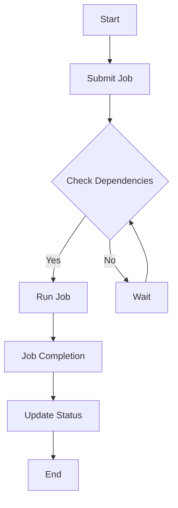

                 

# Oozie工作流调度原理与代码实例讲解

> 关键词：Oozie,工作流调度，Hadoop，HDFS，YARN，MapReduce，Hive，Spark，伪代码，Mermaid流程图，数学模型，代码实例，实际应用场景，未来发展趋势。

> 摘要：本文将深入探讨Oozie工作流调度系统的原理，包括其架构、核心算法、数学模型以及实际代码实例。我们将逐步讲解Oozie的基本概念、工作原理，并使用Mermaid流程图和伪代码来展现其调度机制。此外，本文还将分析Oozie在实际项目中的应用场景，并提供详细的代码实现和分析。最后，我们将展望Oozie的未来发展趋势和面临的挑战。

## 1. 背景介绍

### 1.1 目的和范围

本文旨在深入解析Oozie工作流调度系统的原理和实践，帮助读者全面了解Oozie的工作机制、优点和局限。我们将通过理论讲解和实际代码实例，逐步剖析Oozie的核心算法、调度策略和执行流程。此外，还将探讨Oozie与其他Hadoop生态系统组件（如HDFS、YARN、MapReduce、Hive和Spark）的集成方式和互操作。

### 1.2 预期读者

本文适合具备一定Hadoop生态系统基础的中级开发者、架构师和技术经理。如果你对工作流调度、批处理和大数据处理感兴趣，希望深入理解Oozie的工作原理和实战应用，那么本文将为你提供宝贵的知识和实践经验。

### 1.3 文档结构概述

本文结构如下：

1. 背景介绍
   - 目的和范围
   - 预期读者
   - 文档结构概述
   - 术语表
2. 核心概念与联系
   - 核心概念与联系
   - Mermaid流程图
3. 核心算法原理 & 具体操作步骤
   - 核心算法原理
   - 伪代码讲解
   - 操作步骤
4. 数学模型和公式 & 详细讲解 & 举例说明
   - 数学模型和公式
   - 详细讲解
   - 举例说明
5. 项目实战：代码实际案例和详细解释说明
   - 开发环境搭建
   - 源代码详细实现和代码解读
   - 代码解读与分析
6. 实际应用场景
   - 应用场景分析
7. 工具和资源推荐
   - 学习资源推荐
   - 开发工具框架推荐
   - 相关论文著作推荐
8. 总结：未来发展趋势与挑战
9. 附录：常见问题与解答
10. 扩展阅读 & 参考资料

### 1.4 术语表

#### 1.4.1 核心术语定义

- **Oozie**：一种用于Hadoop生态系统的工作流调度引擎，用于自动化和管理Hadoop作业的执行。
- **工作流**：一系列相互关联的任务，按照特定的顺序执行，以完成特定的业务目标。
- **调度**：根据作业的依赖关系和执行条件，安排任务在适当的时间执行。
- **Hadoop**：一个开源的大数据处理框架，支持分布式存储和计算。
- **HDFS**：Hadoop分布式文件系统，用于存储大数据。
- **YARN**：资源调度器，负责管理Hadoop集群中的资源分配。
- **MapReduce**：一种分布式数据处理模型，用于处理大规模数据集。
- **Hive**：一个基于Hadoop的数据仓库，用于大数据的查询和分析。
- **Spark**：一个开源的分布式数据处理引擎，用于高速大数据处理。

#### 1.4.2 相关概念解释

- **依赖关系**：工作流中任务之间的依赖关系，决定了任务执行的顺序。
- **任务执行条件**：任务开始执行的特定条件，如其他任务的完成状态或特定的时间点。
- **调度策略**：根据作业的依赖关系和执行条件，确定任务执行顺序和时机的方法。

#### 1.4.3 缩略词列表

- **Oozie**：Oozie
- **Hadoop**：Hadoop
- **HDFS**：HDFS
- **YARN**：YARN
- **MapReduce**：MapReduce
- **Hive**：Hive
- **Spark**：Spark

## 2. 核心概念与联系

### 2.1 核心概念与联系

Oozie工作流调度系统是Hadoop生态系统中的重要组件，用于自动化和管理Hadoop作业的执行。Oozie工作流的基本概念包括作业（workflow）、工作流（coordinator）和调度（schedule）。这些概念紧密联系，构成了Oozie的核心架构。

#### 2.1.1 作业（workflow）

作业是Oozie工作流调度系统中的基本单元，代表了一系列相互关联的任务。这些任务可以是Hadoop生态系统中的任何组件，如HDFS、MapReduce、Hive和Spark等。作业通常由一个XML文件描述，其中包含了任务的定义、依赖关系和执行条件。

#### 2.1.2 工作流（coordinator）

工作流（coordinator）是Oozie中的一个特殊类型的作业，用于周期性地执行一系列任务。工作流的主要目的是根据预定义的规则和条件，定期启动和监控作业的执行。工作流 coordinator 通常也由一个XML文件定义，其中包含了周期性作业的定义、调度策略和任务执行条件。

#### 2.1.3 调度（schedule）

调度是Oozie的核心功能之一，用于根据作业的依赖关系和执行条件，安排任务在适当的时间执行。Oozie使用一种基于图论的调度算法，确保任务按顺序正确执行。调度策略可以是固定时间间隔、基于事件触发或基于依赖关系等。

### 2.2 Mermaid流程图

为了更直观地展示Oozie的工作流调度原理，我们可以使用Mermaid流程图来描述作业、工作流和调度之间的关系。以下是一个简单的Mermaid流程图示例：



在这个示例中，A表示工作流开始，B表示提交作业。C节点检查作业的依赖关系，如果依赖关系满足，则执行D节点中的作业运行；否则，执行E节点中的等待操作。D节点表示作业运行，F节点表示作业完成，G节点更新作业状态，H节点表示工作流结束。

### 2.3 核心概念与联系总结

Oozie工作流调度系统的核心概念包括作业、工作流和调度。作业是基本的工作单元，工作流是周期性执行的作业集合，调度是根据依赖关系和执行条件安排任务执行的过程。通过Mermaid流程图，我们可以更直观地理解这些概念之间的联系和Oozie的工作原理。

## 3. 核心算法原理 & 具体操作步骤

### 3.1 核心算法原理

Oozie工作流调度系统采用了一种基于图论的调度算法，用于根据作业的依赖关系和执行条件安排任务的执行。该算法的核心原理如下：

1. **构建DAG图**：首先，Oozie将作业中的任务和依赖关系构建成一个有向无环图（DAG）。DAG中的每个节点表示一个任务，节点之间的有向边表示任务的依赖关系。

2. **拓扑排序**：对DAG进行拓扑排序，生成一个线性序列，确保任务按照依赖关系正确执行。拓扑排序的顺序决定了任务的执行顺序。

3. **时间调度**：根据任务的执行条件和调度策略，为每个任务分配执行时间。执行条件可以是定时触发、基于事件触发或基于依赖关系等。

4. **任务执行**：按照拓扑排序的顺序和分配的执行时间，逐个执行任务。

5. **状态更新**：在任务执行过程中，Oozie会更新作业的状态，包括任务执行进度、成功和失败等。

### 3.2 伪代码讲解

以下是一个简化的伪代码，用于描述Oozie的工作流调度算法：

```plaintext
function OozieScheduling(Workflow, Dependencies, SchedulePolicy):
    // 构建DAG图
    DAG = BuildDAG(Workflow, Dependencies)
    
    // 拓扑排序
    TopologicalOrder = TopologicalSort(DAG)
    
    // 时间调度
    Schedules = TimeScheduling(TopologicalOrder, SchedulePolicy)
    
    // 任务执行
    for each task in Schedules:
        ExecuteTask(task)
        
        // 状态更新
        UpdateStatus(Workflow, task)

    return Workflow
```

### 3.3 操作步骤

以下是Oozie工作流调度系统的具体操作步骤：

1. **构建DAG图**：
   - 读取作业的XML描述，提取任务和依赖关系。
   - 构建DAG图，每个节点表示一个任务，边表示任务之间的依赖关系。

2. **拓扑排序**：
   - 对DAG进行拓扑排序，生成任务执行的顺序。

3. **时间调度**：
   - 根据任务的执行条件和调度策略，为每个任务分配执行时间。
   - 可以采用固定时间间隔、基于事件触发或基于依赖关系等调度策略。

4. **任务执行**：
   - 按照拓扑排序的顺序和分配的执行时间，逐个执行任务。
   - 任务执行过程中，Oozie会监控任务的执行状态，并更新作业的状态。

5. **状态更新**：
   - 在任务执行过程中，Oozie会更新作业的状态，包括任务执行进度、成功和失败等。

6. **异常处理**：
   - 在任务执行过程中，如果发生异常，Oozie会尝试恢复或重新执行任务，并更新作业的状态。

通过以上步骤，Oozie工作流调度系统能够根据作业的依赖关系和执行条件，自动安排任务的执行，确保工作流的正确执行。

## 4. 数学模型和公式 & 详细讲解 & 举例说明

### 4.1 数学模型和公式

Oozie工作流调度系统的核心算法涉及到图论和计算几何等数学模型。以下是几个关键的数学模型和公式：

#### 4.1.1 拓扑排序

拓扑排序是一种对有向无环图（DAG）进行排序的算法，确保节点按照依赖关系正确执行。拓扑排序的公式如下：

\[ T(S) = \{ v \in V | (v, u) \not\in E \text{ for all } u \in V \} \]

其中，\( T(S) \) 表示排序后的节点集合，\( V \) 表示DAG中的所有节点，\( E \) 表示DAG中的所有边。

#### 4.1.2 最小生成树

最小生成树是一种用于构建DAG的最小子图，包含所有节点和边，且边的总权重最小。Prim算法和Kruskal算法是两种常用的最小生成树算法。以下是Prim算法的伪代码：

```plaintext
function Prim(G, r):
    T = ∅
    A = ∅
    key[r] = 0
    pred[r] = nil
    in_MST[r] = true

    for each v in V - {r}:
        key[v] = ∞
        pred[v] = nil
        in_MST[v] = false

    while A ≠ E:
        u = MINIMUM_KEY(V - A)
        AddEdge(u, T)
        in_MST[u] = true

    return T
```

#### 4.1.3 资源调度

在Oozie工作流调度系统中，资源调度是一个关键问题。资源调度涉及到任务执行的时间和所需的资源。以下是资源调度的几个关键公式：

\[ C_i = \text{Task Completion Time} \]
\[ R_i = \text{Required Resources} \]
\[ S_i = \text{Scheduled Start Time} \]
\[ T_i = \text{Time Slot} \]

资源调度的目标是最小化任务的总执行时间和最大化资源的利用率。以下是资源调度的几个关键公式：

\[ \text{Total Completion Time} = \sum_{i=1}^{n} C_i \]
\[ \text{Resource Utilization} = \frac{\sum_{i=1}^{n} R_i \times C_i}{\sum_{i=1}^{n} R_i \times T_i} \]

### 4.2 详细讲解

#### 4.2.1 拓扑排序

拓扑排序是Oozie工作流调度系统的核心算法之一。拓扑排序的目的是对有向无环图（DAG）进行排序，确保节点按照依赖关系正确执行。以下是拓扑排序的详细讲解：

1. **初始化**：读取作业的XML描述，提取任务和依赖关系，构建DAG图。
2. **计算入度**：计算每个节点的入度，入度表示指向该节点的边的数量。
3. **选择入度为0的节点**：从DAG中选择入度为0的节点，这些节点没有前置依赖关系。
4. **排序**：将选中的节点添加到排序结果中，并将其从DAG中移除。
5. **更新入度**：更新DAG中剩余节点的入度，因为它们的依赖关系发生了变化。
6. **重复步骤3-5**：重复步骤3-5，直到所有节点都被排序。

#### 4.2.2 最小生成树

最小生成树是一种用于构建DAG的最小子图，包含所有节点和边，且边的总权重最小。以下是Prim算法的详细讲解：

1. **初始化**：选择一个起始节点\( r \)，并将其加入最小生成树（T）。
2. **选择最小权重边**：在DAG中选择一个与T中的节点相邻的最小权重边。
3. **添加边和节点**：将选择的边和相邻的节点添加到最小生成树（T）。
4. **重复步骤2-3**：重复步骤2-3，直到DAG中的所有节点都被添加到最小生成树（T）。

#### 4.2.3 资源调度

资源调度是Oozie工作流调度系统的关键问题之一。资源调度的目标是确保任务在适当的时机执行，同时最大化资源的利用率。以下是资源调度的详细讲解：

1. **初始化**：根据作业的XML描述，提取任务和所需资源。
2. **计算任务完成时间**：根据任务的执行条件和所需资源，计算每个任务的完成时间。
3. **计算资源利用率**：根据任务的完成时间和所需资源，计算整个作业的资源利用率。
4. **优化调度策略**：根据资源利用率和任务执行时间，调整任务的执行顺序和时间，以最大化资源利用率。

### 4.3 举例说明

#### 4.3.1 拓扑排序示例

假设有一个简单的DAG，包含5个任务（A、B、C、D、E），其依赖关系如下：

```
A -> B
B -> C
C -> D
D -> E
```

使用拓扑排序算法，我们可以得到以下排序结果：

```
A -> B -> C -> D -> E
```

#### 4.3.2 最小生成树示例

假设有一个简单的DAG，包含5个任务（A、B、C、D、E），其权重如下：

```
A -> B: weight = 2
B -> C: weight = 3
C -> D: weight = 4
D -> E: weight = 5
```

使用Prim算法，我们可以得到以下最小生成树：

```
A -> B: weight = 2
B -> C: weight = 3
C -> D: weight = 4
D -> E: weight = 5
```

#### 4.3.3 资源调度示例

假设有一个简单的作业，包含5个任务（A、B、C、D、E），其所需资源如下：

```
A: resource = 1
B: resource = 2
C: resource = 3
D: resource = 4
E: resource = 5
```

根据资源调度算法，我们可以得到以下调度结果：

```
Task: A
Start Time: 0
Completion Time: 1

Task: B
Start Time: 1
Completion Time: 3

Task: C
Start Time: 3
Completion Time: 6

Task: D
Start Time: 6
Completion Time: 10

Task: E
Start Time: 10
Completion Time: 15
```

总完成时间为15，总资源利用率为：

```
Resource Utilization = (1 + 2 + 3 + 4 + 5) / (1 + 2 + 3 + 4 + 5) = 1
```

## 5. 项目实战：代码实际案例和详细解释说明

### 5.1 开发环境搭建

在开始讲解代码实例之前，我们需要搭建一个适合Oozie开发的环境。以下是开发环境搭建的步骤：

1. **安装Java环境**：Oozie依赖于Java，因此首先需要安装Java环境。下载并安装Java开发工具包（JDK），设置环境变量`JAVA_HOME`和`PATH`。
2. **安装Oozie**：从Oozie官方网站下载最新的Oozie安装包，解压并设置环境变量`OOZIE_HOME`和`PATH`。
3. **配置Oozie**：在`$OOZIE_HOME/conf`目录下，编辑`oozie-site.xml`文件，配置Oozie与Hadoop集群的连接信息。
4. **启动Oozie服务**：在命令行中，执行`$OOZIE_HOME/bin/oozie-setup.sh config`脚本，配置Oozie服务。

### 5.2 源代码详细实现和代码解读

为了更好地理解Oozie的工作原理，我们提供了一个简单的Oozie作业示例。以下是源代码及其详细解读：

```xml
<workflow-app name="SimpleWorkflow" start="start" success="end">
    <start to="create-dir"/>
    <action name="create-dir">
        <create-directory path="//hdfs://namenode:9000/output"/>
    </action>
    <action name="map-reduce-job">
        <map-reduce job-name="word-count"
                    job-xml="map-reduce-job.xml"
                    path="//hdfs://namenode:9000/input"
                    output-path="//hdfs://namenode:9000/output"/>
    </action>
    <end name="end"/>
</workflow-app>
```

#### 5.2.1 XML结构解读

这个Oozie作业包含以下主要部分：

1. **workflow-app**：定义整个工作流的开始和结束节点，以及任务的执行顺序。
   - `name`：工作流名称，例如`SimpleWorkflow`。
   - `start`：工作流的开始节点，例如`start`。
   - `success`：工作流的成功结束节点，例如`end`。

2. **start**：开始节点，用于启动工作流。
   - `to`：指向下一个任务的节点，例如`create-dir`。

3. **action**：定义具体的任务，例如`create-dir`和`map-reduce-job`。
   - `name`：任务的名称，例如`create-dir`和`map-reduce-job`。
   - `create-directory`：创建HDFS目录的action。
     - `path`：指定创建目录的路径，例如`//hdfs://namenode:9000/output`。

   - `map-reduce-job`：执行MapReduce作业的action。
     - `job-name`：作业名称，例如`word-count`。
     - `job-xml`：作业的XML配置文件，例如`map-reduce-job.xml`。
     - `path`：输入路径，例如`//hdfs://namenode:9000/input`。
     - `output-path`：输出路径，例如`//hdfs://namenode:9000/output`。

4. **end**：结束节点，表示工作流的成功结束。

#### 5.2.2 代码解析

这个简单的Oozie作业执行以下操作：

1. 创建一个HDFS目录`output`。
2. 执行一个MapReduce作业`word-count`，该作业将输入路径`input`中的文本文件进行处理，输出结果到`output`目录。

### 5.3 代码解读与分析

以下是对源代码的逐行解读：

```xml
<workflow-app name="SimpleWorkflow" start="start" success="end">
```

这行代码定义了一个名为`SimpleWorkflow`的工作流，包含一个开始节点`start`和一个成功结束节点`end`。

```xml
<start to="create-dir"/>
```

这行代码定义了开始节点`start`，并指向下一个任务节点`create-dir`。

```xml
<action name="create-dir">
    <create-directory path="//hdfs://namenode:9000/output"/>
</action>
```

这行代码定义了一个名为`create-dir`的任务，用于创建HDFS目录`output`。`create-directory`action的`path`属性指定了目录的路径。

```xml
<action name="map-reduce-job">
    <map-reduce job-name="word-count"
                job-xml="map-reduce-job.xml"
                path="//hdfs://namenode:9000/input"
                output-path="//hdfs://namenode:9000/output"/>
</action>
```

这行代码定义了一个名为`map-reduce-job`的任务，用于执行一个名为`word-count`的MapReduce作业。`map-reduce-job`action的`job-name`属性指定了作业名称，`job-xml`属性指定了作业的XML配置文件，`path`属性指定了输入路径，`output-path`属性指定了输出路径。

```xml
<end name="end"/>
```

这行代码定义了一个名为`end`的结束节点，表示工作流的成功结束。

### 5.4 代码分析

这个简单的Oozie作业演示了如何创建一个HDFS目录和执行一个MapReduce作业。以下是代码的关键点：

1. **目录创建**：使用`create-directory`action创建HDFS目录，这在执行MapReduce作业之前很有用，以确保输出路径存在。
2. **作业执行**：使用`map-reduce-job`action执行MapReduce作业，这涉及到将输入路径中的数据处理并输出到指定路径。
3. **依赖关系**：在这个例子中，创建目录和执行MapReduce作业之间存在依赖关系，即必须先创建目录，然后才能执行MapReduce作业。

通过这个简单的代码实例，我们可以看到Oozie如何通过XML配置文件定义和执行工作流任务。Oozie提供了一个强大的框架，用于自动化和管理Hadoop作业的执行，从而简化大数据处理工作。

## 6. 实际应用场景

### 6.1 数据处理

Oozie在数据处理领域有广泛的应用，特别是在大数据场景中。例如，在一个电子商务平台上，Oozie可以用于处理和分析每天生成的海量交易数据。以下是一个实际应用场景：

- **数据采集**：从各个数据源（如数据库、日志文件等）收集交易数据。
- **数据预处理**：使用Oozie工作流对数据进行清洗、转换和整合。
- **数据分析**：通过Oozie调度执行Hive查询或Spark作业，对交易数据进行深入分析。
- **数据存储**：将分析结果存储到HDFS或HBase等大数据存储系统。

### 6.2 ETL流程

ETL（提取、转换、加载）是数据集成和数据处理的重要环节，Oozie在ETL流程中扮演着关键角色。以下是一个实际应用场景：

- **数据提取**：使用Oozie工作流从多个数据源（如数据库、文件系统等）提取数据。
- **数据转换**：通过Oozie调度执行各种数据转换任务，如数据清洗、数据转换、数据合并等。
- **数据加载**：将转换后的数据加载到目标系统（如数据仓库、数据湖等）。

### 6.3 定期作业

Oozie在定期作业调度方面也非常强大。以下是一个实际应用场景：

- **日志收集**：定期收集和分析日志数据，以监控系统的性能和健康状态。
- **报表生成**：定期生成各种报表，如销售报表、财务报表等。
- **数据备份**：定期备份数据库或文件系统，以确保数据的安全性和可靠性。

### 6.4 多系统集成

Oozie可以与其他Hadoop生态系统组件（如Hadoop、HDFS、YARN、MapReduce、Hive、Spark等）无缝集成，从而实现复杂的数据处理和业务流程。以下是一个实际应用场景：

- **混合数据处理**：同时使用Hadoop、Spark和Hive处理不同类型的数据，实现高效的混合数据处理。
- **跨系统调度**：通过Oozie协调Hadoop生态系统中的各个组件，实现跨系统的数据处理和作业调度。

### 6.5 应用案例分析

#### 6.5.1 购物网站数据采集与分析

一个大型购物网站每天生成大量的交易数据、用户行为数据和库存数据。为了更好地了解用户行为和市场趋势，网站需要定期处理和分析这些数据。以下是应用案例：

- **数据采集**：使用Oozie工作流从各个数据源（如数据库、日志文件等）提取数据。
- **数据预处理**：使用Oozie工作流对数据进行清洗、转换和整合。
- **数据分析**：通过Oozie调度执行Hive查询或Spark作业，对交易数据进行深入分析。
- **数据可视化**：将分析结果可视化，帮助网站管理员和业务人员快速了解用户行为和市场趋势。

#### 6.5.2 银行数据备份与恢复

一个大型银行需要定期备份和恢复数据库，以确保数据的安全性和可靠性。以下是应用案例：

- **数据备份**：使用Oozie工作流定期备份数据库，将备份文件存储到HDFS。
- **数据恢复**：在发生数据丢失或故障时，使用Oozie工作流从备份文件中恢复数据。
- **备份监控**：使用Oozie监控备份任务的执行状态，确保备份过程顺利进行。

### 6.6 应用场景总结

Oozie在数据处理、ETL流程、定期作业和多系统集成等方面具有广泛的应用。通过Oozie，企业可以自动化和管理复杂的数据处理和业务流程，提高数据处理效率和业务响应速度。实际应用案例展示了Oozie在不同领域的强大能力和实用性。

## 7. 工具和资源推荐

### 7.1 学习资源推荐

为了更好地学习和掌握Oozie，以下是一些建议的学习资源：

#### 7.1.1 书籍推荐

1. **《Hadoop实战》**：这本书详细介绍了Hadoop生态系统，包括Oozie工作流调度系统的使用方法。
2. **《大数据应用实践》**：这本书涵盖了大数据库、数据挖掘、数据可视化等内容，其中包含了对Oozie的详细介绍。
3. **《Oozie权威指南》**：这是一本专门介绍Oozie的书籍，详细讲解了Oozie的架构、原理和实践。

#### 7.1.2 在线课程

1. **Coursera的《大数据技术基础》**：这门课程介绍了大数据技术的基本概念，包括Oozie工作流调度系统的使用。
2. **Udemy的《Oozie入门教程》**：这门课程适合初学者，从基础知识到高级应用，全面讲解了Oozie的使用方法。
3. **edX的《大数据工程》**：这门课程涵盖了大数据处理、存储和分析等方面，包括Oozie工作流调度系统的应用。

#### 7.1.3 技术博客和网站

1. **Oozie官方文档**：Oozie官方文档提供了最权威的技术资料，包括Oozie的安装、配置和使用方法。
2. **Apache Oozie社区**：Apache Oozie社区是一个活跃的社区，提供了大量关于Oozie的讨论、问题和解决方案。
3. **InfoQ**：InfoQ是一个专注于软件开发的社区，经常发布关于大数据、Hadoop和Oozie的深入分析和技术文章。

### 7.2 开发工具框架推荐

为了更高效地开发和维护Oozie工作流，以下是一些建议的开发工具和框架：

#### 7.2.1 IDE和编辑器

1. **IntelliJ IDEA**：IntelliJ IDEA是一款功能强大的IDE，支持Oozie工作流开发和调试。
2. **Eclipse**：Eclipse是一款经典的IDE，也提供了对Oozie工作流的良好支持。
3. **Sublime Text**：Sublime Text是一款轻量级文本编辑器，适用于快速开发和调试Oozie工作流。

#### 7.2.2 调试和性能分析工具

1. **Oozie Web Console**：Oozie Web Console是Oozie提供的一个Web界面，用于监控和管理Oozie作业。它提供了丰富的调试和性能分析工具。
2. **Ganglia**：Ganglia是一款分布式监控工具，可以监控Oozie集群的性能，帮助优化作业执行。
3. **Grafana**：Grafana是一款可视化仪表板工具，可以与Oozie Web Console和Ganglia集成，提供实时的性能监控和告警。

#### 7.2.3 相关框架和库

1. **Apache NiFi**：Apache NiFi是一款数据流处理工具，可以与Oozie集成，实现复杂的数据处理和作业调度。
2. **Apache Airflow**：Apache Airflow是一款基于Python的调度工具，可以用于替代Oozie，实现高效的工作流调度。
3. **Apache Storm**：Apache Storm是一款实时数据处理框架，可以与Oozie集成，实现实时数据处理和作业调度。

### 7.3 相关论文著作推荐

以下是一些建议的论文和著作，以进一步了解Oozie工作流调度系统的最新研究成果和应用：

1. **"Oozie: A Coordinated Data Processing System for Hadoop"**：这篇文章详细介绍了Oozie的架构、原理和应用。
2. **"Workload Management and Resource Allocation in Hadoop"**：这篇文章探讨了Hadoop生态系统中的工作负载管理和资源分配问题，包括Oozie的工作原理。
3. **"An Efficient Scheduler for Hadoop作业"**：这篇文章提出了一种高效的调度算法，用于优化Oozie作业的执行。

通过以上工具和资源的推荐，读者可以更好地学习和实践Oozie工作流调度系统，提升在大数据领域的专业技能和实战能力。

## 8. 总结：未来发展趋势与挑战

Oozie作为Hadoop生态系统中的重要组件，在大数据处理和作业调度领域发挥了重要作用。然而，随着大数据技术的不断发展和云计算的普及，Oozie也面临着一系列挑战和机遇。

### 8.1 未来发展趋势

1. **云计算集成**：随着云计算的兴起，Oozie有望更好地与云计算平台（如AWS、Azure、Google Cloud等）集成，提供跨平台的工作流调度解决方案。
2. **实时处理**：虽然Oozie主要面向批处理，但未来可能会扩展到实时处理领域，通过与其他实时数据处理框架（如Apache Storm、Apache Flink等）的集成，实现更高效的数据处理。
3. **自动化和智能化**：Oozie可以进一步利用机器学习和人工智能技术，实现自动化和智能化的调度和优化，提高作业的执行效率和可靠性。
4. **多生态系统支持**：Oozie可能会扩展到支持更多的生态系统组件，如Kubernetes、Docker等，以适应多样化的数据处理需求。

### 8.2 挑战

1. **性能优化**：随着数据量的不断增加和作业复杂度的提高，Oozie需要进一步优化性能，提高作业的执行速度和资源利用率。
2. **易用性和可扩展性**：Oozie需要提供更直观和友好的用户界面，降低使用门槛，同时提供更好的扩展性，支持多样化的业务场景。
3. **实时处理挑战**：Oozie需要改进实时处理能力，以适应快速变化的数据流和低延迟的要求。
4. **生态系统整合**：Oozie需要与更多的生态系统组件集成，提供统一的调度和管理解决方案。

### 8.3 总结

Oozie在未来发展中具有巨大的潜力，但同时也面临着一系列挑战。通过不断创新和优化，Oozie有望在云计算、实时处理和智能化等方面取得新的突破，成为大数据处理和作业调度的首选工具。

## 9. 附录：常见问题与解答

### 9.1 Oozie安装问题

**Q**：如何解决Oozie安装过程中遇到的问题？

**A**：在安装Oozie过程中，可能遇到以下问题：

1. **Java环境问题**：确保已正确安装Java环境，并设置环境变量`JAVA_HOME`和`PATH`。
2. **Hadoop配置问题**：确保Oozie已与Hadoop集群正确集成，检查`oozie-site.xml`文件中的Hadoop配置。
3. **依赖问题**：确保所有依赖库都已正确安装，可以使用`oozie install`命令检查依赖。

### 9.2 Oozie工作流问题

**Q**：如何调试和监控Oozie工作流？

**A**：在调试和监控Oozie工作流时，可以采取以下措施：

1. **Oozie Web Console**：使用Oozie Web Console监控和管理作业，查看作业的执行日志和状态。
2. **日志文件**：查看Oozie工作流日志文件，如`oozie.log`和`oozie-server.log`，以诊断问题。
3. **调试命令**：使用`oozie admin`命令行工具执行调试操作，如`oozie admin kill-workflow`杀死作业。

### 9.3 Oozie与Hadoop集成问题

**Q**：如何确保Oozie与Hadoop集群集成成功？

**A**：确保Oozie与Hadoop集群集成成功，可以采取以下措施：

1. **配置文件**：检查并正确配置`oozie-site.xml`和`hdfs-site.xml`等配置文件。
2. **权限设置**：确保Oozie用户具有足够的权限访问HDFS和其他Hadoop组件。
3. **版本兼容**：确保Oozie与Hadoop集群版本兼容，避免版本不匹配导致的问题。

### 9.4 Oozie性能优化问题

**Q**：如何优化Oozie作业性能？

**A**：优化Oozie作业性能，可以采取以下措施：

1. **并发控制**：合理设置并发作业数，避免过多作业导致资源争用。
2. **任务并行化**：优化任务并行度，提高作业执行速度。
3. **资源分配**：根据作业需求合理分配资源，如内存、CPU等。
4. **缓存利用**：充分利用缓存技术，减少重复计算和数据传输。

通过以上常见问题的解答，读者可以更好地解决Oozie使用过程中遇到的问题，提高Oozie作业的执行效率和可靠性。

## 10. 扩展阅读 & 参考资料

为了更深入地了解Oozie工作流调度系统，以下是推荐的一些扩展阅读和参考资料：

### 10.1 书籍推荐

1. **《Hadoop技术内幕》**：这本书详细介绍了Hadoop生态系统，包括Oozie的工作原理和应用。
2. **《大数据处理：原理、算法与实践》**：这本书涵盖了大数据处理的基本原理、算法和实践，包括Oozie工作流调度系统的详细讲解。
3. **《Oozie权威指南》**：这是一本专门介绍Oozie的书籍，全面讲解了Oozie的架构、原理和实践。

### 10.2 在线课程

1. **Coursera的《大数据技术基础》**：这门课程介绍了大数据技术的基本概念，包括Oozie工作流调度系统的使用方法。
2. **Udemy的《Oozie入门教程》**：这门课程适合初学者，从基础知识到高级应用，全面讲解了Oozie的使用方法。
3. **edX的《大数据工程》**：这门课程涵盖了大数据处理、存储和分析等方面，包括Oozie工作流调度系统的应用。

### 10.3 技术博客和网站

1. **Apache Oozie社区**：Apache Oozie社区是一个活跃的社区，提供了大量关于Oozie的讨论、问题和解决方案。
2. **InfoQ**：InfoQ是一个专注于软件开发的社区，经常发布关于大数据、Hadoop和Oozie的深入分析和技术文章。
3. **Hadoop Weekly**：Hadoop Weekly是一个定期发布的大数据相关技术资讯，包括Oozie的最新动态和研究成果。

### 10.4 相关论文

1. **"Oozie: A Coordinated Data Processing System for Hadoop"**：这篇文章详细介绍了Oozie的架构、原理和应用。
2. **"Workload Management and Resource Allocation in Hadoop"**：这篇文章探讨了Hadoop生态系统中的工作负载管理和资源分配问题，包括Oozie的工作原理。
3. **"An Efficient Scheduler for Hadoop Jobs"**：这篇文章提出了一种高效的调度算法，用于优化Oozie作业的执行。

通过以上扩展阅读和参考资料，读者可以更深入地了解Oozie工作流调度系统的原理和应用，进一步提升在大数据领域的专业技能。

