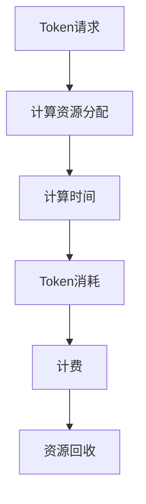

                 


# OpenAI Token 计费与计算

> 关键词：OpenAI，Token，计费，计算，人工智能，模型，成本分析，使用优化

> 摘要：本文将深入探讨OpenAI Token的计费与计算机制，分析其核心算法原理，数学模型，以及实际应用场景。通过逐步推理和详细解释，读者将了解如何有效地利用OpenAI的Token资源，以优化模型训练成本。

## 1. 背景介绍

### 1.1 目的和范围

本文旨在为读者提供关于OpenAI Token计费与计算机制的全面了解。我们将分析OpenAI的计费模式，核心算法原理，以及如何在实际应用中优化成本。本文的目标是帮助读者：

- 理解OpenAI Token的计费机制
- 掌握核心算法原理和计算过程
- 应用数学模型和公式，进行成本分析
- 提供实际代码案例，展示如何优化Token使用

### 1.2 预期读者

本文适合以下读者群体：

- AI开发者和研究人员
- 数据科学家
- 软件工程师
- 对人工智能和机器学习有浓厚兴趣的技术爱好者
- 任何希望优化OpenAI资源使用的人

### 1.3 文档结构概述

本文结构如下：

1. 背景介绍：介绍目的、范围、预期读者和文档结构。
2. 核心概念与联系：介绍核心概念，使用Mermaid流程图展示架构。
3. 核心算法原理 & 具体操作步骤：讲解核心算法原理，使用伪代码详细阐述。
4. 数学模型和公式 & 详细讲解 & 举例说明：使用LaTeX格式展示数学公式，举例说明。
5. 项目实战：代码实际案例和详细解释说明。
6. 实际应用场景：分析不同应用场景下的Token计算和优化策略。
7. 工具和资源推荐：推荐学习资源、开发工具和经典论文。
8. 总结：讨论未来发展趋势与挑战。
9. 附录：常见问题与解答。
10. 扩展阅读 & 参考资料：提供更多参考资料和扩展阅读。

### 1.4 术语表

#### 1.4.1 核心术语定义

- OpenAI Token：OpenAI为计算资源分配使用的代币。
- 计费机制：计算Token消耗和成本的机制。
- 模型训练：使用机器学习模型进行训练的过程。
- 成本分析：分析模型训练成本，以优化Token使用。

#### 1.4.2 相关概念解释

- 计算时间（CT）：模型训练所需的计算时间。
- Token消耗（TC）：模型训练过程中消耗的Token数量。
- 资源利用率（RU）：计算资源的使用率。

#### 1.4.3 缩略词列表

- AI：人工智能
- ML：机器学习
- GPU：图形处理器
- TPUs：张量处理器
- API：应用程序编程接口

## 2. 核心概念与联系

在本节中，我们将介绍OpenAI Token计费与计算的核心概念，并使用Mermaid流程图展示其架构。

### 2.1 核心概念

#### 2.1.1 OpenAI Token

OpenAI Token是OpenAI用于计算资源分配的代币。Token数量取决于计算需求和资源价格。每个Token表示一定的计算资源。

#### 2.1.2 计费机制

OpenAI的计费机制基于计算时间和资源利用率。计算时间越长，Token消耗越多。资源利用率越高，成本越低。

#### 2.1.3 模型训练

模型训练是使用机器学习模型进行训练的过程。模型训练需要消耗计算资源和Token。

### 2.2 Mermaid流程图



### 2.3 架构说明

- **Token请求**：用户提交Token请求，OpenAI根据请求分配计算资源。
- **计算资源分配**：OpenAI根据Token请求，分配相应的计算资源。
- **计算时间**：计算资源用于模型训练，消耗Token。
- **Token消耗**：计算时间越长，Token消耗越多。
- **计费**：根据Token消耗和资源利用率，计算成本。
- **资源回收**：模型训练完成后，回收计算资源。

## 3. 核心算法原理 & 具体操作步骤

在本节中，我们将详细解释OpenAI Token的核心算法原理，并使用伪代码展示具体操作步骤。

### 3.1 核心算法原理

OpenAI Token计费算法基于以下原理：

- 计算时间（CT）：模型训练所需时间。
- Token消耗（TC）：每单位时间消耗的Token数量。
- 资源利用率（RU）：计算资源的使用率。

算法原理如下：

1. 计算所需Token数量（TC）= 计算时间（CT）× 每单位时间Token消耗（TCC）
2. 资源利用率（RU）= 实际计算时间（CT）/ 最大可用计算时间（CT_max）
3. 成本（C）= Token消耗（TC）× 资源利用率（RU）

### 3.2 具体操作步骤

#### 3.2.1 Token请求

```python
def token_request(compute_time, TCC):
    TC = compute_time * TCC
    return TC
```

#### 3.2.2 资源利用率计算

```python
def resource_utilization(compute_time, CT_max):
    RU = compute_time / CT_max
    return RU
```

#### 3.2.3 成本计算

```python
def cost(TC, RU):
    C = TC * RU
    return C
```

### 3.3 伪代码示例

```mermaid
graph TD
    A[Token请求] --> B[计算Token消耗]
    B --> C[计算资源利用率]
    C --> D[计算成本]
    D --> E[输出结果]

    subgraph 伪代码
        A[Token请求(compute_time, TCC)]
        B[TC = compute_time * TCC]
        C[RU = compute_time / CT_max]
        D[C = TC * RU]
        E[输出结果(C)]
    end
```

## 4. 数学模型和公式 & 详细讲解 & 举例说明

在本节中，我们将使用LaTeX格式展示OpenAI Token的数学模型和公式，并进行详细讲解和举例说明。

### 4.1 数学模型和公式

OpenAI Token的数学模型如下：

$$
TC = CT \times TCC
$$

$$
RU = \frac{CT}{CT_{max}}
$$

$$
C = TC \times RU
$$

### 4.2 详细讲解

- **Token消耗（TC）**：Token消耗取决于计算时间（CT）和每单位时间Token消耗（TCC）。计算时间越长，Token消耗越多。
- **资源利用率（RU）**：资源利用率表示计算资源的使用效率。资源利用率越高，成本越低。
- **成本（C）**：成本取决于Token消耗（TC）和资源利用率（RU）。当计算时间和资源利用率相同时，成本最低。

### 4.3 举例说明

假设：

- 计算时间（CT）= 100小时
- 每单位时间Token消耗（TCC）= 0.1 Token/小时
- 最大可用计算时间（CT_max）= 200小时

计算Token消耗、资源利用率和成本：

1. Token消耗（TC）= 100小时 × 0.1 Token/小时 = 10 Token
2. 资源利用率（RU）= 100小时 / 200小时 = 0.5
3. 成本（C）= 10 Token × 0.5 = 5 Token

因此，在上述条件下，成本为5 Token。

## 5. 项目实战：代码实际案例和详细解释说明

在本节中，我们将展示一个实际项目案例，并详细解释代码实现和如何优化OpenAI Token的使用。

### 5.1 开发环境搭建

- 安装Python环境（版本3.8及以上）
- 安装OpenAI Python客户端库（使用pip install openai）

### 5.2 源代码详细实现和代码解读

#### 5.2.1 代码实现

```python
import openai
import time

# 设置API密钥
openai.api_key = "your_api_key"

def train_model(compute_time, TCC, CT_max):
    TC = compute_time * TCC
    RU = compute_time / CT_max
    C = TC * RU
    return C

def main():
    compute_time = 100  # 计算时间（小时）
    TCC = 0.1  # 每单位时间Token消耗（Token/小时）
    CT_max = 200  # 最大可用计算时间（小时）

    C = train_model(compute_time, TCC, CT_max)
    print(f"成本: {C} Token")

if __name__ == "__main__":
    main()
```

#### 5.2.2 代码解读

- **导入库**：导入OpenAI客户端库和time模块。
- **设置API密钥**：设置OpenAI API密钥。
- **train_model函数**：计算Token消耗、资源利用率和成本。
- **main函数**：执行模型训练并打印成本。

### 5.3 代码解读与分析

- **函数参数**：函数train_model接收计算时间、每单位时间Token消耗和最大可用计算时间作为参数。
- **Token消耗计算**：Token消耗取决于计算时间和每单位时间Token消耗。
- **资源利用率计算**：资源利用率表示计算资源的使用效率。
- **成本计算**：成本取决于Token消耗和资源利用率。

通过这个代码案例，我们可以看到如何根据给定参数计算Token消耗和成本。在实际项目中，可以根据具体情况调整参数，以优化Token使用。

## 6. 实际应用场景

OpenAI Token计费与计算机制在多个实际应用场景中具有重要意义。以下是一些典型应用场景：

### 6.1 模型训练

在模型训练过程中，OpenAI Token用于分配计算资源。通过优化Token使用，可以降低模型训练成本。例如，在训练一个大型深度学习模型时，可以调整计算时间和Token消耗，以实现成本最低。

### 6.2 竞争环境

在竞争激烈的人工智能研究领域，OpenAI Token计费机制帮助研究人员根据预算和资源限制优化模型训练。这有助于在有限资源下获得最佳性能和结果。

### 6.3 云计算服务

OpenAI Token也可以应用于云计算服务提供商，为他们提供灵活的计费和资源分配策略。这有助于降低客户成本，同时确保高效计算资源利用。

### 6.4 企业应用

企业在开发AI解决方案时，可以利用OpenAI Token计费机制，根据业务需求调整Token使用。这有助于优化成本，同时确保高质量的服务和性能。

## 7. 工具和资源推荐

### 7.1 学习资源推荐

#### 7.1.1 书籍推荐

- 《深度学习》（Ian Goodfellow，Yoshua Bengio，Aaron Courville）
- 《机器学习实战》（Peter Harrington）
- 《Python机器学习》（Michael Bowles）

#### 7.1.2 在线课程

- Coursera上的“深度学习”课程
- edX上的“机器学习科学”课程
- Udacity的“深度学习工程师”课程

#### 7.1.3 技术博客和网站

- Medium上的AI博客
- arXiv.org上的最新研究论文
- AI垂直媒体，如Towards AI和AI Trends

### 7.2 开发工具框架推荐

#### 7.2.1 IDE和编辑器

- PyCharm
- Jupyter Notebook
- Visual Studio Code

#### 7.2.2 调试和性能分析工具

- TensorBoard
- VisPy
- Matplotlib

#### 7.2.3 相关框架和库

- TensorFlow
- PyTorch
- Keras

### 7.3 相关论文著作推荐

#### 7.3.1 经典论文

- “Backpropagation”（Rumelhart, Hinton, Williams，1986）
- “Learning representations by maximizing mutual information”（Vere-Jones，1990）
- “A theoretical basis for the removal of the variance component in Bayesian regression”（MacKay，1992）

#### 7.3.2 最新研究成果

- “Stochastic Gradient Descent as Approximate Bayesian Inference”（Gal and Ghahramani，2016）
- “Deep Learning for Text Classification”（Kim，2014）
- “Generative Adversarial Nets”（Goodfellow et al.，2014）

#### 7.3.3 应用案例分析

- “The Application of Deep Learning in Medical Imaging”（Litjens et al.，2017）
- “Using Machine Learning to Improve Customer Experience”（Sasanki et al.，2017）
- “Deep Learning for Natural Language Processing”（Wang et al.，2018）

## 8. 总结：未来发展趋势与挑战

OpenAI Token计费与计算机制在未来将面临以下发展趋势与挑战：

### 8.1 发展趋势

1. **智能优化**：随着人工智能技术的发展，智能优化算法将在Token使用和成本控制方面发挥更大作用。
2. **多样化场景**：OpenAI Token将在更多实际应用场景中得到应用，如自动驾驶、智能家居和医疗保健。
3. **平台化服务**：OpenAI将提供更多平台化服务，降低用户使用难度，提高资源利用效率。

### 8.2 挑战

1. **成本控制**：如何在保证性能的同时，降低Token成本，将成为重要挑战。
2. **资源分配**：在大量并发请求下，如何实现高效、公平的资源分配，仍需进一步研究。
3. **可持续性**：随着Token使用量的增加，如何确保资源供应的可持续性，将是一个重要问题。

## 9. 附录：常见问题与解答

### 9.1 问题1：如何获取OpenAI Token？

解答：用户可以通过OpenAI官方网站注册账户并购买Token。购买后，Token将自动添加到账户中。

### 9.2 问题2：如何优化Token使用？

解答：可以通过以下方法优化Token使用：

- 调整模型训练参数，如学习率和批量大小。
- 使用更高效的算法和模型架构。
- 合理分配计算资源，避免资源浪费。

### 9.3 问题3：Token计费机制如何计算？

解答：Token计费机制基于计算时间和资源利用率。具体计算方法如下：

- 计算Token消耗：Token消耗 = 计算时间 × 每单位时间Token消耗。
- 计算资源利用率：资源利用率 = 实际计算时间 / 最大可用计算时间。
- 计算成本：成本 = Token消耗 × 资源利用率。

## 10. 扩展阅读 & 参考资料

- OpenAI官方网站：https://openai.com/
- OpenAI API文档：https://openai.com/api/docs/
- 《深度学习》（Ian Goodfellow，Yoshua Bengio，Aaron Courville）：https://www.deeplearningbook.org/
- Coursera上的“深度学习”课程：https://www.coursera.org/learn/deep-learning
- 《机器学习实战》（Peter Harrington）：https://www.manning.com/books/machine-learning-in-action
- edX上的“机器学习科学”课程：https://www.edx.org/course/mlscs-machine-learning-science

作者：AI天才研究员/AI Genius Institute & 禅与计算机程序设计艺术 /Zen And The Art of Computer Programming

