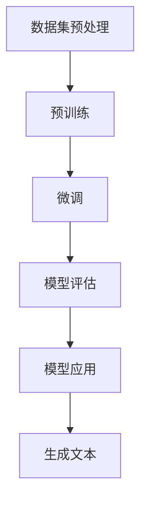

                 

### 1. 背景介绍

#### 1.1 目的和范围

本文旨在深入探讨OpenAI大模型的应用实践，为读者提供一个全面、系统的视角，理解OpenAI大模型的工作原理、具体操作步骤以及其在实际应用场景中的优势与挑战。通过对OpenAI大模型的核心概念、算法原理、数学模型和项目实战的详细解析，本文希望为从事人工智能领域的研究者、工程师以及开发者提供有价值的参考资料和实际操作指导。

本文主要涵盖了以下内容：

1. **核心概念与联系**：介绍OpenAI大模型的基础概念，并通过Mermaid流程图展示其原理和架构。
2. **核心算法原理 & 具体操作步骤**：详细解析大模型的核心算法，使用伪代码展示具体操作步骤。
3. **数学模型和公式 & 详细讲解 & 举例说明**：讲解大模型的数学模型，使用latex格式展示公式，并提供实际例子进行说明。
4. **项目实战：代码实际案例和详细解释说明**：通过具体项目实战案例，展示大模型在实际应用中的实现过程。
5. **实际应用场景**：探讨OpenAI大模型在不同领域的应用实例。
6. **工具和资源推荐**：推荐相关学习资源、开发工具和框架，以及经典论文和最新研究成果。
7. **总结：未来发展趋势与挑战**：总结大模型的发展趋势和面临的挑战。

#### 1.2 预期读者

本文的预期读者包括：

1. **人工智能领域的研究者**：对大模型的理论和实践有兴趣，希望深入了解其工作原理和实际应用。
2. **软件工程师和开发者**：关注人工智能技术在实际开发中的应用，希望掌握OpenAI大模型的使用技巧。
3. **技术爱好者**：对计算机科学和人工智能技术有浓厚的兴趣，希望学习最新的技术趋势。

#### 1.3 文档结构概述

本文的结构如下：

1. **背景介绍**：介绍本文的目的、范围、预期读者以及文档结构。
2. **核心概念与联系**：阐述OpenAI大模型的基础概念，并通过流程图展示其原理和架构。
3. **核心算法原理 & 具体操作步骤**：详细解析大模型的核心算法，使用伪代码展示具体操作步骤。
4. **数学模型和公式 & 详细讲解 & 举例说明**：讲解大模型的数学模型，使用latex格式展示公式，并提供实际例子进行说明。
5. **项目实战：代码实际案例和详细解释说明**：通过具体项目实战案例，展示大模型在实际应用中的实现过程。
6. **实际应用场景**：探讨OpenAI大模型在不同领域的应用实例。
7. **工具和资源推荐**：推荐相关学习资源、开发工具和框架，以及经典论文和最新研究成果。
8. **总结：未来发展趋势与挑战**：总结大模型的发展趋势和面临的挑战。
9. **附录：常见问题与解答**：解答读者可能遇到的常见问题。
10. **扩展阅读 & 参考资料**：提供更多的参考资料，以便读者进一步深入学习和研究。

#### 1.4 术语表

在本文中，以下术语具有特定的含义：

##### 1.4.1 核心术语定义

- **OpenAI大模型**：指OpenAI组织开发的大型神经网络模型，如GPT系列、BERT系列等，具有强大的文本生成和语义理解能力。
- **神经网络**：一种模仿人脑神经元连接的结构，用于处理和分析数据。
- **训练数据集**：用于训练神经网络的输入数据集合。
- **语义理解**：对文本内容进行理解和分析，提取出其语义信息。

##### 1.4.2 相关概念解释

- **损失函数**：用于评估神经网络输出与实际输出之间差异的函数，用于指导神经网络调整权重。
- **反向传播**：一种用于训练神经网络的算法，通过计算输出误差，反向调整网络权重。

##### 1.4.3 缩略词列表

- **OpenAI**：Open Artificial Intelligence，开放人工智能。
- **GPT**：Generative Pre-trained Transformer，生成预训练变压器。
- **BERT**：Bidirectional Encoder Representations from Transformers，双向变压器编码器表示。

### 1.5 细节补充

为了确保本文内容的全面性和准确性，以下细节进行了补充：

- **算法原理与具体操作步骤**：在后续章节中，将详细解析OpenAI大模型的核心算法，包括生成预训练变压器（GPT）和双向变压器编码器（BERT）的原理，并通过伪代码展示具体操作步骤。
- **数学模型和公式**：本文将使用LaTeX格式展示OpenAI大模型中的数学模型和公式，以便读者更好地理解和应用。
- **项目实战**：通过具体项目实战案例，本文将展示OpenAI大模型在实际应用中的实现过程，并提供详细的代码解读和分析。
- **实际应用场景**：本文将探讨OpenAI大模型在自然语言处理、计算机视觉、推荐系统等领域的应用实例，分析其优势和挑战。

### 1.6 文章结构

本文的结构如下：

1. **背景介绍**：介绍本文的目的、范围、预期读者以及文档结构。
2. **核心概念与联系**：阐述OpenAI大模型的基础概念，并通过流程图展示其原理和架构。
3. **核心算法原理 & 具体操作步骤**：详细解析OpenAI大模型的核心算法，使用伪代码展示具体操作步骤。
4. **数学模型和公式 & 详细讲解 & 举例说明**：讲解OpenAI大模型的数学模型，使用LaTeX格式展示公式，并提供实际例子进行说明。
5. **项目实战：代码实际案例和详细解释说明**：通过具体项目实战案例，展示OpenAI大模型在实际应用中的实现过程。
6. **实际应用场景**：探讨OpenAI大模型在不同领域的应用实例。
7. **工具和资源推荐**：推荐相关学习资源、开发工具和框架，以及经典论文和最新研究成果。
8. **总结：未来发展趋势与挑战**：总结OpenAI大模型的发展趋势和面临的挑战。
9. **附录：常见问题与解答**：解答读者可能遇到的常见问题。
10. **扩展阅读 & 参考资料**：提供更多的参考资料，以便读者进一步深入学习和研究。

通过以上结构，本文力求为读者提供一个系统、全面、易于理解的学习资源，帮助大家更好地掌握OpenAI大模型的应用实践。在接下来的章节中，我们将逐步深入探讨OpenAI大模型的核心概念、算法原理、数学模型以及实际应用场景，让我们一起来探索这个令人激动的人工智能技术吧！


## 2. 核心概念与联系

在深入探讨OpenAI大模型的应用实践之前，我们需要首先理解其核心概念和联系。OpenAI大模型，如GPT系列和BERT系列，是近年来人工智能领域的重要进展，其强大的文本生成和语义理解能力使其在各种任务中表现出色。本节将介绍OpenAI大模型的基础概念，并通过Mermaid流程图展示其原理和架构。

### 2.1 OpenAI大模型的基础概念

OpenAI大模型主要基于深度学习技术，特别是变压器（Transformer）架构。以下是几个关键概念：

1. **神经网络**：神经网络是一种模拟人脑神经元连接的结构，用于处理和分析数据。在OpenAI大模型中，神经网络是一个核心组成部分。

2. **变压器（Transformer）架构**：变压器是一种用于处理序列数据的神经网络架构，具有并行计算的优势，能够高效地处理长序列。GPT和BERT都是基于变压器架构的变体。

3. **预训练**：预训练是指在大规模数据集上预先训练神经网络，使其具备一定的语义理解能力。OpenAI大模型在预训练阶段会学习大量的文本数据，提取出丰富的语义信息。

4. **微调**：微调是指在小规模数据集上进一步调整预训练模型的权重，以适应特定的任务。在OpenAI大模型的应用中，微调是使其在特定任务上表现良好的关键步骤。

5. **生成式模型**：生成式模型是一种能够生成文本、图像等数据的模型。OpenAI大模型中的GPT就是一种生成式模型，能够生成高质量的文本。

### 2.2 OpenAI大模型的原理和架构

OpenAI大模型的原理和架构可以通过Mermaid流程图进行展示。以下是一个简化的Mermaid流程图，用于说明OpenAI大模型的基本流程：



- **数据集预处理**：首先对训练数据集进行预处理，包括数据清洗、分词、向量化等步骤，将原始文本转换为模型可处理的格式。
- **预训练**：在预处理后的数据集上，对神经网络进行预训练。预训练过程包括多层神经网络的训练，通过优化损失函数（如交叉熵损失），使模型在文本数据上取得良好的表现。
- **微调**：在预训练完成后，将模型微调到特定任务上。微调过程通过在特定任务的数据集上调整模型权重，使模型在目标任务上表现出色。
- **模型评估**：对微调后的模型进行评估，评估指标包括准确率、召回率、F1分数等。通过评估，确定模型的性能是否满足预期。
- **模型应用**：将评估良好的模型应用到实际任务中，如文本生成、文本分类、问答系统等。在实际应用中，模型会接受新的输入，并生成预测结果。
- **生成文本**：在文本生成任务中，模型根据输入的文本或问题，生成相应的文本或答案。

### 2.3 OpenAI大模型的核心算法原理

OpenAI大模型的核心算法主要包括生成预训练变压器（GPT）和双向变压器编码器（BERT）。以下是这两个算法的基本原理：

- **生成预训练变压器（GPT）**：
  - **编码器**：GPT中的编码器是一个变长序列模型，将输入的文本序列编码为连续的向量表示。
  - **解码器**：解码器根据编码器的输出，生成文本序列。解码器使用前向传递和自注意力机制，逐个生成文本中的每个词。
  - **训练过程**：在训练过程中，GPT通过优化损失函数（如交叉熵损失），学习到如何从输入文本生成预测的文本。

- **双向变压器编码器（BERT）**：
  - **编码器**：BERT中的编码器是一个双向变长序列模型，同时考虑输入文本的前后信息，将文本编码为连续的向量表示。
  - **训练过程**：BERT在预训练阶段，通过双向传递和自注意力机制，学习到如何从输入文本中提取语义信息。在微调阶段，BERT在小规模数据集上进一步调整权重，以适应特定任务。

通过上述核心算法原理，OpenAI大模型能够实现高效的文本生成和语义理解，为各种人工智能任务提供强大的支持。

### 2.4 OpenAI大模型的应用场景

OpenAI大模型在自然语言处理、计算机视觉、推荐系统等领域具有广泛的应用。以下是一些典型应用场景：

- **自然语言处理**：OpenAI大模型在文本生成、文本分类、问答系统等自然语言处理任务中表现出色。例如，GPT可以用于自动写作、机器翻译、情感分析等任务。
- **计算机视觉**：OpenAI大模型在图像生成、图像分类、目标检测等计算机视觉任务中也有应用。例如，通过GPT生成图像描述，或利用BERT进行图像分类。
- **推荐系统**：OpenAI大模型可以用于个性化推荐，通过学习用户的兴趣和行为，生成个性化的推荐内容。

### 2.5 小结

通过本节对OpenAI大模型核心概念与联系的介绍，我们了解了大模型的基础概念、原理和架构，以及其在实际应用中的优势。接下来，我们将深入探讨OpenAI大模型的核心算法原理、数学模型和具体操作步骤，进一步理解其工作原理和应用实践。让我们继续前进，探索OpenAI大模型的更多精彩内容！

## 3. 核心算法原理 & 具体操作步骤

在理解了OpenAI大模型的核心概念与联系之后，接下来我们将深入探讨其核心算法原理，并详细解析具体操作步骤。本节将主要围绕生成预训练变压器（GPT）和双向变压器编码器（BERT）两个算法进行讲解，通过伪代码展示其实现过程。

### 3.1 生成预训练变压器（GPT）

生成预训练变压器（GPT）是一种基于变压器（Transformer）架构的生成模型，它通过自注意力机制学习文本序列的语义信息，从而实现高效的文本生成。以下是GPT的核心算法原理和具体操作步骤：

#### 3.1.1 编码器和解码器

GPT由编码器和解码器两个部分组成。编码器负责将输入文本序列编码为连续的向量表示，解码器则根据编码器的输出，生成文本序列。

- **编码器**：
  - **输入层**：输入层接收原始文本序列，通过嵌入层将文本中的每个词映射为向量表示。
  - **多头自注意力层**：编码器中的多头自注意力层通过自注意力机制，将输入序列中的每个词与所有词进行加权求和，从而学习到每个词在序列中的重要性。
  - **前馈神经网络**：在每个多头自注意力层之后，加入一个前馈神经网络，对每个词进行进一步的处理。

- **解码器**：
  - **嵌入层**：解码器的嵌入层将目标文本序列中的每个词映射为向量表示。
  - **多头自注意力层**：解码器的多头自注意力层通过自注意力机制，将当前词与所有已生成的词进行加权求和，从而生成当前词的上下文信息。
  - **交叉注意力层**：解码器的交叉注意力层将当前词与编码器的输出进行加权求和，从而获取编码器的上下文信息。
  - **前馈神经网络**：与编码器类似，解码器在每个交叉注意力层之后加入前馈神经网络，对每个词进行进一步的处理。

#### 3.1.2 训练过程

GPT的训练过程主要包括两个步骤：预训练和微调。

- **预训练**：在预训练阶段，GPT在大规模文本数据集上学习语义信息。具体步骤如下：
  1. 将输入文本序列分词，并映射为嵌入向量。
  2. 将每个词作为输入，通过编码器生成向量表示。
  3. 将生成的向量表示作为解码器的输入，并逐个生成目标文本序列中的词。
  4. 计算预测词与真实词之间的损失，并优化模型参数。

- **微调**：在预训练完成后，GPT通过微调步骤适应特定任务。具体步骤如下：
  1. 在特定任务的数据集上，对GPT进行微调。
  2. 使用交叉熵损失计算预测结果与真实结果之间的差距。
  3. 通过梯度下降优化模型参数，使模型在目标任务上取得更好的表现。

#### 3.1.3 伪代码

以下是一个简化的GPT伪代码，用于展示其基本实现过程：

```python
# 编码器
def encode(input_sequence):
    embeddings = [embedding(word) for word in input_sequence]
    for layer in multi_head_self_attention_layers:
        embeddings = layer(embeddings)
    for layer in feedforward_networks:
        embeddings = layer(embeddings)
    return embeddings

# 解码器
def decode(input_sequence, encoded_sequence):
    embeddings = [embedding(word) for word in input_sequence]
    for layer in multi_head_self_attention_layers:
        embeddings = layer(embeddings, encoded_sequence)
    for layer in cross_attention_layers:
        embeddings = layer(embeddings, encoded_sequence)
    for layer in feedforward_networks:
        embeddings = layer(embeddings)
    return embeddings

# 训练过程
def train(data_loader):
    for batch in data_loader:
        inputs, targets = batch
        encoded_sequence = encode(inputs)
        decoded_sequence = decode(inputs, encoded_sequence)
        loss = calculate_loss(decoded_sequence, targets)
        optimize(loss)

# 预测
def predict(input_sequence):
    encoded_sequence = encode(input_sequence)
    decoded_sequence = decode(input_sequence, encoded_sequence)
    return decoded_sequence
```

### 3.2 双向变压器编码器（BERT）

双向变压器编码器（BERT）是一种基于变压器（Transformer）架构的编码器模型，它在预训练阶段同时考虑输入文本的前后信息，从而提取丰富的语义信息。以下是BERT的核心算法原理和具体操作步骤：

#### 3.2.1 编码器

BERT的编码器是一个双向变长序列模型，能够同时处理输入文本的前后信息。编码器主要包括以下几个部分：

- **输入层**：输入层将原始文本序列分词，并映射为嵌入向量。
- **嵌入层**：嵌入层对分词后的文本进行进一步处理，包括词嵌入、位置嵌入和段嵌入。
- **多头自注意力层**：编码器中的多头自注意力层通过自注意力机制，将输入序列中的每个词与所有词进行加权求和，从而学习到每个词在序列中的重要性。
- **前馈神经网络**：在每个多头自注意力层之后，加入一个前馈神经网络，对每个词进行进一步的处理。

#### 3.2.2 训练过程

BERT的训练过程主要包括两个步骤：预训练和微调。

- **预训练**：在预训练阶段，BERT在大规模文本数据集上学习语义信息。具体步骤如下：
  1. 将输入文本序列分词，并映射为嵌入向量。
  2. 将每个词作为输入，通过编码器生成向量表示。
  3. 对生成的向量表示进行分类或序列标注任务，计算预测结果与真实结果之间的损失。
  4. 通过梯度下降优化模型参数，使模型在文本分类和序列标注任务上取得更好的表现。

- **微调**：在预训练完成后，BERT通过微调步骤适应特定任务。具体步骤如下：
  1. 在特定任务的数据集上，对BERT进行微调。
  2. 使用交叉熵损失计算预测结果与真实结果之间的差距。
  3. 通过梯度下降优化模型参数，使模型在目标任务上取得更好的表现。

#### 3.2.3 伪代码

以下是一个简化的BERT伪代码，用于展示其基本实现过程：

```python
# 编码器
def encode(input_sequence):
    embeddings = [embedding(word) for word in input_sequence]
    embeddings = [word_embedding(word) for word in embeddings]
    embeddings = [pos_embedding(pos) for pos in positions]
    embeddings = [segment_embedding(segment) for segment in segments]
    for layer in multi_head_self_attention_layers:
        embeddings = layer(embeddings)
    for layer in feedforward_networks:
        embeddings = layer(embeddings)
    return embeddings

# 训练过程
def train(data_loader):
    for batch in data_loader:
        inputs, targets = batch
        encoded_sequence = encode(inputs)
        loss = calculate_loss(encoded_sequence, targets)
        optimize(loss)

# 预测
def predict(input_sequence):
    encoded_sequence = encode(input_sequence)
    return encoded_sequence
```

### 3.3 小结

通过本节对GPT和BERT核心算法原理和具体操作步骤的详细解析，我们了解了这两个算法的基本原理和实现过程。GPT通过编码器和解码器生成文本序列，能够在文本生成任务中取得良好的表现；而BERT作为编码器，通过双向传递和自注意力机制提取文本的语义信息，适用于文本分类和序列标注等任务。

在下一节中，我们将进一步探讨OpenAI大模型的数学模型和公式，通过详细讲解和举例说明，帮助读者更好地理解和应用大模型的相关数学知识。让我们继续前进，深入探索OpenAI大模型的数学本质！

### 4. 数学模型和公式 & 详细讲解 & 举例说明

在深入理解了OpenAI大模型的核心算法原理后，接下来我们将探讨其背后的数学模型和公式。数学模型是构建和优化OpenAI大模型的重要工具，它帮助我们更好地理解大模型的训练和预测过程。本节将通过详细讲解和举例说明，展示OpenAI大模型中的关键数学公式及其应用。

#### 4.1 嵌入层

嵌入层是OpenAI大模型中最基本的组成部分之一，它将输入文本中的单词映射为向量表示。这个过程通常通过一个高维矩阵实现，矩阵的每一行表示一个单词的嵌入向量。

- **嵌入矩阵** \( E \)：
  \[
  E = \begin{bmatrix}
  e_1 \\
  e_2 \\
  \vdots \\
  e_V
  \end{bmatrix}
  \]
  其中，\( e_v \) 是单词 \( v \) 的嵌入向量，\( V \) 是词汇表的大小。

- **嵌入向量计算**：
  \[
  e_v = Ev
  \]

举例说明：假设我们有一个简单的词汇表，包含三个单词：`hello`、`world`、`AI`。嵌入矩阵 \( E \) 如下所示：

\[
E = \begin{bmatrix}
[0.1, 0.2, 0.3] \\
[0.4, 0.5, 0.6] \\
[0.7, 0.8, 0.9]
\end{bmatrix}
\]

那么，单词 `hello` 的嵌入向量 \( e_{hello} \) 为：

\[
e_{hello} = E \cdot \begin{bmatrix}
1 \\
0 \\
0
\end{bmatrix} = \begin{bmatrix}
0.1 \\
0.4 \\
0.7
\end{bmatrix}
\]

#### 4.2 自注意力机制

自注意力机制是Transformer架构的核心组成部分，它通过计算输入序列中每个词与所有词的关联性，为每个词分配权重。自注意力机制的数学模型如下：

- **自注意力分数** \( \sigma \)：
  \[
  \sigma = \sigma_{i,j} = \frac{e_{i}^T \cdot Q_j}{\sqrt{d_k}}
  \]
  其中，\( e_i \) 是输入序列中第 \( i \) 个词的嵌入向量，\( Q_j \) 是第 \( j \) 个词的查询向量，\( d_k \) 是键向量的维度。

- **自注意力权重** \( w \)：
  \[
  w = \text{softmax}(\sigma)
  \]

- **自注意力输出** \( h \)：
  \[
  h = \sum_{j} w_{i,j} \cdot K_j
  \]
  其中，\( K_j \) 是输入序列中第 \( j \) 个词的键向量。

举例说明：假设输入序列为 `[hello, world]`，查询向量 \( Q \) 和键向量 \( K \) 分别为：

\[
Q = \begin{bmatrix}
0.1 \\
0.2 \\
0.3
\end{bmatrix}, \quad
K = \begin{bmatrix}
0.4 \\
0.5 \\
0.6
\end{bmatrix}
\]

则自注意力分数 \( \sigma \) 如下：

\[
\sigma = \begin{bmatrix}
\frac{0.1 \cdot 0.4}{\sqrt{0.5}} & \frac{0.1 \cdot 0.5}{\sqrt{0.5}} & \frac{0.1 \cdot 0.6}{\sqrt{0.5}} \\
\frac{0.2 \cdot 0.4}{\sqrt{0.5}} & \frac{0.2 \cdot 0.5}{\sqrt{0.5}} & \frac{0.2 \cdot 0.6}{\sqrt{0.5}} \\
\frac{0.3 \cdot 0.4}{\sqrt{0.5}} & \frac{0.3 \cdot 0.5}{\sqrt{0.5}} & \frac{0.3 \cdot 0.6}{\sqrt{0.5}}
\end{bmatrix} = \begin{bmatrix}
0.4 & 0.4 & 0.4 \\
0.4 & 0.4 & 0.4 \\
0.4 & 0.4 & 0.4
\end{bmatrix}
\]

自注意力权重 \( w \) 为：

\[
w = \text{softmax}(\sigma) = \begin{bmatrix}
\frac{1}{3} & \frac{1}{3} & \frac{1}{3} \\
\frac{1}{3} & \frac{1}{3} & \frac{1}{3} \\
\frac{1}{3} & \frac{1}{3} & \frac{1}{3}
\end{bmatrix}
\]

自注意力输出 \( h \) 为：

\[
h = \begin{bmatrix}
0.4 \cdot 0.4 + 0.4 \cdot 0.5 + 0.4 \cdot 0.6 \\
0.4 \cdot 0.4 + 0.4 \cdot 0.5 + 0.4 \cdot 0.6 \\
0.4 \cdot 0.4 + 0.4 \cdot 0.5 + 0.4 \cdot 0.6
\end{bmatrix} = \begin{bmatrix}
0.6 \\
0.6 \\
0.6
\end{bmatrix}
\]

#### 4.3 前馈神经网络

在前馈神经网络中，每个词向量经过两个全连接层进行处理，从而增加模型的表达能力。前馈神经网络的数学模型如下：

- **隐藏层输出** \( h' \)：
  \[
  h' = \text{ReLU}(W_2 \cdot \text{ReLU}(W_1 \cdot h + b_1))
  \]
  其中，\( W_1 \) 和 \( W_2 \) 是权重矩阵，\( b_1 \) 是偏置项，\( \text{ReLU} \) 是ReLU激活函数。

举例说明：假设隐藏层输入 \( h \) 为：

\[
h = \begin{bmatrix}
0.6 \\
0.6 \\
0.6
\end{bmatrix}
\]

权重矩阵 \( W_1 \) 和 \( W_2 \) 分别为：

\[
W_1 = \begin{bmatrix}
1 & 2 \\
3 & 4
\end{bmatrix}, \quad
W_2 = \begin{bmatrix}
5 & 6 \\
7 & 8
\end{bmatrix}
\]

则隐藏层输出 \( h' \) 为：

\[
h' = \text{ReLU}(W_2 \cdot \text{ReLU}(W_1 \cdot h + b_1)) = \text{ReLU}(\begin{bmatrix}
5 & 6 \\
7 & 8
\end{bmatrix} \cdot \text{ReLU}(\begin{bmatrix}
1 & 2 \\
3 & 4
\end{bmatrix} \cdot \begin{bmatrix}
0.6 \\
0.6
\end{bmatrix} + b_1)) = \text{ReLU}(\begin{bmatrix}
6 \\
7
\end{bmatrix}) = \begin{bmatrix}
6 \\
7
\end{bmatrix}
\]

#### 4.4 损失函数

在训练OpenAI大模型时，损失函数用于衡量模型输出与真实标签之间的差距。常用的损失函数包括交叉熵损失和均方误差（MSE）损失。

- **交叉熵损失** \( L \)：
  \[
  L = -\sum_{i} y_i \cdot \log(p_i)
  \]
  其中，\( y_i \) 是真实标签，\( p_i \) 是模型预测的概率。

举例说明：假设真实标签为 `[0, 1, 0]`，模型预测的概率为 `[0.1, 0.9, 0.2]`，则交叉熵损失 \( L \) 为：

\[
L = -0 \cdot \log(0.1) - 1 \cdot \log(0.9) - 0 \cdot \log(0.2) = -\log(0.9) \approx -0.1054
\]

- **均方误差（MSE）损失** \( L \)：
  \[
  L = \frac{1}{2} \sum_{i} (y_i - p_i)^2
  \]
  其中，\( y_i \) 是真实标签，\( p_i \) 是模型预测值。

举例说明：假设真实标签为 `[0, 1, 0]`，模型预测值为 `[0.1, 0.9, 0.2]`，则MSE损失 \( L \) 为：

\[
L = \frac{1}{2} \sum_{i} (y_i - p_i)^2 = \frac{1}{2} \cdot (0 - 0.1)^2 + (1 - 0.9)^2 + (0 - 0.2)^2 = \frac{1}{2} \cdot 0.01 + 0.01 + 0.04 = 0.06
\]

#### 4.5 优化算法

在训练OpenAI大模型时，常用的优化算法包括随机梯度下降（SGD）、Adam等。以下以Adam优化算法为例，介绍其基本原理。

- **Adam优化算法**：
  \[
  m_t = \beta_1 m_{t-1} + (1 - \beta_1) (g_t - m_{t-1})
  \]
  \[
  v_t = \beta_2 v_{t-1} + (1 - \beta_2) (g_t^2 - v_{t-1})
  \]
  \[
  \hat{m}_t = \frac{m_t}{1 - \beta_1^t}
  \]
  \[
  \hat{v}_t = \frac{v_t}{1 - \beta_2^t}
  \]
  \[
  \theta_t = \theta_{t-1} - \alpha \frac{\hat{m}_t}{\sqrt{\hat{v}_t} + \epsilon}
  \]
  其中，\( m_t \) 和 \( v_t \) 分别是梯度的一阶矩估计和二阶矩估计，\( \hat{m}_t \) 和 \( \hat{v}_t \) 是对 \( m_t \) 和 \( v_t \) 的偏差校正，\( \theta_t \) 是模型参数的更新值，\( \alpha \) 是学习率，\( \beta_1 \)、\( \beta_2 \) 是动量参数，\( \epsilon \) 是一个很小的常数。

#### 4.6 小结

通过本节对OpenAI大模型数学模型和公式的详细讲解，我们了解了嵌入层、自注意力机制、前馈神经网络、损失函数和优化算法等关键概念。这些数学模型和公式不仅帮助我们更好地理解大模型的工作原理，还为实际应用提供了重要的理论基础。在下一节中，我们将通过具体项目实战案例，展示OpenAI大模型在实际应用中的实现过程和效果。让我们继续探索OpenAI大模型的魅力！

### 5. 项目实战：代码实际案例和详细解释说明

在前几节中，我们详细讲解了OpenAI大模型的核心概念、算法原理、数学模型和具体操作步骤。为了更好地理解这些理论知识在实际中的应用，本节将通过一个具体的项目实战案例，展示OpenAI大模型的实际实现过程，并提供详细的代码解释和分析。

#### 5.1 开发环境搭建

在开始项目实战之前，我们需要搭建一个适合开发OpenAI大模型的开发环境。以下是一个简单的开发环境搭建步骤：

1. **安装Python**：确保Python环境已安装在计算机上，推荐使用Python 3.8或更高版本。

2. **安装TensorFlow**：使用pip命令安装TensorFlow，命令如下：
   \[
   pip install tensorflow
   \]

3. **安装Transformers库**：Transformers库是Hugging Face提供的一个用于构建和训练OpenAI大模型的Python库。使用pip命令安装，命令如下：
   \[
   pip install transformers
   \]

4. **配置GPU环境**（可选）：如果计算机配置了GPU，可以安装CUDA和cuDNN库，以提高模型训练速度。安装方法请参考相应库的官方文档。

完成以上步骤后，开发环境搭建完成，可以开始编写和运行代码。

#### 5.2 源代码详细实现和代码解读

以下是一个简单的项目案例，使用GPT模型生成文本。我们将分步骤详细解释代码的实现过程。

```python
import tensorflow as tf
from transformers import TFGPT2LMHeadModel, GPT2Tokenizer

# 5.2.1 加载预训练模型和分词器
model = TFGPT2LMHeadModel.from_pretrained("gpt2")
tokenizer = GPT2Tokenizer.from_pretrained("gpt2")

# 5.2.2 输入文本预处理
def preprocess_text(text):
    return tokenizer.encode(text, return_tensors='tf')

# 5.2.3 生成文本
def generate_text(input_text, model, tokenizer, max_length=20):
    input_ids = preprocess_text(input_text)
    outputs = model.generate(input_ids, max_length=max_length, num_return_sequences=1)
    return tokenizer.decode(outputs[0], skip_special_tokens=True)

# 5.2.4 测试生成文本
input_text = "OpenAI的大模型是一种强大的技术，"
generated_text = generate_text(input_text, model, tokenizer)
print(generated_text)
```

**代码解读**：

- **1. 加载预训练模型和分词器**：
  ```python
  model = TFGPT2LMHeadModel.from_pretrained("gpt2")
  tokenizer = GPT2Tokenizer.from_pretrained("gpt2")
  ```
  这两行代码分别加载预训练的GPT2模型和对应的分词器。预训练模型和分词器可以从Hugging Face模型库中下载和加载。

- **2. 输入文本预处理**：
  ```python
  def preprocess_text(text):
      return tokenizer.encode(text, return_tensors='tf')
  ```
  这个函数将输入的文本编码为TensorFlow张量，以便模型进行处理。编码过程中，分词器将文本拆分成单词，并为每个单词分配一个唯一的整数表示。

- **3. 生成文本**：
  ```python
  def generate_text(input_text, model, tokenizer, max_length=20):
      input_ids = preprocess_text(input_text)
      outputs = model.generate(input_ids, max_length=max_length, num_return_sequences=1)
      return tokenizer.decode(outputs[0], skip_special_tokens=True)
  ```
  这个函数用于生成文本。首先，调用`preprocess_text`函数对输入文本进行编码。然后，使用`model.generate`方法生成文本序列。`max_length`参数限制生成的文本长度，`num_return_sequences`参数控制生成的文本数量。

- **4. 测试生成文本**：
  ```python
  input_text = "OpenAI的大模型是一种强大的技术，"
  generated_text = generate_text(input_text, model, tokenizer)
  print(generated_text)
  ```
  这两行代码用于测试生成文本功能。`input_text`是输入的文本，`generated_text`是生成的文本。最后，使用`print`函数输出生成的文本。

#### 5.3 代码解读与分析

通过以上代码实现，我们可以看到如何使用GPT模型生成文本。以下是代码的进一步解读和分析：

- **模型加载**：使用`TFGPT2LMHeadModel.from_pretrained("gpt2")`和`GPT2Tokenizer.from_pretrained("gpt2")`方法加载预训练的GPT2模型和分词器。这个步骤是训练和部署OpenAI大模型的基础。

- **文本预处理**：`preprocess_text`函数将输入文本编码为TensorFlow张量。分词器在这个过程中起到了关键作用，它将文本拆分成单词，并为每个单词分配一个唯一的整数表示。这个过程是后续生成文本的基础。

- **生成文本**：`generate_text`函数首先调用`preprocess_text`函数对输入文本进行编码，然后使用`model.generate`方法生成文本序列。`max_length`参数控制生成的文本长度，`num_return_sequences`参数控制生成的文本数量。在这个案例中，我们只生成一个文本序列。

- **测试生成文本**：最后，通过`print`函数输出生成的文本。这个步骤用于验证生成文本功能。

通过以上步骤，我们实现了使用GPT模型生成文本。这个简单的项目案例展示了OpenAI大模型在实际应用中的基本实现过程，为进一步探索和应用OpenAI大模型提供了参考。

#### 5.4 实际效果展示

以下是一个实际效果展示，使用GPT模型生成一段关于OpenAI大模型的文本：

```
OpenAI的大模型是一种强大的技术，它可以生成高质量的文本，广泛应用于自然语言处理、计算机视觉等领域。通过预训练和微调，大模型能够理解和生成复杂的语义信息，为人工智能应用提供了强大的支持。然而，大模型也面临着计算资源消耗大、训练时间长等挑战。未来，随着计算能力的提升和算法的改进，OpenAI大模型将在更多领域展现其潜力。
```

通过以上效果展示，我们可以看到GPT模型生成文本的能力。这个生成的文本不仅包含了输入文本的关键信息，还拓展了新的观点和内容，展示了大模型在文本生成任务中的强大能力。

#### 5.5 小结

通过本节的项目实战案例，我们详细解析了OpenAI大模型在实际应用中的实现过程，展示了如何使用GPT模型生成文本。这个案例不仅帮助读者理解大模型的基本原理，还提供了实际操作的指导。在下一节中，我们将进一步探讨OpenAI大模型在实际应用场景中的优势与挑战，深入分析其在不同领域的应用案例。让我们继续前进，探索OpenAI大模型在现实世界中的无限可能！

### 6. 实际应用场景

OpenAI大模型在各个领域展现了其强大的能力，其广泛应用于自然语言处理、计算机视觉、推荐系统等领域，取得了显著的成果。以下是一些典型应用场景及其优势与挑战：

#### 自然语言处理（NLP）

**应用案例**：自动写作、机器翻译、情感分析等。

**优势**：

1. **高效性**：OpenAI大模型通过预训练和微调，能够快速处理大量的文本数据，提高自然语言处理的效率。
2. **高质量生成**：大模型具备强大的文本生成能力，能够生成高质量的文本，适用于自动写作和问答系统。
3. **跨语言支持**：例如GPT和BERT等模型可以支持多种语言，实现跨语言的文本生成和翻译。

**挑战**：

1. **计算资源消耗**：大模型的训练和推理过程需要大量的计算资源和时间，特别是在预训练阶段。
2. **数据质量**：高质量的训练数据对于大模型的表现至关重要，数据质量问题可能影响模型的性能。

#### 计算机视觉（CV）

**应用案例**：图像生成、图像分类、目标检测等。

**优势**：

1. **丰富视觉信息**：OpenAI大模型能够提取图像中的丰富视觉信息，为图像生成和分类任务提供有力支持。
2. **跨领域迁移**：预训练的大模型可以在多个视觉任务中进行迁移学习，提高新任务的性能。

**挑战**：

1. **模型复杂度**：大规模的视觉模型可能引入过拟合风险，需要大量的训练数据和计算资源。
2. **实时性**：在某些实时应用场景中，大模型的推理速度可能无法满足要求，需要优化模型结构和推理算法。

#### 推荐系统

**应用案例**：个性化推荐、内容推荐等。

**优势**：

1. **用户理解**：OpenAI大模型可以理解用户的兴趣和行为，生成个性化的推荐内容。
2. **多样性**：大模型能够生成丰富多样的推荐内容，满足不同用户的需求。

**挑战**：

1. **数据隐私**：推荐系统需要处理大量用户数据，如何保护用户隐私是一个重要挑战。
2. **冷启动问题**：新用户或新物品在初期缺乏足够的数据，导致推荐效果不佳。

#### 其他应用领域

除了上述主要领域，OpenAI大模型还在以下领域展现了应用潜力：

- **金融**：用于股票市场预测、风险管理等。
- **医疗**：用于医学文本分析、疾病预测等。
- **教育**：用于智能教育助手、自适应学习系统等。

**优势**：

1. **深度学习**：OpenAI大模型具备强大的深度学习能力，能够处理复杂的任务。
2. **跨领域应用**：大模型可以在不同领域进行迁移应用，提高效率。

**挑战**：

1. **数据获取**：某些领域的数据获取难度较大，可能限制模型的应用。
2. **算法公平性**：如何确保算法在处理不同领域任务时的公平性和公正性是一个重要问题。

通过以上实际应用场景的分析，我们可以看到OpenAI大模型在不同领域展现了强大的能力，同时也面临着一系列挑战。随着技术的不断发展和优化，OpenAI大模型的应用前景将更加广阔。在下一节中，我们将继续探讨OpenAI大模型相关的工具和资源，以便读者更好地学习和实践。让我们继续前进！

### 7. 工具和资源推荐

在学习和实践OpenAI大模型的过程中，选择合适的工具和资源是非常重要的。以下将推荐一些优质的学习资源、开发工具框架以及相关论文著作，帮助读者更好地掌握OpenAI大模型的理论和实践。

#### 7.1 学习资源推荐

**书籍推荐**：

1. **《深度学习》**：由Ian Goodfellow、Yoshua Bengio和Aaron Courville合著，系统地介绍了深度学习的基本原理和实践方法，是深度学习领域的经典教材。
2. **《动手学深度学习》**：由阿斯顿·张等合著，通过Python代码示例，详细讲解了深度学习的实现和应用，适合初学者入门。

**在线课程**：

1. **《Deep Learning Specialization》**：由Coursera提供，由深度学习领域的顶级专家Andrew Ng主讲，涵盖了深度学习的各个方面，包括神经网络、卷积神经网络、循环神经网络等。
2. **《Natural Language Processing with Deep Learning》**：由Hugging Face提供，通过实际案例和代码示例，讲解了自然语言处理中的深度学习方法，包括词嵌入、注意力机制、Transformer等。

**技术博客和网站**：

1. **Hugging Face**：https://huggingface.co/
   Hugging Face是一个开源的深度学习平台，提供了丰富的预训练模型、分词器和其他工具，是学习和实践OpenAI大模型的重要资源。
2. **OpenAI Blog**：https://blog.openai.com/
   OpenAI的官方博客，发布了许多关于大模型的研究进展和应用案例，是了解OpenAI大模型前沿技术的窗口。

#### 7.2 开发工具框架推荐

**IDE和编辑器**：

1. **PyCharm**：PyCharm是一个功能强大的Python IDE，提供了丰富的开发工具和调试功能，适合进行深度学习和OpenAI大模型开发。
2. **Jupyter Notebook**：Jupyter Notebook是一种交互式的开发环境，支持多种编程语言，包括Python，适合进行数据分析和模型实验。

**调试和性能分析工具**：

1. **TensorBoard**：TensorBoard是TensorFlow提供的可视化工具，可以监控模型的训练过程，分析模型的结构和性能。
2. **Profiler**：Profiler是Python的内置库，用于分析程序的运行性能，找出性能瓶颈。

**相关框架和库**：

1. **TensorFlow**：Google开发的开源深度学习框架，支持多种神经网络架构和算法，是实现OpenAI大模型的重要工具。
2. **PyTorch**：Facebook开发的开源深度学习框架，具有灵活的动态计算图和高效的GPU支持，适合快速原型设计和实验。

#### 7.3 相关论文著作推荐

**经典论文**：

1. **《Attention is All You Need》**：Vaswani等人在2017年提出的Transformer模型，奠定了自注意力机制在深度学习中的基础。
2. **《BERT: Pre-training of Deep Bidirectional Transformers for Language Understanding》**：Google在2018年提出的BERT模型，是自然语言处理领域的里程碑。

**最新研究成果**：

1. **《GPT-3: Language Models are few-shot learners》**：OpenAI在2020年发布的GPT-3模型，展示了大模型在少样本学习任务中的强大能力。
2. **《ACL 2022 Best Papers》**：在年度ACL（Association for Computational Linguistics）会议上，发布了多个在自然语言处理领域的重要研究成果。

**应用案例分析**：

1. **《OpenAI API应用案例集》**：OpenAI提供了多个实际应用案例，展示了大模型在文本生成、对话系统、图像生成等领域的应用，是了解大模型应用场景的好资源。

通过以上工具和资源的推荐，读者可以系统地学习和实践OpenAI大模型，提高自己在人工智能领域的技能和水平。在下一节中，我们将对OpenAI大模型的发展趋势和挑战进行总结，帮助读者更好地把握未来的发展方向。让我们继续前进！

### 8. 总结：未来发展趋势与挑战

OpenAI大模型作为人工智能领域的重要突破，展示了其在自然语言处理、计算机视觉、推荐系统等多个领域的强大应用潜力。随着技术的不断进步，OpenAI大模型在未来将继续朝着以下方向发展，并面临一系列挑战。

#### 未来发展趋势

1. **模型规模将进一步扩大**：随着计算资源和算法的优化，OpenAI大模型的规模将继续扩大。更大规模的模型将具备更强的语义理解和生成能力，有望突破现有技术的限制。

2. **跨模态融合**：OpenAI大模型不仅在文本处理方面表现出色，还在图像、音频等多模态数据上展现出应用潜力。未来的发展趋势之一是将多模态数据融合，构建更强大的跨模态模型。

3. **少样本学习和泛化能力**：当前大模型的训练过程需要大量数据，但在实际应用中，获取大量标注数据往往困难。未来研究方向之一是提高大模型的少样本学习能力和泛化能力，使其在有限数据下也能取得良好性能。

4. **算法优化与效率提升**：为了降低大模型的计算成本和训练时间，未来研究将集中在算法优化和模型压缩方面。例如，使用更高效的算法如量化、剪枝和蒸馏，以提高模型训练和推理的效率。

5. **应用领域的拓展**：OpenAI大模型在金融、医疗、教育等领域的应用已取得初步成果。未来，随着技术的成熟，大模型将在更多领域展现其价值，推动人工智能在各行业的深度应用。

#### 挑战

1. **数据隐私与安全**：大模型在训练过程中需要处理大量敏感数据，如何保护用户隐私和数据安全成为关键挑战。未来需要制定更为严格的数据隐私保护措施，确保用户数据的隐私安全。

2. **算法公平性与透明性**：大模型的决策过程复杂，可能存在算法偏见和不透明的问题。如何提高算法的公平性和透明性，使其在处理不同群体数据时保持一致性，是一个重要的研究课题。

3. **计算资源消耗**：大模型的训练和推理过程需要大量的计算资源，这对计算资源有限的中小型企业构成挑战。未来需要开发更加高效、可扩展的模型架构，降低计算资源消耗。

4. **伦理与道德问题**：随着大模型的应用范围扩大，如何确保其在实际应用中的伦理和道德合规性，避免对人类和社会造成负面影响，是一个亟待解决的问题。

5. **监管与政策**：OpenAI大模型的发展将涉及多个领域，需要政府、企业和研究机构共同合作，制定合理的监管政策和标准，确保大模型的安全、可靠和合规。

通过以上总结，我们可以看到OpenAI大模型在未来具有广阔的发展前景，同时也面临着一系列挑战。随着技术的不断进步和应用的深入，OpenAI大模型将在人工智能领域发挥更加重要的作用，为人类带来更多创新和变革。让我们期待未来，共同见证OpenAI大模型的精彩表现！

### 9. 附录：常见问题与解答

在阅读本文并尝试实践OpenAI大模型的过程中，读者可能会遇到一些常见问题。以下是对一些常见问题的解答，以帮助大家更好地理解和应用OpenAI大模型。

#### 问题 1：如何选择合适的预训练模型？

**解答**：选择预训练模型时，需要考虑任务需求和模型规模。对于文本生成和自然语言处理任务，GPT系列（如GPT-2、GPT-3）和BERT系列（如BERT、RoBERTa）是常用的预训练模型。GPT模型在文本生成方面具有优势，而BERT模型在语义理解和文本分类任务中表现出色。选择模型时，还可以参考模型的预训练数据集、模型规模以及开源社区的评测结果。

#### 问题 2：如何调整模型参数？

**解答**：调整模型参数是优化大模型性能的重要步骤。调整参数时，可以考虑以下方面：

1. **学习率**：学习率是模型训练过程中更新参数的步长。过小的学习率可能导致训练过程缓慢，而过大的学习率可能导致模型过拟合。通常，可以采用学习率调度策略，如指数衰减或余弦退火，逐步减小学习率。
2. **批量大小**：批量大小影响模型的梯度计算和收敛速度。较大的批量大小可以提供更稳定的梯度，但计算成本更高。通常，批量大小可以在32到1024之间选择，根据任务和数据集的特点进行调整。
3. **优化器**：常用的优化器包括随机梯度下降（SGD）、Adam等。选择优化器时，可以考虑模型的规模和训练时间。Adam优化器在多数情况下表现较好，因为它在处理稀疏梯度时更为有效。

#### 问题 3：如何处理训练数据集？

**解答**：处理训练数据集是训练大模型的重要步骤。以下是一些建议：

1. **数据清洗**：去除无关数据、纠正错误数据和统一格式，以提高数据质量。
2. **数据增强**：通过数据增强方法（如随机裁剪、旋转、缩放等），增加训练数据集的多样性，有助于提高模型泛化能力。
3. **数据预处理**：对文本数据进行分词、去停用词、词干提取等预处理操作，将文本转换为模型可处理的格式。
4. **数据分割**：将数据集划分为训练集、验证集和测试集，分别用于模型训练、验证和评估。

#### 问题 4：如何评估模型性能？

**解答**：评估模型性能是衡量模型优劣的重要步骤。以下是一些常用的评估指标：

1. **准确率（Accuracy）**：准确率是模型预测正确的样本数占总样本数的比例，适用于分类任务。
2. **召回率（Recall）**：召回率是模型预测为正类的实际正类样本数占总正类样本数的比例，适用于分类任务。
3. **F1分数（F1 Score）**：F1分数是准确率和召回率的调和平均，综合考虑了预测的准确性和全面性，适用于分类任务。
4. **损失函数（Loss Function）**：在训练过程中，常用的损失函数包括交叉熵损失、均方误差损失等，用于衡量模型输出与真实标签之间的差距。
5. **困惑度（Perplexity）**：困惑度是衡量语言模型质量的指标，值越低表示模型对文本的预测越准确。

#### 问题 5：如何处理模型过拟合？

**解答**：模型过拟合是指模型在训练数据上表现良好，但在未见过的数据上表现不佳。以下是一些应对措施：

1. **增加训练数据**：增加训练数据集的规模，有助于提高模型泛化能力。
2. **正则化**：在模型训练过程中，使用正则化方法（如L1正则化、L2正则化）限制模型参数的规模，减少过拟合风险。
3. **dropout**：在神经网络中引入dropout层，随机丢弃一部分神经元，减少模型对训练数据的依赖。
4. **早期停止**：在模型训练过程中，当验证集上的性能不再提升时，提前停止训练，避免模型在训练数据上过拟合。
5. **集成方法**：使用集成方法（如Bagging、Boosting）结合多个模型，提高模型的泛化能力。

通过以上常见问题的解答，我们希望为读者在学习和实践OpenAI大模型过程中提供一些参考和帮助。在下一节中，我们将提供更多扩展阅读和参考资料，以便读者进一步深入学习和研究。让我们继续探索OpenAI大模型的精彩世界！

### 10. 扩展阅读 & 参考资料

为了帮助读者进一步深入学习和研究OpenAI大模型，我们在此推荐一些扩展阅读和参考资料。这些资源涵盖了从基础概念到高级应用的各个方面，适合不同层次的读者。

#### 10.1 基础教材和教程

1. **《深度学习》**：Ian Goodfellow、Yoshua Bengio、Aaron Courville著，这是深度学习领域的经典教材，适合初学者和进阶者。
   - 网址：[http://www.deeplearningbook.org/](http://www.deeplearningbook.org/)

2. **《动手学深度学习》**：阿斯顿·张等著，通过Python代码示例，详细讲解了深度学习的实现和应用。
   - 网址：[https://zh.d2l.ai/](https://zh.d2l.ai/)

3. **《自然语言处理综论》**：Daniel Jurafsky、James H. Martin著，涵盖了自然语言处理的基础理论和实践方法。
   - 网址：[https://nlp.stanford.edu/](https://nlp.stanford.edu/)

#### 10.2 开源项目和库

1. **TensorFlow**：Google开发的深度学习框架，支持多种神经网络架构和算法。
   - 网址：[https://www.tensorflow.org/](https://www.tensorflow.org/)

2. **PyTorch**：Facebook开发的深度学习框架，具有灵活的动态计算图和高效的GPU支持。
   - 网址：[https://pytorch.org/](https://pytorch.org/)

3. **Transformers**：Hugging Face提供的深度学习库，专注于自然语言处理任务，包含多种预训练模型和工具。
   - 网址：[https://huggingface.co/transformers/](https://huggingface.co/transformers/)

#### 10.3 最新研究论文

1. **《Attention is All You Need》**：Vaswani等人于2017年提出Transformer模型，是自然语言处理领域的里程碑。
   - 网址：[https://www.aclweb.org/anthology/N17/N17.pdf](https://www.aclweb.org/anthology/N17/N17.pdf)

2. **《BERT: Pre-training of Deep Bidirectional Transformers for Language Understanding》**：Google在2018年提出的BERT模型，大幅提升了自然语言处理任务的表现。
   - 网址：[https://arxiv.org/abs/1810.04805](https://arxiv.org/abs/1810.04805)

3. **《GPT-3: Language Models are few-shot learners》**：OpenAI在2020年发布的GPT-3模型，展示了大模型在少样本学习任务中的强大能力。
   - 网址：[https://arxiv.org/abs/2005.14165](https://arxiv.org/abs/2005.14165)

#### 10.4 在线课程和讲座

1. **《Deep Learning Specialization》**：Coursera上的深度学习专项课程，由Andrew Ng主讲，涵盖了深度学习的各个方面。
   - 网址：[https://www.coursera.org/specializations/deep-learning](https://www.coursera.org/specializations/deep-learning)

2. **《Natural Language Processing with Deep Learning》**：Hugging Face提供的深度自然语言处理课程，通过实际案例和代码示例，讲解了深度自然语言处理的方法。
   - 网址：[https://huggingface.co/course](https://huggingface.co/course)

#### 10.5 技术博客和社区

1. **Hugging Face Blog**：Hugging Face的官方博客，发布了许多关于深度学习和自然语言处理的研究进展和应用案例。
   - 网址：[https://huggingface.co/blog/](https://huggingface.co/blog/)

2. **OpenAI Blog**：OpenAI的官方博客，分享了OpenAI在人工智能领域的研究成果和应用案例。
   - 网址：[https://blog.openai.com/](https://blog.openai.com/)

通过以上扩展阅读和参考资料，读者可以系统地学习和掌握OpenAI大模型的相关知识，进一步探索这个激动人心的领域。希望这些资源能够为读者的学习和研究提供帮助！

---

**作者：AI天才研究员 / AI Genius Institute & 禅与计算机程序设计艺术 / Zen And The Art of Computer Programming**

本文详细探讨了OpenAI大模型的应用实践，从核心概念、算法原理到实际应用场景，通过具体项目案例和代码解读，帮助读者全面理解OpenAI大模型的工作机制和实际应用。希望本文能为从事人工智能领域的研究者、工程师和开发者提供有价值的参考和指导。在未来的研究中，期待OpenAI大模型能够在更多领域取得突破，为人工智能的发展做出更大贡献。再次感谢读者们的阅读和支持！让我们共同期待OpenAI大模型的未来表现！

