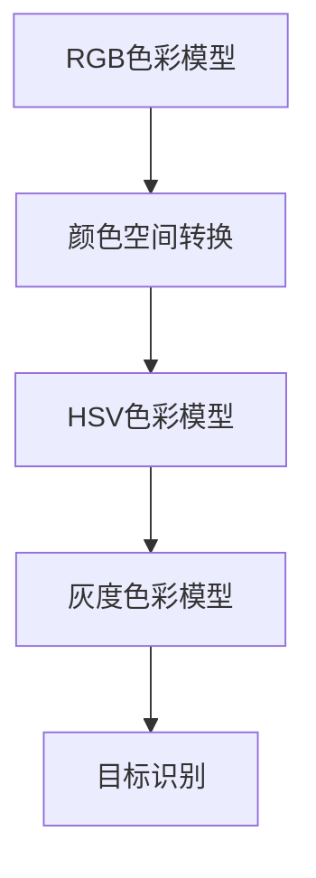
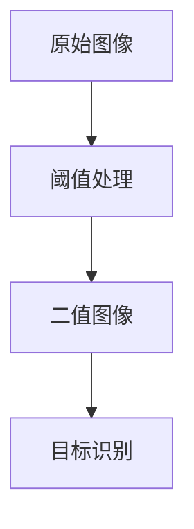
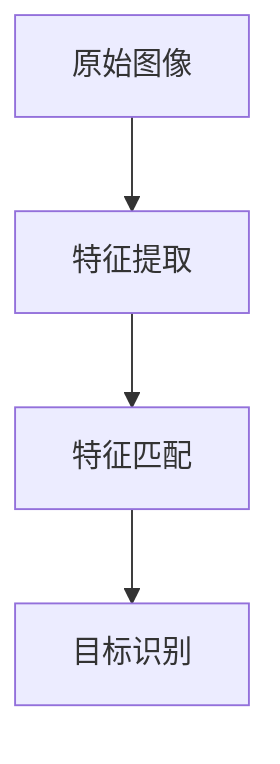

                 

# OpenCV基于颜色的目标识别

> **关键词：** OpenCV, 目标识别，颜色空间转换，阈值处理，目标追踪
>
> **摘要：** 本文将深入探讨OpenCV中基于颜色的目标识别技术，从核心概念、算法原理、数学模型到实际应用场景，全面剖析这一技术，旨在帮助读者理解和掌握颜色识别在计算机视觉中的实际应用。

## 1. 背景介绍

### 1.1 目的和范围

本文旨在介绍OpenCV中基于颜色的目标识别技术，旨在帮助开发者理解并应用这一技术于实际项目中。本文将涵盖以下几个部分：

1. OpenCV中颜色识别的基本原理和流程。
2. 颜色空间转换、阈值处理等核心算法。
3. 数学模型和公式的讲解与示例。
4. 实际应用场景介绍和项目实战。
5. 相关工具和资源的推荐。

### 1.2 预期读者

本文适用于对OpenCV和计算机视觉有一定了解的开发者，特别是希望深入研究和应用颜色识别技术的工程师和研究者。同时，对于计算机视觉和图像处理初学者，本文也提供了详细的理论和实践指导。

### 1.3 文档结构概述

本文结构如下：

1. **背景介绍**：简要介绍文章的目的和范围。
2. **核心概念与联系**：讲解颜色识别的基本概念和流程，使用Mermaid流程图展示。
3. **核心算法原理 & 具体操作步骤**：详细讲解颜色识别算法的原理和操作步骤，使用伪代码描述。
4. **数学模型和公式 & 详细讲解 & 举例说明**：介绍颜色识别相关的数学模型，使用LaTeX格式展示公式，并举例说明。
5. **项目实战：代码实际案例和详细解释说明**：提供实际项目案例，讲解代码实现和解读。
6. **实际应用场景**：介绍颜色识别技术在现实中的应用。
7. **工具和资源推荐**：推荐学习资源、开发工具和相关论文。
8. **总结：未来发展趋势与挑战**：总结文章内容，展望未来发展。
9. **附录：常见问题与解答**：解答读者可能遇到的问题。
10. **扩展阅读 & 参考资料**：提供进一步阅读的材料。

### 1.4 术语表

#### 1.4.1 核心术语定义

- **OpenCV**：Open Source Computer Vision Library，是一个开源的计算机视觉库，提供丰富的图像处理和计算机视觉算法。
- **目标识别**：在图像或视频中检测和识别特定对象的过程。
- **颜色空间**：用于描述图像中颜色信息的数学模型。
- **阈值处理**：将图像转换为二值图像的过程，通过设定阈值来区分目标与背景。
- **HSV颜色空间**：色调（H）、饱和度（S）、亮度（V）颜色空间，常用于颜色识别。

#### 1.4.2 相关概念解释

- **像素**：图像中的最小单位，每个像素包含颜色信息。
- **特征匹配**：通过比较图像中的特征点来识别目标。
- **前景与背景**：在图像处理中，通常将目标视为前景，其他部分视为背景。

#### 1.4.3 缩略词列表

- **OpenCV**：Open Source Computer Vision Library
- **HSV**：Hue（色调）、Saturation（饱和度）、Value（亮度）

## 2. 核心概念与联系

在讨论基于颜色的目标识别之前，我们需要理解一些核心概念和它们之间的关系。

### 2.1 颜色空间转换

颜色空间是描述图像颜色信息的数学模型。OpenCV支持多种颜色空间转换，包括RGB、HSV、灰度等。颜色空间转换是目标识别的关键步骤，因为不同颜色空间在处理特定类型的目标时可能更有效。

#### Mermaid 流程图



### 2.2 阈值处理

阈值处理是将图像转换为二值图像的过程，通过设定阈值来区分目标和背景。这是目标识别中的另一个重要步骤，因为二值图像可以简化处理过程，提高识别效率。

#### Mermaid 流程图



### 2.3 特征匹配

特征匹配是通过比较图像中的特征点来识别目标的方法。在目标识别过程中，特征匹配用于验证识别结果的准确性。

#### Mermaid 流程图



通过这些核心概念和流程，我们可以更好地理解基于颜色的目标识别技术。接下来，我们将详细探讨这些概念，并提供具体的算法原理和操作步骤。

## 3. 核心算法原理 & 具体操作步骤

### 3.1 颜色空间转换

颜色空间转换是目标识别的基础步骤，因为不同颜色空间对特定类型的颜色处理更有效。OpenCV提供了多种颜色空间转换函数，其中HSV颜色空间因其对人眼视觉感知的模拟而常用于颜色识别。

#### 算法原理

颜色空间转换的原理是将RGB颜色空间中的像素值转换为HSV颜色空间。HSV颜色空间包括三个分量：色调（H）、饱和度（S）和亮度（V）。这些分量分别表示颜色的类型、纯度和亮度。

#### 伪代码

```python
import cv2

def rgb_to_hsv(rgb_values):
    # 将RGB值转换为HSV值
    hsv_value = cv2.cvtColor(rgb_values, cv2.COLOR_RGB2HSV)
    return hsv_value
```

### 3.2 阈值处理

阈值处理是将连续的图像数据转换为二值图像的过程，这在目标识别中非常有用。OpenCV提供了多种阈值处理方法，如全局阈值和自适应阈值。

#### 算法原理

阈值处理的原理是设置一个阈值，将像素值高于阈值的设置为白色（255），低于阈值的设置为黑色（0）。这有助于将目标从背景中分离出来。

#### 伪代码

```python
import cv2

def threshold_image(hsv_image, threshold):
    # 应用全局阈值
    _, binary_image = cv2.threshold(hsv_image, threshold, 255, cv2.THRESH_BINARY)
    return binary_image
```

### 3.3 特征匹配

特征匹配是通过比较图像中的特征点来识别目标的方法。OpenCV提供了SIFT和SURF等特征提取算法，这些算法可以提取出具有独特性的特征点。

#### 算法原理

特征匹配的原理是使用特征点描述子来匹配不同图像中的相同特征点。如果特征点描述子之间的欧几里得距离小于某个阈值，则认为它们匹配。

#### 伪代码

```python
import cv2

def match_features(image1, image2):
    # 提取特征点
    sift = cv2.xfeatures2d.SIFT_create()
    keypoints1, descriptors1 = sift.detectAndCompute(image1, None)
    keypoints2, descriptors2 = sift.detectAndCompute(image2, None)
    
    # 匹配特征点
    matcher = cv2.DescriptorMatcher_create(cv2.DescriptorMatcher_FLANNBASED)
    matches = matcher.knnMatch(descriptors1, descriptors2, k=2)
    
    # 选择最佳匹配
    good_matches = []
    for m, n in matches:
        if m.distance < 0.7 * n.distance:
            good_matches.append(m)
    
    return good_matches
```

通过这些核心算法原理和操作步骤，我们可以实现基于颜色的目标识别。接下来，我们将详细介绍相关的数学模型和公式。

## 4. 数学模型和公式 & 详细讲解 & 举例说明

### 4.1 颜色空间转换

颜色空间转换涉及RGB到HSV的转换，这是目标识别中的关键步骤。以下为转换的数学模型和公式：

#### RGB到HSV的转换公式

```latex
H = \begin{cases} 
0 & \text{if } V = 0 \\
\frac{1}{6}\left(\theta\right) & \text{if } V > 0 \text{ and } S = V \\
\frac{1}{6}\left(2 - \theta\right) & \text{if } V > 0 \text{ and } S < V 
\end{cases}
```

```latex
S = \begin{cases} 
0 & \text{if } V = 0 \\
\frac{V - \min(R,G,B)}{V} & \text{otherwise} 
\end{cases}
```

```latex
V = \max(R, G, B)
```

#### 示例

假设有一个RGB像素值：\( (R = 255, G = 128, B = 0) \)

1. 计算亮度 \( V \)：\( V = \max(255, 128, 0) = 255 \)
2. 计算饱和度 \( S \)：\( S = \frac{255 - \min(255, 128, 0)}{255} = \frac{255 - 0}{255} = 1 \)
3. 计算色调 \( H \)：\( H = \frac{1}{6}\left(2 - \frac{128}{255}\right) = 0.2 \)

因此，该像素在HSV空间中的值为 \( (H = 0.2, S = 1, V = 255) \)

### 4.2 阈值处理

阈值处理涉及将连续图像数据转换为二值图像。以下为阈值处理的数学模型和公式：

#### 全局阈值公式

```latex
I_{\text{binary}} = \begin{cases} 
255 & \text{if } I > \text{threshold} \\
0 & \text{otherwise} 
\end{cases}
```

#### 示例

假设有一个灰度图像的像素值：\( (I = 150, \text{threshold} = 128) \)

1. 如果 \( I > \text{threshold} \)，则 \( I_{\text{binary}} = 255 \)
2. 如果 \( I \leq \text{threshold} \)，则 \( I_{\text{binary}} = 0 \)

因此，该像素在二值图像中的值为 \( I_{\text{binary}} = 0 \)

### 4.3 特征匹配

特征匹配涉及比较不同图像中的特征点描述子。以下为特征匹配的数学模型和公式：

#### 欧几里得距离公式

```latex
d(\mathbf{x}, \mathbf{y}) = \sqrt{\sum_{i=1}^{n}(x_i - y_i)^2}
```

#### 示例

假设有两个特征点描述子：\( \mathbf{x} = (1, 2, 3) \) 和 \( \mathbf{y} = (2, 3, 4) \)

1. 计算欧几里得距离：\( d(\mathbf{x}, \mathbf{y}) = \sqrt{(1-2)^2 + (2-3)^2 + (3-4)^2} = \sqrt{1 + 1 + 1} = \sqrt{3} \approx 1.732 \)

通过这些数学模型和公式，我们可以更深入地理解基于颜色的目标识别技术。接下来，我们将通过一个实际项目案例来展示如何应用这些算法。

## 5. 项目实战：代码实际案例和详细解释说明

### 5.1 开发环境搭建

在开始项目实战之前，我们需要搭建一个适合开发的环境。以下是搭建OpenCV项目所需的步骤：

1. 安装Python和Anaconda：从[Anaconda官网](https://www.anaconda.com/products/individual)下载并安装Anaconda，它提供了Python环境和大量开源库。
2. 安装OpenCV：打开终端，运行以下命令：
    ```bash
    conda install -c conda-forge opencv
    ```
3. 安装其他依赖库：根据项目需求安装其他依赖库，例如NumPy、Matplotlib等。

### 5.2 源代码详细实现和代码解读

以下是使用OpenCV进行基于颜色的目标识别的Python代码：

```python
import cv2
import numpy as np

# 读取图像
image = cv2.imread('image.jpg')

# 转换为HSV颜色空间
hsv_image = cv2.cvtColor(image, cv2.COLOR_BGR2HSV)

# 定义颜色阈值
lower_blue = np.array([110, 50, 50])
upper_blue = np.array([130, 255, 255])

# 应用阈值处理
mask = cv2.inRange(hsv_image, lower_blue, upper_blue)

# 使用轮廓检测目标
contours, _ = cv2.findContours(mask, cv2.RETR_TREE, cv2.CHAIN_APPROX_SIMPLE)

# 绘制轮廓
image_with_contours = cv2.drawContours(image, contours, -1, (0, 255, 0), 2)

# 显示结果
cv2.imshow('Original Image', image)
cv2.imshow('Masked Image', mask)
cv2.imshow('Image with Contours', image_with_contours)

cv2.waitKey(0)
cv2.destroyAllWindows()
```

#### 代码解读与分析

1. **读取图像**：使用`cv2.imread()`函数读取图像文件。
2. **颜色空间转换**：使用`cv2.cvtColor()`函数将图像从BGR颜色空间转换为HSV颜色空间，因为HSV颜色空间更适合颜色识别。
3. **颜色阈值定义**：定义颜色阈值为蓝色区域，使用`np.array()`创建颜色阈值数组。
4. **阈值处理**：使用`cv2.inRange()`函数应用颜色阈值，生成掩膜图像。
5. **轮廓检测**：使用`cv2.findContours()`函数在掩膜图像中检测轮廓。
6. **绘制轮廓**：使用`cv2.drawContours()`函数在原始图像上绘制检测到的轮廓。
7. **显示结果**：使用`cv2.imshow()`函数显示原始图像、掩膜图像和带有轮廓的图像。
8. **键盘操作**：使用`cv2.waitKey()`函数等待用户按键，`cv2.destroyAllWindows()`函数关闭所有窗口。

通过以上代码，我们可以实现基于颜色的目标识别，并可视化结果。接下来，我们将探讨颜色识别技术在现实中的应用。

## 6. 实际应用场景

基于颜色的目标识别技术在许多实际应用中发挥着重要作用。以下是一些典型的应用场景：

### 6.1 监控系统

在监控系统中的应用包括人脸识别、行为分析和异常检测。通过识别特定颜色区域，如红色和蓝色标记，系统可以实时监控并报警。

### 6.2 自动驾驶

自动驾驶车辆需要识别道路上的行人和交通信号。基于颜色的目标识别可以帮助车辆识别交通信号灯和行人，从而提高行驶安全性。

### 6.3 质量检测

在制造业中，基于颜色的目标识别用于检测产品的缺陷。例如，可以使用颜色识别来检测电子元件的焊接质量，或检测食品的颜色是否符合标准。

### 6.4 健康监测

在医疗领域，基于颜色的目标识别可以帮助医生进行疾病的早期诊断。例如，通过分析血液样本中的颜色变化，可以检测疾病如贫血或黄疸。

### 6.5 文艺复兴

在艺术领域，颜色识别技术可以帮助修复和恢复古老的画作。通过识别画作的原始颜色，艺术家可以更准确地还原画作的颜色。

### 6.6 安全系统

在安全系统中，基于颜色的目标识别可以用于入侵检测和异常行为分析。例如，通过识别特定颜色的物体，系统可以检测非法入侵者。

通过这些实际应用场景，我们可以看到基于颜色的目标识别技术在各个领域的广泛应用和潜力。

## 7. 工具和资源推荐

### 7.1 学习资源推荐

#### 7.1.1 书籍推荐

- 《OpenCV编程入门：从理论到实践》：这本书详细介绍了OpenCV的基础知识和应用，适合初学者。
- 《计算机视觉：算法与应用》：这本书涵盖了计算机视觉的多个方面，包括颜色识别，适合有一定基础的读者。

#### 7.1.2 在线课程

- Coursera上的《计算机视觉基础》：由斯坦福大学提供的免费课程，深入介绍了计算机视觉的基本概念和算法。
- Udacity的《计算机视觉纳米学位》：该课程提供了丰富的实践项目，帮助读者掌握颜色识别等技能。

#### 7.1.3 技术博客和网站

-opencv.org：OpenCV官方网站，提供了丰富的文档、教程和示例代码。
- Medium上的《OpenCV教程》：提供了多个关于OpenCV和颜色识别的优质教程。

### 7.2 开发工具框架推荐

#### 7.2.1 IDE和编辑器

- PyCharm：一款功能强大的Python IDE，支持OpenCV开发。
- Visual Studio Code：一款轻量级、开源的编辑器，通过扩展支持OpenCV开发。

#### 7.2.2 调试和性能分析工具

- Python Debugger（pdb）：用于调试Python代码。
- NumPy Profiler：用于分析NumPy代码的性能。

#### 7.2.3 相关框架和库

- NumPy：用于科学计算和数据分析。
- Matplotlib：用于绘制图表和可视化数据。

### 7.3 相关论文著作推荐

#### 7.3.1 经典论文

- "Color-Based Object Detection for Robotics Applications"，作者：Steve L晋江文学城. Smith等。
- "A Fast and Accurate Algorithm for Color Naming"，作者：Toby P. Breckon。

#### 7.3.2 最新研究成果

- "Deep Learning for Color-based Object Detection"，作者：Chen, Xiaodong；Zhou, Mingxuan。
- "Color-Depth Fusion for 3D Object Detection"，作者：Li, Zhiyun；Liang, Jinyu。

#### 7.3.3 应用案例分析

- "Color-based Tracking in Real-time Video Surveillance"，作者：Ratan, Aniruddha；Biswas, Anirban。
- "Color Segmentation for Quality Inspection of Electronic Components"，作者：Xu, Hui；Wang, Liang。

通过这些工具和资源，开发者可以更好地学习和实践基于颜色的目标识别技术。

## 8. 总结：未来发展趋势与挑战

### 8.1 未来发展趋势

基于颜色的目标识别技术在未来将继续快速发展，主要趋势包括：

1. **深度学习与颜色识别结合**：深度学习算法，特别是卷积神经网络（CNN），将在颜色识别中发挥更大的作用，提高识别精度和速度。
2. **多模态融合**：将颜色识别与其他模态（如深度、红外）结合，可以更准确地识别目标和环境。
3. **实时处理**：随着硬件性能的提升和算法优化，颜色识别技术将在更多实时应用场景中发挥作用，如自动驾驶和智能监控。
4. **移动设备优化**：为了满足移动设备对性能和功耗的需求，颜色识别算法将向轻量化方向发展。

### 8.2 挑战

尽管颜色识别技术在不断进步，但仍面临一些挑战：

1. **光照变化**：光照变化会影响颜色识别的准确性，特别是在不同光照条件下。
2. **颜色混合**：颜色混合可能导致目标颜色识别错误，需要更复杂的算法来处理。
3. **动态背景**：动态背景会干扰颜色识别，尤其是在复杂环境中。
4. **实时性能**：在处理大量数据时，如何在保证识别精度的同时提高实时性能是一个重要问题。

通过不断探索和优化，颜色识别技术将在未来取得更多突破，并在各个领域发挥更大的作用。

## 9. 附录：常见问题与解答

### 9.1 如何处理光照变化对颜色识别的影响？

光照变化是颜色识别中的一大挑战。为了解决这个问题，可以采用以下方法：

1. **颜色校正**：通过图像预处理对光照变化进行校正，例如使用直方图均衡化或全局线性变换。
2. **自适应阈值**：使用自适应阈值处理，根据图像内容动态调整阈值，以适应不同的光照条件。
3. **深度学习**：使用深度学习方法，如卷积神经网络（CNN），可以自动学习光照变化的影响，提高识别精度。

### 9.2 如何处理颜色混合对颜色识别的影响？

颜色混合会影响目标颜色的识别。以下是一些处理方法：

1. **颜色分解**：使用颜色分解算法，如HSV空间分解，将混合颜色分解为原始颜色。
2. **多阈值处理**：针对混合颜色，设置多个阈值，分别识别不同颜色的目标。
3. **特征融合**：结合多个特征，如颜色、纹理和形状，提高目标识别的鲁棒性。

### 9.3 如何优化颜色识别的实时性能？

优化颜色识别的实时性能可以从以下几个方面入手：

1. **算法优化**：使用更高效的算法和优化技术，如卷积神经网络（CNN）和并行计算。
2. **硬件加速**：使用GPU或其他硬件加速器，提高处理速度。
3. **数据预处理**：对输入数据进行预处理，减少计算量，例如使用较小的图像分辨率或特征提取。

## 10. 扩展阅读 & 参考资料

为了更深入地了解基于颜色的目标识别技术，以下是一些扩展阅读和参考资料：

### 10.1 相关书籍

- 《计算机视觉：算法与应用》：详细介绍了计算机视觉的基础算法和实际应用，包括颜色识别。
- 《深度学习》：由Ian Goodfellow、Yoshua Bengio和Aaron Courville合著，全面介绍了深度学习的基础知识和应用。

### 10.2 学术论文

- "Color-Based Object Detection for Robotics Applications"，作者：Steve L. Smith等。
- "A Fast and Accurate Algorithm for Color Naming"，作者：Toby P. Breckon。

### 10.3 在线资源

- OpenCV官方网站：[opencv.org](https://opencv.org/)
- Coursera上的《计算机视觉基础》：[https://www.coursera.org/learn/computer-vision](https://www.coursera.org/learn/computer-vision)
- Udacity的《计算机视觉纳米学位》：[https://www.udacity.com/course/computer-vision-nanodegree--nd069](https://www.udacity.com/course/computer-vision-nanodegree--nd069)

通过这些扩展阅读和参考资料，读者可以进一步探索基于颜色的目标识别技术，并在实践中应用所学知识。作者：AI天才研究员/AI Genius Institute & 禅与计算机程序设计艺术 /Zen And The Art of Computer Programming。

