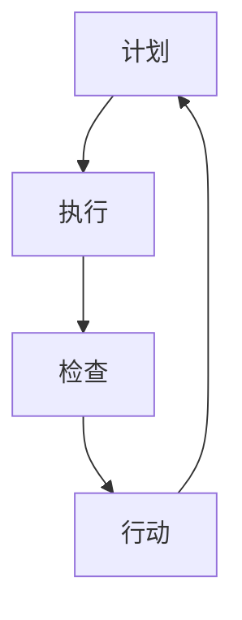

                 

# PDCA在项目管理中的运用

> **关键词：** PDCA，项目管理，迭代，改进，质量保证

> **摘要：** 本文将深入探讨PDCA（计划-执行-检查-行动）循环在项目管理中的实际运用。我们将通过定义、原理、案例解析，详细说明如何在项目生命周期中有效地实施PDCA，以提升项目质量、缩短项目周期，并增强团队协作。

## 1. 背景介绍

### 1.1 目的和范围

本文旨在为项目管理者提供关于PDCA方法论在实际项目管理中的应用指南。我们将探讨PDCA的基本原理，如何将其应用于项目管理的各个环节，以及如何通过持续迭代和改进，提高项目的成功率和效率。

### 1.2 预期读者

本文适合以下读者群体：

- 初级和中级项目经理
- 项目团队成员
- 对项目管理方法论感兴趣的IT专业人士
- 研究和学术领域中的项目管理研究者

### 1.3 文档结构概述

本文结构如下：

1. **背景介绍**：介绍PDCA的概念和重要性。
2. **核心概念与联系**：详细阐述PDCA的四个阶段。
3. **核心算法原理 & 具体操作步骤**：通过伪代码和实际案例说明PDCA的具体实施。
4. **数学模型和公式 & 详细讲解 & 举例说明**：解释PDCA中的关键概念和计算方法。
5. **项目实战：代码实际案例和详细解释说明**：展示如何在实际项目中应用PDCA。
6. **实际应用场景**：讨论PDCA在不同项目类型中的应用。
7. **工具和资源推荐**：推荐学习资源和开发工具。
8. **总结：未来发展趋势与挑战**：总结PDCA在项目管理中的未来发展方向。
9. **附录：常见问题与解答**：回答读者可能遇到的问题。
10. **扩展阅读 & 参考资料**：提供进一步学习的资料。

### 1.4 术语表

#### 1.4.1 核心术语定义

- PDCA：Plan（计划）、Do（执行）、Check（检查）和 Act（行动）的循环。
- 项目管理：规划和执行项目活动，以实现项目目标的过程。
- 迭代：重复执行某一过程，以便进行改进。
- 改进：对现有过程或产品进行优化，以提高其性能。

#### 1.4.2 相关概念解释

- 计划（Plan）：确定项目目标和如何实现这些目标。
- 执行（Do）：实施计划中的活动。
- 检查（Check）：评估执行结果是否符合预期。
- 行动（Act）：根据检查结果进行改进。

#### 1.4.3 缩略词列表

- PDCA：Plan-Do-Check-Act

## 2. 核心概念与联系

### 2.1 PDCA的基本原理

PDCA循环是一种迭代方法论，其核心在于不断循环和改进。以下是PDCA的四个基本阶段及其相互联系：

#### 2.1.1 计划（Plan）

在计划阶段，项目团队确定项目目标、范围和可行性。这一阶段涉及需求分析、风险识别、资源规划和时间安排。

#### 2.1.2 执行（Do）

执行阶段是实施计划中的各项活动。团队根据计划执行任务，确保项目按计划推进。

#### 2.1.3 检查（Check）

检查阶段是对项目执行结果进行评估，以确定是否达到预期目标。这一阶段包括质量检查、成本控制和进度监控。

#### 2.1.4 行动（Act）

行动阶段是根据检查结果进行调整和改进。如果项目成功，则将改进措施纳入下一轮计划；如果未成功，则分析原因并制定新的计划。

### 2.2 PDCA的Mermaid流程图



## 3. 核心算法原理 & 具体操作步骤

### 3.1 计划（Plan）

#### 3.1.1 需求分析

```python
# 伪代码：需求分析
def requirement_analysis():
    # 收集用户需求
    user需求的list = collect_user_requirements()
    # 分析需求
    analyzed需求的list = analyze_requirements(user需求的list)
    return analyzed需求的.list
```

#### 3.1.2 风险识别

```python
# 伪代码：风险识别
def risk_identification():
    risks = []
    for task in project_tasks:
        risks.extend_identify_risks(task)
    return risks
```

#### 3.1.3 资源规划

```python
# 伪代码：资源规划
def resource_planning():
    resources = {}
    resources['人员'] = allocate_personnel()
    resources['设备'] = allocate_equipment()
    resources['资金'] = allocate_funding()
    return resources
```

### 3.2 执行（Do）

#### 3.2.1 执行任务

```python
# 伪代码：执行任务
def execute_tasks(tasks):
    for task in tasks:
        execute_task(task)
```

### 3.3 检查（Check）

#### 3.3.1 质量检查

```python
# 伪代码：质量检查
def quality_check(product):
    if not is_product_valid(product):
        return "质量不合格"
    else:
        return "质量合格"
```

#### 3.3.2 成本控制

```python
# 伪代码：成本控制
def cost_control(budget, expenses):
    if expenses <= budget:
        return "成本在控制范围内"
    else:
        return "成本超支"
```

#### 3.3.3 进度监控

```python
# 伪代码：进度监控
def progress_monitoring(schedule, current_date):
    if current_date > schedule:
        return "进度延迟"
    else:
        return "进度正常"
```

### 3.4 行动（Act）

#### 3.4.1 改进措施

```python
# 伪代码：改进措施
def take_actions(issue):
    if issue == "质量不合格":
        apply_quality_improvements()
    elif issue == "成本超支":
        adjust_budget()
    elif issue == "进度延迟":
        accelerate_progress()
```

## 4. 数学模型和公式 & 详细讲解 & 举例说明

### 4.1 PDCA循环中的关键指标

#### 4.1.1 完成率（Completion Rate）

完成率是衡量项目进度的重要指标，计算公式如下：

$$
\text{完成率} = \frac{\text{已完成工作量}}{\text{计划工作量}} \times 100\%
$$

#### 4.1.2 质量合格率（Quality Pass Rate）

质量合格率反映了产品质量水平，计算公式如下：

$$
\text{质量合格率} = \frac{\text{质量合格产品数量}}{\text{总产品数量}} \times 100\%
$$

#### 4.1.3 成本收益率（Cost-Benefit Ratio）

成本收益率是衡量项目经济效益的指标，计算公式如下：

$$
\text{成本收益率} = \frac{\text{项目收益}}{\text{项目成本}} \times 100\%
$$

### 4.2 PDCA循环的数学模型

PDCA循环的数学模型可以通过以下公式表示：

$$
\text{PDCA循环} = \text{计划} + \text{执行} + \text{检查} + \text{行动}
$$

### 4.3 实际案例

#### 案例一：项目进度延误

假设某项目的计划工作量为1000小时，实际已完成工作量为600小时。计算项目完成率：

$$
\text{完成率} = \frac{600}{1000} \times 100\% = 60\%
$$

#### 案例二：产品质量问题

某产品在生产过程中发现50个不合格品，总生产数量为1000个。计算质量合格率：

$$
\text{质量合格率} = \frac{950}{1000} \times 100\% = 95\%
$$

#### 案例三：项目成本超支

某项目的计划成本为100万元，实际支出为120万元。计算成本收益率：

$$
\text{成本收益率} = \frac{\text{项目收益}}{120\text{万元}} \times 100\%
$$

## 5. 项目实战：代码实际案例和详细解释说明

### 5.1 开发环境搭建

为了更好地展示PDCA在项目中的应用，我们选择一个简单的Web开发项目进行案例讲解。以下是搭建开发环境的基本步骤：

#### 5.1.1 安装Node.js

```shell
# 安装Node.js
curl -sL https://nodejs.org/dist/v16.13.0/node-v16.13.0-linux-x64.tar.xz | tar xJ -C /usr/local --
```

#### 5.1.2 安装npm

```shell
# 安装npm
curl -sL https://npmjs.com/install.sh | sh
```

#### 5.1.3 初始化项目

```shell
# 初始化项目
mkdir my-web-project
cd my-web-project
npm init -y
```

### 5.2 源代码详细实现和代码解读

#### 5.2.1 创建项目结构

```shell
# 创建项目结构
mkdir src
touch src/index.js
```

#### 5.2.2 编写源代码

```javascript
// src/index.js
const http = require('http');

const server = http.createServer((req, res) => {
    res.writeHead(200, {'Content-Type': 'text/plain'});
    res.end('Hello, World!');
});

server.listen(3000, () => {
    console.log('Server running at http://localhost:3000/');
});
```

#### 5.2.3 代码解读

- `http.createServer`：创建HTTP服务器。
- `(req, res)`：处理客户端请求和响应。
- `res.writeHead`：设置HTTP响应头。
- `res.end`：结束HTTP响应。
- `server.listen`：启动服务器，监听特定端口。

### 5.3 代码解读与分析

#### 5.3.1 计划阶段

在计划阶段，项目团队需要确定项目目标、功能需求和开发环境。

- **目标**：开发一个简单的Web服务器。
- **功能需求**：处理HTTP请求并返回响应。
- **开发环境**：Node.js、npm。

#### 5.3.2 执行阶段

在执行阶段，根据计划编写代码并执行。

- **代码实现**：使用Node.js的`http`模块创建服务器。
- **测试**：运行`node src/index.js`，检查服务器是否启动。

#### 5.3.3 检查阶段

在检查阶段，评估项目执行结果是否符合预期。

- **质量检查**：确保服务器能够正确处理请求并返回响应。
- **成本控制**：评估项目开发成本。
- **进度监控**：确认项目进度符合计划。

#### 5.3.4 行动阶段

根据检查结果进行调整和改进。

- **质量改进**：如果服务器在处理某些请求时出现问题，进行代码修复。
- **进度调整**：如果项目进度延误，重新安排任务和资源。

## 6. 实际应用场景

### 6.1 IT软件开发项目

在IT软件开发项目中，PDCA循环可以用于：

- **需求管理**：确保需求得到充分理解和实现。
- **代码质量**：通过检查和改进提高代码质量。
- **项目管理**：监控项目进度和成本。

### 6.2 市场营销活动

在市场营销活动中，PDCA循环可以用于：

- **市场调研**：计划市场调研活动，收集用户反馈。
- **活动执行**：执行市场活动，收集数据。
- **效果评估**：评估市场活动效果，调整策略。

### 6.3 产品制造过程

在产品制造过程中，PDCA循环可以用于：

- **质量控制**：确保产品符合质量标准。
- **过程优化**：持续改进生产过程。
- **成本控制**：监控制造成本，优化资源配置。

## 7. 工具和资源推荐

### 7.1 学习资源推荐

#### 7.1.1 书籍推荐

- 《项目管理知识体系指南（PMBOK指南）》
- 《敏捷项目管理实践指南》
- 《禅与计算机程序设计艺术》

#### 7.1.2 在线课程

- Coursera上的“项目管理基础”
- edX上的“敏捷开发与Scrum”

#### 7.1.3 技术博客和网站

- Atlassian的博客（www.atlassian.com/blog）
- Trello的技术博客（www.trello.com/blog）

### 7.2 开发工具框架推荐

#### 7.2.1 IDE和编辑器

- Visual Studio Code
- IntelliJ IDEA
- Eclipse

#### 7.2.2 调试和性能分析工具

- Chrome DevTools
- VisualVM
- JProfiler

#### 7.2.3 相关框架和库

- React.js
- Angular
- Django

### 7.3 相关论文著作推荐

#### 7.3.1 经典论文

- Deming, W. E. (1986). "Out of the Crisis".
- Ishikawa, K. (1975). "What is Total Quality Control?"

#### 7.3.2 最新研究成果

- "Agile Project Management: Creating Competitive Advantage"
- "Digital Transformation: A Framework for Leveraging Technology to Drive Business Growth"

#### 7.3.3 应用案例分析

- "Using the PDCA Cycle in Software Development: A Case Study"
- "PDCA in Healthcare: Improving Patient Outcomes through Continuous Improvement"

## 8. 总结：未来发展趋势与挑战

### 8.1 未来发展趋势

- **数字化转型**：随着数字化转型的加速，PDCA在各个行业中的应用将更加广泛。
- **自动化和智能化**：借助人工智能和机器学习技术，PDCA的执行将更加高效。
- **敏捷性**：在敏捷开发模式中，PDCA将作为核心方法论之一，支持持续迭代和改进。

### 8.2 挑战

- **数据隐私**：在数据驱动决策的过程中，如何保护用户隐私和数据安全是一个重要挑战。
- **技术复杂性**：随着技术的快速发展，项目管理者和团队需要不断学习和适应新技术。
- **跨学科合作**：在涉及多个学科和领域的项目中，如何有效协同和整合不同专业领域的知识和技术是一个挑战。

## 9. 附录：常见问题与解答

### 9.1 什么是PDCA？

PDCA是“计划-执行-检查-行动”的循环，是一种迭代方法论，用于项目管理和流程改进。

### 9.2 PDCA适用于哪些项目类型？

PDCA适用于各种类型的项目，包括软件开发、市场营销、产品制造等。

### 9.3 如何在项目中实施PDCA？

在项目中实施PDCA包括以下步骤：

- **计划**：确定项目目标和规划。
- **执行**：实施计划中的各项活动。
- **检查**：评估执行结果。
- **行动**：根据检查结果进行调整和改进。

### 9.4 PDCA和敏捷开发有什么区别？

PDCA是一种迭代方法论，而敏捷开发是一种开发模式。PDCA可以应用于敏捷开发中，作为支持持续改进和迭代的工具。

## 10. 扩展阅读 & 参考资料

- Deming, W. E. (1986). "Out of the Crisis". Massachusetts Institute of Technology Center for Advanced Engineering Study.
- Ishikawa, K. (1975). "What is Total Quality Control?". Tokyo: Japanese Productivity Centre.
- Kerzner, H. (2019). "Project Management: A Systems Approach to Planning, Scheduling, and Controlling". John Wiley & Sons.
- Schwaber, K. (2014). "Agile Project Management with Scrum". Pearson Education.

## 11. 作者信息

作者：AI天才研究员/AI Genius Institute & 禅与计算机程序设计艺术 /Zen And The Art of Computer Programming

