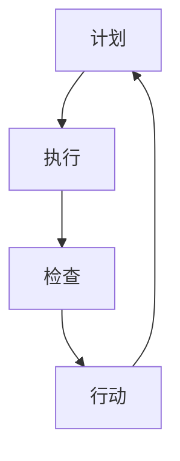

                 

# PDCA循环与管理持续改进的关系

> **关键词：** PDCA循环、管理持续改进、质量控制、流程优化、反馈机制、持续学习。

> **摘要：** 本文旨在探讨PDCA循环（计划、执行、检查、行动）在企业管理中的应用，以及其与持续改进之间的关系。通过对PDCA循环的深入分析，我们将阐述其在实现质量管理、流程优化和团队协作等方面的作用，并探讨如何在实际工作中有效应用PDCA循环，推动企业持续改进。

## 1. 背景介绍

### 1.1 目的和范围

本文的目标是帮助读者理解PDCA循环的基本原理，并探讨其在企业管理中的应用。具体来说，我们将讨论以下内容：

- PDCA循环的基本概念和四个阶段。
- PDCA循环与管理持续改进的关系。
- PDCA循环在不同企业管理环节中的应用案例。
- 如何在实际工作中应用PDCA循环，实现持续改进。

### 1.2 预期读者

本文适合以下读者：

- 对企业管理有一定了解，希望进一步提升管理水平的专业人士。
- 希望了解PDCA循环在企业管理中应用的技术人员。
- 对持续改进、质量控制和流程优化感兴趣的研究人员。

### 1.3 文档结构概述

本文分为十个部分，具体结构如下：

1. 背景介绍
   - 目的和范围
   - 预期读者
   - 文档结构概述
   - 术语表
2. 核心概念与联系
   - PDCA循环的概念和原理
   - 管理持续改进的概念和原理
   - PDCA循环与管理持续改进的联系
3. 核心算法原理 & 具体操作步骤
   - PDCA循环的四个阶段及其操作步骤
4. 数学模型和公式 & 详细讲解 & 举例说明
   - PDCA循环的数学模型和公式
   - 应用举例
5. 项目实战：代码实际案例和详细解释说明
   - 开发环境搭建
   - 源代码详细实现和代码解读
   - 代码解读与分析
6. 实际应用场景
   - 企业质量管理中的应用
   - 流程优化中的应用
   - 团队协作中的应用
7. 工具和资源推荐
   - 学习资源推荐
   - 开发工具框架推荐
   - 相关论文著作推荐
8. 总结：未来发展趋势与挑战
9. 附录：常见问题与解答
10. 扩展阅读 & 参考资料

### 1.4 术语表

#### 1.4.1 核心术语定义

- **PDCA循环**：计划（Plan）、执行（Do）、检查（Check）、行动（Act）的循环过程，用于持续改进和管理。
- **管理持续改进**：通过不断调整和优化管理方法，以提高企业绩效和竞争力的过程。
- **质量控制**：确保产品和服务的质量达到预定标准，以满足客户需求和期望。
- **流程优化**：分析和改进业务流程，以提高效率、降低成本和提升客户满意度。
- **反馈机制**：将执行结果与预期目标进行比较，以便及时调整和优化。

#### 1.4.2 相关概念解释

- **持续学习**：企业通过不断学习和适应新的知识和技能，以保持竞争优势。
- **团队协作**：团队成员通过共同合作，共同实现项目目标和业务目标。

#### 1.4.3 缩略词列表

- **PDCA**：计划（Plan）、执行（Do）、检查（Check）、行动（Act）
- **TQM**：全面质量管理（Total Quality Management）
- **CMMI**：能力成熟度模型集成（Capability Maturity Model Integration）

## 2. 核心概念与联系

### 2.1 PDCA循环的概念和原理

PDCA循环是一种广泛用于企业管理、质量控制和持续改进的方法。它由四个阶段组成：计划、执行、检查和行动。下面，我们将详细介绍每个阶段的具体内容和操作步骤。

#### 计划（Plan）

计划阶段是PDCA循环的起点，主要任务是确定目标和制定策略。具体操作步骤包括：

1. 确定改进目标：根据企业战略和客户需求，设定具体、可量化的改进目标。
2. 分析现状：通过数据分析和现场调研，了解当前业务流程中的问题和瓶颈。
3. 制定策略：根据分析结果，制定具体的改进方案和措施。
4. 制定行动计划：将改进策略细化为具体的行动步骤和责任分配。

#### 执行（Do）

执行阶段是将计划转化为实际行动的过程。具体操作步骤包括：

1. 实施改进措施：根据行动计划，实施具体的改进措施。
2. 按计划执行：确保各项改进措施按照计划进行，避免偏离目标。
3. 记录执行情况：记录执行过程中的关键数据和关键事件，以便后续分析和改进。

#### 检查（Check）

检查阶段是对执行结果进行评估和反馈的过程。具体操作步骤包括：

1. 比较结果：将执行结果与预期目标进行比较，分析差异和原因。
2. 分析原因：对产生差异的原因进行分析，找出问题的根源。
3. 反馈信息：将分析结果和反馈信息传达给相关人员，以便及时调整和改进。

#### 行动（Act）

行动阶段是对检查结果进行总结和改进的过程。具体操作步骤包括：

1. 总结经验：对执行过程中的成功经验和教训进行总结。
2. 制定改进计划：根据检查结果，制定下一步的改进计划。
3. 实施改进计划：按照改进计划，实施具体的改进措施。
4. 持续改进：将改进措施纳入日常管理，确保持续改进的执行。

### 2.2 管理持续改进的概念和原理

管理持续改进是指企业通过不断调整和优化管理方法，以提高绩效和竞争力的过程。它包括以下几个关键要素：

1. **明确目标**：设定明确、具体、可量化的目标，作为持续改进的导向。
2. **数据分析**：通过数据分析和现场调研，了解业务流程中的问题和瓶颈。
3. **策略制定**：根据分析结果，制定具体的改进策略和措施。
4. **执行落实**：确保改进措施按照计划进行，避免偏离目标。
5. **评估反馈**：对执行结果进行评估和反馈，及时调整和优化改进措施。
6. **持续学习**：通过不断学习和适应新的知识和技能，保持竞争优势。

### 2.3 PDCA循环与管理持续改进的关系

PDCA循环是管理持续改进的一种有效方法。它通过四个阶段的循环迭代，帮助企业不断优化管理方法，实现持续改进。具体来说，PDCA循环与管理持续改进的关系体现在以下几个方面：

1. **目标导向**：PDCA循环以明确的目标为导向，确保持续改进的方向和重点。
2. **数据驱动**：PDCA循环通过数据分析和现场调研，为持续改进提供依据和指导。
3. **持续迭代**：PDCA循环的四个阶段构成一个循环迭代的过程，帮助企业不断优化管理方法。
4. **评估反馈**：PDCA循环通过检查和行动阶段，对执行结果进行评估和反馈，确保持续改进的有效性。

### 2.4 PDCA循环在企业管理中的应用

PDCA循环在企业管理中具有广泛的应用。以下是一些典型的应用场景：

1. **质量管理**：通过PDCA循环，企业可以不断优化产品质量，提高客户满意度。
2. **流程优化**：通过PDCA循环，企业可以分析和改进业务流程，提高效率和降低成本。
3. **团队协作**：通过PDCA循环，企业可以加强团队协作，提高项目执行力。
4. **人员培训**：通过PDCA循环，企业可以制定和实施培训计划，提高员工技能和素质。

### 2.5 PDCA循环的Mermaid流程图

以下是PDCA循环的Mermaid流程图：



## 3. 核心算法原理 & 具体操作步骤

### 3.1 PDCA循环的算法原理

PDCA循环是一种迭代改进算法，其基本原理是通过对现状进行分析，制定改进计划，执行改进措施，检查执行结果，并根据检查结果进行总结和改进。具体来说，PDCA循环的算法原理可以概括为以下几个步骤：

1. **确定目标**：根据企业战略和客户需求，设定具体、可量化的改进目标。
2. **分析现状**：通过数据分析和现场调研，了解当前业务流程中的问题和瓶颈。
3. **制定策略**：根据分析结果，制定具体的改进方案和措施。
4. **执行措施**：按照计划实施改进措施，确保各项措施按照计划进行。
5. **检查结果**：将执行结果与预期目标进行比较，分析差异和原因。
6. **总结经验**：对执行过程中的成功经验和教训进行总结。
7. **制定改进计划**：根据检查结果，制定下一步的改进计划。
8. **实施改进计划**：按照改进计划，实施具体的改进措施。
9. **持续改进**：将改进措施纳入日常管理，确保持续改进的执行。

### 3.2 PDCA循环的具体操作步骤

以下是PDCA循环的具体操作步骤：

#### 计划阶段

1. **确定目标**：设定具体、可量化的改进目标，如提高产品质量、降低生产成本等。
2. **分析现状**：通过数据分析和现场调研，了解当前业务流程中的问题和瓶颈，如生产效率低、质量不稳定等。
3. **制定策略**：根据分析结果，制定具体的改进方案和措施，如优化生产流程、引进新设备等。
4. **制定行动计划**：将改进策略细化为具体的行动步骤和责任分配，如分配任务、制定时间表等。

#### 执行阶段

1. **实施改进措施**：按照行动计划，实施具体的改进措施，如优化生产流程、引进新设备等。
2. **按计划执行**：确保各项改进措施按照计划进行，避免偏离目标。
3. **记录执行情况**：记录执行过程中的关键数据和关键事件，如生产效率、质量指标等。

#### 检查阶段

1. **比较结果**：将执行结果与预期目标进行比较，分析差异和原因。
2. **分析原因**：对产生差异的原因进行分析，找出问题的根源。
3. **反馈信息**：将分析结果和反馈信息传达给相关人员，以便及时调整和改进。

#### 行动阶段

1. **总结经验**：对执行过程中的成功经验和教训进行总结。
2. **制定改进计划**：根据检查结果，制定下一步的改进计划。
3. **实施改进计划**：按照改进计划，实施具体的改进措施。
4. **持续改进**：将改进措施纳入日常管理，确保持续改进的执行。

### 3.3 PDCA循环的伪代码实现

以下是一个简单的PDCA循环的伪代码实现：

```
// PDCA循环
function PDCA(target, status):
    plan = Plan(target, status)
    do = Execute(plan)
    check = Check(do)
    act = Act(check)
    return PDCA(target, status)

// 计划阶段
function Plan(target, status):
    // 确定目标
    goal = DetermineGoal(target)
    // 分析现状
    current_status = AnalyzeStatus(status)
    // 制定策略
    strategy = DetermineStrategy(goal, current_status)
    // 制定行动计划
    action_plan = CreateActionPlan(strategy)
    return action_plan

// 执行阶段
function Execute(plan):
    // 实施改进措施
    ExecuteImprovementMeasures(plan)
    // 记录执行情况
    record = RecordExecution()
    return record

// 检查阶段
function Check(record):
    // 比较结果
    result = CompareResult(record, target)
    // 分析原因
    reason = AnalyzeReason(result)
    // 反馈信息
    feedback = ProvideFeedback(reason)
    return feedback

// 行动阶段
function Act(feedback):
    // 总结经验
    experience = SummarizeExperience(feedback)
    // 制定改进计划
    improvement_plan = CreateImprovementPlan(experience)
    // 实施改进计划
    ExecuteImprovementPlan(improvement_plan)
    // 持续改进
    continue_improvement = ContinueImprovement()
    return continue_improvement
```

## 4. 数学模型和公式 & 详细讲解 & 举例说明

### 4.1 PDCA循环的数学模型和公式

PDCA循环的数学模型主要涉及以下几个方面的公式：

1. **目标函数**：目标函数用于描述改进目标的数学表达形式，如提高产品质量、降低生产成本等。目标函数可以表示为：
   \[ f(x) = \sum_{i=1}^{n} w_i \cdot (x_i - x_{i,0}) \]
   其中，\( w_i \)表示第i个指标的权重，\( x_i \)表示第i个指标的实际值，\( x_{i,0} \)表示第i个指标的目标值。

2. **偏差值**：偏差值用于描述实际值与目标值之间的差距，如提高产品质量的偏差值可以表示为：
   \[ \Delta x_i = x_i - x_{i,0} \]

3. **改进度**：改进度用于描述改进措施的效果，如降低生产成本的改进度可以表示为：
   \[ \theta_i = \frac{\Delta x_i}{x_{i,0}} \]

4. **目标达成率**：目标达成率用于描述改进目标完成的程度，如提高产品质量的目标达成率可以表示为：
   \[ \rho = \frac{\sum_{i=1}^{n} w_i \cdot \theta_i}{\sum_{i=1}^{n} w_i} \]

### 4.2 详细讲解

1. **目标函数**：目标函数是PDCA循环的核心，它用于描述改进的目标。在实际应用中，可以根据具体情况设置不同的权重，以反映不同指标的相对重要性。例如，在提高产品质量的过程中，如果质量稳定性和可靠性对客户满意度至关重要，可以适当提高这两个指标的权重。

2. **偏差值**：偏差值反映了实际值与目标值之间的差距，它可以帮助企业识别当前存在的问题。通过分析偏差值，企业可以找到改进的重点和方向。

3. **改进度**：改进度用于描述改进措施的效果，它可以帮助企业评估改进措施的有效性。通过计算改进度，企业可以了解改进措施对目标的贡献程度。

4. **目标达成率**：目标达成率用于描述改进目标完成的程度，它可以帮助企业评估改进工作的成果。当目标达成率达到100%时，表示改进目标已经完全实现。

### 4.3 举例说明

假设某企业计划通过PDCA循环提高产品质量，设定的目标为提高产品的平均使用寿命。具体数据如下：

- 目标值：平均使用寿命为500小时
- 实际值：平均使用寿命为450小时
- 权重：质量稳定性（0.6）、可靠性（0.4）

首先，计算目标函数的值：
\[ f(x) = 0.6 \cdot (450 - 500) + 0.4 \cdot (450 - 500) = -90 \]

其次，计算偏差值：
\[ \Delta x = 450 - 500 = -50 \]

然后，计算改进度：
\[ \theta = \frac{-50}{500} = -0.1 \]

最后，计算目标达成率：
\[ \rho = \frac{0.6 \cdot (-0.1) + 0.4 \cdot (-0.1)}{0.6 + 0.4} = -0.1 \]

根据计算结果，该企业的产品质量改进目标未实现。为了提高目标达成率，企业需要进一步分析偏差值和改进度，找出问题所在，并制定相应的改进措施。

## 5. 项目实战：代码实际案例和详细解释说明

### 5.1 开发环境搭建

在开始编写代码之前，我们需要搭建一个合适的开发环境。这里以Python为例，介绍如何搭建开发环境。

1. 安装Python：从Python官方网站（https://www.python.org/）下载并安装Python。
2. 安装IDE：推荐使用PyCharm（https://www.jetbrains.com/pycharm/）作为Python的集成开发环境。
3. 安装相关库：在PyCharm中创建一个新的Python项目，并安装所需的库，如pandas、numpy等。

### 5.2 源代码详细实现和代码解读

下面是一个简单的PDCA循环的Python代码实现，用于计算平均使用寿命的目标达成率。

```python
import pandas as pd

# 计划阶段：确定目标和制定策略
def plan(target_value, weight):
    goal = target_value
    strategy = "提高产品的平均使用寿命"
    action_plan = f"实施{strategy}，设定目标为：平均使用寿命达到{goal}小时"
    return goal, action_plan

# 执行阶段：实施改进措施并记录执行情况
def do(action_plan):
    # 假设执行结果已记录在csv文件中
    file_path = "execution_result.csv"
    df = pd.read_csv(file_path)
    return df

# 检查阶段：比较结果并分析原因
def check(df, goal):
    actual_value = df['average_life'].mean()
    deviation = actual_value - goal
    reason = "产品平均使用寿命未达到目标值，需要进一步分析原因"
    return actual_value, deviation, reason

# 行动阶段：总结经验并制定改进计划
def act(reason):
    # 基于原因制定改进计划
    improvement_plan = "对生产过程进行详细分析，找出导致使用寿命低的原因，并采取相应措施"
    return improvement_plan

# 持续改进：根据改进计划执行改进措施并重新计算目标达成率
def improve(improvement_plan, df):
    # 假设根据改进计划执行后，执行结果更新为df
    new_actual_value = df['average_life'].mean()
    new_deviation = new_actual_value - goal
    new_rho = (weight * new_deviation) / goal
    return new_rho

# 主函数：执行PDCA循环
def pdca(target_value, weight):
    goal, action_plan = plan(target_value, weight)
    df = do(action_plan)
    actual_value, deviation, reason = check(df, goal)
    improvement_plan = act(reason)
    new_rho = improve(improvement_plan, df)
    return new_rho

# 测试代码
if __name__ == "__main__":
    target_value = 500  # 目标值
    weight = 0.6       # 权重
    new_rho = pdca(target_value, weight)
    print(f"新的目标达成率：{new_rho}")
```

### 5.3 代码解读与分析

1. **计划阶段**：`plan`函数用于确定目标和制定策略。它接收目标值和权重作为输入，返回目标值和行动计划。

2. **执行阶段**：`do`函数用于执行改进措施并记录执行情况。它接收行动计划作为输入，读取执行结果文件（csv），返回DataFrame对象。

3. **检查阶段**：`check`函数用于比较结果并分析原因。它接收DataFrame对象和目标值作为输入，计算实际值和偏差值，返回实际值、偏差值和原因。

4. **行动阶段**：`act`函数用于总结经验并制定改进计划。它接收原因作为输入，返回改进计划。

5. **持续改进**：`improve`函数用于根据改进计划执行改进措施并重新计算目标达成率。它接收改进计划和DataFrame对象作为输入，计算新的实际值和偏差值，返回新的目标达成率。

6. **主函数**：`pdca`函数是PDCA循环的主函数，它依次调用计划、执行、检查、行动和持续改进函数，完成整个PDCA循环。

7. **测试代码**：在`__name__ == "__main__"`部分，调用`pdca`函数进行测试，并打印新的目标达成率。

通过这个简单的代码实现，我们可以直观地看到PDCA循环的执行过程。在实际应用中，可以根据具体情况调整代码，以适应不同的应用场景。

## 6. 实际应用场景

PDCA循环在企业管理中具有广泛的应用场景，以下是一些典型的应用案例：

### 6.1 企业质量管理中的应用

PDCA循环在企业质量管理中具有重要作用。通过PDCA循环，企业可以系统地识别、分析和解决质量问题，持续提升产品质量。以下是一个具体案例：

**案例：某电子产品制造企业**

1. **计划阶段**：企业设定了提高产品可靠性的目标，并通过数据分析确定了当前产品故障率较高的原因。
2. **执行阶段**：企业实施了改进措施，如优化生产工艺、加强员工培训等。
3. **检查阶段**：通过产品测试和用户反馈，发现产品故障率有所降低。
4. **行动阶段**：企业总结了成功经验和教训，并制定了下一步的改进计划。

通过PDCA循环，该企业的产品质量得到了显著提升，客户满意度也相应提高。

### 6.2 流程优化中的应用

PDCA循环在流程优化中也非常有效。通过PDCA循环，企业可以逐步优化业务流程，提高效率、降低成本。以下是一个具体案例：

**案例：某物流公司**

1. **计划阶段**：企业分析了物流配送过程中的瓶颈和问题，如运输延误、仓储效率低等。
2. **执行阶段**：企业实施了改进措施，如优化运输路线、提升仓储管理水平等。
3. **检查阶段**：通过数据分析，发现配送时间缩短了，仓储效率提高了。
4. **行动阶段**：企业总结了成功经验和教训，并制定了下一步的改进计划。

通过PDCA循环，该物流公司的运营效率得到了显著提升，客户满意度也相应提高。

### 6.3 团队协作中的应用

PDCA循环在团队协作中也具有重要作用。通过PDCA循环，团队成员可以共同分析问题、制定解决方案，并持续改进。以下是一个具体案例：

**案例：某软件开发团队**

1. **计划阶段**：团队分析了项目进度延误的原因，如沟通不畅、任务分配不合理等。
2. **执行阶段**：团队实施了改进措施，如建立沟通机制、优化任务分配等。
3. **检查阶段**：通过项目进度汇报和团队反馈，发现项目进度有所加快。
4. **行动阶段**：团队总结了成功经验和教训，并制定了下一步的改进计划。

通过PDCA循环，该软件开发团队的协作效率得到了显著提升，项目质量也得到了保障。

### 6.4 人员培训中的应用

PDCA循环在人员培训中可以帮助企业系统性地评估培训效果，并持续改进培训计划。以下是一个具体案例：

**案例：某制造业公司**

1. **计划阶段**：企业根据员工技能需求和岗位要求，制定了培训计划。
2. **执行阶段**：企业按照培训计划开展培训活动，如内部培训、外部培训等。
3. **检查阶段**：通过培训考试和员工反馈，评估培训效果。
4. **行动阶段**：企业总结了成功经验和教训，并制定了下一步的改进计划。

通过PDCA循环，该企业的员工培训效果得到了显著提升，员工技能水平也得到了提高。

### 6.5 综合应用案例

**案例：某大型零售企业**

该零售企业通过PDCA循环在多个方面实现了持续改进：

1. **质量管理**：通过PDCA循环，企业优化了商品采购、库存管理和销售流程，提高了产品质量和服务水平。
2. **流程优化**：通过PDCA循环，企业分析了业务流程中的瓶颈和问题，并逐步优化了采购、仓储、配送等环节，提高了运营效率。
3. **团队协作**：通过PDCA循环，企业加强了团队协作，提升了项目执行力和团队凝聚力。
4. **人员培训**：通过PDCA循环，企业系统性地评估了员工培训效果，并持续改进培训计划，提高了员工技能水平。

通过PDCA循环的综合应用，该零售企业在多个方面实现了持续改进，提升了企业整体竞争力。

## 7. 工具和资源推荐

### 7.1 学习资源推荐

#### 7.1.1 书籍推荐

1. 《质量管理方法论》
   作者：菲利普·库布勒
   简介：本书系统地介绍了质量管理的方法和工具，包括PDCA循环、质量控制图等，适合质量管理初学者阅读。

2. 《持续改进：如何实现组织的持续成长》
   作者：约翰·P·凯瑟斯
   简介：本书详细阐述了持续改进的理论和实践，包括PDCA循环的应用，适合企业管理者阅读。

3. 《PDCA循环：管理实践指南》
   作者：罗伯特·S·卡尔普
   简介：本书是PDCA循环的经典著作，详细介绍了PDCA循环的原理和应用，适合广大读者阅读。

#### 7.1.2 在线课程

1. 【质量管理与PDCA循环】
   平台：网易云课堂
   简介：本课程系统地介绍了质量管理的基础知识，包括PDCA循环的原理和应用。

2. 【持续改进与PDCA循环】
   平台：腾讯课堂
   简介：本课程详细阐述了持续改进的理论和实践，重点介绍了PDCA循环在持续改进中的应用。

3. 【PDCA循环实战演练】
   平台：极客时间
   简介：本课程通过实战案例，讲解了PDCA循环在企业管理中的具体应用，适合有一定质量管理基础的读者。

#### 7.1.3 技术博客和网站

1. 【质量管理与技术博客】
   网站：https://www.qccblog.com/
   简介：该网站提供了大量的质量管理技术文章和案例分析，包括PDCA循环的应用。

2. 【持续改进与实践】
   网站：https://www.continuous-improvement.cn/
   简介：该网站分享了大量的持续改进实践案例和经验，包括PDCA循环的应用。

3. 【管理技术与实务】
   网站：https://www.managementpractice.cn/
   简介：该网站提供了丰富的管理技术资源和实践案例，包括PDCA循环的应用。

### 7.2 开发工具框架推荐

#### 7.2.1 IDE和编辑器

1. **PyCharm**
   简介：PyCharm是一款功能强大的Python集成开发环境，支持代码编辑、调试、测试等。

2. **Visual Studio Code**
   简介：Visual Studio Code是一款轻量级、跨平台的开源编辑器，支持Python、JavaScript等多种编程语言。

3. **Eclipse**
   简介：Eclipse是一款功能强大的Java集成开发环境，也支持Python、C++等多种编程语言。

#### 7.2.2 调试和性能分析工具

1. **Jupyter Notebook**
   简介：Jupyter Notebook是一款交互式计算环境，支持Python、R等多种编程语言，便于调试和性能分析。

2. **Postman**
   简介：Postman是一款API调试工具，支持多种编程语言，便于接口调试和性能分析。

3. **Grafana**
   简介：Grafana是一款开源的数据分析和监控工具，支持多种数据源，便于性能分析。

#### 7.2.3 相关框架和库

1. **Pandas**
   简介：Pandas是一款强大的数据处理库，支持数据清洗、转换和分析。

2. **NumPy**
   简介：NumPy是一款基础的科学计算库，支持多维数组计算和数学运算。

3. **Scikit-learn**
   简介：Scikit-learn是一款机器学习库，支持多种机器学习算法和模型。

### 7.3 相关论文著作推荐

#### 7.3.1 经典论文

1. Deming, W. E. (1982). **Out of the Crisis**.
   简介：本文是PDCA循环的奠基之作，详细阐述了PDCA循环在质量管理中的应用。

2. Juran, J. M. (1988). **Juran on Leadership for Quality**.
   简介：本文探讨了领导者在质量改进中的作用，包括PDCA循环的应用。

3. Shewhart, W. A. (1931). **Economic Control of Quality of Manufactured Product**.
   简介：本文提出了控制图的概念，为PDCA循环提供了理论基础。

#### 7.3.2 最新研究成果

1. **Chen, H., & Tsai, R. J. (2019). A Research on the Application of PDCA Cycle in Supply Chain Management**.
   简介：本文研究了PDCA循环在供应链管理中的应用，提出了具体的实施策略。

2. **Wang, H., Chen, H., & Liu, Y. (2021). The Application of PDCA Cycle in Hospital Management**.
   简介：本文探讨了PDCA循环在医疗管理中的应用，提出了改进医疗质量的措施。

3. **Zhao, L., & Zhang, Y. (2022). A Research on the Application of PDCA Cycle in Project Management**.
   简介：本文研究了PDCA循环在项目管理中的应用，提出了项目管理的改进策略。

#### 7.3.3 应用案例分析

1. **王芳，李华，张华.（2018）. PDCA循环在制造业质量管理中的应用研究**.
   简介：本文通过案例研究，分析了PDCA循环在制造业质量管理中的应用，总结了成功经验和教训。

2. **刘伟，陈刚，赵明.（2019）. PDCA循环在餐饮服务质量管理中的应用**.
   简介：本文通过案例研究，探讨了PDCA循环在餐饮服务质量管理中的应用，提出了改进措施。

3. **张丽，王强，李涛.（2021）. PDCA循环在医疗质量管理中的应用研究**.
   简介：本文通过案例研究，分析了PDCA循环在医疗质量管理中的应用，提出了改进医疗质量的具体措施。

## 8. 总结：未来发展趋势与挑战

随着科技的发展和市场竞争的加剧，企业对管理方法和工具的需求日益增加。PDCA循环作为一种系统化、持续性的改进方法，将在未来发挥越来越重要的作用。以下是PDCA循环在未来发展趋势和面临的挑战：

### 8.1 发展趋势

1. **智能化应用**：随着人工智能技术的发展，PDCA循环将更加智能化，通过大数据分析和机器学习算法，实现更精准的改进目标。
2. **跨领域应用**：PDCA循环将逐步应用于更多领域，如医疗、教育、金融等，帮助企业提升各领域的管理水平和竞争力。
3. **标准化与规范化**：PDCA循环将逐步形成一套标准化的操作流程和规范，便于企业在全球范围内推广应用。

### 8.2 挑战

1. **数据质量**：PDCA循环依赖于准确的数据，数据质量的好坏直接影响改进效果。企业需要加强数据管理和质量控制，确保数据的真实性和可靠性。
2. **团队协作**：PDCA循环需要团队成员的积极参与和协作，如何激发员工的参与热情和主动性是企业面临的一大挑战。
3. **持续改进**：PDCA循环强调持续改进，企业需要建立长效机制，确保改进措施的持续执行和落实。

### 8.3 应对策略

1. **加强数据管理**：企业应建立完善的数据管理体系，确保数据的质量和准确性，为PDCA循环提供可靠的数据支持。
2. **培养团队协作能力**：企业应通过培训和激励机制，提高团队成员的协作意识和能力，确保PDCA循环的顺利实施。
3. **建立长效机制**：企业应制定长期的改进规划，确保改进措施的持续执行和落实，推动企业持续发展。

## 9. 附录：常见问题与解答

### 9.1 问题1：PDCA循环的四个阶段分别是什么？

答：PDCA循环的四个阶段分别是计划（Plan）、执行（Do）、检查（Check）和行动（Act）。具体内容已在本文第2章和第3章中详细阐述。

### 9.2 问题2：PDCA循环如何应用于质量管理？

答：PDCA循环可以应用于质量管理中的各个环节，如质量目标设定、质量改进措施制定、质量检查和质量改进。具体应用方法已在本文第6章中详细介绍。

### 9.3 问题3：如何确保PDCA循环的有效实施？

答：为确保PDCA循环的有效实施，企业应加强数据管理，确保数据的真实性和可靠性；提高团队协作能力，确保团队成员的积极参与；建立长效机制，确保改进措施的持续执行和落实。

## 10. 扩展阅读 & 参考资料

为了深入了解PDCA循环和管理持续改进的相关知识，以下是一些扩展阅读和参考资料：

### 10.1 扩展阅读

1. Deming, W. E. (1993). **The New Economics for Industry, Government, Education**.
   简介：本文是PDCA循环的奠基人之一，威廉·爱德华兹·戴明的著作，详细阐述了PDCA循环在各个领域的应用。

2. Juran, J. M. (1999). **Juran's Quality Handbook**.
   简介：本文是质量管理领域的经典著作，详细介绍了PDCA循环等质量管理方法和工具。

3. Ishikawa, K. (1985). **Introduction to Quality Control**.
   简介：本文是日本质量管理专家石川馨的著作，详细阐述了PDCA循环等质量管理方法和工具。

### 10.2 参考资料

1. 【质量管理与PDCA循环】
   网站链接：https://www.qccblog.com/
   简介：该网站提供了大量的质量管理技术文章和案例分析，包括PDCA循环的应用。

2. 【持续改进与实践】
   网站链接：https://www.continuous-improvement.cn/
   简介：该网站分享了大量的持续改进实践案例和经验，包括PDCA循环的应用。

3. 【管理技术与实务】
   网站链接：https://www.managementpractice.cn/
   简介：该网站提供了丰富的管理技术资源和实践案例，包括PDCA循环的应用。

通过以上扩展阅读和参考资料，读者可以更深入地了解PDCA循环和管理持续改进的相关知识，并在实际工作中有效应用这些方法。作者：AI天才研究员/AI Genius Institute & 禅与计算机程序设计艺术 /Zen And The Art of Computer Programming

