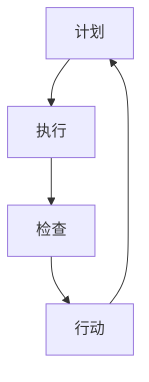
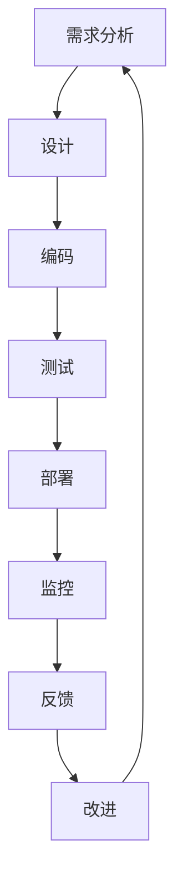

                 

# PDCA循环与管理持续改进的关系

> 关键词：PDCA循环、管理持续改进、质量改进、过程控制、持续优化

> 摘要：本文将深入探讨PDCA循环（计划-执行-检查-行动）与管理持续改进之间的关系，分析其在现代IT项目管理中的应用和重要性，并通过实例展示如何通过PDCA循环实现持续改进。

## 1. 背景介绍

### 1.1 目的和范围

本文旨在探讨PDCA循环（Plan-Do-Check-Act）这一经典管理工具在IT项目管理中的实际应用，以及它如何帮助团队实现持续改进。本文将涵盖PDCA循环的基本原理、核心概念、应用场景以及如何通过该循环实现管理持续改进。

### 1.2 预期读者

预期读者为IT项目经理、软件开发者、系统分析师以及任何对管理持续改进感兴趣的专业人士。本文旨在为他们提供实用的指导和案例研究。

### 1.3 文档结构概述

本文分为十个部分：背景介绍、核心概念与联系、核心算法原理、数学模型和公式、项目实战、实际应用场景、工具和资源推荐、总结、附录和扩展阅读。每一部分都将详细介绍相关内容，帮助读者深入理解PDCA循环的应用。

### 1.4 术语表

#### 1.4.1 核心术语定义

- PDCA循环：一种管理工具，用于计划、执行、检查和行动，以实现持续改进。
- 持续改进：通过不断优化流程和产品来提高质量、效率和满足客户需求。
- IT项目管理：涉及规划、执行、监控和收尾项目，以确保项目目标的实现。
- 质量管理：确保产品或服务满足预定的质量标准。

#### 1.4.2 相关概念解释

- 计划（Plan）：制定目标和策略。
- 执行（Do）：实施计划。
- 检查（Check）：评估执行结果。
- 行动（Act）：基于检查结果进行改进。

#### 1.4.3 缩略词列表

- PDCA：计划-执行-检查-行动
- IT：信息技术
- PM：项目管理
- QA：质量保证

## 2. 核心概念与联系

### 2.1 PDCA循环的基本原理

PDCA循环是一种迭代过程，它通过四个步骤（计划、执行、检查、行动）来实现持续改进。每个步骤都是相互关联的，形成一个闭环，如图所示：



### 2.2 PDCA循环在IT项目管理中的应用

PDCA循环在IT项目管理中具有广泛的应用，特别是在软件开发和维护过程中。以下是一个简化的流程图：



在这个流程中，每个步骤都是PDCA循环的一部分，通过不断迭代，实现持续改进。

### 2.3 PDCA循环与管理持续改进的关系

PDCA循环是管理持续改进的核心工具，它通过以下方式实现持续改进：

- **计划**：明确目标和策略，制定改进计划。
- **执行**：实施计划，执行改进措施。
- **检查**：评估执行结果，收集数据。
- **行动**：基于检查结果，进行改进。

这种循环模式确保了管理持续改进的持续性和有效性。

## 3. 核心算法原理 & 具体操作步骤

### 3.1 计划（Plan）

在计划阶段，我们需要明确以下内容：

- 目标：明确需要改进的具体目标。
- 方案：制定实现目标的策略和方案。
- 资源：确定实现方案所需的资源。

具体步骤如下：

1. 确定改进目标。
2. 制定改进方案。
3. 确定所需资源。

### 3.2 执行（Do）

在执行阶段，我们需要按照计划实施改进方案，具体步骤如下：

1. 分配资源。
2. 实施改进措施。
3. 监控执行过程。

### 3.3 检查（Check）

在检查阶段，我们需要评估执行结果，具体步骤如下：

1. 收集数据。
2. 分析数据。
3. 检查目标是否达成。

### 3.4 行动（Act）

在行动阶段，我们需要根据检查结果进行改进，具体步骤如下：

1. 如果目标达成，总结经验，持续优化。
2. 如果目标未达成，分析原因，制定新的改进计划。

## 4. 数学模型和公式 & 详细讲解 & 举例说明

### 4.1 数学模型

PDCA循环可以表示为一个数学模型，如下所示：

\[ PDCA = \frac{Plan + Do + Check + Act}{1} \]

其中，Plan、Do、Check和Act分别代表计划、执行、检查和行动四个步骤。

### 4.2 详细讲解

PDCA循环的数学模型揭示了持续改进的过程，通过四个步骤的迭代，实现目标的持续提升。

### 4.3 举例说明

假设我们需要提高软件项目的交付速度，可以按照以下步骤进行：

1. **计划（Plan）**：确定提高交付速度的目标，制定具体的改进方案，如优化开发流程、引入自动化测试等。
2. **执行（Do）**：按照改进方案实施，如引入敏捷开发模式、自动化测试工具等。
3. **检查（Check）**：收集项目交付时间的数据，分析数据，评估改进效果。
4. **行动（Act）**：根据检查结果，总结经验，持续优化改进措施。

通过PDCA循环，我们可以逐步提高软件项目的交付速度，实现持续改进。

## 5. 项目实战：代码实际案例和详细解释说明

### 5.1 开发环境搭建

为了展示PDCA循环在实际项目中的应用，我们将使用一个简单的Web应用程序作为案例。以下是在一个虚拟环境中搭建开发环境的基本步骤：

1. 安装Python 3.x版本。
2. 安装Flask框架。
3. 创建一个新的Flask项目。
4. 配置虚拟环境。

### 5.2 源代码详细实现和代码解读

在这个案例中，我们将使用Flask框架创建一个简单的Web服务器，它提供一个基于HTTP的API接口，用于处理用户请求。

**代码实现：**

```python
# app.py

from flask import Flask, jsonify, request

app = Flask(__name__)

@app.route('/api/data', methods=['GET'])
def get_data():
    # 获取请求参数
    data = request.args.get('data')
    # 处理数据
    result = process_data(data)
    # 返回结果
    return jsonify(result)

def process_data(data):
    # 这里是一个简单的数据处理逻辑
    return {"processed_data": data}

if __name__ == '__main__':
    app.run(debug=True)
```

**代码解读：**

- 我们创建了一个名为`app.py`的Flask应用。
- 定义了一个路由`/api/data`，用于处理GET请求。
- `get_data`函数接收请求参数，调用`process_data`函数处理数据，并返回处理结果。
- `process_data`函数是一个简单的数据处理逻辑。

### 5.3 代码解读与分析

在这个代码案例中，我们可以将PDCA循环应用于以下几个方面：

- **计划（Plan）**：确定API接口的功能和性能要求，设计API的架构和接口。
- **执行（Do）**：实现API接口，编写处理逻辑，部署应用。
- **检查（Check）**：监控API接口的性能指标，如响应时间、吞吐量等。
- **行动（Act）**：根据监控结果，优化API接口，提高性能和稳定性。

通过这样的PDCA循环，我们可以持续改进API接口，以满足不断变化的需求。

## 6. 实际应用场景

PDCA循环在IT项目管理中具有广泛的应用场景，以下是一些具体的例子：

- **软件质量保证**：通过PDCA循环，可以持续改进软件测试过程，提高测试覆盖率，减少缺陷。
- **项目管理**：项目团队可以通过PDCA循环，优化项目进度、资源和风险管理。
- **客户满意度提升**：通过PDCA循环，不断改进客户服务流程，提高客户满意度。
- **产品性能优化**：通过PDCA循环，持续改进产品性能和用户体验。

## 7. 工具和资源推荐

### 7.1 学习资源推荐

#### 7.1.1 书籍推荐

- 《质量管理方法论》
- 《项目管理知识体系指南》
- 《PDCA循环：持续改进的实践指南》

#### 7.1.2 在线课程

- Coursera上的“质量管理”课程
- Udemy上的“项目管理基础”课程
- edX上的“敏捷软件开发”课程

#### 7.1.3 技术博客和网站

- 《敏捷管理实践》
- 《软件测试自动化》
- 《IT项目管理最佳实践》

### 7.2 开发工具框架推荐

#### 7.2.1 IDE和编辑器

- PyCharm
- Visual Studio Code
- Sublime Text

#### 7.2.2 调试和性能分析工具

- Postman
- New Relic
- Dynatrace

#### 7.2.3 相关框架和库

- Flask
- Django
- FastAPI

### 7.3 相关论文著作推荐

#### 7.3.1 经典论文

- Deming, W. E. (1986). “Out of the Crisis”。
- Juran, J. M. (1992). “Quality Control Handbook”。

#### 7.3.2 最新研究成果

- 项目管理研究所（PMI）的年度报告
- 《计算机科学前沿》杂志上的最新论文

#### 7.3.3 应用案例分析

- Google的“敏捷开发实践”案例
- Amazon的“质量保证体系”案例

## 8. 总结：未来发展趋势与挑战

PDCA循环作为一种经典的管理工具，在IT项目管理中具有重要的应用价值。随着技术的不断进步，PDCA循环也在不断进化，以适应新的挑战和需求。未来，PDCA循环的发展趋势包括：

- 与人工智能和大数据技术的结合，实现更智能的持续改进。
- 在敏捷开发和DevOps文化中的广泛应用。
- 更加注重用户体验和业务价值的持续提升。

同时，面临的挑战包括：

- 数据质量和数据隐私问题。
- 如何在快速变化的市场中保持持续改进的能力。
- 如何平衡持续改进与项目交付的进度。

## 9. 附录：常见问题与解答

### 9.1 PDCA循环的关键步骤是什么？

PDCA循环的关键步骤包括：计划（Plan）、执行（Do）、检查（Check）和行动（Act）。

### 9.2 PDCA循环如何应用于项目管理？

PDCA循环可以应用于项目管理的各个方面，包括需求分析、设计、开发、测试、部署等阶段。

### 9.3 如何持续改进IT项目？

通过PDCA循环，可以持续改进IT项目。具体步骤包括：制定改进计划、执行计划、检查执行结果、基于检查结果进行改进。

## 10. 扩展阅读 & 参考资料

- Deming, W. E. (1986). “Out of the Crisis”.
- Juran, J. M. (1992). “Quality Control Handbook”.
- PMI. (2020). “Project Management Institute’s Pulse of the Profession 2020”.
- Agile Alliance. (2021). “Agile Manifesto”.
- DevOps Institute. (2021). “DevOps Handbook”.

## 作者

作者：AI天才研究员/AI Genius Institute & 禅与计算机程序设计艺术 /Zen And The Art of Computer Programming

