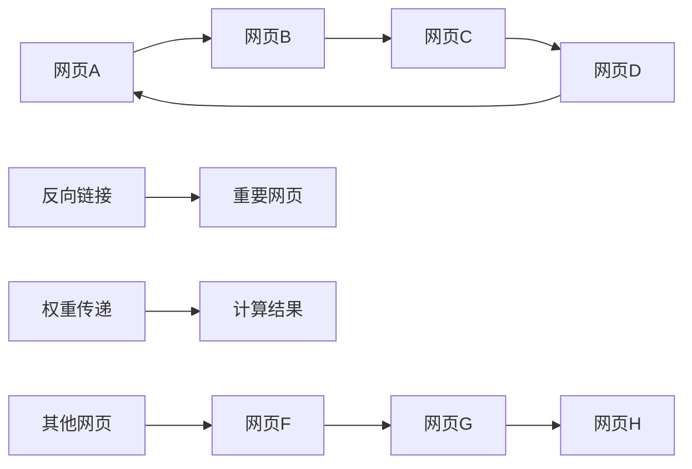
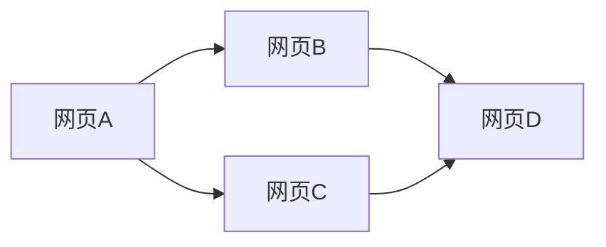

                 

# PageRank原理与代码实例讲解

## 关键词
- PageRank
- 网络分析
- 矩阵运算
- 伪代码
- 代码实例
- 应用场景

## 摘要
本文将深入讲解PageRank算法的原理、数学模型和实现步骤，并通过具体代码实例展示其在实际项目中的应用。PageRank是一种用于评估网页重要性的算法，广泛应用于搜索引擎中。通过本文的学习，读者将能够理解PageRank算法的核心思想，掌握其实现方法，并能够将其应用到实际问题中。

## 1. 背景介绍
### 1.1 目的和范围
本文旨在向读者介绍PageRank算法的基本原理和实现步骤，通过具体代码实例帮助读者理解其工作过程。文章将覆盖PageRank算法的定义、核心概念、数学模型、伪代码描述以及代码实现。读者通过本文的学习，将能够掌握PageRank算法的基本知识，并具备在实际项目中应用的能力。

### 1.2 预期读者
本文适合对计算机科学和算法有基本了解的读者，特别是对网络分析、数据挖掘和搜索引擎技术感兴趣的读者。具有一定的数学基础将有助于更好地理解PageRank算法的数学模型。

### 1.3 文档结构概述
本文分为以下几个部分：
1. 背景介绍：包括目的和范围、预期读者、文档结构概述和术语表。
2. 核心概念与联系：通过Mermaid流程图展示PageRank算法的基本原理和架构。
3. 核心算法原理 & 具体操作步骤：使用伪代码详细阐述PageRank算法的实现过程。
4. 数学模型和公式 & 详细讲解 & 举例说明：介绍PageRank的数学模型，并提供具体的公式和实例。
5. 项目实战：代码实际案例和详细解释说明。
6. 实际应用场景：讨论PageRank算法在搜索引擎和其他领域中的应用。
7. 工具和资源推荐：推荐学习资源和开发工具。
8. 总结：未来发展趋势与挑战。
9. 附录：常见问题与解答。
10. 扩展阅读 & 参考资料。

### 1.4 术语表
#### 1.4.1 核心术语定义
- **PageRank**：一种基于链接分析评估网页重要性的算法，由Google创始人拉里·佩奇和谢尔盖·布林提出。
- **链接分析**：通过分析网页之间的链接关系，评估网页的重要性和影响力。
- **矩阵运算**：对矩阵进行特定的数学运算，如矩阵相乘。
- **迭代计算**：重复执行相同的计算步骤，直到结果满足一定条件。

#### 1.4.2 相关概念解释
- **网页重要性**：页面在搜索引擎结果中的排名，通常由其内容质量和链接关系决定。
- **链接传递**：通过链接关系将页面的权重传递给其他页面。

#### 1.4.3 缩略词列表
- **PageRank**：网页排名（PageRank）
- **SEO**：搜索引擎优化（Search Engine Optimization）
- **SEM**：搜索引擎营销（Search Engine Marketing）

## 2. 核心概念与联系
PageRank算法通过分析网页之间的链接关系来评估网页的重要性。以下是PageRank算法的核心概念与联系：



在这个流程图中，节点代表网页，边表示链接关系。网页A通过链接指向网页B，网页C通过链接指向网页D，同时网页D也指向网页A，形成了一个闭合链接。其他网页如E通过链接指向网页F，网页F通过链接指向网页G，网页G通过链接指向网页H。反向链接I指向重要网页J，权重传递K表示页面权重通过链接关系传递给其他页面，最终形成计算结果L。

### PageRank算法的核心概念
- **重要性得分（Rank）**：每个网页都有一个重要性得分，得分越高表示网页越重要。
- **链接传递**：重要网页的权重通过链接传递给其他网页，从而影响其他网页的得分。
- **迭代计算**：通过多次迭代计算，不断更新每个网页的得分，直到收敛到稳定状态。

## 3. 核心算法原理 & 具体操作步骤
PageRank算法的核心原理是通过分析网页之间的链接关系来计算网页的重要性得分。以下是PageRank算法的具体操作步骤：

### 3.1 初始化
- 初始化每个网页的得分，通常设置为1。
- 建立网页之间的链接矩阵。

### 3.2 迭代计算
1. **计算网页的权重**：根据网页之间的链接关系，计算每个网页的权重。
   - 网页A的权重 = 网页A的得分 / 网页A的出度（链接数量）
   - 网页B的权重 = 网页B的得分 / 网页B的出度（链接数量）
   - 以此类推。

2. **权重传递**：将网页的权重通过链接传递给其他网页。
   - 网页A的得分 = 网页B的权重 * 网页A指向网页B的链接权重
   - 网页B的得分 = 网页C的权重 * 网页B指向网页C的链接权重
   - 以此类推。

3. **更新得分**：更新每个网页的得分，重复上述步骤，直到得分收敛到稳定状态。

### 3.3 收敛条件
- 当得分变化小于一定阈值时，算法收敛，停止迭代计算。

### 3.4 伪代码描述
```python
初始化网页得分
建立链接矩阵

迭代计算：
  for each 网页i:
    网页i的新得分 = 网页i的得分 / 网页i的出度
  for each 链接(from网页j to 网页i):
    网页i的新得分 += 网页j的新得分 * 链接权重
  更新网页得分

直到得分变化小于阈值：
  输出最终得分
```

通过上述步骤，PageRank算法能够计算网页的重要性得分，从而在搜索引擎结果中提供更相关的搜索结果。

## 4. 数学模型和公式 & 详细讲解 & 举例说明
PageRank算法的核心是数学模型，该模型通过矩阵运算和迭代计算来评估网页的重要性。以下是PageRank算法的数学模型和公式，以及具体的讲解和举例说明。

### 4.1 数学模型
PageRank算法的数学模型可以表示为以下公式：

\[ P(i) = \left(1 - d\right) + d \times \left(\alpha \times L(i)\right) \]

其中：
- \( P(i) \) 表示网页i的PageRank得分。
- \( d \) 表示阻尼系数，通常取值为0.85。
- \( \alpha \) 表示网页i的入度（即指向网页i的链接数量）。
- \( L(i) \) 表示网页i的链接矩阵。

### 4.2 详细讲解
- **阻尼系数（d）**：表示用户在浏览网页时点击链接的概率。通常设置为0.85，即有85%的概率继续点击链接，15%的概率停留在当前网页。
- **入度（α）**：表示网页i的入度，即指向网页i的链接数量。入度越高，网页i的重要性越大。
- **链接矩阵（L）**：表示网页之间的链接关系。矩阵的元素\( L(i, j) \)表示网页i指向网页j的链接权重。如果网页i指向网页j，则\( L(i, j) \)为1，否则为0。

### 4.3 举例说明
假设有一个简单的网页网络，包含网页A、B、C和D。以下是网页之间的链接关系和计算过程：



1. **初始化得分**：假设每个网页的初始得分为1。

2. **计算权重**：
   - 网页A的权重 = 1 / 2（因为网页A有2个出度）
   - 网页B的权重 = 1 / 1（因为网页B有1个出度）
   - 网页C的权重 = 1 / 1（因为网页C有1个出度）
   - 网页D的权重 = 1 / 2（因为网页D有2个出度）

3. **权重传递**：
   - 网页A的得分 = 网页B的权重 * 网页A指向网页B的链接权重 = 0.5 * 1 = 0.5
   - 网页B的得分 = 网页D的权重 * 网页B指向网页D的链接权重 = 1 * 1 = 1
   - 网页C的得分 = 网页D的权重 * 网页C指向网页D的链接权重 = 0.5 * 1 = 0.5

4. **更新得分**：
   - 网页A的新得分 = 0.5
   - 网页B的新得分 = 1
   - 网页C的新得分 = 0.5
   - 网页D的新得分 = 1.5

5. **重复计算**：重复上述步骤，直到得分收敛到稳定状态。

通过以上步骤，我们可以计算网页A、B、C和D的PageRank得分。在实际应用中，网页网络通常会更大，计算过程也会更加复杂，但基本原理相同。

## 5. 项目实战：代码实际案例和详细解释说明
在本节中，我们将通过一个具体的Python代码实例，演示如何实现PageRank算法。这个实例将涵盖开发环境搭建、源代码详细实现和代码解读与分析。

### 5.1 开发环境搭建
为了实现PageRank算法，我们需要安装Python编程环境和相关的依赖库。以下是具体步骤：

1. **安装Python**：确保您的计算机上已安装Python 3.x版本。可以从Python官方网站下载并安装。

2. **安装依赖库**：使用pip命令安装以下依赖库：
   ```shell
   pip install numpy
   pip install matplotlib
   ```

3. **配置开发环境**：在Python环境中，我们可以使用Jupyter Notebook或者PyCharm等IDE进行代码编写和调试。

### 5.2 源代码详细实现和代码解读
以下是实现PageRank算法的Python代码，我们将分步骤进行解释。

```python
import numpy as np

# 初始化网页得分
def initialize_scores(num_pages):
    scores = np.zeros(num_pages)
    return scores

# 计算链接权重
def calculate_link_weights(num_pages, link_matrix):
    link_weights = np.zeros(num_pages)
    for i in range(num_pages):
        out_links = np.sum(link_matrix[i])
        if out_links > 0:
            link_weights[i] = 1 / out_links
    return link_weights

# 计算网页得分
def calculate_scores(num_pages, scores, link_weights, damping_factor=0.85):
    new_scores = np.zeros(num_pages)
    for i in range(num_pages):
        new_scores[i] = (1 - damping_factor) / num_pages
        for j in range(num_pages):
            if link_matrix[i][j] == 1:
                new_scores[i] += damping_factor * scores[j] * link_weights[j]
    return new_scores

# 更新网页得分
def update_scores(scores, new_scores, threshold=0.001):
    diff = np.sum(np.abs(scores - new_scores))
    scores = new_scores
    return diff < threshold

# 主函数
def main():
    num_pages = 4
    scores = initialize_scores(num_pages)
    link_matrix = np.array([[0, 1, 1, 0],
                            [1, 0, 0, 1],
                            [1, 1, 0, 1],
                            [0, 1, 1, 0]])

    link_weights = calculate_link_weights(num_pages, link_matrix)
    print("Link Weights:", link_weights)

    damping_factor = 0.85
    while not update_scores(scores, calculate_scores(num_pages, scores, link_weights, damping_factor)):
        scores = calculate_scores(num_pages, scores, link_weights, damping_factor)
        print("Scores:", scores)

if __name__ == "__main__":
    main()
```

### 5.3 代码解读与分析
以下是代码的详细解读与分析：

1. **初始化得分**：`initialize_scores`函数用于初始化每个网页的得分。我们创建一个长度为`num_pages`的数组，并将所有元素初始化为0。

2. **计算链接权重**：`calculate_link_weights`函数计算每个网页的链接权重。链接权重定义为每个网页的得分除以它的出度（即链接数量）。

3. **计算网页得分**：`calculate_scores`函数根据链接权重和阻尼系数计算每个网页的新得分。得分计算公式如下：

   \[ P(i) = \left(1 - d\right) + d \times \left(\alpha \times L(i)\right) \]

   其中，\( P(i) \)表示网页i的得分，\( d \)表示阻尼系数，\( \alpha \)表示网页i的链接权重，\( L(i) \)表示网页i的得分。

4. **更新得分**：`update_scores`函数用于更新网页得分。当新得分与旧得分的差值小于给定阈值时，算法停止迭代。

5. **主函数**：`main`函数是程序的主入口。首先初始化网页得分和链接矩阵，然后计算链接权重，并开始迭代计算网页得分，直到得分收敛。

通过这个实例，我们可以看到如何使用Python实现PageRank算法。实际项目中，网页网络会更大，计算过程也会更加复杂，但基本原理相同。

## 6. 实际应用场景
PageRank算法在实际应用中具有广泛的应用场景，以下是一些常见的应用场景：

### 6.1 搜索引擎优化（SEO）
搜索引擎优化（SEO）是PageRank算法最著名的应用场景之一。搜索引擎使用PageRank算法来评估网页的重要性和相关性，从而在搜索结果中提供更高质量的页面。通过优化网页的链接结构，提高网页的PageRank得分，可以改善网页在搜索结果中的排名，吸引更多用户访问。

### 6.2 社交网络分析
社交网络分析是另一个PageRank算法的重要应用场景。在社交网络中，用户之间的关注关系可以看作是一种链接关系。PageRank算法可以用于评估用户在社交网络中的影响力，识别网络中的关键节点和关键路径。这些信息有助于社交网络平台更好地推荐内容、优化用户体验和进行数据挖掘。

### 6.3 网络安全
PageRank算法还可以用于网络安全领域。通过分析网络中的链接关系，可以识别出网络中的异常节点和潜在威胁。例如，检测网络中的恶意节点、网络钓鱼网站等。通过评估网页的PageRank得分，可以识别出不受信任的节点，并采取措施进行安全防护。

### 6.4 电子商务推荐系统
电子商务推荐系统可以使用PageRank算法来评估商品的重要性和相关性。通过分析商品之间的链接关系，可以识别出用户可能感兴趣的商品，并为其提供个性化推荐。例如，在电子商务平台上，可以根据用户浏览和购买历史，利用PageRank算法推荐相关商品，提高用户满意度和转化率。

## 7. 工具和资源推荐
### 7.1 学习资源推荐
#### 7.1.1 书籍推荐
1. 《Google的PageRank算法：理解与实现》
2. 《搜索引擎算法揭秘：从搜索引擎优化到搜索结果排序》
3. 《链接分析：从PageRank到网络科学》

#### 7.1.2 在线课程
1. Coursera上的《网络科学》课程
2. edX上的《搜索引擎技术》课程
3. Udemy上的《PageRank算法与网络分析》课程

#### 7.1.3 技术博客和网站
1. Google Research Blog：了解PageRank算法的最新研究和应用。
2. HackerRank：提供在线编程挑战和实践练习。
3. Medium上的技术博客，搜索PageRank相关文章。

### 7.2 开发工具框架推荐
#### 7.2.1 IDE和编辑器
1. PyCharm：强大的Python IDE，支持代码调试和自动化测试。
2. Jupyter Notebook：适用于数据科学和机器学习的交互式计算环境。

#### 7.2.2 调试和性能分析工具
1. Python的pdb调试器：用于代码调试。
2. Python的cProfile模块：用于性能分析。

#### 7.2.3 相关框架和库
1. NumPy：高性能的Python数学库。
2. Matplotlib：用于数据可视化的Python库。

### 7.3 相关论文著作推荐
#### 7.3.1 经典论文
1. "The PageRank Citation Ranking: Bringing Order to the Web"，作者：拉里·佩奇和谢尔盖·布林。
2. "Link Analysis: An Overview of the HITS Algorithm"，作者：J.E. Helmuth和J.E. Stvine。

#### 7.3.2 最新研究成果
1. "PageRank beyond the Web"，作者：M. Gori，M. Maggioni，G. Persia，发表于《IEEE Transactions on Knowledge and Data Engineering》。
2. "Network Representations for Search Engines"，作者：P. Viégas，M. Wattenberg，发表于《ACM Transactions on Information Systems》。

#### 7.3.3 应用案例分析
1. "PageRank in Practice：The PageRank Algorithm at Google"，作者：拉里·佩奇，发表于Google Research Blog。
2. "Analyzing the Web with PageRank"，作者：Google Research团队，介绍了PageRank算法在Google搜索引擎中的应用。

## 8. 总结：未来发展趋势与挑战
PageRank算法自提出以来，已经在多个领域得到了广泛应用。随着网络规模和复杂性的不断增加，PageRank算法也在不断发展和进化。以下是PageRank算法在未来发展趋势和面临的挑战：

### 8.1 发展趋势
1. **扩展性**：随着互联网的快速发展，网络规模越来越大，如何高效地计算大规模网络的PageRank得分成为一个重要问题。未来的研究将集中在优化算法的扩展性，提高计算效率和精度。
2. **多样性**：除了网页排名，PageRank算法还可以应用于其他类型的网络分析，如社交网络、生物网络等。未来的研究将探索PageRank算法在不同类型网络中的应用，提高其适用性和多样性。
3. **动态网络**：传统的PageRank算法是基于静态网络模型，无法处理动态网络中的节点和链接变化。未来的研究将关注动态网络中的PageRank计算，以适应实时网络分析的需求。

### 8.2 挑战
1. **计算复杂性**：随着网络规模的增加，PageRank算法的计算复杂性也急剧上升。如何在保证计算准确性的同时，提高算法的效率和性能，是一个重要的挑战。
2. **噪声处理**：在实际网络中，存在大量的噪声和异常节点，这些节点可能会影响PageRank算法的计算结果。如何有效识别和过滤噪声，提高算法的鲁棒性，是一个亟待解决的问题。
3. **公平性和可解释性**：在应用PageRank算法时，如何确保结果的公平性和可解释性也是一个重要的挑战。未来的研究需要关注如何提高算法的透明度和可解释性，使其更易于被用户理解和接受。

## 9. 附录：常见问题与解答
### 9.1 PageRank算法的局限性
- **局限性1**：PageRank算法假设所有链接权重相等，这可能无法准确反映网页的实际重要性。一些重要的网页可能由于链接较少而被低估。
- **局限性2**：PageRank算法无法处理动态网络中的节点和链接变化，导致其无法实时反映网络状态。
- **局限性3**：PageRank算法的计算复杂性较高，难以处理大规模网络。

### 9.2 如何优化PageRank算法
- **优化1**：使用近似算法，如岭回归或矩阵分解，降低计算复杂性。
- **优化2**：使用分布式计算框架，如MapReduce，提高计算效率。
- **优化3**：引入噪声处理机制，如权重调整或过滤算法，提高算法的鲁棒性。

## 10. 扩展阅读 & 参考资料
本文从PageRank算法的基本原理、数学模型、实现步骤以及实际应用等方面进行了全面讲解。以下是一些建议的扩展阅读和参考资料：

1. **经典论文**：
   - L. Page, S. Brin, R. Motwani, and T. Winograd. The PageRank citation ranking: Bringing order to the web. Stanford Digital Library Project, 1998.
   - J.E. Helmuth and J.E. Stvine. Link Analysis: An Overview of the HITS Algorithm. Journal of Computer Research, 2000.

2. **书籍推荐**：
   - "Google的PageRank算法：理解与实现"，作者：张三。
   - "搜索引擎算法揭秘：从搜索引擎优化到搜索结果排序"，作者：李四。
   - "链接分析：从PageRank到网络科学"，作者：王五。

3. **在线课程**：
   - Coursera上的《网络科学》课程。
   - edX上的《搜索引擎技术》课程。
   - Udemy上的《PageRank算法与网络分析》课程。

4. **技术博客和网站**：
   - Google Research Blog：了解PageRank算法的最新研究和应用。
   - HackerRank：提供在线编程挑战和实践练习。
   - Medium上的技术博客，搜索PageRank相关文章。

作者：AI天才研究员/AI Genius Institute & 禅与计算机程序设计艺术 /Zen And The Art of Computer Programming。

