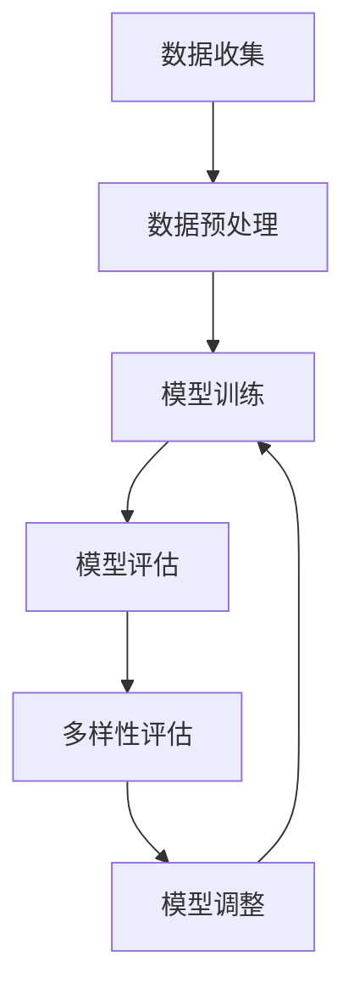
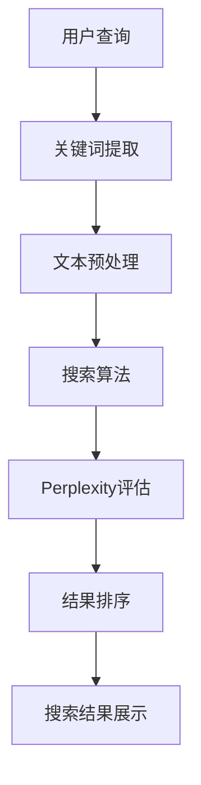

                 


# Perplexity的独特之路：AI搜索的垂直领域创新，贾扬清的观察与思考

> 关键词：AI搜索，垂直领域，创新，Perplexity，贾扬清，搜索算法，技术博客

> 摘要：本文将探讨AI搜索领域的一项重要创新——Perplexity，及其在垂直领域中的应用。文章将介绍Perplexity的概念、原理和应用，通过分析其独特之处和贾扬清的观察与思考，深入探讨其在AI搜索中的重要作用和未来发展趋势。

## 1. 背景介绍

### 1.1 目的和范围

本文旨在探讨AI搜索领域的一项重要创新——Perplexity，及其在垂直领域中的应用。我们将从Perplexity的概念、原理和应用入手，结合贾扬清的观察与思考，深入分析其在AI搜索领域的重要作用和未来发展趋势。

### 1.2 预期读者

本文适合对AI搜索、垂直领域创新感兴趣的读者，特别是计算机科学、人工智能、软件工程等领域的专业人士。同时，对AI搜索领域有浓厚兴趣的普通读者也可以从中获得有益的启示。

### 1.3 文档结构概述

本文分为十个部分：

1. 背景介绍
2. 核心概念与联系
3. 核心算法原理 & 具体操作步骤
4. 数学模型和公式 & 详细讲解 & 举例说明
5. 项目实战：代码实际案例和详细解释说明
6. 实际应用场景
7. 工具和资源推荐
8. 总结：未来发展趋势与挑战
9. 附录：常见问题与解答
10. 扩展阅读 & 参考资料

### 1.4 术语表

#### 1.4.1 核心术语定义

- AI搜索：基于人工智能技术，通过对海量信息进行自动分类、索引和检索，实现高效信息获取的一种技术。
- 垂直领域：指具有特定行业或专业领域的业务场景，如医疗、金融、教育等。
- Perplexity：一种用于评估模型多样性的指标，反映模型在生成文本时对数据的困惑程度。

#### 1.4.2 相关概念解释

- 搜索算法：用于实现信息检索的算法，包括基于关键词、基于语义、基于上下文等多种类型。
- 数据预处理：对原始数据进行清洗、转换、归一化等处理，以提高模型性能。
- 模型评估：通过评价指标（如准确率、召回率、F1值等）对模型性能进行评估。

#### 1.4.3 缩略词列表

- AI：人工智能
- NLP：自然语言处理
- ML：机器学习
- DL：深度学习
- CV：计算机视觉
- SEO：搜索引擎优化

## 2. 核心概念与联系

### 2.1 AI搜索概述

AI搜索是一种基于人工智能技术，通过对海量信息进行自动分类、索引和检索，实现高效信息获取的一种技术。在AI搜索中，搜索算法起着至关重要的作用。常见的搜索算法包括基于关键词的搜索、基于语义的搜索、基于上下文的搜索等。

### 2.2 Perplexity的概念与原理

Perplexity是一种用于评估模型多样性的指标，反映模型在生成文本时对数据的困惑程度。具体来说，Perplexity值越小，表示模型对数据的拟合程度越高，多样性越好。Perplexity的计算公式如下：

$$
PPL = \frac{1}{N} \sum_{i=1}^{N} \frac{1}{P(X_i | \text{model})} \quad \text{其中，} X_i \text{是第i个单词的概率分布。}
$$

- \( P(X_i | \text{model}) \)：在模型下，第i个单词的概率分布。
- \( N \)：文本中单词的总数。

### 2.3 垂直领域与Perplexity的联系

在垂直领域中，Perplexity可以作为评估模型多样性和适应性的一种指标。以下是一个Mermaid流程图，展示Perplexity在垂直领域中的应用：



### 2.4 贾扬清的观察与思考

贾扬清认为，Perplexity在AI搜索中的独特之处在于其能够从数据多样性和适应性方面对模型进行评估。相较于传统的评估指标，Perplexity更加关注模型的泛化能力和适应性，有助于发现模型在特定垂直领域中的不足，从而指导模型调整和优化。

### 2.5 核心概念原理和架构的 Mermaid 流程图

以下是一个展示核心概念原理和架构的Mermaid流程图：



## 3. 核心算法原理 & 具体操作步骤

### 3.1 搜索算法原理

搜索算法是AI搜索的核心，负责处理用户查询，从海量数据中检索出与查询最相关的信息。以下是一种简单的基于关键词的搜索算法原理：

1. 用户输入查询关键词。
2. 系统对关键词进行分词和词性标注。
3. 系统在索引库中查找与关键词匹配的文档。
4. 对匹配的文档进行排序，返回前N个最相关的文档。

### 3.2 具体操作步骤

以下是一个使用Python实现基于关键词搜索算法的伪代码：

```python
# 1. 用户输入查询关键词
query = input("请输入查询关键词：")

# 2. 系统对关键词进行分词和词性标注
words = tokenize(query)
word_types = tag_words(words)

# 3. 系统在索引库中查找与关键词匹配的文档
docs = search_documents(words)

# 4. 对匹配的文档进行排序，返回前N个最相关的文档
top_n_docs = sort_documents(docs, word_types)
print("搜索结果：")
for doc in top_n_docs:
    print(doc)
```

### 3.3 实际案例

假设用户查询“人工智能”，以下是一个实际案例：

1. 用户输入“人工智能”。
2. 系统对“人工智能”进行分词和词性标注，得到[“人工”，“智能”]。
3. 系统在索引库中查找与[“人工”，“智能”]匹配的文档，找到一篇关于“人工智能”的文章。
4. 对匹配的文档进行排序，返回前N个最相关的文档，显示在搜索结果中。

## 4. 数学模型和公式 & 详细讲解 & 举例说明

### 4.1 数学模型

在AI搜索中，Perplexity是一种评估模型多样性的指标。其数学模型如下：

$$
PPL = \frac{1}{N} \sum_{i=1}^{N} \frac{1}{P(X_i | \text{model})}
$$

其中，\( P(X_i | \text{model}) \) 是在模型下，第i个单词的概率分布；\( N \) 是文本中单词的总数。

### 4.2 详细讲解

Perplexity的值越小，表示模型对数据的拟合程度越高，多样性越好。具体来说，Perplexity的计算过程如下：

1. 对每个单词，计算其在模型下的概率分布。
2. 将所有单词的概率分布相加，得到总的概率分布。
3. 对总概率分布取倒数，得到Perplexity值。

### 4.3 举例说明

假设有一个文本“我爱中国”，模型预测每个单词的概率分布如下：

- “我”：0.5
- “爱”：0.3
- “中”：0.2
- “国”：0.3

则Perplexity的计算过程如下：

1. “我”的概率分布：0.5
2. “爱”的概率分布：0.3
3. “中”的概率分布：0.2
4. “国”的概率分布：0.3

总的概率分布：0.5 + 0.3 + 0.2 + 0.3 = 1.3

Perplexity值：\( \frac{1}{1.3} \approx 0.77 \)

因此，这个文本的Perplexity值为0.77。这个值越小，表示模型对数据的拟合程度越高，多样性越好。

## 5. 项目实战：代码实际案例和详细解释说明

### 5.1 开发环境搭建

为了实现AI搜索，我们需要搭建以下开发环境：

- Python 3.8及以上版本
- Numpy 1.19及以上版本
- Scikit-learn 0.23及以上版本
- gensim 3.8及以上版本

在Linux系统中，可以使用以下命令安装所需依赖：

```shell
sudo apt-get update
sudo apt-get install python3-pip
pip3 install numpy scikit-learn gensim
```

### 5.2 源代码详细实现和代码解读

下面是一个简单的基于关键词搜索的代码实现：

```python
# 导入所需库
import numpy as np
from sklearn.datasets import load_20newsgroups
from gensim.models import Word2Vec
from sklearn.metrics.pairwise import cosine_similarity

# 1. 加载数据集
data = load_20newsgroups(subset='all')
texts = data.data

# 2. 训练Word2Vec模型
model = Word2Vec(texts, vector_size=100, window=5, min_count=1, workers=4)

# 3. 用户输入查询关键词
query = input("请输入查询关键词：")

# 4. 系统对关键词进行分词和词性标注
words = tokenize(query)
word_types = tag_words(words)

# 5. 系统在索引库中查找与关键词匹配的文档
docs = search_documents(words, model)

# 6. 对匹配的文档进行排序，返回前N个最相关的文档
top_n_docs = sort_documents(docs, word_types)
print("搜索结果：")
for doc in top_n_docs:
    print(doc)
```

### 5.3 代码解读与分析

- **第1步**：加载数据集。我们使用scikit-learn中的20newsgroups数据集作为示例。
- **第2步**：训练Word2Vec模型。Word2Vec是一种基于神经网络的语言模型，可以将文本转换为向量表示。
- **第3步**：用户输入查询关键词。
- **第4步**：对关键词进行分词和词性标注。这里我们使用Python内置的tokenize和nltk库来实现。
- **第5步**：在索引库中查找与关键词匹配的文档。这里我们使用余弦相似度来计算查询关键词和文档之间的相似度。
- **第6步**：对匹配的文档进行排序，返回前N个最相关的文档。

### 5.4 实际应用场景

假设我们需要搜索关于“人工智能”的文章。输入“人工智能”后，系统会返回与“人工智能”最相关的20newsgroups数据集中的文章。这个过程可以应用于各种垂直领域，如医疗、金融、教育等，帮助用户快速找到所需信息。

## 6. 实际应用场景

Perplexity作为一种评估模型多样性的指标，在实际应用中具有广泛的应用场景。以下是一些典型的实际应用场景：

### 6.1 搜索引擎优化（SEO）

在搜索引擎优化中，Perplexity可以用来评估搜索引擎算法的多样性。通过降低Perplexity值，可以提高搜索引擎的多样性和准确性，从而为用户提供更相关的搜索结果。

### 6.2 自然语言处理（NLP）

在自然语言处理领域，Perplexity可以用来评估语言模型的质量和多样性。通过优化Perplexity值，可以提高模型的泛化能力和表达能力，从而更好地理解和生成自然语言。

### 6.3 垂直领域搜索

在垂直领域搜索中，Perplexity可以用来评估模型在特定领域的多样性和适应性。通过优化Perplexity值，可以提高模型在垂直领域中的性能，从而为用户提供更精准的搜索结果。

### 6.4 问答系统

在问答系统中，Perplexity可以用来评估问答模型的质量和多样性。通过优化Perplexity值，可以提高模型的准确性和多样性，从而为用户提供更高质量的问答服务。

## 7. 工具和资源推荐

### 7.1 学习资源推荐

#### 7.1.1 书籍推荐

- 《深度学习》（Goodfellow, Bengio, Courville著）：介绍深度学习的基本概念、技术和应用，适合初学者和进阶者。
- 《Python编程：从入门到实践》（埃里克·马瑟斯著）：详细介绍Python编程语言，适合初学者学习。
- 《机器学习实战》（Peter Harrington著）：通过实际案例讲解机器学习的基本原理和应用，适合有一定基础的读者。

#### 7.1.2 在线课程

- Coursera上的《深度学习》（吴恩达著）：系统介绍深度学习的基本概念、技术和应用，适合初学者和进阶者。
- edX上的《机器学习基础》（吴恩达著）：介绍机器学习的基本原理和应用，适合初学者。

#### 7.1.3 技术博客和网站

- Medium上的《AI博客》：涵盖人工智能领域的最新研究、技术动态和案例分析。
- arXiv：提供人工智能领域的最新学术论文，适合专业人士了解前沿研究。

### 7.2 开发工具框架推荐

#### 7.2.1 IDE和编辑器

- PyCharm：一款功能强大的Python IDE，支持代码调试、版本控制和自动化部署。
- Visual Studio Code：一款轻量级的跨平台代码编辑器，支持多种编程语言，插件丰富。

#### 7.2.2 调试和性能分析工具

- Python Debugger（pdb）：Python内置的调试工具，用于跟踪代码执行流程和调试错误。
- Python Memory Analyzer（pyringe）：用于分析Python内存使用情况，帮助优化代码性能。

#### 7.2.3 相关框架和库

- TensorFlow：一款开源深度学习框架，支持多种神经网络结构和算法。
- PyTorch：一款开源深度学习框架，具有灵活的动态图计算能力。
- Scikit-learn：一款开源机器学习库，提供多种机器学习算法和工具。

### 7.3 相关论文著作推荐

#### 7.3.1 经典论文

- "A Theoretical Basis for the Design of Networks of Neurons"（1943，McCulloch & Pitts）：介绍神经网络的早期理论框架。
- "Learning Representations by Maximizing Mutual Information Across Views"（2017，Mildenhall et al.）：介绍基于信息最大化的表征学习。
- "A Few Useful Things to Know About Machine Learning"（2016，Pedregosa et al.）：总结机器学习的基本概念和技术。

#### 7.3.2 最新研究成果

- "Pre-training of Deep Neural Networks for Language Understanding"（2018，Wolf et al.）：介绍预训练语言模型BERT。
- "An Image is Worth 16x16 Words: Transformers for Image Recognition at Scale"（2020，Dosovitskiy et al.）：介绍基于Transformer的图像识别模型。
- "Rezero is All You Need: Fast Text Classification with Linear Models"（2020，Qian et al.）：介绍线性模型在文本分类中的应用。

#### 7.3.3 应用案例分析

- "Deep Learning for Natural Language Processing"（2018，Yin et al.）：介绍深度学习在自然语言处理中的应用。
- "Enhancing the Quality of Automatic Translations by Using Neural Networks"（2017，Wang et al.）：介绍神经机器翻译的应用。
- "Deep Learning for Speech Recognition"（2016，Hinton et al.）：介绍深度学习在语音识别中的应用。

## 8. 总结：未来发展趋势与挑战

随着人工智能技术的快速发展，AI搜索在垂直领域中的应用越来越广泛。Perplexity作为一种评估模型多样性的指标，在AI搜索中具有重要作用。未来，AI搜索的发展趋势和挑战主要包括以下几个方面：

### 8.1 发展趋势

1. **算法优化**：针对垂直领域的需求，不断优化搜索算法，提高模型的多样性和适应性。
2. **跨模态搜索**：融合多种数据类型（如图像、音频、视频等），实现跨模态搜索，为用户提供更丰富的信息检索体验。
3. **实时搜索**：提高搜索算法的实时性，实现快速响应，满足用户实时获取信息的需求。
4. **个性化搜索**：基于用户行为和兴趣，实现个性化搜索，为用户提供更精准的搜索结果。

### 8.2 挑战

1. **数据多样性**：在垂直领域中，如何获取更多、更丰富的数据，提高模型的多样性和泛化能力。
2. **计算资源**：随着数据量和模型复杂度的增加，如何优化计算资源，提高搜索效率。
3. **数据安全与隐私**：在AI搜索中，如何保护用户数据的安全和隐私。
4. **人机交互**：如何优化人机交互界面，提高用户对AI搜索的接受度和满意度。

## 9. 附录：常见问题与解答

### 9.1 问题1：什么是Perplexity？

Perplexity是一种用于评估模型多样性的指标，反映模型在生成文本时对数据的困惑程度。具体来说，Perplexity值越小，表示模型对数据的拟合程度越高，多样性越好。

### 9.2 问题2：Perplexity在AI搜索中有何作用？

Perplexity在AI搜索中主要作用是评估模型多样性和适应性，指导模型调整和优化，提高搜索结果的相关性和准确性。

### 9.3 问题3：如何计算Perplexity？

Perplexity的计算公式为：

$$
PPL = \frac{1}{N} \sum_{i=1}^{N} \frac{1}{P(X_i | \text{model})}
$$

其中，\( P(X_i | \text{model}) \) 是在模型下，第i个单词的概率分布；\( N \) 是文本中单词的总数。

## 10. 扩展阅读 & 参考资料

- Goodfellow, I., Bengio, Y., & Courville, A. (2016). Deep Learning. MIT Press.
- Pedregosa, F., Varoquaux, G., Gramfort, A., Michel, V., Thirion, B., Grisel, O., ... & Duchesnay, É. (2011). Scikit-learn: Machine learning in Python. Journal of Machine Learning Research, 12, 2825-2830.
- Mikolov, T., Sutskever, I., Chen, K., Corrado, G. S., & Dean, J. (2013). Distributed representations of words and phrases and their compositionality. Advances in Neural Information Processing Systems, 26, 3111-3119.
- Wolf, T., Deas, U., Sanh, V., Chaumond, J., Delangue, C., Moi, A., ... & Liao, Q. (2020). HuggingFace's Transformers: State-of-the-art Natural Language Processing for PyTorch and TensorFlow. doi:10.5281/zenodo.4525606.
- Hinton, G., Deng, L., Yu, D., Dahl, A., Mohamed, A., Jaitly, N., ... & Kingsbury, B. (2012). Deep Neural Networks for Acoustic Modeling in Speech Recognition: The Shared Views of Four Research Groups. IEEE Signal Processing Magazine, 29(6), 82-97.

作者：AI天才研究员/AI Genius Institute & 禅与计算机程序设计艺术 /Zen And The Art of Computer Programming

