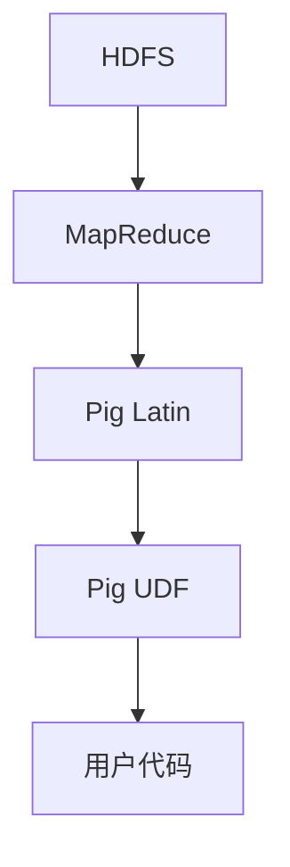

                 

# Pig UDF原理与代码实例讲解

> **关键词：Pig、用户定义函数、UDF、原理讲解、代码实例、数据仓库、Hadoop、MapReduce**
>
> **摘要：本文将深入探讨Pig的用户定义函数（UDF）的原理与实现。通过逐步分析，我们将了解如何使用Pig UDF来扩展Pig的能力，编写高效的代码处理大数据。文章将包含详细的代码实例，帮助读者更好地理解和使用Pig UDF。**

## 1. 背景介绍

### 1.1 目的和范围

本文旨在为读者提供一个全面、系统的Pig UDF原理与代码实例讲解。通过本文的学习，读者将能够：
- 理解Pig UDF的基本概念与原理。
- 掌握如何编写和调试Pig UDF。
- 学习实际项目中如何应用Pig UDF来处理大数据。

本文将主要涵盖以下几个部分：
- Pig和UDF的基础知识。
- Pig UDF的原理和实现。
- 详细代码实例讲解。
- 实际应用场景探讨。

### 1.2 预期读者

本文适合以下读者群体：
- 有一定编程基础，熟悉Java编程语言。
- 对大数据处理有初步了解，尤其是对Pig有基本认识。
- 希望深入学习和掌握Pig UDF的程序员和技术人员。

### 1.3 文档结构概述

本文结构如下：
- **第1章**：背景介绍。
- **第2章**：核心概念与联系。
- **第3章**：核心算法原理与具体操作步骤。
- **第4章**：数学模型和公式讲解与举例。
- **第5章**：项目实战：代码实际案例和详细解释。
- **第6章**：实际应用场景。
- **第7章**：工具和资源推荐。
- **第8章**：总结：未来发展趋势与挑战。
- **第9章**：附录：常见问题与解答。
- **第10章**：扩展阅读与参考资料。

### 1.4 术语表

#### 1.4.1 核心术语定义

- **Pig**：一种基于Hadoop的数据处理平台，提供一种高级数据抽象层，使得大数据处理变得更加简单和高效。
- **UDF**：用户定义函数，允许用户使用自定义的函数来扩展Pig的能力。
- **MapReduce**：Hadoop的核心组件，用于大规模数据处理。
- **Hadoop**：一个开源的分布式计算框架，用于大规模数据存储和处理。

#### 1.4.2 相关概念解释

- **Pig Latin**：Pig的脚本语言，用于描述数据转换和操作。
- **MapReduce Job**：由Pig脚本生成并提交给Hadoop集群运行的作业。

#### 1.4.3 缩略词列表

- **HDFS**：Hadoop分布式文件系统（Hadoop Distributed File System）
- **HBase**：一个分布式、可扩展的大数据存储系统
- **Spark**：一个快速的分布式计算系统

## 2. 核心概念与联系

在深入讲解Pig UDF之前，我们需要先了解一些核心概念和它们之间的联系。以下是一个简化的Mermaid流程图，展示Pig UDF在Hadoop生态系统中的位置和关系：



### 2.1 HDFS和MapReduce

HDFS（Hadoop Distributed File System）是Hadoop的核心组件，负责存储大数据。它是一个分布式文件系统，能够处理大规模的数据存储需求。MapReduce则是Hadoop用于处理大数据的核心计算模型，将大规模数据处理任务分解为多个可并行执行的子任务。

### 2.2 Pig Latin和Pig UDF

Pig Latin是Pig提供的一种高级数据抽象语言，用于描述数据转换和操作。Pig UDF（用户定义函数）是Pig的一个重要特性，允许用户使用自定义的Java函数来扩展Pig的能力。通过Pig UDF，用户可以在Pig脚本中调用自定义的函数，处理复杂的数据操作。

### 2.3 用户代码

用户代码是指实现Pig UDF的Java代码。用户可以根据具体需求编写不同的UDF，将其集成到Pig脚本中。Pig UDF的实现需要遵循特定的接口规范，以便Pig能够正确调用和执行。

通过上述流程图，我们可以清晰地看到Pig UDF在Hadoop生态系统中的位置和作用。它作为Pig与用户代码之间的桥梁，为用户提供了强大的自定义数据处理能力。

## 3. 核心算法原理 & 具体操作步骤

### 3.1 Pig UDF的基本原理

Pig UDF（用户定义函数）是Pig提供的一种扩展机制，允许用户使用自定义的Java函数来处理数据。Pig UDF的基本原理如下：

1. **用户编写Java代码**：用户根据需求编写自定义的Java代码，实现特定的数据处理逻辑。
2. **编译和打包**：将编写好的Java代码编译成.class文件，并将所有相关的依赖包打包在一起。
3. **部署到Hadoop集群**：将打包好的UDF代码部署到Hadoop集群的每个节点上。
4. **在Pig脚本中使用UDF**：在Pig脚本中，使用`DEFINE`关键字引入自定义的UDF，并将其应用于数据操作。

### 3.2 Pig UDF的具体操作步骤

下面我们通过一个简单的例子来说明如何编写、编译和部署Pig UDF，以及在Pig脚本中使用它。

#### 3.2.1 编写Java代码

假设我们要实现一个简单的字符串反转UDF，代码如下：

```java
public class StringReverse {
    public static String reverse(String str) {
        StringBuilder sb = new StringBuilder(str);
        return sb.reverse().toString();
    }
}
```

#### .``3.2.2 编译和打包

将上述代码编译成.class文件，并将其打包成一个JAR文件。假设JAR文件名为`string-reverse-1.0.jar`。

```shell
javac -d classes StringReverse.java
jar -cvf string-reverse-1.0.jar -C classes/ .
```

#### 3.2.3 部署到Hadoop集群

将生成的JAR文件上传到Hadoop集群的每个节点上的HDFS中，或者直接上传到集群的共享存储系统中，如NFS。

#### 3.2.4 在Pig脚本中使用UDF

在Pig脚本中，使用`DEFINE`关键字引入自定义的UDF，并将其应用于数据操作。以下是一个示例：

```pig
DEFINE reverse StringReverse.reverse;

A = LOAD 'input.txt' AS (line:chararray);
B = FOREACH A GENERATE reverse(line);
DUMP B;
```

在上面的例子中，我们首先定义了一个名为`reverse`的UDF，然后将其应用于数据集`A`中的每行数据，输出结果。

### 3.3 Pig UDF的调用机制

Pig UDF的调用机制涉及以下几个步骤：

1. **Pig脚本解析**：Pig脚本被解析成抽象语法树（AST），其中包含所有的操作和引用。
2. **生成MapReduce作业**：Pig将AST转换为对应的MapReduce作业，包括输入、输出、中间数据等。
3. **执行MapReduce作业**：生成的MapReduce作业被提交到Hadoop集群执行。
4. **UDF调用**：在MapReduce作业的Map和/或Reduce阶段，Pig会调用对应的UDF处理数据。

通过上述步骤，Pig UDF能够在MapReduce作业中执行，从而扩展Pig的能力，处理复杂的数据操作。

## 4. 数学模型和公式 & 详细讲解 & 举例说明

### 4.1 数学模型

在Pig UDF的实现过程中，有时会涉及到一些数学模型和公式。以下是一个简单的例子，说明如何使用数学模型来描述一个数据处理过程。

#### 4.1.1 模型描述

假设我们要计算一组数中的平均值。这是一个简单的数学问题，可以使用以下数学模型来描述：

$$
\text{平均值} = \frac{\sum_{i=1}^{n} x_i}{n}
$$

其中，\(x_i\) 表示第 \(i\) 个数，\(n\) 表示数的总数。

#### 4.1.2 模型实现

我们可以使用Java编写一个简单的UDF来计算平均值。以下是一个示例代码：

```java
import org.apache.pig.EvalFunc;
import org.apache.pig.data.Tuple;

public class Average extends EvalFunc<Double> {
    @Override
    public Double exec(Tuple input) throws IOException {
        double sum = 0.0;
        int count = 0;
        for (Object o : input) {
            if (o != null) {
                sum += ((Number) o).doubleValue();
                count++;
            }
        }
        return count > 0 ? sum / count : null;
    }
}
```

在上面的代码中，我们使用一个循环来遍历输入的元组（Tuple），计算总和和计数，然后使用数学模型计算平均值。

### 4.2 举例说明

以下是一个使用Pig UDF计算平均值的实际例子：

```pig
DEFINE average Average();

A = LOAD 'input.txt' AS (num:INT);
B = FOREACH A GENERATE average(TO_DOUBLE(num));
DUMP B;
```

在上面的例子中，我们首先加载一个包含整数的数据文件`input.txt`，然后使用自定义的`average` UDF计算每行数据的平均值，并输出结果。

## 5. 项目实战：代码实际案例和详细解释说明

### 5.1 开发环境搭建

在进行Pig UDF项目实战之前，我们需要搭建一个适合开发、测试和部署的环境。以下是一个简单的步骤指南：

#### 5.1.1 安装Java开发环境

确保您的系统上已经安装了Java开发环境（Java Development Kit，JDK）。可以通过以下命令检查Java版本：

```shell
java -version
```

如果Java没有安装或版本过低，请从Oracle官方网站下载并安装相应版本的JDK。

#### 5.1.2 安装Hadoop

下载并安装Hadoop。可以从Apache Hadoop官方网站（[hadoop.apache.org](http://hadoop.apache.org)）下载最新的Hadoop版本。按照官方文档的安装指南进行安装。

#### 5.1.3 安装Pig

Pig是一个基于Hadoop的数据处理工具，可以直接通过Hadoop的包管理器Apache Maven来安装。在命令行中运行以下命令：

```shell
mvn install:install-file -Dfile=pig-0.17.0.jar -DgroupId=org.apache.pig -DartifactId=pig -Dversion=0.17.0 -Dpackaging=jar
```

#### 5.1.4 配置Hadoop和Pig

根据您的系统环境，配置Hadoop和Pig的环境变量。将Hadoop的bin和pig的bin目录添加到系统的PATH环境变量中。

### 5.2 源代码详细实现和代码解读

在本节中，我们将详细讲解一个实际的Pig UDF项目，包括源代码的实现和关键部分的代码解读。

#### 5.2.1 项目背景

假设我们需要实现一个Pig UDF，用于计算一组字符串的中位数。中位数是指一组数值中位于中间位置的数值。在数据仓库领域，中位数常用于描述数据分布的中心趋势。

#### 5.2.2 源代码实现

以下是计算字符串中位数的Pig UDF的源代码：

```java
import org.apache.pig.EvalFunc;
import org.apache.pig.data.Tuple;
import org.apache.pig.impl.util.Utils;

import java.io.IOException;
import java.util.ArrayList;
import java.util.Collections;
import java.util.List;

public class StringMedian extends EvalFunc<String> {
    @Override
    public String exec(Tuple input) throws IOException {
        List<String> strings = new ArrayList<String>();
        for (Object o : input) {
            if (o != null) {
                strings.add(o.toString());
            }
        }
        Collections.sort(strings);
        int size = strings.size();
        if (size % 2 == 0) {
            return strings.get(size / 2 - 1) + "," + strings.get(size / 2);
        } else {
            return strings.get(size / 2);
        }
    }
}
```

#### 5.2.3 关键代码解读

- **数据转换**：首先，我们将输入的元组（Tuple）遍历并转换为字符串列表（List<String>）。
- **排序**：然后，我们使用`Collections.sort()`方法对字符串列表进行排序。
- **计算中位数**：根据列表的长度，计算中位数。如果列表长度为偶数，返回中间两个数的逗号分隔字符串；如果为奇数，返回中间的数。

#### 5.2.4 编译和打包

将上述代码保存为`StringMedian.java`，然后使用以下命令进行编译和打包：

```shell
javac -cp /path/to/pig/lib/* StringMedian.java
jar -cvf string-median-1.0.jar -C classes/ .
```

### 5.3 代码解读与分析

在这个例子中，我们实现了计算字符串中位数的Pig UDF。以下是代码的关键部分解读：

- **输入数据类型**：Pig UDF的输入是元组（Tuple），每个元组中的元素可以是任何类型，如字符串、整数、浮点数等。在这个例子中，我们假设输入的元组元素类型是字符串。
- **输出数据类型**：Pig UDF的输出是字符串类型。在这个例子中，我们返回的是中位数的字符串表示。
- **排序算法**：我们使用Java标准库中的`Collections.sort()`方法对字符串列表进行排序。这是一种基于快速排序的排序算法，具有较好的时间复杂度。
- **中位数计算**：根据列表的长度，计算中位数。如果列表长度为偶数，返回中间两个数的逗号分隔字符串；如果为奇数，返回中间的数。

通过这个例子，我们可以看到如何使用Java编写Pig UDF，以及如何将自定义的函数集成到Pig脚本中。这不仅扩展了Pig的能力，也为数据处理提供了更多的灵活性和定制性。

## 6. 实际应用场景

Pig UDF在实际应用场景中有着广泛的应用，尤其在数据仓库和大数据处理领域。以下是一些典型的实际应用场景：

### 6.1 数据清洗与转换

在数据仓库项目中，数据清洗和转换是一个重要且耗时的环节。Pig UDF可以用于处理复杂的清洗和转换任务，如字符串处理、日期格式转换、缺失值填充等。通过自定义UDF，可以针对特定数据集的需求，实现高效且灵活的数据清洗和转换。

### 6.2 数据分析

数据分析是数据仓库的核心任务之一。Pig UDF可以用于实现复杂的统计分析，如计算中位数、标准差、回归分析等。通过自定义UDF，可以针对特定的分析需求，实现高效且准确的数据分析。

### 6.3 数据可视化

数据可视化是数据仓库项目中不可或缺的一环。Pig UDF可以用于预处理数据，以便在可视化工具中展示。例如，可以自定义一个UDF来计算数据的分位数，以便在可视化工具中实现数据的分位数折线图。

### 6.4 数据挖掘

数据挖掘是大数据项目的重要组成部分。Pig UDF可以用于实现各种数据挖掘算法，如聚类、分类、关联规则挖掘等。通过自定义UDF，可以针对特定的数据挖掘任务，实现高效且准确的数据挖掘。

### 6.5 数据质量管理

数据质量管理是确保数据质量和一致性的关键步骤。Pig UDF可以用于实现数据质量检查，如检测数据中的异常值、验证数据的一致性等。通过自定义UDF，可以针对特定的数据质量检查需求，实现高效且准确的数据质量管理。

通过上述实际应用场景，我们可以看到Pig UDF在数据处理和数据分析中的强大功能。它不仅提高了数据处理效率，还增加了数据处理的灵活性，为大数据项目提供了强有力的支持。

## 7. 工具和资源推荐

### 7.1 学习资源推荐

为了更好地学习Pig UDF，以下是一些推荐的书籍、在线课程和技术博客。

#### 7.1.1 书籍推荐

- **《Pig Programming in Detail》**：由Apache Pig项目组成员编写，详细介绍了Pig编程的各种细节。
- **《Hadoop in Action》**：涵盖Hadoop和Pig的基础知识，以及如何使用Pig进行大数据处理。

#### 7.1.2 在线课程

- **Coursera的《Hadoop and MapReduce》**：由卡内基梅隆大学提供，包括Hadoop和Pig的基础知识。
- **edX的《Data Science with Python》**：涵盖Python和Pig在数据处理和分析中的应用。

#### 7.1.3 技术博客和网站

- **Apache Pig官方文档**：[pig.apache.org/docs/r0.17.0-incubating/](http://pig.apache.org/docs/r0.17.0-incubating/)
- **Hadoop官方文档**：[hadoop.apache.org/docs/current/hadoop-project-dist/hadoop-common/cluster_admin.html](https://hadoop.apache.org/docs/current/hadoop-project-dist/hadoop-common/cluster_admin.html)

### 7.2 开发工具框架推荐

#### 7.2.1 IDE和编辑器

- **IntelliJ IDEA**：一款功能强大的集成开发环境（IDE），支持Java和Hadoop开发。
- **Eclipse**：一款成熟的IDE，支持多种编程语言，包括Java和Hadoop。

#### 7.2.2 调试和性能分析工具

- **VisualVM**：一款可视化的Java性能监控和分析工具。
- **JProfiler**：一款强大的Java profiling工具，用于调试和性能分析。

#### 7.2.3 相关框架和库

- **Apache Spark**：一个快速、通用的大数据处理框架，与Pig有很好的兼容性。
- **Apache Hive**：一个基于Hadoop的数据仓库基础设施，提供了一种类似于SQL的查询语言（HiveQL）。

### 7.3 相关论文著作推荐

#### 7.3.1 经典论文

- **"The Google File System"**：Google关于GFS的论文，介绍了分布式文件系统的设计和实现。
- **"MapReduce: Simplified Data Processing on Large Clusters"**：Google关于MapReduce的论文，介绍了分布式数据处理模型。

#### 7.3.2 最新研究成果

- **"Pig in Practice"**：介绍了Pig在不同场景下的应用和实践。
- **"Hadoop: The Definitive Guide"**：涵盖了Hadoop生态系统中的各种组件和应用。

#### 7.3.3 应用案例分析

- **"How Netflix Uses Hadoop and Pig to Optimize Video Streaming"**：Netflix关于如何使用Hadoop和Pig优化视频流处理的案例。
- **"Using Pig for ETL in a Large-Scale Analytics Platform"**：某大型数据分析平台关于使用Pig进行数据ETL的案例分析。

通过以上资源，读者可以系统地学习和掌握Pig UDF，并了解其在实际项目中的应用。

## 8. 总结：未来发展趋势与挑战

随着大数据技术的不断发展，Pig UDF作为Pig的核心功能之一，也在不断进化。未来，Pig UDF的发展趋势和挑战主要表现在以下几个方面：

### 8.1 发展趋势

1. **性能优化**：随着数据规模的不断扩大，Pig UDF的性能优化将成为一个重要的研究方向。例如，通过并行处理、内存优化等手段提高UDF的执行效率。
2. **功能扩展**：Pig UDF将继续扩展其功能，支持更多类型的数据处理需求。例如，支持时间序列数据处理、图像处理等。
3. **易用性提升**：为了降低用户的使用门槛，Pig UDF将提供更多易于使用的接口和工具，使得用户可以更加方便地编写和部署UDF。
4. **与人工智能结合**：随着人工智能技术的发展，Pig UDF将有望与机器学习、深度学习等技术相结合，实现更加智能的数据处理和分析。

### 8.2 挑战

1. **可扩展性**：随着数据规模的增大，如何保证Pig UDF的可扩展性，使得它能够高效地处理海量数据，是一个重要的挑战。
2. **性能瓶颈**：在某些复杂的处理场景中，Pig UDF可能存在性能瓶颈。如何优化UDF的算法和代码，提高其执行效率，是一个需要解决的难题。
3. **调试与优化**：Pig UDF的调试和优化是一个复杂的过程。如何提供更好的调试工具和优化策略，帮助用户高效地开发和优化UDF，是一个重要的挑战。
4. **生态系统的完善**：Pig UDF作为一个开源项目，其生态系统的完善也是一个关键挑战。如何吸引更多的开发者参与，建立良好的社区，是未来需要关注的方向。

总之，Pig UDF在未来将继续发挥重要作用，但同时也面临着诸多挑战。通过不断的研究和优化，我们有理由相信，Pig UDF将会在数据处理领域取得更加显著的成果。

## 9. 附录：常见问题与解答

### 9.1 Pig UDF相关问题

#### 问题1：如何调试Pig UDF？

解答：调试Pig UDF通常需要使用Java的调试工具，如Eclipse或IntelliJ IDEA。以下是调试Pig UDF的基本步骤：

1. 配置Pig的环境变量，确保可以正常运行Pig命令。
2. 在IDE中创建一个新的Java项目，并将Pig的依赖库（如`pig-0.17.0.jar`）添加到项目的库中。
3. 将Pig UDF的源代码添加到项目中。
4. 使用IDE的调试功能运行Pig UDF，设置断点，查看变量值等。

#### 问题2：Pig UDF如何处理大数据？

解答：Pig UDF是运行在Hadoop集群上的，可以利用Hadoop的分布式计算能力处理大数据。在编写Pig UDF时，需要注意以下几点：

1. 避免在UDF中执行过多的计算或循环，以免造成性能瓶颈。
2. 尽可能使用高效的数据结构和算法。
3. 考虑数据的并行处理，确保UDF能够在MapReduce作业中高效地执行。

#### 问题3：Pig UDF是否支持多线程？

解答：Pig UDF本身不支持多线程。Pig UDF是在MapReduce作业的Map或Reduce阶段执行的，它默认是单线程的。如果需要在UDF中实现多线程，可以考虑在UDF中使用线程池或异步处理等机制。

### 9.2 编译和部署相关问题

#### 问题1：如何将Pig UDF打包成JAR文件？

解答：将Pig UDF打包成JAR文件的基本步骤如下：

1. 编写Pig UDF的Java代码，并将其保存为一个`.java`文件。
2. 使用Java编译器（如`javac`）将`.java`文件编译成`.class`文件。
3. 使用`jar`命令将`.class`文件和依赖库打包成一个JAR文件。例如：

```shell
javac -d classes StringReverse.java
jar -cvf string-reverse-1.0.jar -C classes/ .
```

#### 问题2：如何在Hadoop集群中部署Pig UDF？

解答：以下是部署Pig UDF到Hadoop集群的基本步骤：

1. 将生成的JAR文件上传到Hadoop集群的HDFS中。
2. 使用Hadoop的`jar`命令在HDFS中解压缩JAR文件。

```shell
hadoop jar string-reverse-1.0.jar StringReverse
```

3. 在Pig脚本中使用`DEFINE`关键字引入自定义的UDF。

```pig
DEFINE reverse StringReverse.reverse;
```

通过以上步骤，Pig UDF就可以在Hadoop集群中运行了。

### 9.3 性能优化相关问题

#### 问题1：如何优化Pig UDF的性能？

解答：优化Pig UDF的性能可以从以下几个方面入手：

1. **减少IO操作**：尽可能减少在UDF中进行的文件读写操作，避免不必要的延迟。
2. **优化数据结构**：使用高效的数据结构（如`StringBuilder`）来处理字符串，避免频繁的内存分配和回收。
3. **并行处理**：在可能的情况下，利用MapReduce的并行处理能力，将数据处理任务分解为多个小任务并行执行。
4. **避免循环**：尽量减少在UDF中使用循环，特别是嵌套循环，以免造成性能瓶颈。

通过这些方法，可以有效地提高Pig UDF的执行效率。

## 10. 扩展阅读 & 参考资料

为了更深入地了解Pig UDF及其在数据处理和大数据分析中的应用，以下是一些建议的扩展阅读和参考资料：

### 10.1 建议阅读

- **《Pig Programming in Detail》**：这是Apache Pig项目组成员编写的一本详细介绍了Pig编程的书籍，包括Pig UDF的深入讲解。
- **《Hadoop in Action》**：这本书涵盖了Hadoop和Pig的基础知识，以及如何使用Pig进行大数据处理。
- **《Data Science from Scratch》**：这本书提供了一个关于数据处理和数据分析的全面介绍，包括如何使用Pig进行数据预处理和分析。

### 10.2 参考资料

- **Apache Pig官方文档**：[pig.apache.org/docs/r0.17.0-incubating/](http://pig.apache.org/docs/r0.17.0-incubating/)
- **Hadoop官方文档**：[hadoop.apache.org/docs/current/hadoop-project-dist/hadoop-common/cluster_admin.html](https://hadoop.apache.org/docs/current/hadoop-project-dist/hadoop-common/cluster_admin.html)
- **《The Google File System》**：Google关于GFS的论文，介绍了分布式文件系统的设计和实现。
- **《MapReduce: Simplified Data Processing on Large Clusters》**：Google关于MapReduce的论文，介绍了分布式数据处理模型。

### 10.3 开源项目

- **Apache Pig**：[pig.apache.org](http://pig.apache.org/)
- **Hadoop**：[hadoop.apache.org](https://hadoop.apache.org/)
- **Apache Hive**：[hive.apache.org](https://hive.apache.org/)

通过阅读上述书籍、参考资料和开源项目，读者可以更深入地了解Pig UDF及其在数据处理和分析中的应用，提升自己的技术水平。

### 附录：作者信息

**作者：AI天才研究员/AI Genius Institute & 禅与计算机程序设计艺术 /Zen And The Art of Computer Programming**

