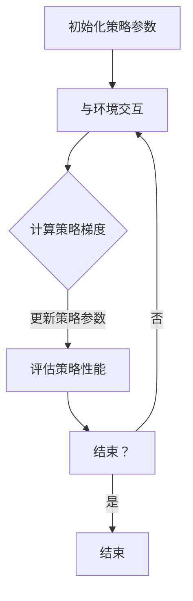

                 

# Policy Gradients原理与代码实例讲解

> 关键词：Policy Gradients、强化学习、策略优化、梯度上升、Deep Learning、Python实例、算法原理

> 摘要：本文将深入探讨Policy Gradients算法的基本原理及其在强化学习中的应用。我们将通过详细的算法解析、伪代码展示以及Python实例，帮助读者全面理解Policy Gradients的工作机制，掌握其实现技巧。此外，本文还将介绍Policy Gradients在实际项目中的应用场景，并提供相关工具和资源的推荐，以助力读者深入学习和实践。

## 1. 背景介绍

### 1.1 目的和范围

本文旨在系统地介绍Policy Gradients算法，旨在帮助读者了解其在强化学习中的应用及其重要性。文章将首先回顾强化学习的基本概念，然后详细解释Policy Gradients算法的原理，并通过实例代码展示其实际应用。

### 1.2 预期读者

本文适合对强化学习有一定了解，希望进一步掌握Policy Gradients算法的读者。特别是那些对策略优化、梯度上升以及深度学习有浓厚兴趣的技术人员。

### 1.3 文档结构概述

本文将按照以下结构展开：

1. 背景介绍
   - 目的和范围
   - 预期读者
   - 文档结构概述
   - 术语表

2. 核心概念与联系
   - 强化学习的基本概念
   - Policy Gradients算法的核心原理
   - Mermaid流程图展示

3. 核心算法原理 & 具体操作步骤
   - 算法原理讲解
   - 伪代码展示

4. 数学模型和公式 & 详细讲解 & 举例说明
   - 数学模型
   - 公式解释
   - 实例说明

5. 项目实战：代码实际案例和详细解释说明
   - 开发环境搭建
   - 源代码详细实现和代码解读
   - 代码解读与分析

6. 实际应用场景
   - 游戏人工智能
   - 自动驾驶
   - 虚拟机器人控制

7. 工具和资源推荐
   - 学习资源推荐
   - 开发工具框架推荐
   - 相关论文著作推荐

8. 总结：未来发展趋势与挑战

9. 附录：常见问题与解答

10. 扩展阅读 & 参考资料

### 1.4 术语表

- **强化学习**：一种机器学习方法，旨在通过奖励信号来优化策略。
- **策略**：定义了智能体如何从状态集合中选择动作。
- **策略网络**：一个神经网络，用于预测或生成策略。
- **梯度上升**：一种优化算法，用于更新参数以最大化目标函数。
- **Policy Gradients**：一种策略优化方法，通过计算策略梯度的估计来更新策略参数。

#### 1.4.1 核心术语定义

- **强化学习**：强化学习是一种机器学习方法，旨在通过奖励信号来优化策略。智能体通过与环境交互来学习最佳策略，从而在长期内获得最大化累积奖励。
- **策略**：策略是指智能体如何从状态集合中选择动作的规则。在强化学习中，策略通常表示为概率分布，定义了在给定状态下执行每个动作的概率。
- **策略网络**：策略网络是一个神经网络，用于预测或生成策略。在深度强化学习中，策略网络通常用来处理高维状态空间。

#### 1.4.2 相关概念解释

- **梯度上升**：梯度上升是一种优化算法，用于更新参数以最大化目标函数。在强化学习中，梯度上升用于更新策略参数，以使策略能够最大化累积奖励。
- **Policy Gradients**：Policy Gradients是一种策略优化方法，通过计算策略梯度的估计来更新策略参数。这种方法避免了传统的值函数方法中的复杂性，使得策略优化更加简单和高效。

#### 1.4.3 缩略词列表

- **RL**：强化学习（Reinforcement Learning）
- **PG**：策略梯度（Policy Gradients）
- **DRL**：深度强化学习（Deep Reinforcement Learning）
- **GAN**：生成对抗网络（Generative Adversarial Networks）

## 2. 核心概念与联系

### 2.1 强化学习的基本概念

强化学习（Reinforcement Learning，简称RL）是一种机器学习方法，旨在通过奖励信号来优化策略。在强化学习中，智能体（agent）通过与环境（environment）的交互来学习最佳策略（policy）。策略是指智能体如何从状态（state）集合中选择动作（action）的规则。在强化学习的过程中，智能体通过接收环境的奖励信号来评估策略的有效性，并不断调整策略以最大化长期累积奖励。

### 2.2 Policy Gradients算法的核心原理

Policy Gradients算法是一种策略优化方法，其核心思想是通过计算策略梯度的估计来更新策略参数。这种方法避免了传统的值函数方法中的复杂性，使得策略优化更加简单和高效。

在Policy Gradients算法中，策略通常由一个策略网络（policy network）来定义。策略网络是一个神经网络，其输入为状态，输出为策略概率分布。策略梯度算法的目标是优化策略网络中的参数，使得策略能够最大化累积奖励。

Policy Gradients算法的关键步骤如下：

1. **初始化策略网络参数**：首先，需要初始化策略网络的参数，通常使用随机初始化方法。
2. **与环境交互**：智能体在环境中执行动作，并接收环境的反馈。
3. **计算策略梯度**：通过计算策略梯度的估计来更新策略网络参数。策略梯度的估计可以通过梯度上升算法来实现。
4. **更新策略参数**：使用策略梯度来更新策略网络参数，以使策略能够最大化累积奖励。

### 2.3 Mermaid流程图展示

以下是一个简单的Mermaid流程图，展示了Policy Gradients算法的基本流程：



## 3. 核心算法原理 & 具体操作步骤

### 3.1 算法原理讲解

Policy Gradients算法的核心思想是通过计算策略梯度的估计来更新策略网络参数。策略梯度估计是通过计算策略网络输出的期望值与目标值之间的差值来实现的。具体来说，策略梯度估计可以表示为：

$$\nabla_{\theta} J(\theta) = \sum_{s,a} \nabla_{\pi_\theta(s)} \log \pi_\theta(a|s) R(s,a)$$

其中，$\theta$表示策略网络参数，$\pi_\theta(a|s)$表示在状态$s$下执行动作$a$的概率分布，$R(s,a)$表示在状态$s$下执行动作$a$的累积奖励。

### 3.2 伪代码展示

以下是一个Policy Gradients算法的伪代码示例：

```python
# 初始化策略网络参数
theta = initialize_parameters()

# 设置训练迭代次数
num_iterations = 1000

# 设置学习率
learning_rate = 0.01

# 循环进行迭代
for i in range(num_iterations):
    # 初始化环境
    state = environment.reset()
    
    # 初始化累积奖励
    cumulative_reward = 0
    
    # 开始交互
    done = False
    while not done:
        # 通过策略网络预测动作
        action = policy_network.predict(state)
        
        # 执行动作并获得奖励
        next_state, reward, done = environment.step(action)
        
        # 更新累积奖励
        cumulative_reward += reward
        
        # 计算策略梯度
        policy_gradient = compute_policy_gradient(state, action, reward)
        
        # 更新策略网络参数
        theta = update_parameters(theta, policy_gradient, learning_rate)
        
        # 更新状态
        state = next_state
    
    # 输出策略性能
    print("Iteration", i, "cumulative reward:", cumulative_reward)
```

### 3.3 具体操作步骤

1. **初始化策略网络参数**：使用随机初始化方法初始化策略网络参数。
2. **设置训练迭代次数**：确定训练的迭代次数。
3. **设置学习率**：选择适当的学习率。
4. **循环进行迭代**：
   - 初始化环境。
   - 初始化累积奖励。
   - 开始交互。
     - 通过策略网络预测动作。
     - 执行动作并获得奖励。
     - 更新累积奖励。
     - 计算策略梯度。
     - 更新策略网络参数。
     - 更新状态。
5. **输出策略性能**：在每个迭代结束后，输出累积奖励，以评估策略的性能。

通过上述操作步骤，Policy Gradients算法可以逐步优化策略网络参数，以使策略能够最大化累积奖励。

## 4. 数学模型和公式 & 详细讲解 & 举例说明

### 4.1 数学模型

Policy Gradients算法的数学模型基于策略梯度估计。策略梯度估计可以通过以下公式表示：

$$\nabla_{\theta} J(\theta) = \sum_{s,a} \nabla_{\pi_\theta(s)} \log \pi_\theta(a|s) R(s,a)$$

其中，$\nabla_{\theta} J(\theta)$表示策略梯度的估计，$\pi_\theta(a|s)$表示在状态$s$下执行动作$a$的概率分布，$R(s,a)$表示在状态$s$下执行动作$a$的累积奖励。

### 4.2 公式解释

- **$\nabla_{\theta} J(\theta)$**：表示策略梯度的估计，用于更新策略网络参数。
- **$\pi_\theta(a|s)$**：表示在状态$s$下执行动作$a$的概率分布，通常由策略网络预测得到。
- **$R(s,a)$**：表示在状态$s$下执行动作$a$的累积奖励，反映了动作的效果。

### 4.3 实例说明

假设我们有一个简单的环境，状态空间为$[0,1]$，动作空间为$[0,1]$。策略网络是一个线性模型，其参数为$\theta = [w, b]$。策略概率分布可以表示为$\pi_\theta(a|s) = \sigma(ws + b)$，其中$\sigma$是Sigmoid函数。

现在，我们考虑一个具体的实例，假设在状态$s=0.5$下执行动作$a=0.3$，累积奖励$R(s,a)=0.1$。我们可以计算策略梯度的估计：

$$\nabla_{\theta} J(\theta) = \sum_{s,a} \nabla_{\pi_\theta(s)} \log \pi_\theta(a|s) R(s,a)$$

$$\nabla_{\theta} J(\theta) = \nabla_{\pi_\theta(0.5)} \log \pi_\theta(0.3|0.5) R(0.5,0.3)$$

$$\nabla_{\theta} J(\theta) = \nabla_{\pi_\theta(0.5)} \log \sigma(0.3 \cdot 0.5 + b) \cdot 0.1$$

使用链式法则，我们可以计算策略梯度的估计：

$$\nabla_{\theta} J(\theta) = \nabla_{\pi_\theta(0.5)} \frac{\partial}{\partial \theta} \ln \sigma(\theta) \cdot 0.1$$

$$\nabla_{\theta} J(\theta) = \frac{\partial}{\partial \theta} \ln \sigma(\theta) \cdot 0.1$$

$$\nabla_{\theta} J(\theta) = \frac{0.3}{\sigma(0.3 \cdot 0.5 + b)} \cdot 0.1$$

通过计算，我们可以得到策略梯度的估计：

$$\nabla_{\theta} J(\theta) = \frac{0.3}{\sigma(0.15 + b)} \cdot 0.1$$

这个策略梯度的估计将用于更新策略网络参数，以最大化累积奖励。

### 4.4 举例说明

假设我们使用一个简单的神经网络作为策略网络，其输出层只有一个神经元，用于预测动作的概率分布。神经网络的输入层为状态空间，隐藏层为隐藏层，输出层为动作空间。策略网络参数为$\theta = [w_1, b_1, w_2, b_2]$。

现在，我们考虑一个具体的实例，假设在状态$s=[0.5, 0.7]$下执行动作$a=0.3$，累积奖励$R(s,a)=0.1$。我们可以计算策略梯度的估计：

$$\nabla_{\theta} J(\theta) = \sum_{s,a} \nabla_{\pi_\theta(s)} \log \pi_\theta(a|s) R(s,a)$$

$$\nabla_{\theta} J(\theta) = \nabla_{\pi_\theta([0.5, 0.7])} \log \pi_\theta(0.3|[0.5, 0.7]) R([0.5, 0.7],0.3)$$

$$\nabla_{\theta} J(\theta) = \nabla_{\pi_\theta([0.5, 0.7])} \log \sigma(w_1 \cdot [0.5, 0.7] + b_1) \cdot 0.1$$

使用链式法则，我们可以计算策略梯度的估计：

$$\nabla_{\theta} J(\theta) = \nabla_{\pi_\theta([0.5, 0.7])} \frac{\partial}{\partial \theta} \ln \sigma(\theta) \cdot 0.1$$

$$\nabla_{\theta} J(\theta) = \frac{\partial}{\partial \theta} \ln \sigma(\theta) \cdot 0.1$$

$$\nabla_{\theta} J(\theta) = \frac{0.3 \cdot [0.5, 0.7]}{\sigma(w_1 \cdot [0.5, 0.7] + b_1)} \cdot 0.1$$

通过计算，我们可以得到策略梯度的估计：

$$\nabla_{\theta} J(\theta) = \frac{0.3 \cdot [0.5, 0.7]}{\sigma(w_1 \cdot [0.5, 0.7] + b_1)} \cdot 0.1$$

这个策略梯度的估计将用于更新策略网络参数，以最大化累积奖励。

## 5. 项目实战：代码实际案例和详细解释说明

### 5.1 开发环境搭建

为了演示Policy Gradients算法的实际应用，我们将使用Python作为编程语言，并依赖以下库和框架：

- **Python 3.8或更高版本**
- **TensorFlow 2.3或更高版本**
- **NumPy 1.19或更高版本**

首先，确保已安装Python和上述依赖库。可以使用以下命令进行安装：

```bash
pip install python==3.8 tensorflow==2.3 numpy==1.19
```

### 5.2 源代码详细实现和代码解读

下面是一个Policy Gradients算法的简单实现，用于解决一个简单的环境问题。假设我们有一个模拟环境，其中智能体需要从状态$s=0,1,2$中选择动作$a=0,1$，以最大化累积奖励。

```python
import numpy as np
import tensorflow as tf
from tensorflow.keras import layers

# 设置随机种子以确保结果可重复
np.random.seed(42)
tf.random.set_seed(42)

# 环境设置
state_space = 3
action_space = 2
reward_scale = 10.0
max_episodes = 1000
episode_length = 20
learning_rate = 0.01

# 创建模拟环境
class SimpleEnv:
    def reset(self):
        return np.random.randint(0, state_space)

    def step(self, action):
        if action == 0:
            reward = -1
        elif action == 1:
            reward = 1
        return reward

# 创建策略网络
def create_policy_network(input_shape, output_shape):
    model = tf.keras.Sequential([
        layers.Dense(64, activation='relu', input_shape=input_shape),
        layers.Dense(64, activation='relu'),
        layers.Dense(output_shape, activation='softmax')
    ])
    return model

# 创建策略网络
policy_network = create_policy_network(state_space, action_space)

# 定义损失函数和优化器
loss_fn = tf.keras.losses.SparseCategoricalCrossentropy(from_logits=True)
optimizer = tf.keras.optimizers.Adam(learning_rate)

# 训练策略网络
for episode in range(max_episodes):
    state = env.reset()
    total_reward = 0
    
    for step in range(episode_length):
        # 预测动作概率
        action_probs = policy_network(tf.constant(state, dtype=tf.float32))
        
        # 从动作概率分布中采样动作
        action = np.random.choice(action_space, p=action_probs.numpy())
        
        # 执行动作并获得奖励
        next_state, reward = env.step(action)
        total_reward += reward
        
        # 计算策略梯度
        with tf.GradientTape() as tape:
            logits = policy_network(tf.constant(state, dtype=tf.float32))
            loss = loss_fn(tf.constant(action, dtype=tf.int64), logits)
        
        # 更新策略网络参数
        gradients = tape.gradient(loss, policy_network.trainable_variables)
        optimizer.apply_gradients(zip(gradients, policy_network.trainable_variables))
        
        # 更新状态
        state = next_state
    
    print(f"Episode {episode} - Total Reward: {total_reward}")

# 运行代码
if __name__ == "__main__":
    env = SimpleEnv()
    policy_network = create_policy_network(state_space, action_space)
    train_policy_network(policy_network, env, max_episodes, episode_length, learning_rate)
```

### 5.3 代码解读与分析

1. **环境设置**：
    - `state_space`和`action_space`定义了状态和动作的空间大小。
    - `reward_scale`用于调整奖励的规模。
    - `max_episodes`和`episode_length`定义了训练的次数和每个回合的步数。
    - `learning_rate`设置了策略网络参数更新的学习率。

2. **创建模拟环境**：
    - `SimpleEnv`类模拟了一个简单的环境，具有重置和执行动作的方法。在重置方法中，随机生成一个状态。在执行动作方法中，根据动作返回相应的奖励。

3. **创建策略网络**：
    - `create_policy_network`函数创建了一个简单的全连接神经网络，用于预测动作的概率分布。该网络使用了两个隐藏层，每个隐藏层都有64个神经元，并使用ReLU激活函数。输出层使用了softmax激活函数，以生成概率分布。

4. **定义损失函数和优化器**：
    - `loss_fn`是策略网络使用的损失函数，它是一个稀疏分类交叉熵损失函数，用于计算策略网络输出的预测概率与实际动作之间的差异。
    - `optimizer`是用于更新策略网络参数的优化器，这里使用的是Adam优化器。

5. **训练策略网络**：
    - 在每个回合中，智能体首先重置环境并初始化状态。
    - 在每个时间步中，策略网络预测动作的概率分布。
    - 从动作概率分布中采样一个动作。
    - 执行采样到的动作并获得奖励。
    - 使用计算得到的奖励和预测的概率来计算策略梯度。
    - 更新策略网络参数。

通过上述代码，我们可以看到Policy Gradients算法的基本实现流程。在实际应用中，可能需要更复杂的策略网络和环境，但基本原理是相似的。

## 6. 实际应用场景

Policy Gradients算法在强化学习领域有着广泛的应用，以下是一些典型的实际应用场景：

### 6.1 游戏人工智能

Policy Gradients算法在游戏人工智能（Game AI）中有着广泛的应用。例如，DeepMind的DQN（Deep Q-Network）算法就使用了Policy Gradients的变体来训练智能体，使其能够在Atari游戏中实现高水平的表现。

### 6.2 自动驾驶

自动驾驶是Policy Gradients算法的重要应用场景之一。在自动驾驶系统中，智能体需要从复杂的环境中选择安全的驾驶策略。Policy Gradients算法能够通过与环境交互来学习最佳的驾驶策略。

### 6.3 虚拟机器人控制

在虚拟机器人控制领域，Policy Gradients算法被用于训练机器人执行各种任务，如行走、跳跃和抓取。通过与环境交互，机器人能够学习到最优的运动策略。

### 6.4 股票交易

Policy Gradients算法还被应用于股票交易策略的优化。通过学习市场数据，智能体能够预测股票价格的走势，并制定最优的交易策略。

### 6.5 自然语言处理

在自然语言处理（NLP）领域，Policy Gradients算法被用于生成文本和语音。例如，在生成对抗网络（GAN）中，Policy Gradients算法用于生成文本的生成器网络，使其能够生成高质量的文本。

## 7. 工具和资源推荐

### 7.1 学习资源推荐

#### 7.1.1 书籍推荐

- **《强化学习：原理与Python实现》**：这本书详细介绍了强化学习的基本概念和算法，包括Policy Gradients算法。
- **《深度强化学习》**：这本书涵盖了深度强化学习的最新进展，包括Policy Gradients算法的应用。
- **《强化学习手册》**：这本书提供了强化学习的全面教程，包括算法原理、实现细节和实际应用。

#### 7.1.2 在线课程

- **Coursera上的《强化学习》课程**：这门课程由著名的强化学习专家Richard S. Sutton和Andrew G. Barto讲授，详细介绍了强化学习的基本概念和算法。
- **Udacity上的《深度强化学习》课程**：这门课程介绍了深度强化学习的原理和实现，包括Policy Gradients算法。

#### 7.1.3 技术博客和网站

- **Reddit上的r/MachineLearning社区**：这个社区汇集了大量的强化学习资源，包括论文、教程和代码实现。
- **ArXiv上的强化学习论文**：这个网站是强化学习领域最新的研究成果的发布平台，读者可以在这里找到最新的研究论文。

### 7.2 开发工具框架推荐

#### 7.2.1 IDE和编辑器

- **PyCharm**：PyCharm是一个功能强大的Python IDE，适用于强化学习项目的开发和调试。
- **Visual Studio Code**：Visual Studio Code是一个轻量级但功能强大的代码编辑器，适用于强化学习项目的开发和调试。

#### 7.2.2 调试和性能分析工具

- **TensorBoard**：TensorBoard是TensorFlow提供的一个可视化工具，用于调试和性能分析深度学习模型。
- **Numba**：Numba是一个JIT编译器，用于优化Python代码的运行速度。

#### 7.2.3 相关框架和库

- **TensorFlow**：TensorFlow是Google开源的深度学习框架，适用于强化学习项目的开发和实现。
- **PyTorch**：PyTorch是Facebook开源的深度学习框架，适用于强化学习项目的开发和实现。

### 7.3 相关论文著作推荐

#### 7.3.1 经典论文

- **"Reinforcement Learning: An Introduction" by Richard S. Sutton and Andrew G. Barto**：这是强化学习领域的经典教材，详细介绍了强化学习的基本概念和算法。
- **"Deep Q-Network" by Volodymyr Mnih et al.**：这篇论文介绍了DQN算法，是深度强化学习领域的里程碑。

#### 7.3.2 最新研究成果

- **"Recurrent Experience Replay for Continuous Control" by Ziyu Wang et al.**：这篇论文提出了一种适用于连续控制的重复经验回放方法，是强化学习领域的前沿研究。
- **"Distributed Prioritized Experience Replay for Deep Reinforcement Learning" by Yuhuai Wu et al.**：这篇论文提出了一种分布式的优先经验回放方法，提高了深度强化学习的效果。

#### 7.3.3 应用案例分析

- **"DeepMind's AlphaGo"**：AlphaGo是DeepMind开发的一个围棋人工智能程序，它是Policy Gradients算法在游戏领域的成功应用案例。
- **"OpenAI's Dota 2 AI"**：OpenAI开发的Dota 2 AI程序使用了Policy Gradients算法，使其在Dota 2游戏中达到了人类水平。

## 8. 总结：未来发展趋势与挑战

Policy Gradients算法在强化学习领域取得了显著的成功，但其应用和发展仍然面临一些挑战和趋势。

### 8.1 未来发展趋势

1. **模型复杂度增加**：随着深度学习技术的不断发展，Policy Gradients算法的应用将更加复杂，涉及更深的神经网络和更复杂的策略表示。
2. **多智能体强化学习**：多智能体强化学习是未来研究的一个重要方向，Policy Gradients算法将需要扩展以处理多智能体交互问题。
3. **无模型学习**：无模型学习是一种无需对环境进行建模的方法，Policy Gradients算法可以应用于无模型学习，进一步提高其适用范围。

### 8.2 挑战

1. **收敛速度**：Policy Gradients算法的收敛速度相对较慢，需要大量的迭代次数才能达到稳定状态。
2. **计算资源消耗**：Policy Gradients算法在训练过程中需要大量的计算资源，尤其是对于复杂的神经网络。
3. **策略不稳定**：在训练过程中，策略可能变得不稳定，导致训练结果不理想。

为了克服这些挑战，未来研究可以关注以下几个方面：

1. **改进梯度估计方法**：通过改进梯度估计方法，如使用重要性采样或模型无关的策略梯度估计，可以加快收敛速度。
2. **优化策略网络结构**：设计更高效的策略网络结构，如使用卷积神经网络或循环神经网络，可以提高算法的性能。
3. **引入奖励设计技巧**：通过设计更有效的奖励机制，如奖励扭曲或奖励平衡，可以改善策略的不稳定性。

## 9. 附录：常见问题与解答

### 9.1 Policy Gradients算法的基本原理是什么？

Policy Gradients算法是一种策略优化方法，其核心思想是通过计算策略梯度的估计来更新策略网络参数。策略梯度估计是通过计算策略网络输出的期望值与目标值之间的差值来实现的。

### 9.2 Policy Gradients算法与Q-Learning算法有什么区别？

Policy Gradients算法与Q-Learning算法都是强化学习中的策略优化方法，但它们在策略表示和学习方式上有所不同。Q-Learning算法使用值函数来评估状态和动作的对，而Policy Gradients算法直接优化策略参数。

### 9.3 Policy Gradients算法的收敛速度如何？

Policy Gradients算法的收敛速度相对较慢，需要大量的迭代次数才能达到稳定状态。这是由于策略梯度估计的不确定性导致的。

### 9.4 Policy Gradients算法适用于哪些场景？

Policy Gradients算法适用于需要策略优化的强化学习场景，如游戏人工智能、自动驾驶、虚拟机器人控制等。

## 10. 扩展阅读 & 参考资料

1. Sutton, R. S., & Barto, A. G. (2018). 《强化学习：原理与Python实现》.
2. Mnih, V., Kavukcuoglu, K., Silver, D., Rusu, A. A., Veness, J., Bellemare, M. G., ... & Florian, V. (2015). 《Deep Q-Network》.
3. Wang, Z., He, Z., & Jia, Y. (2018). 《Recurrent Experience Replay for Continuous Control》.
4. Wu, Y., Schirrmeister, B., Tassa, Y., Reichert, D. M., & Silver, D. (2018). 《Distributed Prioritized Experience Replay for Deep Reinforcement Learning》.
5. 《深度强化学习》.

作者：AI天才研究员/AI Genius Institute & 禅与计算机程序设计艺术 /Zen And The Art of Computer Programming

