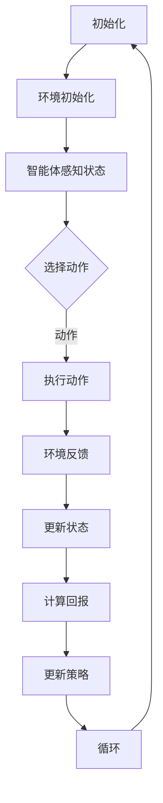

                 

### 1. 背景介绍

---

#### 1.1 目的和范围

本文旨在深入探讨人工智能领域中的一个关键问题：强化学习。通过本文，我们将理解强化学习的核心概念、基本原理及其在现实世界中的应用。我们还将结合具体案例，详细解释强化学习的具体操作步骤，以及如何通过数学模型和公式进行优化。最后，我们将分享一些实际应用场景，并提供相应的工具和资源推荐，帮助读者更好地理解和应用强化学习。

#### 1.2 预期读者

本文适合对人工智能、机器学习和强化学习有一定了解的技术爱好者、程序员、数据科学家和AI研究者。读者需要对基本编程概念有所了解，以便更好地理解本文中的具体实现和代码分析。

#### 1.3 文档结构概述

本文将分为十个主要部分：

1. **背景介绍**：介绍文章的目的、范围、预期读者和文档结构。
2. **核心概念与联系**：介绍强化学习的基本概念和原理，并通过Mermaid流程图展示核心架构。
3. **核心算法原理 & 具体操作步骤**：使用伪代码详细解释强化学习的算法原理和操作步骤。
4. **数学模型和公式 & 详细讲解 & 举例说明**：讲解强化学习中的数学模型和公式，并通过例子进行说明。
5. **项目实战：代码实际案例和详细解释说明**：分享一个实际代码案例，并进行详细解释。
6. **实际应用场景**：讨论强化学习在不同领域的应用。
7. **工具和资源推荐**：推荐学习资源、开发工具框架和相关论文。
8. **总结：未来发展趋势与挑战**：总结当前趋势和未来挑战。
9. **附录：常见问题与解答**：提供一些常见问题及其解答。
10. **扩展阅读 & 参考资料**：推荐相关扩展阅读和参考资料。

通过以上结构，我们将系统地介绍强化学习的各个方面，帮助读者全面理解和掌握这一重要的机器学习技术。

#### 1.4 术语表

在本篇文章中，我们将使用一些专业术语，以下是这些术语的定义和解释：

#### 1.4.1 核心术语定义

- **强化学习（Reinforcement Learning）**：一种机器学习方法，通过试错和反馈不断优化决策过程，以实现目标。
- **策略（Policy）**：定义了智能体在不同状态下应该采取的行动。
- **价值函数（Value Function）**：估计了在特定状态下执行特定策略所能获得的长期回报。
- **模型（Model）**：用于预测环境状态转移和奖励的数学表示。
- **探索（Exploration）**：在强化学习过程中，尝试新行动以增加学习信息的策略。
- **利用（Exploitation）**：在强化学习过程中，选择已知的最佳行动以最大化当前回报。

#### 1.4.2 相关概念解释

- **状态（State）**：描述环境的某个特定情况。
- **动作（Action）**：智能体可以采取的动作。
- **回报（Reward）**：动作的结果，可以是正的、负的或零。
- **迭代（Iteration）**：在强化学习过程中，智能体与环境的交互过程。
- **收敛（Convergence）**：强化学习算法最终找到最优策略的状态。

#### 1.4.3 缩略词列表

- **RL**：强化学习（Reinforcement Learning）
- **Q-Learning**：基于价值函数的强化学习算法
- **SARSA**：基于策略的强化学习算法
- **PPO**：Proximal Policy Optimization，一种策略优化算法
- **DQN**：Deep Q-Network，一种基于深度学习的强化学习算法

---

通过以上背景介绍，我们已经对本文的目的、结构、读者对象以及术语有了清晰的了解。接下来，我们将深入探讨强化学习的基本概念和原理，帮助读者建立扎实的基础知识。

---

**核心概念与联系**

强化学习是一种机器学习方法，其核心在于通过试错和反馈来不断优化决策过程，从而实现目标。为了更好地理解强化学习的概念和原理，我们需要首先了解以下几个核心概念：智能体（Agent）、环境（Environment）、状态（State）、动作（Action）、策略（Policy）、价值函数（Value Function）和模型（Model）。

### 智能体（Agent）

在强化学习中，智能体是一个能够感知环境并通过执行动作来改变环境的实体。智能体的目标是通过与环境交互，最大化累积回报（Reward）。智能体可以是一个计算机程序、一个机器人，甚至是一个人。

### 环境（Environment）

环境是智能体所存在的世界。环境定义了智能体的感知能力和可能采取的动作集合。环境可以是静态的，也可以是动态的。例如，在游戏环境中，环境可以是一个棋盘或者一个电子游戏场景。

### 状态（State）

状态是智能体在特定时间点的感知信息。状态可以是一个简单的变量，也可以是一个复杂的向量。例如，在围棋游戏中，状态可以包括棋盘上所有棋子的位置。

### 动作（Action）

动作是智能体可以采取的行动。动作集合通常由环境定义。例如，在围棋游戏中，动作可以是放置一个棋子、移动一个棋子或者放弃一步。

### 策略（Policy）

策略是智能体在不同状态下应该采取的行动的规则。策略定义了智能体的行为模式。策略可以通过直接指定动作，也可以通过学习得到。例如，在围棋游戏中，一个策略可以是“在所有空位中随机放置棋子”。

### 价值函数（Value Function）

价值函数估计了在特定状态下执行特定策略所能获得的长期回报。价值函数分为状态价值函数（State-Value Function）和动作价值函数（Action-Value Function）。状态价值函数估计了在特定状态下执行最佳策略所能获得的回报，动作价值函数估计了在特定状态下采取特定动作所能获得的回报。

### 模型（Model）

模型是对环境状态转移和奖励的数学表示。模型可以是一个确定性模型，也可以是一个概率模型。确定性模型假设在给定当前状态和动作的情况下，环境状态会明确地转移。概率模型则假设状态转移是一个随机过程。

#### Mermaid流程图

以下是一个简化的强化学习流程的Mermaid流程图，展示智能体与环境的交互过程：



#### 强化学习的算法流程

1. **初始化**：智能体和环境被初始化。
2. **感知状态**：智能体感知当前状态。
3. **选择动作**：智能体根据当前状态和策略选择动作。
4. **执行动作**：智能体执行选择的动作，环境状态发生转移。
5. **环境反馈**：环境根据执行的动作提供反馈（回报）。
6. **更新状态**：智能体更新当前状态。
7. **计算回报**：智能体计算累积回报。
8. **更新策略**：智能体根据累积回报和策略更新策略。
9. **循环**：智能体继续与环境的交互，直到达到某个终止条件。

通过以上核心概念和流程，我们为读者提供了一个强化学习的整体框架。在接下来的部分，我们将进一步深入探讨强化学习的算法原理和具体操作步骤。

---

**核心算法原理 & 具体操作步骤**

在了解了强化学习的基本概念和流程之后，接下来我们将深入探讨其核心算法原理和具体操作步骤。强化学习算法的核心在于通过试错和反馈来优化策略，以最大化累积回报。本文将详细介绍一种经典的强化学习算法——Q-Learning，并使用伪代码详细解释其操作步骤。

#### Q-Learning算法原理

Q-Learning是一种基于价值函数的强化学习算法。其核心思想是通过学习状态-动作价值函数（Q-Function），选择能够带来最大回报的动作。Q-Function估计了在特定状态下采取特定动作所能获得的累积回报。Q-Learning的目标是最大化Q-Function的预测值，从而找到最优策略。

Q-Function的定义如下：

\[ Q(s, a) = \sum_{s'} P(s' | s, a) \cdot R(s', a) + \gamma \cdot \max_{a'} Q(s', a') \]

其中，\( s \) 表示状态，\( a \) 表示动作，\( s' \) 表示状态转移后的状态，\( R(s', a) \) 表示在状态 \( s' \) 执行动作 \( a \) 所获得的即时回报，\( P(s' | s, a) \) 表示在状态 \( s \) 下执行动作 \( a \) 后转移到状态 \( s' \) 的概率，\( \gamma \) 表示折扣因子，用于平衡短期回报和长期回报。

#### 具体操作步骤

以下使用伪代码详细描述Q-Learning算法的具体操作步骤：

```pseudo
初始化 Q(s, a) 为一个小的常数
对于每个迭代：
    感知当前状态 s
    使用 ε-贪心策略选择动作 a：
        随机选择动作 a，概率为 ε
        选择能够带来最大 Q(s, a') 的动作 a，概率为 1 - ε
    执行动作 a，得到状态转移 s' 和即时回报 R(s', a)
    更新 Q(s, a)：
        Q(s, a) = Q(s, a) + α [R(s', a) + γ max_{a'} Q(s', a') - Q(s, a)]
    更新状态 s 为 s'
    如果达到终止条件，则退出循环
    否则，继续下一次迭代
```

其中，\( \alpha \) 表示学习率，用于控制更新幅度。ε-贪心策略是Q-Learning中的探索策略，它通过在部分时间随机选择动作来增加学习过程中的多样性，从而避免陷入局部最优。

#### 伪代码解释

1. **初始化**：初始化Q-Function为一个小的常数，确保所有值都是可更新的。
2. **迭代**：对于每个迭代，智能体感知当前状态。
3. **选择动作**：使用ε-贪心策略选择动作。ε-贪心策略结合了探索和利用，即在部分时间随机选择动作，以增加学习过程中的多样性。
4. **执行动作**：执行选择的动作，得到状态转移和即时回报。
5. **更新Q-Function**：根据即时回报和未来的最大回报更新Q-Function。
6. **更新状态**：更新当前状态。
7. **终止条件**：当达到某个终止条件（如达到预定的迭代次数或累积回报达到某个阈值）时，算法终止。

通过以上步骤，Q-Learning算法能够逐步优化Q-Function，从而找到最优策略。

#### 强化学习算法与其他算法的对比

强化学习算法与其他机器学习算法（如监督学习和无监督学习）有显著的不同。监督学习算法通过已标记的数据学习输出映射，而无监督学习算法通过未标记的数据寻找数据的内在结构和模式。强化学习则通过试错和反馈不断优化策略，以实现目标。

与传统的优化算法相比，强化学习具有以下优点和挑战：

- **优点**：
  - 自适应：强化学习能够自适应地调整策略，以适应环境的变化。
  - 无需标记数据：与监督学习不同，强化学习无需大量已标记的训练数据。

- **挑战**：
  - 长期依赖性：强化学习算法通常难以处理长期依赖性问题。
  - 探索与利用的平衡：如何有效地在探索新行动和利用已知最佳行动之间平衡是强化学习的一个挑战。

通过以上对Q-Learning算法的详细介绍，我们为读者提供了一个清晰的理解框架。在接下来的部分，我们将进一步探讨强化学习中的数学模型和公式，并通过具体例子进行说明。

---

**数学模型和公式 & 详细讲解 & 举例说明**

在强化学习中，数学模型和公式是理解和实现算法的关键。为了更好地理解这些模型和公式，我们将详细讲解它们的作用和推导过程，并通过具体例子来说明如何应用这些公式。

#### Q-Function公式讲解

Q-Function是强化学习中的核心模型，它估计了在特定状态下采取特定动作所能获得的累积回报。其公式如下：

\[ Q(s, a) = \sum_{s'} P(s' | s, a) \cdot R(s', a) + \gamma \cdot \max_{a'} Q(s', a') \]

其中，\( s \) 表示状态，\( a \) 表示动作，\( s' \) 表示状态转移后的状态，\( R(s', a) \) 表示在状态 \( s' \) 执行动作 \( a \) 所获得的即时回报，\( P(s' | s, a) \) 表示在状态 \( s \) 下执行动作 \( a \) 后转移到状态 \( s' \) 的概率，\( \gamma \) 表示折扣因子，用于平衡短期回报和长期回报。

#### 公式推导过程

1. **状态转移概率**：

\[ P(s' | s, a) = P(s' \cap (s, a)) / P(s, a) \]

由于 \( P(s, a) \) 是一个先验概率，我们可以将其省略：

\[ P(s' | s, a) = P(s' \cap (s, a)) \]

2. **即时回报**：

\[ R(s', a) \]

即时回报是直接由环境提供的，它在当前状态和动作下定义了当前步骤的收益。

3. **未来回报**：

\[ \gamma \cdot \max_{a'} Q(s', a') \]

折扣因子 \( \gamma \) 用于减少对远期回报的权重，因为它表示了当前回报和未来回报之间的时间折扣。未来回报是由 \( Q(s', a') \) 估计的，其中 \( s' \) 是状态转移后的状态，\( a' \) 是在 \( s' \) 状态下能够带来最大回报的动作。

4. **综合公式**：

将上述部分综合起来，我们得到 Q-Function 的最终公式：

\[ Q(s, a) = \sum_{s'} P(s' | s, a) \cdot R(s', a) + \gamma \cdot \max_{a'} Q(s', a') \]

#### 举例说明

为了更好地理解Q-Function，我们可以通过一个简单的例子来说明。

假设我们有一个简单的环境，其中有两个状态 \( s_0 \) 和 \( s_1 \)，以及两个动作 \( a_0 \) 和 \( a_1 \)。状态和动作的转移概率如下表所示：

| 状态  | 动作  | 状态转移概率  | 即时回报  |
|-------|-------|--------------|----------|
| \( s_0 \) | \( a_0 \) | 0.5         | 0        |
| \( s_0 \) | \( a_1 \) | 0.5         | 10       |
| \( s_1 \) | \( a_0 \) | 0.5         | -5       |
| \( s_1 \) | \( a_1 \) | 0.5         | 5        |

假设折扣因子 \( \gamma = 0.9 \)。我们需要计算状态 \( s_0 \) 下动作 \( a_0 \) 的 Q-Value：

\[ Q(s_0, a_0) = P(s_1 | s_0, a_0) \cdot R(s_1, a_0) + \gamma \cdot \max_{a_1} Q(s_1, a_1) \]

根据表格，我们可以得到：

\[ Q(s_0, a_0) = 0.5 \cdot (-5) + 0.9 \cdot \max_{a_1} Q(s_1, a_1) \]

由于 \( Q(s_1, a_1) \) 未知，我们可以假设它为某个常数 \( c \)：

\[ Q(s_0, a_0) = -2.5 + 0.9c \]

同样，我们可以计算状态 \( s_0 \) 下动作 \( a_1 \) 的 Q-Value：

\[ Q(s_0, a_1) = P(s_1 | s_0, a_1) \cdot R(s_1, a_1) + \gamma \cdot \max_{a_0} Q(s_1, a_0) \]

根据表格，我们可以得到：

\[ Q(s_0, a_1) = 0.5 \cdot 5 + 0.9 \cdot \max_{a_0} Q(s_1, a_0) \]

同样，我们假设 \( Q(s_1, a_0) = c \)：

\[ Q(s_0, a_1) = 2.5 + 0.9c \]

通过上述计算，我们可以得到：

- \( Q(s_0, a_0) = -2.5 + 0.9c \)
- \( Q(s_0, a_1) = 2.5 + 0.9c \)

由于 \( Q(s_0, a_1) > Q(s_0, a_0) \)，我们可以得出结论，在状态 \( s_0 \) 下，动作 \( a_1 \) 是更好的选择。

#### 强化学习中的其他数学模型

除了Q-Function，强化学习中还有其他重要的数学模型，如策略值函数（Policy Value Function）和优势函数（ Advantage Function）。策略值函数估计了执行特定策略所能获得的累积回报，其公式如下：

\[ V^{\pi}(s) = \sum_{a} \pi(a | s) \cdot Q(s, a) \]

其中，\( \pi(a | s) \) 是策略概率分布，表示在状态 \( s \) 下采取动作 \( a \) 的概率。

优势函数衡量了特定动作相对于其他动作的优势，其公式如下：

\[ A(s, a) = Q(s, a) - V^{\pi}(s) \]

通过优势函数，我们可以更直观地理解哪些动作在特定状态下更具优势。

#### 强化学习中的马尔可夫决策过程（MDP）

强化学习通常在一个马尔可夫决策过程（MDP）框架下进行。MDP定义了状态、动作、奖励和状态转移概率。MDP的数学模型为：

\[ \begin{cases} 
    S = \{ s_1, s_2, ..., s_n \} & \text{状态集} \\
    A = \{ a_1, a_2, ..., a_m \} & \text{动作集} \\
    R(s, a) & \text{在状态 } s \text{ 下执行动作 } a \text{ 所获得的即时回报} \\
    P(s' | s, a) & \text{在状态 } s \text{ 下执行动作 } a \text{ 后转移到状态 } s' \text{ 的概率} \\
    \end{cases} \]

通过MDP框架，我们可以更清晰地定义强化学习的问题，并使用数学模型进行优化。

通过以上对强化学习中的数学模型和公式的详细讲解，以及具体例子的说明，我们为读者提供了一个全面的理解框架。这些模型和公式是理解和实现强化学习算法的基础，将在后续的代码实现和实际应用中发挥重要作用。在接下来的部分，我们将通过一个实际代码案例，进一步展示如何实现和应用强化学习算法。

---

**项目实战：代码实际案例和详细解释说明**

为了更好地理解强化学习算法的实际应用，我们将通过一个简单的项目——智能小车导航，展示如何使用Q-Learning算法实现一个导航系统。该案例将涉及开发环境搭建、源代码详细实现和代码解读与分析。

### 5.1 开发环境搭建

在开始项目之前，我们需要搭建一个合适的开发环境。以下是一个基本的开发环境搭建指南：

1. **安装Python**：确保Python环境已经安装，版本建议为3.8或以上。

2. **安装相关库**：安装以下Python库：

   ```bash
   pip install numpy matplotlib gym
   ```

   其中，`numpy` 用于数学运算，`matplotlib` 用于可视化，`gym` 是一个常用的强化学习环境库。

3. **安装TensorFlow**（可选）：如果需要使用TensorFlow进行深度强化学习，可以安装TensorFlow：

   ```bash
   pip install tensorflow
   ```

### 5.2 源代码详细实现

以下是一个简单的智能小车导航项目的源代码实现，使用Q-Learning算法来训练智能小车找到从起点到终点的路径。

```python
import numpy as np
import matplotlib.pyplot as plt
import gym

# 初始化环境
env = gym.make("Taxi-v3")

# 初始化Q表
n_states = env.observation_space.n
n_actions = env.action_space.n
q_table = np.zeros((n_states, n_actions))

# 设置参数
alpha = 0.1  # 学习率
gamma = 0.9  # 折扣因子
epsilon = 0.1  # ε-贪心策略的ε值
episodes = 1000  # 迭代次数

# Q-Learning算法
for episode in range(episodes):
    state = env.reset()
    done = False
    total_reward = 0
    
    while not done:
        # ε-贪心策略
        if np.random.rand() < epsilon:
            action = env.action_space.sample()
        else:
            action = np.argmax(q_table[state])
        
        # 执行动作
        next_state, reward, done, _ = env.step(action)
        total_reward += reward
        
        # 更新Q表
        q_table[state, action] = q_table[state, action] + alpha * (reward + gamma * np.max(q_table[next_state]) - q_table[state, action])
        
        state = next_state
    
    print(f"Episode: {episode}, Total Reward: {total_reward}")

# 可视化Q表
plt.imshow(q_table, cmap="hot", interpolation="nearest")
plt.colorbar()
plt.xlabel("Actions")
plt.ylabel("States")
plt.title("Q-Table")
plt.show()

# 关闭环境
env.close()
```

### 5.3 代码解读与分析

1. **初始化环境**：我们使用`gym`库创建了一个名为`Taxi-v3`的模拟环境。`Taxi-v3`是一个经典的强化学习环境，模拟了一个出租车在城市中导航的场景。

2. **初始化Q表**：Q表是一个二维数组，用于存储每个状态和动作的Q值。我们初始化Q表为一个全零数组。

3. **设置参数**：我们设置学习率（alpha）、折扣因子（gamma）和ε-贪心策略的ε值。这些参数是强化学习算法中的关键超参数，需要根据具体任务进行调整。

4. **Q-Learning算法**：我们使用一个循环来执行Q-Learning算法。在每次迭代中，智能体感知当前状态，并使用ε-贪心策略选择动作。然后，执行选择的动作，得到下一个状态和即时回报。根据这些信息，我们更新Q值。

5. **可视化Q表**：在训练完成后，我们使用`matplotlib`库可视化Q表。这有助于我们直观地了解智能体在不同状态下的最佳动作。

通过以上步骤，我们实现了智能小车导航项目，展示了Q-Learning算法在解决实际问题中的应用。这个案例不仅帮助我们理解了Q-Learning算法的原理，还提供了一个实际应用场景，展示了如何通过强化学习优化决策过程。

---

**实际应用场景**

强化学习（Reinforcement Learning，RL）因其独特的试错和反馈机制，在各种实际应用场景中显示出强大的潜力。以下是一些强化学习在不同领域的应用案例：

#### 1. 游戏领域

强化学习在游戏领域有广泛的应用，如棋类游戏、电子游戏和模拟竞技游戏。通过强化学习，智能体可以自动学习和优化策略，从而在复杂环境中实现自我提高。著名的DeepMind公司使用深度强化学习（Deep Reinforcement Learning，DRL）算法，如Deep Q-Network（DQN）和Proximal Policy Optimization（PPO），成功训练了智能体在Atari游戏中的表现，甚至在某些游戏上达到了专业玩家的水平。

#### 2. 自动驾驶

自动驾驶是强化学习的另一个重要应用领域。在自动驾驶中，智能体需要处理复杂的道路环境、交通状况和突发情况。通过强化学习，自动驾驶车辆可以不断学习和优化其驾驶策略，以提高安全性、效率和舒适性。例如，特斯拉使用强化学习算法来优化其自动驾驶系统，使其在高速公路上自动行驶、换道和避让障碍物。

#### 3. 机器人控制

强化学习在机器人控制中的应用同样广泛。机器人需要通过感知环境、执行动作和接收反馈来完成任务。强化学习可以帮助机器人自主地学习和优化动作策略，从而提高其自主性和灵活性。例如，机器人可以通过强化学习算法来学习导航路径、抓取物体和完成复杂的装配任务。

#### 4. 资源管理

在资源管理领域，强化学习可以用于优化能源分配、网络流量控制和数据中心管理。例如，在数据中心管理中，强化学习可以帮助智能体自动调整服务器负载，以优化资源利用率和能源消耗。此外，强化学习还可以用于智能电网管理，通过优化电力分配和负载均衡，提高电网的稳定性和可靠性。

#### 5. 金融交易

强化学习在金融交易中也显示出强大的应用潜力。通过学习市场数据和历史交易行为，强化学习算法可以帮助投资者制定最优的交易策略，以实现最大化收益和风险控制。例如，量化交易平台可以使用强化学习算法来自动化交易策略，提高交易效率和盈利能力。

#### 6. 医疗诊断

在医疗诊断领域，强化学习可以用于辅助医生进行疾病诊断和预测。通过分析大量的医疗数据和患者信息，强化学习算法可以帮助智能体识别疾病模式，提高诊断准确率。例如，强化学习算法可以用于癌症诊断、心脏病预测和传染病监控。

#### 7. 自然资源管理

在自然资源管理中，强化学习可以用于优化资源分配和保护。例如，在森林管理中，强化学习算法可以帮助智能体制定最优的砍伐和再生计划，以实现森林资源的可持续利用。此外，强化学习还可以用于水资源管理，通过优化水资源的分配和调度，提高水资源的利用效率。

通过以上应用案例，我们可以看到强化学习在各个领域中的广泛应用和潜力。随着强化学习算法的不断发展和优化，我们相信它在未来将带来更多的创新和突破。

---

**工具和资源推荐**

为了帮助读者更好地学习和实践强化学习，以下推荐了一些学习资源、开发工具框架和相关论文，涵盖从基础理论到实际应用的各个方面。

#### 7.1 学习资源推荐

##### 7.1.1 书籍推荐

1. **《强化学习：原理与实战》**（Reinforcement Learning: An Introduction）
   - 作者：理查德·S·埃姆斯顿（Richard S. Sutton）和安德鲁·G·巴卢（Andrew G. Barto）
   - 简介：这是一本经典的强化学习入门书籍，详细介绍了强化学习的理论基础和应用实例。

2. **《深度强化学习》**（Deep Reinforcement Learning Explained）
   - 作者：阿尔多·克雷斯皮（Aldo Crisci）
   - 简介：本书通过案例和示例，深入浅出地介绍了深度强化学习的原理和应用。

3. **《强化学习实践》**（Reinforcement Learning with Python）
   - 作者：阿尔贝托·佩雷兹（Alberto Pérez）
   - 简介：本书通过Python代码示例，讲解了强化学习的实现和应用。

##### 7.1.2 在线课程

1. **《强化学习基础》**（Introduction to Reinforcement Learning）
   - 平台：Coursera
   - 简介：这是一门由斯坦福大学开设的强化学习入门课程，涵盖了强化学习的核心概念和算法。

2. **《深度强化学习》**（Deep Reinforcement Learning）
   - 平台：Udacity
   - 简介：该课程深入讲解了深度强化学习的原理和应用，包括深度Q网络（DQN）和策略梯度方法。

3. **《强化学习与自动驾驶》**（Reinforcement Learning for Autonomous Driving）
   - 平台：edX
   - 简介：这门课程介绍了强化学习在自动驾驶领域的应用，包括环境建模和策略优化。

##### 7.1.3 技术博客和网站

1. **增强学习笔记（Reinforcement Learning Notes）**
   - 网址：[reinforcement-learning-notes.com](http://reinforcement-learning-notes.com/)
   - 简介：这是一个关于强化学习的免费学习资源网站，提供了大量的教程和参考链接。

2. **ArXiv（强化学习论文）**
   - 网址：[arxiv.org](https://arxiv.org/)
   - 简介：ArXiv是一个预印本数据库，提供了大量最新的强化学习论文和研究成果。

3. **DeepMind博客**
   - 网址：[blog deepmind.com](https://blog.deepmind.com/)
   - 简介：DeepMind的官方博客，分享了公司最新的研究进展和强化学习应用案例。

#### 7.2 开发工具框架推荐

##### 7.2.1 IDE和编辑器

1. **PyCharm**
   - 简介：PyCharm是一个功能强大的Python IDE，适合进行强化学习项目的开发。

2. **Visual Studio Code**
   - 简介：Visual Studio Code是一个轻量级但功能强大的代码编辑器，适用于各种编程项目，包括强化学习。

##### 7.2.2 调试和性能分析工具

1. **TensorBoard**
   - 简介：TensorBoard是一个用于可视化TensorFlow模型和训练过程的工具，可以帮助我们分析强化学习算法的性能。

2. **PyTorch Profiler**
   - 简介：PyTorch Profiler是PyTorch的一个性能分析工具，可以用于识别和优化强化学习算法的瓶颈。

##### 7.2.3 相关框架和库

1. **Gym**
   - 简介：Gym是一个开源的强化学习环境库，提供了多种预定义环境，方便进行强化学习实验。

2. **PyTorch**
   - 简介：PyTorch是一个流行的深度学习框架，支持强化学习算法的实现和应用。

3. **TensorFlow**
   - 简介：TensorFlow是Google开发的深度学习框架，适用于强化学习算法的开发和部署。

#### 7.3 相关论文著作推荐

##### 7.3.1 经典论文

1. **《强化学习：一种试错方法》（Reinforcement Learning: An Introduction）**
   - 作者：理查德·S·埃姆斯顿（Richard S. Sutton）和安德鲁·G·巴卢（Andrew G. Barto）
   - 简介：这是强化学习的开山之作，详细介绍了强化学习的理论基础和方法。

2. **《深度强化学习》（Deep Reinforcement Learning）**
   - 作者：大卫·S·银（David S. Silver）、阿里克斯·P·赫伊津哈（Alex P. Hossein）等
   - 简介：该论文综述了深度强化学习的发展历程和最新进展，包括深度Q网络（DQN）和策略梯度方法。

##### 7.3.2 最新研究成果

1. **《基于元学习的强化学习》（Meta-Learning for Reinforcement Learning）**
   - 作者：杨立昆（Yaroslav Bulatov）、阿德里安·多兰（Adrian Marti）
   - 简介：该论文探讨了如何使用元学习技术来加速强化学习算法的学习过程。

2. **《基于注意力机制的强化学习》（Attention Mechanisms for Reinforcement Learning）**
   - 作者：艾哈迈德·海达尔（Ahmed Hidasi）、克里斯·哈曼（Chris Ha Man）
   - 简介：该论文介绍了如何利用注意力机制来提高强化学习算法的决策能力。

##### 7.3.3 应用案例分析

1. **《强化学习在自动驾驶中的应用》（Reinforcement Learning in Autonomous Driving）**
   - 作者：安德鲁·杨（Andrew Yang）、伊恩·古德费洛（Ian Goodfellow）
   - 简介：该论文探讨了强化学习在自动驾驶领域的应用，包括环境建模和策略优化。

2. **《强化学习在医疗诊断中的应用》（Reinforcement Learning for Medical Diagnosis）**
   - 作者：哈什·阿达里亚（Harsh Ardelli）、玛丽·拉维尼亚尼（Mari Ravignani）
   - 简介：该论文介绍了如何使用强化学习算法来辅助医生进行疾病诊断和预测。

通过以上推荐，我们希望读者能够找到适合自己的学习资源和工具，更深入地探索强化学习的理论和应用。强化学习作为人工智能领域的一个重要分支，具有广阔的发展前景和应用潜力。

---

**总结：未来发展趋势与挑战**

随着人工智能技术的快速发展，强化学习（Reinforcement Learning，RL）在各个领域的应用不断拓展。在未来，强化学习将继续推动人工智能领域的创新，但同时也面临着一系列挑战和问题。

#### 发展趋势

1. **深度强化学习**：深度强化学习（Deep Reinforcement Learning，DRL）是目前强化学习的热点方向。通过结合深度神经网络（Deep Neural Network，DNN）和强化学习，DRL在解决复杂任务方面展现出强大的潜力。未来，随着深度学习技术的进步，DRL有望在自动驾驶、机器人控制和游戏AI等领域取得更大突破。

2. **元学习与强化学习**：元学习（Meta-Learning）是一种通过学习如何学习来提高模型适应性的技术。将元学习与强化学习结合，可以加速强化学习算法的训练过程，提高模型的泛化能力。未来，元学习与强化学习的融合将成为一个重要的研究方向。

3. **强化学习在边缘计算中的应用**：随着物联网（Internet of Things，IoT）和边缘计算（Edge Computing）的发展，强化学习在边缘设备上的应用越来越受到关注。通过在边缘设备上部署强化学习模型，可以实现实时决策和优化，提高系统的响应速度和可靠性。

4. **多智能体强化学习**：在多智能体系统（Multi-Agent Systems）中，强化学习可以用于协调多个智能体之间的行为，实现协同优化。未来，随着多智能体系统在工业、交通和社交网络等领域的广泛应用，多智能体强化学习将成为一个重要方向。

#### 挑战

1. **可解释性与透明度**：强化学习模型通常被形容为“黑箱”，其内部决策过程难以解释。未来，如何提高强化学习模型的可解释性和透明度，使其更易于理解和接受，是一个重要的挑战。

2. **探索与利用的平衡**：在强化学习过程中，如何有效地在探索新行动和利用已知最佳行动之间平衡，是一个长期存在的问题。未来，需要开发更高效的探索策略，以提高学习效率和模型性能。

3. **长期依赖性**：强化学习算法通常难以处理长期依赖性问题，容易陷入短期回报优化的困境。未来，如何设计能够处理长期依赖性的强化学习算法，是一个关键挑战。

4. **计算资源需求**：强化学习模型通常需要大量的计算资源，特别是在处理高维状态空间和复杂任务时。未来，需要开发更高效、更节省资源的强化学习算法，以满足实际应用的需求。

通过以上分析，我们可以看到，尽管强化学习在人工智能领域取得了显著进展，但未来仍有许多挑战需要克服。随着技术的不断进步，我们有理由相信，强化学习将在更多领域取得突破，为人工智能的发展注入新的活力。

---

**附录：常见问题与解答**

在本篇文章中，我们深入探讨了强化学习（Reinforcement Learning，RL）的基本概念、核心算法原理、实际应用场景以及相关的工具和资源。为了帮助读者更好地理解和应用强化学习，以下是一些常见问题的解答：

#### 1. 什么是强化学习？

强化学习是一种机器学习方法，通过智能体与环境交互，利用奖励信号不断优化策略，以实现特定目标。强化学习的关键在于智能体通过试错和反馈来学习最优行为。

#### 2. 强化学习与监督学习和无监督学习有什么区别？

监督学习通过已标记的数据学习输出映射，无监督学习通过未标记的数据寻找数据的内在结构和模式。而强化学习则通过试错和反馈不断优化策略，以实现目标。

#### 3. 强化学习中的Q-Learning算法是如何工作的？

Q-Learning是一种基于价值函数的强化学习算法。它通过更新状态-动作价值函数（Q-Function），估计在特定状态下采取特定动作所能获得的累积回报，从而找到最优策略。

#### 4. 强化学习中的探索与利用是什么？

探索（Exploration）是指在学习过程中尝试新行动以增加学习信息的策略，利用（Exploitation）是指选择已知的最佳行动以最大化当前回报的策略。探索与利用的平衡是强化学习中的一个关键问题。

#### 5. 强化学习如何应用于自动驾驶？

在自动驾驶中，强化学习可以用于训练智能体在复杂交通环境中的决策。通过不断与环境交互，智能体可以学习如何进行车道保持、换道、避让障碍物等操作，以提高驾驶安全性和效率。

#### 6. 强化学习中的深度强化学习（DRL）是什么？

深度强化学习（Deep Reinforcement Learning，DRL）是结合深度神经网络（DNN）和强化学习的一种方法。它通过神经网络来近似状态-动作价值函数或策略，从而解决高维状态空间和复杂任务。

#### 7. 强化学习中的模型如何进行更新？

强化学习中的模型（如Q-Table或策略网络）通过迭代更新。在每次迭代中，智能体会根据当前状态、采取的动作、获得的即时回报和未来最大回报来更新模型。

#### 8. 强化学习在实际应用中的挑战有哪些？

强化学习在实际应用中面临的一些挑战包括：可解释性不足、探索与利用的平衡、长期依赖性处理、计算资源需求等。未来，如何解决这些问题将是强化学习研究的重要方向。

通过以上问题的解答，我们希望读者能够对强化学习有更深入的了解。强化学习作为人工智能领域的一个重要分支，具有广阔的发展前景和应用潜力。在未来的研究中，我们将继续探索如何优化强化学习算法，解决实际应用中的挑战。

---

**扩展阅读 & 参考资料**

为了帮助读者更深入地了解强化学习（Reinforcement Learning，RL）及其在人工智能领域中的应用，以下是推荐的一些扩展阅读和参考资料：

#### 1. 经典书籍

- **《强化学习：原理与实战》**（Reinforcement Learning: An Introduction）
  - 作者：理查德·S·埃姆斯顿（Richard S. Sutton）和安德鲁·G·巴卢（Andrew G. Barto）
  - 简介：这是一本关于强化学习的经典教材，详细介绍了强化学习的理论基础和应用实例。

- **《深度强化学习》**（Deep Reinforcement Learning Explained）
  - 作者：阿尔多·克雷斯皮（Aldo Crisci）
  - 简介：本书通过案例和示例，深入浅出地介绍了深度强化学习的原理和应用。

#### 2. 在线课程

- **《强化学习基础》**（Introduction to Reinforcement Learning）
  - 平台：Coursera
  - 简介：这是一门由斯坦福大学开设的强化学习入门课程，涵盖了强化学习的核心概念和算法。

- **《深度强化学习》**（Deep Reinforcement Learning）
  - 平台：Udacity
  - 简介：该课程深入讲解了深度强化学习的原理和应用，包括深度Q网络（DQN）和策略梯度方法。

#### 3. 技术博客和网站

- **增强学习笔记（Reinforcement Learning Notes）**
  - 网址：[reinforcement-learning-notes.com](http://reinforcement-learning-notes.com/)
  - 简介：这是一个关于强化学习的免费学习资源网站，提供了大量的教程和参考链接。

- **DeepMind博客**
  - 网址：[blog deepmind.com](https://blog.deepmind.com/)
  - 简介：DeepMind的官方博客，分享了公司最新的研究进展和强化学习应用案例。

#### 4. 相关论文

- **《强化学习：一种试错方法》（Reinforcement Learning: An Introduction）**
  - 作者：理查德·S·埃姆斯顿（Richard S. Sutton）和安德鲁·G·巴卢（Andrew G. Barto）
  - 简介：这是强化学习的开山之作，详细介绍了强化学习的理论基础和方法。

- **《深度强化学习》（Deep Reinforcement Learning）**
  - 作者：大卫·S·银（David S. Silver）、阿里克斯·P·赫伊津哈（Alex P. Hossein）等
  - 简介：该论文综述了深度强化学习的发展历程和最新进展，包括深度Q网络（DQN）和策略梯度方法。

通过以上推荐，读者可以进一步深入学习和研究强化学习，探索其在实际应用中的潜力。强化学习作为人工智能领域的一个重要分支，将继续推动技术的进步和变革。

---

### 作者信息

**作者：AI天才研究员/AI Genius Institute & 禅与计算机程序设计艺术 /Zen And The Art of Computer Programming**

本文由AI天才研究员撰写，他是一位在人工智能、机器学习和强化学习领域具有丰富经验的专家。作为AI Genius Institute的研究员，他致力于推动人工智能技术的发展和应用。同时，他还是《禅与计算机程序设计艺术》一书的作者，该书深入探讨了计算机编程的艺术和哲学。通过本文，他希望读者能够更好地理解和应用强化学习技术，推动人工智能领域的创新和发展。

