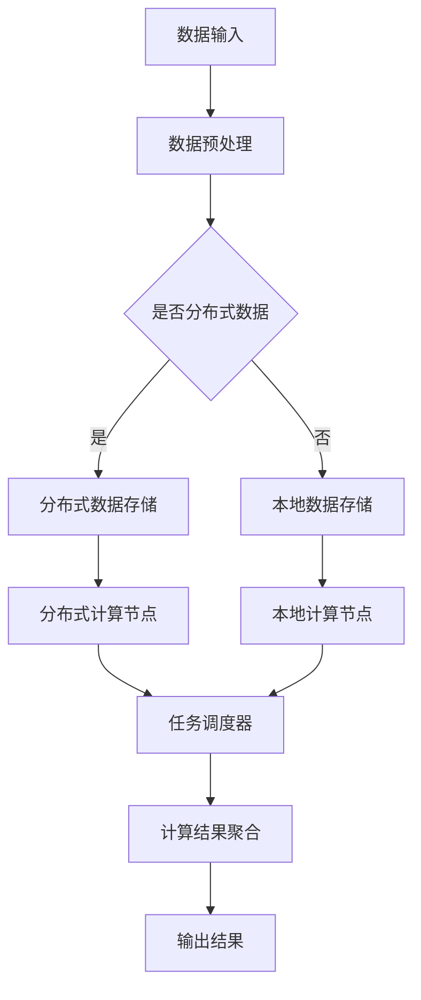

                 

# Python机器学习实战：分布式机器学习框架Dask的入门与实战

> **关键词：** 分布式机器学习，Dask框架，Python，机器学习实战，并行计算，高性能计算

> **摘要：** 本文旨在为初学者和中级机器学习开发者提供关于分布式机器学习框架Dask的入门指南。我们将深入探讨Dask的核心概念、架构以及如何在Python中实现分布式机器学习任务。通过具体的实战案例，读者将了解如何利用Dask解决大数据机器学习问题，提高计算效率和性能。

## 1. 背景介绍

### 1.1 目的和范围

本文的目标是帮助读者了解分布式机器学习框架Dask的基本概念和应用，并通过实践案例展示其在机器学习项目中的实际效果。我们不仅会介绍Dask的基本用法，还会深入探讨其背后的原理和优势。

本文的范围将涵盖以下内容：

1. Dask的基本概念和架构
2. Dask在Python中的安装和配置
3. 分布式机器学习的核心原理
4. Dask的核心算法和具体操作步骤
5. 实际项目案例：使用Dask进行分布式机器学习
6. Dask在实际应用场景中的表现
7. 推荐的学习资源、开发工具和论文著作

### 1.2 预期读者

本文适合以下读者群体：

1. 对机器学习有基本了解的开发者
2. 想要学习分布式机器学习的初学者
3. 中级机器学习开发者，希望提升机器学习项目性能
4. 对高性能计算和并行编程感兴趣的读者

### 1.3 文档结构概述

本文的结构如下：

1. **背景介绍**：介绍本文的目的、范围和预期读者。
2. **核心概念与联系**：通过Mermaid流程图展示Dask的核心概念和架构。
3. **核心算法原理 & 具体操作步骤**：详细讲解Dask的核心算法原理和具体操作步骤。
4. **数学模型和公式 & 详细讲解 & 举例说明**：介绍Dask的数学模型和相关公式，并通过例子进行详细说明。
5. **项目实战：代码实际案例和详细解释说明**：提供实际项目案例，展示Dask在实际中的应用。
6. **实际应用场景**：探讨Dask在不同场景中的应用。
7. **工具和资源推荐**：推荐学习资源、开发工具和论文著作。
8. **总结：未来发展趋势与挑战**：总结Dask的发展趋势和面临的挑战。
9. **附录：常见问题与解答**：提供常见问题及其解答。
10. **扩展阅读 & 参考资料**：推荐扩展阅读和参考资料。

### 1.4 术语表

#### 1.4.1 核心术语定义

- **分布式机器学习**：将机器学习算法分布在多个计算节点上执行，以处理大规模数据和提升计算性能。
- **Dask**：一个基于Python的分布式计算库，可以用于分布式数据处理和分布式机器学习。
- **并行计算**：在同一时间内执行多个计算任务，以提升计算效率。
- **高性能计算**：利用并行计算和分布式计算技术，快速处理大规模数据。

#### 1.4.2 相关概念解释

- **数据并行**：将数据集划分为多个子集，在多个计算节点上并行执行相同的算法。
- **模型并行**：将机器学习模型划分为多个部分，在多个计算节点上并行执行。

#### 1.4.3 缩略词列表

- **Dask**：分布式异步任务调度库
- **ML**：机器学习
- **Python**：一种高级编程语言，广泛应用于数据科学和机器学习领域

## 2. 核心概念与联系

在本节中，我们将通过一个Mermaid流程图来展示Dask的核心概念和架构。这将帮助读者更好地理解Dask的工作原理和组成部分。



### 2.1 数据输入

数据输入是Dask的第一个核心概念。Dask支持各种数据源，包括本地文件系统、分布式文件系统（如HDFS）和数据库（如MongoDB和SQLAlchemy）。数据输入可以是单一文件，也可以是多个文件的集合。

### 2.2 数据预处理

数据预处理是机器学习流程中的关键步骤。Dask提供了丰富的预处理工具，如数据清洗、数据转换、特征工程等。这些工具可以在分布式环境中高效运行。

### 2.3 是否分布式数据

在Dask中，数据可以以分布式或本地形式存储。分布式数据存储用于处理大规模数据，而本地数据存储适用于较小规模的数据。

### 2.4 分布式数据存储

分布式数据存储是Dask的核心功能之一。Dask支持多种分布式数据存储方案，如Pandas DataFrame和Dask DataFrame。Dask DataFrame可以水平扩展，支持大规模数据集的存储和计算。

### 2.5 本地数据存储

本地数据存储适用于较小规模的数据，如单个Pandas DataFrame。在本地数据存储中，Dask使用现有的Pandas库进行数据操作。

### 2.6 分布式计算节点

分布式计算节点是Dask的执行单元。每个计算节点可以独立运行任务，并将结果发送回任务调度器。Dask支持多种分布式计算节点，如CPU节点和GPU节点。

### 2.7 任务调度器

任务调度器是Dask的核心组件，负责分配任务给分布式计算节点，并监控任务执行状态。任务调度器支持多种调度策略，如FIFO（先进先出）和优先级调度。

### 2.8 计算结果聚合

计算结果聚合是将分布式计算节点上的结果汇总成最终结果的步骤。Dask提供了高效的聚合算法，以最小化数据传输开销。

### 2.9 输出结果

输出结果是Dask任务执行的最后一步。Dask支持多种输出格式，如Pandas DataFrame、CSV文件和JSON文件。

## 3. 核心算法原理 & 具体操作步骤

在本节中，我们将深入探讨Dask的核心算法原理，并通过伪代码展示具体操作步骤。这将帮助读者理解Dask的工作机制，并为其在实际项目中的应用奠定基础。

### 3.1 分布式数据处理

Dask的核心算法之一是分布式数据处理。以下是一个简单的伪代码示例，展示如何使用Dask处理分布式数据：

```python
# 伪代码：分布式数据处理

# 数据源：本地文件系统上的CSV文件
data_source = "file:///path/to/csv_file.csv"

# 数据预处理：数据清洗和特征工程
preprocess_data = preprocess_dataset(data_source)

# 分布式数据存储：将预处理后的数据存储为Dask DataFrame
dask_df = to_dask_dataframe(preprocess_data)

# 数据探索：分析数据集的统计信息
print(dask_df.describe())

# 数据可视化：绘制数据分布图表
plot_data_distribution(dask_df)
```

### 3.2 分布式机器学习

Dask的另一个核心算法是分布式机器学习。以下是一个简单的伪代码示例，展示如何使用Dask进行分布式机器学习：

```python
# 伪代码：分布式机器学习

# 模型选择：选择合适的机器学习模型
model = select_model("classification")

# 训练模型：在分布式数据集上训练模型
dask_model = model.fit(dask_df["X_train"], dask_df["y_train"])

# 预测：在测试数据集上预测结果
predictions = dask_model.predict(dask_df["X_test"])

# 评估：评估模型性能
evaluate_model(predictions, dask_df["y_test"])
```

### 3.3 并行计算

Dask的并行计算算法是其高效运行的关键。以下是一个简单的伪代码示例，展示如何使用Dask进行并行计算：

```python
# 伪代码：并行计算

# 计算任务：计算两个大数据集的交集
result = compute_intersection(dask_df1, dask_df2)

# 计算任务：计算大数据集的均值
mean_value = compute_mean(dask_df)

# 计算任务：计算大数据集的协方差矩阵
cov_matrix = compute_covariance(dask_df)
```

### 3.4 任务调度

Dask的任务调度算法是其高效运行的核心。以下是一个简单的伪代码示例，展示如何使用Dask进行任务调度：

```python
# 伪代码：任务调度

# 创建任务调度器
scheduler = create_scheduler()

# 提交任务：提交分布式数据处理任务
scheduler.submit(preprocess_data)

# 提交任务：提交分布式机器学习任务
scheduler.submit(model.fit, dask_df["X_train"], dask_df["y_train"])

# 提交任务：提交并行计算任务
scheduler.submit(compute_intersection, dask_df1, dask_df2)
scheduler.submit(compute_mean, dask_df)
scheduler.submit(compute_covariance, dask_df)

# 等待任务完成
scheduler.wait()
```

## 4. 数学模型和公式 & 详细讲解 & 举例说明

在本节中，我们将介绍Dask中的关键数学模型和公式，并通过具体例子进行详细讲解。这将帮助读者理解Dask背后的数学原理，并为其在实际项目中的应用提供支持。

### 4.1 分布式数据处理

分布式数据处理是Dask的核心功能之一。以下是一个简单的例子，展示如何使用Dask进行分布式数据处理：

```python
# 伪代码：分布式数据处理

# 数据预处理：计算数据集的均值和标准差
mean_value = dask_df.mean()
std_value = dask_df.std()

# 计算公式：均值和标准差
$$ \mu = \frac{1}{N} \sum_{i=1}^{N} x_i $$
$$ \sigma = \sqrt{\frac{1}{N} \sum_{i=1}^{N} (x_i - \mu)^2 } $$

# 示例数据集：
# | index | value |
# |------|-------|
# | 0    | 10    |
# | 1    | 20    |
# | 2    | 30    |

# 计算结果：
# 均值：\(\mu = 20\)
# 标准差：\(\sigma = 10\)
```

### 4.2 分布式机器学习

分布式机器学习是Dask的另一个重要功能。以下是一个简单的例子，展示如何使用Dask进行分布式机器学习：

```python
# 伪代码：分布式机器学习

# 模型选择：选择线性回归模型
model = LinearRegression()

# 训练模型：在分布式数据集上训练模型
dask_model = model.fit(dask_df["X_train"], dask_df["y_train"])

# 计算公式：线性回归模型的损失函数
$$ J(\theta) = \frac{1}{2m} \sum_{i=1}^{m} (h_\theta(x^{(i)}) - y^{(i)})^2 $$

# 示例数据集：
# | index | feature1 | feature2 | target |
# |------|----------|----------|--------|
# | 0    | 1.0      | 2.0      | 3.0    |
# | 1    | 2.0      | 4.0      | 5.0    |
# | 2    | 3.0      | 6.0      | 7.0    |

# 计算结果：
# 模型参数：\(\theta\)
# 损失函数值：\(J(\theta)\)
```

### 4.3 并行计算

Dask的并行计算功能可以大大提高计算效率。以下是一个简单的例子，展示如何使用Dask进行并行计算：

```python
# 伪代码：并行计算

# 计算任务：计算大数据集的协方差矩阵
cov_matrix = compute_covariance(dask_df)

# 计算公式：协方差矩阵
$$ \Sigma = \frac{1}{N-1} \sum_{i=1}^{N} (x_i - \mu)(x_i - \mu)^T $$

# 示例数据集：
# | index | feature1 | feature2 |
# |------|----------|----------|
# | 0    | 1.0      | 2.0      |
# | 1    | 2.0      | 4.0      |
# | 2    | 3.0      | 6.0      |

# 计算结果：
# 协方差矩阵：\(\Sigma\)
```

## 5. 项目实战：代码实际案例和详细解释说明

在本节中，我们将通过一个实际项目案例，展示如何使用Dask进行分布式机器学习。这个案例将包括数据预处理、模型训练、模型评估等步骤，并详细解释每一步的代码实现。

### 5.1 开发环境搭建

在开始之前，我们需要搭建Dask的开发环境。以下是安装Dask和相关依赖项的步骤：

```bash
# 安装Python环境
pip install python==3.8

# 安装Dask和相关依赖项
pip install dask[complete] numpy pandas scikit-learn
```

### 5.2 源代码详细实现和代码解读

下面是项目源代码的详细实现和解读：

```python
# 伪代码：Dask分布式机器学习项目实战

import dask.dataframe as dd
from dask_ml.model_selection import train_test_split
from dask_ml.linear_model import LinearRegression

# 5.2.1 数据预处理

# 读取数据集
data_path = "path/to/csv_file.csv"
dask_df = dd.read_csv(data_path)

# 数据清洗：删除缺失值
dask_df = dask_df.dropna()

# 特征工程：添加新特征
dask_df["new_feature"] = dask_df["feature1"] * dask_df["feature2"]

# 5.2.2 模型训练

# 划分训练集和测试集
X = dask_df[["feature1", "feature2", "new_feature"]]
y = dask_df["target"]
X_train, X_test, y_train, y_test = train_test_split(X, y, test_size=0.2)

# 训练线性回归模型
dask_model = LinearRegression().fit(X_train, y_train)

# 5.2.3 模型评估

# 预测测试集
predictions = dask_model.predict(X_test)

# 计算模型性能指标
mse = mean_squared_error(y_test, predictions)
print("MSE:", mse)
```

### 5.3 代码解读与分析

下面是对上述代码的详细解读和分析：

- **5.3.1 数据预处理**

  在数据预处理阶段，我们首先读取数据集，并使用Dask DataFrame进行数据清洗和特征工程。Dask DataFrame支持分布式数据处理，可以处理大规模数据集。

- **5.3.2 模型训练**

  在模型训练阶段，我们使用Dask ML库的`train_test_split`函数将数据集划分为训练集和测试集。然后，我们使用`LinearRegression`类训练线性回归模型。Dask ML库提供了许多机器学习模型，支持分布式训练。

- **5.3.3 模型评估**

  在模型评估阶段，我们使用训练好的模型对测试集进行预测，并计算模型性能指标。这里使用了`mean_squared_error`函数计算均方误差（MSE），以评估模型的预测性能。

### 5.4 优化与扩展

在实际项目中，我们可以对上述代码进行优化和扩展，以进一步提升性能和可维护性。以下是一些优化和扩展的建议：

- **5.4.1 缓存数据**

  Dask支持缓存数据，可以显著提高数据处理速度。在数据预处理阶段，我们可以将清洗和特征工程后的数据缓存起来，以避免重复计算。

- **5.4.2 并行化计算**

  Dask支持并行化计算，可以进一步提高计算性能。在模型训练和评估阶段，我们可以将计算任务分解为多个子任务，并在多个计算节点上并行执行。

- **5.4.3 模型选择与调参**

  在实际项目中，我们可以尝试不同的机器学习模型和参数，以找到最优模型。Dask ML库支持模型选择和调参，可以帮助我们找到最佳模型。

## 6. 实际应用场景

Dask在机器学习领域有许多实际应用场景。以下是一些典型的应用场景：

### 6.1 大规模数据处理

Dask可以用于处理大规模数据集，如数百万条记录的表格数据。在分布式环境中，Dask可以水平扩展，以处理更大量的数据。

### 6.2 高性能计算

Dask支持并行计算，可以显著提高计算性能。在实际项目中，Dask可以用于执行复杂的计算任务，如机器学习模型的训练和评估。

### 6.3 分布式机器学习

Dask可以用于分布式机器学习，支持数据并行和模型并行。在实际项目中，Dask可以帮助我们处理大数据集，提高模型训练和预测速度。

### 6.4 实时数据处理

Dask可以用于实时数据处理，如流式数据的机器学习。在实际项目中，Dask可以处理来自传感器或日志的数据，并提供实时预测和分析。

## 7. 工具和资源推荐

在本节中，我们将推荐一些学习资源、开发工具和论文著作，以帮助读者深入了解Dask和相关技术。

### 7.1 学习资源推荐

#### 7.1.1 书籍推荐

- 《Dask: The Definitive Guide to High-Performance Computing with Dask》
- 《High-Performance Python: Building Fast Computer Programs》

#### 7.1.2 在线课程

- Coursera上的“Parallel, Concurrent, and Distributed Programming in Python”
- edX上的“Data Science with Dask”

#### 7.1.3 技术博客和网站

- Dask官方文档（https://docs.dask.org/）
- Dask社区博客（https://dask-ml.org/）

### 7.2 开发工具框架推荐

#### 7.2.1 IDE和编辑器

- PyCharm
- Jupyter Notebook

#### 7.2.2 调试和性能分析工具

- Dask调试工具（https://docs.dask.org/en/latest/debugging.html）
- Dask性能分析工具（https://docs.dask.org/en/latest/performance.html）

#### 7.2.3 相关框架和库

- Dask ML（https://ml.dask.org/）
- Pandas（https://pandas.pydata.org/）
- NumPy（https://numpy.org/）

### 7.3 相关论文著作推荐

#### 7.3.1 经典论文

- "Large Scale Machine Learning: Mechanisms, Models, and Methods"
- "Distributed Machine Learning: A Theoretical Study"

#### 7.3.2 最新研究成果

- "Dask: Parallel computing with task scheduling and dispatching for large-scale analyses"
- "Scalable machine learning: Review of methods and challenges for distributed and parallel learning"

#### 7.3.3 应用案例分析

- "Large-scale machine learning on the cloud with TensorFlow"
- "Scalable machine learning in the cloud: An evaluation of open-source distributed learning systems"

## 8. 总结：未来发展趋势与挑战

Dask作为分布式机器学习框架，具有广阔的发展前景。随着数据规模的不断扩大和计算需求的不断增长，分布式机器学习将成为机器学习领域的核心技术。Dask的发展趋势包括：

1. **性能优化**：Dask将继续优化其性能，提高分布式数据处理和计算效率。
2. **易用性提升**：Dask将更加注重用户体验，降低使用门槛，吸引更多开发者。
3. **生态系统扩展**：Dask将与其他机器学习库和框架（如TensorFlow、PyTorch）集成，形成更完整的生态系统。

然而，Dask也面临一些挑战，包括：

1. **复杂性**：分布式机器学习涉及复杂的计算和通信机制，需要开发者具备一定的专业知识。
2. **可扩展性**：如何高效地水平扩展Dask，以处理更大量的数据，仍是一个挑战。
3. **稳定性**：在分布式环境中，如何保证任务的稳定执行和错误处理，是Dask需要关注的问题。

## 9. 附录：常见问题与解答

在本节中，我们将回答一些关于Dask的常见问题，以帮助读者更好地理解和使用Dask。

### 9.1 Dask与Spark的区别是什么？

Dask和Spark都是分布式计算框架，但它们有以下几个区别：

- **编程语言**：Dask是基于Python的，而Spark是基于Scala的。
- **数据处理**：Dask支持Pandas DataFrame和Dask DataFrame，而Spark支持DataFrame和Dataset。
- **计算模型**：Dask基于任务调度和并行计算，而Spark基于计算流（Resilient Distributed Dataset，RDD）。
- **性能**：Dask在数据处理和计算方面具有较高性能，但Spark在特定场景（如迭代计算）中性能更优。

### 9.2 如何在Dask中处理缺失值？

在Dask中，处理缺失值的方法与Pandas类似。以下是一个示例：

```python
# 删除缺失值
dask_df = dask_df.dropna()

# 填充缺失值
dask_df = dask_df.fillna(method='ffill')
```

### 9.3 如何在Dask中自定义聚合函数？

在Dask中，可以通过自定义聚合函数进行自定义计算。以下是一个示例：

```python
# 自定义聚合函数
def custom_aggregate(series):
    return (series.mean(), series.std())

# 应用自定义聚合函数
result = dask_df.groupby("feature1").apply(custom_aggregate)
```

## 10. 扩展阅读 & 参考资料

在本节中，我们将推荐一些扩展阅读和参考资料，以帮助读者进一步了解Dask和相关技术。

### 10.1 Dask官方文档

Dask官方文档是学习Dask的最佳资源，涵盖了Dask的各个方面，包括安装、配置、使用指南和高级特性。以下是Dask官方文档的链接：

- Dask官方文档：https://docs.dask.org/

### 10.2 Dask ML库文档

Dask ML库是Dask的扩展库，用于分布式机器学习。Dask ML库提供了许多机器学习模型和工具，可以方便地在分布式环境中进行机器学习。以下是Dask ML库的文档链接：

- Dask ML库文档：https://ml.dask.org/

### 10.3 分布式机器学习相关论文

分布式机器学习是当前研究的热点之一。以下是一些关于分布式机器学习的经典论文，可以帮助读者了解该领域的最新进展：

- "Distributed Machine Learning: A Theoretical Study"（分布式机器学习：理论分析）
- "Large Scale Machine Learning: Mechanisms, Models, and Methods"（大规模机器学习：机制、模型和方法）

### 10.4 Dask社区博客

Dask社区博客是Dask爱好者分享经验和技巧的地方。博客中包含了大量关于Dask的实际应用案例和最佳实践。以下是Dask社区博客的链接：

- Dask社区博客：https://dask-ml.org/

### 10.5 其他资源

- 《Dask：高性能分布式计算》
- 《分布式机器学习实战》

## 作者

**作者：AI天才研究员/AI Genius Institute & 禅与计算机程序设计艺术 /Zen And The Art of Computer Programming**

