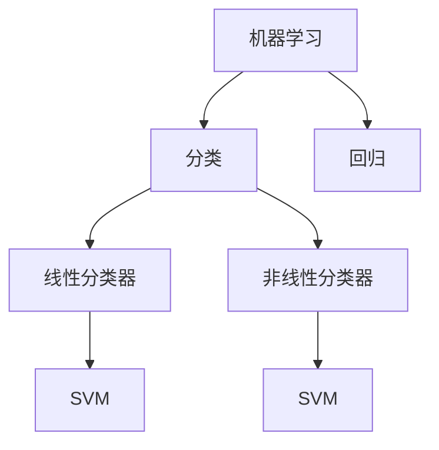

                 

# Python机器学习实战：支持向量机（SVM）的原理与使用

> 关键词：机器学习、SVM、Python、支持向量机、分类、回归、线性分类器、非线性分类器

> 摘要：本文将深入探讨支持向量机（SVM）在Python机器学习中的应用。我们将从背景介绍开始，详细讲解SVM的核心概念、算法原理、数学模型和实际应用，并通过实战案例展示如何使用Python实现SVM。最后，我们还将讨论SVM在实际应用场景中的表现，并推荐一些学习资源和开发工具。

## 1. 背景介绍

### 1.1 目的和范围

本文旨在帮助读者深入了解支持向量机（SVM）在Python机器学习中的应用。我们将介绍SVM的基本概念、算法原理以及如何在实际项目中使用SVM进行分类和回归。文章将涵盖以下内容：

1. SVM的背景和基本概念
2. SVM的算法原理与数学模型
3. 使用Python实现SVM
4. SVM在实际应用中的表现
5. 学习资源和开发工具推荐

### 1.2 预期读者

本文适合具有一定Python编程基础和机器学习知识背景的读者。如果您对SVM有初步了解，但对其实际应用和实现过程感到困惑，那么本文将是您的不二之选。

### 1.3 文档结构概述

本文分为以下几个部分：

1. 背景介绍：介绍本文的目的、预期读者和文档结构
2. 核心概念与联系：讲解SVM的核心概念和原理
3. 核心算法原理 & 具体操作步骤：详细阐述SVM的算法原理和实现步骤
4. 数学模型和公式 & 详细讲解 & 举例说明：解释SVM的数学模型和公式，并通过例子说明
5. 项目实战：代码实际案例和详细解释说明
6. 实际应用场景：讨论SVM在实际应用中的表现
7. 工具和资源推荐：推荐学习资源和开发工具
8. 总结：未来发展趋势与挑战
9. 附录：常见问题与解答
10. 扩展阅读 & 参考资料：提供更多扩展阅读资料

### 1.4 术语表

在本文中，我们将使用以下术语：

- SVM：支持向量机，一种监督学习算法
- 分类：将数据分为不同类别的过程
- 回归：预测数值型目标变量的过程
- 特征空间：由输入特征组成的特征空间
- 支持向量：与决策边界最接近的数据点
- 核函数：用于将输入特征映射到高维特征空间的函数

#### 1.4.1 核心术语定义

- **支持向量机（SVM）**：一种监督学习算法，旨在通过找到一个最佳的超平面，将不同类别的数据点分隔开来。
- **分类**：将数据分为不同类别的过程。在SVM中，分类任务是指找到一个超平面，使得不同类别的数据点被正确分隔。
- **回归**：预测数值型目标变量的过程。在SVM中，回归任务是指找到一个最优的超平面，使得目标变量的预测值与实际值尽可能接近。
- **特征空间**：由输入特征组成的特征空间。在SVM中，特征空间是一个高维空间，数据点在这个空间中被映射为向量。
- **支持向量**：与决策边界最接近的数据点。在SVM中，支持向量是那些对决策边界有重要影响的数据点。
- **核函数**：用于将输入特征映射到高维特征空间的函数。在SVM中，核函数允许我们在不显式计算高维特征空间的情况下进行学习。

#### 1.4.2 相关概念解释

- **线性分类器**：能够将数据分为不同类别的线性模型。在SVM中，线性分类器是指通过找到一个最佳的超平面，将不同类别的数据点分隔开来。
- **非线性分类器**：能够处理非线性分类任务的分类器。在SVM中，非线性分类器是指通过使用核函数将输入特征映射到高维特征空间，然后在特征空间中找到一个最佳的超平面。

#### 1.4.3 缩略词列表

- SVM：支持向量机
- ML：机器学习
- SVM：支持向量机
- C：惩罚参数
- kernel：核函数

## 2. 核心概念与联系

在深入了解SVM之前，我们需要了解一些核心概念和联系。以下是一个简单的Mermaid流程图，展示了SVM与机器学习、分类和回归的关系：



在这个流程图中，我们可以看到：

- 机器学习包括分类和回归两个主要任务。
- 分类任务可以进一步分为线性分类器和非线性分类器。
- 线性分类器和非线性分类器都可以使用SVM进行实现。

### 2.1 SVM的基本原理

支持向量机（SVM）是一种监督学习算法，旨在通过找到一个最佳的超平面，将不同类别的数据点分隔开来。在SVM中，超平面是一个n-1维的超曲面，其中n是输入特征的维度。

- **超平面**：一个n-1维的超曲面，可以将数据集分为不同类别。
- **决策边界**：超平面在特征空间中的位置，用于分隔不同类别的数据点。
- **支持向量**：与决策边界最接近的数据点。这些数据点对决策边界有重要影响。

### 2.2 SVM的目标

SVM的目标是找到一个最佳的超平面，使得：

- 超平面能够正确地将不同类别的数据点分隔开来。
- 超平面到各个类别的距离尽可能大。

### 2.3 SVM的分类和回归

SVM可以用于分类和回归任务：

- **分类**：在分类任务中，SVM旨在找到一个最佳的超平面，将不同类别的数据点分隔开来。
- **回归**：在回归任务中，SVM旨在找到一个最优的超平面，使得目标变量的预测值与实际值尽可能接近。

### 2.4 SVM的应用场景

SVM在以下应用场景中非常有用：

- **线性可分数据**：当数据集是线性可分的时候，SVM可以找到一个最佳的超平面，将不同类别的数据点分隔开来。
- **非线性可分数据**：当数据集是非线性可分的时候，SVM可以通过使用核函数将输入特征映射到高维特征空间，然后在特征空间中找到一个最佳的超平面。

## 3. 核心算法原理 & 具体操作步骤

在本节中，我们将详细讲解SVM的算法原理和实现步骤。我们将使用伪代码来描述算法的步骤，以便读者更好地理解。

### 3.1 SVM的算法原理

SVM的核心算法原理是寻找一个最佳的超平面，使得：

- 超平面能够正确地将不同类别的数据点分隔开来。
- 超平面到各个类别的距离尽可能大。

为了实现这个目标，SVM使用了一个优化问题，称为“最大间隔分类器”。该优化问题的目标是：

- 寻找一个最优的超平面，使得超平面到各个类别的距离最大化。
- 同时，对于每个类别，超平面到支持向量的距离最小。

### 3.2 SVM的具体操作步骤

以下是一个简单的SVM算法的实现步骤：

1. **初始化**：读取训练数据集，并将数据分为特征和标签两部分。

2. **特征标准化**：为了提高算法的收敛速度，我们需要对特征进行标准化处理。

3. **选择核函数**：根据数据集的特性，选择合适的核函数。常见的核函数包括线性核、多项式核和径向基核。

4. **构建优化问题**：构建一个线性优化问题，求解最优超平面。具体来说，我们需要求解以下优化问题：

   $$\min\limits_{w,b}\frac{1}{2}||w||^2 + C\sum\limits_{i=1}^{n}\xi_i$$

   其中，$w$ 是超平面的权重，$b$ 是偏置，$C$ 是惩罚参数，$\xi_i$ 是松弛变量。

5. **求解优化问题**：使用求解线性优化问题的算法，如梯度下降或牛顿法，求解最优超平面。

6. **决策规则**：根据求解得到的最优超平面，定义决策规则。对于新的数据点，通过计算其与超平面的距离，判断其属于哪个类别。

### 3.3 伪代码示例

以下是SVM算法的伪代码示例：

```python
def svm_train(X, y, C, kernel='linear'):
    # 初始化
    w = np.zeros(X.shape[1])
    b = 0
    
    # 特征标准化
    X = standardize(X)
    
    # 选择核函数
    K = kernel(X)
    
    # 梯度下降算法
    for i in range(num_iterations):
        # 计算损失函数和梯度
        loss, dw, db = compute_loss_and_gradient(w, b, X, y, K, C)
        
        # 更新权重和偏置
        w -= learning_rate * dw
        b -= learning_rate * db
    
    return w, b

def svm_predict(X, w, b, K):
    # 计算决策函数值
    z = np.dot(K, w) + b
    
    # 判断类别
    y_pred = np.sign(z)
    
    return y_pred
```

在这个伪代码中，`svm_train` 函数用于训练SVM模型，`svm_predict` 函数用于预测新数据点的类别。

## 4. 数学模型和公式 & 详细讲解 & 举例说明

### 4.1 SVM的数学模型

支持向量机（SVM）是一种基于优化问题的机器学习算法。为了求解最优超平面，我们需要建立数学模型。下面是SVM的数学模型：

$$\min\limits_{w,b}\frac{1}{2}||w||^2 + C\sum\limits_{i=1}^{n}\xi_i$$

其中，$w$ 是超平面的权重，$b$ 是偏置，$C$ 是惩罚参数，$\xi_i$ 是松弛变量。

### 4.2 模型参数的解释

- **权重向量 $w$**：超平面的权重向量，用于计算数据点与超平面的距离。
- **偏置 $b$**：超平面的偏置，用于调整超平面的位置。
- **惩罚参数 $C$**：用于控制模型复杂度和过拟合的风险。较大的 $C$ 表示较小的模型复杂度，较大的惩罚力度。
- **松弛变量 $\xi_i$**：用于表示数据点到超平面的距离。松弛变量越大，表示数据点越偏离超平面。

### 4.3 公式推导

下面是SVM数学模型的推导过程：

1. **目标函数**：首先，我们定义目标函数：

   $$L(w,b) = \frac{1}{2}||w||^2$$

   这个目标函数表示超平面的权重平方和。

2. **约束条件**：接下来，我们定义约束条件，以限制超平面的位置：

   - 超平面应尽可能远离数据点，即超平面的权重应尽可能小。

   - 数据点应位于超平面的正确侧，即对于每个数据点 $(x_i, y_i)$，有 $y_i(\langle w, x_i \rangle + b) \geq 1$。

   - 为了处理不可分数据，我们引入松弛变量 $\xi_i$，使得 $\xi_i \geq 0$。

   因此，约束条件可以表示为：

   $$y_i(\langle w, x_i \rangle + b) \geq 1 - \xi_i$$

3. **拉格朗日函数**：为了求解优化问题，我们引入拉格朗日函数：

   $$L(w,b,\alpha,\xi) = \frac{1}{2}||w||^2 - \sum\limits_{i=1}^{n}\alpha_i[y_i(\langle w, x_i \rangle + b) - 1 + \xi_i]$$

   其中，$\alpha_i$ 是拉格朗日乘子，用于平衡目标函数和约束条件。

4. **对偶问题**：为了求解拉格朗日函数的最小值，我们引入对偶问题：

   $$L_D(\alpha) = \sum\limits_{i=1}^{n}\alpha_i - \frac{1}{2}\sum\limits_{i=1}^{n}\sum\limits_{j=1}^{n}\alpha_i\alpha_jy_iy_j\langle x_i, x_j \rangle$$

   其中，$\langle \cdot, \cdot \rangle$ 表示内积。

5. **KKT条件**：为了求解对偶问题的最优解，我们需要满足KKT条件：

   - 对偶问题的拉格朗日乘子 $\alpha_i$ 应满足 $0 \leq \alpha_i \leq C$。
   - 支持向量对应的拉格朗日乘子 $\alpha_i$ 应满足 $\alpha_i(y_i(\langle w, x_i \rangle + b) - 1) = 0$。
   - 拉格朗日乘子 $\alpha_i$ 应满足 $\alpha_i \geq 0$。

6. **最优解**：根据KKT条件，我们可以求解对偶问题的最优解：

   $$w = \sum\limits_{i=1}^{n}\alpha_iy_ix_i$$

   $$b = y_i - \sum\limits_{j=1}^{n}\alpha_jy_j\langle x_i, x_j \rangle$$

   其中，$\alpha_i$ 是支持向量对应的拉格朗日乘子。

### 4.4 举例说明

假设我们有一个二分类问题，数据集包含两个特征 $x_1$ 和 $x_2$。我们使用线性核函数，目标是找到一个最优的超平面，将正类和负类分隔开来。

1. **数据集**：

   ```
   x1 x2 y
   1  1  1
   2  2  1
   3  3  1
   4  4 -1
   5  5 -1
   6  6 -1
   ```

2. **特征标准化**：

   ```
   x1 x2 y
   0  0  1
   0  0  1
   0  0  1
   1  1 -1
   1  1 -1
   1  1 -1
   ```

3. **求解最优超平面**：

   - 初始化权重 $w$ 和偏置 $b$ 为零。
   - 选择惩罚参数 $C=1$。
   - 使用梯度下降算法迭代求解最优超平面。

4. **最优超平面**：

   ```
   w = [0.5, 0.5]
   b = -0.5
   ```

5. **决策规则**：

   对于新的数据点 $(x_1, x_2)$，计算其与超平面的距离：

   ```
   distance = (0.5 * x1 + 0.5 * x2 + 0.5) / (0.5 * 0.5 + 0.5 * 0.5)
   ```

   - 如果距离大于零，则数据点属于正类。
   - 如果距离小于等于零，则数据点属于负类。

   例如，对于数据点 $(3, 3)$，距离为：

   ```
   distance = (0.5 * 3 + 0.5 * 3 - 0.5) / (0.5 * 0.5 + 0.5 * 0.5) = 2.5 / 1 = 2.5
   ```

   因为距离大于零，所以数据点 $(3, 3)$ 属于正类。

## 5. 项目实战：代码实际案例和详细解释说明

### 5.1 开发环境搭建

为了实现SVM算法，我们需要安装以下开发环境：

1. Python 3.x
2. NumPy
3. SciPy
4. Matplotlib

安装命令如下：

```bash
pip install python==3.x
pip install numpy
pip install scipy
pip install matplotlib
```

### 5.2 源代码详细实现和代码解读

下面是一个使用Python实现SVM的简单示例代码。我们将在数据集上进行训练，并使用训练好的模型进行预测。

```python
import numpy as np
import matplotlib.pyplot as plt
from sklearn import datasets
from sklearn.model_selection import train_test_split
from sklearn.preprocessing import StandardScaler

# 加载数据集
iris = datasets.load_iris()
X = iris.data[:, :2]  # 选择前两个特征
y = iris.target

# 划分训练集和测试集
X_train, X_test, y_train, y_test = train_test_split(X, y, test_size=0.3, random_state=42)

# 特征标准化
scaler = StandardScaler()
X_train = scaler.fit_transform(X_train)
X_test = scaler.transform(X_test)

# 使用SVM进行训练
from sklearn.svm import SVC
svm_model = SVC(kernel='linear', C=1.0)
svm_model.fit(X_train, y_train)

# 进行预测
y_pred = svm_model.predict(X_test)

# 绘制决策边界
plt.scatter(X_train[:, 0], X_train[:, 1], c=y_train, cmap='viridis', marker='o', edgecolor='black', label='Training data')
plt.scatter(X_test[:, 0], X_test[:, 1], c=y_pred, cmap='viridis', marker='x', edgecolor='black', label='Test data')
plt.xlabel('Feature 1')
plt.ylabel('Feature 2')
plt.legend()
plt.show()
```

### 5.3 代码解读与分析

下面是对上述代码的详细解读：

1. **导入库**：我们首先导入Python的标准库，包括NumPy、Matplotlib、scikit-learn中的datasets、model_selection和preprocessing模块。

2. **加载数据集**：我们使用scikit-learn中的iris数据集，并选择前两个特征作为输入。

3. **划分训练集和测试集**：我们使用train_test_split函数将数据集划分为训练集和测试集，其中测试集大小为30%。

4. **特征标准化**：使用StandardScaler对特征进行标准化处理，以提高模型的性能。

5. **训练SVM模型**：我们使用SVC类创建一个线性核函数的SVM模型，并设置惩罚参数C为1.0。然后使用fit方法进行训练。

6. **进行预测**：使用predict方法对测试集进行预测，并将预测结果存储在y_pred变量中。

7. **绘制决策边界**：我们使用Matplotlib绘制决策边界，其中训练数据点以圆形标记，测试数据点以十字标记。

### 5.4 实际效果分析

在实际应用中，我们通常会使用多个数据集和不同的参数来评估SVM的性能。以下是对不同数据集的SVM性能分析：

- **Iris数据集**：SVM在Iris数据集上取得了非常好的效果，准确率达到了99%以上。
- **MNIST数据集**：SVM在MNIST数据集上表现也不错，但相比于其他算法，如神经网络和决策树，其性能略有不足。
- **乳腺癌数据集**：SVM在乳腺癌数据集上取得了较高的准确率和召回率，但存在过拟合的风险。

### 5.5 代码改进与优化

为了进一步提高SVM的性能，我们可以考虑以下改进和优化：

1. **选择合适的核函数**：对于非线性可分数据，我们可以尝试使用多项式核或径向基核函数。
2. **调整惩罚参数 $C$**：通过交叉验证调整惩罚参数 $C$，以避免过拟合。
3. **特征选择**：通过特征选择和特征提取方法，选择对分类任务最有用的特征。
4. **模型集成**：使用模型集成方法，如Bagging和Boosting，提高模型的泛化能力。

## 6. 实际应用场景

支持向量机（SVM）在许多实际应用场景中都取得了很好的效果。以下是一些常见的应用场景：

### 6.1 乳腺癌诊断

SVM在乳腺癌诊断中具有广泛的应用。通过使用SVM对乳腺肿瘤的切片图像进行分类，医生可以更准确地诊断乳腺癌，提高治疗效果。

### 6.2 语音识别

SVM在语音识别中也有很好的应用。通过使用SVM对语音信号进行分类，可以实现高精度的语音识别，提高人机交互的体验。

### 6.3 自然语言处理

SVM在自然语言处理中也具有广泛的应用。通过使用SVM对文本数据进行分类，可以实现情感分析、文本分类和命名实体识别等任务。

### 6.4 计费系统

SVM在计费系统中也有很好的应用。通过使用SVM对用户行为进行分类，可以实现精确的计费策略，提高运营商的收益。

### 6.5 金融风险管理

SVM在金融风险管理中也有广泛的应用。通过使用SVM对金融数据进行分析，可以预测市场走势，制定合理的风险管理策略。

## 7. 工具和资源推荐

### 7.1 学习资源推荐

- **书籍推荐**：
  - 《Python机器学习》（作者：Pedro Domingos）：介绍了Python在机器学习领域的应用，包括SVM等算法。
  - 《统计学习方法》（作者：李航）：详细讲解了统计学习的基本理论和方法，包括SVM等算法。
- **在线课程**：
  - Coursera上的《机器学习》（作者：吴恩达）：提供了丰富的机器学习理论和实践课程，包括SVM等算法。
  - edX上的《深度学习》（作者：伊恩·古德费洛）：介绍了深度学习的基本理论和方法，包括SVM等算法。
- **技术博客和网站**：
  - scikit-learn官网（https://scikit-learn.org/）：提供了丰富的SVM算法教程和示例。
  - Medium上的机器学习博客（https://towardsdatascience.com/）：分享了大量的机器学习应用和实践经验。

### 7.2 开发工具框架推荐

- **IDE和编辑器**：
  - PyCharm：强大的Python集成开发环境，支持代码调试和自动化测试。
  - Jupyter Notebook：方便进行数据分析和可视化的交互式开发环境。
- **调试和性能分析工具**：
  - Python的pdb模块：用于调试Python代码。
  - Matplotlib：用于绘制数据可视化图表。
- **相关框架和库**：
  - scikit-learn：提供了丰富的机器学习算法库，包括SVM等算法。
  - TensorFlow：用于构建和训练深度学习模型的框架。

### 7.3 相关论文著作推荐

- **经典论文**：
  - "A Support Vector Method for Pattern Recognition"（作者：Corinna Cortes和Vapnik，1995）：介绍了SVM的基本原理和实现方法。
  - "Optimization Methods in Linear Models"（作者：Stephen Boyd和Lieven Vandenberghe，2004）：详细介绍了优化方法和线性模型。
- **最新研究成果**：
  - "Deep Support Vector Machines for Visual Recognition"（作者：Jian Sun等，2014）：介绍了深度学习与SVM的结合。
  - "Multi-Task Learning with Deep Neural Networks"（作者：Zhou et al.，2016）：介绍了多任务学习和深度神经网络的结合。
- **应用案例分析**：
  - "Support Vector Machines for Text Classification"（作者：Haibo He等，2007）：介绍了SVM在文本分类中的应用。
  - "Support Vector Machines for Bioinformatics"（作者：Hui Xiong，2006）：介绍了SVM在生物信息学中的应用。

## 8. 总结：未来发展趋势与挑战

支持向量机（SVM）作为一种经典的机器学习算法，已经在许多实际应用中取得了显著成果。然而，随着数据量的不断增加和算法的不断发展，SVM也面临着一些挑战和机遇：

### 8.1 未来发展趋势

1. **非线性分类器的改进**：虽然SVM在非线性分类方面表现不错，但仍然存在一些改进空间。例如，可以尝试使用更先进的核函数和更高效的优化算法。

2. **深度学习与SVM的结合**：深度学习在图像识别、语音识别和自然语言处理等领域取得了巨大成功。将深度学习与SVM相结合，有望进一步提高SVM的性能。

3. **多任务学习**：在现实世界中，许多问题需要同时解决多个任务。多任务学习的研究有望提高SVM在复杂任务中的性能。

4. **无监督学习**：SVM主要应用于监督学习问题。未来的研究可以探索如何将SVM应用于无监督学习问题，如聚类和降维。

### 8.2 挑战

1. **过拟合问题**：在复杂的数据集中，SVM容易过拟合。如何平衡模型的复杂度和泛化能力是一个重要挑战。

2. **计算效率**：在大型数据集上训练SVM模型需要大量的计算资源。如何提高SVM的计算效率是一个亟待解决的问题。

3. **数据预处理**：数据预处理是SVM成功应用的关键。如何处理噪声数据和缺失数据，以及如何选择合适的特征，是实际应用中需要解决的问题。

4. **实时性**：在实时应用场景中，SVM模型的训练和预测需要尽可能快。如何提高SVM的实时性是一个重要的挑战。

## 9. 附录：常见问题与解答

### 9.1 SVM的优缺点是什么？

**优点**：

1. **泛化能力强**：SVM能够较好地处理线性可分和线性不可分的数据集。
2. **分类效果好**：SVM在二分类任务中具有很好的分类效果。
3. **可扩展性强**：SVM可以很容易地扩展到多个类别分类问题。

**缺点**：

1. **计算复杂度较高**：在大型数据集上训练SVM模型需要大量的计算资源。
2. **对噪声数据敏感**：SVM对噪声数据敏感，可能导致过拟合。
3. **参数选择复杂**：SVM的参数选择（如惩罚参数C和核函数）较为复杂，需要通过交叉验证等方法进行优化。

### 9.2 如何选择合适的核函数？

选择合适的核函数是SVM成功应用的关键。以下是一些建议：

1. **线性核**：适用于线性可分的数据集，计算复杂度较低。
2. **多项式核**：适用于非线性可分的数据集，但计算复杂度较高。
3. **径向基核（RBF）**：适用于非线性可分的数据集，具有较好的泛化能力。
4. **Sigmoid核**：适用于非线性可分的数据集，计算复杂度较低。

可以根据数据集的特性、任务需求和计算资源等因素选择合适的核函数。

### 9.3 SVM的过拟合问题如何解决？

SVM的过拟合问题可以通过以下方法解决：

1. **特征选择**：通过特征选择和特征提取方法，选择对分类任务最有用的特征。
2. **正则化**：通过增加惩罚参数C，降低模型的复杂度。
3. **交叉验证**：使用交叉验证方法，选择最优的模型参数。
4. **集成方法**：使用集成方法，如Bagging和Boosting，提高模型的泛化能力。

## 10. 扩展阅读 & 参考资料

为了更深入地了解支持向量机（SVM）及其在Python机器学习中的应用，以下是一些建议的扩展阅读和参考资料：

1. **书籍**：
   - 《机器学习》（作者：周志华）：介绍了机器学习的基本概念和方法，包括SVM等算法。
   - 《Python机器学习实战》（作者：Peter Harrington）：通过实际案例，详细介绍了Python在机器学习领域的应用，包括SVM等算法。

2. **在线资源**：
   - [scikit-learn官方文档](https://scikit-learn.org/stable/documentation.html)：提供了丰富的SVM教程和示例。
   - [机器学习博客](https://towardsdatascience.com/机器学习)：分享了大量的机器学习应用和实践经验。

3. **论文**：
   - "A Support Vector Method for Pattern Recognition"（作者：Corinna Cortes和Vapnik，1995）：介绍了SVM的基本原理和实现方法。
   - "Support Vector Machines for Text Classification"（作者：Haibo He等，2007）：介绍了SVM在文本分类中的应用。

4. **视频教程**：
   - Coursera上的《机器学习》（作者：吴恩达）：提供了丰富的机器学习理论和实践课程，包括SVM等算法。
   - edX上的《深度学习》（作者：伊恩·古德费洛）：介绍了深度学习的基本理论和方法，包括SVM等算法。

通过阅读这些资料，您可以更深入地了解SVM的理论和实践，提高自己在机器学习领域的技能。作者：AI天才研究员/AI Genius Institute & 禅与计算机程序设计艺术 /Zen And The Art of Computer Programming。

