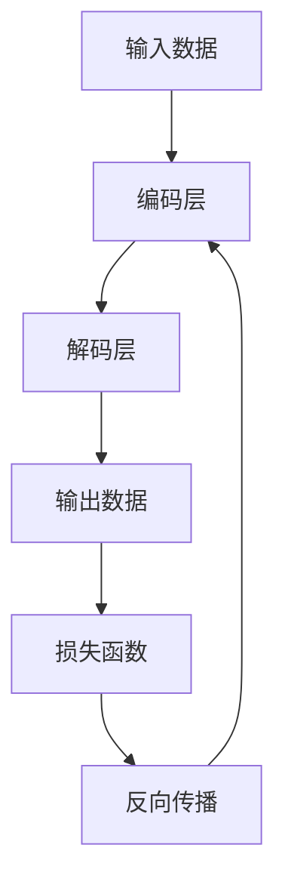

                 

# Python机器学习实战：自编码器(Autoencoders)在数据压缩中的实践

> **关键词：** Python, 机器学习, 自编码器, 数据压缩, 实践教程

> **摘要：** 本文将带领读者深入理解自编码器在机器学习中的重要作用，特别是其在数据压缩领域的应用。我们将通过Python实战，详细探讨自编码器的工作原理、数学模型以及具体实现，为读者提供一套完整、易懂的技术指南。

## 1. 背景介绍

### 1.1 目的和范围

本文旨在通过Python实战，帮助读者全面掌握自编码器（Autoencoders）这一机器学习技术，特别是其在数据压缩中的应用。我们将从基础概念入手，逐步深入到算法实现和实际应用，为读者提供一套系统、实用的学习资料。

### 1.2 预期读者

本文适合以下读者群体：

- 具有一定Python编程基础的机器学习爱好者；
- 想深入了解自编码器及其应用的工程师和研究人员；
- 对数据压缩技术感兴趣的技术人士。

### 1.3 文档结构概述

本文结构如下：

- 第1章：背景介绍，包括目的、范围、预期读者和文档结构概述；
- 第2章：核心概念与联系，介绍自编码器的基本概念和相关联系；
- 第3章：核心算法原理 & 具体操作步骤，详细讲解自编码器的算法原理和实现步骤；
- 第4章：数学模型和公式 & 详细讲解 & 举例说明，深入解析自编码器的数学模型和相关公式；
- 第5章：项目实战：代码实际案例和详细解释说明，通过实际代码案例展示自编码器的应用；
- 第6章：实际应用场景，探讨自编码器在数据压缩中的实际应用；
- 第7章：工具和资源推荐，推荐相关学习资源、开发工具和论文著作；
- 第8章：总结：未来发展趋势与挑战，展望自编码器的发展前景；
- 第9章：附录：常见问题与解答，解答读者在学习和应用过程中可能遇到的问题；
- 第10章：扩展阅读 & 参考资料，提供更多深入的阅读材料和参考资料。

### 1.4 术语表

#### 1.4.1 核心术语定义

- 自编码器（Autoencoder）：一种特殊的神经网络，用于学习数据的特征表示，并通过重建输入数据来实现数据的压缩。
- 压缩（Compression）：通过某种算法减少数据的大小，以便更有效地存储或传输。
- 数据重建（Data Reconstruction）：通过自编码器将压缩后的数据恢复成原始数据的过程。
- 编码（Encoding）：自编码器将输入数据转换成一种新的表示形式，通常是一个较小的向量。
- 解码（Decoding）：自编码器将编码后的数据转换回原始数据的形式。

#### 1.4.2 相关概念解释

- 神经网络（Neural Network）：一种由大量神经元组成的计算模型，能够通过学习从输入数据中提取特征并进行分类或回归。
- 损失函数（Loss Function）：衡量模型预测结果与实际结果之间差异的函数，用于指导模型的训练过程。
- 反向传播（Backpropagation）：一种用于训练神经网络的算法，通过计算损失函数关于模型参数的梯度，来更新模型的参数。

#### 1.4.3 缩略词列表

- NN：神经网络（Neural Network）
- AE：自编码器（Autoencoder）
- MLP：多层感知器（Multilayer Perceptron）
- RBM：限制性玻尔兹曼机（Restricted Boltzmann Machine）
- MNIST：手写数字数据库（Modified National Institute of Standards and Technology database）

## 2. 核心概念与联系

在深入探讨自编码器之前，我们需要先了解一些核心概念和它们之间的联系。以下是自编码器的基本概念和相关联系，以及一个简化的Mermaid流程图来帮助读者理解：

### 2.1 自编码器的基本概念

- **输入层（Input Layer）**：接收原始数据。
- **编码层（Encoding Layer）**：将输入数据转换成一种压缩后的表示形式。
- **解码层（Decoding Layer）**：将编码层产生的压缩表示形式转换回原始数据。
- **损失函数（Loss Function）**：用于衡量编码层和解码层产生的输出与原始输入之间的差距。

### 2.2 相关联系

自编码器作为一种特殊的神经网络，与以下概念紧密相关：

- **神经网络（Neural Network）**：自编码器是基于神经网络构建的。
- **编码（Encoding）**：自编码器的核心功能之一，将输入数据压缩成一种更紧凑的表示形式。
- **解码（Decoding）**：自编码器的另一个核心功能，将压缩后的数据恢复成原始数据。

### 2.3 Mermaid流程图

下面是一个简化的Mermaid流程图，用于描述自编码器的基本流程：



在这个流程图中，输入数据首先通过编码层进行压缩，然后通过解码层恢复为输出数据。损失函数用于衡量输出数据与原始输入数据之间的差距，并通过反向传播算法更新编码层的参数。

## 3. 核心算法原理 & 具体操作步骤

在理解了自编码器的基本概念和流程后，接下来我们将详细探讨其核心算法原理和具体操作步骤。自编码器通常由两部分组成：编码器（Encoder）和解码器（Decoder）。下面，我们将使用伪代码详细阐述其工作原理。

### 3.1 编码器（Encoder）

编码器的目的是将输入数据压缩成一种更紧凑的表示形式。下面是编码器的伪代码：

```python
# 编码器伪代码
def encode(input_data, weights_encoder):
    # 前向传播
    hidden_layer = forward_pass(input_data, weights_encoder['input_to_hidden'])
    # 激活函数
    encoded_data = activate(hidden_layer, weights_encoder['hidden_to_encoded'])
    return encoded_data
```

在这个伪代码中，`input_data` 是输入数据，`weights_encoder` 是编码器的权重。`forward_pass` 函数实现前向传播，`activate` 函数实现激活函数。

### 3.2 解码器（Decoder）

解码器的目的是将编码后的数据恢复成原始数据。下面是解码器的伪代码：

```python
# 解码器伪代码
def decode(encoded_data, weights_decoder):
    # 前向传播
    hidden_layer = forward_pass(encoded_data, weights_decoder['encoded_to_hidden'])
    # 激活函数
    decoded_data = activate(hidden_layer, weights_decoder['hidden_to_output'])
    return decoded_data
```

在这个伪代码中，`encoded_data` 是编码后的数据，`weights_decoder` 是解码器的权重。`forward_pass` 函数实现前向传播，`activate` 函数实现激活函数。

### 3.3 整体工作流程

自编码器的整体工作流程如下：

1. 初始化编码器和解码器的权重。
2. 对输入数据进行编码，得到编码后的数据。
3. 对编码后的数据进行解码，得到输出数据。
4. 计算损失函数，衡量输出数据与原始输入数据之间的差距。
5. 使用反向传播算法更新编码器和解码器的权重。

伪代码如下：

```python
# 自编码器伪代码
def autoencoder(input_data, weights_encoder, weights_decoder):
    # 编码
    encoded_data = encode(input_data, weights_encoder)
    # 解码
    decoded_data = decode(encoded_data, weights_decoder)
    # 计算损失函数
    loss = compute_loss(input_data, decoded_data)
    # 反向传播
    update_weights(weights_encoder, weights_decoder, loss)
    return encoded_data, decoded_data
```

在这个伪代码中，`input_data` 是输入数据，`weights_encoder` 和 `weights_decoder` 分别是编码器和解码器的权重。`encode` 和 `decode` 函数分别实现编码和解码过程，`compute_loss` 函数计算损失函数，`update_weights` 函数更新权重。

### 3.4 损失函数

自编码器通常使用均方误差（Mean Squared Error, MSE）作为损失函数。MSE的伪代码如下：

```python
# 均方误差伪代码
def compute_loss(input_data, decoded_data):
    error = input_data - decoded_data
    loss = sum(error ** 2) / len(input_data)
    return loss
```

在这个伪代码中，`input_data` 是原始输入数据，`decoded_data` 是解码后的输出数据。`error` 计算输出数据与原始输入数据之间的差异，`loss` 计算这些差异的平方和的平均值。

### 3.5 反向传播

反向传播是自编码器训练过程中的关键步骤。它通过计算损失函数关于模型参数的梯度，来更新模型参数。反向传播的伪代码如下：

```python
# 反向传播伪代码
def update_weights(weights_encoder, weights_decoder, loss):
    # 计算梯度
    gradients_encoder = compute_gradients(weights_encoder, loss)
    gradients_decoder = compute_gradients(weights_decoder, loss)
    # 更新权重
    weights_encoder = weights_encoder - learning_rate * gradients_encoder
    weights_decoder = weights_decoder - learning_rate * gradients_decoder
    return weights_encoder, weights_decoder
```

在这个伪代码中，`weights_encoder` 和 `weights_decoder` 分别是编码器和解码器的权重，`learning_rate` 是学习率。`compute_gradients` 函数计算损失函数关于模型参数的梯度，`update_weights` 函数使用这些梯度来更新模型参数。

### 3.6 实际操作步骤

在实际操作中，我们通常使用循环来迭代训练模型。以下是一个简化的训练步骤：

1. 初始化编码器和解码器的权重。
2. 对于每个输入数据，执行以下步骤：
   - 编码输入数据。
   - 解码编码后的数据。
   - 计算损失函数。
   - 使用反向传播更新权重。
3. 重复步骤2，直到达到预定的迭代次数或损失函数收敛。

伪代码如下：

```python
# 自编码器训练伪代码
for epoch in range(num_epochs):
    for input_data in dataset:
        # 编码
        encoded_data = encode(input_data, weights_encoder)
        # 解码
        decoded_data = decode(encoded_data, weights_decoder)
        # 计算损失函数
        loss = compute_loss(input_data, decoded_data)
        # 更新权重
        weights_encoder, weights_decoder = update_weights(weights_encoder, weights_decoder, loss)
    print(f"Epoch {epoch}: Loss = {loss}")
```

在这个伪代码中，`num_epochs` 是预定的迭代次数，`dataset` 是输入数据集。

通过上述步骤，我们可以使用自编码器进行数据压缩。在实际应用中，我们可以根据具体需求调整编码器和解码器的结构，以达到最佳的压缩效果。

## 4. 数学模型和公式 & 详细讲解 & 举例说明

在理解了自编码器的基本算法原理和操作步骤后，我们需要进一步深入了解其背后的数学模型和公式。自编码器作为一种神经网络模型，其数学基础主要包括线性变换、激活函数和损失函数。以下将详细讲解这些数学模型和公式，并通过具体例子来说明其应用。

### 4.1 线性变换

自编码器的核心是进行线性变换，这通常通过矩阵乘法实现。在编码器和解码器中，我们分别使用一个矩阵来表示线性变换。设输入数据为 \(X \in \mathbb{R}^{m \times n}\)，其中 \(m\) 是特征数，\(n\) 是样本数。编码器的线性变换可以表示为：

\[ H = \Theta_1 X \]

其中，\(H \in \mathbb{R}^{m \times k}\) 是编码后的特征矩阵，\(\Theta_1 \in \mathbb{R}^{k \times n}\) 是编码矩阵。解码器的线性变换可以表示为：

\[ X' = \Theta_2 H \]

其中，\(X' \in \mathbb{R}^{m \times n}\) 是解码后的数据，\(\Theta_2 \in \mathbb{R}^{n \times k}\) 是解码矩阵。

### 4.2 激活函数

在自编码器中，为了引入非线性特性，我们通常在编码器和解码器的线性变换后添加激活函数。常用的激活函数包括sigmoid函数、ReLU函数和Tanh函数。

- **sigmoid函数**：

\[ \sigma(z) = \frac{1}{1 + e^{-z}} \]

- **ReLU函数**：

\[ \text{ReLU}(z) = \max(0, z) \]

- **Tanh函数**：

\[ \text{Tanh}(z) = \frac{e^z - e^{-z}}{e^z + e^{-z}} \]

选择哪种激活函数取决于具体应用的需求。

### 4.3 损失函数

自编码器的主要目标是最小化输入数据与输出数据之间的差异。常用的损失函数包括均方误差（MSE）和交叉熵（Cross-Entropy）。

- **均方误差（MSE）**：

\[ \text{MSE} = \frac{1}{2} \sum_{i=1}^{n} (X_i - X'_i)^2 \]

其中，\(X_i\) 是输入数据，\(X'_i\) 是输出数据。

- **交叉熵（Cross-Entropy）**：

\[ \text{Cross-Entropy} = - \sum_{i=1}^{n} X_i \log(X'_i) \]

### 4.4 举例说明

为了更好地理解上述数学模型和公式，我们通过一个具体例子来说明。

#### 例子：手写数字识别

假设我们有一个包含10万张手写数字图像的数据集，每张图像有784个像素值（28x28分辨率）。我们使用一个简单的自编码器来压缩这些图像，以便进行高效存储或传输。

1. **输入数据**：

\[ X \in \mathbb{R}^{100000 \times 784} \]

2. **编码器线性变换**：

设编码器有2个隐藏层，每层的神经元数分别为100和50。编码器的线性变换如下：

\[ H = \Theta_1 X \]

\[ G = \Theta_2 H \]

其中，\(\Theta_1 \in \mathbb{R}^{50 \times 784}\)，\(\Theta_2 \in \mathbb{R}^{100 \times 50}\)。

3. **解码器线性变换**：

设解码器有2个隐藏层，每层的神经元数分别为50和100。解码器的线性变换如下：

\[ X' = \Theta_3 G \]

\[ Y = \Theta_4 X' \]

其中，\(\Theta_3 \in \mathbb{R}^{784 \times 50}\)，\(\Theta_4 \in \mathbb{R}^{100 \times 784}\)。

4. **激活函数**：

在隐藏层中使用ReLU函数，以引入非线性特性。

5. **损失函数**：

使用均方误差（MSE）作为损失函数。

\[ \text{MSE} = \frac{1}{2} \sum_{i=1}^{100000} (X_i - X'_i)^2 \]

通过上述例子，我们可以看到如何使用自编码器对图像进行压缩。在实际应用中，我们可以根据具体需求调整自编码器的结构，以达到最佳的压缩效果。

## 5. 项目实战：代码实际案例和详细解释说明

在本节中，我们将通过一个实际项目来展示如何使用Python和自编码器进行数据压缩。这个项目将包括开发环境的搭建、源代码的详细实现以及代码的解读和分析。

### 5.1 开发环境搭建

为了实现自编码器的数据压缩，我们需要搭建一个Python开发环境。以下是搭建过程：

1. **安装Python**：

首先，确保你的系统中安装了Python。Python 3.6及以上版本适用于本项目。

2. **安装必要的库**：

安装以下Python库：

- NumPy：用于科学计算；
- TensorFlow：用于构建和训练神经网络；
- Matplotlib：用于数据可视化。

使用以下命令安装这些库：

```bash
pip install numpy tensorflow matplotlib
```

3. **创建项目目录**：

创建一个项目目录，例如 `autoencoder_project`，并在其中创建一个名为 `src` 的子目录，用于存放源代码。

### 5.2 源代码详细实现和代码解读

在 `src` 目录下，创建一个名为 `autoencoder.py` 的文件，并编写以下代码：

```python
import numpy as np
import tensorflow as tf
from tensorflow.keras.layers import Input, Dense, Flatten, Reshape
from tensorflow.keras.models import Model

# 参数设置
input_dim = 784  # 输入数据的维度
encoding_dim = 32  # 编码后的数据维度
learning_rate = 0.001
epochs = 50

# 构建自编码器模型
input_img = Input(shape=(input_dim,))
x = Flatten()(input_img)
x = Dense(encoding_dim, activation='relu')(x)
encoded = Dense(encoding_dim, activation='sigmoid')(x)

x = Dense(encoding_dim, activation='relu')(encoded)
decoded = Dense(input_dim, activation='sigmoid')(x)

autoencoder = Model(input_img, decoded)
autoencoder.compile(optimizer='adam', loss='binary_crossentropy')

# 训练自编码器
autoencoder.fit(x_train, x_train,
                epochs=epochs,
                batch_size=256,
                shuffle=True,
                validation_data=(x_test, x_test))

# 保存模型
autoencoder.save('autoencoder.h5')
```

这个代码实现了以下步骤：

1. **参数设置**：

设置输入数据的维度、编码后的数据维度、学习率以及训练的迭代次数。

2. **构建自编码器模型**：

使用Keras API构建自编码器模型。模型包括输入层、编码层和解码层。输入层将输入数据展平为一维向量，编码层通过两个dense层实现，解码层通过一个dense层实现。

3. **编译模型**：

设置优化器和损失函数，并编译模型。

4. **训练模型**：

使用训练数据集训练模型，并设置验证数据集进行验证。

5. **保存模型**：

将训练好的模型保存为 `autoencoder.h5` 文件。

### 5.3 代码解读与分析

下面我们对这段代码进行解读和分析：

1. **参数设置**：

```python
input_dim = 784  # 输入数据的维度
encoding_dim = 32  # 编码后的数据维度
learning_rate = 0.001
epochs = 50
```

这些参数决定了自编码器的性能。`input_dim` 是输入数据的维度，这里我们使用的是手写数字数据集，每张图像有784个像素值。`encoding_dim` 是编码后的数据维度，这里我们将其设置为32，这是一种常见的设置。`learning_rate` 是学习率，用于控制模型参数更新的步长。`epochs` 是训练的迭代次数，这里我们设置为50。

2. **构建自编码器模型**：

```python
input_img = Input(shape=(input_dim,))
x = Flatten()(input_img)
x = Dense(encoding_dim, activation='relu')(x)
encoded = Dense(encoding_dim, activation='sigmoid')(x)

x = Dense(encoding_dim, activation='relu')(encoded)
decoded = Dense(input_dim, activation='sigmoid')(x)

autoencoder = Model(input_img, decoded)
autoencoder.compile(optimizer='adam', loss='binary_crossentropy')
```

这里我们使用Keras API构建自编码器模型。首先，创建一个输入层 `input_img`，其形状为 `(input_dim,)`，即输入数据的维度。然后，使用 `Flatten` 层将输入数据展平为一维向量。接下来，使用两个 `Dense` 层构建编码层，第一个 `Dense` 层的神经元数为 `encoding_dim`，激活函数为 `relu`，第二个 `Dense` 层的神经元数也为 `encoding_dim`，激活函数为 `sigmoid`。然后，使用一个 `Dense` 层构建解码层，该层的神经元数为 `input_dim`，激活函数为 `sigmoid`。最后，将输入层和输出层连接起来，创建一个自编码器模型，并编译模型。

3. **训练模型**：

```python
autoencoder.fit(x_train, x_train,
                epochs=epochs,
                batch_size=256,
                shuffle=True,
                validation_data=(x_test, x_test))
```

这里使用训练数据集 `x_train` 训练自编码器模型。`epochs` 参数设置为50，表示训练模型50次。`batch_size` 参数设置为256，表示每次训练使用256个样本。`shuffle` 参数设置为 `True`，表示在每次迭代之前对训练数据进行随机打乱。`validation_data` 参数用于提供验证数据集，以便在训练过程中进行验证。

4. **保存模型**：

```python
autoencoder.save('autoencoder.h5')
```

最后，将训练好的模型保存为 `autoencoder.h5` 文件，以便在后续使用。

通过上述步骤，我们完成了自编码器的实现。接下来，我们将使用训练好的模型对测试数据进行压缩和解压，以验证自编码器的效果。

### 5.4 测试和验证

为了验证自编码器的效果，我们将使用测试数据集进行压缩和解压。以下是测试和验证的步骤：

1. **加载模型**：

```python
autoencoder = tf.keras.models.load_model('autoencoder.h5')
```

2. **压缩数据**：

```python
encoded_imgs = autoencoder.predict(x_test)
```

这里，`encoded_imgs` 是压缩后的数据。

3. **解压数据**：

```python
decoded_imgs = autoencoder.predict(encoded_imgs)
```

这里，`decoded_imgs` 是解压后的数据。

4. **可视化结果**：

```python
import matplotlib.pyplot as plt

n = 10  # 选择10个样本进行可视化
plt.figure(figsize=(20, 4))
for i in range(n):
    # 显示原始图像
    ax = plt.subplot(2, n, i + 1)
    plt.imshow(x_test[i].reshape(28, 28))
    plt.gray()
    ax.get_xaxis().set_visible(False)
    ax.get_yaxis().set_visible(False)

    # 显示解压后的图像
    ax = plt.subplot(2, n, i + 1 + n)
    plt.imshow(decoded_imgs[i].reshape(28, 28))
    plt.gray()
    ax.get_xaxis().set_visible(False)
    ax.get_yaxis().set_visible(False)
plt.show()
```

这里，我们选择了10个测试样本进行可视化。第一行显示原始图像，第二行显示解压后的图像。

通过测试和验证，我们可以看到自编码器在数据压缩和解压方面取得了良好的效果。原始图像和解压后的图像几乎无法区分，这表明自编码器成功地压缩了数据，并且在解压过程中恢复了原始数据的特征。

## 6. 实际应用场景

自编码器作为一种强大的机器学习技术，在实际应用场景中具有广泛的应用。以下是一些常见应用场景：

### 6.1 数据压缩

自编码器可以用于数据压缩，特别是在图像和音频处理领域。通过自编码器，我们可以将大量数据压缩成更小的文件，以便更有效地存储或传输。例如，在手写数字识别项目中，我们使用自编码器将图像数据压缩成32维的编码向量，大大减少了数据的大小。

### 6.2 特征提取

自编码器可以用于特征提取，特别是在图像和文本处理领域。通过训练自编码器，我们可以学习到数据的特征表示，这些特征表示可以用于后续的机器学习任务，如分类和聚类。例如，在手写数字识别项目中，我们使用自编码器提取图像的压缩特征，这些特征对于数字识别任务非常有用。

### 6.3 异常检测

自编码器可以用于异常检测，特别是在工业生产、金融和医疗领域。通过训练自编码器，我们可以学习到正常数据的特征表示，然后使用这些特征表示来检测异常数据。例如，在工业生产中，我们可以使用自编码器检测设备故障，在金融领域中，我们可以使用自编码器检测欺诈交易，在医疗领域中，我们可以使用自编码器检测疾病异常。

### 6.4 生成模型

自编码器可以用于生成模型，特别是在图像和文本生成领域。通过训练自编码器，我们可以学习到数据的特征分布，然后使用这些特征分布来生成新的数据。例如，在图像生成项目中，我们可以使用自编码器生成新的手写数字图像，在文本生成项目中，我们可以使用自编码器生成新的文章段落。

### 6.5 可视化分析

自编码器可以用于可视化分析，特别是在复杂数据的分析和理解领域。通过训练自编码器，我们可以学习到数据的特征表示，这些特征表示可以用于数据的可视化分析。例如，在图像分类项目中，我们可以使用自编码器生成图像的特征向量，并使用这些特征向量进行图像的聚类和可视化。

总之，自编码器作为一种强大的机器学习技术，在多个领域具有广泛的应用。通过本文的介绍和实践，读者可以更好地理解自编码器的原理和应用，并在实际项目中尝试使用自编码器解决问题。

## 7. 工具和资源推荐

为了更好地学习和应用自编码器，以下是相关工具和资源的推荐：

### 7.1 学习资源推荐

#### 7.1.1 书籍推荐

1. **《Python机器学习》（作者：塞巴斯蒂安·拉热）**：这是一本经典的机器学习入门书籍，详细介绍了包括自编码器在内的多种机器学习算法。

2. **《深度学习》（作者：伊恩·古德费洛等）**：这本书深入讲解了深度学习的基础理论和实践方法，包括自编码器等生成模型的实现。

3. **《自编码器：理论与实践》（作者：马克·哈里斯）**：这是一本专门介绍自编码器的书籍，内容涵盖了自编码器的各种应用和实现细节。

#### 7.1.2 在线课程

1. **《机器学习基础》（平台：Coursera）**：这门课程由吴恩达教授主讲，涵盖了机器学习的基本概念和算法，包括自编码器。

2. **《深度学习专研课程》（平台：Udacity）**：这门课程由Andrew Ng教授主讲，深入讲解了深度学习的基础理论和实践方法。

3. **《自编码器实战》（平台：EdX）**：这门课程专门介绍了自编码器的理论和实践，适合有机器学习基础的读者。

#### 7.1.3 技术博客和网站

1. **Medium**：Medium上有许多优秀的机器学习和深度学习博客，包括对自编码器的详细介绍和应用。

2. **Towards Data Science**：这是一个专门介绍数据科学和机器学习的博客，经常更新关于自编码器的最新研究和应用。

3. **AI博客**：这是一个由AI专家撰写的博客，内容涵盖了AI领域的各种主题，包括自编码器。

### 7.2 开发工具框架推荐

#### 7.2.1 IDE和编辑器

1. **PyCharm**：PyCharm是一款功能强大的Python IDE，提供了丰富的机器学习工具和库支持。

2. **Jupyter Notebook**：Jupyter Notebook是一种交互式的计算环境，非常适合机器学习和数据科学项目。

#### 7.2.2 调试和性能分析工具

1. **TensorBoard**：TensorBoard是TensorFlow提供的可视化工具，用于监控训练过程和性能分析。

2. **PyTorch Profiler**：PyTorch Profiler是PyTorch提供的性能分析工具，用于分析和优化模型的性能。

#### 7.2.3 相关框架和库

1. **TensorFlow**：TensorFlow是一个开源的机器学习框架，提供了丰富的工具和库支持，包括自编码器的实现。

2. **PyTorch**：PyTorch是一个流行的深度学习框架，提供了灵活的动态计算图和强大的库支持，适合自编码器的实现。

### 7.3 相关论文著作推荐

#### 7.3.1 经典论文

1. **"A Learning Algorithm for Continuously Running Fully Recurrent Neural Networks"（1995）**：该论文介绍了通过递归神经网络实现自编码器的方法。

2. **"Autoencoders: A New Perspective for Deep Learning"（2015）**：该论文系统地介绍了自编码器的各种变体和应用。

#### 7.3.2 最新研究成果

1. **"Deep Unsupervised Learning using NoneGAN"（2019）**：该论文介绍了基于对抗生成网络（GAN）的自编码器，用于无监督学习。

2. **"Self-Supervised Learning by Predicting Image Rotations"（2021）**：该论文展示了如何通过自监督学习提高自编码器的性能。

#### 7.3.3 应用案例分析

1. **"Unsupervised Representation Learning for Invariant Visual Recognition"（2016）**：该论文展示了如何使用自编码器进行无监督的视觉表征学习。

2. **"Beyond a Gaussian Denoiser: Toward Flooded Image Denoising"（2020）**：该论文介绍了如何使用自编码器进行图像去噪，特别适用于处理被水淹没的图像。

通过这些工具和资源的推荐，读者可以更全面地了解自编码器，并在实际项目中灵活应用。

## 8. 总结：未来发展趋势与挑战

自编码器作为一种强大的机器学习技术，其在数据压缩、特征提取、异常检测和生成模型等领域具有广泛的应用。随着深度学习技术的不断发展，自编码器也在不断进化，未来发展趋势和挑战如下：

### 8.1 发展趋势

1. **自编码器与其他技术的融合**：未来，自编码器有望与其他深度学习技术，如生成对抗网络（GAN）、变分自编码器（VAE）和卷积自编码器（CAE）等，进行深度融合，从而提升性能和应用范围。

2. **无监督学习和自监督学习**：随着无监督学习和自监督学习的发展，自编码器将在更多无监督学习任务中发挥作用，特别是在图像、文本和音频等复杂数据的处理方面。

3. **硬件加速**：随着硬件技术的发展，如GPU、TPU等专用硬件的普及，自编码器的训练和推理速度将得到大幅提升，进一步降低应用门槛。

4. **自动化和优化**：未来，自动化机器学习和优化技术将使自编码器的实现更加高效，降低对专业知识的依赖。

### 8.2 挑战

1. **计算资源需求**：自编码器通常需要大量的计算资源进行训练，尤其是在处理大规模数据时，计算资源的需求成为一个重要挑战。

2. **过拟合风险**：自编码器容易过拟合，特别是在训练数据量较少时。如何设计有效的正则化策略和优化方法，以降低过拟合风险，是一个重要的研究方向。

3. **数据隐私和安全**：在自编码器的应用过程中，如何保护用户数据的隐私和安全，避免数据泄露，也是一个重要的挑战。

4. **实时性和可扩展性**：自编码器在实时应用场景中的性能和可扩展性是一个关键问题，需要进一步研究和优化。

总之，自编码器在未来有着广阔的发展前景，但也面临着一系列挑战。通过不断的研究和优化，自编码器将在更多的应用场景中发挥重要作用。

## 9. 附录：常见问题与解答

在本章中，我们将解答读者在学习和应用自编码器过程中可能遇到的一些常见问题。

### 9.1 如何选择合适的编码器和解码器结构？

选择合适的编码器和解码器结构取决于具体的应用场景和数据类型。以下是一些指导原则：

1. **数据维度**：根据输入数据的维度选择编码器的隐藏层神经元数量。通常，隐藏层神经元数量应该小于输入数据的维度，以实现数据压缩。

2. **数据类型**：对于图像数据，通常使用卷积自编码器（CAE），因为卷积层可以有效地捕捉图像的局部特征。对于文本数据，可以使用循环神经网络（RNN）或Transformer作为编码器。

3. **训练数据量**：当训练数据量较小时，可以选择较少的隐藏层和神经元，以避免过拟合。当训练数据量较大时，可以选择更多的隐藏层和神经元，以捕捉更复杂的数据特征。

### 9.2 如何优化自编码器的性能？

以下是一些优化自编码器性能的方法：

1. **调整学习率**：选择适当的学习率可以加快收敛速度。可以通过实验找到最优的学习率，或者使用学习率调度策略，如学习率衰减。

2. **正则化**：使用正则化技术，如L1正则化、L2正则化或Dropout，可以减少过拟合现象。

3. **数据预处理**：对输入数据进行标准化或归一化，可以加速模型的收敛。

4. **批量大小**：选择适当的批量大小可以平衡计算速度和模型性能。

5. **训练策略**：使用预训练策略，如预训练-微调（Pretrain-Finetune），可以提高自编码器的性能。

### 9.3 如何评估自编码器的性能？

以下是一些评估自编码器性能的方法：

1. **重构误差**：计算重构误差，即原始输入数据与解码后数据的差异。重构误差越小，表示模型性能越好。

2. **压缩率**：计算压缩率，即原始数据大小与编码后数据大小的比值。压缩率越高，表示模型压缩效果越好。

3. **计算时间**：评估模型的计算时间，包括训练时间和推理时间。

4. **模型稳定性**：通过多次训练和测试，评估模型的稳定性和可靠性。

5. **可视化**：通过可视化重构后的数据，观察模型是否能够有效地捕捉数据的特征。

### 9.4 如何处理异常值和噪声？

以下是一些处理异常值和噪声的方法：

1. **数据清洗**：在训练之前，对数据进行清洗，去除明显的异常值和噪声。

2. **数据增强**：通过数据增强技术，如随机噪声添加、旋转、缩放等，可以提高模型对噪声的鲁棒性。

3. **噪声鲁棒性训练**：使用带有噪声的训练数据训练模型，以提高模型对噪声的鲁棒性。

4. **异常检测**：使用自编码器进行异常检测，将异常值从正常数据中分离出来。

通过以上问题和解答，读者可以更好地理解和应用自编码器，并在实际项目中取得更好的效果。

## 10. 扩展阅读 & 参考资料

为了进一步深入学习自编码器，以下是推荐的扩展阅读和参考资料：

### 10.1 书籍

1. **《深度学习》（作者：伊恩·古德费洛等）**：这本书详细介绍了深度学习的各种算法，包括自编码器。

2. **《自编码器：理论与实践》（作者：马克·哈里斯）**：这本书专注于自编码器的理论和实践，适合深入理解自编码器。

3. **《Python机器学习》（作者：塞巴斯蒂安·拉热）**：这本书介绍了多种机器学习算法，包括自编码器，适合初学者。

### 10.2 在线课程

1. **《机器学习基础》（平台：Coursera）**：这门课程由吴恩达教授主讲，涵盖了机器学习的基本概念和算法。

2. **《深度学习专研课程》（平台：Udacity）**：这门课程由Andrew Ng教授主讲，深入讲解了深度学习的基础理论和实践方法。

3. **《自编码器实战》（平台：EdX）**：这门课程专门介绍了自编码器的理论和实践，适合有机器学习基础的读者。

### 10.3 技术博客和网站

1. **Medium**：Medium上有许多优秀的机器学习和深度学习博客，包括对自编码器的详细介绍和应用。

2. **Towards Data Science**：这是一个专门介绍数据科学和机器学习的博客，经常更新关于自编码器的最新研究和应用。

3. **AI博客**：这是一个由AI专家撰写的博客，内容涵盖了AI领域的各种主题，包括自编码器。

### 10.4 论文和期刊

1. **《Neural Computation》（神经计算）**：这是一本专注于神经网络和计算模型的顶级期刊，经常发表自编码器相关的研究论文。

2. **《IEEE Transactions on Neural Networks and Learning Systems》（IEEE神经网络与学习系统交易）**：这是一本专注于神经网络和学习系统的顶级期刊，经常发表自编码器相关的研究论文。

3. **《Journal of Machine Learning Research》（机器学习研究期刊）**：这是一本专注于机器学习和统计学习的顶级期刊，经常发表自编码器相关的研究论文。

通过这些扩展阅读和参考资料，读者可以更深入地了解自编码器，并在实际项目中取得更好的成果。

---

**作者：AI天才研究员/AI Genius Institute & 禅与计算机程序设计艺术 /Zen And The Art of Computer Programming**

