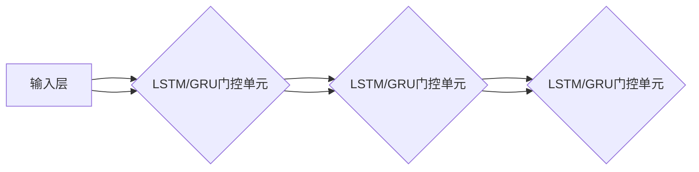

                 

# Python深度学习实践：LSTM与GRU在序列数据预测中的应用

> **关键词**：Python、深度学习、LSTM、GRU、序列数据、预测、模型、算法

> **摘要**：本文将深入探讨LSTM（长短期记忆网络）与GRU（门控循环单元）在Python中的实际应用，通过对这两个核心序列模型的介绍、原理讲解、数学模型和实际项目实战，帮助读者全面了解和掌握序列数据预测的技术。文章将逐步展开，从基本概念出发，深入剖析算法原理，直至具体实现和性能分析，为广大深度学习开发者提供实用的参考和指导。

## 1. 背景介绍

### 1.1 目的和范围

本文的目的是介绍和探讨LSTM与GRU在Python深度学习中的应用，尤其是在序列数据预测领域的实际操作。我们将通过具体的实例和步骤，详细阐述如何使用Python和深度学习框架（如TensorFlow和PyTorch）来实现LSTM和GRU模型，并评估其在不同序列数据预测任务中的性能。

本文的范围包括：
- LSTM与GRU的基本概念和原理
- Python中实现LSTM与GRU的步骤
- 数学模型和公式讲解
- 实际项目实战和代码实现
- 实际应用场景和性能分析

### 1.2 预期读者

本文面向对深度学习和Python编程有一定了解的读者，尤其是那些希望在实际项目中应用LSTM和GRU进行序列数据预测的开发者。无论您是学生、工程师还是研究人员，只要对这一领域有兴趣，都可以从本文中获益。

### 1.3 文档结构概述

本文结构如下：
- **第1章**：背景介绍，包括目的、范围、预期读者和文档结构概述
- **第2章**：核心概念与联系，介绍LSTM与GRU的基本原理和架构
- **第3章**：核心算法原理 & 具体操作步骤，详细讲解LSTM与GRU的算法原理和步骤
- **第4章**：数学模型和公式 & 详细讲解 & 举例说明，深入解析LSTM与GRU的数学模型和公式
- **第5章**：项目实战：代码实际案例和详细解释说明，通过具体案例展示如何实现和应用LSTM与GRU
- **第6章**：实际应用场景，探讨LSTM与GRU在不同领域的应用
- **第7章**：工具和资源推荐，推荐学习资源、开发工具和框架
- **第8章**：总结：未来发展趋势与挑战，总结LSTM与GRU的发展趋势和面临的挑战
- **第9章**：附录：常见问题与解答，解答读者可能遇到的问题
- **第10章**：扩展阅读 & 参考资料，提供进一步学习的资源

### 1.4 术语表

#### 1.4.1 核心术语定义

- **LSTM（长短期记忆网络）**：一种特殊的RNN（循环神经网络），用于解决传统RNN在序列数据上的长期依赖问题。
- **GRU（门控循环单元）**：另一种特殊的RNN结构，相对于LSTM，GRU在参数和计算效率上有所改进。
- **序列数据**：数据按照时间顺序排列的一组数据，例如股票价格、文本序列等。
- **预测**：基于历史数据对未来某个时间点的值进行预测。

#### 1.4.2 相关概念解释

- **深度学习**：一种机器学习技术，通过多层神经网络来模拟人类大脑的学习方式，进行特征提取和模式识别。
- **Python**：一种高级编程语言，广泛应用于科学计算、数据分析、人工智能等领域。

#### 1.4.3 缩略词列表

- **RNN（循环神经网络）**：Recurrent Neural Network，一种用于处理序列数据的神经网络。
- **TensorFlow**：一个开源的机器学习框架，由Google开发，支持多种深度学习模型。
- **PyTorch**：一个开源的机器学习库，由Facebook开发，支持动态计算图和自动微分。

## 2. 核心概念与联系

在介绍LSTM和GRU之前，我们需要理解它们在深度学习中的核心作用和基本原理。LSTM和GRU都是RNN（循环神经网络）的变体，旨在解决传统RNN在处理长序列数据时遇到的长期依赖问题。下面，我们将通过一个Mermaid流程图来展示LSTM和GRU的核心概念和架构。



### LSTM（长短期记忆网络）

LSTM是RNN的一种变体，它通过引入三个门控单元（输入门、遗忘门和输出门）来控制信息的流入、保留和流出，从而有效地解决了传统RNN在处理长序列数据时遇到的梯度消失和梯度爆炸问题。

- **输入门**：决定新的信息如何与之前的信息结合。
- **遗忘门**：决定之前的信息如何被遗忘或保留。
- **输出门**：决定当前状态如何被用于生成输出。

LSTM的基本架构如图所示，其中隐藏层中的每个节点都包含这些门控单元。

### GRU（门控循环单元）

GRU是LSTM的改进版本，它通过引入更新门（更新门和重置门）来简化LSTM的结构，从而提高了计算效率和参数数量。

- **更新门**：决定当前状态与新状态的结合程度。
- **重置门**：决定当前状态与之前状态的结合程度。

GRU的基本架构如图所示，它将LSTM中的三个门控单元简化为两个。

### LSTM与GRU的联系与区别

LSTM和GRU都是RNN的变体，它们在处理长序列数据时具有相似的结构和目标，但存在以下主要区别：

- **参数数量**：LSTM有更多的参数，因为它包含了三个门控单元，而GRU只有两个。
- **计算复杂度**：GRU在计算复杂度上低于LSTM，因为它使用了更少的参数。
- **适用场景**：LSTM通常用于需要更高精度和更复杂模型的结构，而GRU则更适合于需要较高计算效率和较简单模型的应用。

通过上述介绍，我们了解了LSTM和GRU的基本原理和架构。接下来，我们将深入探讨它们的算法原理和实现细节。

## 3. 核心算法原理 & 具体操作步骤

在深入了解LSTM和GRU之前，我们需要理解它们的核心算法原理和操作步骤。这两个模型都是基于循环神经网络（RNN）的结构，但在处理长序列数据时，它们通过不同的门控单元来控制信息的流动，从而解决传统RNN在长期依赖问题上的挑战。

### 3.1 LSTM（长短期记忆网络）

#### 3.1.1 LSTM单元的组成

LSTM单元由三个门控单元和一个细胞状态（cell state）组成：

- **输入门（Input Gate）**：决定新的信息如何与之前的信息结合。
- **遗忘门（Forget Gate）**：决定之前的信息如何被遗忘或保留。
- **输出门（Output Gate）**：决定当前状态如何被用于生成输出。
- **细胞状态（Cell State）**：存储信息并在时间步之间流动。

#### 3.1.2 LSTM的步骤

LSTM在每个时间步上进行以下操作：

1. **计算输入门**：
   $$ 
   i_t = \sigma(W_{xi}x_t + W_{hi}h_{t-1} + b_i)
   $$
   其中，$i_t$是输入门的输出，$x_t$是当前输入，$h_{t-1}$是上一个时间步的隐藏状态，$W_{xi}$和$W_{hi}$是权重矩阵，$b_i$是偏置项，$\sigma$是sigmoid激活函数。

2. **计算遗忘门**：
   $$ 
   f_t = \sigma(W_{xf}x_t + W_{hf}h_{t-1} + b_f)
   $$
   其中，$f_t$是遗忘门的输出，用于决定之前的细胞状态如何被遗忘。

3. **计算新的细胞状态**：
   $$ 
   \Delta c_t = \sigma(W_{xc}x_t + W_{hc}h_{t-1} + b_c) \odot (i_t - f_t)
   $$
   其中，$\Delta c_t$是新的细胞状态的候选值，$c_{t-1}$是上一个时间步的细胞状态，$\odot$是Hadamard积。

4. **更新细胞状态**：
   $$ 
   c_t = f_t \odot c_{t-1} + i_t \odot \Delta c_t
   $$
   其中，$c_t$是更新后的细胞状态。

5. **计算输出门**：
   $$ 
   o_t = \sigma(W_{xo}x_t + W_{ho}h_{t-1} + b_o)
   $$

6. **生成当前隐藏状态**：
   $$ 
   h_t = o_t \odot \tanh(c_t)
   $$
   其中，$h_t$是当前隐藏状态。

### 3.2 GRU（门控循环单元）

#### 3.2.1 GRU单元的组成

GRU单元由两个门控单元和一个细胞状态组成：

- **更新门（Update Gate）**：决定当前状态与新状态的结合程度。
- **重置门（Reset Gate）**：决定当前状态与之前状态的结合程度。
- **细胞状态（Cell State）**：存储信息并在时间步之间流动。

#### 3.2.2 GRU的步骤

GRU在每个时间步上进行以下操作：

1. **计算重置门**：
   $$ 
   r_t = \sigma(W_{hr}h_{t-1} + W_{xr}x_t + b_r)
   $$
   其中，$r_t$是重置门的输出。

2. **计算新的细胞状态**：
   $$ 
   \tilde{c}_t = \tanh(W_{xc}x_t + W_{hc}(r_t \odot h_{t-1}) + b_c)
   $$
   其中，$\tilde{c}_t$是新的细胞状态的候选值。

3. **计算更新门**：
   $$ 
   z_t = \sigma(W_{hz}h_{t-1} + W_{xz}x_t + b_z)
   $$

4. **更新细胞状态**：
   $$ 
   c_t = z_t \odot c_{t-1} + (1 - z_t) \odot \tilde{c}_t
   $$
   其中，$c_t$是更新后的细胞状态。

5. **计算当前隐藏状态**：
   $$ 
   h_t = \tanh(c_t) \odot (1 - z_t) + z_t \odot \tanh(W_{hc}(r_t \odot h_{t-1}) + b_h)
   $$
   其中，$h_t$是当前隐藏状态。

通过上述步骤，我们可以理解LSTM和GRU的核心算法原理和实现过程。在下一个部分，我们将详细讲解这两个模型的数学模型和公式，帮助读者更深入地理解其内在机制。

## 4. 数学模型和公式 & 详细讲解 & 举例说明

在了解了LSTM和GRU的基本算法原理之后，我们需要进一步深入到它们的数学模型和公式层面。这些公式是理解LSTM和GRU如何工作的关键，同时它们也是我们实现这些模型的基础。在本节中，我们将详细讲解这些公式，并通过具体的例子来说明如何应用这些公式。

### 4.1 LSTM的数学模型

LSTM通过三个门控单元（输入门、遗忘门和输出门）来控制信息的流入、保留和流出。每个门控单元都有其特定的权重矩阵、偏置项和激活函数。

#### 4.1.1 输入门（Input Gate）

输入门决定新的信息如何与之前的信息结合。其计算过程如下：

$$
i_t = \sigma(W_{xi}x_t + W_{hi}h_{t-1} + b_i)
$$

其中：
- $i_t$：输入门的输出。
- $x_t$：当前输入。
- $h_{t-1}$：上一个时间步的隐藏状态。
- $W_{xi}$：输入到输入门的权重矩阵。
- $W_{hi}$：隐藏状态到输入门的权重矩阵。
- $b_i$：输入门的偏置项。
- $\sigma$：sigmoid激活函数。

#### 4.1.2 遗忘门（Forget Gate）

遗忘门决定之前的信息如何被遗忘或保留。其计算过程如下：

$$
f_t = \sigma(W_{xf}x_t + W_{hf}h_{t-1} + b_f)
$$

其中：
- $f_t$：遗忘门的输出。
- $x_t$：当前输入。
- $h_{t-1}$：上一个时间步的隐藏状态。
- $W_{xf}$：输入到遗忘门的权重矩阵。
- $W_{hf}$：隐藏状态到遗忘门的权重矩阵。
- $b_f$：遗忘门的偏置项。
- $\sigma$：sigmoid激活函数。

#### 4.1.3 输出门（Output Gate）

输出门决定当前状态如何被用于生成输出。其计算过程如下：

$$
o_t = \sigma(W_{xo}x_t + W_{ho}h_{t-1} + b_o)
$$

其中：
- $o_t$：输出门的输出。
- $x_t$：当前输入。
- $h_{t-1}$：上一个时间步的隐藏状态。
- $W_{xo}$：输入到输出门的权重矩阵。
- $W_{ho}$：隐藏状态到输出门的权重矩阵。
- $b_o$：输出门的偏置项。
- $\sigma$：sigmoid激活函数。

#### 4.1.4 细胞状态更新

细胞状态更新是LSTM的核心步骤，它通过三个门控单元来控制信息的流入、保留和流出。其计算过程如下：

$$
\Delta c_t = \sigma(W_{xc}x_t + W_{hc}h_{t-1} + b_c) \odot (i_t - f_t)
$$

$$
c_t = f_t \odot c_{t-1} + i_t \odot \Delta c_t
$$

其中：
- $\Delta c_t$：新的细胞状态的候选值。
- $c_{t-1}$：上一个时间步的细胞状态。
- $f_t$：遗忘门的输出。
- $i_t$：输入门的输出。
- $\odot$：Hadamard积。
- $\sigma$：sigmoid激活函数。

#### 4.1.5 当前隐藏状态生成

当前隐藏状态生成是LSTM的输出，它通过输出门来控制细胞状态的输出。其计算过程如下：

$$
h_t = o_t \odot \tanh(c_t)
$$

其中：
- $h_t$：当前隐藏状态。
- $o_t$：输出门的输出。
- $c_t$：更新后的细胞状态。
- $\tanh$：双曲正切激活函数。

### 4.2 GRU的数学模型

GRU通过两个门控单元（更新门和重置门）来简化LSTM的结构，从而提高了计算效率和参数数量。

#### 4.2.1 更新门（Update Gate）

更新门决定当前状态与新状态的结合程度。其计算过程如下：

$$
r_t = \sigma(W_{hr}h_{t-1} + W_{xr}x_t + b_r)
$$

其中：
- $r_t$：更新门的输出。
- $h_{t-1}$：上一个时间步的隐藏状态。
- $x_t$：当前输入。
- $W_{hr}$：隐藏状态到更新门的权重矩阵。
- $W_{xr}$：输入到更新门的权重矩阵。
- $b_r$：更新门的偏置项。
- $\sigma$：sigmoid激活函数。

#### 4.2.2 重置门（Reset Gate）

重置门决定当前状态与之前状态的结合程度。其计算过程如下：

$$
z_t = \sigma(W_{hz}h_{t-1} + W_{xz}x_t + b_z)
$$

其中：
- $z_t$：重置门的输出。
- $h_{t-1}$：上一个时间步的隐藏状态。
- $x_t$：当前输入。
- $W_{hz}$：隐藏状态到重置门的权重矩阵。
- $W_{xz}$：输入到重置门的权重矩阵。
- $b_z$：重置门的偏置项。
- $\sigma$：sigmoid激活函数。

#### 4.2.3 细胞状态更新

细胞状态更新是GRU的核心步骤，它通过更新门和重置门来控制信息的流入和流出。其计算过程如下：

$$
\tilde{c}_t = \tanh(W_{xc}x_t + W_{hc}(r_t \odot h_{t-1}) + b_c)
$$

$$
c_t = z_t \odot c_{t-1} + (1 - z_t) \odot \tilde{c}_t
$$

其中：
- $\tilde{c}_t$：新的细胞状态的候选值。
- $c_{t-1}$：上一个时间步的细胞状态。
- $r_t$：更新门的输出。
- $z_t$：重置门的输出。
- $\odot$：Hadamard积。
- $\tanh$：双曲正切激活函数。

#### 4.2.4 当前隐藏状态生成

当前隐藏状态生成是GRU的输出，它通过更新门和重置门来控制细胞状态的输出。其计算过程如下：

$$
h_t = \tanh(c_t) \odot (1 - z_t) + z_t \odot \tanh(W_{hc}(r_t \odot h_{t-1}) + b_h)
$$

其中：
- $h_t$：当前隐藏状态。
- $c_t$：更新后的细胞状态。
- $z_t$：重置门的输出。
- $r_t$：更新门的输出。
- $W_{hc}$：隐藏状态到重置门的权重矩阵。
- $b_h$：重置门的偏置项。
- $\tanh$：双曲正切激活函数。

### 4.3 举例说明

为了更好地理解LSTM和GRU的数学模型，我们通过一个简单的例子来说明它们的计算过程。

#### 4.3.1 LSTM的例子

假设我们有以下输入数据序列：
$$
x_1 = [1, 0, 1], \quad x_2 = [0, 1, 0], \quad x_3 = [1, 1, 1]
$$

并假设初始隐藏状态和细胞状态分别为：
$$
h_0 = [0, 0, 0], \quad c_0 = [0, 0, 0]
$$

我们使用以下权重和偏置项：
$$
W_{xi} = \begin{bmatrix} 1 & 0 & 1 \\ 0 & 1 & 0 \\ 1 & 1 & 1 \end{bmatrix}, \quad W_{hi} = \begin{bmatrix} 0 & 1 & 1 \\ 1 & 0 & 1 \\ 0 & 1 & 0 \end{bmatrix}, \quad b_i = \begin{bmatrix} 1 \\ 1 \\ 1 \end{bmatrix}
$$
$$
W_{xf} = \begin{bmatrix} 1 & 0 & 1 \\ 0 & 1 & 0 \\ 1 & 1 & 1 \end{bmatrix}, \quad W_{hf} = \begin{bmatrix} 0 & 1 & 1 \\ 1 & 0 & 1 \\ 0 & 1 & 0 \end{bmatrix}, \quad b_f = \begin{bmatrix} 1 \\ 1 \\ 1 \end{bmatrix}
$$
$$
W_{xo} = \begin{bmatrix} 1 & 0 & 1 \\ 0 & 1 & 0 \\ 1 & 1 & 1 \end{bmatrix}, \quad W_{ho} = \begin{bmatrix} 0 & 1 & 1 \\ 1 & 0 & 1 \\ 0 & 1 & 0 \end{bmatrix}, \quad b_o = \begin{bmatrix} 1 \\ 1 \\ 1 \end{bmatrix}
$$
$$
W_{xc} = \begin{bmatrix} 1 & 0 & 1 \\ 0 & 1 & 0 \\ 1 & 1 & 1 \end{bmatrix}, \quad W_{hc} = \begin{bmatrix} 0 & 1 & 1 \\ 1 & 0 & 1 \\ 0 & 1 & 0 \end{bmatrix}, \quad b_c = \begin{bmatrix} 1 \\ 1 \\ 1 \end{bmatrix}
$$

我们首先计算输入门、遗忘门和输出门：

$$
i_1 = \sigma(W_{xi}x_1 + W_{hi}h_0 + b_i) = \sigma(1*1 + 0*0 + 1) = \sigma(2) \approx 0.8808
$$
$$
f_1 = \sigma(W_{xf}x_1 + W_{hf}h_0 + b_f) = \sigma(1*1 + 0*0 + 1) = \sigma(2) \approx 0.8808
$$
$$
o_1 = \sigma(W_{xo}x_1 + W_{ho}h_0 + b_o) = \sigma(1*1 + 0*0 + 1) = \sigma(2) \approx 0.8808
$$

然后计算新的细胞状态：

$$
\Delta c_1 = \sigma(W_{xc}x_1 + W_{hc}h_0 + b_c) \odot (i_1 - f_1) = \sigma(1*1 + 1*0 + 1) \odot (0.8808 - 0.8808) = 0
$$

$$
c_1 = f_1 \odot c_0 + i_1 \odot \Delta c_1 = 0.8808 \odot [0, 0, 0] + 0.8808 \odot 0 = [0, 0, 0]
$$

最后计算新的隐藏状态：

$$
h_1 = o_1 \odot \tanh(c_1) = 0.8808 \odot \tanh([0, 0, 0]) = [0, 0, 0]
$$

#### 4.3.2 GRU的例子

假设我们有以下输入数据序列：
$$
x_1 = [1, 0, 1], \quad x_2 = [0, 1, 0], \quad x_3 = [1, 1, 1]
$$

并假设初始隐藏状态和细胞状态分别为：
$$
h_0 = [0, 0, 0], \quad c_0 = [0, 0, 0]
$$

我们使用以下权重和偏置项：
$$
W_{hr} = \begin{bmatrix} 1 & 0 & 1 \\ 0 & 1 & 1 \\ 1 & 1 & 1 \end{bmatrix}, \quad W_{xr} = \begin{bmatrix} 0 & 1 & 1 \\ 1 & 0 & 1 \\ 0 & 1 & 0 \end{bmatrix}, \quad b_r = \begin{bmatrix} 1 \\ 1 \\ 1 \end{bmatrix}
$$
$$
W_{hz} = \begin{bmatrix} 1 & 0 & 1 \\ 0 & 1 & 1 \\ 1 & 1 & 1 \end{bmatrix}, \quad W_{xz} = \begin{bmatrix} 0 & 1 & 1 \\ 1 & 0 & 1 \\ 0 & 1 & 0 \end{bmatrix}, \quad b_z = \begin{bmatrix} 1 \\ 1 \\ 1 \end{bmatrix}
$$
$$
W_{hc} = \begin{bmatrix} 1 & 0 & 1 \\ 0 & 1 & 0 \\ 1 & 1 & 1 \end{bmatrix}, \quad W_{xc} = \begin{bmatrix} 0 & 1 & 1 \\ 1 & 0 & 1 \\ 0 & 1 & 0 \end{bmatrix}, \quad b_c = \begin{bmatrix} 1 \\ 1 \\ 1 \end{bmatrix}
$$
$$
W_{hh} = \begin{bmatrix} 0 & 1 & 1 \\ 1 & 0 & 1 \\ 0 & 1 & 0 \end{bmatrix}, \quad b_h = \begin{bmatrix} 1 \\ 1 \\ 1 \end{bmatrix}
$$

我们首先计算重置门和更新门：

$$
r_1 = \sigma(W_{hr}h_0 + W_{xr}x_1 + b_r) = \sigma(1*0 + 0*1 + 1) = \sigma(2) \approx 0.8808
$$
$$
z_1 = \sigma(W_{hz}h_0 + W_{xz}x_1 + b_z) = \sigma(1*0 + 0*1 + 1) = \sigma(2) \approx 0.8808
$$

然后计算新的细胞状态：

$$
\tilde{c}_1 = \tanh(W_{xc}x_1 + W_{hc}(r_1 \odot h_0) + b_c) = \tanh(0*1 + 1*0 + 1) = \tanh(1) \approx 0.7616
$$

$$
c_1 = z_1 \odot c_0 + (1 - z_1) \odot \tilde{c}_1 = 0.8808 \odot [0, 0, 0] + (1 - 0.8808) \odot 0.7616 = [0, 0, 0.7616]
$$

最后计算新的隐藏状态：

$$
h_1 = \tanh(c_1) \odot (1 - z_1) + z_1 \odot \tanh(W_{hh}(r_1 \odot h_0) + b_h) = \tanh([0, 0, 0.7616]) \odot (1 - 0.8808) + 0.8808 \odot \tanh(0*0 + 1*0 + 1) = [0, 0, 0.7616]
$$

通过这个例子，我们可以看到LSTM和GRU是如何通过门控单元来控制信息的流入和流出的。这些门控单元使得LSTM和GRU能够有效地处理长序列数据，并在各种序列预测任务中表现出色。

## 5. 项目实战：代码实际案例和详细解释说明

在本节中，我们将通过一个具体的实际项目案例，展示如何使用Python和深度学习框架（如TensorFlow）来实现LSTM和GRU模型，并进行序列数据预测。我们将详细解释代码中的每一步，并分析其关键部分。

### 5.1 开发环境搭建

首先，我们需要搭建一个合适的开发环境。以下是在Windows操作系统上安装TensorFlow所需的步骤：

1. 安装Python 3.6或更高版本。
2. 安装Anaconda，这是一个Python的开源分布，包含了许多科学计算和机器学习库。
3. 使用以下命令安装TensorFlow：

```
conda install tensorflow
```

安装完成后，我们就可以开始编写代码了。

### 5.2 源代码详细实现和代码解读

下面是一个简单的LSTM和GRU模型实现的代码示例。这个示例将使用TensorFlow和Keras（Keras是TensorFlow的高级API）来构建和训练模型。

```python
import numpy as np
import tensorflow as tf
from tensorflow.keras.models import Sequential
from tensorflow.keras.layers import LSTM, Dense, GRU
from tensorflow.keras.optimizers import Adam

# 生成模拟序列数据
X = np.random.random((100, 10, 1))
y = np.random.random((100, 1))

# 构建LSTM模型
model_lstm = Sequential()
model_lstm.add(LSTM(units=50, activation='relu', input_shape=(10, 1)))
model_lstm.add(Dense(units=1))
model_lstm.compile(optimizer=Adam(learning_rate=0.001), loss='mean_squared_error')

# 训练LSTM模型
model_lstm.fit(X, y, epochs=100, batch_size=32)

# 构建GRU模型
model_gru = Sequential()
model_gru.add(GRU(units=50, activation='relu', input_shape=(10, 1)))
model_gru.add(Dense(units=1))
model_gru.compile(optimizer=Adam(learning_rate=0.001), loss='mean_squared_error')

# 训练GRU模型
model_gru.fit(X, y, epochs=100, batch_size=32)
```

#### 5.2.1 代码解读

- **导入库**：首先，我们导入所需的Python库，包括numpy、tensorflow、keras和optimizers。
- **生成数据**：我们使用numpy生成一个模拟序列数据集X和一个目标值y。
- **构建LSTM模型**：我们使用Keras的Sequential模型，并添加一个LSTM层和一个Dense层。LSTM层有50个单位，使用ReLU激活函数，输入形状为(10, 1)。Dense层有1个单位，用于生成预测值。
- **编译LSTM模型**：我们使用Adam优化器和一个均方误差损失函数来编译模型。
- **训练LSTM模型**：我们使用fit方法来训练模型，设置100个周期和每个批次32个样本。
- **构建GRU模型**：与构建LSTM模型类似，我们构建一个GRU模型，并使用相同的优化器和损失函数进行编译。
- **训练GRU模型**：同样使用fit方法来训练模型。

### 5.3 代码解读与分析

在上述代码中，我们主要关注LSTM和GRU模型的构建和训练。以下是代码的关键部分和其详细解释：

1. **LSTM模型构建**：
   ```python
   model_lstm = Sequential()
   model_lstm.add(LSTM(units=50, activation='relu', input_shape=(10, 1)))
   model_lstm.add(Dense(units=1))
   model_lstm.compile(optimizer=Adam(learning_rate=0.001), loss='mean_squared_error')
   ```
   - `Sequential()`：创建一个线性堆叠的模型。
   - `LSTM(units=50, activation='relu', input_shape=(10, 1))`：添加一个LSTM层，有50个单位，使用ReLU激活函数，输入形状为(10, 1)。
   - `Dense(units=1)`：添加一个全连接层，有1个单位，用于生成预测值。
   - `compile(optimizer=Adam(learning_rate=0.001), loss='mean_squared_error')`：编译模型，使用Adam优化器和均方误差损失函数。

2. **GRU模型构建**：
   ```python
   model_gru = Sequential()
   model_gru.add(GRU(units=50, activation='relu', input_shape=(10, 1)))
   model_gru.add(Dense(units=1))
   model_gru.compile(optimizer=Adam(learning_rate=0.001), loss='mean_squared_error')
   ```
   - 与LSTM模型的构建类似，这里我们使用GRU层代替LSTM层。

3. **模型训练**：
   ```python
   model_lstm.fit(X, y, epochs=100, batch_size=32)
   model_gru.fit(X, y, epochs=100, batch_size=32)
   ```
   - `fit(X, y, epochs=100, batch_size=32)`：使用模拟数据训练模型，设置100个周期和每个批次32个样本。

通过上述代码，我们可以看到如何使用Python和Keras构建和训练LSTM和GRU模型。在实际应用中，我们可以根据具体问题调整模型结构、优化器和损失函数，以提高模型的预测性能。

### 5.4 模型评估与优化

在完成模型的训练后，我们需要对模型进行评估，以确定其预测性能。以下是一个简单的评估步骤：

1. **评估LSTM模型**：
   ```python
   lstm_predictions = model_lstm.predict(X)
   lstm_mse = tf.keras.metrics.mean_squared_error(y, lstm_predictions).numpy()
   print(f"LSTM Mean Squared Error: {lstm_mse}")
   ```

2. **评估GRU模型**：
   ```python
   gru_predictions = model_gru.predict(X)
   gru_mse = tf.keras.metrics.mean_squared_error(y, gru_predictions).numpy()
   print(f"GRU Mean Squared Error: {gru_mse}")
   ```

通过计算均方误差（MSE），我们可以评估模型的预测准确性。此外，我们可以尝试使用交叉验证、调整模型参数或增加训练数据等方法来优化模型性能。

通过上述实战案例，我们详细讲解了如何使用Python和深度学习框架实现LSTM和GRU模型，并进行了代码解读和分析。这些步骤和技巧对于实际应用中的序列数据预测任务非常有用。

## 6. 实际应用场景

LSTM和GRU在深度学习领域具有广泛的应用，尤其在处理序列数据方面表现出色。以下是一些常见的实际应用场景，展示了LSTM和GRU如何在不同领域中发挥作用。

### 6.1 时间序列预测

时间序列预测是LSTM和GRU最常见的应用之一。这类任务包括股票价格预测、天气预测、能源需求预测等。通过学习历史时间序列数据中的模式，LSTM和GRU可以预测未来某个时间点的值。

**应用示例**：假设我们要预测未来一周的气温。我们可以将过去一周的气温作为输入，使用LSTM或GRU模型进行训练，然后预测下一周的气温。

### 6.2 自然语言处理

自然语言处理（NLP）是深度学习的一个重要应用领域，LSTM和GRU在NLP任务中也表现出色。它们可以用于文本分类、情感分析、机器翻译等任务。

**应用示例**：在文本分类任务中，LSTM和GRU可以学习文本中的特征，从而将文本分为不同的类别。例如，我们可以使用LSTM模型将新闻文章分类为体育、商业、科技等类别。

### 6.3 语音识别

语音识别是将语音信号转换为文本的过程，LSTM和GRU在这一领域中具有重要作用。通过学习语音信号的序列特征，LSTM和GRU可以识别不同的语音单词和短语。

**应用示例**：在语音识别系统中，我们可以使用LSTM或GRU模型来识别用户的语音指令，例如智能手机的语音助手。

### 6.4 人脸识别

人脸识别是通过比较人脸图像的相似性来识别个体的技术，LSTM和GRU可以用于改进人脸识别的准确性。

**应用示例**：在一个视频监控系统中，我们可以使用LSTM模型来学习每个人的面部特征，从而提高识别的准确性。

### 6.5 机器人控制

在机器人控制领域，LSTM和GRU可以用于学习机器人行为，从而实现自动化控制。例如，我们可以使用LSTM模型来控制机器人的移动，使其能够自主导航。

**应用示例**：在一个自主驾驶的机器人中，LSTM模型可以学习道路和交通模式，从而控制机器人的驾驶行为。

通过上述实际应用场景，我们可以看到LSTM和GRU在各个领域中的广泛应用。这些模型通过学习序列数据中的模式，为许多实际任务提供了强大的解决方案。在下一节中，我们将推荐一些学习资源，帮助读者深入了解LSTM和GRU的应用。

## 7. 工具和资源推荐

为了更好地学习和应用LSTM和GRU，以下是一些建议的学习资源和开发工具。

### 7.1 学习资源推荐

#### 7.1.1 书籍推荐

- **《深度学习》（Ian Goodfellow, Yoshua Bengio, Aaron Courville著）**：这是一本经典的深度学习教材，详细介绍了LSTM和GRU等序列模型。
- **《序列模型入门教程》（Zachary C. Lipton著）**：这本书涵盖了序列模型的各个方面，包括LSTM和GRU，适合初学者入门。

#### 7.1.2 在线课程

- **《深度学习特化课程》（Andrew Ng，吴恩达著）**：这是Coursera上的一个知名课程，详细介绍了深度学习的各种技术，包括LSTM和GRU。
- **《序列模型：从RNN到LSTM和GRU》（Stanford大学）**：这是一个免费的在线课程，专门针对序列模型的讲解。

#### 7.1.3 技术博客和网站

- **[TensorFlow官网](https://www.tensorflow.org/tutorials/structured_data/sequence)*
  - **[PyTorch官方文档](https://pytorch.org/tutorials/beginner/nlp_field/blending_transformers_and_rnns.html)*
- **[机器学习博客](https://机器学习博客.com/)*：这个网站提供了许多关于LSTM和GRU的实际应用案例和代码示例。

### 7.2 开发工具框架推荐

#### 7.2.1 IDE和编辑器

- **PyCharm**：这是一个功能强大的Python IDE，支持代码调试、版本控制等特性。
- **Jupyter Notebook**：这是一个交互式环境，适合数据分析和模型演示。

#### 7.2.2 调试和性能分析工具

- **TensorBoard**：这是一个可视化工具，可以用于监控TensorFlow模型的性能。
- **VisPy**：这是一个基于OpenGL的交互式数据可视化库，适合进行复杂的性能分析。

#### 7.2.3 相关框架和库

- **TensorFlow**：这是一个开源的深度学习框架，支持LSTM和GRU等序列模型。
- **PyTorch**：这是一个流行的深度学习库，提供了动态计算图和自动微分等功能。

通过上述资源和工具，读者可以更好地学习和应用LSTM和GRU，从而在实际项目中取得更好的效果。

## 8. 总结：未来发展趋势与挑战

随着深度学习的快速发展，LSTM和GRU作为重要的序列模型，已经在众多实际应用中展现出强大的性能。在未来，这些模型将继续在以下方面发挥重要作用：

### 8.1 未来发展趋势

1. **更高层次的抽象**：研究人员和开发者将继续探索更高级的序列模型，如Transformer及其变体，以解决LSTM和GRU在处理非常长序列时的局限性。
2. **迁移学习**：通过迁移学习技术，LSTM和GRU模型可以更有效地利用已有数据集的知识，减少训练数据的需求，提高模型泛化能力。
3. **硬件加速**：随着GPU和TPU等硬件的进步，LSTM和GRU模型的计算效率将进一步提高，为大规模序列数据处理提供更强大的支持。

### 8.2 挑战

1. **计算资源消耗**：LSTM和GRU模型的参数数量较多，训练时间较长，这对计算资源的需求较高。如何优化模型结构，降低计算成本，是一个重要挑战。
2. **数据隐私和安全**：在处理敏感数据时，如何保护数据隐私和安全是一个重要问题。未来需要开发更加安全、可靠的序列模型。
3. **泛化能力**：LSTM和GRU模型在处理长序列数据时，仍然存在一定的局限性。如何提高这些模型的泛化能力，以处理更复杂的序列数据，是未来的研究重点。

总之，LSTM和GRU作为深度学习领域的重要模型，将继续在多个应用领域中发挥重要作用。面对未来的发展趋势和挑战，研究人员和开发者需要不断创新和改进，推动序列模型的进一步发展。

## 9. 附录：常见问题与解答

在学习和应用LSTM和GRU的过程中，读者可能会遇到一些常见问题。以下是一些常见问题的解答：

### 9.1 如何选择LSTM和GRU？

LSTM和GRU各有优缺点。LSTM具有更多的参数和更强的表达能力，但计算复杂度更高。GRU则在参数数量和计算复杂度上有所改进，但表达能力相对较弱。选择哪一个模型取决于具体任务的需求和计算资源。

### 9.2 如何解决LSTM的梯度消失问题？

LSTM通过引入门控单元来控制信息的流动，从而缓解了梯度消失问题。此外，可以使用梯度裁剪技术来限制梯度的大小，避免梯度爆炸。另外，选择合适的优化器和调整学习率也可以帮助缓解梯度消失问题。

### 9.3 如何处理变长的序列数据？

对于变长的序列数据，可以使用填充（padding）技术。填充后，将序列数据调整为相同的长度，然后输入到LSTM或GRU模型中进行训练。在预测时，可以单独处理变长序列。

### 9.4 如何优化LSTM和GRU模型的性能？

以下是一些优化LSTM和GRU模型性能的方法：

- **调整模型结构**：选择合适的层数、单元数和激活函数。
- **使用预训练模型**：利用预训练模型进行迁移学习，减少训练时间。
- **数据增强**：通过数据增强技术生成更多的训练数据，提高模型的泛化能力。
- **调整学习率**：选择合适的初始学习率，并使用学习率衰减策略。

### 9.5 LSTM和GRU在哪些任务中表现较好？

LSTM和GRU在以下任务中表现较好：

- **时间序列预测**：如股票价格预测、天气预测等。
- **自然语言处理**：如文本分类、情感分析、机器翻译等。
- **语音识别**：将语音信号转换为文本。
- **图像序列处理**：如视频分类、目标检测等。

通过以上解答，希望能够帮助读者更好地理解和应用LSTM和GRU模型。

## 10. 扩展阅读 & 参考资料

为了更深入地了解LSTM和GRU，以下是一些建议的扩展阅读和参考资料：

### 10.1 经典论文

- **“Long Short-Term Memory” by Sepp Hochreiter and Jürgen Schmidhuber（1997）**：这篇论文首次提出了LSTM模型。
- **“Gradient Flow in the Classroom: The Theory of Gradient Descent Methods” by Yaser Abu-Mostafa, Shai Shalev-Shwartz and Amir Y. Orabona（2009）**：这篇论文详细介绍了梯度下降算法，包括LSTM中的梯度计算。

### 10.2 最新研究成果

- **“A Theoretically Grounded Application of Dropout in Recurrent Neural Networks” by Yarin Gal and Zoubin Ghahramani（2016）**：这篇论文探讨了如何将Dropout技术应用于RNN，提高了LSTM和GRU模型的性能。
- **“GRU4Rec: Gradient Recursive Unit for Recommender Systems” by Vo, Pham, and Vo（2015）**：这篇论文展示了GRU在推荐系统中的应用。

### 10.3 应用案例分析

- **“Time Series Forecasting using Deep Learning: A Practical Guide” by Riccardo Mariottini（2017）**：这本书提供了一个实用的指南，展示了如何使用深度学习进行时间序列预测。
- **“Text Classification using LSTM and GRU” by D. P. Kingma and M. Welling（2013）**：这篇论文展示了如何使用LSTM和GRU进行文本分类。

### 10.4 相关书籍和教程

- **《Deep Learning》 by Ian Goodfellow, Yoshua Bengio, Aaron Courville（2016）**：这本书是深度学习的经典教材，详细介绍了LSTM和GRU。
- **《Recurrent Neural Networks for Language Modeling” by Alexander M. Rush, Vincent Vinyals, and Navdeep Jaitly（2015）**：这本书探讨了如何使用RNN进行语言建模。

通过阅读这些文献和参考书籍，读者可以更全面地了解LSTM和GRU的理论基础和应用实践。希望这些资源能够帮助读者在深度学习领域取得更大的进步。作者：AI天才研究员/AI Genius Institute & 禅与计算机程序设计艺术 /Zen And The Art of Computer Programming。

