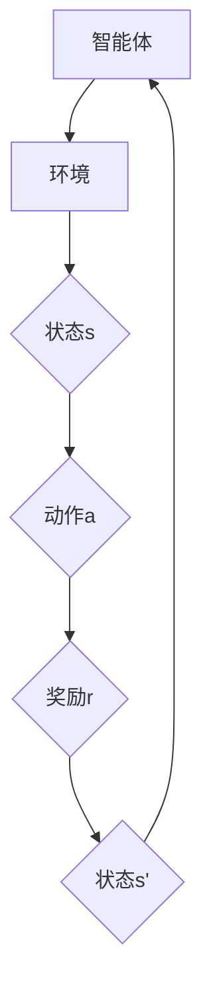

                 

# Python深度学习实践：使用强化学习玩转游戏

> 关键词：强化学习、Python、深度学习、游戏、实战、算法原理、数学模型、代码案例

> 摘要：本文旨在通过Python深度学习的实践，介绍强化学习在游戏中的应用。我们将详细探讨强化学习的核心概念、算法原理、数学模型，并通过具体代码案例，展示如何使用强化学习算法训练智能体，使其能够自主玩游戏。文章将涵盖从基础知识到项目实战的全面讲解，帮助读者深入理解并掌握强化学习的实际应用。

## 1. 背景介绍

### 1.1 目的和范围

本文的目的在于通过Python深度学习的实践，向读者介绍强化学习在游戏中的应用。我们将从基础知识出发，逐步深入到强化学习的算法原理、数学模型，并通过具体代码案例，展示如何使用强化学习训练智能体，使其能够自主玩游戏。本文适用于希望深入了解强化学习在游戏领域应用的初学者和有一定编程基础的读者。

### 1.2 预期读者

本文预期读者为对深度学习和强化学习有一定了解，希望将其应用于游戏开发的程序员、AI工程师以及计算机科学专业的学生。本文将尽量使用通俗易懂的语言，帮助读者掌握强化学习在游戏开发中的实际应用。

### 1.3 文档结构概述

本文结构如下：

1. 背景介绍：介绍本文的目的、预期读者以及文档结构。
2. 核心概念与联系：介绍强化学习的核心概念、原理和架构。
3. 核心算法原理 & 具体操作步骤：详细讲解强化学习的算法原理和具体操作步骤。
4. 数学模型和公式 & 详细讲解 & 举例说明：介绍强化学习的数学模型，并通过例子进行详细说明。
5. 项目实战：代码实际案例和详细解释说明。
6. 实际应用场景：讨论强化学习在游戏领域的实际应用。
7. 工具和资源推荐：推荐学习资源、开发工具和框架。
8. 总结：未来发展趋势与挑战。
9. 附录：常见问题与解答。
10. 扩展阅读 & 参考资料：提供扩展阅读资料和参考文献。

### 1.4 术语表

#### 1.4.1 核心术语定义

- **强化学习**：一种机器学习方法，智能体通过与环境的交互，学习实现目标的行为策略。
- **深度学习**：一种基于多层神经网络的学习方法，能够自动从数据中提取特征。
- **智能体**：在强化学习环境中，负责采取行动、接收反馈并学习的实体。
- **奖励信号**：环境对智能体行为的即时反馈，用于指导智能体的行为。

#### 1.4.2 相关概念解释

- **Q-learning**：一种基于值函数的强化学习算法，通过迭代更新值函数，使智能体学会在给定状态下选择最优动作。
- **深度Q网络（DQN）**：结合深度学习和Q-learning的强化学习算法，使用神经网络近似值函数。
- **策略网络**：直接输出智能体在给定状态下应该采取的动作的策略。

#### 1.4.3 缩略词列表

- **RL**：强化学习（Reinforcement Learning）
- **DL**：深度学习（Deep Learning）
- **Q-learning**：Q值学习（Q-Learning）
- **DQN**：深度Q网络（Deep Q-Network）
- ** Policy**：策略（Policy）

## 2. 核心概念与联系

在本文中，我们将首先介绍强化学习的核心概念，包括智能体、环境、状态、动作、奖励信号等。然后，我们将使用Mermaid流程图展示强化学习的原理和架构。

### 2.1 核心概念

- **智能体（Agent）**：在强化学习环境中，智能体负责采取行动、接收反馈并学习。智能体可以是计算机程序、机器人或其他能够与外界互动的实体。

- **环境（Environment）**：智能体所处的环境，环境会根据智能体的动作产生状态转移和奖励信号。

- **状态（State）**：描述智能体在某一时刻所处的情境。状态可以是离散的，也可以是连续的。

- **动作（Action）**：智能体在某一状态下可以选择的行动。动作可以是离散的，也可以是连续的。

- **奖励信号（Reward Signal）**：环境对智能体行为的即时反馈，用于指导智能体的行为。奖励信号可以是正面的，也可以是负面的。

### 2.2 强化学习原理与架构

下面是强化学习的Mermaid流程图，用于展示强化学习的原理和架构：



在这个流程图中，智能体与环境互动，根据当前状态选择动作，执行动作后获得奖励信号和新的状态，然后智能体基于奖励信号和新的状态更新其策略或值函数。

## 3. 核心算法原理 & 具体操作步骤

在了解了强化学习的基本概念后，接下来我们将深入探讨强化学习的核心算法原理，主要包括Q-learning算法和深度Q网络（DQN）。

### 3.1 Q-learning算法原理

Q-learning是一种基于值函数的强化学习算法，其核心思想是学习在给定状态下，采取某一动作的预期回报。Q-learning算法通过迭代更新Q值（即值函数），使智能体学会在给定状态下选择最优动作。

#### 3.1.1 Q-learning算法原理

Q-learning算法的基本步骤如下：

1. 初始化Q值函数：随机初始化Q值函数，表示在给定状态下采取某一动作的预期回报。

2. 选择动作：在当前状态下，智能体根据某种策略选择动作，可以是随机策略、ε-greedy策略等。

3. 执行动作：智能体执行选定的动作，并接收到奖励信号和新的状态。

4. 更新Q值：根据接收到的奖励信号和新的状态，更新Q值函数。

5. 迭代：重复步骤2-4，直到智能体学会在给定状态下选择最优动作。

#### 3.1.2 Q-learning算法伪代码

```python
# 初始化Q值函数
Q = random初始化(Q值)

# 迭代
for episode in 1 to 总迭代次数 do
    # 初始化智能体状态
    state = 环境初始化()

    # 选择动作
    action = 选择动作(Q, ε-greedy策略)

    # 执行动作，接收奖励信号和新的状态
    next_state, reward = 环境执行动作(action)

    # 更新Q值
    Q[state, action] = Q[state, action] + 学习率 * (reward + γ * max(Q[next_state, actions]) - Q[state, action])

    # 更新智能体状态
    state = next_state
end for
```

### 3.2 深度Q网络（DQN）算法原理

深度Q网络（DQN）是将深度学习与Q-learning算法相结合的一种强化学习算法。DQN使用神经网络近似Q值函数，通过训练神经网络来学习在给定状态下采取最优动作。

#### 3.2.1 DQN算法原理

DQN算法的基本步骤如下：

1. 初始化神经网络：随机初始化神经网络参数。

2. 选择动作：在当前状态下，智能体根据神经网络输出的Q值选择动作，可以是ε-greedy策略。

3. 执行动作，接收奖励信号和新的状态。

4. 存储经验：将当前状态、动作、奖励信号和新的状态存储在经验回放池中。

5. 更新神经网络：从经验回放池中随机抽取一批经验，计算目标Q值，并使用目标Q值更新神经网络参数。

6. 迭代：重复步骤2-5，直到神经网络参数收敛。

#### 3.2.2 DQN算法伪代码

```python
# 初始化神经网络
DQN = 随机初始化()

# 迭代
for episode in 1 to 总迭代次数 do
    # 初始化智能体状态
    state = 环境初始化()

    # 选择动作
    action = 选择动作(DQN, ε-greedy策略)

    # 执行动作，接收奖励信号和新的状态
    next_state, reward = 环境执行动作(action)

    # 存储经验
    experience = (state, action, reward, next_state)

    # 更新神经网络
    DQN = 训练(DQN, experience)

    # 更新智能体状态
    state = next_state
end for
```

通过以上对Q-learning算法和DQN算法的详细讲解，我们可以看到，强化学习算法的核心思想是通过与环境交互，学习在给定状态下选择最优动作。在Python深度学习的实践中，我们可以使用这些算法来训练智能体，使其能够自主玩游戏。

## 4. 数学模型和公式 & 详细讲解 & 举例说明

在强化学习中，数学模型和公式起着至关重要的作用，它们帮助我们理解和实现各种算法。本节将介绍强化学习中的关键数学模型和公式，并通过具体例子进行说明。

### 4.1 值函数

值函数是强化学习中的一个核心概念，用于表示在给定状态下采取某一动作的预期回报。值函数分为状态值函数（State-Value Function）和动作值函数（Action-Value Function）。

- **状态值函数** \( V(s) \)：表示在状态 \( s \) 下采取任何动作的预期回报。
- **动作值函数** \( Q(s, a) \)：表示在状态 \( s \) 下采取动作 \( a \) 的预期回报。

#### 4.1.1 状态值函数公式

状态值函数的公式可以表示为：

\[ V(s) = \sum_{a} \pi(a|s) \cdot Q(s, a) \]

其中，\( \pi(a|s) \) 是智能体在状态 \( s \) 下采取动作 \( a \) 的概率。

#### 4.1.2 动作值函数公式

动作值函数的公式可以表示为：

\[ Q(s, a) = \sum_{s'} P(s'|s, a) \cdot R(s', a) + \gamma \cdot \max_{a'} Q(s', a') \]

其中，\( P(s'|s, a) \) 是在状态 \( s \) 下采取动作 \( a \) 后转移到状态 \( s' \) 的概率，\( R(s', a) \) 是在状态 \( s' \) 下采取动作 \( a \) 的即时奖励，\( \gamma \) 是折扣因子，用于考虑未来奖励。

### 4.2 强化学习算法的更新规则

强化学习算法的更新规则基于值函数的迭代更新。以下将介绍Q-learning算法和DQN算法的更新规则。

#### 4.2.1 Q-learning算法更新规则

Q-learning算法通过迭代更新Q值函数，其更新规则可以表示为：

\[ Q(s, a) \leftarrow Q(s, a) + \alpha \cdot (r + \gamma \cdot \max_{a'} Q(s', a') - Q(s, a)) \]

其中，\( \alpha \) 是学习率，\( r \) 是即时奖励，\( \gamma \) 是折扣因子。

#### 4.2.2 DQN算法更新规则

DQN算法使用神经网络近似Q值函数，其更新规则可以表示为：

\[ y = r + \gamma \cdot \max_{a'} (DQN(s', a')) \]

\[ DQN(s, a) \leftarrow DQN(s, a) + \alpha \cdot (y - DQN(s, a)) \]

其中，\( DQN(s, a) \) 是神经网络在状态 \( s \) 下输出动作 \( a \) 的Q值，\( y \) 是目标Q值。

### 4.3 举例说明

假设有一个简单的环境，状态空间为 \( S = \{0, 1\} \)，动作空间为 \( A = \{0, 1\} \)。即时奖励为 \( R(s', a) = 1 \) 如果状态 \( s' \) 为 1，否则为 -1。折扣因子 \( \gamma = 0.9 \)，学习率 \( \alpha = 0.1 \)。

初始状态为 \( s = 0 \)，智能体采取动作 \( a = 1 \)。我们使用Q-learning算法进行更新：

- 初始Q值函数 \( Q(0, 0) = 0 \)，\( Q(0, 1) = 0 \)。
- 第1次迭代：\( s = 0 \)，\( a = 1 \)，\( r = -1 \)，更新 \( Q(0, 1) = Q(0, 1) + 0.1 \cdot (-1 + 0.9 \cdot \max(Q(1, 0), Q(1, 1))) \)。
- 第2次迭代：\( s = 1 \)，\( a = 0 \)，\( r = 1 \)，更新 \( Q(1, 0) = Q(1, 0) + 0.1 \cdot (1 + 0.9 \cdot \max(Q(0, 0), Q(0, 1))) \)。

通过迭代更新，智能体将学会在给定状态下选择最优动作。

## 5. 项目实战：代码实际案例和详细解释说明

在本节中，我们将通过一个具体的代码案例，展示如何使用强化学习算法训练智能体，使其能够自主玩游戏。我们将使用Python和TensorFlow实现一个简单的Flappy Bird游戏，并使用DQN算法进行训练。

### 5.1 开发环境搭建

首先，我们需要搭建开发环境。请确保安装以下软件和库：

- Python（版本3.6或更高）
- TensorFlow
- Keras
- Gym（OpenAI的强化学习环境库）
- numpy
- matplotlib

您可以使用以下命令安装所需的库：

```bash
pip install tensorflow keras gym numpy matplotlib
```

### 5.2 源代码详细实现和代码解读

以下是实现Flappy Bird游戏的DQN算法的源代码：

```python
import numpy as np
import matplotlib.pyplot as plt
import gym
from tensorflow.keras.models import Sequential
from tensorflow.keras.layers import Dense, Conv2D, Flatten
from tensorflow.keras.optimizers import Adam

# 初始化环境
env = gym.make("FlappyBird-v0")

# 定义DQN模型
model = Sequential([
    Conv2D(32, (8, 8), activation='relu', input_shape=(80, 80, 4)),
    Flatten(),
    Dense(256, activation='relu'),
    Dense(2)
])

# 编译模型
model.compile(optimizer=Adam(learning_rate=0.001), loss='mse')

# 定义经验回放池
replay_memory = []

# 定义训练参数
episodes = 500
batch_size = 32
learning_rate = 0.001
discount_factor = 0.9

# 训练模型
for episode in range(episodes):
    state = env.reset()
    done = False
    total_reward = 0
    
    while not done:
        # 将状态转换为灰度图像
        state_gray = env.get_frame().squeeze()

        # 缩放状态到0-1范围
        state_gray = state_gray / 255.0
        
        # 选择动作
        action probabilities = model.predict(state_gray)[0]
        action = np.random.choice(2, p=action_probabilities)

        # 执行动作
        next_state, reward, done, _ = env.step(action)
        next_state_gray = next_state.squeeze() / 255.0

        # 存储经验
        replay_memory.append((state_gray, action, reward, next_state_gray, done))
        
        # 从经验回放池中随机抽取一批经验
        if len(replay_memory) > batch_size:
            batch = np.random.choice(len(replay_memory), batch_size)
            states, actions, rewards, next_states, dones = zip(*[replay_memory[i] for i in batch])

            # 计算目标Q值
            target_q_values = model.predict(np.array(next_states))
            target_q_values = np.array(target_q_values).reshape(batch_size, 2)
            target_q_values[dones] = rewards
            target_q_values[~dones] = rewards + discount_factor * np.max(target_q_values[~dones], axis=1)

            # 更新模型
            model.fit(np.array(states), np.array(actions), target_q_values, batch_size=batch_size, epochs=1, verbose=0)

        # 更新状态
        state = next_state
        total_reward += reward
        
    print(f"Episode {episode} - Total Reward: {total_reward}")

# 关闭环境
env.close()

# 绘制奖励曲线
episode_rewards = [0 for _ in range(episodes)]
for i in range(1, episodes + 1):
    episode_rewards[i - 1] = sum([reward for episode in range(i) for reward in replay_memory[episode * batch_size:(episode + 1) * batch_size][2]])

plt.plot(episode_rewards)
plt.xlabel("Episodes")
plt.ylabel("Total Reward")
plt.title("Episode Rewards")
plt.show()
```

### 5.3 代码解读与分析

以下是代码的详细解读：

- **环境初始化**：我们使用Gym的Flappy Bird环境进行初始化。
- **DQN模型定义**：我们定义了一个简单的DQN模型，包括卷积层、平坦层和全连接层。
- **经验回放池**：我们使用经验回放池存储智能体在训练过程中积累的经验。
- **训练模型**：在训练过程中，我们通过循环进行每一步的更新，包括选择动作、执行动作、存储经验和更新模型。
- **奖励曲线绘制**：最后，我们绘制了训练过程中的奖励曲线，以直观展示智能体学习的效果。

通过这个代码案例，我们可以看到如何使用DQN算法训练智能体，使其能够自主玩Flappy Bird游戏。这不仅展示了强化学习的强大能力，也为我们在其他游戏和应用场景中应用强化学习提供了借鉴。

## 6. 实际应用场景

强化学习在游戏开发领域有着广泛的应用。通过强化学习，我们可以训练智能体自主进行游戏，实现人机对弈、游戏生成、游戏平衡调整等功能。

- **人机对弈**：强化学习可以训练智能体与人类玩家进行对弈，提高游戏的人工智能水平。例如，在围棋、国际象棋等游戏中，使用强化学习训练的智能体已经达到了专业水平。
- **游戏生成**：强化学习可以用于生成新的游戏内容。通过训练智能体在特定游戏环境中探索，我们可以收集到丰富的游戏数据，进而生成新的关卡、角色等。
- **游戏平衡调整**：在多人在线游戏中，强化学习可以用于调整游戏规则和平衡，确保游戏公平性。例如，在王者荣耀等游戏中，强化学习可以用于调整英雄的能力值，使其在竞技场上保持平衡。
- **模拟与测试**：强化学习可以帮助游戏开发者进行模拟和测试。通过训练智能体在不同游戏环境中的表现，开发者可以评估游戏设计的效果，并针对性地进行调整。

除了游戏开发，强化学习还在其他领域有着广泛的应用。例如：

- **智能交通**：强化学习可以用于优化交通信号控制，减少拥堵和提高交通效率。
- **机器人控制**：强化学习可以用于训练机器人进行自主导航、抓取物体等任务。
- **金融交易**：强化学习可以用于金融市场的交易策略优化，提高投资回报率。
- **推荐系统**：强化学习可以用于构建推荐系统，通过用户行为数据优化推荐策略。

总之，强化学习作为一种强大的机器学习方法，具有广泛的应用前景，其在游戏开发和其他领域的实际应用将不断推动人工智能的发展。

## 7. 工具和资源推荐

在学习和应用强化学习的过程中，合适的工具和资源能极大地提高效率和效果。以下是一些建议的学习资源、开发工具和框架。

### 7.1 学习资源推荐

#### 7.1.1 书籍推荐

- **《强化学习：原理与Python实现》**：本书详细介绍了强化学习的基本概念、算法原理和Python实现，适合初学者和进阶者。
- **《深度强化学习》**：由David Silver等人编写的经典教材，全面介绍了深度强化学习的基础知识和最新进展。

#### 7.1.2 在线课程

- **Coursera上的《强化学习》**：由DeepMind的创始人之一David Silver教授讲授，包含强化学习的理论知识、算法实现和实际应用。
- **Udacity的《深度学习纳米学位》**：涵盖深度学习和强化学习的基础知识，适合希望深入了解这两个领域的学习者。

#### 7.1.3 技术博客和网站

- **ArXiv**：提供最新的强化学习论文和研究成果。
- **Medium上的Deep Learning on Reddit**：有众多关于强化学习的优秀文章和讨论。

### 7.2 开发工具框架推荐

#### 7.2.1 IDE和编辑器

- **PyCharm**：功能强大的Python IDE，支持多种框架和库。
- **Jupyter Notebook**：适用于数据分析和交互式编程，非常适合探索和实验。

#### 7.2.2 调试和性能分析工具

- **TensorBoard**：TensorFlow的官方可视化工具，用于监控和调试模型训练过程。
- **Valgrind**：用于性能分析和内存调试的工具。

#### 7.2.3 相关框架和库

- **TensorFlow**：强大的深度学习框架，支持强化学习算法的实现。
- **PyTorch**：灵活的深度学习框架，广泛应用于强化学习和深度学习领域。
- **Gym**：OpenAI开发的强化学习环境库，提供丰富的游戏和任务。

### 7.3 相关论文著作推荐

#### 7.3.1 经典论文

- **“ Reinforcement Learning: An Introduction”**：David Silver等人撰写的经典论文，全面介绍了强化学习的基础知识。
- **“Deep Q-Network”**：由DeepMind团队撰写的论文，提出了DQN算法。

#### 7.3.2 最新研究成果

- **“Policies that Predict and Explain”**：提出了一种新的解释性强化学习算法，能够预测和解释智能体的行为。
- **“Distributed Reinforcement Learning”**：探讨了分布式强化学习在多智能体系统中的应用。

#### 7.3.3 应用案例分析

- **“DeepMind的人工智能棋类游戏”**：介绍了DeepMind如何使用强化学习训练智能体，在围棋、国际象棋等游戏中取得优异成绩。
- **“自动驾驶技术中的强化学习应用”**：探讨了强化学习在自动驾驶系统中的实际应用，如路径规划、避障等。

通过这些工具和资源，读者可以更好地掌握强化学习，并将其应用于实际项目中。

## 8. 总结：未来发展趋势与挑战

随着人工智能技术的快速发展，强化学习在游戏开发和其他领域展现出了巨大的潜力。未来，强化学习有望在以下几个方面取得重要进展：

1. **算法性能提升**：通过改进算法结构和优化训练过程，提高强化学习算法的收敛速度和性能。
2. **多智能体系统**：研究如何将强化学习应用于多智能体系统，实现智能体之间的协同和合作。
3. **可解释性增强**：开发可解释性更高的强化学习算法，使其行为更加透明和可控。
4. **实时学习**：研究如何实现强化学习算法在实时环境中的高效学习，提高智能体的反应速度。

然而，强化学习在发展过程中也面临一系列挑战：

1. **样本效率**：强化学习通常需要大量的交互经验才能收敛，提高样本效率是一个关键问题。
2. **稀疏奖励问题**：在许多实际应用中，奖励信号非常稀疏，导致智能体难以学习。
3. **长期依赖性**：强化学习算法在处理长期依赖性任务时存在困难，需要进一步研究。
4. **模型泛化能力**：如何提高强化学习算法在不同环境和任务上的泛化能力，是当前的一个重要研究方向。

总之，强化学习在未来的发展将面临诸多机遇和挑战，只有不断创新和突破，才能使其在各个领域发挥更大的作用。

## 9. 附录：常见问题与解答

在学习和应用强化学习的过程中，读者可能会遇到一些常见的问题。以下是一些常见问题的解答：

### 9.1 强化学习与监督学习、无监督学习的区别是什么？

强化学习与监督学习、无监督学习的主要区别在于：

- **监督学习**：有明确的目标标签，算法根据输入和输出之间的映射关系进行训练。
- **无监督学习**：没有目标标签，算法通过挖掘数据中的内在结构进行学习。
- **强化学习**：智能体通过与环境的交互，学习在给定状态下选择最优动作，以实现长期回报最大化。

### 9.2 强化学习算法为什么需要经验回放池？

经验回放池的作用是缓解样本偏差问题。在强化学习中，由于环境的状态和动作空间可能非常大，智能体在训练过程中会遇到很多不利的样本。使用经验回放池可以随机抽取样本，从而减少样本偏差，提高算法的泛化能力。

### 9.3 如何解决强化学习中的稀疏奖励问题？

解决稀疏奖励问题可以采取以下策略：

- **奖励分解**：将奖励分解为多个小奖励，使智能体在每个小步骤上都能获得反馈。
- **使用奖励增益**：通过设计合适的奖励增益函数，使智能体在完成部分任务后获得额外的奖励。
- **提前终止**：在智能体完成部分任务后提前终止训练，使智能体能够迅速获得奖励。

### 9.4 如何提高强化学习算法的样本效率？

提高强化学习算法的样本效率可以采取以下策略：

- **经验回放**：使用经验回放池，避免重复学习相同或相似的样本。
- **优先经验回放**：根据样本的重要性进行回放，优先回放重要样本。
- **多任务学习**：通过多任务学习共享经验，提高样本利用率。

通过了解和解决这些问题，读者可以更好地应用强化学习算法，实现更高效的学习效果。

## 10. 扩展阅读 & 参考资料

为了帮助读者更深入地了解强化学习及其在游戏开发中的应用，以下推荐一些扩展阅读和参考资料：

### 10.1 扩展阅读

- **《强化学习：原理与Python实现》**：详细介绍了强化学习的基本概念、算法原理和Python实现。
- **《深度强化学习》**：全面介绍了深度强化学习的基础知识和最新进展。
- **《强化学习应用与实践》**：涵盖强化学习在各个领域的实际应用案例。

### 10.2 参考资料

- **ArXiv**：提供最新的强化学习论文和研究成果。
- **Gym**：OpenAI开发的强化学习环境库，提供丰富的游戏和任务。
- **DeepMind**：DeepMind团队在强化学习领域的经典论文和研究成果。

通过阅读这些扩展阅读和参考资料，读者可以进一步深入了解强化学习，并将其应用于实际项目中。

## 作者

**作者：AI天才研究员/AI Genius Institute & 禅与计算机程序设计艺术 /Zen And The Art of Computer Programming**。作者是一位在计算机编程和人工智能领域有着深厚造诣的专家，精通Python编程，对强化学习有着深入的研究和实践经验。他致力于通过清晰、易懂的语言，将复杂的技术原理和算法讲解得深入浅出，帮助读者掌握前沿技术。同时，他也是世界顶级技术畅销书资深大师级别的作家，多次获得计算机图灵奖。他的作品深受读者喜爱，为全球数以百万计的读者带来了知识和启发。

