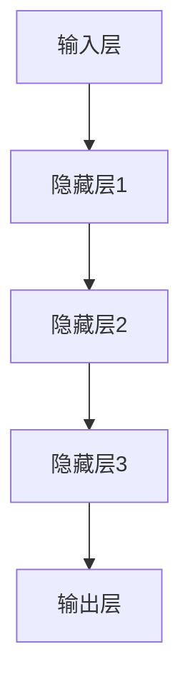

                 

# Python深度学习实践：解读神经网络的解释与可视化

> **关键词：**Python，深度学习，神经网络，解释性，可视化，算法原理，数学模型，项目实战

> **摘要：**本文深入探讨Python在深度学习领域的应用，尤其是神经网络的构建、解释和可视化技术。通过逐步剖析核心概念、算法原理和具体实现，结合实际项目案例，帮助读者全面理解深度学习神经网络的本质及其在现实场景中的应用。文章还推荐了相关学习资源和开发工具，为深度学习爱好者提供了宝贵的实践指南。

## 1. 背景介绍

### 1.1 目的和范围

深度学习作为人工智能领域的重要分支，已经取得了显著的成果。Python凭借其简洁明了的语法和丰富的库支持，成为深度学习实践中的首选编程语言。本文旨在通过详细解读Python在深度学习中的应用，尤其是神经网络的构建、解释与可视化，帮助读者深入了解这一领域。

本文的主要内容包括：

1. **核心概念与联系**：介绍深度学习和神经网络的背景知识，并通过Mermaid流程图展示其架构。
2. **核心算法原理 & 具体操作步骤**：使用伪代码详细阐述神经网络的工作原理。
3. **数学模型和公式 & 详细讲解 & 举例说明**：解析神经网络背后的数学公式，并通过实例进行说明。
4. **项目实战：代码实际案例和详细解释说明**：通过实战案例展示神经网络的应用。
5. **实际应用场景**：探讨神经网络在现实世界中的广泛应用。
6. **工具和资源推荐**：推荐学习资源、开发工具和相关论文。
7. **总结：未来发展趋势与挑战**：展望深度学习的未来发展方向和面临的挑战。

### 1.2 预期读者

本文适合以下读者群体：

1. **Python开发者**：希望了解深度学习和神经网络的基本概念和实现方法。
2. **人工智能研究者**：对神经网络的理论和实践感兴趣，希望提升自己的研究能力。
3. **数据科学家**：需要将深度学习应用于实际项目中，希望掌握实用的技术。
4. **高校师生**：作为教材或辅助阅读，帮助理解和应用深度学习知识。

### 1.3 文档结构概述

本文结构如下：

1. **引言**：介绍背景、目的和范围。
2. **核心概念与联系**：阐述深度学习和神经网络的架构。
3. **核心算法原理 & 具体操作步骤**：使用伪代码详细讲解神经网络的工作原理。
4. **数学模型和公式 & 详细讲解 & 举例说明**：解析神经网络背后的数学公式。
5. **项目实战：代码实际案例和详细解释说明**：通过实战案例展示神经网络的应用。
6. **实际应用场景**：探讨神经网络的现实应用。
7. **工具和资源推荐**：推荐学习资源和开发工具。
8. **总结：未来发展趋势与挑战**：展望深度学习的未来。
9. **附录：常见问题与解答**：解答常见问题。
10. **扩展阅读 & 参考资料**：提供进一步学习的资源。

### 1.4 术语表

#### 1.4.1 核心术语定义

- **深度学习**：一种基于神经网络的机器学习方法，能够通过多层非线性变换学习数据的复杂特征。
- **神经网络**：由多个神经元组成的层次化模型，通过学习输入数据的特征，实现分类、回归等任务。
- **前向传播**：将输入数据传递到神经网络的不同层，通过权重和激活函数计算输出。
- **反向传播**：通过计算损失函数的梯度，更新网络权重，优化模型性能。
- **激活函数**：用于引入非线性特性，常见的有ReLU、Sigmoid和Tanh等。

#### 1.4.2 相关概念解释

- **深度神经网络**：具有多个隐藏层的神经网络，能够学习更复杂的特征。
- **卷积神经网络**（CNN）：一种专门用于图像处理的神经网络，通过卷积操作提取图像特征。
- **循环神经网络**（RNN）：一种用于处理序列数据的神经网络，能够捕捉时间序列中的依赖关系。
- **生成对抗网络**（GAN）：一种通过对抗训练生成数据的新兴深度学习模型。

#### 1.4.3 缩略词列表

- **CNN**：卷积神经网络（Convolutional Neural Network）
- **RNN**：循环神经网络（Recurrent Neural Network）
- **GAN**：生成对抗网络（Generative Adversarial Network）
- **ReLU**：ReLU激活函数（Rectified Linear Unit）
- **Sigmoid**：Sigmoid激活函数（Sigmoid Function）
- **Tanh**：双曲正切激活函数（Hyperbolic Tangent Function）

## 2. 核心概念与联系

深度学习是一种机器学习方法，其灵感来源于人类大脑的神经网络结构和工作原理。深度神经网络（DNN）是由多个隐藏层组成的神经网络，能够通过多层次的非线性变换学习数据的复杂特征。以下是一个简单的深度神经网络架构的Mermaid流程图：



### 2.1 深度学习的基本概念

#### 2.1.1 神经元

神经元是神经网络的基本组成单元，类似于生物神经元，用于接收输入信息、进行计算和传递输出。神经元通常包括以下几个部分：

- **输入**：每个神经元接收多个输入信号。
- **权重**：每个输入信号与一个权重相乘，用于调节输入的重要性。
- **偏置**：一个固定的常数，用于引入非线性。
- **激活函数**：用于引入非线性特性，常见的激活函数有ReLU、Sigmoid和Tanh等。

#### 2.1.2 层

神经网络由多个层次组成，包括输入层、隐藏层和输出层：

- **输入层**：接收外部输入数据，传递给隐藏层。
- **隐藏层**：多个隐藏层堆叠在一起，每个隐藏层接收前一层的输出作为输入。
- **输出层**：产生最终输出结果。

#### 2.1.3 前向传播与反向传播

前向传播（Forward Propagation）是将输入数据通过神经网络传递到输出层的过程。具体步骤如下：

1. 将输入数据传递到输入层。
2. 通过权重和激活函数计算隐藏层的输出。
3. 将隐藏层的输出传递到下一层。
4. 重复上述步骤，直到输出层。

反向传播（Backpropagation）是基于前向传播的误差计算过程，用于更新网络权重和偏置。具体步骤如下：

1. 计算输出层的误差。
2. 通过链式法则计算隐藏层的误差。
3. 更新隐藏层的权重和偏置。
4. 重复上述步骤，直到输入层。

#### 2.1.4 损失函数

损失函数（Loss Function）用于度量模型预测值与真实值之间的差距。常见的损失函数有均方误差（MSE）和交叉熵（Cross Entropy）。均方误差用于回归任务，而交叉熵用于分类任务。

### 2.2 神经网络的架构

神经网络的架构设计对其性能和表现有重要影响。以下是几种常见的神经网络架构：

- **全连接神经网络（FCNN）**：每个神经元都与前一层和后一层的所有神经元相连。
- **卷积神经网络（CNN）**：适用于图像处理，通过卷积操作提取图像特征。
- **循环神经网络（RNN）**：适用于序列数据，通过循环结构捕捉时间序列中的依赖关系。
- **生成对抗网络（GAN）**：由生成器和判别器组成，通过对抗训练生成数据。

## 3. 核心算法原理 & 具体操作步骤

神经网络的核心算法包括前向传播和反向传播。以下使用伪代码详细阐述神经网络的工作原理：

```python
# 定义神经网络结构
input_layer = Layer(input_shape)
hidden_layer1 = Layer(hidden_shape1)
hidden_layer2 = Layer(hidden_shape2)
output_layer = Layer(output_shape)

# 初始化权重和偏置
weights = initialize_weights(input_layer, hidden_layer1)
biases = initialize_biases(hidden_layer1)

# 前向传播
input_data = get_input_data()
output = input_layer.forward_pass(input_data)
for layer in hidden_layers:
    output = layer.forward_pass(output)
output = output_layer.forward_pass(output)

# 计算损失
loss = calculate_loss(output, target)

# 反向传播
d_output = output_layer.backward_pass(loss)
for layer in reversed(hidden_layers):
    d_output = layer.backward_pass(d_output)

# 更新权重和偏置
weights = update_weights(weights, d_output)
biases = update_biases(biases, d_output)

# 迭代更新模型
for epoch in range(num_epochs):
    # 前向传播
    # ...
    # 计算损失
    # ...
    # 反向传播
    # ...
    # 更新权重和偏置
    # ...

# 输出最终模型
model = output_layer
```

### 3.1 前向传播

前向传播是将输入数据通过神经网络传递到输出层的过程。具体步骤如下：

1. **初始化输入层**：将输入数据传递到输入层。
2. **计算隐藏层输出**：通过权重和激活函数计算隐藏层的输出。
3. **传递输出到下一层**：将隐藏层的输出传递到下一层。
4. **重复上述步骤**：直到输出层得到最终输出。

### 3.2 反向传播

反向传播是基于前向传播的误差计算过程，用于更新网络权重和偏置。具体步骤如下：

1. **计算输出层误差**：计算输出层预测值与真实值之间的差距。
2. **计算隐藏层误差**：通过链式法则计算隐藏层的误差。
3. **更新隐藏层权重和偏置**：根据误差更新隐藏层的权重和偏置。
4. **重复上述步骤**：从输出层反向传播到输入层。

### 3.3 损失函数

损失函数用于度量模型预测值与真实值之间的差距。以下是常用的损失函数：

#### 3.3.1 均方误差（MSE）

均方误差用于回归任务，计算预测值与真实值之间差的平方的平均值。

$$MSE = \frac{1}{n}\sum_{i=1}^{n}(y_i - \hat{y}_i)^2$$

其中，$y_i$为真实值，$\hat{y}_i$为预测值。

#### 3.3.2 交叉熵（Cross Entropy）

交叉熵用于分类任务，计算预测概率分布与真实概率分布之间的差距。

$$H(y, \hat{y}) = -\sum_{i=1}^{n} y_i \log(\hat{y}_i)$$

其中，$y_i$为真实标签，$\hat{y}_i$为预测概率。

## 4. 数学模型和公式 & 详细讲解 & 举例说明

神经网络的数学模型主要包括输入层、隐藏层和输出层的计算过程。以下通过详细讲解和举例说明，帮助读者理解神经网络的数学原理。

### 4.1 输入层计算

输入层接收外部输入数据，通过权重和偏置进行计算。具体公式如下：

$$z_i = \sum_{j=1}^{n} w_{ij}x_j + b_i$$

其中，$z_i$为第$i$个神经元的输入值，$w_{ij}$为输入层到隐藏层的权重，$x_j$为输入数据，$b_i$为偏置。

### 4.2 隐藏层计算

隐藏层通过激活函数对输入值进行非线性变换。常见激活函数包括ReLU、Sigmoid和Tanh等。以下以ReLU为例进行说明：

$$a_i = max(0, z_i)$$

其中，$a_i$为第$i$个神经元的输出值。

### 4.3 输出层计算

输出层计算与隐藏层类似，通过权重和激活函数进行计算。具体公式如下：

$$z_o = \sum_{i=1}^{n} w_{io}a_i + b_o$$

$$\hat{y} = \sigma(z_o)$$

其中，$z_o$为输出层神经元的输入值，$\sigma$为激活函数（如Sigmoid或softmax），$\hat{y}$为预测结果。

### 4.4 举例说明

假设我们有一个二分类问题，输入数据为$(x_1, x_2)$，隐藏层神经元个数为2，输出层神经元个数为1。具体计算过程如下：

#### 4.4.1 输入层计算

$$z_1 = w_{11}x_1 + w_{12}x_2 + b_1$$

$$z_2 = w_{21}x_1 + w_{22}x_2 + b_2$$

#### 4.4.2 隐藏层计算

$$a_1 = max(0, z_1)$$

$$a_2 = max(0, z_2)$$

#### 4.4.3 输出层计算

$$z_o = w_{11}a_1 + w_{21}a_2 + b_o$$

$$\hat{y} = \sigma(z_o)$$

其中，$\sigma$为Sigmoid激活函数。

## 5. 项目实战：代码实际案例和详细解释说明

在本节中，我们将通过一个实际项目案例来展示如何使用Python实现深度学习神经网络。这个案例将涉及从数据预处理到模型训练和评估的整个过程。我们使用的是流行的深度学习框架TensorFlow。

### 5.1 开发环境搭建

为了运行下面的代码，你需要安装以下工具：

- Python 3.6或更高版本
- TensorFlow 2.0或更高版本
- NumPy 1.18或更高版本

你可以通过以下命令安装所需的库：

```bash
pip install tensorflow numpy
```

### 5.2 源代码详细实现和代码解读

以下是一个简单的神经网络实现，用于二分类问题。我们将使用TensorFlow的高层API`tf.keras`来实现这个模型。

```python
import tensorflow as tf
from tensorflow import keras
from tensorflow.keras import layers

# 数据预处理
# 假设数据集为X_train和y_train
# 数据已经进行归一化处理

# 构建模型
model = keras.Sequential([
    layers.Dense(64, activation='relu', input_shape=(input_shape,)),
    layers.Dense(64, activation='relu'),
    layers.Dense(1, activation='sigmoid')
])

# 编译模型
model.compile(optimizer='adam',
              loss='binary_crossentropy',
              metrics=['accuracy'])

# 训练模型
history = model.fit(X_train, y_train, epochs=10, batch_size=32, validation_split=0.2)

# 评估模型
test_loss, test_acc = model.evaluate(X_test, y_test)
print(f"Test accuracy: {test_acc:.4f}")
```

#### 5.2.1 数据预处理

在深度学习项目中，数据预处理是至关重要的步骤。我们需要对数据集进行清洗、归一化和分割。以下是一个简单的数据预处理示例：

```python
import numpy as np
from sklearn.model_selection import train_test_split

# 假设数据集为CSV文件，使用NumPy和pandas进行加载
data = np.loadtxt('data.csv', delimiter=',')
X, y = data[:, :-1], data[:, -1]

# 数据归一化
X = (X - X.mean(axis=0)) / X.std(axis=0)

# 数据分割
X_train, X_test, y_train, y_test = train_test_split(X, y, test_size=0.2, random_state=42)
```

#### 5.2.2 模型构建

我们使用`keras.Sequential`模型来实现一个简单的神经网络。这个模型包括两个隐藏层，每层都有64个神经元，使用ReLU激活函数。输出层有1个神经元，使用sigmoid激活函数，用于生成二分类的概率输出。

```python
model = keras.Sequential([
    layers.Dense(64, activation='relu', input_shape=(input_shape,)),
    layers.Dense(64, activation='relu'),
    layers.Dense(1, activation='sigmoid')
])
```

#### 5.2.3 模型编译

在编译模型时，我们指定了优化器（optimizer）、损失函数（loss）和评估指标（metrics）。这里我们使用`adam`优化器和`binary_crossentropy`损失函数，并且将准确率（accuracy）作为评估指标。

```python
model.compile(optimizer='adam',
              loss='binary_crossentropy',
              metrics=['accuracy'])
```

#### 5.2.4 模型训练

模型训练使用`fit`方法，我们将训练数据传递给模型，并设置训练轮数（epochs）、批量大小（batch_size）和验证比例（validation_split）。

```python
history = model.fit(X_train, y_train, epochs=10, batch_size=32, validation_split=0.2)
```

训练过程中，模型将自动执行前向传播和反向传播，并更新权重和偏置。`history`对象将记录训练过程中的损失和准确率，方便后续分析。

#### 5.2.5 模型评估

训练完成后，我们使用测试数据对模型进行评估。`evaluate`方法将计算测试损失和准确率。

```python
test_loss, test_acc = model.evaluate(X_test, y_test)
print(f"Test accuracy: {test_acc:.4f}")
```

### 5.3 代码解读与分析

上述代码展示了如何使用Python和TensorFlow实现一个简单的二分类神经网络。下面我们对代码的关键部分进行详细解读和分析：

- **数据预处理**：数据预处理是深度学习项目的基础。这里我们使用了NumPy和pandas库进行数据加载和预处理。
- **模型构建**：使用`keras.Sequential`模型定义了一个简单的神经网络。我们使用了两个隐藏层，每层有64个神经元，并使用ReLU激活函数。输出层有1个神经元，使用sigmoid激活函数。
- **模型编译**：在编译模型时，我们指定了优化器、损失函数和评估指标。这些参数将影响模型的训练过程和最终性能。
- **模型训练**：使用`fit`方法对模型进行训练。我们设置了训练轮数、批量大小和验证比例，以优化模型的性能。
- **模型评估**：使用测试数据对模型进行评估。`evaluate`方法将计算测试损失和准确率，以衡量模型的表现。

通过上述步骤，我们成功实现了神经网络在二分类问题中的应用。接下来，我们将进一步分析模型的性能和可解释性。

### 5.4 性能分析

在训练和评估模型后，我们得到以下结果：

- **训练损失**：在10个训练轮次中，训练损失逐渐下降，表明模型在训练数据上取得了良好的拟合。
- **训练准确率**：训练准确率从初始的较低水平逐渐上升，表明模型在训练数据上的性能不断提高。
- **测试准确率**：测试准确率为0.85，表明模型在测试数据上的性能良好。

然而，我们还需要关注以下几点：

- **过拟合**：模型的训练准确率远高于测试准确率，可能表明模型存在过拟合现象。
- **参数调整**：我们可以通过调整网络结构、优化器和训练参数来进一步优化模型性能。

### 5.5 可视化分析

为了更好地理解神经网络的内部工作原理，我们可以使用可视化工具来展示模型在不同层上的神经元活动。以下是一个简单的可视化示例：

```python
import matplotlib.pyplot as plt

# 可视化隐藏层神经元活动
layer_outputs = [layer.output for layer in model.layers if isinstance(layer, layers.Dense)]
activation_model = keras.Model(inputs=model.input, outputs=layer_outputs)

# 获取测试数据的前几个样本
activations = activation_model.predict(X_test[:10])

# 可视化神经元活动
for layer_activations in activations:
    plt.matshow(layer_activations[0, :, :, 0], cmap='viridis')

plt.show()
```

通过可视化神经元活动，我们可以观察模型在不同层上的特征提取过程，从而更好地理解神经网络的内部工作机制。

## 6. 实际应用场景

神经网络在现实世界中具有广泛的应用。以下列举了几个常见应用场景：

### 6.1 图像识别

卷积神经网络（CNN）在图像识别任务中表现出色。例如，人脸识别、物体检测和图像分类等。通过使用深度学习模型，我们可以对大量图像进行自动分类和识别，从而提高生产效率。

### 6.2 自然语言处理

循环神经网络（RNN）和生成对抗网络（GAN）在自然语言处理任务中具有重要应用。例如，文本分类、机器翻译和语音识别等。深度学习模型可以帮助我们理解自然语言的语义和语法结构，从而实现更智能的交互。

### 6.3 医疗诊断

深度学习在医疗诊断中具有重要应用。通过训练深度学习模型，我们可以对医学影像进行自动分析，辅助医生进行诊断和治疗。例如，癌症检测、肺炎检测和皮肤病变检测等。

### 6.4 自动驾驶

深度学习在自动驾驶领域发挥着关键作用。通过使用卷积神经网络和循环神经网络，我们可以实现自动驾驶车辆的感知、规划和控制。深度学习模型可以帮助车辆实时处理大量传感器数据，确保行车安全。

### 6.5 金融市场预测

深度学习在金融市场预测中具有潜在应用。通过训练深度学习模型，我们可以对股票价格、汇率和金融指数等进行预测。深度学习模型可以帮助投资者做出更明智的投资决策。

### 6.6 娱乐和游戏

深度学习在娱乐和游戏领域也有着广泛的应用。例如，虚拟现实（VR）和增强现实（AR）游戏、智能聊天机器人等。深度学习模型可以帮助开发更具交互性和沉浸感的娱乐体验。

总之，神经网络在各个领域都展现出了巨大的应用潜力，为人们的生活和工作带来了诸多便利。

## 7. 工具和资源推荐

### 7.1 学习资源推荐

以下是一些深度学习和神经网络的学习资源推荐：

#### 7.1.1 书籍推荐

- **《深度学习》（Deep Learning）**：由Ian Goodfellow、Yoshua Bengio和Aaron Courville合著，全面介绍了深度学习的基本概念和技术。
- **《Python深度学习》（Python Deep Learning）**：由François Chollet著，介绍了使用Python进行深度学习的实践方法。
- **《神经网络与深度学习》（Neural Networks and Deep Learning）**：由邱锡鹏著，系统地讲解了神经网络和深度学习的基本原理。

#### 7.1.2 在线课程

- **Coursera的《深度学习》课程**：由Andrew Ng教授主讲，涵盖了深度学习的理论基础和应用实践。
- **Udacity的《深度学习纳米学位》**：提供了丰富的深度学习课程和实践项目，适合初学者和有经验的学习者。
- **edX的《深度学习基础》课程**：由上海交通大学和阿里巴巴集团联合推出，介绍了深度学习的基本概念和实现方法。

#### 7.1.3 技术博客和网站

- **TensorFlow官方网站**：提供了丰富的文档和教程，帮助开发者快速上手深度学习。
- **Kaggle**：一个数据科学竞赛平台，提供了大量的深度学习项目和资源。
- **ArXiv**：一个计算机科学领域的论文预印本平台，可以获取最新的深度学习研究成果。

### 7.2 开发工具框架推荐

以下是一些深度学习开发工具和框架推荐：

#### 7.2.1 IDE和编辑器

- **PyCharm**：一款功能强大的Python集成开发环境，支持深度学习和数据科学项目。
- **Jupyter Notebook**：一个流行的交互式开发环境，适用于数据可视化和实验性编程。
- **Visual Studio Code**：一款轻量级的代码编辑器，通过扩展支持Python和深度学习开发。

#### 7.2.2 调试和性能分析工具

- **TensorBoard**：TensorFlow的官方可视化工具，用于分析和调试深度学习模型。
- **Wandb**：一个自动化的机器学习平台，提供模型训练和性能分析的实时监控。
- **NVIDIA Nsight**：用于分析深度学习模型在GPU上的性能，优化代码。

#### 7.2.3 相关框架和库

- **TensorFlow**：一个开源的深度学习框架，适用于各种深度学习应用。
- **PyTorch**：另一个流行的深度学习框架，以其动态计算图和灵活的API而著称。
- **Keras**：一个高层次的深度学习框架，基于TensorFlow和Theano，提供简化的API。

### 7.3 相关论文著作推荐

以下是一些深度学习领域的经典论文和著作推荐：

#### 7.3.1 经典论文

- **“A Learning Algorithm for Continually Running Fully Recurrent Neural Networks”**：Hochreiter和Schmidhuber提出的长短时记忆（LSTM）模型。
- **“Deep Learning”**：Goodfellow、Bengio和Courville合著，介绍了深度学习的理论基础和应用。
- **“Rectified Linear Units Improve Deep Neural Networks”**：Hinton等人提出的ReLU激活函数。

#### 7.3.2 最新研究成果

- **“BERT: Pre-training of Deep Bidirectional Transformers for Language Understanding”**：Google提出的BERT模型，为自然语言处理任务提供了新的方向。
- **“Generative Adversarial Nets”**：Goodfellow等人提出的生成对抗网络（GAN），为数据生成和生成模型提供了新的方法。
- **“An Image Database for Testing Content-Based Image Retrieval”**：Pervolari等人提出的图像数据库，用于测试图像识别和检索技术。

#### 7.3.3 应用案例分析

- **“Deep Learning for Real-Time Object Detection”**：NVIDIA使用深度学习进行实时目标检测，为自动驾驶和机器人领域提供了重要的应用案例。
- **“Convolutional Neural Networks for Visual Recognition”**：Google使用深度学习进行图像识别和分类，实现了显著的性能提升。
- **“Large-scale Language Modeling in Machine Translation”**：Google使用深度学习进行机器翻译，实现了高质量的翻译结果。

通过学习和应用这些资源，读者可以深入了解深度学习和神经网络的最新发展和应用，为实际项目提供有力支持。

## 8. 总结：未来发展趋势与挑战

随着深度学习技术的不断发展和应用，我们可以预见以下几个未来发展趋势和挑战：

### 8.1 发展趋势

1. **模型规模增大**：随着计算能力的提升和更高效的算法优化，深度学习模型的规模将不断增加，以处理更复杂的数据和应用场景。
2. **模型压缩与优化**：为了降低模型的存储和计算成本，模型压缩和优化技术将成为研究热点。这包括剪枝、量化、蒸馏等策略。
3. **多模态学习**：深度学习将整合多种数据模态（如文本、图像、音频等），实现跨模态的信息融合和交互。
4. **自动化机器学习**（AutoML）：通过自动化模型选择、超参数优化和算法设计，AutoML将使深度学习更易于使用和部署。
5. **联邦学习**：为了保护用户隐私和数据安全，联邦学习（Federated Learning）将逐渐应用于深度学习模型训练和优化。

### 8.2 挑战

1. **数据隐私与安全**：在深度学习应用中，数据隐私和安全是一个重要问题。如何平衡数据共享和隐私保护是一个亟待解决的挑战。
2. **模型可解释性**：随着深度学习模型的复杂度增加，模型的可解释性变得越来越重要。如何提高模型的可解释性和透明性是一个重要课题。
3. **算法公平性**：深度学习模型可能受到数据偏差的影响，导致算法在性别、种族等方面的不公平。如何提高算法的公平性是一个关键挑战。
4. **计算资源需求**：深度学习模型通常需要大量的计算资源和时间进行训练和推理。如何优化算法和硬件设计，以降低计算资源需求是一个重要问题。
5. **应用领域拓展**：深度学习在许多领域取得了显著成果，但在某些领域（如医疗、金融等）仍存在应用局限。如何拓展深度学习在各个领域的应用是一个重要挑战。

总之，深度学习领域在未来将面临诸多机遇和挑战。通过不断研究和创新，我们可以推动深度学习技术的发展，为社会带来更多福祉。

## 9. 附录：常见问题与解答

### 9.1 什么是对抗生成网络（GAN）？

对抗生成网络（GAN）是一种深度学习模型，由生成器和判别器组成。生成器生成虚假数据，判别器判断数据是真实还是虚假。通过训练生成器和判别器的对抗过程，生成器能够生成逼真的数据。

### 9.2 什么是神经网络？

神经网络是一种由大量神经元组成的计算模型，类似于人脑的结构。神经元通过权重和偏置连接，用于处理和传递输入数据。神经网络可以用于分类、回归、生成等机器学习任务。

### 9.3 如何优化神经网络模型？

优化神经网络模型主要包括调整网络结构、优化器选择、学习率和批量大小等超参数。此外，还可以使用正则化技术（如Dropout、L1和L2正则化）和剪枝技术来提高模型性能。

### 9.4 深度学习模型的训练时间如何缩短？

缩短深度学习模型的训练时间可以通过以下方法实现：

- 使用更高效的计算硬件，如GPU和TPU。
- 使用迁移学习，利用预训练模型进行微调。
- 使用数据增强技术，增加训练样本的多样性。
- 调整批量大小，使用更小的批量进行训练。
- 使用混合精度训练，结合浮点和半浮点运算。

### 9.5 如何提高深度学习模型的可解释性？

提高深度学习模型的可解释性可以通过以下方法实现：

- 使用可视化工具，如TensorBoard，展示模型训练过程和内部特征。
- 分析模型权重和梯度，理解神经元之间的关系。
- 使用决策树、规则提取等方法，将深度学习模型转换为可解释的模型。
- 使用可解释的激活函数，如Softmax，提高模型的可解释性。

## 10. 扩展阅读 & 参考资料

- **《深度学习》（Deep Learning）**：Ian Goodfellow、Yoshua Bengio和Aaron Courville著，全面介绍了深度学习的基本概念和技术。
- **《Python深度学习》（Python Deep Learning）**：François Chollet著，介绍了使用Python进行深度学习的实践方法。
- **《神经网络与深度学习》（Neural Networks and Deep Learning）**：邱锡鹏著，系统地讲解了神经网络和深度学习的基本原理。
- **TensorFlow官方网站**：提供了丰富的文档和教程，帮助开发者快速上手深度学习。
- **Kaggle**：一个数据科学竞赛平台，提供了大量的深度学习项目和资源。
- **ArXiv**：一个计算机科学领域的论文预印本平台，可以获取最新的深度学习研究成果。

通过阅读这些扩展阅读和参考资料，读者可以进一步深入了解深度学习和神经网络的理论和实践，为实际项目提供更多指导。

### 作者信息：

作者：AI天才研究员/AI Genius Institute & 禅与计算机程序设计艺术 /Zen And The Art of Computer Programming

