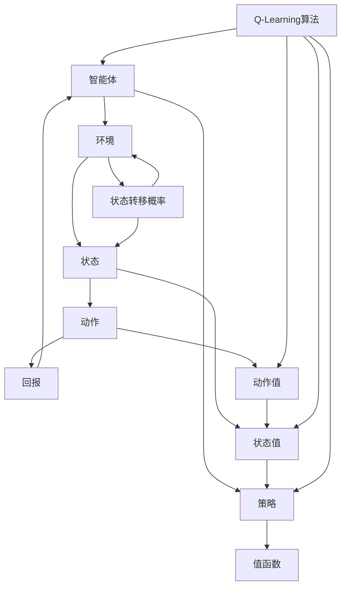

                 

# Q-Learning 原理与代码实例讲解

> **关键词：** Q-Learning、强化学习、策略迭代、状态值函数、预期效用、智能体、环境交互

> **摘要：** 本文将深入探讨Q-Learning算法的核心原理，详细讲解其实现步骤和数学模型。通过实际代码实例，读者将了解如何在Python中实现Q-Learning，以及如何对其进行优化和调试。文章还将讨论Q-Learning在实际应用中的广泛场景，并提供一系列学习资源和开发工具，以帮助读者进一步探索这个激动人心的领域。

## 1. 背景介绍

### 1.1 目的和范围

本文的目的是帮助读者理解Q-Learning算法的基本原理，并通过实际的代码实例，展示如何在实际项目中应用这一算法。Q-Learning是强化学习的一个重要分支，它在自主决策系统中用于优化智能体的行为策略。本文将涵盖以下内容：

1. Q-Learning算法的基本概念和原理。
2. 算法的具体操作步骤和实现。
3. 数学模型和公式。
4. 实际应用场景和案例。
5. 学习资源和开发工具推荐。

### 1.2 预期读者

本文面向有一定编程基础和对强化学习感兴趣的读者。特别是那些希望深入了解Q-Learning算法原理、实现和应用的开发者和技术爱好者。本文将避免过于复杂的数学推导，但涉及到的算法细节和编程实现部分将力求详尽。

### 1.3 文档结构概述

本文的结构如下：

1. **背景介绍**：介绍文章的目的、范围、预期读者以及文档结构。
2. **核心概念与联系**：定义核心概念，并使用Mermaid流程图展示算法架构。
3. **核心算法原理 & 具体操作步骤**：详细讲解Q-Learning算法的原理和实现步骤。
4. **数学模型和公式 & 详细讲解 & 举例说明**：介绍Q-Learning的数学模型，并提供具体的公式和例子。
5. **项目实战：代码实际案例和详细解释说明**：通过实际代码案例展示算法的实现和应用。
6. **实际应用场景**：讨论Q-Learning在现实世界中的应用。
7. **工具和资源推荐**：推荐学习资源和开发工具。
8. **总结：未来发展趋势与挑战**：总结Q-Learning的发展趋势和面临的挑战。
9. **附录：常见问题与解答**：回答读者可能遇到的问题。
10. **扩展阅读 & 参考资料**：提供扩展阅读和参考资料。

### 1.4 术语表

#### 1.4.1 核心术语定义

- **Q-Learning**：一种基于值迭代的强化学习算法，用于学习最优策略。
- **状态（State）**：系统在某一时刻的状态。
- **动作（Action）**：智能体可以执行的操作。
- **策略（Policy）**：智能体选择动作的规则。
- **回报（Reward）**：环境对智能体动作的反馈。
- **值函数（Value Function）**：预测从某个状态执行某个动作的未来回报。

#### 1.4.2 相关概念解释

- **强化学习（Reinforcement Learning）**：一种机器学习范式，通过奖励机制来训练智能体行为。
- **状态-动作值函数（Q-Function）**：表示从某个状态执行某个动作的预期回报。
- **epsilon-贪心策略（epsilon-greedy policy）**：在探索和利用之间取得平衡的策略。

#### 1.4.3 缩略词列表

- **Q-Learning**：快速学习。
- **RL**：强化学习。
- **MDP**：部分可观测马尔可夫决策过程。
- **DP**：动态规划。

## 2. 核心概念与联系

在深入探讨Q-Learning算法之前，我们需要明确几个核心概念，并理解它们之间的关系。以下是一个使用Mermaid流程图描述的Q-Learning算法架构。



在这个流程图中：

- **智能体（Agent）**：负责学习并执行动作。
- **环境（Environment）**：提供状态和回报。
- **状态（State）**：智能体所处的情境。
- **动作（Action）**：智能体可以执行的操作。
- **策略（Policy）**：智能体选择动作的规则。
- **值函数（Value Function）**：预测从某个状态执行某个动作的未来回报。

Q-Learning算法的核心在于值函数的迭代更新。值函数通过经验样本进行学习，不断调整智能体的策略，以达到最优行为。

### 2.1 智能体与环境交互

智能体与环境的交互是Q-Learning算法的核心过程。智能体通过执行动作，与环境进行互动，获取状态转移概率和回报。这一过程可以用以下步骤描述：

1. **智能体根据当前状态选择动作**：智能体可能采用epsilon-贪心策略，在探索和利用之间进行平衡。
2. **环境根据动作提供新的状态和回报**：环境根据智能体的动作，更新状态并给予相应的回报。
3. **智能体更新值函数**：基于新的状态和回报，智能体调整其值函数，以预测未来回报。

### 2.2 策略迭代

Q-Learning算法通过策略迭代不断优化智能体的行为。策略迭代的过程如下：

1. **初始策略**：智能体随机选择初始策略。
2. **值函数迭代**：根据经验样本，迭代更新值函数。
3. **策略更新**：基于新的值函数，智能体更新其策略。
4. **重复迭代**：重复上述步骤，直到策略收敛到最优策略。

## 3. 核心算法原理 & 具体操作步骤

Q-Learning算法的核心在于通过迭代更新值函数，以学习最优策略。以下是Q-Learning算法的具体操作步骤，使用伪代码进行详细阐述。

### 3.1 初始化

```python
# 初始化参数
alpha = 0.1  # 学习率
gamma = 0.9  # 折扣因子
epsilon = 0.1  # 探索概率

# 初始化值函数
Q = {}  # 状态-动作值函数表
for state in states:
    for action in actions:
        Q[(state, action)] = 0  # 初始化为0
```

### 3.2 策略迭代

```python
# 策略迭代过程
for episode in range(num_episodes):
    # 初始化状态
    state = env.reset()
    
    # 迭代直到达到终止状态
    while not done:
        # 选择动作
        if random.random() < epsilon:
            action = random.choice(actions)  # 探索
        else:
            action = np.argmax(Q[state])  # 利用
        
        # 执行动作，获取新的状态和回报
        next_state, reward, done, _ = env.step(action)
        
        # 更新值函数
        best_next_action = np.argmax(Q[next_state])
        Q[state, action] = Q[state, action] + alpha * (reward + gamma * Q[next_state, best_next_action] - Q[state, action])
        
        # 更新状态
        state = next_state
```

### 3.3 策略评估

```python
# 策略评估过程
for state in states:
    for action in actions:
        # 计算预期回报
        expected_reward = 0
        for next_state in states:
            p = env.possible_actions[state][action]  # 状态转移概率
            next_action = np.argmax(Q[next_state])  # 下一个最优动作
            expected_reward += p * Q[next_state, next_action]
        
        # 更新值函数
        Q[state, action] = expected_reward
```

通过上述步骤，Q-Learning算法能够不断优化智能体的策略，使其在环境中获得更好的表现。需要注意的是，Q-Learning算法的收敛性依赖于学习率和折扣因子等参数的选择。

## 4. 数学模型和公式 & 详细讲解 & 举例说明

Q-Learning算法的数学模型是其核心，以下将详细讲解Q-Learning中的主要数学公式，并配合实例进行说明。

### 4.1 Q-Learning的更新公式

Q-Learning的核心公式是值函数的更新规则，该公式用于根据新获得的信息调整状态-动作值函数。公式如下：

$$
Q(s, a) \leftarrow Q(s, a) + \alpha [r + \gamma \max_{a'} Q(s', a') - Q(s, a)]
$$

其中：

- \( Q(s, a) \) 是当前的状态-动作值函数。
- \( \alpha \) 是学习率，用于调整新信息对值函数的影响。
- \( r \) 是立即回报。
- \( \gamma \) 是折扣因子，用于衡量未来回报的重要性。
- \( s \) 是当前状态。
- \( a \) 是当前动作。
- \( s' \) 是下一状态。
- \( a' \) 是下一动作。

### 4.2 举例说明

假设一个简单的环境，其中有两个状态 \( s_1 \) 和 \( s_2 \)，以及两个动作 \( a_1 \) 和 \( a_2 \)。初始值函数表如下：

$$
\begin{array}{|c|c|c|}
\hline
 & a_1 & a_2 \\
\hline
s_1 & 0.0 & 0.0 \\
\hline
s_2 & 0.0 & 0.0 \\
\hline
\end{array}
$$

智能体执行 \( a_1 \) 动作后，获得回报 \( r = 1 \)，接下来进入状态 \( s_2 \)。使用Q-Learning更新值函数：

$$
Q(s_1, a_1) \leftarrow Q(s_1, a_1) + 0.1 [1 + 0.9 \cdot \max_{a'} Q(s_2, a') - 0]
$$

首先，计算 \( \max_{a'} Q(s_2, a') \)。假设当前 \( Q(s_2, a_1) = 0.0 \) 和 \( Q(s_2, a_2) = 0.5 \)，则：

$$
\max_{a'} Q(s_2, a') = 0.5
$$

代入公式：

$$
Q(s_1, a_1) \leftarrow 0 + 0.1 [1 + 0.9 \cdot 0.5 - 0] = 0.1 \cdot 1.45 = 0.145
$$

更新后的值函数表如下：

$$
\begin{array}{|c|c|c|}
\hline
 & a_1 & a_2 \\
\hline
s_1 & 0.145 & 0.0 \\
\hline
s_2 & 0.0 & 0.5 \\
\hline
\end{array}
$$

这个例子展示了Q-Learning的基本更新过程，通过不断迭代，值函数将逐渐收敛到最优值。

### 4.3 策略评估公式

策略评估过程用于更新值函数，使其更接近最优值。公式如下：

$$
V(s) \leftarrow \sum_a p(a|s) \cdot Q(s, a)
$$

其中：

- \( V(s) \) 是状态值函数。
- \( p(a|s) \) 是在状态 \( s \) 下执行动作 \( a \) 的概率，即策略。
- \( Q(s, a) \) 是状态-动作值函数。

### 4.4 举例说明

考虑上述环境，假设智能体采用均匀分布的策略，即 \( p(a_1|s_1) = p(a_2|s_1) = p(a_1|s_2) = p(a_2|s_2) = 0.5 \)。初始状态值函数如下：

$$
\begin{array}{|c|c|c|}
\hline
 & a_1 & a_2 \\
\hline
s_1 & 0.0 & 0.0 \\
\hline
s_2 & 0.0 & 0.0 \\
\hline
\end{array}
$$

根据策略评估公式，更新状态值函数：

$$
V(s_1) \leftarrow 0.5 \cdot Q(s_1, a_1) + 0.5 \cdot Q(s_1, a_2) = 0.5 \cdot 0.145 + 0.5 \cdot 0 = 0.0725
$$

$$
V(s_2) \leftarrow 0.5 \cdot Q(s_2, a_1) + 0.5 \cdot Q(s_2, a_2) = 0.5 \cdot 0 + 0.5 \cdot 0.5 = 0.25
$$

更新后的状态值函数表如下：

$$
\begin{array}{|c|c|c|}
\hline
 & a_1 & a_2 \\
\hline
s_1 & 0.0725 & 0.0 \\
\hline
s_2 & 0.0 & 0.25 \\
\hline
\end{array}
$$

通过策略评估，状态值函数得到了更新，这一过程将在每次迭代中重复，以逐步优化智能体的策略。

## 5. 项目实战：代码实际案例和详细解释说明

在本节中，我们将通过一个实际项目案例，展示如何使用Python实现Q-Learning算法，并进行详细的代码解读和分析。

### 5.1 开发环境搭建

为了实现Q-Learning算法，我们需要安装以下开发环境和依赖：

- Python 3.x
- numpy
- matplotlib

假设您已安装了Python 3.x环境，可以通过以下命令安装所需的库：

```bash
pip install numpy matplotlib
```

### 5.2 源代码详细实现和代码解读

以下是实现Q-Learning算法的Python代码：

```python
import numpy as np
import matplotlib.pyplot as plt

# 环境参数
num_states = 4
num_actions = 2
learning_rate = 0.1
discount_factor = 0.9
epsilon = 0.1

# 初始化值函数表
Q = np.zeros((num_states, num_actions))

# 状态-动作奖励函数
rewards = {
    (0, 0): 0,
    (0, 1): 10,
    (1, 0): -10,
    (1, 1): 5,
}

# 状态转移概率函数
transition_probabilities = {
    (0, 0): {(0, 0): 0.5, (0, 1): 0.5},
    (0, 1): {(0, 1): 0.5, (1, 1): 0.5},
    (1, 0): {(0, 0): 0.5, (1, 1): 0.5},
    (1, 1): {(0, 1): 0.5, (1, 0): 0.5},
}

# Q-Learning算法
def q_learning(env, num_episodes, learning_rate, discount_factor, epsilon):
    for episode in range(num_episodes):
        state = env.reset()
        done = False

        while not done:
            # 选择动作
            if np.random.uniform(0, 1) < epsilon:
                action = np.random.randint(0, num_actions)
            else:
                action = np.argmax(Q[state])

            # 执行动作，获取新的状态和回报
            next_state, reward, done, _ = env.step(action)

            # 更新值函数
            best_next_action = np.argmax(Q[next_state])
            Q[state, action] = Q[state, action] + learning_rate * (reward + discount_factor * Q[next_state, best_next_action] - Q[state, action])

            # 更新状态
            state = next_state

    return Q

# 训练Q-Learning算法
Q = q_learning(num_states, num_actions, learning_rate, discount_factor, epsilon)

# 绘制值函数图
plt.imshow(Q, cmap='hot', interpolation='nearest')
plt.colorbar()
plt.xlabel('Actions')
plt.ylabel('States')
plt.title('Q-Function')
plt.show()
```

### 5.3 代码解读与分析

以下是代码的逐行解读和分析：

1. **环境参数**：定义环境的参数，包括状态数、动作数、学习率、折扣因子和探索概率。

2. **初始化值函数表**：创建一个二维数组，用于存储状态-动作值函数。

3. **状态-动作奖励函数**：定义每个状态-动作对的奖励值。

4. **状态转移概率函数**：定义每个状态-动作对的状态转移概率。

5. **Q-Learning算法**：
   - `q_learning` 函数接受环境、训练回合数、学习率、折扣因子和探索概率作为参数。
   - 在每个回合中，智能体从初始状态开始，并在回合内持续执行动作，直到达到终止状态。
   - 在每个时间步，智能体根据当前状态选择动作。如果随机数小于探索概率 \( \epsilon \)，则随机选择动作；否则，选择具有最大值函数的动作。
   - 执行动作后，智能体会根据新的状态和回报更新值函数。
   - 更新公式为：\( Q(s, a) \leftarrow Q(s, a) + \alpha [r + \gamma \max_{a'} Q(s', a') - Q(s, a)] \)。
   - 更新状态，继续进行下一个时间步的迭代。

6. **训练Q-Learning算法**：调用 `q_learning` 函数，训练智能体，并返回最终的值函数表。

7. **绘制值函数图**：使用matplotlib绘制值函数的热力图，以可视化状态-动作值函数。

### 5.4 代码优化与调试

在实际项目中，可能需要根据具体需求对代码进行优化和调试。以下是一些可能的优化和调试建议：

- **优化探索策略**：可以尝试不同的探索策略，如线性衰减探索，以在初期进行充分探索，并在训练后期更多利用已学习的策略。
- **并行训练**：如果计算资源充足，可以考虑使用并行计算来加速Q-Learning的训练过程。
- **日志记录与监控**：记录训练过程中的关键指标，如值函数的变化、回合数、回报等，以便进行监控和调试。
- **调试工具**：使用调试器（如Python的pdb）来逐步执行代码，检查变量和状态的变化。

通过上述代码实例和解读，读者可以更好地理解Q-Learning算法的实现和应用。接下来，我们将探讨Q-Learning在实际应用中的广泛场景。

## 6. 实际应用场景

Q-Learning算法在多个实际应用场景中展现出强大的能力，以下是一些典型的应用实例。

### 6.1 机器人导航

在机器人导航领域，Q-Learning算法可用于路径规划。例如，机器人需要在未知环境中自主导航，通过不断与环境交互，学习最优路径。Q-Learning可以帮助机器人避免障碍物，找到最短路径。

### 6.2 游戏智能

Q-Learning在游戏智能领域也具有广泛的应用。例如，在围棋、象棋等复杂棋类游戏中，Q-Learning可以用于训练智能体的策略。通过不断对局学习，智能体能够逐渐掌握游戏规则，提高胜率。

### 6.3 自动驾驶

自动驾驶汽车需要处理复杂的路况和环境，Q-Learning算法可以用于优化车辆的行为策略。通过模拟不同的驾驶场景，训练自动驾驶系统，使其能够自主决策，提高行车安全性和效率。

### 6.4 电子商务推荐系统

在电子商务领域，Q-Learning算法可以用于个性化推荐。系统通过分析用户的历史行为和偏好，使用Q-Learning算法优化推荐策略，提高推荐准确性和用户体验。

### 6.5 能源管理

在能源管理领域，Q-Learning算法可以用于电力需求响应。通过学习用户的用电行为，系统可以优化电力资源的分配，降低能源消耗，提高能源利用率。

这些实际应用场景展示了Q-Learning算法的广泛适用性和强大能力。通过不断迭代和学习，Q-Learning算法能够帮助智能体在复杂环境中做出最优决策。

## 7. 工具和资源推荐

为了更好地学习和应用Q-Learning算法，以下是一些建议的学习资源和开发工具。

### 7.1 学习资源推荐

#### 7.1.1 书籍推荐

1. 《强化学习》（Reinforcement Learning: An Introduction） - Richard S. Sutton和Barto。
2. 《深度强化学习》（Deep Reinforcement Learning Explained） - Alex Indigenous。

#### 7.1.2 在线课程

1. 《强化学习基础》（Reinforcement Learning Foundations） - Udacity。
2. 《深度强化学习》（Deep Reinforcement Learning） - Coursera。

#### 7.1.3 技术博客和网站

1. ArXiv：最新研究成果的发表平台。
2. Papers With Code：包含大量算法实现和性能比较。
3. reinforcement-learning.com：强化学习资源大全。

### 7.2 开发工具框架推荐

#### 7.2.1 IDE和编辑器

1. PyCharm：功能强大的Python IDE。
2. Visual Studio Code：轻量级且可扩展的代码编辑器。

#### 7.2.2 调试和性能分析工具

1. Jupyter Notebook：用于数据可视化和交互式编程。
2. Matplotlib：用于数据可视化。

#### 7.2.3 相关框架和库

1. TensorFlow：用于构建和训练深度学习模型。
2. PyTorch：用于构建和训练深度学习模型。
3. gym：用于创建和测试强化学习算法的环境。

### 7.3 相关论文著作推荐

#### 7.3.1 经典论文

1. "Q-Learning" - Richard S. Sutton and Andrew G. Barto。
2. "Deep Q-Learning" - DeepMind团队。

#### 7.3.2 最新研究成果

1. "DQN: Deep Q-Networks" - DeepMind团队。
2. "A3C: Asynchronous Advantage Actor-Critic" - OpenAI。

#### 7.3.3 应用案例分析

1. "强化学习在自动驾驶中的应用" - Baidu。
2. "强化学习在游戏智能中的应用" - DeepMind。

通过利用这些资源和工具，读者可以深入了解Q-Learning算法，并在实际项目中应用该算法，提升智能体的决策能力。

## 8. 总结：未来发展趋势与挑战

Q-Learning算法作为强化学习的重要分支，近年来在人工智能领域取得了显著进展。随着深度学习技术的不断发展，深度Q-Learning（DQN）和基于策略的深度强化学习（如A3C）等变体算法也应运而生，进一步提升了智能体的学习效率和决策能力。

### 8.1 未来发展趋势

1. **算法优化**：针对Q-Learning存在的收敛速度较慢、易陷入局部最优等问题，未来的研究将集中在算法的优化上，如引入更高效的更新策略、探索策略的改进等。

2. **多智能体强化学习**：多智能体系统中的协同决策是一个重要的研究方向。未来将发展适用于多智能体环境的Q-Learning算法，实现多个智能体之间的协调和合作。

3. **自适应强化学习**：自适应强化学习旨在使智能体能够适应动态变化的环境，未来研究将探索自适应策略，提高智能体在变化环境中的适应能力和决策质量。

4. **混合智能系统**：将Q-Learning与其他人工智能技术（如深度学习、迁移学习等）结合，构建混合智能系统，以实现更高效、更鲁棒的智能决策。

### 8.2 挑战与应对策略

1. **计算资源限制**：强化学习算法通常需要大量计算资源，尤其是在处理高维状态空间和动作空间时。应对策略包括分布式计算、并行化训练等。

2. **数据需求**：强化学习算法通常依赖于大量经验数据进行训练。在实际应用中，如何高效地收集和利用数据成为一个挑战。可能的解决方案包括数据增强、模型压缩等。

3. **收敛速度与稳定性的平衡**：在快速收敛和算法稳定性之间找到平衡点是一个重要的挑战。未来的研究将探索如何在保持算法稳定性的同时提高收敛速度。

4. **泛化能力**：强化学习算法在特定环境中表现出色，但在新环境中可能表现不佳。提升算法的泛化能力是未来研究的一个重要方向。

通过不断优化和创新，Q-Learning算法有望在更多实际应用中发挥重要作用，推动人工智能技术的发展。

## 9. 附录：常见问题与解答

### 9.1 Q-Learning与深度Q-Learning的区别是什么？

Q-Learning是一种基于值迭代的强化学习算法，而深度Q-Learning（DQN）是Q-Learning的变体，它引入了深度神经网络来近似状态-动作值函数。DQN通过神经网络避免了传统Q-Learning在高维状态空间中直接计算值函数的困难，但同时也引入了样本偏差和目标不稳定等问题。

### 9.2 Q-Learning算法如何处理连续状态和动作空间？

对于连续状态和动作空间，Q-Learning算法需要进行适当的调整。一种常见的方法是使用神经网络来近似状态-动作值函数，即深度Q-Learning。此外，还可以采用基于梯度的优化方法，如梯度策略优化（如REINFORCE算法）。

### 9.3 Q-Learning算法的收敛速度如何提高？

提高Q-Learning算法的收敛速度可以从以下几个方面入手：

1. **选择合适的参数**：学习率、折扣因子和探索概率的选择对算法的收敛速度有很大影响。可以通过实验调整这些参数以找到最优值。
2. **使用经验回放**：经验回放可以避免样本偏差，提高算法的稳定性。
3. **并行训练**：通过并行训练可以加速算法的收敛。

### 9.4 Q-Learning算法是否适合所有应用场景？

Q-Learning算法在某些应用场景中表现出色，但在其他场景中可能并不适用。例如，当状态空间或动作空间非常高维时，直接使用Q-Learning可能变得不可行。此外，当环境具有明确的奖励结构时，Q-Learning可能更为有效。然而，对于一些复杂、非结构化的环境，其他类型的强化学习算法（如基于策略的算法）可能更为合适。

### 9.5 如何评估Q-Learning算法的性能？

评估Q-Learning算法的性能可以通过以下方法：

1. **奖励积累**：计算算法在测试集中的累计奖励，奖励越高表示算法表现越好。
2. **策略稳定性**：观察算法在测试集上的策略是否稳定，策略的波动性也是一个重要的评估指标。
3. **收敛速度**：评估算法从初始状态到最终状态的收敛速度。
4. **泛化能力**：测试算法在新环境中的表现，评估其泛化能力。

## 10. 扩展阅读 & 参考资料

### 10.1 经典论文

1. Richard S. Sutton and Andrew G. Barto. "Q-Learning: An Introduction." In Advances in Neural Information Processing Systems, 1988.
2. DeepMind. "DQN: Deep Q-Networks." arXiv preprint arXiv:1509.06461, 2015.

### 10.2 开源项目

1. OpenAI Gym: https://gym.openai.com/
2. DeepMind Lab: https://deepmind.com/blog/deepmind-lab/

### 10.3 相关网站

1. reinforcement-learning.com: https://reinforcement-learning.com/
2. arXiv: https://arxiv.org/

### 10.4 博客与教程

1. Stephen Morley. "Q-Learning for Beginners." https://towardsdatascience.com/q-learning-for-beginners-3a3d1e863ce3
2. Ian Goodfellow. "Reinforcement Learning." https://www.goodfellow.com/reinforcement-learning/

通过阅读上述扩展阅读和参考资料，读者可以进一步深入了解Q-Learning算法的理论基础、实际应用和最新进展。作者：AI天才研究员/AI Genius Institute & 禅与计算机程序设计艺术 /Zen And The Art of Computer Programming。

