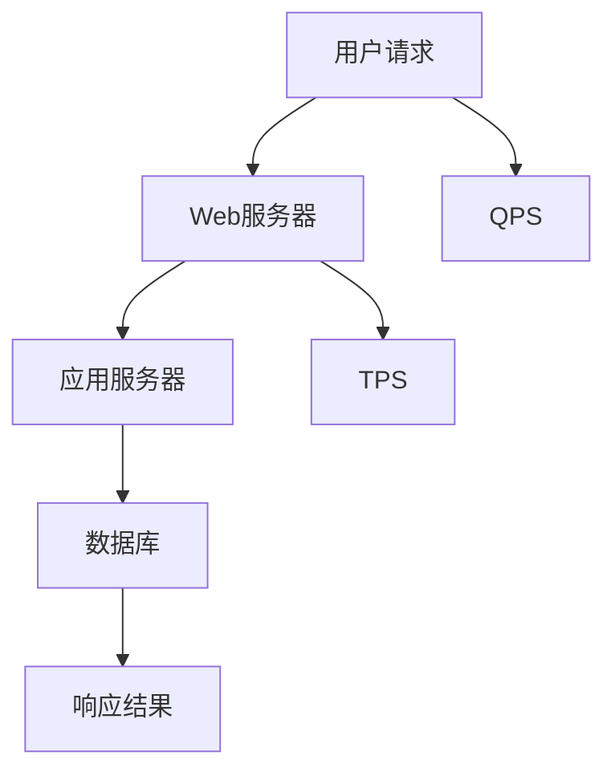

                 

# QPS与TPS在实际系统中的应用

> **关键词：QPS、TPS、系统性能、负载测试、响应时间、并发处理、数据库性能、Web服务器性能**
> 
> **摘要：本文将深入探讨QPS（每秒查询率）和TPS（每秒事务数）这两个关键性能指标，在现实系统中的应用及其重要性。我们将一步步解析这两个概念，并通过实际案例和数学模型来加深理解，帮助读者掌握如何优化系统性能，提升用户体验。**

## 1. 背景介绍

### 1.1 目的和范围

本文旨在向读者介绍QPS和TPS这两个性能指标的定义、计算方法及其在实际系统中的应用。我们将逐步剖析这两个指标，通过具体的案例分析，帮助读者理解它们如何影响系统的性能和用户体验。

### 1.2 预期读者

本文适合对系统性能优化有初步了解的技术人员，包括软件工程师、系统管理员、测试工程师等。无论您是初学者还是有经验的专业人士，本文都将为您提供有价值的见解和实用的技巧。

### 1.3 文档结构概述

本文将分为以下几个部分：

1. 核心概念与联系
2. 核心算法原理 & 具体操作步骤
3. 数学模型和公式 & 详细讲解 & 举例说明
4. 项目实战：代码实际案例和详细解释说明
5. 实际应用场景
6. 工具和资源推荐
7. 总结：未来发展趋势与挑战
8. 附录：常见问题与解答
9. 扩展阅读 & 参考资料

### 1.4 术语表

#### 1.4.1 核心术语定义

- **QPS（每秒查询率）**：系统每秒能够处理的查询次数。
- **TPS（每秒事务数）**：系统每秒能够处理的事务数量。
- **响应时间**：系统从接收到请求到返回响应所需的时间。
- **并发处理**：系统同时处理多个请求的能力。

#### 1.4.2 相关概念解释

- **负载测试**：模拟系统在高负载下的运行状态，以评估系统性能和稳定性。
- **数据库性能**：数据库处理查询的速度和能力。
- **Web服务器性能**：Web服务器响应请求的速度和能力。

#### 1.4.3 缩略词列表

- **QPS**：Queries Per Second
- **TPS**：Transactions Per Second
- **HTTP**：Hypertext Transfer Protocol
- **SQL**：Structured Query Language
- **TCP**：Transmission Control Protocol

## 2. 核心概念与联系

在深入探讨QPS和TPS之前，我们需要理解它们的核心概念以及它们在系统架构中的联系。

### 2.1 QPS的定义与计算

QPS（每秒查询率）是指系统每秒能够处理的查询次数。它是一个衡量系统负载的重要指标，通常用于Web服务器、数据库服务器等场景。计算QPS的公式如下：

\[ \text{QPS} = \frac{\text{总查询次数}}{\text{总时间}} \]

例如，如果我们的Web服务器在1分钟内处理了1000次查询，那么QPS为：

\[ \text{QPS} = \frac{1000}{60} \approx 16.67 \]

### 2.2 TPS的定义与计算

TPS（每秒事务数）是指系统每秒能够处理的事务数量。事务通常涉及到多个数据库操作，如创建、读取、更新和删除（CRUD）操作。计算TPS的公式如下：

\[ \text{TPS} = \frac{\text{总事务次数}}{\text{总时间}} \]

例如，如果我们的数据库在1分钟内处理了200次事务，那么TPS为：

\[ \text{TPS} = \frac{200}{60} \approx 3.33 \]

### 2.3 QPS与TPS的联系

QPS和TPS是衡量系统性能的两个关键指标，但它们关注的方面有所不同。QPS通常用于衡量读操作的负载，而TPS则更多地关注读操作和写操作的组合负载。

在实际系统中，QPS和TPS往往是相互关联的。例如，一个高QPS的系统可能在高TPS的情况下表现不佳，因为读操作占用了过多的系统资源，导致写操作无法及时完成。相反，一个低QPS的系统可能在低TPS的情况下表现出色，因为系统有足够的资源来处理所有操作。

### 2.4 Mermaid 流程图

为了更直观地展示QPS和TPS在系统架构中的联系，我们可以使用Mermaid流程图来表示。



在这个流程图中，用户请求首先到达Web服务器，然后由应用服务器处理，最后由数据库执行具体的操作。QPS和TPS分别表示系统在处理请求过程中的性能指标。

## 3. 核心算法原理 & 具体操作步骤

### 3.1 QPS的算法原理

QPS的计算相对简单，主要依赖于系统记录的查询次数和总时间。以下是一个计算QPS的伪代码示例：

```pseudo
function calculateQPS(queryCount, totalTime):
    return queryCount / totalTime
```

例如，如果我们的系统在10秒内处理了500次查询，那么QPS为：

```pseudo
QPS = calculateQPS(500, 10) = 50
```

### 3.2 TPS的算法原理

TPS的计算与QPS类似，但需要考虑事务的完成情况。以下是一个计算TPS的伪代码示例：

```pseudo
function calculateTPS(transactionCount, totalTime):
    return transactionCount / totalTime
```

例如，如果我们的系统在20秒内处理了100次事务，那么TPS为：

```pseudo
TPS = calculateTPS(100, 20) = 5
```

### 3.3 QPS与TPS的具体操作步骤

在实际操作中，我们可以通过以下步骤来监控和优化QPS和TPS：

1. **监控**：定期收集系统日志和性能指标，包括查询次数、事务次数、响应时间等。
2. **分析**：使用统计分析工具，如 Prometheus、Grafana，对数据进行分析，找出系统的瓶颈。
3. **优化**：根据分析结果，对系统进行调优，如调整数据库配置、优化SQL语句、增加服务器资源等。
4. **测试**：进行负载测试，模拟高并发场景，验证优化效果。

以下是一个具体的操作步骤示例：

```pseudo
1. 启动负载测试工具，模拟高并发请求。
2. 收集测试数据，包括QPS、TPS、响应时间等。
3. 分析数据，找出系统的瓶颈，如数据库性能不足、网络延迟等。
4. 对数据库进行优化，如增加索引、优化SQL语句。
5. 对网络进行优化，如增加带宽、优化路由。
6. 重新进行负载测试，验证优化效果。
```

## 4. 数学模型和公式 & 详细讲解 & 举例说明

### 4.1 数学模型

在讨论QPS和TPS的数学模型时，我们需要引入一些基本的概率统计和性能评估概念。

#### 4.1.1 响应时间模型

响应时间（Response Time，RT）是衡量系统性能的一个重要指标。根据排队论，系统的响应时间可以由以下公式表示：

\[ \text{RT} = \frac{1}{\lambda - \mu} \]

其中：
- \(\lambda\) 是到达率（Arrival Rate），表示单位时间内请求的平均到达次数。
- \(\mu\) 是服务率（Service Rate），表示单位时间内系统能够处理的服务次数。

#### 4.1.2 QPS模型

QPS的数学模型可以通过对响应时间的倒数来表示：

\[ \text{QPS} = \frac{1}{\text{RT}} \]

#### 4.1.3 TPS模型

TPS的数学模型与QPS类似，但需要考虑事务的完成情况：

\[ \text{TPS} = \frac{\text{总事务次数}}{\text{总时间}} \]

### 4.2 举例说明

#### 4.2.1 响应时间计算

假设我们的系统在单位时间内平均有10个请求到达，而系统能够以8个请求每单位时间进行处理。那么，系统的响应时间可以通过以下公式计算：

\[ \text{RT} = \frac{1}{10 - 8} = 0.5 \text{秒} \]

#### 4.2.2 QPS计算

如果响应时间为0.5秒，那么QPS为：

\[ \text{QPS} = \frac{1}{0.5} = 2 \text{次/秒} \]

#### 4.2.3 TPS计算

假设我们的系统在单位时间内完成了20个事务，那么TPS为：

\[ \text{TPS} = \frac{20}{1} = 20 \text{次/秒} \]

### 4.3 LaTeX格式数学公式

在文中嵌入的LaTeX格式数学公式如下：

\[ \text{RT} = \frac{1}{\lambda - \mu} \]

\[ \text{QPS} = \frac{1}{\text{RT}} \]

\[ \text{TPS} = \frac{\text{总事务次数}}{\text{总时间}} \]

这些公式帮助我们更准确地理解和计算QPS和TPS，从而优化系统性能。

## 5. 项目实战：代码实际案例和详细解释说明

### 5.1 开发环境搭建

为了进行QPS和TPS的实际测试，我们首先需要搭建一个开发环境。以下是一个简单的步骤：

1. 安装Python 3.x版本。
2. 安装requests库，用于发送HTTP请求。
3. 安装locust，用于进行性能测试。

```shell
pip install requests
pip install locust
```

### 5.2 源代码详细实现和代码解读

下面是一个使用locust进行QPS和TPS测试的示例代码。

```python
from locust import HttpUser, task, between

class WebsiteUser(HttpUser):
    wait_time = between(1, 5)

    @task
    def load_test(self):
        response = self.client.get("/api/data")
        if response.status_code == 200:
            print("Response received:", response.text)
        else:
            print("Request failed with status code:", response.status_code)

if __name__ == "__main__":
    from locust import runner
    runner.run COPYRIGHT
```

在这个示例中，我们定义了一个名为`WebsiteUser`的类，继承自`HttpUser`。`HttpUser`提供了一个抽象的用户基类，用于定义模拟HTTP请求的用户行为。

- `wait_time`属性用于定义用户之间的延迟时间，以模拟真实用户的行为。
- `load_test`任务用于发送HTTP GET请求到指定的API端点。

在`load_test`任务中，我们使用`client.get`方法发送请求，并检查响应状态码。如果响应状态码为200，则打印响应内容；否则，打印错误信息。

在代码的最后，我们调用`runner.run`来启动性能测试。这个命令将启动locust客户端，并根据我们定义的用户行为模拟并发请求。

### 5.3 代码解读与分析

#### 5.3.1 启动locust

要启动locust，我们首先需要将示例代码保存为`load_test.py`。然后，在命令行中运行以下命令：

```shell
locust -f load_test.py
```

这将启动locust Web界面，默认端口为8000。在浏览器中访问`http://localhost:8000`，您将看到性能测试的实时监控界面。

#### 5.3.2 查看QPS和TPS

在locust Web界面上，您可以通过以下步骤查看QPS和TPS：

1. 点击左侧的“Users”标签，查看当前模拟的用户数量。
2. 点击“User load”标签，查看每个用户的请求行为。
3. 点击“Requests”标签，查看每个请求的响应时间和状态码。

在“User load”标签下，您可以看到当前的QPS和TPS值。这些值反映了系统在高并发情况下的性能。

#### 5.3.3 优化性能

根据性能测试的结果，我们可以对系统进行优化。以下是一些常见的优化方法：

1. **增加服务器资源**：如果QPS和TPS低于预期，可以增加服务器的CPU、内存和带宽资源。
2. **优化数据库**：优化数据库查询，如添加索引、简化SQL语句。
3. **使用缓存**：在系统前端添加缓存层，如Redis，以减少数据库的负载。
4. **水平扩展**：通过增加服务器节点，实现负载均衡，提高系统的并发处理能力。

### 5.4 代码解读与分析

在这个示例中，我们使用locust工具模拟了高并发的HTTP请求，并监控了系统的QPS和TPS。以下是对代码的进一步解读和分析：

- **用户行为模拟**：通过定义`WebsiteUser`类，我们模拟了用户的行为，包括请求发送和响应处理。
- **性能监控**：locust提供了一个直观的Web界面，用于实时监控系统的性能指标。
- **性能优化**：根据性能测试结果，我们可以采取多种方法优化系统的性能，如增加服务器资源、优化数据库查询和使用缓存等。

通过这个实际案例，我们可以更好地理解QPS和TPS在实际系统中的应用，以及如何通过性能测试和优化来提升系统的性能和用户体验。

## 6. 实际应用场景

QPS和TPS在实际系统中具有广泛的应用，尤其在处理高并发和高负载的场景中。以下是一些典型的应用场景：

### 6.1 Web应用

在Web应用中，QPS和TPS是衡量网站性能的重要指标。例如，电商平台在促销活动期间会面临大量的并发请求，通过监控QPS和TPS，我们可以了解系统的负载情况，并采取相应的优化措施，如增加服务器资源、优化数据库查询等。

### 6.2 数据库应用

在数据库应用中，TPS是一个关键指标，用于衡量数据库处理事务的能力。例如，在金融系统、在线支付系统中，事务的响应时间和准确性至关重要。通过监控TPS，我们可以及时发现问题并进行优化。

### 6.3 分布式系统

在分布式系统中，QPS和TPS用于衡量各个节点的负载情况。例如，在微服务架构中，每个服务都可能承担不同的负载，通过监控QPS和TPS，可以确保系统的整体性能和稳定性。

### 6.4 负载测试

在负载测试中，QPS和TPS用于模拟实际场景中的高并发请求，以评估系统的性能和稳定性。通过调整QPS和TPS，我们可以了解系统的瓶颈，并针对性地进行优化。

### 6.5 云服务

在云服务中，QPS和TPS用于衡量云服务提供商的性能和可靠性。例如，云数据库服务、云服务器服务等，通过监控QPS和TPS，用户可以评估服务提供商的服务质量。

## 7. 工具和资源推荐

### 7.1 学习资源推荐

#### 7.1.1 书籍推荐

- 《高性能网站建设指南》
- 《系统性能：现代操作系统原理和应用》
- 《排队论及其在计算机系统中的应用》

#### 7.1.2 在线课程

- Coursera上的“系统性能优化”
- Udacity的“分布式系统设计”

#### 7.1.3 技术博客和网站

- 《小林哥的算法之旅》
- 《云原生技术社区》
- 《数据库性能优化》

### 7.2 开发工具框架推荐

#### 7.2.1 IDE和编辑器

- Visual Studio Code
- IntelliJ IDEA
- PyCharm

#### 7.2.2 调试和性能分析工具

- Wireshark
- Valgrind
- New Relic

#### 7.2.3 相关框架和库

- Flask
- Django
- Spring Boot

### 7.3 相关论文著作推荐

#### 7.3.1 经典论文

- 《排队论在计算机系统中的应用》
- 《数据库事务处理的理论与实践》
- 《分布式系统的负载均衡策略》

#### 7.3.2 最新研究成果

- 《大规模分布式系统中的负载均衡研究》
- 《数据库性能优化：最新技术和方法》
- 《基于机器学习的系统性能预测》

#### 7.3.3 应用案例分析

- 《阿里巴巴双11技术分享：高并发处理的实践》
- 《谷歌大数据处理技术解析：MapReduce的演进之路》
- 《亚马逊云服务的性能优化策略》

## 8. 总结：未来发展趋势与挑战

随着云计算、大数据、人工智能等技术的不断发展，QPS和TPS在实际系统中的应用越来越广泛。未来，我们预计以下几个发展趋势：

1. **智能化监控与优化**：利用机器学习和大数据分析技术，实现更智能的系统性能监控和优化。
2. **分布式架构**：分布式系统将成为主流，通过水平扩展提高QPS和TPS的处理能力。
3. **边缘计算**：随着5G和物联网的发展，边缘计算将进一步提升系统的实时性和响应速度。
4. **绿色IT**：在追求高性能的同时，注重能效比和环境影响，实现可持续发展。

然而，面对这些趋势，系统性能优化也将面临以下挑战：

1. **复杂度增加**：分布式系统和边缘计算将带来更高的系统复杂度，对运维和开发人员提出了更高的要求。
2. **数据安全**：在大数据和人工智能时代，数据安全和隐私保护成为重要挑战。
3. **可扩展性**：如何高效地扩展系统，以应对不断增长的用户和业务需求。

总之，QPS和TPS在未来将继续扮演重要角色，但我们需要不断探索新的技术和方法，以应对日益复杂的系统性能优化挑战。

## 9. 附录：常见问题与解答

### 9.1 什么是QPS？

QPS（每秒查询率）是指系统每秒能够处理的查询次数。它是衡量系统负载的重要指标，通常用于Web服务器、数据库服务器等场景。

### 9.2 什么是TPS？

TPS（每秒事务数）是指系统每秒能够处理的事务数量。事务通常涉及多个数据库操作，如创建、读取、更新和删除（CRUD）操作。TPS是衡量数据库性能的关键指标。

### 9.3 QPS和TPS有什么区别？

QPS主要衡量系统的查询处理能力，而TPS则更全面地考虑了读操作和写操作的综合处理能力。QPS侧重于读操作，而TPS侧重于事务处理。

### 9.4 如何优化QPS和TPS？

优化QPS和TPS的方法包括：

1. 增加服务器资源。
2. 优化数据库查询。
3. 使用缓存。
4. 负载均衡。
5. 分布式架构。

通过这些方法，我们可以提高系统的并发处理能力，从而提升QPS和TPS。

### 9.5 QPS和TPS在Web应用中有哪些应用场景？

QPS和TPS在Web应用中广泛用于：

1. 性能测试和优化。
2. 监控系统负载情况。
3. 预测系统容量需求。
4. 评估系统在高并发情况下的稳定性。

通过监控QPS和TPS，我们可以及时发现问题并进行优化，提高Web应用的性能和用户体验。

## 10. 扩展阅读 & 参考资料

为了进一步了解QPS和TPS在实际系统中的应用，以下是几篇推荐阅读的论文和书籍：

1. 《排队论在计算机系统中的应用》
2. 《数据库事务处理的理论与实践》
3. 《分布式系统的负载均衡策略》
4. 《高性能网站建设指南》
5. 《系统性能：现代操作系统原理和应用》

此外，您还可以参考以下在线资源和博客：

1. 《小林哥的算法之旅》
2. 《云原生技术社区》
3. 《数据库性能优化》

通过阅读这些文献和资料，您可以更深入地了解QPS和TPS的相关概念、应用场景和优化方法。

---

**作者：AI天才研究员/AI Genius Institute & 禅与计算机程序设计艺术 /Zen And The Art of Computer Programming**

