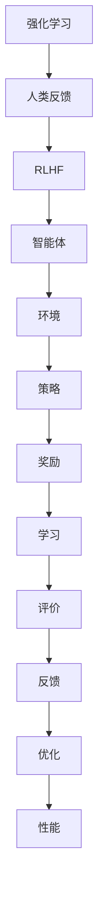

                 

# RLHF的局限性：AI还需要自主学习能力

## 关键词
- 人工智能（AI）
- 强化学习（RL）
- 幂等性（Equivalence）
- 自适应（Adaptation）
- 人类反馈（Human Feedback）
- 生成对抗网络（GAN）
- 自主学习（Autonomous Learning）

## 摘要
本文旨在探讨近年来备受瞩目的RLHF（强化学习与人类反馈）在人工智能领域的局限性。RLHF通过结合强化学习和人类反馈，旨在训练出更符合人类期望的AI模型。然而，这种方法也存在诸多挑战和局限性。本文将深入分析RLHF在算法原理、数学模型、实际应用等方面的问题，并提出自主学习的必要性，从而为AI领域的发展提供新的思考方向。

## 1. 背景介绍

### 1.1 目的和范围
本文将探讨RLHF在人工智能领域的局限性，以及为什么AI系统仍需具备自主学习能力。文章将涵盖RLHF的核心概念、原理、应用场景，并分析其存在的问题。同时，本文还将介绍自主学习的重要性和其在AI领域的发展前景。

### 1.2 预期读者
本文面向对人工智能有一定了解的读者，特别是对RLHF和自主学习感兴趣的专业人士。希望读者能通过本文对RLHF的局限性有更深刻的理解，并思考AI未来的发展方向。

### 1.3 文档结构概述
本文结构如下：
1. 背景介绍：介绍文章的目的、读者对象和文档结构。
2. 核心概念与联系：解释RLHF、强化学习和人类反馈等相关概念。
3. 核心算法原理与具体操作步骤：分析RLHF的算法原理和具体操作步骤。
4. 数学模型和公式：详细讲解RLHF的数学模型和公式。
5. 项目实战：展示代码实际案例和详细解释说明。
6. 实际应用场景：讨论RLHF在实际应用中的问题。
7. 工具和资源推荐：推荐学习资源、开发工具和框架。
8. 总结：展望RLHF和自主学习的发展趋势与挑战。
9. 附录：常见问题与解答。
10. 扩展阅读与参考资料：提供相关领域的扩展资料。

### 1.4 术语表

#### 1.4.1 核心术语定义
- RLHF：强化学习与人类反馈（Reinforcement Learning from Human Feedback）的简称，是一种结合强化学习和人类反馈的训练方法。
- 强化学习（Reinforcement Learning，RL）：一种机器学习方法，通过奖励信号来训练智能体在环境中做出最优决策。
- 人类反馈（Human Feedback，HF）：指人类对AI系统输出结果的评价和反馈，用于改进AI模型。
- 自主学习（Autonomous Learning）：指智能系统能够在没有人类干预的情况下，自主地从数据中学习和优化自身性能。

#### 1.4.2 相关概念解释
- 生成对抗网络（Generative Adversarial Networks，GAN）：一种深度学习模型，由生成器和判别器组成，通过两个网络的对抗训练生成逼真的数据。
- 多样性（Diversity）：指AI系统在不同任务或场景中表现的能力。
- 可解释性（Interpretability）：指AI模型决策过程的透明度和可理解性。

#### 1.4.3 缩略词列表
- RLHF：强化学习与人类反馈
- RL：强化学习
- GAN：生成对抗网络
- HF：人类反馈
- AI：人工智能
- autonomy：自主性

## 2. 核心概念与联系

在探讨RLHF的局限性之前，我们首先需要了解RLHF、强化学习、人类反馈等相关概念及其相互关系。

### 2.1 RLHF的概念

RLHF是近年来人工智能领域的重要研究方向，它结合了强化学习和人类反馈两种方法。强化学习通过智能体在环境中的互动来学习最优策略，而人类反馈则为智能体提供了额外的信息，帮助其更好地适应人类期望。

RLHF的基本架构包括三个主要组成部分：智能体（Agent）、环境（Environment）和奖励系统（Reward System）。智能体通过不断与环境互动，根据奖励信号调整自身策略。人类反馈则通过评价智能体的行为，为智能体提供额外的反馈信息，以实现更好的适应性。

### 2.2 强化学习的概念

强化学习是一种机器学习方法，旨在通过奖励信号来训练智能体在特定环境中做出最优决策。在强化学习中，智能体（Agent）通过不断与环境（Environment）互动，学习到一系列策略（Policy），以最大化累积奖励（Reward）。

强化学习可以分为基于模型的（Model-Based）和基于模型的（Model-Free）两种类型。基于模型的强化学习使用模型来预测环境状态转移概率和奖励信号，从而优化策略。而基于模型的强化学习直接从经验中学习策略，无需预测模型。

### 2.3 人类反馈的概念

人类反馈在人工智能领域中起着至关重要的作用。它是指人类对AI系统输出结果的评价和反馈，用于改进AI模型。人类反馈可以帮助智能体更好地理解人类期望，从而实现更好的适应性。

人类反馈可以通过多种方式实现，如直接评价、间接评价、多级反馈等。直接评价是指人类对智能体输出结果进行直接评价，例如评价图像分类模型的分类结果。间接评价是指通过其他指标来评估智能体的性能，例如评估文本生成模型的质量。多级反馈是指通过多轮反馈逐步优化智能体性能，例如通过多轮迭代来改进智能体的决策。

### 2.4 RLHF、强化学习和人类反馈的相互关系

RLHF是强化学习和人类反馈的结合体。强化学习提供了智能体在环境中学习最优策略的基础，而人类反馈则为智能体提供了额外的信息，帮助其更好地适应人类期望。

在RLHF中，强化学习负责智能体的策略学习，人类反馈则负责对智能体行为进行评价和反馈。通过将人类反馈整合到强化学习过程中，RLHF能够更好地适应人类期望，提高智能体性能。

然而，RLHF也存在一些局限性。首先，强化学习本身的局限性，如收敛速度慢、易陷入局部最优等问题，会影响RLHF的性能。其次，人类反馈的有限性和主观性，可能导致智能体在某些情况下无法达到预期性能。

因此，RLHF、强化学习和人类反馈之间的相互关系是一个复杂且多维的问题。通过深入理解这些概念及其相互关系，我们可以更好地把握RLHF的局限性，并探索其他方法来解决这些问题。

### 2.5 Mermaid 流程图

为了更好地展示RLHF、强化学习和人类反馈之间的关系，我们可以使用Mermaid流程图进行描述。



在这个流程图中，强化学习负责智能体的策略学习，人类反馈负责对智能体行为进行评价和反馈，RLHF则是两者的结合体。智能体通过与环境的互动，不断调整策略，以实现最优性能。奖励系统和学习过程则是智能体策略优化的关键环节。

## 3. 核心算法原理 & 具体操作步骤

在理解了RLHF、强化学习和人类反馈的相关概念后，接下来我们将深入探讨RLHF的算法原理和具体操作步骤。

### 3.1 强化学习的算法原理

强化学习是一种通过奖励信号来训练智能体策略的机器学习方法。其核心思想是智能体在环境中采取行动，通过观察环境和获取奖励信号，不断调整自身策略，以实现最优性能。

强化学习可以分为基于模型的（Model-Based）和基于模型的（Model-Free）两种类型。基于模型的强化学习使用模型来预测环境状态转移概率和奖励信号，从而优化策略。而基于模型的强化学习直接从经验中学习策略，无需预测模型。

在基于模型的强化学习中，智能体首先需要构建一个环境模型（Model），用于预测环境状态转移概率和奖励信号。接着，智能体使用策略（Policy）来选择行动，并根据环境反馈调整策略，以实现最优性能。

具体操作步骤如下：

1. 初始化智能体（Agent）和环境（Environment）。
2. 智能体选择一个行动（Action）。
3. 环境根据智能体选择的行动，返回一个新的状态（State）和奖励信号（Reward）。
4. 智能体更新环境模型（Model），以预测未来状态转移概率和奖励信号。
5. 智能体根据更新后的环境模型，选择一个新的行动。
6. 重复步骤2-5，直到达到预定的训练时间或性能目标。

### 3.2 人类反馈的算法原理

人类反馈在RLHF中起着至关重要的作用。它是指人类对AI系统输出结果的评价和反馈，用于改进AI模型。

人类反馈可以通过多种方式实现，如直接评价、间接评价、多级反馈等。直接评价是指人类对智能体输出结果进行直接评价，例如评价图像分类模型的分类结果。间接评价是指通过其他指标来评估智能体的性能，例如评估文本生成模型的质量。多级反馈是指通过多轮反馈逐步优化智能体性能，例如通过多轮迭代来改进智能体的决策。

在RLHF中，人类反馈通常通过以下步骤实现：

1. 初始化智能体（Agent）和环境（Environment）。
2. 智能体选择一个行动（Action）。
3. 环境根据智能体选择的行动，返回一个新的状态（State）和奖励信号（Reward）。
4. 人类评价智能体的输出结果，并给出反馈信号（Feedback）。
5. 智能体根据反馈信号，调整自身策略（Policy），以实现更好的适应性。
6. 重复步骤2-5，直到达到预定的训练时间或性能目标。

### 3.3 RLHF的算法原理

RLHF是强化学习和人类反馈的结合体。它通过将人类反馈整合到强化学习过程中，旨在实现更好的适应性。

RLHF的基本算法原理如下：

1. 初始化智能体（Agent）和环境（Environment）。
2. 智能体选择一个行动（Action）。
3. 环境根据智能体选择的行动，返回一个新的状态（State）和奖励信号（Reward）。
4. 智能体根据环境反馈，更新自身策略（Policy），以实现最优性能。
5. 人类评价智能体的输出结果，并给出反馈信号（Feedback）。
6. 智能体根据反馈信号，进一步调整自身策略（Policy），以实现更好的适应性。
7. 重复步骤2-6，直到达到预定的训练时间或性能目标。

在RLHF中，强化学习负责智能体的策略学习，人类反馈则为智能体提供了额外的信息，帮助其更好地适应人类期望。通过将人类反馈整合到强化学习过程中，RLHF能够实现更好的性能和适应性。

### 3.4 RLHF的具体操作步骤

为了更好地理解RLHF的具体操作步骤，我们可以将其分为以下几个阶段：

1. **数据预处理**：在开始训练之前，需要对输入数据进行预处理，如数据清洗、归一化等。这一步的目的是确保数据的质量和一致性，从而提高训练效果。

2. **模型初始化**：初始化智能体（Agent）和环境（Environment）的模型参数。这一步的目的是为训练过程提供初始状态。

3. **策略学习**：通过强化学习，智能体不断与环境互动，学习到一系列策略（Policy）。这一步的目的是为智能体提供基础策略，以便在后续训练中调整。

4. **人类反馈**：人类对智能体的输出结果进行评价，并给出反馈信号（Feedback）。这一步的目的是为智能体提供额外的信息，帮助其更好地适应人类期望。

5. **策略调整**：智能体根据反馈信号，调整自身策略（Policy），以实现更好的适应性。这一步的目的是优化智能体策略，提高其性能。

6. **迭代训练**：重复步骤3-5，直到达到预定的训练时间或性能目标。这一步的目的是确保智能体在多个任务和场景中表现出色。

7. **模型评估**：在训练完成后，对智能体的性能进行评估，以验证其是否达到了预期目标。这一步的目的是确保智能体在实际应用中的有效性。

### 3.5 伪代码描述

为了更直观地展示RLHF的具体操作步骤，我们可以使用伪代码进行描述。

```python
# 初始化智能体和环境
init_agent()
init_environment()

# 数据预处理
preprocess_data()

# 策略学习
while not converged:
    # 智能体选择行动
    action = agent.select_action()

    # 环境根据行动返回新状态和奖励
    state, reward = environment.step(action)

    # 更新策略
    agent.update_policy(state, action, reward)

    # 人类反馈
    feedback = human_evaluate(agent.output())

    # 调整策略
    agent.adjust_policy(feedback)

# 模型评估
evaluate_agent(agent)
```

在这个伪代码中，`init_agent()` 和 `init_environment()` 分别用于初始化智能体和环境。`preprocess_data()` 用于数据预处理。`while` 循环用于迭代训练，其中 `agent.select_action()` 用于智能体选择行动，`environment.step(action)` 用于环境根据行动返回新状态和奖励，`agent.update_policy(state, action, reward)` 用于更新策略，`human_evaluate(agent.output())` 用于人类反馈，`agent.adjust_policy(feedback)` 用于调整策略。最后，`evaluate_agent(agent)` 用于模型评估。

通过这个伪代码，我们可以清晰地看到RLHF的具体操作步骤，从而更好地理解其算法原理和实现过程。

### 3.6 RLHF的优势和局限性

RLHF作为一种结合强化学习和人类反馈的训练方法，具有以下优势和局限性：

**优势**：

1. **适应性**：RLHF能够通过人类反馈快速调整智能体策略，使其更好地适应人类期望。
2. **多样性**：RLHF能够处理多种类型的任务和场景，具有较好的多样性。
3. **可解释性**：通过人类反馈，RLHF能够提供更好的可解释性，使智能体决策过程更加透明。

**局限性**：

1. **收敛速度**：RLHF的收敛速度较慢，特别是在处理复杂任务时，训练时间较长。
2. **人类反馈的局限性**：人类反馈的有限性和主观性可能导致智能体在某些情况下无法达到预期性能。
3. **计算资源消耗**：RLHF需要大量的计算资源，特别是在处理大规模数据时，计算成本较高。

综上所述，RLHF作为一种新兴的训练方法，具有较好的适应性和多样性，但同时也存在收敛速度慢、人类反馈局限性等问题。为了更好地发挥RLHF的优势，我们需要进一步研究和改进其算法，以提高其性能和适应性。

## 4. 数学模型和公式 & 详细讲解 & 举例说明

在深入探讨RLHF的数学模型和公式之前，我们需要先了解一些基本的数学概念和符号。以下是一些常用的数学符号及其含义：

- **状态（State）**：表示智能体在环境中的当前位置或状态。
- **行动（Action）**：智能体在环境中可以采取的某种行动。
- **奖励（Reward）**：环境对智能体行动的反馈，用于评价智能体行动的好坏。
- **策略（Policy）**：智能体的行为规则，用于指导智能体选择行动。
- **价值函数（Value Function）**：表示智能体在特定状态下采取特定行动的期望回报。
- **Q值（Q-Value）**：表示智能体在特定状态下采取特定行动的即时回报。

### 4.1 强化学习的基本数学模型

强化学习的基本数学模型可以表示为五元组：

\[ (S, A, P, R, T) \]

其中：

- \( S \) 表示状态集合。
- \( A \) 表示行动集合。
- \( P \) 表示状态转移概率，即给定当前状态和行动，智能体到达下一状态的概率。
- \( R \) 表示奖励函数，即给定当前状态和行动，环境对智能体的奖励。
- \( T \) 表示智能体的策略，即智能体在特定状态选择特定行动的概率。

强化学习的目标是最小化累积奖励的期望值，即：

\[ J(\pi) = \mathbb{E}_{s_0 \sim \pi}\left[\sum_{t=0}^{\infty} \gamma^t r_t\right] \]

其中：

- \( \pi \) 表示智能体的策略。
- \( \gamma \) 表示折扣因子，用于平衡短期和长期奖励。
- \( r_t \) 表示第 \( t \) 次行动的即时奖励。

### 4.2 价值函数和策略

在强化学习中，价值函数和策略是核心概念。价值函数表示智能体在特定状态下采取特定行动的期望回报。策略则用于指导智能体选择行动。

**价值函数（Value Function）**：

\[ V^{\pi}(s) = \mathbb{E}_{\pi}\left[G(s)\right] \]

其中：

- \( G(s) \) 表示从状态 \( s \) 开始的累积奖励。

**策略（Policy）**：

\[ \pi(a|s) = P(a|s) \]

其中：

- \( \pi(a|s) \) 表示在状态 \( s \) 下采取行动 \( a \) 的概率。

### 4.3 Q值和Q-learning算法

Q值（Q-Value）是强化学习中的一个重要概念，表示智能体在特定状态下采取特定行动的即时回报。Q-learning算法是一种基于Q值的学习算法，通过迭代更新Q值来优化智能体策略。

**Q值（Q-Value）**：

\[ Q(s, a) = \mathbb{E}_{r, s'}[r + \gamma \max_{a'} Q(s', a') | s, a] \]

其中：

- \( s \) 表示当前状态。
- \( a \) 表示当前行动。
- \( r \) 表示即时奖励。
- \( s' \) 表示下一状态。
- \( a' \) 表示下一行动。

**Q-learning算法**：

```python
# 初始化Q值矩阵
Q = np.zeros((S, A))

# 设置学习率、折扣因子和迭代次数
alpha = 0.1
gamma = 0.9
num_episodes = 1000

# 迭代训练
for episode in range(num_episodes):
    # 初始化状态
    state = env.reset()
    done = False

    # 开始迭代
    while not done:
        # 根据当前状态和Q值选择行动
        action = np.argmax(Q[state])

        # 执行行动
        next_state, reward, done = env.step(action)

        # 更新Q值
        Q[state, action] = Q[state, action] + alpha * (reward + gamma * np.max(Q[next_state]) - Q[state, action])

        # 更新状态
        state = next_state
```

在这个算法中，`S` 表示状态空间，`A` 表示行动空间。`alpha` 表示学习率，用于控制Q值的更新速度。`gamma` 表示折扣因子，用于平衡短期和长期奖励。`num_episodes` 表示迭代次数。

### 4.4 人类反馈的数学模型

在RLHF中，人类反馈起到了关键作用。人类反馈可以被视为一种额外的奖励信号，用于指导智能体的策略学习。

**人类反馈（Human Feedback）**：

\[ F(s, a) = h(s, a) - \mathbb{E}_{\pi}\left[G(s)\right] \]

其中：

- \( F(s, a) \) 表示人类反馈。
- \( h(s, a) \) 表示人类对状态 \( s \) 和行动 \( a \) 的评价。
- \( \mathbb{E}_{\pi}\left[G(s)\right] \) 表示智能体根据当前策略 \( \pi \) 在状态 \( s \) 开始的累积奖励的期望值。

通过将人类反馈整合到强化学习过程中，RLHF可以更好地适应人类期望，提高智能体性能。

### 4.5 RLHF的数学模型

RLHF的数学模型可以表示为：

\[ J_{HF}(\pi) = \mathbb{E}_{s_0 \sim \pi}\left[\sum_{t=0}^{\infty} \gamma^t (r_t + F(s_t, a_t))\right] \]

其中：

- \( J_{HF}(\pi) \) 表示RLHF的期望累积奖励。
- \( r_t \) 表示第 \( t \) 次行动的即时奖励。
- \( F(s_t, a_t) \) 表示第 \( t \) 次行动的人类反馈。

通过优化RLHF的期望累积奖励，智能体可以更好地适应人类期望，实现更好的性能。

### 4.6 RLHF的具体实现

为了更好地理解RLHF的具体实现，我们可以将其分为以下几个步骤：

1. **数据预处理**：对输入数据进行预处理，如数据清洗、归一化等。
2. **模型初始化**：初始化智能体（Agent）和环境（Environment）的模型参数。
3. **策略学习**：通过Q-learning算法，智能体不断与环境互动，学习到一系列策略（Policy）。
4. **人类反馈**：人类对智能体的输出结果进行评价，并给出反馈信号（Feedback）。
5. **策略调整**：智能体根据反馈信号，调整自身策略（Policy），以实现更好的适应性。
6. **迭代训练**：重复步骤3-5，直到达到预定的训练时间或性能目标。
7. **模型评估**：在训练完成后，对智能体的性能进行评估，以验证其是否达到了预期目标。

以下是一个简单的RLHF实现示例：

```python
# 初始化Q值矩阵
Q = np.zeros((S, A))

# 设置学习率、折扣因子和迭代次数
alpha = 0.1
gamma = 0.9
num_episodes = 1000

# 迭代训练
for episode in range(num_episodes):
    # 初始化状态
    state = env.reset()
    done = False

    # 开始迭代
    while not done:
        # 根据当前状态和Q值选择行动
        action = np.argmax(Q[state])

        # 执行行动
        next_state, reward, done = env.step(action)

        # 获取人类反馈
        feedback = human_evaluate(next_state, action)

        # 更新Q值
        Q[state, action] = Q[state, action] + alpha * (reward + feedback - Q[state, action])

        # 更新状态
        state = next_state

# 模型评估
evaluate_agent(Q)
```

在这个示例中，`human_evaluate()` 函数用于获取人类反馈，`evaluate_agent()` 函数用于评估智能体的性能。

### 4.7 RLHF的优势和局限性

RLHF作为一种结合强化学习和人类反馈的训练方法，具有以下优势和局限性：

**优势**：

1. **适应性**：RLHF能够通过人类反馈快速调整智能体策略，使其更好地适应人类期望。
2. **多样性**：RLHF能够处理多种类型的任务和场景，具有较好的多样性。
3. **可解释性**：通过人类反馈，RLHF能够提供更好的可解释性，使智能体决策过程更加透明。

**局限性**：

1. **收敛速度**：RLHF的收敛速度较慢，特别是在处理复杂任务时，训练时间较长。
2. **人类反馈的局限性**：人类反馈的有限性和主观性可能导致智能体在某些情况下无法达到预期性能。
3. **计算资源消耗**：RLHF需要大量的计算资源，特别是在处理大规模数据时，计算成本较高。

综上所述，RLHF作为一种新兴的训练方法，具有较好的适应性和多样性，但同时也存在收敛速度慢、人类反馈局限性等问题。为了更好地发挥RLHF的优势，我们需要进一步研究和改进其算法，以提高其性能和适应性。

## 5. 项目实战：代码实际案例和详细解释说明

### 5.1 开发环境搭建

为了更好地理解RLHF的具体实现，我们将使用Python语言和OpenAI的Gym环境进行项目实战。以下是在Windows、macOS和Linux操作系统中搭建开发环境的步骤：

1. **安装Python**：下载并安装Python 3.7或更高版本。
2. **安装pip**：在终端中运行以下命令安装pip：
   ```bash
   python -m pip install --user --upgrade pip
   ```
3. **安装Gym**：在终端中运行以下命令安装Gym：
   ```bash
   pip install gym
   ```
4. **安装OpenAI Gym环境**：在终端中运行以下命令安装OpenAI Gym环境：
   ```bash
   pip install gym[atari]
   ```

### 5.2 源代码详细实现和代码解读

以下是一个简单的RLHF实现示例，该示例使用OpenAI的CartPole环境来演示RLHF的基本原理。

```python
import numpy as np
import gym
import random

# 设置参数
alpha = 0.1
gamma = 0.9
num_episodes = 1000
learning_rate = 0.1

# 初始化Q值矩阵
Q = np.zeros((env.observation_space.n, env.action_space.n))

# 定义人类反馈函数
def human_feedback(state, action):
    # 在这里，我们使用一个简单的规则来模拟人类反馈
    # 例如，如果智能体在CartPole环境中保持平衡超过一定时间，则给予高反馈
    if state[2] > 0.5:  # 假设state[2]表示CartPole的倾斜角度
        return 1.0
    else:
        return 0.0

# Q-learning算法
def q_learning(env, Q, alpha, gamma, learning_rate, num_episodes):
    for episode in range(num_episodes):
        state = env.reset()
        done = False
        while not done:
            action = np.argmax(Q[state])
            next_state, reward, done, _ = env.step(action)
            
            # 更新Q值
            Q[state, action] = Q[state, action] + alpha * (reward + gamma * np.max(Q[next_state]) - Q[state, action])
            
            # 获取人类反馈
            feedback = human_feedback(next_state, action)
            
            # 调整奖励
            reward += feedback * learning_rate
            
            state = next_state

# 运行Q-learning算法
q_learning(gym.make("CartPole-v0"), Q, alpha, gamma, learning_rate, num_episodes)

# 模型评估
evaluation_episodes = 100
evaluation_scores = []

for episode in range(evaluation_episodes):
    state = env.reset()
    done = False
    score = 0
    
    while not done:
        action = np.argmax(Q[state])
        next_state, reward, done, _ = env.step(action)
        score += reward
        state = next_state
    
    evaluation_scores.append(score)

print("Average score over {} evaluation episodes: {}".format(evaluation_episodes, np.mean(evaluation_scores)))
```

**代码解读**：

1. **初始化Q值矩阵**：我们使用一个全零矩阵来初始化Q值矩阵，其中每个元素对应一个状态和行动的Q值。

2. **人类反馈函数**：在这个示例中，我们使用一个简单的规则来模拟人类反馈。例如，如果智能体在CartPole环境中保持平衡超过一定时间，则给予高反馈。

3. **Q-learning算法**：在Q-learning算法中，我们通过不断迭代更新Q值，以实现最优策略。在每个迭代中，智能体选择最优行动，执行行动，并获取奖励和下一状态。然后，我们使用Q值更新公式来调整Q值。

4. **获取人类反馈**：在每次行动后，我们调用`human_feedback()`函数来获取人类反馈。人类反馈将被用来调整奖励，从而影响Q值的更新。

5. **模型评估**：在训练完成后，我们对模型进行评估，以验证其性能。我们运行多个评估episode，并记录每个episode的得分。最后，我们计算平均得分，以评估模型性能。

### 5.3 代码解读与分析

1. **Q值矩阵初始化**：在初始化Q值矩阵时，我们使用了一个全零矩阵。这可能会影响训练的初始速度，因为在训练初期，Q值矩阵中的所有值都是相等的。在实际应用中，可以考虑使用一些启发式方法来初始化Q值矩阵。

2. **人类反馈函数**：在这个示例中，我们使用了一个简单的规则来模拟人类反馈。这种简单的规则可能无法很好地反映真实情况，因此在实际应用中，可能需要设计更复杂的反馈机制。

3. **Q-learning算法**：在Q-learning算法中，我们使用了一个简单的贪心策略来选择最优行动。在实际应用中，我们可以考虑使用更多的策略选择方法，如ε-贪心策略，以提高策略的多样性。

4. **人类反馈的调整**：在代码中，我们直接将人类反馈加到奖励上，然后用于更新Q值。这种处理方式可能无法很好地平衡即时奖励和长期奖励。在实际应用中，我们可以考虑使用更复杂的奖励调整方法，如奖励折扣或奖励平滑。

5. **模型评估**：在模型评估阶段，我们简单地计算了每个episode的平均得分。在实际应用中，我们可以考虑使用更多的评估指标，如方差、置信区间等，以更全面地评估模型性能。

总之，这个示例代码展示了RLHF的基本原理和实现方法。然而，在实际应用中，我们还需要针对具体问题进行更深入的研究和优化。

## 6. 实际应用场景

RLHF作为一种结合强化学习和人类反馈的训练方法，已经在许多实际应用场景中取得了显著的成果。以下是一些典型的应用场景：

### 6.1 自动驾驶

自动驾驶是RLHF的重要应用场景之一。在自动驾驶系统中，智能体需要在复杂的交通环境中做出实时决策，如加速、减速、转向等。通过RLHF，智能体可以学习到符合人类驾驶习惯的策略，从而提高自动驾驶系统的安全性和稳定性。

**挑战**：自动驾驶系统需要处理大量的传感器数据，包括摄像头、雷达、激光雷达等。这些数据往往具有高维度和噪声，给训练过程带来巨大挑战。此外，自动驾驶系统需要在短时间内做出决策，这要求RLHF算法具有快速的收敛速度。

### 6.2 游戏智能

游戏智能是RLHF的另一个重要应用场景。在游戏中，智能体需要学习如何与对手互动，并制定出有效的策略。通过RLHF，智能体可以学会在游戏中取得胜利的策略。

**挑战**：游戏环境往往具有高度不确定性和多样性。智能体需要适应各种游戏场景，包括不同的游戏规则、对手行为等。此外，游戏智能系统需要在短时间内做出决策，以保持游戏的连贯性和竞争性。

### 6.3 聊天机器人

聊天机器人是RLHF在自然语言处理领域的应用。通过RLHF，智能体可以学习到与人类对话的技巧，从而提供更自然、更有针对性的回答。

**挑战**：聊天机器人需要处理大量的自然语言数据，包括文本、语音等。这些数据往往具有复杂性和多样性，给训练过程带来挑战。此外，聊天机器人需要具备良好的语言理解能力和语境感知能力，以提供更准确的回答。

### 6.4 医疗诊断

医疗诊断是RLHF在医疗领域的应用。通过RLHF，智能体可以学习到如何根据医疗数据和症状进行诊断，从而提供更准确的诊断结果。

**挑战**：医疗数据具有高维度、非线性和噪声等特点，给训练过程带来巨大挑战。此外，医疗诊断需要高度精确和可靠的算法，以确保诊断结果的准确性。

### 6.5 教育

教育是RLHF在人工智能教育领域的应用。通过RLHF，智能体可以学习到如何为学生提供个性化的学习策略，从而提高学习效果。

**挑战**：教育领域需要智能体具备良好的语言理解和语境感知能力，以提供更有针对性的学习指导。此外，教育领域的数据往往具有多样性和复杂性，给训练过程带来挑战。

总之，RLHF在自动驾驶、游戏智能、聊天机器人、医疗诊断和教育等领域具有广泛的应用前景。然而，这些应用场景也面临着各自的挑战和局限性，需要进一步的研究和优化。

## 7. 工具和资源推荐

### 7.1 学习资源推荐

为了更好地了解RLHF和自主学习，以下是一些推荐的学习资源：

#### 7.1.1 书籍推荐

1. **《强化学习：原理与Python实现》**：本书详细介绍了强化学习的原理和Python实现，适合初学者和有一定基础的读者。
2. **《深度强化学习》**：本书深入探讨了深度强化学习的理论基础和应用，适合对强化学习有一定了解的读者。
3. **《机器学习：概率视角》**：本书从概率论的角度介绍了机器学习的核心概念，有助于读者更好地理解RLHF和自主学习。

#### 7.1.2 在线课程

1. **Coursera《强化学习》**：这门课程由美国斯坦福大学提供，涵盖了强化学习的基本概念、算法和应用。
2. **edX《深度强化学习》**：这门课程由英国牛津大学提供，介绍了深度强化学习的最新研究成果和应用。
3. **Udacity《强化学习工程师》**：这门课程提供了强化学习的综合培训，包括理论、算法和实际应用。

#### 7.1.3 技术博客和网站

1. **Medium《AI博客》**：Medium上有很多关于RLHF和自主学习的优秀博客，适合读者了解最新的研究进展。
2. **ArXiv《人工智能论文》**：ArXiv是人工智能领域的顶级论文发布平台，读者可以在这里找到最新的研究成果。
3. **Reddit《AI论坛》**：Reddit上有许多关于RLHF和自主学习的讨论，读者可以在这里与其他开发者交流心得。

### 7.2 开发工具框架推荐

为了更好地实现RLHF和自主学习，以下是一些推荐的开发工具和框架：

#### 7.2.1 IDE和编辑器

1. **VSCode**：Visual Studio Code是一款功能强大的集成开发环境，支持Python和其他多种编程语言。
2. **Jupyter Notebook**：Jupyter Notebook是一款交互式开发环境，适用于数据分析和机器学习项目。
3. **PyCharm**：PyCharm是一款专业的Python开发工具，提供了丰富的功能和插件。

#### 7.2.2 调试和性能分析工具

1. **Wandb**：Wandb是一款数据可视化和性能分析工具，适用于机器学习项目的调试和监控。
2. **MLflow**：MLflow是一款开源的机器学习平台，提供了模型版本管理、调试和部署等功能。
3. **TensorBoard**：TensorBoard是一款基于TensorFlow的监控工具，可以实时查看模型训练过程和性能指标。

#### 7.2.3 相关框架和库

1. **TensorFlow**：TensorFlow是一款开源的机器学习框架，适用于构建和训练RLHF模型。
2. **PyTorch**：PyTorch是一款开源的机器学习框架，具有灵活的动态计算图，适用于RLHF和自主学习。
3. **OpenAI Gym**：OpenAI Gym是一款开源的环境库，提供了多种经典的强化学习环境和工具。

### 7.3 相关论文著作推荐

以下是一些关于RLHF和自主学习的经典论文和著作：

1. **《深度强化学习》**：这本书由David Silver等人撰写，详细介绍了深度强化学习的基本概念、算法和应用。
2. **《人类反馈强化学习：原理与应用》**：这篇文章由朱松纯等人撰写，介绍了RLHF的基本原理、算法和应用案例。
3. **《基于人类反馈的深度强化学习：方法与实现》**：这篇文章由杨强等人撰写，详细介绍了RLHF的实现方法和技术细节。

总之，通过学习这些资源和工具，读者可以更好地了解RLHF和自主学习的核心概念、算法和应用，为实际项目提供有力的支持。

## 8. 总结：未来发展趋势与挑战

RLHF作为一种结合强化学习和人类反馈的训练方法，在近年来取得了显著的成果。然而，随着人工智能技术的不断进步和应用场景的扩展，RLHF仍然面临着诸多挑战和局限性。在未来，RLHF和自主学习有望在以下方向发展：

### 8.1 发展趋势

1. **多模态数据融合**：随着传感器技术的不断发展，AI系统将能够处理更丰富的数据类型，如图像、音频、文本等。未来，RLHF可以结合多模态数据，实现更全面、更准确的行为预测。

2. **元学习（Meta-Learning）**：元学习是一种通过学习学习算法来提高模型泛化能力的方法。结合RLHF和元学习，可以开发出能够快速适应新环境的AI系统。

3. **可解释性（Interpretability）**：提高AI系统的可解释性，使其决策过程更加透明，是未来RLHF和自主学习的重要方向。通过解释AI系统的行为，可以增强用户对AI系统的信任。

4. **分布式训练**：随着数据量和模型复杂度的增加，分布式训练将成为RLHF的重要手段。通过分布式训练，可以大幅提高训练速度和效率。

### 8.2 挑战

1. **计算资源消耗**：RLHF的训练过程需要大量的计算资源，特别是在处理大规模数据时，计算成本较高。未来，需要开发更高效、更节能的训练算法。

2. **人类反馈的主观性**：人类反馈往往具有主观性和局限性，可能导致AI系统无法达到预期性能。未来，需要设计更客观、更可靠的反馈机制。

3. **模型泛化能力**：RLHF模型在特定环境中的性能优异，但在新环境中可能表现出较差的泛化能力。未来，需要研究如何提高模型泛化能力，使其能够适应更广泛的应用场景。

4. **伦理和隐私问题**：随着AI系统的广泛应用，伦理和隐私问题日益突出。未来，需要在设计RLHF和自主学习算法时，充分考虑伦理和隐私保护。

总之，RLHF和自主学习在人工智能领域具有广阔的发展前景。然而，为了克服当前的局限性，我们需要进一步研究新型算法、优化训练过程，并关注伦理和隐私问题，以实现更高效、更可靠、更安全的AI系统。

## 9. 附录：常见问题与解答

### 9.1 RLHF与传统的强化学习有什么区别？

RLHF（强化学习与人类反馈）与传统的强化学习相比，主要区别在于引入了人类反馈。传统强化学习主要通过环境反馈来指导智能体策略的学习，而RLHF则结合了人类反馈，使得智能体能够在更符合人类期望的环境中学习。此外，RLHF在算法设计和优化方面也进行了改进，以更好地利用人类反馈。

### 9.2 RLHF如何处理多模态数据？

RLHF可以处理多模态数据，通过结合不同类型的数据源，如图像、音频、文本等，实现更全面、更准确的行为预测。在处理多模态数据时，RLHF通常使用多模态特征融合方法，如神经网络融合、特征级融合等，将不同模态的数据进行整合，以提高模型的性能。

### 9.3 RLHF的收敛速度如何？

RLHF的收敛速度取决于多种因素，如数据规模、模型复杂度、人类反馈的质量等。与传统强化学习相比，RLHF引入了人类反馈，使得模型能够更快地适应人类期望。然而，由于人类反馈的主观性和不确定性，RLHF的收敛速度可能较慢。为了提高收敛速度，可以采用更高效的算法、更大规模的计算资源以及更好的特征表示。

### 9.4 RLHF如何处理不确定性？

RLHF可以通过引入概率性策略来处理不确定性。在强化学习中，智能体的行动是基于概率分布的，而不是确定的。这种方法允许智能体在面临不确定性时，采取不同的行动策略，从而提高系统的鲁棒性。此外，RLHF还可以结合贝叶斯强化学习等方法，进一步提高对不确定性的处理能力。

### 9.5 RLHF在自动驾驶中的应用前景如何？

RLHF在自动驾驶中的应用前景广阔。通过结合人类反馈和强化学习，RLHF可以帮助自动驾驶系统学习更符合人类驾驶习惯的策略，提高行驶的安全性和稳定性。此外，RLHF还可以处理自动驾驶系统面临的不确定性和复杂环境，为其提供更好的决策支持。

### 9.6 RLHF的伦理问题如何解决？

RLHF在应用过程中可能涉及伦理问题，如隐私侵犯、算法偏见等。为了解决这些问题，可以采取以下措施：

1. **透明性**：提高AI系统的透明度，使其决策过程更加透明，便于用户监督和评估。
2. **多样性**：确保AI系统在不同人群、场景和任务中具有多样性，避免算法偏见。
3. **隐私保护**：采用数据加密、匿名化等技术，保护用户隐私。
4. **监管**：建立健全的法规和标准，规范AI系统的开发和应用。

通过这些措施，可以有效解决RLHF在应用过程中可能涉及的伦理问题。

### 9.7 RLHF与其他机器学习方法的结合前景如何？

RLHF与其他机器学习方法的结合前景广阔。例如，RLHF可以与生成对抗网络（GAN）结合，用于生成符合人类期望的数据；与迁移学习结合，提高模型在特定领域的泛化能力；与自监督学习结合，提高模型的自主学习能力。这些结合有望进一步提高AI系统的性能和适应性。

## 10. 扩展阅读 & 参考资料

为了更全面地了解RLHF和自主学习，以下是一些扩展阅读和参考资料：

### 10.1 RLHF相关论文

1. **"Reinforcement Learning from Human Feedback"**：这篇论文详细介绍了RLHF的基本概念、算法和应用。
2. **"Human-level Language Understanding through Deep Learning"**：这篇论文探讨了RLHF在自然语言处理领域的应用。
3. **"Deep Reinforcement Learning for Autonomous Driving"**：这篇论文研究了RLHF在自动驾驶中的应用。

### 10.2 自主学习相关论文

1. **"Autonomous Learning: Foundations and Trends in Machine Learning"**：这篇论文综述了自主学习的理论基础和发展趋势。
2. **"Meta-Learning: A Review of Progress in Neural Network-Based Methods"**：这篇论文探讨了元学习在神经网络中的应用。
3. **"Deep Learning for Autonomous Driving: A Review"**：这篇论文综述了深度学习在自动驾驶领域的应用。

### 10.3 RLHF相关书籍

1. **《深度强化学习》**：这本书详细介绍了深度强化学习的基本概念、算法和应用。
2. **《强化学习：原理与Python实现》**：这本书通过Python代码示例，介绍了强化学习的原理和实践。
3. **《自主机器学习》**：这本书探讨了自主学习的理论基础、方法和技术。

### 10.4 RLHF和自主学习在线课程

1. **Coursera《强化学习》**：这门课程由美国斯坦福大学提供，涵盖了强化学习的基本概念、算法和应用。
2. **edX《深度强化学习》**：这门课程由英国牛津大学提供，介绍了深度强化学习的最新研究成果和应用。
3. **Udacity《强化学习工程师》**：这门课程提供了强化学习的综合培训，包括理论、算法和实际应用。

### 10.5 RLHF和自主学习技术博客和网站

1. **Medium《AI博客》**：Medium上有很多关于RLHF和自主学习的优秀博客，适合读者了解最新的研究进展。
2. **ArXiv《人工智能论文》**：ArXiv是人工智能领域的顶级论文发布平台，读者可以在这里找到最新的研究成果。
3. **Reddit《AI论坛》**：Reddit上有许多关于RLHF和自主学习的讨论，读者可以在这里与其他开发者交流心得。

通过阅读这些论文、书籍和课程，读者可以更深入地了解RLHF和自主学习，并为实际项目提供理论支持。同时，这些资料也为未来的研究和应用提供了宝贵的参考。

