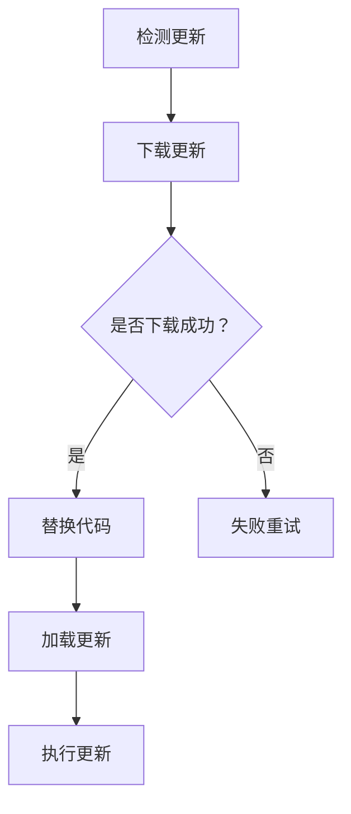

                 

# React Native热更新实现

> **关键词**：React Native，热更新，代码替换，动态加载，模块化，JavaScript核心库，Bridge通信，更新流程，兼容性，安全性

> **摘要**：本文深入探讨React Native框架下的热更新机制，包括其原理、实现步骤、数学模型、实际应用场景以及未来发展趋势。通过详细的分析和案例展示，帮助开发者掌握热更新的核心技术和实践方法。

## 1. 背景介绍

### 1.1 目的和范围

本文旨在为React Native开发者提供一套全面的热更新实现指南。我们将从基础概念出发，逐步深入到实现细节，最终通过实际案例展示热更新的全过程。

### 1.2 预期读者

本文适合具有一定React Native开发经验的开发者阅读，特别是那些希望优化应用更新流程、提升开发效率的技术人员。

### 1.3 文档结构概述

本文结构如下：

1. 背景介绍：概述文章目的和结构。
2. 核心概念与联系：介绍热更新的核心概念和流程。
3. 核心算法原理 & 具体操作步骤：讲解热更新的算法原理和实现步骤。
4. 数学模型和公式 & 详细讲解 & 举例说明：阐述热更新相关的数学模型和公式。
5. 项目实战：提供代码实际案例和详细解释。
6. 实际应用场景：探讨热更新的应用场景。
7. 工具和资源推荐：推荐学习资源、开发工具和框架。
8. 总结：分析未来发展趋势与挑战。
9. 附录：常见问题与解答。
10. 扩展阅读 & 参考资料：提供进一步学习的资源。

### 1.4 术语表

#### 1.4.1 核心术语定义

- **热更新**：在应用程序运行时动态替换或更新代码、资源等，而不需要用户重启应用。
- **React Native**：一个用于构建原生应用的JavaScript库，支持iOS和Android平台。
- **JavaScript核心库**：提供JavaScript运行环境的库，如Babel。
- **Bridge通信**：React Native中JavaScript与原生代码之间的通信机制。

#### 1.4.2 相关概念解释

- **模块化**：将代码拆分为多个模块，便于管理和维护。
- **动态加载**：在运行时加载模块，而不是在编译时。

#### 1.4.3 缩略词列表

- **JS**：JavaScript
- **iOS**：苹果操作系统
- **Android**：安卓操作系统
- **RN**：React Native

## 2. 核心概念与联系

### 2.1 热更新的核心概念

热更新是指在应用程序运行时，通过替换或更新部分代码或资源，而不需要用户重启应用。这通常通过动态加载模块、修改文件等方式实现。

### 2.2 热更新的实现流程

热更新的实现流程可以分为以下几个步骤：

1. **检测更新**：通过服务器或本地文件系统检测是否有新的代码或资源。
2. **下载更新**：如果有更新，下载新的代码或资源。
3. **替换代码**：将旧的代码或资源替换为新的。
4. **加载更新**：重新加载替换后的代码或资源。
5. **执行更新**：执行更新后的代码，实现功能的变化。

### 2.3 热更新的原理

热更新的原理主要基于以下几点：

- **动态加载模块**：React Native支持动态加载模块，这意味着我们可以不重启应用就替换模块中的代码。
- **JavaScript核心库**：React Native使用JavaScript核心库，如Babel，来转换和运行JavaScript代码。
- **Bridge通信**：React Native通过Bridge机制实现JavaScript与原生代码之间的通信。

### 2.4 Mermaid流程图

以下是一个简单的Mermaid流程图，展示热更新的流程：



## 3. 核心算法原理 & 具体操作步骤

### 3.1 热更新的算法原理

热更新的核心算法原理在于动态加载模块和文件替换。具体来说，可以分为以下几个步骤：

1. **定位模块或文件**：确定需要更新的模块或文件的路径。
2. **下载新版本**：从服务器下载新的模块或文件。
3. **替换旧版本**：将旧版本替换为新版本。
4. **重新加载模块**：重新加载被替换的模块，以实现更新。

以下是热更新算法的伪代码：

```python
def hotUpdate(modulePath, newModulePath):
    # 步骤1：定位模块或文件
    oldModule = loadModule(modulePath)
    
    # 步骤2：下载新版本
    newModule = downloadModule(newModulePath)
    
    # 步骤3：替换旧版本
    saveModule(modulePath, newModule)
    
    # 步骤4：重新加载模块
    reloadModule(modulePath)
```

### 3.2 热更新的具体操作步骤

以下是在React Native项目中实现热更新的具体步骤：

1. **安装依赖**：确保已安装React Native开发环境，包括Node.js、Watchman和React Native命令行工具。
2. **检测更新**：编写检测更新的逻辑，可以使用服务器API或本地文件系统。
3. **下载更新**：如果有更新，下载新的代码或资源。
4. **替换代码**：使用文件系统API替换旧的代码或资源。
5. **加载更新**：重新启动应用或重新加载模块，以应用更新。
6. **执行更新**：执行更新后的代码，实现功能的变化。

以下是具体操作步骤的伪代码：

```javascript
// 步骤1：安装依赖
installDependencies();

// 步骤2：检测更新
if (isUpdateAvailable()) {
    // 步骤3：下载更新
    downloadUpdate();

    // 步骤4：替换代码
    replaceCode();

    // 步骤5：加载更新
    loadUpdate();

    // 步骤6：执行更新
    executeUpdate();
}
```

## 4. 数学模型和公式 & 详细讲解 & 举例说明

### 4.1 数学模型

在热更新过程中，我们关注的主要是代码替换的效率和时间。以下是一个简单的数学模型：

- **替换时间**（\( T_{replace} \)）：替换代码所需的时间。
- **下载时间**（\( T_{download} \)）：下载新代码所需的时间。
- **加载时间**（\( T_{load} \)）：加载新代码所需的时间。

热更新总时间（\( T_{total} \)）可以表示为：

\[ T_{total} = T_{replace} + T_{download} + T_{load} \]

### 4.2 详细讲解

#### 4.2.1 替换时间

替换时间取决于文件的大小和操作系统。一般来说，文件越小，替换时间越短。可以使用以下公式计算替换时间：

\[ T_{replace} = \frac{file\_size}{I/O\ speed} \]

其中，\( file\_size \)是文件大小，\( I/O\ speed \)是操作系统I/O速度。

#### 4.2.2 下载时间

下载时间取决于网络速度和文件大小。可以使用以下公式计算下载时间：

\[ T_{download} = \frac{file\_size}{download\ speed} \]

其中，\( download\ speed \)是网络下载速度。

#### 4.2.3 加载时间

加载时间取决于JavaScript引擎和模块加载机制。一般来说，加载时间与模块大小和模块数量成正比。可以使用以下公式计算加载时间：

\[ T_{load} = \sum_{i=1}^{n} \frac{module\_size_i}{load\ speed} \]

其中，\( module\_size_i \)是第\( i \)个模块的大小，\( n \)是模块数量，\( load\ speed \)是模块加载速度。

### 4.3 举例说明

假设一个文件大小为10MB，操作系统I/O速度为100MB/s，网络下载速度为5MB/s，JavaScript引擎和模块加载速度分别为1MB/s和0.5MB/s。计算热更新总时间：

\[ T_{replace} = \frac{10MB}{100MB/s} = 0.1s \]
\[ T_{download} = \frac{10MB}{5MB/s} = 2s \]
\[ T_{load} = \sum_{i=1}^{3} \frac{module\_size_i}{0.5MB/s} = 3s \]

\[ T_{total} = 0.1s + 2s + 3s = 5.1s \]

因此，热更新总时间约为5.1秒。

## 5. 项目实战：代码实际案例和详细解释说明

### 5.1 开发环境搭建

在开始之前，确保已经安装了React Native开发环境。以下是搭建开发环境的步骤：

1. 安装Node.js和npm。
2. 安装React Native命令行工具（\( \text{npm install -g react-native-cli} \)）。
3. 创建一个新的React Native项目（\( \text{react-native init MyProject} \)）。
4. 配置iOS和Android开发环境。

### 5.2 源代码详细实现和代码解读

以下是一个简单的React Native项目示例，包含热更新的功能。

**示例代码：**

```javascript
// App.js
import React, { useEffect } from 'react';
import { View, Text, Button } from 'react-native';

const App = () => {
    useEffect(() => {
        // 检测更新
        checkForUpdate();
    }, []);

    const checkForUpdate = async () => {
        // 检测更新逻辑，例如调用API
        const isUpdateAvailable = await isUpdateAvailableAPI();

        if (isUpdateAvailable) {
            // 下载更新
            const newCode = await downloadUpdate();

            // 替换代码
            replaceCode(newCode);

            // 加载更新
            loadUpdate();
        }
    };

    const replaceCode = (newCode) => {
        // 替换代码逻辑，例如替换文件内容
        // 注意：在实际应用中，需要确保替换过程的安全性和可靠性
    };

    const loadUpdate = () => {
        // 重新加载模块或页面逻辑
    };

    return (
        <View>
            <Text>Hello, World!</Text>
            <Button title="Check for Update" onPress={checkForUpdate} />
        </View>
    );
};

export default App;
```

**代码解读：**

1. **检测更新**：在组件加载时，调用`checkForUpdate`函数检测是否有更新。
2. **下载更新**：如果有更新，调用`downloadUpdate`函数下载更新代码。
3. **替换代码**：调用`replaceCode`函数替换当前代码。
4. **加载更新**：调用`loadUpdate`函数重新加载更新后的代码。

### 5.3 代码解读与分析

**1. 检测更新**

检测更新的逻辑可以根据实际需求进行调整。例如，可以通过API请求服务器，查询是否有更新。

**2. 下载更新**

下载更新的逻辑可以使用`fetch`或`axios`等HTTP客户端库，从服务器下载更新代码。

**3. 替换代码**

替换代码的逻辑需要根据文件类型和操作系统进行调整。例如，对于JavaScript文件，可以使用`fs`模块读取文件内容，然后替换。

**4. 加载更新**

加载更新的逻辑需要重新加载模块或页面。对于React Native，可以使用`import`语句重新导入模块。

## 6. 实际应用场景

热更新在实际开发中有广泛的应用场景，例如：

- **修复bug**：在应用程序发布后，快速修复已知的bug。
- **添加新功能**：在不影响用户使用的情况下，添加新的功能。
- **优化性能**：动态更新代码，优化应用程序性能。
- **兼容性更新**：确保应用程序在不同设备和操作系统上的兼容性。

## 7. 工具和资源推荐

### 7.1 学习资源推荐

#### 7.1.1 书籍推荐

- **《React Native实战》**：详细介绍了React Native的开发流程和常用组件。
- **《React Native移动应用开发》**：涵盖React Native的进阶技术和性能优化。

#### 7.1.2 在线课程

- **React Native官方文档**：提供了全面的React Native开发教程和文档。
- **Udemy上的React Native课程**：涵盖React Native的基础知识和高级应用。

#### 7.1.3 技术博客和网站

- **React Native中文社区**：提供了丰富的React Native技术文章和讨论。
- **React Native中文网**：汇集了React Native的最新资讯和技术文章。

### 7.2 开发工具框架推荐

#### 7.2.1 IDE和编辑器

- **Visual Studio Code**：一款功能强大的代码编辑器，支持React Native开发。
- **Android Studio**：官方的Android开发工具，支持React Native开发。

#### 7.2.2 调试和性能分析工具

- **React Developer Tools**：用于调试React应用的扩展。
- **Chrome DevTools**：用于调试JavaScript代码和优化网页性能。

#### 7.2.3 相关框架和库

- **Redux**：用于管理应用状态的框架。
- **React Navigation**：用于创建多页面应用的导航库。

### 7.3 相关论文著作推荐

#### 7.3.1 经典论文

- **《Dynamic Software Updating》**：讨论了软件更新的理论基础。
- **《JavaScript Core Libraries: The Definitive Guide》**：介绍了JavaScript核心库的使用。

#### 7.3.2 最新研究成果

- **《Hot Reload in React Native》**：介绍了React Native热更新的最新研究和应用。
- **《Building Performant Mobile Apps with React Native》**：探讨了React Native性能优化的新方法。

#### 7.3.3 应用案例分析

- **Airbnb**：介绍了Airbnb如何使用React Native实现热更新。
- **Facebook**：分享了Facebook如何使用React Native构建和更新应用程序。

## 8. 总结：未来发展趋势与挑战

随着React Native的不断发展和应用，热更新技术也在不断演进。未来的发展趋势包括：

- **更好的性能优化**：减少热更新的时间成本。
- **更安全的热更新机制**：确保更新过程的安全性和稳定性。
- **更灵活的模块化更新**：支持更细粒度的代码更新。

然而，热更新也面临一些挑战，如：

- **兼容性问题**：确保更新后的代码在不同设备和操作系统上兼容。
- **性能影响**：热更新可能会对应用程序的性能产生负面影响。

开发者需要不断探索和研究，以克服这些挑战，充分利用热更新技术的优势。

## 9. 附录：常见问题与解答

### 9.1 热更新是否会增加应用程序的大小？

热更新不会增加应用程序的大小。热更新只更新代码或资源，而不影响应用程序的安装包。

### 9.2 热更新是否会影响用户体验？

适当设计和优化的热更新不会影响用户体验。然而，如果热更新过程耗时过长或更新失败，可能会影响用户体验。

### 9.3 热更新是否安全？

热更新本身是安全的，但需要确保更新过程的安全性和可靠性。开发者需要验证更新代码的完整性，并防止恶意代码的注入。

## 10. 扩展阅读 & 参考资料

- **React Native官方文档**：提供了全面的React Native开发教程和文档。
- **《React Native实战》**：详细介绍了React Native的开发流程和常用组件。
- **《React Native移动应用开发》**：涵盖React Native的进阶技术和性能优化。

**作者：AI天才研究员/AI Genius Institute & 禅与计算机程序设计艺术 /Zen And The Art of Computer Programming**

