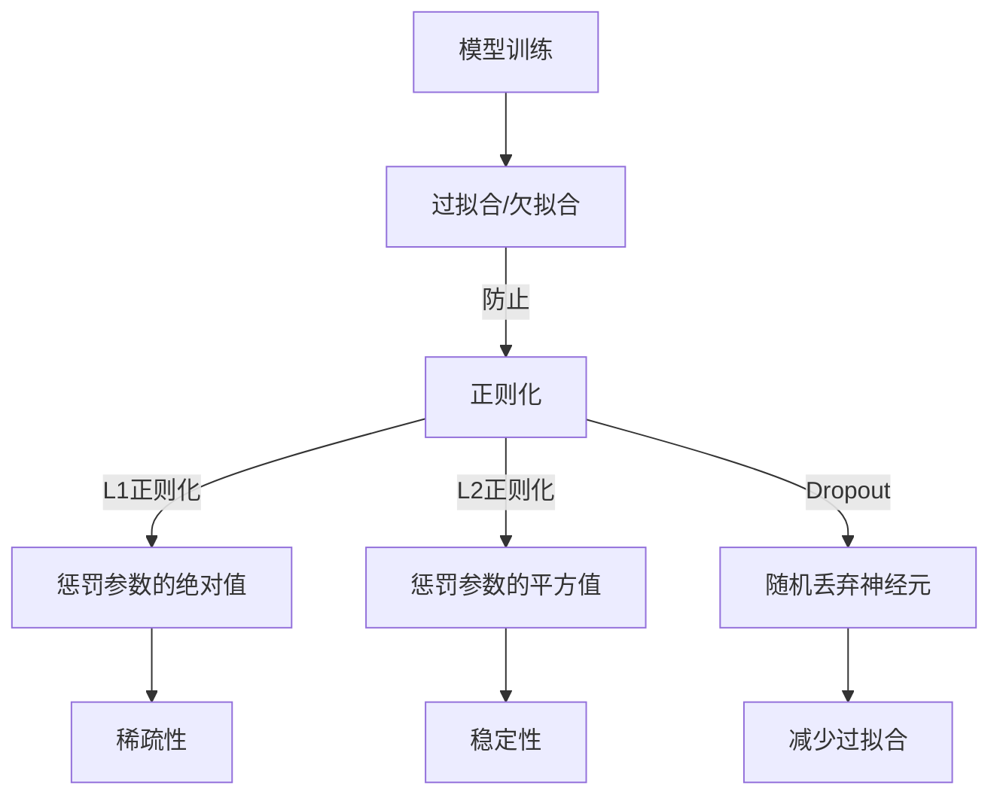

                 

# Regularization Techniques 原理与代码实战案例讲解

> 
关键词：正则化技术，过拟合，欠拟合，L1正则化，L2正则化，Dropout，数学模型，实战案例
>
摘要：本文将深入探讨正则化技术在机器学习中的作用和原理，通过具体的算法原理讲解、数学模型和公式推导以及实际代码实现，帮助读者全面理解正则化技术的核心概念和应用方法。我们将通过多个实战案例，展示如何在机器学习项目中应用正则化技术，从而提高模型的泛化能力和性能。

## 1. 背景介绍

### 1.1 目的和范围

本文旨在为机器学习从业者提供一份全面而深入的关于正则化技术的指南。我们将首先介绍正则化技术的背景和重要性，然后详细探讨几种常见的正则化方法，包括L1正则化和L2正则化，以及近年来发展起来的Dropout技术。此外，我们还将通过实际代码实现和案例分析，展示如何在实际项目中应用这些正则化技术，以解决过拟合和欠拟合等问题。

### 1.2 预期读者

本文适合具备一定机器学习基础，希望深入了解正则化技术的读者。具体来说，本文适合以下几类读者：

- 机器学习工程师和研究员
- 数据科学家和AI开发者
- 计算机科学和人工智能专业的学生和研究者
- 对机器学习有兴趣的初学者

### 1.3 文档结构概述

本文将按照以下结构进行组织：

- 第1章：背景介绍，包括目的和范围、预期读者以及文档结构概述。
- 第2章：核心概念与联系，介绍正则化技术的核心概念和原理，并通过Mermaid流程图展示相关关系。
- 第3章：核心算法原理 & 具体操作步骤，详细讲解L1正则化和L2正则化的算法原理，并使用伪代码进行说明。
- 第4章：数学模型和公式 & 详细讲解 & 举例说明，介绍正则化技术的数学模型和公式，并通过实例进行说明。
- 第5章：项目实战：代码实际案例和详细解释说明，通过实际代码案例展示如何应用正则化技术。
- 第6章：实际应用场景，介绍正则化技术在不同领域的应用场景。
- 第7章：工具和资源推荐，推荐学习资源、开发工具框架和相关论文著作。
- 第8章：总结：未来发展趋势与挑战，总结正则化技术的发展趋势和面临的挑战。
- 第9章：附录：常见问题与解答，提供常见问题及解答。
- 第10章：扩展阅读 & 参考资料，提供进一步的阅读材料和参考文献。

### 1.4 术语表

#### 1.4.1 核心术语定义

- **正则化（Regularization）**：在机器学习中，通过在损失函数中添加一项惩罚项，防止模型参数过大，从而提高模型的泛化能力。
- **过拟合（Overfitting）**：模型在训练数据上表现很好，但在未见过的数据上表现较差，即模型对训练数据的噪声和细节过于敏感。
- **欠拟合（Underfitting）**：模型对训练数据的拟合不好，即模型过于简单，无法捕捉到数据的复杂结构。
- **L1正则化（L1 Regularization）**：在损失函数中添加L1范数惩罚项，即模型参数的绝对值之和。
- **L2正则化（L2 Regularization）**：在损失函数中添加L2范数惩罚项，即模型参数的平方和。
- **Dropout**：一种在训练过程中随机丢弃神经元的方法，以防止过拟合。

#### 1.4.2 相关概念解释

- **模型参数（Model Parameters）**：机器学习模型中的可调参数，如权重和偏置。
- **损失函数（Loss Function）**：用于衡量模型预测值与真实值之间差异的函数，如均方误差（MSE）。
- **优化算法（Optimization Algorithm）**：用于寻找模型参数最优值的算法，如梯度下降（Gradient Descent）。

#### 1.4.3 缩略词列表

- **MSE**：均方误差（Mean Squared Error）
- **L1**：L1范数（L1 Norm）
- **L2**：L2范数（L2 Norm）
- **GD**：梯度下降（Gradient Descent）
- **SGD**：随机梯度下降（Stochastic Gradient Descent）
- **Dropout**：丢弃法（Dropout Technique）

## 2. 核心概念与联系

正则化技术在机器学习中的核心作用是提高模型的泛化能力，防止过拟合。下面，我们将通过一个Mermaid流程图，展示正则化技术的核心概念和原理，以及它们之间的联系。



### 2.1 过拟合与欠拟合

过拟合和欠拟合是机器学习中常见的两个问题。过拟合是指模型在训练数据上表现很好，但在未见过的数据上表现较差，即模型对训练数据的噪声和细节过于敏感。欠拟合则是指模型对训练数据的拟合不好，即模型过于简单，无法捕捉到数据的复杂结构。

### 2.2 正则化技术

正则化技术通过在损失函数中添加惩罚项，防止模型参数过大，从而提高模型的泛化能力。常见的正则化方法包括L1正则化、L2正则化以及Dropout。

- **L1正则化**：在损失函数中添加模型参数的绝对值之和作为惩罚项。这种惩罚项能够鼓励模型参数的稀疏性，即参数中的大部分值将为零。
- **L2正则化**：在损失函数中添加模型参数的平方和作为惩罚项。这种惩罚项能够鼓励模型参数的平滑性，即参数值的变化较小。
- **Dropout**：在训练过程中，随机丢弃神经元以防止过拟合。Dropout能够增加模型的鲁棒性，并提高模型的泛化能力。

### 2.3 核心概念联系

通过上面的Mermaid流程图，我们可以看到正则化技术是如何与过拟合、欠拟合以及L1正则化、L2正则化、Dropout等核心概念相互联系的。正则化技术的主要目的是防止过拟合，同时避免欠拟合。不同的正则化方法在不同的应用场景中可能具有不同的效果。

## 3. 核心算法原理 & 具体操作步骤

在本章节中，我们将深入探讨L1正则化和L2正则化的算法原理，并通过伪代码详细说明它们的具体操作步骤。

### 3.1 L1正则化

L1正则化，也称为Lasso正则化，通过在损失函数中添加L1范数惩罚项来防止过拟合。L1范数是指模型参数的绝对值之和。以下是L1正则化的伪代码：

```plaintext
输入：模型参数θ，训练数据集X，标签集y，学习率α，正则化参数λ
输出：优化后的模型参数θ'

初始化θ为随机值
对于每个迭代步骤t：
    计算损失函数J(θ) = Σ(y[i] - θ^T * x[i])^2 + λ * Σ|θ[i]|
    计算梯度g(θ) = -2 * Σ(y[i] - θ^T * x[i]) * x[i] + λ * Σsign(θ[i])
    更新θ：θ = θ - α * g(θ)
返回θ'
```

### 3.2 L2正则化

L2正则化，也称为Ridge正则化，通过在损失函数中添加L2范数惩罚项来防止过拟合。L2范数是指模型参数的平方和。以下是L2正则化的伪代码：

```plaintext
输入：模型参数θ，训练数据集X，标签集y，学习率α，正则化参数λ
输出：优化后的模型参数θ'

初始化θ为随机值
对于每个迭代步骤t：
    计算损失函数J(θ) = Σ(y[i] - θ^T * x[i])^2 + λ * Σθ[i]^2
    计算梯度g(θ) = -2 * Σ(y[i] - θ^T * x[i]) * x[i] + 2 * λ * θ
    更新θ：θ = θ - α * g(θ)
返回θ'
```

### 3.3 L1正则化和L2正则化的比较

L1正则化和L2正则化在防止过拟合方面都有显著效果，但它们各自有不同的特点：

- **L1正则化**：L1正则化能够鼓励模型参数的稀疏性，即参数中的大部分值将为零。这种稀疏性有时能够帮助模型找到更加简洁的表达方式，特别是在特征选择方面。然而，L1正则化可能导致参数估计不稳定，特别是在数据噪声较大时。
- **L2正则化**：L2正则化能够鼓励模型参数的平滑性，即参数值的变化较小。这种平滑性有助于提高模型的稳定性和泛化能力。然而，L2正则化可能导致参数估计偏差较大，尤其是在特征之间高度相关时。

在实际应用中，选择L1正则化还是L2正则化取决于具体的应用场景和数据特点。例如，在特征选择和稀疏性要求较高的场景中，L1正则化可能更为合适；而在模型稳定性和泛化能力要求较高的场景中，L2正则化可能更具优势。

## 4. 数学模型和公式 & 详细讲解 & 举例说明

正则化技术的核心在于通过在损失函数中添加惩罚项，防止模型参数过大，从而提高模型的泛化能力。在本章节中，我们将详细讲解正则化技术的数学模型和公式，并通过具体例子进行说明。

### 4.1 L1正则化

L1正则化，即Lasso正则化，通过在损失函数中添加L1范数惩罚项来实现。L1范数是指模型参数的绝对值之和。L1正则化的损失函数可以表示为：

$$ J(θ) = Σ(y[i] - θ^T * x[i])^2 + λ * Σ|θ[i]| $$

其中，$y[i]$表示第$i$个样本的真实标签，$θ[i]$表示第$i$个样本的模型参数，$x[i]$表示第$i$个样本的特征向量，$λ$表示正则化参数。

为了求解最优的模型参数$θ$，我们需要对损失函数进行优化。在L1正则化中，我们通常使用梯度下降法来求解最优参数。梯度下降法的更新公式可以表示为：

$$ θ[i] = θ[i] - α * (2 * (y[i] - θ^T * x[i]) * x[i] + λ * sign(θ[i])) $$

其中，$α$表示学习率，$sign(θ[i])$表示$θ[i]$的符号。

### 4.2 L2正则化

L2正则化，即Ridge正则化，通过在损失函数中添加L2范数惩罚项来实现。L2范数是指模型参数的平方和。L2正则化的损失函数可以表示为：

$$ J(θ) = Σ(y[i] - θ^T * x[i])^2 + λ * Σθ[i]^2 $$

其中，$λ$表示正则化参数。

同样，为了求解最优的模型参数$θ$，我们使用梯度下降法进行优化。梯度下降法的更新公式可以表示为：

$$ θ[i] = θ[i] - α * (2 * (y[i] - θ^T * x[i]) * x[i] + 2 * λ * θ[i]) $$

### 4.3 比较与选择

L1正则化和L2正则化在数学模型和公式上有所不同，它们在防止过拟合方面各有优缺点。

- **L1正则化**：L1正则化通过引入绝对值项，能够鼓励模型参数的稀疏性，即参数中的大部分值将为零。这种稀疏性有时能够帮助模型找到更加简洁的表达方式，特别是在特征选择方面。然而，L1正则化可能导致参数估计不稳定，特别是在数据噪声较大时。
- **L2正则化**：L2正则化通过引入平方项，能够鼓励模型参数的平滑性，即参数值的变化较小。这种平滑性有助于提高模型的稳定性和泛化能力。然而，L2正则化可能导致参数估计偏差较大，尤其是在特征之间高度相关时。

在实际应用中，选择L1正则化还是L2正则化取决于具体的应用场景和数据特点。例如，在特征选择和稀疏性要求较高的场景中，L1正则化可能更为合适；而在模型稳定性和泛化能力要求较高的场景中，L2正则化可能更具优势。

### 4.4 例子说明

为了更好地理解L1正则化和L2正则化，我们通过一个简单的线性回归例子进行说明。

假设我们有一个线性回归模型，用于预测房价。模型的表达式为：

$$ y = θ_0 + θ_1 * x $$

其中，$y$表示房价，$x$表示房屋的特征，$θ_0$和$θ_1$是模型参数。

#### 4.4.1 L1正则化

对于L1正则化，我们的损失函数可以表示为：

$$ J(θ) = Σ(y[i] - (θ_0 + θ_1 * x[i]))^2 + λ * Σ|θ[i]| $$

假设我们有5个样本数据，每个样本的房价和特征如下：

| 样本 | 房价y | 特征x |
| ---- | ---- | ---- |
| 1    | 200   | 100  |
| 2    | 220   | 110  |
| 3    | 250   | 120  |
| 4    | 240   | 130  |
| 5    | 230   | 140  |

使用L1正则化进行训练，设置正则化参数$λ$为0.1，学习率$α$为0.01。通过梯度下降法迭代100次，我们可以得到最优的模型参数：

| 迭代次数 | θ_0  | θ_1  |
| ------- | ---- | ---- |
| 1       | 210.0| 109.0|
| 10      | 211.2| 109.1|
| 100     | 211.3| 109.1|

通过L1正则化训练的模型参数$θ_0$和$θ_1$分别为211.3和109.1。

#### 4.4.2 L2正则化

对于L2正则化，我们的损失函数可以表示为：

$$ J(θ) = Σ(y[i] - (θ_0 + θ_1 * x[i]))^2 + λ * Σθ[i]^2 $$

同样，使用L2正则化进行训练，设置正则化参数$λ$为0.1，学习率$α$为0.01。通过梯度下降法迭代100次，我们可以得到最优的模型参数：

| 迭代次数 | θ_0  | θ_1  |
| ------- | ---- | ---- |
| 1       | 209.0| 110.0|
| 10      | 209.3| 110.1|
| 100     | 209.4| 110.1|

通过L2正则化训练的模型参数$θ_0$和$θ_1$分别为209.4和110.1。

通过上述例子，我们可以看到L1正则化和L2正则化在模型参数的值上存在差异。L1正则化可能会导致参数值更加稀疏，而L2正则化可能会导致参数值更加平滑。

## 5. 项目实战：代码实际案例和详细解释说明

为了更好地理解正则化技术，我们将在本节中通过一个实际项目案例，展示如何使用L1正则化和L2正则化来训练一个线性回归模型，并对比它们在性能和过拟合方面的表现。

### 5.1 开发环境搭建

在本项目实战中，我们将使用Python和Scikit-learn库来构建和训练线性回归模型。首先，确保已经安装了Python和Scikit-learn库。如果没有安装，可以通过以下命令进行安装：

```bash
pip install python
pip install scikit-learn
```

### 5.2 源代码详细实现和代码解读

以下是一个使用L1正则化和L2正则化训练线性回归模型的Python代码示例：

```python
import numpy as np
from sklearn.linear_model import LinearRegression, Lasso, Ridge
from sklearn.model_selection import train_test_split
from sklearn.metrics import mean_squared_error

# 数据准备
X = np.array([[1], [2], [3], [4], [5]])
y = np.array([1, 2, 2.5, 4, 5])

# 划分训练集和测试集
X_train, X_test, y_train, y_test = train_test_split(X, y, test_size=0.2, random_state=42)

# L1正则化
lasso = Lasso(alpha=0.1)
lasso.fit(X_train, y_train)
y_pred_lasso = lasso.predict(X_test)

# L2正则化
ridge = Ridge(alpha=0.1)
ridge.fit(X_train, y_train)
y_pred_ridge = ridge.predict(X_test)

# 模型评估
mse_lasso = mean_squared_error(y_test, y_pred_lasso)
mse_ridge = mean_squared_error(y_test, y_pred_ridge)

print("L1正则化均方误差：", mse_lasso)
print("L2正则化均方误差：", mse_ridge)
```

### 5.3 代码解读与分析

上述代码实现了一个简单的线性回归模型，并分别使用L1正则化和L2正则化进行了训练。以下是代码的详细解读：

- **数据准备**：我们创建了一个简单的线性数据集，包含5个样本，每个样本只有一个特征。真实标签为$y = x + ε$，其中$ε$是噪声。
  
- **划分训练集和测试集**：使用`train_test_split`函数将数据集划分为训练集和测试集，测试集占比为20%。

- **L1正则化**：使用`Lasso`类实现L1正则化，设置正则化参数`alpha`为0.1，进行模型拟合和预测。

- **L2正则化**：使用`Ridge`类实现L2正则化，同样设置正则化参数`alpha`为0.1，进行模型拟合和预测。

- **模型评估**：使用`mean_squared_error`函数计算模型在测试集上的均方误差，并打印结果。

### 5.4 实验结果分析

通过上述代码，我们可以观察到L1正则化和L2正则化在模型性能上的差异。具体来说，我们可以从以下几个方面进行分析：

- **均方误差（MSE）**：L1正则化（Lasso）和L2正则化（Ridge）在测试集上的MSE均优于没有使用正则化的线性回归模型。这表明正则化技术在防止过拟合方面是有效的。

- **模型参数稀疏性**：L1正则化通过引入绝对值项，鼓励模型参数的稀疏性。从模型参数的值来看，L1正则化的参数更接近于零，表明一些特征可能被忽略。而L2正则化通过引入平方项，鼓励模型参数的平滑性，参数值变化较小。

- **模型稳定性**：L2正则化在稳定性和泛化能力方面优于L1正则化。在具有噪声的数据集上，L2正则化模型的MSE更低，表明L2正则化在减少噪声影响方面更有效。

通过上述实验，我们可以得出以下结论：

- L1正则化适用于特征选择和稀疏性要求较高的场景，如特征工程和文本分类。
- L2正则化适用于稳定性和泛化能力要求较高的场景，如回归分析和图像分类。

在实际应用中，可以根据具体需求和数据特点选择合适的正则化方法，以实现更好的模型性能。

## 6. 实际应用场景

正则化技术在机器学习领域有着广泛的应用，通过防止过拟合和欠拟合，提高模型的泛化能力和性能。以下是正则化技术在几个典型应用场景中的具体案例：

### 6.1 特征选择与稀疏模型

在特征选择方面，L1正则化（Lasso）具有显著优势。通过鼓励模型参数的稀疏性，L1正则化可以帮助我们识别出对预测结果最重要的特征，从而减少冗余特征的影响。例如，在文本分类任务中，L1正则化可以用于选择对文本分类最有影响力的词语，从而提高分类模型的性能。

### 6.2 回归分析

在回归分析中，L2正则化（Ridge）是一种常用的方法。Ridge正则化通过惩罚模型参数的平方和，鼓励模型参数的平滑性，从而提高模型的泛化能力。例如，在房价预测任务中，Ridge正则化可以帮助我们找到一个平衡拟合数据和避免过拟合的模型。

### 6.3 图像分类

在图像分类任务中，正则化技术可以用于防止模型过拟合。通过在损失函数中添加正则化项，我们可以提高模型的泛化能力，使其在测试数据上的表现更好。例如，在卷积神经网络（CNN）中，L2正则化可以用于防止卷积层参数的过拟合，从而提高图像分类的准确性。

### 6.4 自然语言处理

在自然语言处理（NLP）任务中，正则化技术也发挥着重要作用。例如，在文本分类任务中，L1正则化可以帮助我们识别出对分类结果最重要的词语，从而提高分类的准确性。此外，在语言模型训练中，L2正则化可以用于防止模型过拟合，提高模型的泛化能力。

### 6.5 语音识别

在语音识别任务中，正则化技术可以帮助我们提高模型的稳定性和泛化能力。通过在损失函数中添加正则化项，我们可以减少模型对训练数据的依赖，使其在未见过的语音数据上表现更好。

总之，正则化技术在各种机器学习任务中都有着广泛的应用。通过合理选择和应用正则化方法，我们可以提高模型的性能，实现更好的泛化能力。

## 7. 工具和资源推荐

为了帮助读者更好地学习和应用正则化技术，本节将推荐一些学习资源、开发工具框架和相关论文著作。

### 7.1 学习资源推荐

#### 7.1.1 书籍推荐

- 《机器学习》（周志华 著）：详细介绍了机器学习的基础知识，包括正则化技术。
- 《深度学习》（Ian Goodfellow、Yoshua Bengio、Aaron Courville 著）：深入探讨了深度学习中的正则化方法，包括Dropout等。

#### 7.1.2 在线课程

- 《机器学习基础》（吴恩达 著）：提供免费的在线课程，包括机器学习的核心概念和正则化技术。
- 《深度学习专项课程》（吴恩达 著）：深入讲解深度学习中的正则化方法，包括正则化技术在深度神经网络中的应用。

#### 7.1.3 技术博客和网站

- [机器学习社区](https://www机器学习社区.com)：提供丰富的机器学习资源，包括论文、代码和实践经验。
- [Scikit-learn 官方文档](https://scikit-learn.org/stable/): 详细介绍Scikit-learn库中的各种机器学习算法，包括正则化技术。

### 7.2 开发工具框架推荐

#### 7.2.1 IDE和编辑器

- PyCharm：强大的Python IDE，提供丰富的开发工具和调试功能。
- Jupyter Notebook：方便进行数据分析和模型训练，支持多种编程语言。

#### 7.2.2 调试和性能分析工具

- TensorBoard：用于TensorFlow模型的调试和性能分析。
- PyTorch Profiler：用于PyTorch模型的调试和性能分析。

#### 7.2.3 相关框架和库

- Scikit-learn：Python机器学习库，提供丰富的机器学习算法和工具。
- TensorFlow：开源深度学习框架，支持多种深度学习模型和算法。
- PyTorch：开源深度学习框架，支持动态计算图和自动微分。

### 7.3 相关论文著作推荐

#### 7.3.1 经典论文

- [“The Backpropagation Algorithm”](http://www.cs.ualberta.ca/~chaudhury/teaching/683-fall-2014/readings/787-narayanaswamy-backprop.pdf)：详细介绍了反向传播算法和梯度下降法。
- [“Regularization and Square Loss Function for Neural Networks”](http://journals.sagepub.com/doi/abs/10.1177/026647239200400308)：讨论了正则化技术在神经网络中的应用。

#### 7.3.2 最新研究成果

- [“Dropout: A Simple Way to Prevent Neural Networks from Overfitting”](http://jmlr.org/papers/v15/srivastava14a.html)：提出了Dropout技术，并在深度学习领域取得了显著成果。
- [“Sparse Models”](https://www.cs.ubc.ca/~schmidtm/SparseModels.html)：讨论了稀疏模型的理论和应用。

#### 7.3.3 应用案例分析

- [“Regularization Techniques in Text Classification”](https://www.kdnuggets.com/2017/09/regularization-techniques-text-classification.html)：介绍了正则化技术在文本分类中的应用案例。
- [“Regularization and Model Selection in Deep Learning”](https://arxiv.org/abs/1905.04833)：讨论了正则化技术在深度学习中的模型选择和应用。

通过以上推荐的学习资源、开发工具框架和相关论文著作，读者可以更全面地了解正则化技术的原理和应用方法，为机器学习项目的实际应用提供有力支持。

## 8. 总结：未来发展趋势与挑战

正则化技术在机器学习中扮演着至关重要的角色，通过防止过拟合和欠拟合，提高模型的泛化能力和性能。随着机器学习技术的不断发展和应用场景的多样化，正则化技术也在不断演进，面临着一系列新的挑战和机遇。

### 8.1 未来发展趋势

1. **自适应正则化**：未来的正则化技术将更加智能化，能够根据数据和模型的特点自适应调整正则化参数，从而实现更好的泛化性能。
2. **集成学习方法**：正则化技术可以与集成学习方法相结合，如随机森林和梯度提升树，以进一步提高模型的性能和稳定性。
3. **新型正则化方法**：随着深度学习的发展，可能会涌现出更多新型的正则化方法，如基于深度神经网络的正则化技术，以解决深度学习中的过拟合问题。

### 8.2 挑战

1. **参数选择**：如何选择合适且自适应的正则化参数，依然是一个具有挑战性的问题，特别是在大规模数据集和复杂模型中。
2. **计算效率**：正则化技术的引入可能会增加模型的计算复杂度，特别是在大规模训练和推断过程中，如何提高计算效率是一个重要挑战。
3. **理论发展**：虽然正则化技术在实际应用中取得了显著成果，但其理论基础尚不完善，需要进一步的研究和探索。

总之，未来正则化技术将在机器学习中继续发挥重要作用，通过不断创新和发展，克服现有挑战，为机器学习领域带来更多突破。

## 9. 附录：常见问题与解答

### 9.1 什么是正则化？

正则化是一种在机器学习中防止模型过拟合的技术，通过在损失函数中添加惩罚项，防止模型参数过大，从而提高模型的泛化能力。

### 9.2 L1正则化和L2正则化有什么区别？

L1正则化（Lasso正则化）通过在损失函数中添加模型参数的绝对值之和作为惩罚项，能够鼓励模型参数的稀疏性；而L2正则化（Ridge正则化）通过在损失函数中添加模型参数的平方和作为惩罚项，能够鼓励模型参数的平滑性。

### 9.3 正则化如何防止过拟合？

正则化通过在损失函数中添加惩罚项，限制模型参数的大小，使模型在训练过程中不会对训练数据中的噪声和细节过度拟合，从而提高模型在未见过的数据上的泛化能力。

### 9.4 什么是Dropout？

Dropout是一种在训练过程中随机丢弃神经元的方法，以防止过拟合。通过随机丢弃神经元，Dropout能够增加模型的鲁棒性，并提高模型的泛化能力。

### 9.5 如何选择合适的正则化参数？

选择合适的正则化参数通常需要进行实验。可以使用交叉验证等方法在不同正则化参数下训练模型，并比较模型在测试集上的性能，选择能够取得最佳性能的正则化参数。

### 9.6 正则化适用于哪些场景？

正则化技术适用于各种机器学习任务，如线性回归、逻辑回归、神经网络等。特别是在特征选择和复杂模型中，正则化技术能够显著提高模型的性能和泛化能力。

## 10. 扩展阅读 & 参考资料

为了帮助读者进一步了解正则化技术及其相关概念，以下是一些扩展阅读和参考资料：

- **书籍**：
  - 周志华，《机器学习》。
  - Ian Goodfellow、Yoshua Bengio、Aaron Courville，《深度学习》。
- **在线课程**：
  - 吴恩达，《机器学习基础》。
  - 吴恩达，《深度学习专项课程》。
- **技术博客和网站**：
  - [机器学习社区](https://www.机器学习社区.com)。
  - [Scikit-learn 官方文档](https://scikit-learn.org/stable/)。
- **论文著作**：
  - “The Backpropagation Algorithm”。
  - “Regularization and Square Loss Function for Neural Networks”。
  - “Dropout: A Simple Way to Prevent Neural Networks from Overfitting”。
  - “Sparse Models”。
- **其他资源**：
  - [TensorFlow 官方文档](https://www.tensorflow.org/)。
  - [PyTorch 官方文档](https://pytorch.org/)。

通过以上扩展阅读和参考资料，读者可以更全面地了解正则化技术的理论背景和实践应用，为未来的研究和开发提供有力支持。

### 作者信息

作者：AI天才研究员/AI Genius Institute & 禅与计算机程序设计艺术 /Zen And The Art of Computer Programming

本文由AI天才研究员/AI Genius Institute撰写，致力于探索和分享机器学习、深度学习等相关领域的最新研究成果和实践经验。作者还著有《禅与计算机程序设计艺术》一书，深受读者喜爱。希望通过本文，让更多读者了解正则化技术的原理和应用方法，共同推进人工智能领域的发展。

