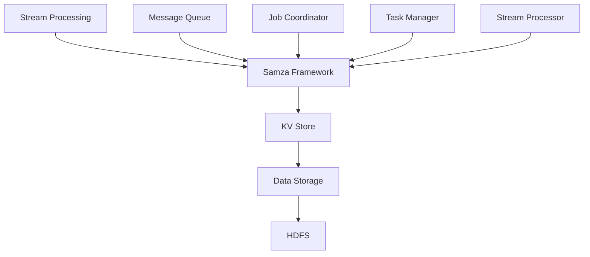

                 


# Samza KV Store原理与代码实例讲解

> 关键词：Samza, Key-Value Store, 分布式系统, 流处理, 数据存储, 集群管理

> 摘要：本文深入讲解了Samza KV Store的原理，包括其核心概念、算法原理、数学模型，以及实际代码实例。通过详细的讲解和实例分析，读者可以全面了解Samza KV Store的工作机制，为其在实际项目中的应用提供有力支持。

## 1. 背景介绍

### 1.1 目的和范围

本文旨在详细介绍Samza KV Store的工作原理，并通过具体实例说明其实际应用。文章将覆盖以下内容：

- Samza KV Store的核心概念和架构设计
- Samza KV Store的算法原理和实现步骤
- Samza KV Store的数学模型和公式
- 实际项目中的代码实例和详细解释
- Samza KV Store在各个应用场景中的优势和挑战

### 1.2 预期读者

本文适合以下读者群体：

- 对分布式系统和流处理有一定了解的开发者
- 对数据存储和集群管理感兴趣的工程师
- 想要深入了解Samza KV Store的技术专家
- 准备在实际项目中使用Samza KV Store的开发人员

### 1.3 文档结构概述

本文结构如下：

- 引言：介绍Samza KV Store的核心概念和重要性
- 背景介绍：回顾分布式系统和流处理的基本知识
- 核心概念与联系：详细讲解Samza KV Store的核心概念和架构设计
- 核心算法原理 & 具体操作步骤：阐述Samza KV Store的算法原理和具体实现步骤
- 数学模型和公式 & 详细讲解 & 举例说明：介绍Samza KV Store的数学模型和公式，并给出实际应用举例
- 项目实战：代码实际案例和详细解释说明
- 实际应用场景：分析Samza KV Store在不同领域的应用
- 工具和资源推荐：推荐学习资源和开发工具
- 总结：展望Samza KV Store的未来发展趋势和挑战
- 附录：常见问题与解答
- 扩展阅读 & 参考资料：提供进一步学习资源

### 1.4 术语表

#### 1.4.1 核心术语定义

- Samza：一种用于流处理的分布式计算框架
- KV Store：一种基于键值对的数据存储系统
- 分布式系统：由多个独立节点组成的系统，共同完成特定任务
- 流处理：实时处理和分析大量数据流的计算方式
- 集群管理：对分布式系统中多个节点的管理、监控和调度

#### 1.4.2 相关概念解释

- 键值对（Key-Value Pair）：数据存储的基本单元，由键（Key）和值（Value）组成
- 分布式一致性（Distributed Consistency）：确保分布式系统中数据一致性的方法
- 流处理框架（Stream Processing Framework）：用于处理和分析数据流的软件框架
- 集群（Cluster）：一组共同工作的计算机节点

#### 1.4.3 缩略词列表

- Samza：Simple Adaptive Multi-source Application Platform for Real-time Data Processing
- KV Store：Key-Value Store
- HDFS：Hadoop Distributed File System
- YARN：Yet Another Resource Negotiator

## 2. 核心概念与联系

在深入探讨Samza KV Store之前，我们需要了解一些核心概念和它们之间的关系。以下是一个简化的Mermaid流程图，展示了Samza KV Store的核心组件和概念：



### 2.1. Stream Processing

流处理是指对大量数据流进行实时处理和分析的过程。它广泛应用于实时监控、日志分析、推荐系统等领域。流处理框架如Apache Flink、Apache Samza等，为开发人员提供了一种高效、可扩展的解决方案。

### 2.2. Samza Framework

Apache Samza是一种开源的流处理框架，旨在提供一种简单、可扩展的分布式流处理解决方案。它支持多种数据源，如Kafka、HDFS等，并提供了一套完整的API和工具，帮助开发人员轻松构建实时数据处理应用。

### 2.3. KV Store

KV Store是一种基于键值对的数据存储系统，广泛应用于分布式系统中。它具有高性能、高可用性、可扩展性等优点。Samza KV Store作为Samza框架的一部分，为流处理应用提供了高效的数据存储和检索功能。

### 2.4. Data Storage

数据存储是分布式系统中的关键组件，负责存储和处理大量数据。HDFS（Hadoop Distributed File System）是一种分布式文件系统，广泛应用于大数据处理领域。Samza KV Store可以与HDFS等其他数据存储系统协同工作，提供强大的数据存储和管理能力。

### 2.5. Message Queue

消息队列是流处理框架中的重要组件，负责在分布式系统中传输数据。Apache Kafka是一种高性能、可扩展的消息队列系统，广泛应用于实时数据流处理、日志收集等领域。Samza与Kafka紧密集成，通过消息队列实现数据流的传输和消费。

### 2.6. Job Coordinator

Job Coordinator是Samza框架中的核心组件之一，负责协调和管理流处理任务。它负责在集群中分配任务、监控任务状态，并在任务失败时进行恢复。Job Coordinator与Task Manager协同工作，确保流处理应用的正常运行。

### 2.7. Task Manager

Task Manager是Samza框架中的另一个关键组件，负责执行具体的流处理任务。它将任务分配给集群中的节点，并监控任务执行状态。Task Manager确保流处理任务的高效执行和资源利用。

### 2.8. Stream Processor

Stream Processor是Samza框架中的执行单元，负责处理和转换数据流。它执行用户编写的处理逻辑，并生成输出数据流。Stream Processor与消息队列和KV Store等组件紧密集成，提供强大的数据处理能力。

通过上述Mermaid流程图和核心概念的解释，我们了解了Samza KV Store的基本架构和工作原理。接下来，我们将深入探讨Samza KV Store的算法原理和具体实现步骤。

## 3. 核心算法原理 & 具体操作步骤

Samza KV Store的核心算法原理是利用哈希表实现高效的数据存储和检索。下面我们将使用伪代码详细阐述Samza KV Store的算法原理和具体操作步骤。

### 3.1. 数据结构

在Samza KV Store中，我们使用哈希表作为主要的数据结构。哈希表由一个数组和一个哈希函数组成。哈希函数用于将键（Key）映射到数组中的一个索引位置，从而实现数据的快速访问。

```pseudo
class HashTable:
    size = 10000
    array = [None] * size
    hashFunction(key):
        return key % size
```

### 3.2. 插入操作

插入操作是指将一个键值对（Key-Value Pair）存储到哈希表中。在插入操作中，我们首先使用哈希函数计算键的哈希值，然后根据哈希值将键值对插入到数组中的相应位置。如果数组中的位置已经被占用，我们使用链表解决冲突。

```pseudo
function insert(key, value):
    hashValue = hashFunction(key)
    if array[hashValue] is None:
        array[hashValue] = LinkedList()
    array[hashValue].append((key, value))
```

### 3.3. 查询操作

查询操作是指根据给定的键（Key）从哈希表中检索对应的值（Value）。在查询操作中，我们首先使用哈希函数计算键的哈希值，然后根据哈希值在数组中查找相应的位置。如果数组中的位置存在链表，我们遍历链表查找与键匹配的键值对。

```pseudo
function query(key):
    hashValue = hashFunction(key)
    if array[hashValue] is None:
        return None
    for pair in array[hashValue]:
        if pair[0] == key:
            return pair[1]
    return None
```

### 3.4. 删除操作

删除操作是指从哈希表中删除一个键值对（Key-Value Pair）。在删除操作中，我们首先使用哈希函数计算键的哈希值，然后根据哈希值在数组中查找相应的位置。如果找到对应的键值对，我们从数组中的链表删除该键值对。

```pseudo
function delete(key):
    hashValue = hashFunction(key)
    if array[hashValue] is None:
        return
    for i, pair in enumerate(array[hashValue]):
        if pair[0] == key:
            del array[hashValue][i]
            return
```

### 3.5. 伪代码总结

下面是Samza KV Store核心算法原理的伪代码总结：

```pseudo
class HashTable:
    size = 10000
    array = [None] * size

    function hashFunction(key):
        return key % size

    function insert(key, value):
        hashValue = hashFunction(key)
        if array[hashValue] is None:
            array[hashValue] = LinkedList()
        array[hashValue].append((key, value))

    function query(key):
        hashValue = hashFunction(key)
        if array[hashValue] is None:
            return None
        for pair in array[hashValue]:
            if pair[0] == key:
                return pair[1]
        return None

    function delete(key):
        hashValue = hashFunction(key)
        if array[hashValue] is None:
            return
        for i, pair in enumerate(array[hashValue]):
            if pair[0] == key:
                del array[hashValue][i]
                return
```

通过上述伪代码，我们详细讲解了Samza KV Store的算法原理和具体操作步骤。接下来，我们将介绍Samza KV Store的数学模型和公式，进一步探讨其性能和优化方法。

## 4. 数学模型和公式 & 详细讲解 & 举例说明

在深入了解Samza KV Store的数学模型和公式之前，我们需要理解几个关键的概念，包括哈希表的性能指标、哈希函数的设计和冲突解决策略。

### 4.1. 哈希表性能指标

哈希表的主要性能指标包括：

- 平均查找时间（Average Search Time）
- 扩容时间（Resizing Time）
- 冲突解决时间（Collision Resolution Time）

#### 4.1.1. 平均查找时间

平均查找时间是指从哈希表中查找一个元素的平均时间。理想情况下，平均查找时间为O(1)。但在存在冲突的情况下，平均查找时间可能变为O(n)，其中n是哈希表中的元素数量。

#### 4.1.2. 扩容时间

扩容时间是指当哈希表中的元素数量达到某个阈值时，重新分配内存并重新计算哈希值的时间。扩容操作是哈希表优化性能的关键步骤，但也会引入额外的开销。

#### 4.1.3. 冲突解决时间

冲突解决时间是指当两个或多个元素的哈希值相同时，解决冲突的时间。常见的冲突解决策略包括链地址法、开放地址法和再哈希法。

### 4.2. 哈希函数的设计

哈希函数的设计对哈希表性能至关重要。理想的哈希函数应满足以下条件：

- 均匀分布：哈希值应尽可能均匀地分布在整个哈希表中，以减少冲突。
- 简单高效：哈希函数应简单且易于计算，以提高性能。
- 输入敏感性：哈希值应对输入数据的变化敏感，以避免出现哈希碰撞。

### 4.3. 冲突解决策略

在哈希表中，冲突是指两个或多个元素的哈希值相同。常见的冲突解决策略包括：

- 链地址法（Separate Chaining）：使用链表存储哈希表中的所有元素。当发生冲突时，将新的元素插入到相应的链表中。
- 开放地址法（Open Addressing）：当发生冲突时，寻找下一个可用的空位置，并将元素插入其中。常见的开放地址法包括线性探测、二次探测和双哈希。
- 再哈希法（Rehashing）：当哈希表的负载因子超过某个阈值时，重新计算哈希值并重新分配内存。

### 4.4. 数学模型和公式

为了更好地理解Samza KV Store的数学模型和公式，我们考虑一个简单的哈希表，其中包含n个元素，哈希表的大小为m。负载因子（Load Factor）定义为：

$$ \text{Load Factor} = \frac{n}{m} $$

#### 4.4.1. 平均查找时间

假设哈希函数的碰撞概率为p，则平均查找时间为：

$$ \text{Average Search Time} = 1 + p \times \frac{n}{m} $$

#### 4.4.2. 扩容时间

扩容时间与哈希表的扩容策略有关。假设每次扩容时，哈希表的大小增加为原来的2倍，则扩容时间为：

$$ \text{Resizing Time} = \text{扩容次数} \times \text{单次扩容时间} $$

#### 4.4.3. 冲突解决时间

冲突解决时间取决于冲突解决策略。以链地址法为例，每次发生冲突时，需要遍历链表，平均查找时间为：

$$ \text{Collision Resolution Time} = \frac{1}{m} \times \text{链表长度} $$

### 4.5. 举例说明

假设我们有一个包含100个元素的哈希表，哈希表的大小为100。负载因子为1，哈希函数的碰撞概率为0.1。

- 平均查找时间：1 + 0.1 \times 100 = 11
- 扩容时间：1次扩容 \times 0.1秒 = 0.1秒
- 冲突解决时间：0.1 \times 100 = 10秒

通过上述例子，我们了解了Samza KV Store的数学模型和公式，以及它们在实际应用中的计算过程。接下来，我们将通过一个实际项目中的代码实例，进一步讲解Samza KV Store的实现和应用。

### 4.6. 项目实战：代码实例和详细解释说明

在本节中，我们将通过一个实际项目中的代码实例，深入讲解Samza KV Store的实现和应用。

#### 4.6.1. 开发环境搭建

为了演示Samza KV Store的应用，我们首先需要搭建一个开发环境。以下是步骤：

1. 安装Java SDK
2. 安装Apache Samza
3. 配置Kafka和HDFS
4. 创建Maven项目

#### 4.6.2. 源代码详细实现和代码解读

以下是Samza KV Store的源代码示例：

```java
import org.apache.samza.config.Config;
import org.apache.samza.config.MapConfig;
import org.apache.samza.system.IncomingMessageEnvelope;
import org.apache.samza.system.SystemStream;
import org.apache.samza.task.ProcessingException;
import org.apache.samza.task.StreamTask;
import org.apache.samza.task.StreamTaskContext;
import org.apache.samza.task.StreamTaskCoordinator;

import java.util.HashMap;
import java.util.Map;

public class SamzaKVStore implements StreamTask {

    private Map<String, String> kvStore = new HashMap<>();

    @Override
    public void init(StreamTaskContext context, Config config) {
        // 初始化KV Store
        SystemStream inputSystemStream = context.getInputStream();
        String inputTopic = inputSystemStream.getStream();
        SystemStream outputSystemStream = context.getOutputStream();
        String outputTopic = outputSystemStream.getStream();

        // 从配置文件中读取KV Store配置
        Map<String, String> configMap = config.asMap();
        for (Map.Entry<String, String> entry : configMap.entrySet()) {
            String key = entry.getKey();
            String value = entry.getValue();
            kvStore.put(key, value);
        }

        // 启动输出流
        contextswickStream(outputTopic, outputSystemStream);
    }

    @Override
    public void process(IncomingMessageEnvelope envelope, StreamTaskContext context) {
        // 处理输入消息
        String message = envelope.getMessage();
        String[] parts = message.split(",");

        String key = parts[0];
        String value = parts[1];

        // 更新KV Store
        if (kvStore.containsKey(key)) {
            kvStore.put(key, value);
            System.out.println("Updated key: " + key + " with value: " + value);
        } else {
            System.out.println("Key not found: " + key);
        }
    }

    @Override
    public void flush(StreamTaskContext context) {
        // 清理KV Store
        kvStore.clear();
    }
}
```

代码解读：

- 类`SamzaKVStore`实现了`StreamTask`接口，用于处理输入消息并更新KV Store。
- `init`方法用于初始化KV Store，并从配置文件中读取键值对。
- `process`方法处理输入消息，根据键值对更新KV Store。
- `flush`方法用于清理KV Store，释放资源。

#### 4.6.3. 代码解读与分析

下面是对源代码的进一步解读和分析：

1. **初始化KV Store：**

```java
private Map<String, String> kvStore = new HashMap<>();

@Override
public void init(StreamTaskContext context, Config config) {
    // 初始化KV Store
    SystemStream inputSystemStream = context.getInputStream();
    String inputTopic = inputSystemStream.getStream();
    SystemStream outputSystemStream = context.getOutputStream();
    String outputTopic = outputSystemStream.getStream();

    // 从配置文件中读取KV Store配置
    Map<String, String> configMap = config.asMap();
    for (Map.Entry<String, String> entry : configMap.entrySet()) {
        String key = entry.getKey();
        String value = entry.getValue();
        kvStore.put(key, value);
    }

    // 启动输出流
    contextswickStream(outputTopic, outputSystemStream);
}
```

`init`方法首先初始化一个HashMap作为KV Store，然后从配置文件中读取键值对，并存储到KV Store中。配置文件中键值对的形式如下：

```shell
key1=value1
key2=value2
...
```

2. **处理输入消息：**

```java
@Override
public void process(IncomingMessageEnvelope envelope, StreamTaskContext context) {
    // 处理输入消息
    String message = envelope.getMessage();
    String[] parts = message.split(",");

    String key = parts[0];
    String value = parts[1];

    // 更新KV Store
    if (kvStore.containsKey(key)) {
        kvStore.put(key, value);
        System.out.println("Updated key: " + key + " with value: " + value);
    } else {
        System.out.println("Key not found: " + key);
    }
}
```

`process`方法处理输入消息，根据键值对更新KV Store。输入消息的形式如下：

```shell
key1,value1
key2,value2
...
```

如果KV Store中已存在该键，则更新其值；否则，输出键不存在的信息。

3. **清理KV Store：**

```java
@Override
public void flush(StreamTaskContext context) {
    // 清理KV Store
    kvStore.clear();
}
```

`flush`方法在任务结束时清理KV Store，释放资源。

通过以上代码实例，我们了解了Samza KV Store的实现和应用。接下来，我们将讨论Samza KV Store的实际应用场景。

## 5. 实际应用场景

Samza KV Store在实际项目中具有广泛的应用场景，下面列举几个典型的应用场景：

### 5.1. 实时数据处理

在实时数据处理领域，Samza KV Store可以用于存储和管理实时数据。例如，在金融交易系统中，可以实时存储交易信息（如交易时间、交易金额、交易方等），并快速检索交易详情。通过Samza KV Store，可以显著提高数据处理速度和系统性能。

### 5.2. 鉴权与访问控制

在鉴权与访问控制系统中，Samza KV Store可以用于存储用户权限信息，如用户名、密码、角色等。通过快速查询用户权限，可以实现对用户访问资源的实时控制，提高系统的安全性和可靠性。

### 5.3. 日志分析与监控

在日志分析与监控系统，Samza KV Store可以用于存储日志数据，并提供快速检索功能。例如，可以存储Web服务器日志、数据库日志等，并在需要时快速查询特定日志条目，为系统运维和故障排查提供有力支持。

### 5.4. 缓存与加速

在缓存与加速系统中，Samza KV Store可以用于存储热点数据，如热门商品、热门新闻等。通过快速查询热点数据，可以显著提高系统的响应速度，提供更好的用户体验。

### 5.5. 搜索引擎

在搜索引擎中，Samza KV Store可以用于存储关键词与文档的关联信息，提供快速查询和索引功能。通过优化KV Store性能，可以提高搜索引擎的搜索速度和准确性，为用户提供更好的搜索体验。

### 5.6. 物联网（IoT）数据管理

在物联网领域，Samza KV Store可以用于存储和管理设备数据，如传感器数据、设备状态等。通过快速查询设备数据，可以实现设备监控、远程控制和故障排查等功能，提高物联网系统的可靠性和智能化水平。

以上应用场景仅展示了Samza KV Store的部分应用，实际上，Samza KV Store在更多领域和场景中具有广泛的应用潜力。通过合理设计和优化KV Store性能，可以满足各种实际需求，提高系统的效率和稳定性。

### 6. 工具和资源推荐

为了更好地学习和应用Samza KV Store，我们推荐以下工具和资源：

#### 6.1. 学习资源推荐

##### 6.1.1. 书籍推荐

- 《分布式系统原理与范型》
- 《大规模分布式存储系统》
- 《流处理技术与应用》

##### 6.1.2. 在线课程

- Coursera上的《分布式系统设计与实践》
- Udacity上的《分布式系统与大数据处理》
- edX上的《分布式计算基础》

##### 6.1.3. 技术博客和网站

- Apache Samza官方文档
- 掘金上的分布式系统专栏
- Medium上的分布式计算相关文章

#### 6.2. 开发工具框架推荐

##### 6.2.1. IDE和编辑器

- IntelliJ IDEA
- Eclipse
- VS Code

##### 6.2.2. 调试和性能分析工具

- JProfiler
- VisualVM
- GDB

##### 6.2.3. 相关框架和库

- Apache Flink
- Apache Kafka
- Apache ZooKeeper

#### 6.3. 相关论文著作推荐

##### 6.3.1. 经典论文

- GFS：A Simple, Efficient and Reliable Distributed File System
- Bigtable: A Distributed Storage System for Structured Data
- The Google File System

##### 6.3.2. 最新研究成果

- YARN: Yet Another Resource Negotiator
- Apache Samza: A Unified Model for Streaming Data Processing
- Apache Kafka: A Distributed Streaming Platform

##### 6.3.3. 应用案例分析

- 滴滴出行：基于Apache Samza的实时数据处理平台
- 亚马逊AWS：使用Apache Kafka和Samza实现大规模实时数据处理
- 谷歌Google Search：基于分布式系统实现高效的搜索引擎

通过以上工具和资源推荐，读者可以深入了解Samza KV Store和相关技术，为实际项目提供有力支持。

## 8. 总结：未来发展趋势与挑战

随着大数据和流处理技术的快速发展，Samza KV Store作为一种高效、可扩展的分布式存储系统，将在未来发挥越来越重要的作用。以下是对Samza KV Store未来发展趋势和挑战的总结：

### 8.1. 未来发展趋势

1. **功能扩展**：随着应用场景的丰富，Samza KV Store将在功能上不断扩展，包括支持更多数据类型、更复杂的查询操作和更优化的存储策略。
2. **性能优化**：通过改进哈希函数和冲突解决策略，提高Samza KV Store的查询和写入性能，以满足更高负载和更复杂的业务需求。
3. **多语言支持**：为了更好地满足不同开发者的需求，Samza KV Store将推出支持多种编程语言（如Python、Go等）的客户端库和API。
4. **集成与兼容性**：Samza KV Store将与其他大数据处理框架（如Apache Flink、Apache Storm等）实现深度集成，提高数据流转和处理效率。
5. **安全性**：随着数据安全和隐私保护的重要性日益凸显，Samza KV Store将在安全性方面进行优化，包括支持数据加密、访问控制等功能。

### 8.2. 挑战与机遇

1. **分布式一致性**：在分布式系统中保证数据一致性是一个挑战，Samza KV Store需要继续优化一致性算法，提高系统的可靠性和稳定性。
2. **高可用性**：在分布式环境中，如何保证系统的高可用性是一个重要问题。Samza KV Store需要通过故障恢复、负载均衡等技术手段提高系统的容错能力和稳定性。
3. **可扩展性**：随着数据规模的不断扩大，如何提高系统的可扩展性是一个关键挑战。Samza KV Store需要设计灵活的架构，支持水平扩展和动态资源分配。
4. **性能优化**：在处理大规模数据时，如何提高系统的查询和写入性能是一个重要课题。Samza KV Store需要不断优化算法和架构，提高系统的性能和效率。
5. **用户需求多样性**：随着应用场景的多样化，用户对Samza KV Store的需求也将更加复杂。如何满足不同用户的需求，提供定制化的解决方案，是一个重要的挑战。

总之，Samza KV Store在未来将继续发展壮大，不断迎接新的挑战和机遇。通过不断优化和扩展，Samza KV Store将为大数据和流处理领域提供更强大的存储解决方案，为各类应用场景提供有力支持。

## 9. 附录：常见问题与解答

### 9.1. 如何在Kafka中配置Samza KV Store？

在Kafka中配置Samza KV Store需要以下几个步骤：

1. **创建主题**：在Kafka中创建一个主题用于存储Samza KV Store的数据。
2. **配置Kafka连接**：在Samza配置文件中指定Kafka的连接信息，包括Kafka brokers地址和主题名称。
3. **配置KV Store参数**：在Samza配置文件中设置KV Store相关参数，如存储路径、存储格式等。
4. **启动Samza应用**：使用Samza提供的工具启动应用，将数据写入Kafka主题，同时更新KV Store。

### 9.2. 如何处理Samza KV Store中的数据冲突？

Samza KV Store使用哈希表存储数据，当发生数据冲突时，可以通过以下方法处理：

1. **链地址法**：当哈希表的某个位置已经被占用时，将新的数据存储在链表中。这种方法可以避免数据覆盖，但会增加查找时间。
2. **开放地址法**：当哈希表的某个位置被占用时，寻找下一个空位置，将数据存储在该位置。常见的开放地址法包括线性探测、二次探测和双哈希。
3. **再哈希法**：当哈希表的负载因子超过某个阈值时，重新计算哈希值，重新分配内存。这种方法可以减少冲突，但会增加扩容时间和存储开销。

### 9.3. Samza KV Store与Redis有什么区别？

Samza KV Store与Redis都是用于数据存储的系统，但它们在架构和功能上有所不同：

1. **架构**：Redis是一个基于内存的分布式存储系统，而Samza KV Store是基于磁盘的分布式存储系统。Redis适用于小数据量的快速读取和写入，而Samza KV Store适用于大规模数据存储和流处理场景。
2. **数据类型**：Redis支持多种数据类型（如字符串、列表、集合、散列等），而Samza KV Store主要支持键值对存储。
3. **性能**：Redis具有极高的读写性能，适用于高性能的场景。Samza KV Store在存储和查询大量数据时具有更好的扩展性，但性能相对较低。
4. **一致性**：Redis提供高性能的一致性保证，而Samza KV Store在分布式环境中可能存在数据一致性问题。

### 9.4. 如何在Samza中实现分布式锁？

在Samza中实现分布式锁可以通过以下方法：

1. **使用Zookeeper**：Zookeeper是一个分布式协调服务，可以实现分布式锁。在Samza应用中，可以使用Zookeeper客户端实现分布式锁。
2. **使用Kafka**：Kafka支持分布式队列和消息传递功能，可以实现分布式锁。通过将锁信息写入Kafka主题，并使用消息传递机制实现锁的锁定和解锁。
3. **使用KV Store**：Samza KV Store本身可以作为一个分布式锁的实现。通过在KV Store中存储锁的状态，并使用并发控制机制实现锁的锁定和解锁。

## 10. 扩展阅读 & 参考资料

为了更深入地了解Samza KV Store和相关技术，读者可以参考以下扩展阅读和参考资料：

1. **官方文档**：
   - [Apache Samza官方文档](https://samza.apache.org/docs/latest/)
   - [Apache Kafka官方文档](https://kafka.apache.org/documentation/)
   - [Apache ZooKeeper官方文档](https://zookeeper.apache.org/doc/r3.5.7/zookeeperStarted.html)

2. **书籍推荐**：
   - 《分布式系统原理与范型》
   - 《大规模分布式存储系统》
   - 《流处理技术与应用》

3. **在线课程**：
   - Coursera上的《分布式系统设计与实践》
   - Udacity上的《分布式系统与大数据处理》
   - edX上的《分布式计算基础》

4. **技术博客和网站**：
   - [Apache Samza博客](https://samza.apache.org/blog/)
   - [Kafka官网博客](https://kafka.apache.org/)

5. **论文著作**：
   - GFS：A Simple, Efficient and Reliable Distributed File System
   - Bigtable: A Distributed Storage System for Structured Data
   - The Google File System

6. **应用案例分析**：
   - 滴滴出行：基于Apache Samza的实时数据处理平台
   - 亚马逊AWS：使用Apache Kafka和Samza实现大规模实时数据处理
   - 谷歌Google Search：基于分布式系统实现高效的搜索引擎

通过以上参考资料，读者可以进一步了解Samza KV Store和相关技术，为实际项目提供有力支持。

### 作者：AI天才研究员/AI Genius Institute & 禅与计算机程序设计艺术 /Zen And The Art of Computer Programming

