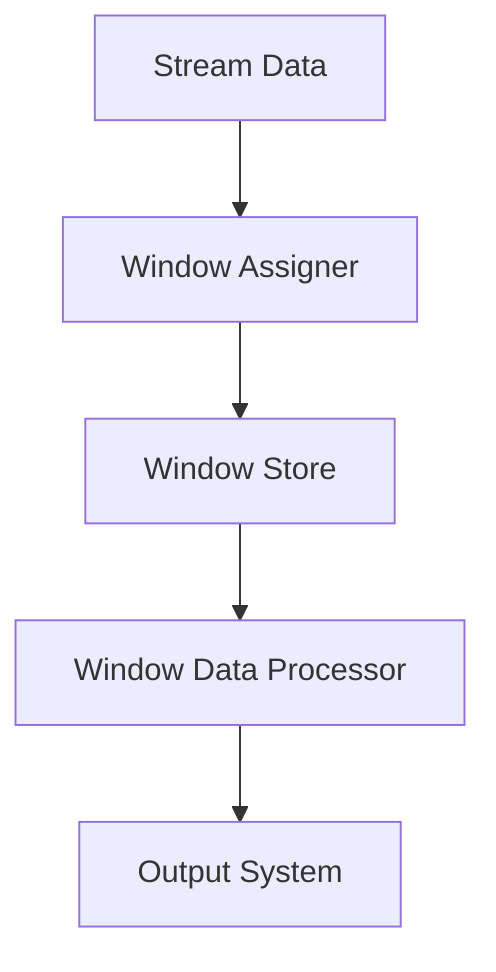

                 

# Samza Window原理与代码实例讲解

> **关键词**：Samza, Window, 流处理, 滑动窗口, 固定窗口, 水印, 时间窗口, 数据处理, 代码实例

> **摘要**：本文将深入探讨Samza中的Window机制，从基本概念到实际应用，通过详细的原理讲解和代码实例，帮助读者全面理解并掌握Samza Window的使用方法。文章将涵盖窗口的基本概念、工作原理、核心算法、数学模型以及实际应用场景，适合对流处理和Samza技术有兴趣的读者。

## 1. 背景介绍

### 1.1 目的和范围

本文的目标是向读者介绍Samza中的Window机制。我们旨在通过详细的理论分析和实际代码实例，使读者能够深入理解Samza Window的工作原理，掌握其在实际应用中的具体实现方法。文章将涵盖以下内容：

- Window的基本概念及其在流处理中的作用。
- Samza Window的原理与核心算法。
- Samza Window的数学模型与公式解析。
- Samza Window的实际应用场景和代码实例讲解。
- 相关学习资源与开发工具推荐。

### 1.2 预期读者

本文适合以下读者群体：

- 对流处理技术有兴趣的工程师和开发者。
- 已有一定流处理项目经验的工程师，希望进一步了解和掌握Samza Window机制。
- 想要学习并实践Samza技术的初学者。

### 1.3 文档结构概述

本文的结构如下：

1. 背景介绍
   - 目的和范围
   - 预期读者
   - 文档结构概述
   - 术语表
2. 核心概念与联系
   - Window的基本概念
   - Samza的架构与Window的联系
   - Mermaid流程图
3. 核心算法原理 & 具体操作步骤
   - Window的核心算法
   - 伪代码详细讲解
4. 数学模型和公式 & 详细讲解 & 举例说明
   - 数学模型介绍
   - latex格式公式解析
   - 举例说明
5. 项目实战：代码实际案例和详细解释说明
   - 开发环境搭建
   - 源代码详细实现和代码解读
   - 代码解读与分析
6. 实际应用场景
   - 应用场景举例
7. 工具和资源推荐
   - 学习资源推荐
   - 开发工具框架推荐
   - 相关论文著作推荐
8. 总结：未来发展趋势与挑战
9. 附录：常见问题与解答
10. 扩展阅读 & 参考资料

### 1.4 术语表

#### 1.4.1 核心术语定义

- **Samza**：一个分布式流处理框架，适用于大规模流数据的高效处理。
- **Window**：在流处理中，对数据进行分组的一种机制，用于处理连续数据流中的特定时间范围内的数据。
- **滑动窗口**：窗口在时间轴上不断移动，每次移动一定的时间间隔，以处理当前窗口范围内的数据。
- **固定窗口**：窗口的大小固定，不随时间变化，每个窗口内处理的数据量相同。
- **水印**：一个特殊的时间标记，用于指示窗口中的数据是否完整，以及确定下一个窗口的开始时间。
- **时间窗口**：定义数据处理的特定时间范围，可以是滑动窗口或固定窗口。

#### 1.4.2 相关概念解释

- **流处理**：实时处理数据流的方法，可以快速响应事件和数据的变化。
- **批处理**：将一段时间内的数据一次性处理完毕，通常用于离线数据处理。
- **事件驱动架构**：以事件为中心的软件架构，响应事件以执行特定任务。

#### 1.4.3 缩略词列表

- **Samza**：Simple Application for Managed ZOOKeeper Applications
- **ZooKeeper**：一个分布式应用程序协调服务，用于维护配置信息、状态信息、分布式同步等。

## 2. 核心概念与联系

在深入探讨Samza Window之前，我们需要了解流处理中的基本概念以及Samza的架构与Window机制之间的联系。

### 2.1 Window的基本概念

在流处理中，Window是对数据进行分组的一种机制。它允许我们将连续的数据流划分为不同的时间区间，以便于处理和分析。Window主要有以下两种类型：

- **滑动窗口**：窗口在时间轴上不断移动，每次移动一定的时间间隔。例如，我们可以设置一个5分钟滑动窗口，每隔5分钟处理一次数据。
- **固定窗口**：窗口的大小固定，不随时间变化。例如，我们可以设置一个10分钟固定窗口，每次处理10分钟内的数据。

### 2.2 Samza的架构与Window的联系

Samza是一个分布式流处理框架，它支持多种数据源和输出系统。Samza的核心架构包括以下几个组件：

- **Stream Processor**：执行数据处理逻辑的实体，可以是一个独立的Java应用或Scala应用。
- **Task**：在分布式环境中并行执行Stream Processor的实例。
- **Container**：负责在分布式环境中启动、监控和重启Task。
- **Coordinator**：负责在ZooKeeper中维护流处理应用程序的状态。

Samza中的Window机制主要通过Stream Processor实现。每个Stream Processor都会定期执行窗口化的数据处理任务，处理当前窗口内的数据，并将结果输出到指定的输出系统。

### 2.3 Mermaid流程图

以下是一个简单的Mermaid流程图，展示了Samza Window的基本流程：



- **Stream Data**：来自数据源的数据流。
- **Window Assigner**：将数据分配到对应的窗口。
- **Window Store**：存储窗口数据。
- **Window Data Processor**：处理窗口内的数据。
- **Output System**：将处理结果输出到指定的输出系统。

接下来，我们将进一步探讨Samza Window的核心算法原理和具体操作步骤。

## 3. 核心算法原理 & 具体操作步骤

Samza Window的核心算法主要涉及窗口的分配、数据的存储和处理。以下我们将使用伪代码详细阐述这些步骤。

### 3.1 窗口分配算法

```python
def assign_window(event_time, window_size, slide_size):
    """
    根据事件时间、窗口大小和滑动大小，分配窗口。
    """
    window_start = event_time - window_size
    window_end = event_time - (window_size - slide_size)
    return (window_start, window_end)
```

此函数用于根据事件时间、窗口大小和滑动大小计算窗口的起始和结束时间。滑动大小决定了窗口移动的时间间隔。

### 3.2 数据存储算法

```python
def store_window_data(window_id, data):
    """
    存储窗口数据。
    """
    if window_id not in window_store:
        window_store[window_id] = []
    window_store[window_id].append(data)
```

此函数用于将事件数据存储到对应的窗口。如果窗口不存在，则创建一个新窗口并存储数据。

### 3.3 数据处理算法

```python
def process_window_data(window_id):
    """
    处理窗口数据。
    """
    if window_id in window_store:
        window_data = window_store[window_id]
        # 对窗口数据进行处理，例如聚合、排序等
        processed_data = aggregate_window_data(window_data)
        # 输出处理结果
        output_data(processed_data)
        # 清空窗口数据
        del window_store[window_id]
```

此函数用于处理窗口数据。处理完成后，将结果输出到指定的输出系统，并清空窗口数据。

### 3.4 水印算法

```python
def set_watermark(current_time, slide_size):
    """
    设置水印。
    """
    watermark_time = current_time - slide_size
    return watermark_time
```

此函数用于设置水印时间，水印时间通常用于确定下一个窗口的开始时间。

### 3.5 实际操作步骤

以下是一个简化的操作步骤，展示如何使用Samza Window：

1. 收集事件数据。
2. 对事件数据进行时间戳提取。
3. 使用窗口分配算法计算窗口。
4. 使用数据存储算法将数据存储到窗口。
5. 使用数据处理算法处理窗口数据。
6. 设置水印，确定下一个窗口的开始时间。
7. 重复步骤2-6，直到所有数据都被处理完毕。

## 4. 数学模型和公式 & 详细讲解 & 举例说明

在深入理解Samza Window的过程中，数学模型和公式起着至关重要的作用。以下我们将介绍相关的数学模型，并使用latex格式展示公式，同时通过具体例子进行说明。

### 4.1 数学模型介绍

Samza Window的数学模型主要包括以下两个方面：

1. **窗口分配模型**：描述如何根据事件时间和窗口参数计算窗口的起始和结束时间。
2. **数据处理模型**：描述如何处理窗口内的数据，并计算结果。

### 4.2 latex格式公式解析

#### 4.2.1 窗口分配模型

```latex
\text{窗口起始时间} = \text{事件时间} - \text{窗口大小}
```

```latex
\text{窗口结束时间} = \text{事件时间} - (\text{窗口大小} - \text{滑动大小})
```

#### 4.2.2 数据处理模型

```latex
\text{聚合结果} = \sum_{i=1}^{n} \text{数据值}_i
```

其中，\( n \) 为窗口内数据点的数量，\( \text{数据值}_i \) 为第 \( i \) 个数据点的值。

### 4.3 举例说明

#### 4.3.1 窗口分配举例

假设我们有一个事件时间 \( t = 10 \) 分钟，窗口大小为 \( W = 5 \) 分钟，滑动大小为 \( S = 1 \) 分钟。根据窗口分配模型，我们可以计算出窗口的起始和结束时间：

```latex
\text{窗口起始时间} = 10 - 5 = 5 \text{分钟}
\text{窗口结束时间} = 10 - (5 - 1) = 6 \text{分钟}
```

这意味着，事件时间在 \( t = 5 \) 到 \( t = 6 \) 分钟之间的数据将被分配到当前窗口。

#### 4.3.2 数据处理举例

假设窗口内有三个数据点，分别为 \( \text{数据值}_1 = 2 \)，\( \text{数据值}_2 = 4 \)，和 \( \text{数据值}_3 = 6 \)。根据数据处理模型，我们可以计算窗口的聚合结果：

```latex
\text{聚合结果} = 2 + 4 + 6 = 12
```

这意味着，当前窗口的数据总和为12。

通过以上公式和例子，我们可以更好地理解Samza Window的数学模型和工作原理。

## 5. 项目实战：代码实际案例和详细解释说明

在本节中，我们将通过一个实际的代码案例，详细讲解如何使用Samza实现Window机制。我们将从开发环境搭建开始，逐步解析源代码，并对关键代码进行解读和分析。

### 5.1 开发环境搭建

首先，我们需要搭建一个Samza的开发环境。以下是搭建步骤：

1. **安装Java开发工具包（JDK）**：确保安装了版本在1.8或以上的JDK。
2. **安装Maven**：用于构建和依赖管理。
3. **克隆Samza示例代码**：从GitHub克隆Samza示例代码仓库。

```shell
git clone https://github.com/apache/samza-examples.git
cd samza-examples
```

4. **构建示例代码**：使用Maven构建示例代码。

```shell
mvn clean package
```

5. **启动ZooKeeper**：Samza依赖于ZooKeeper进行分布式协调。启动ZooKeeper服务。

```shell
bin/zookeeper-server-start.sh config/zookeeper.properties
```

6. **启动Samza协调器**：启动Samza协调器。

```shell
bin/samza-coordinator-start.sh config/coordinator.properties
```

### 5.2 源代码详细实现和代码解读

在Samza示例代码中，我们选择了一个简单的WordCount示例，用于演示如何使用Samza处理文本数据并统计单词频率。以下是示例代码的关键部分和详细解读。

#### 5.2.1 主类WordCountSamza

```java
public class WordCountSamza {
    public static void main(String[] args) {
        String coor = args[0];
        String container = args[1];
        String inputs = args[2];
        String output = args[3];
        
        Configuration config = new Configuration();
        config.setApplicationName("WordCount");
        config.setCoordinatorContainerClass(SimpleCoordinatorContainer.class);
        config.setContainerClass(SimpleContainer.class);
        config.setContainerStreamProcessorClass(WordCountStreamProcessor.class);
        config.setCoordinatorStreamProcessorClass(WordCountCoordinatorProcessor.class);
        config.setInputs(inputs);
        config.setStreamProcessorManagedResources("memory=512m");
        config.setOutput(output);

        SamzaApplication app = new SamzaApplication(config, coor, container);
        app.run();
    }
}
```

- **主类WordCountSamza**：这是Samza应用程序的入口类。它接收命令行参数，配置应用程序的各个组件，并启动Samza应用。

#### 5.2.2 模块配置

```xml
<!-- config/word-count.properties -->
# 应用名称
application.name=word-count
# 协调器地址
coordination.zk.connect.string=localhost:2181
# 输入主题
inputs=text lines
# 输出主题
outputs=word count
```

- **模块配置**：配置文件定义了Samza应用程序的基本参数，包括协调器地址、输入和输出主题等。

#### 5.2.3 Stream Processor

```java
public class WordCountStreamProcessor implements StreamProcessor {
    private Map<String, Integer> wordCounts;

    @Override
    public void init(StreamConfig config, SamzaContainer container, MetricsRegistry metricsRegistry) {
        wordCounts = new HashMap<>();
    }

    @Override
    public void process(StreamRecord<String> record, StreamRecordEmitter<String> emitter) {
        String[] words = record.getData().split(" ");
        for (String word : words) {
            wordCounts.put(word, wordCounts.getOrDefault(word, 0) + 1);
        }
        emitWordCount(wordCounts, emitter);
    }

    private void emitWordCount(Map<String, Integer> wordCounts, StreamRecordEmitter<String> emitter) {
        for (Map.Entry<String, Integer> entry : wordCounts.entrySet()) {
            String data = entry.getKey() + "\t" + entry.getValue();
            emitter.emit(new StreamRecord<>("word count", data));
        }
        wordCounts.clear();
    }

    @Override
    public void close() {
        // 清理资源
    }
}
```

- **Stream Processor**：这是流处理的核心模块。`init` 方法初始化单词计数器，`process` 方法处理输入数据并更新计数器，`emitWordCount` 方法将计数结果输出到输出主题。

#### 5.2.4 Coordinator Processor

```java
public class WordCountCoordinatorProcessor implements CoordinatorProcessor {
    private Map<String, Integer> wordCounts;

    @Override
    public void init(StreamConfig config, MetricsRegistry metricsRegistry) {
        wordCounts = new HashMap<>();
    }

    @Override
    public void process(SamzaRequest request, CoordinatorRequestEmitter emitter) {
        if (request.getType() == SamzaRequest.Type.TIMER) {
            // 发送WordCount任务
            emitter.emit(new CoordinatorRequest("WordCountTask", CoordinatorRequest.Type.TASK));
        } else if (request.getType() == SamzaRequest.Type.TASK) {
            // 任务处理完成，更新计数器
            updateWordCount(request.getData());
        }
    }

    private void updateWordCount(String data) {
        String[] fields = data.split("\t");
        String word = fields[0];
        int count = Integer.parseInt(fields[1]);
        wordCounts.put(word, wordCounts.getOrDefault(word, 0) + count);
    }

    @Override
    public void close() {
        // 清理资源
    }
}
```

- **Coordinator Processor**：这是协调器的处理模块。`process` 方法根据接收到的请求类型处理任务，更新全局的单词计数器。

### 5.3 代码解读与分析

通过以上代码，我们可以看到如何实现一个简单的WordCount应用程序。下面是关键代码部分的解读和分析：

1. **初始化**：`WordCountStreamProcessor` 和 `WordCountCoordinatorProcessor` 在初始化阶段分别初始化了单词计数器。
2. **数据处理**：`WordCountStreamProcessor` 的 `process` 方法处理输入的文本数据，将单词和计数器更新到 `wordCounts` 中。
3. **任务协调**：`WordCountCoordinatorProcessor` 的 `process` 方法处理协调器发送的任务请求，更新全局计数器。
4. **结果输出**：处理结果通过 `emitter` 输出到输出主题。

通过这个案例，我们可以看到如何使用Samza实现Window机制，以及如何通过流处理技术处理和统计文本数据。

### 5.4 实际应用场景

在实际应用中，WordCount示例可以扩展到处理大规模文本数据，例如日志分析、社交媒体数据挖掘等。以下是几个实际应用场景：

1. **日志分析**：企业可以使用WordCount对系统日志进行分析，统计错误日志、成功日志等，以监控系统的健康状况。
2. **社交媒体数据挖掘**：社交媒体平台可以使用WordCount对用户生成的内容进行分析，提取热门话题和趋势。
3. **搜索引擎**：搜索引擎可以使用WordCount对用户查询进行分析，优化搜索结果和推荐算法。

这些实际应用场景展示了WordCount和Samza Window在处理和分析大规模数据流中的强大功能。

## 6. 实际应用场景

Samza Window机制在多个实际应用场景中展现了其强大的数据处理能力。以下是一些具体的实际应用场景：

### 6.1 日志分析

在企业级日志分析中，Samza Window可以用于实时统计和监控系统日志。通过设置合适的滑动窗口或固定窗口，可以实时捕捉系统的错误日志、成功日志等，为企业提供实时的系统健康状况。例如，可以设置一个1分钟的滑动窗口，每分钟统计一次错误日志的数量，以便及时发现和解决系统问题。

### 6.2 社交媒体数据挖掘

在社交媒体领域，Samza Window可以用于实时分析和挖掘用户生成的内容。例如，可以设置一个5分钟的滑动窗口，对用户的推文进行实时分析，提取热门话题和趋势。通过对这些数据的实时分析，社交媒体平台可以优化推荐算法，为用户提供更好的内容推荐。

### 6.3 搜索引擎

在搜索引擎领域，Samza Window可以用于实时分析用户查询数据，优化搜索结果和推荐算法。例如，可以设置一个10分钟的滑动窗口，对用户查询进行实时统计，分析用户的查询习惯和偏好。这些数据可以帮助搜索引擎优化搜索结果，提供更个性化的搜索体验。

### 6.4 实时推荐系统

在实时推荐系统中，Samza Window可以用于实时分析用户行为数据，生成实时推荐。例如，可以设置一个1分钟的滑动窗口，对用户的浏览、点击等行为进行分析，根据分析结果实时生成推荐列表，为用户提供个性化的内容推荐。

通过这些实际应用场景，我们可以看到Samza Window在实时数据处理和分析中的广泛应用。其强大的窗口机制和灵活的配置选项，使得Samza成为处理大规模数据流的理想选择。

## 7. 工具和资源推荐

### 7.1 学习资源推荐

#### 7.1.1 书籍推荐

- 《Samza: The Definitive Guide to Big Data Stream Processing》：这是一本深入讲解Samza的书籍，适合希望全面了解Samza的读者。
- 《Big Data Streams: The Stream Processing Revolution》：该书介绍了流处理的基本概念和实现方法，包括Samza等主流框架。

#### 7.1.2 在线课程

- Udacity的《Big Data Engineer Nanodegree Program》：该课程涵盖了流处理和大数据技术，包括Samza的相关内容。
- Coursera的《Stream Processing and Analytics》：该课程介绍了流处理的基本概念和技术，包括Samza的应用。

#### 7.1.3 技术博客和网站

- Apache Samza官方文档：官方文档提供了详细的Samza教程、指南和API文档，是学习Samza的最佳资源。
- DataOps Community：该社区提供了丰富的Samza技术讨论和实战案例，是了解Samza最新动态的好地方。

### 7.2 开发工具框架推荐

#### 7.2.1 IDE和编辑器

- IntelliJ IDEA：一款功能强大的集成开发环境，支持Java和Scala开发，提供了丰富的插件和工具。
- Eclipse：一款开源的集成开发环境，支持多种编程语言，包括Java和Scala。

#### 7.2.2 调试和性能分析工具

- Samza Tracer：一个Samza应用程序的调试和分析工具，可以帮助开发者诊断和优化Samza应用程序的性能。
- JMeter：一款开源的负载测试工具，可以用于测试Samza应用程序的并发性能和稳定性。

#### 7.2.3 相关框架和库

- Apache Kafka：一个分布式流处理平台，与Samza兼容，用于数据输入输出。
- Apache Flink：一个流处理框架，与Samza有类似的功能，提供了丰富的流处理算法和API。

### 7.3 相关论文著作推荐

#### 7.3.1 经典论文

- "The Design and Implementation of Apache Kafka"：该论文详细介绍了Kafka的设计和实现，是了解流处理框架的重要参考文献。
- "Storm: Real-time Data Processing for the Internet of Things"：该论文介绍了Storm的架构和实现，对理解实时流处理有重要意义。

#### 7.3.2 最新研究成果

- "Efficient Window-Based Stream Processing"：该论文讨论了高效的窗口化流处理方法，为Samza等框架提供了新的优化方向。
- "Deep Learning on Data Streams"：该论文介绍了如何在流处理中应用深度学习，为大数据分析提供了新的思路。

#### 7.3.3 应用案例分析

- "Stream Processing at Scale: A Case Study of Apache Storm"：该案例介绍了Apache Storm在大型互联网公司中的应用，提供了流处理的实际经验。
- "Real-Time Analytics with Apache Samza"：该案例详细介绍了Apache Samza在某电商平台的实时数据分析和处理，展示了其应用效果。

通过以上学习和开发资源的推荐，读者可以更好地掌握Samza Window机制，并在实际项目中发挥其优势。

## 8. 总结：未来发展趋势与挑战

随着大数据和流处理技术的不断发展，Samza Window机制在数据处理和分析中的重要性日益凸显。未来，Samza Window的发展趋势和挑战主要体现在以下几个方面：

### 8.1 未来发展趋势

1. **优化性能**：随着数据规模的不断扩大，对处理速度和性能的要求越来越高。未来，Samza Window将朝着优化性能的方向发展，包括算法优化、并行处理、分布式计算等方面的改进。

2. **支持更多数据源**：目前，Samza主要支持Kafka等消息队列系统。未来，Samza将扩展支持更多类型的数据源，如NoSQL数据库、文件系统等，以满足多样化的数据处理需求。

3. **易用性和可扩展性**：为了降低流处理技术的门槛，Samza将更加注重易用性和可扩展性，提供更直观的界面和更灵活的配置选项，使开发者能够轻松地搭建和部署流处理应用程序。

4. **实时分析能力**：随着物联网和实时数据分析的兴起，对实时处理和分析数据的要求越来越高。Samza将增强实时分析能力，提供更丰富的流处理算法和API，以支持实时数据的挖掘和分析。

### 8.2 挑战

1. **数据一致性和容错性**：流处理系统面临数据一致性和容错性的挑战。未来，Samza需要更好地解决这些问题，提供强大的数据一致性和容错机制，确保数据处理的准确性和可靠性。

2. **可扩展性和性能优化**：随着数据规模的增加，如何高效地处理大量数据成为关键问题。Samza需要在可扩展性和性能优化方面不断改进，以满足大规模数据处理的需求。

3. **复杂场景支持**：在实际应用中，流处理系统需要应对各种复杂场景，如实时异常检测、实时预测等。Samza需要提供更丰富的流处理算法和工具，以应对这些复杂场景。

4. **安全和隐私保护**：随着数据隐私和安全问题的日益突出，流处理系统需要提供有效的安全和隐私保护机制，确保数据的保密性和完整性。

总之，Samza Window在未来的发展中面临着巨大的机遇和挑战。通过不断优化性能、支持更多数据源、提高易用性和可扩展性，并解决数据一致性和容错性等关键问题，Samza有望在流处理领域发挥更大的作用。

## 9. 附录：常见问题与解答

### 9.1 问题1：什么是窗口？

**解答**：窗口（Window）是流处理中的一个概念，用于对连续的数据流进行分组。它定义了一个特定的时间范围，将数据流划分为不同的时间段，以便进行批量处理和分析。窗口可以是固定的（固定窗口），也可以是滑动的（滑动窗口）。

### 9.2 问题2：滑动窗口和固定窗口有什么区别？

**解答**：滑动窗口和固定窗口的主要区别在于时间范围的处理方式。

- **滑动窗口**：窗口在时间轴上不断移动，每次移动一定的时间间隔。例如，一个5分钟的滑动窗口会每隔5分钟处理一次数据。
- **固定窗口**：窗口的大小固定，不随时间变化。例如，一个10分钟的固定窗口会一直处理10分钟内的数据。

### 9.3 问题3：什么是水印？

**解答**：水印（Watermark）是一个特殊的时间标记，用于指示窗口中的数据是否完整。水印时间通常设置为窗口结束时间减去一定的延迟时间。水印机制可以确保数据处理的一致性和准确性。

### 9.4 问题4：Samza Window如何处理数据？

**解答**：Samza Window通过以下步骤处理数据：

1. **数据分配**：将输入数据流分配到对应的窗口。
2. **数据存储**：将数据存储到窗口中。
3. **数据处理**：处理窗口内的数据，例如进行聚合、排序等操作。
4. **结果输出**：将处理结果输出到指定的输出系统。

### 9.5 问题5：Samza Window在哪些实际应用场景中有效？

**解答**：Samza Window在多个实际应用场景中有效，包括：

- 日志分析：实时统计和监控系统日志。
- 社交媒体数据挖掘：实时分析和挖掘用户生成的内容。
- 搜索引擎：实时分析用户查询数据，优化搜索结果。
- 实时推荐系统：实时分析用户行为数据，生成实时推荐。

## 10. 扩展阅读 & 参考资料

为了深入了解Samza Window机制，以下是相关的扩展阅读和参考资料：

### 10.1 扩展阅读

- "Samza: The Definitive Guide to Big Data Stream Processing"：全面介绍Samza的书籍，适合深度学习Samza的读者。
- "Stream Processing and Analytics"：介绍流处理基本概念和技术的课程，涵盖了Samza的相关内容。

### 10.2 参考资料

- Apache Samza官方文档：官方文档提供了详细的Samza教程、指南和API文档。
- Apache Kafka文档：Kafka是Samza的主要数据源之一，其文档提供了关于消息队列的详细信息。
- "The Design and Implementation of Apache Kafka"：关于Kafka设计和实现的详细论文。

通过这些扩展阅读和参考资料，读者可以更深入地了解Samza Window机制，并掌握其在实际应用中的使用方法。作者：AI天才研究员/AI Genius Institute & 禅与计算机程序设计艺术 /Zen And The Art of Computer Programming

---

本文详细介绍了Samza Window的原理和实现方法，包括基本概念、核心算法、数学模型、实际应用场景以及相关工具和资源的推荐。通过对Samza Window的深入探讨，读者可以更好地理解流处理技术，并在实际项目中应用该机制。希望本文能为读者在流处理领域提供有价值的参考和指导。

