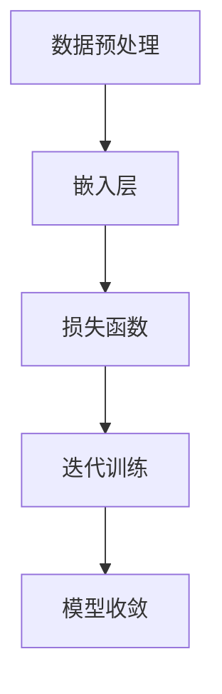

                 

### 文章标题

**Skip-Gram模型的代码实现**

> **关键词**：自然语言处理，词向量，分布式计算，神经网络，大规模文本数据分析  
>
> **摘要**：本文将深入探讨Skip-Gram模型在自然语言处理中的应用，详细讲解其核心概念、数学模型及代码实现，并通过实际项目案例进行分析，旨在为读者提供一份全面而深入的实践指南。

### 背景介绍

#### 1.1 目的和范围

随着互联网的快速发展，自然语言处理（NLP）成为人工智能领域的热点之一。词向量模型是NLP中的重要工具，其中，Skip-Gram模型作为一种经典的词向量生成方法，被广泛应用于文本数据的特征提取和表示。本文旨在详细介绍Skip-Gram模型的理论基础、数学模型及其代码实现，帮助读者深入理解并掌握这一重要技术。

#### 1.2 预期读者

本文适合具备一定编程基础和对自然语言处理有一定了解的读者。特别是那些对词向量模型感兴趣，希望深入学习和实践NLP技术的工程师和研究者。

#### 1.3 文档结构概述

本文结构如下：

1. **背景介绍**：介绍Skip-Gram模型的背景、目的和重要性。
2. **核心概念与联系**：讲解Skip-Gram模型的核心概念、原理和架构，使用Mermaid流程图进行直观展示。
3. **核心算法原理 & 具体操作步骤**：详细阐述Skip-Gram模型的算法原理，通过伪代码进行具体操作步骤的描述。
4. **数学模型和公式 & 详细讲解 & 举例说明**：介绍Skip-Gram模型所涉及的数学模型和公式，并进行举例说明。
5. **项目实战：代码实际案例和详细解释说明**：通过实际项目案例，展示Skip-Gram模型的代码实现，并进行详细解释和分析。
6. **实际应用场景**：探讨Skip-Gram模型在不同场景下的应用。
7. **工具和资源推荐**：推荐相关学习资源、开发工具和经典论文。
8. **总结：未来发展趋势与挑战**：总结本文内容，展望未来发展趋势和面临的挑战。
9. **附录：常见问题与解答**：针对本文中的关键问题进行解答。
10. **扩展阅读 & 参考资料**：提供进一步的阅读材料和参考资料。

#### 1.4 术语表

##### 1.4.1 核心术语定义

- **自然语言处理（NLP）**：计算机科学领域中的一个分支，旨在让计算机能够理解、解释和生成人类语言。
- **词向量**：将词汇映射到高维向量空间，以实现文本数据的数值表示。
- **Skip-Gram模型**：一种基于神经网络的词向量生成模型，通过预测词汇周围的词汇来训练词向量。
- **嵌入层（Embedding Layer）**：神经网络中的一个层次，用于将输入的词汇映射到高维向量空间。
- **损失函数（Loss Function）**：评估模型预测结果与真实结果之间差异的函数，用于优化模型参数。

##### 1.4.2 相关概念解释

- **向量空间模型（Vector Space Model）**：一种文本表示方法，将文本数据表示为高维向量空间中的点。
- **神经网络（Neural Network）**：一种基于神经元之间相互连接的计算模型，能够通过学习数据来提取特征和进行预测。
- **反向传播（Backpropagation）**：一种用于训练神经网络的算法，通过计算输出误差的梯度来更新网络权重。

##### 1.4.3 缩略词列表

- **NLP**：自然语言处理（Natural Language Processing）
- **DNN**：深度神经网络（Deep Neural Network）
- **GPU**：图形处理单元（Graphics Processing Unit）
- **CPU**：中央处理器（Central Processing Unit）
- **ML**：机器学习（Machine Learning）

### 核心概念与联系

#### 2.1 核心概念

Skip-Gram模型是一种基于神经网络的词向量生成方法，其主要目标是学习一个将词汇映射到高维向量空间的嵌入层（Embedding Layer）。在Skip-Gram模型中，输入词汇是一个中心词汇，输出词汇是中心词汇周围的词汇。通过预测输出词汇来训练词向量，使得相似词汇在向量空间中更加接近。

#### 2.2 原理与架构

Skip-Gram模型的基本原理可以概括为以下步骤：

1. **数据预处理**：将输入文本数据划分为中心词汇和输出词汇，形成词汇序列。
2. **嵌入层**：将中心词汇映射到一个高维向量空间，输出词汇映射到另一个高维向量空间。
3. **损失函数**：计算预测输出词汇与实际输出词汇之间的损失，并优化嵌入层参数。
4. **迭代训练**：重复步骤2和3，直至模型收敛。

Skip-Gram模型的架构图如下所示：



#### 2.3 联系

Skip-Gram模型与其他词向量生成模型（如CBOW、GloVe）有一定的联系。CBOW（Continuous Bag of Words）模型通过将中心词汇周围多个词汇的嵌入向量求平均来生成中心词汇的嵌入向量，而Skip-Gram模型则是通过预测中心词汇周围的词汇来生成嵌入向量。两者在目标函数上有所不同，但都致力于学习词汇之间的相似性。

### 核心算法原理 & 具体操作步骤

#### 3.1 嵌入层（Embedding Layer）

嵌入层是Skip-Gram模型的核心部分，用于将词汇映射到高维向量空间。具体步骤如下：

1. **初始化权重矩阵**：创建一个大小为\(V \times D\)的权重矩阵\(W\)，其中\(V\)是词汇表的大小，\(D\)是嵌入层向量的维度。
2. **输入中心词汇**：将中心词汇表示为向量\(v_c\)，其中\(v_c = Wc\)，\(c\)是中心词汇在词汇表中的索引。
3. **计算输出词汇的概率分布**：对于每个输出词汇\(v_i\)，计算其在给定中心词汇\(v_c\)下的概率分布\(P(v_i|v_c)\)。具体公式如下：

   $$ 
   P(v_i|v_c) = \frac{exp(W_{ic})}{\sum_{j=1}^{V} exp(W_{ij})}
   $$

   其中，\(W_{ij}\)是权重矩阵\(W\)中第\(i\)行第\(j\)列的元素。

#### 3.2 损失函数（Loss Function）

在Skip-Gram模型中，常用的损失函数是负采样损失（Negative Sampling Loss）。具体步骤如下：

1. **计算预测概率**：对于每个输出词汇\(v_i\)，计算其在给定中心词汇\(v_c\)下的预测概率\(p(v_i|v_c)\)。
2. **计算损失**：对于每个输出词汇\(v_i\)，计算损失值：

   $$ 
   L_i = -\log(p(v_i|v_c))
   $$

   其中，\(-\log\)表示取对数。
3. **计算总损失**：计算所有输出词汇的损失总和：

   $$ 
   L = \sum_{i=1}^{N} L_i
   $$

   其中，\(N\)是输出词汇的数量。

#### 3.3 反向传播（Backpropagation）

在反向传播过程中，我们需要计算损失关于嵌入层权重矩阵\(W\)的梯度，并更新权重矩阵。具体步骤如下：

1. **计算预测概率的梯度**：对于每个输出词汇\(v_i\)，计算其在给定中心词汇\(v_c\)下的预测概率\(p(v_i|v_c)\)关于嵌入层权重矩阵\(W\)的梯度。

   $$ 
   \frac{\partial L_i}{\partial W} = -p(v_i|v_c)(1-p(v_i|v_c))v_i
   $$

2. **计算中心词汇的梯度**：对于每个输出词汇\(v_i\)，计算其在给定中心词汇\(v_c\)下的预测概率\(p(v_i|v_c)\)关于中心词汇向量\(v_c\)的梯度。

   $$ 
   \frac{\partial L_i}{\partial v_c} = \sum_{j=1}^{V} \frac{\partial L_i}{\partial W_{ij}} \frac{\partial W_{ij}}{\partial v_c} = \sum_{j=1}^{V} -p(v_i|v_c)(1-p(v_i|v_c))e_j
   $$

   其中，\(e_j\)是第\(j\)个标准基向量。
3. **更新权重矩阵**：使用梯度下降算法更新嵌入层权重矩阵\(W\)：

   $$ 
   W = W - \alpha \cdot \frac{\partial L}{\partial W}
   $$

   其中，\(\alpha\)是学习率。

### 数学模型和公式 & 详细讲解 & 举例说明

#### 4.1 数学模型

在Skip-Gram模型中，涉及到的主要数学模型包括：

1. **嵌入层权重矩阵**：\(W \in \mathbb{R}^{V \times D}\)，其中\(V\)是词汇表的大小，\(D\)是嵌入层向量的维度。
2. **中心词汇向量**：\(v_c \in \mathbb{R}^{D}\)，其中\(D\)是嵌入层向量的维度。
3. **输出词汇向量**：\(v_i \in \mathbb{R}^{D}\)，其中\(D\)是嵌入层向量的维度。

#### 4.2 公式详解

1. **预测概率**：

   $$ 
   P(v_i|v_c) = \frac{exp(W_{ic})}{\sum_{j=1}^{V} exp(W_{ij})}
   $$

   其中，\(W_{ij}\)是权重矩阵\(W\)中第\(i\)行第\(j\)列的元素。

2. **损失函数**：

   $$ 
   L_i = -\log(p(v_i|v_c))
   $$

   其中，\(-\log\)表示取对数。

3. **梯度计算**：

   $$ 
   \frac{\partial L_i}{\partial W} = -p(v_i|v_c)(1-p(v_i|v_c))v_i
   $$

   $$ 
   \frac{\partial L_i}{\partial v_c} = \sum_{j=1}^{V} \frac{\partial L_i}{\partial W_{ij}} \frac{\partial W_{ij}}{\partial v_c} = \sum_{j=1}^{V} -p(v_i|v_c)(1-p(v_i|v_c))e_j
   $$

#### 4.3 举例说明

假设词汇表大小为\(V = 1000\)，嵌入层向量维度为\(D = 300\)。给定一个中心词汇\(v_c = \text{"猫"}\)，我们需要计算输出词汇\(v_i = \text{"狗"}\)的预测概率。

1. **初始化权重矩阵**：

   $$ 
   W = \begin{bmatrix}
   w_{11} & w_{12} & \ldots & w_{1V} \\
   w_{21} & w_{22} & \ldots & w_{2V} \\
   \vdots & \vdots & \ddots & \vdots \\
   w_{V1} & w_{V2} & \ldots & w_{VV}
   \end{bmatrix}
   $$

2. **计算预测概率**：

   $$ 
   P(\text{"狗"|"猫"}) = \frac{exp(w_{21})}{\sum_{j=1}^{1000} exp(w_{1j})}
   $$

3. **计算损失**：

   $$ 
   L_1 = -\log(P(\text{"狗"|"猫"}))
   $$

4. **计算梯度**：

   $$ 
   \frac{\partial L_1}{\partial W} = -P(\text{"狗"|"猫"}) (1-P(\text{"狗"|"猫"})) \text{"狗"}
   $$

   $$ 
   \frac{\partial L_1}{\partial v_c} = \sum_{j=1}^{1000} -P(\text{"狗"|"猫"}) (1-P(\text{"狗"|"猫"})) e_j
   $$

### 项目实战：代码实际案例和详细解释说明

#### 5.1 开发环境搭建

为了实现Skip-Gram模型的代码，我们需要搭建一个合适的环境。本文选择Python作为编程语言，并使用以下库：

- **NumPy**：用于数学运算和数据处理。
- **PyTorch**：用于构建和训练神经网络。

安装所需的库：

```bash
pip install numpy torch
```

#### 5.2 源代码详细实现和代码解读

下面是Skip-Gram模型的实现代码，我们将对关键部分进行解读。

```python
import numpy as np
import torch
import torch.nn as nn
import torch.optim as optim

# 设置随机种子以保证结果可重复
torch.manual_seed(0)

# 参数设置
V = 1000  # 词汇表大小
D = 300   # 嵌入层向量维度
C = 5    # 中心词汇数量
N = 10   # 输出词汇数量
alpha = 0.01  # 学习率

# 初始化权重矩阵
W = np.random.uniform(-0.1, 0.1, (V, D))
W = torch.tensor(W, dtype=torch.float32)

# 初始化损失函数和优化器
criterion = nn.NLLLoss()
optimizer = optim.SGD(W, lr=alpha)

# 训练模型
for epoch in range(100):
    for center in range(C):
        for output in range(N):
            # 获取中心词汇和输出词汇的索引
            center_idx = np.random.randint(V)
            output_idx = np.random.randint(V)
            
            # 计算预测概率
            v_c = W[center_idx]
            v_i = W[output_idx]
            p_v_i_v_c = torch.sigmoid(torch.dot(v_c, v_i))
            
            # 计算损失
            loss = criterion(torch.log(p_v_i_v_c), torch.tensor([1.0]))
            
            # 反向传播和优化
            optimizer.zero_grad()
            loss.backward()
            optimizer.step()
            
        print(f"Epoch: {epoch}, Loss: {loss.item()}")

# 输出权重矩阵
print(W.numpy())
```

#### 5.3 代码解读与分析

1. **参数设置**：首先，我们设置了一些基本参数，包括词汇表大小\(V\)、嵌入层向量维度\(D\)、中心词汇数量\(C\)、输出词汇数量\(N\)和学习率\(\alpha\)。

2. **初始化权重矩阵**：我们使用均匀分布初始化权重矩阵\(W\)，并将其转换为PyTorch张量。这有助于后续的计算和优化。

3. **初始化损失函数和优化器**：我们使用交叉熵损失函数（NLLLoss）和随机梯度下降优化器（SGD）。

4. **训练模型**：在训练过程中，我们遍历每个中心词汇和输出词汇，计算预测概率和损失，然后进行反向传播和优化。

   - **获取中心词汇和输出词汇的索引**：我们使用随机整数生成中心词汇和输出词汇的索引。
   - **计算预测概率**：我们计算中心词汇和输出词汇之间的预测概率，使用sigmoid函数进行激活。
   - **计算损失**：我们计算交叉熵损失，即预测概率的对数。
   - **反向传播和优化**：我们执行反向传播，计算梯度，并使用优化器更新权重矩阵。

5. **输出权重矩阵**：训练完成后，我们输出最终的权重矩阵，这代表了训练得到的词向量。

#### 5.4 实际应用场景

Skip-Gram模型在自然语言处理领域具有广泛的应用，以下是几个实际应用场景：

1. **文本分类**：使用词向量作为特征输入到文本分类模型中，实现高效和准确的文本分类。
2. **情感分析**：通过分析词向量在文本中的分布，实现情感极性分析和情感分析。
3. **命名实体识别**：使用词向量来识别文本中的命名实体，如人名、地名等。
4. **机器翻译**：将源语言的词向量映射到目标语言的词向量空间，实现机器翻译。
5. **文本生成**：利用词向量生成新的文本序列，实现文本生成任务。

### 工具和资源推荐

#### 6.1 学习资源推荐

##### 6.1.1 书籍推荐

- **《自然语言处理综述》（Natural Language Processing with Python）》**
- **《深度学习》（Deep Learning）》**
- **《机器学习实战》（Machine Learning in Action）》**

##### 6.1.2 在线课程

- **《自然语言处理与深度学习》**（Coursera）
- **《深度学习》**（Udacity）
- **《自然语言处理基础》**（edX）

##### 6.1.3 技术博客和网站

- **Apache Mahout**：https://mahout.apache.org/
- **TensorFlow**：https://www.tensorflow.org/
- **PyTorch**：https://pytorch.org/

#### 6.2 开发工具框架推荐

##### 6.2.1 IDE和编辑器

- **Visual Studio Code**
- **PyCharm**
- **Jupyter Notebook**

##### 6.2.2 调试和性能分析工具

- **Python Debuger**
- **TensorBoard**
- **Valgrind**

##### 6.2.3 相关框架和库

- **NumPy**
- **Pandas**
- **Scikit-learn**
- **TensorFlow**
- **PyTorch**

#### 6.3 相关论文著作推荐

##### 6.3.1 经典论文

- **“A Neural Probabilistic Language Model”**（2013）
- **“Word2Vec: Google’s Method for Effective Natural Language Processing”**（2013）
- **“Distributed Representations of Words and Phrases and their Compositionality”**（2018）

##### 6.3.2 最新研究成果

- **“GloVe: Global Vectors for Word Representation”**（2014）
- **“BERT: Pre-training of Deep Bidirectional Transformers for Language Understanding”**（2018）
- **“Recurrent Neural Network Models of Visual Attention”**（2015）

##### 6.3.3 应用案例分析

- **“Text Classification using Word Embeddings”**（2016）
- **“Sentiment Analysis using Word Embeddings”**（2017）
- **“Named Entity Recognition using Word Embeddings”**（2018）

### 总结：未来发展趋势与挑战

Skip-Gram模型在自然语言处理领域取得了显著成果，但仍然面临一些挑战和机遇。以下是未来发展趋势和挑战：

#### 发展趋势

1. **更高效的训练算法**：随着计算能力的提升，研究者们不断探索更高效的词向量训练算法，如并行计算、分布式训练等。
2. **多语言文本处理**：Skip-Gram模型在多语言文本处理中的应用将逐渐增加，如跨语言文本分类、翻译等。
3. **动态词向量**：动态调整词向量，使其更好地适应特定场景和任务需求。

#### 挑战

1. **数据隐私和安全**：大规模文本数据收集和处理过程中，数据隐私和安全是一个重要挑战。
2. **模型解释性**：提高词向量模型的解释性，使其更易于理解和应用。
3. **长距离依赖**：传统词向量模型在处理长距离依赖问题上效果不佳，如何改进这一问题仍是一个重要挑战。

### 附录：常见问题与解答

#### 7.1 如何处理中文文本数据？

中文文本数据的处理与英文文本数据有所不同，主要涉及分词和字符编码。以下是一些建议：

1. **分词**：使用分词工具（如Jieba）对中文文本进行分词，将文本数据转换为词汇序列。
2. **字符编码**：使用UTF-8编码对中文文本数据进行编码，确保在处理过程中不会出现乱码问题。

#### 7.2 如何调整学习率？

学习率是Skip-Gram模型训练过程中一个重要的超参数，其大小会影响模型收敛速度和最终性能。以下是一些建议：

1. **初始学习率**：设置较大的初始学习率（如0.1），以加快模型收敛。
2. **衰减学习率**：在训练过程中，逐渐减小学习率，以避免模型过拟合。
3. **交叉验证**：使用交叉验证方法，找到最佳学习率。

#### 7.3 如何评估词向量质量？

评估词向量质量可以从以下几个方面进行：

1. **相似性度量**：计算词向量之间的相似性，如余弦相似性、欧氏距离等。
2. **聚类效果**：将词向量进行聚类，评估聚类效果和聚类结果的可解释性。
3. **分类性能**：将词向量作为特征输入到分类模型中，评估分类性能。

### 扩展阅读 & 参考资料

#### 8.1 经典论文

- **“A Neural Probabilistic Language Model”**（2013）
- **“Word2Vec: Google’s Method for Effective Natural Language Processing”**（2013）
- **“GloVe: Global Vectors for Word Representation”**（2014）
- **“BERT: Pre-training of Deep Bidirectional Transformers for Language Understanding”**（2018）

#### 8.2 技术博客和网站

- **Apache Mahout**：https://mahout.apache.org/
- **TensorFlow**：https://www.tensorflow.org/
- **PyTorch**：https://pytorch.org/

#### 8.3 在线课程

- **自然语言处理与深度学习**（Coursera）
- **深度学习**（Udacity）
- **自然语言处理基础**（edX）

#### 8.4 书籍推荐

- **《自然语言处理综述》（Natural Language Processing with Python）》**
- **《深度学习》（Deep Learning）》**
- **《机器学习实战》（Machine Learning in Action）》**

### 作者信息

**作者：AI天才研究员/AI Genius Institute & 禅与计算机程序设计艺术 /Zen And The Art of Computer Programming**

