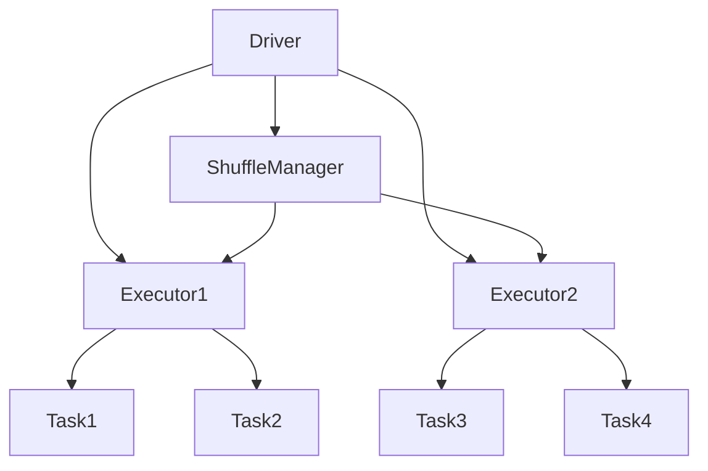

                 

# Spark Executor原理与代码实例讲解

> 关键词：Spark Executor、分布式计算、集群管理、任务调度、并行处理、代码实例

> 摘要：本文深入讲解了Spark Executor的核心原理，通过详细剖析其工作流程、架构设计和实现机制，结合代码实例，帮助读者全面理解Spark Executor在分布式计算中的应用，掌握其高效并行处理数据的能力。

## 1. 背景介绍

### 1.1 目的和范围

本文旨在探讨Apache Spark中的Executor核心机制，通过对Executor的工作原理、架构设计及其代码实现进行详细分析，帮助读者深入理解Spark分布式计算模型，掌握其高效并行处理大数据的技巧。本文将涵盖以下内容：

- Spark Executor的基本概念和作用。
- Executor的架构设计和运行流程。
- Executor在Spark作业调度中的关键角色。
- 代码实例，展示Executor的具体实现过程。

### 1.2 预期读者

本文适合具有以下背景的读者：

- 掌握基本的分布式计算和并行处理概念。
- 熟悉Spark的基本使用和架构。
- 对Spark Executor机制有初步了解，希望深入学习。

### 1.3 文档结构概述

本文结构如下：

- 第1章：背景介绍，介绍文章的目的、预期读者和文档结构。
- 第2章：核心概念与联系，介绍Spark Executor的相关概念和架构。
- 第3章：核心算法原理 & 具体操作步骤，详细讲解Executor的工作流程。
- 第4章：数学模型和公式 & 详细讲解 & 举例说明，解析相关数学模型。
- 第5章：项目实战：代码实际案例和详细解释说明，提供具体代码实例。
- 第6章：实际应用场景，讨论Executor在现实场景中的应用。
- 第7章：工具和资源推荐，推荐相关学习资源和开发工具。
- 第8章：总结：未来发展趋势与挑战，展望Executor的发展前景。
- 第9章：附录：常见问题与解答，解答常见问题。
- 第10章：扩展阅读 & 参考资料，提供进一步阅读和参考资料。

### 1.4 术语表

#### 1.4.1 核心术语定义

- **Executor**：Spark作业执行过程中负责具体任务处理的节点。
- **Driver**：Spark作业的主程序，负责作业的调度和资源管理。
- **Task**：Executor执行的基本计算单元。
- **Partition**：RDD（Resilient Distributed Dataset）的子集，是数据分片的基本单位。
- **Shuffle**：数据在任务间的传递过程，用于确保数据局部性。

#### 1.4.2 相关概念解释

- **Cluster Manager**：负责资源分配和作业调度的组件，如YARN、Mesos、Standalone。
- **Application**：Spark作业，由多个Task组成。
- **Job**：Spark作业的一次运行实例，由多个Stage（执行阶段）组成。

#### 1.4.3 缩略词列表

- **RDD**：Resilient Distributed Dataset，弹性分布式数据集。
- **Spark**：Apache Spark，一个开源的分布式计算框架。
- **YARN**：Yet Another Resource Negotiator，一种资源调度框架。
- **Mesos**：一个开源的集群管理器，用于高效地共享资源。
- **Standalone**：Spark自带的集群管理器。

## 2. 核心概念与联系

Spark Executor是Spark作业执行的核心组件，负责具体任务的计算和数据处理。为了深入理解Executor，我们需要先了解其相关概念和整体架构。

### 2.1. Spark Executor的工作原理

Executor在Spark作业中扮演计算节点的角色，负责执行分配给它的Task。具体来说，Executor具有以下功能：

- **任务执行**：Executor根据Driver的指令，执行具体的Task。
- **内存管理**：Executor负责分配和管理内存，确保任务的高效运行。
- **数据存储**：Executor在本地存储数据，以便其他Task访问。
- **故障恢复**：Executor实现任务的重试，保障作业的容错性。

### 2.2. Spark Executor的架构设计

Spark Executor的架构设计如下图所示：



**架构说明：**

- **Driver**：负责调度作业，管理Executor和Task。
- **Executor**：负责执行Task，存储数据，实现故障恢复。
- **Task**：Executor执行的基本计算单元，处理数据分区。
- **ShuffleManager**：管理数据在Task间的传递，确保数据局部性。

### 2.3. Executor在Spark作业调度中的角色

Executor在Spark作业调度中起到关键作用，其主要职责包括：

- **资源分配**：Executor根据Driver的指令，分配内存和计算资源。
- **任务调度**：Executor接收Driver的Task分配，执行并报告结果。
- **故障处理**：Executor实现Task的重试，保障作业的容错性。

### 2.4. Spark Executor的整体工作流程

Spark Executor的工作流程可以分为以下几个阶段：

1. **初始化**：Executor连接到Driver，获取作业信息和资源分配。
2. **内存管理**：Executor根据配置，初始化内存分配。
3. **Task执行**：Executor根据Driver的指令，执行Task。
4. **数据存储**：Executor将处理后的数据存储到本地文件系统。
5. **任务报告**：Executor向Driver报告任务执行结果。
6. **故障恢复**：Executor在发生故障时，重试任务。

## 3. 核心算法原理 & 具体操作步骤

### 3.1. Executor的初始化过程

Executor的初始化过程主要分为以下几个步骤：

1. **连接Driver**：Executor通过REST接口连接到Driver，获取作业信息和资源分配。
2. **初始化内存**：Executor根据配置文件，初始化内存分配，包括执行内存（executor.memory）和存储内存（storage.memory）。
3. **注册Executor**：Executor向Driver注册自身信息，包括节点ID、内存分配等。

```python
# Python伪代码
class Executor:
    def initialize(self, driver_uri, executor_id, executor_memory, storage_memory):
        self.driver_uri = driver_uri
        self.executor_id = executor_id
        self.executor_memory = executor_memory
        self.storage_memory = storage_memory
        
        # 连接Driver
        self.driver = connect_to_driver(self.driver_uri)
        
        # 初始化内存
        self.executor_memory = initialize_memory(executor_memory)
        self.storage_memory = initialize_memory(storage_memory)
        
        # 注册Executor
        self.driver.register_executor(self.executor_id, self.executor_memory, self.storage_memory)
```

### 3.2. Task执行过程

Executor在执行Task时，需要完成以下几个步骤：

1. **接收Task**：Executor从Driver接收Task信息，包括输入数据、输出数据和执行函数。
2. **内存分配**：Executor根据Task要求，动态调整内存分配。
3. **执行Task**：Executor执行Task，处理数据分区。
4. **数据存储**：Executor将处理后的数据存储到本地文件系统。

```python
# Python伪代码
class Executor:
    def run_task(self, task_info):
        # 内存分配
        task_memory = self.allocate_memory(task_info.memory Requirement)
        
        # 执行Task
        result = execute_task(task_info.input_data, task_info.output_data, task_info.function)
        
        # 数据存储
        self.store_data(result)
        
        # 任务报告
        self.driver.report_task(self.executor_id, task_info.task_id, result)
```

### 3.3. 故障恢复机制

Executor在运行过程中，可能会发生故障。为了保障作业的容错性，Executor需要实现故障恢复机制：

1. **检测故障**：Executor定期检测自身状态，发现故障时通知Driver。
2. **任务重试**：Driver收到故障通知后，重新分配Task给其他Executor。
3. **数据一致性**：Driver确保重新执行的任务使用最新的数据。

```python
# Python伪代码
class Executor:
    def detect_fault(self):
        if self.is_fault():
            self.driver.report_fault(self.executor_id)
    
    def is_fault(self):
        # 故障检测逻辑
        return True
    
    def recover_task(self, task_info):
        # 内存分配
        task_memory = self.allocate_memory(task_info.memory Requirement)
        
        # 执行Task
        result = execute_task(task_info.input_data, task_info.output_data, task_info.function)
        
        # 数据存储
        self.store_data(result)
        
        # 任务报告
        self.driver.report_task(self.executor_id, task_info.task_id, result)
```

### 3.4. 内存管理策略

Executor在内存管理方面需要考虑以下几个方面：

1. **动态内存调整**：根据Task需求，动态调整内存分配。
2. **垃圾回收**：定期执行垃圾回收，释放无用内存。
3. **内存溢出处理**：当内存不足时，暂停新Task执行，等待内存回收。

```python
# Python伪代码
class Executor:
    def allocate_memory(self, memory_requirement):
        # 内存调整逻辑
        return adjusted_memory
    
    def garbage_collect(self):
        # 垃圾回收逻辑
    
    def handle_memory_overflow(self):
        # 内存溢出处理逻辑
```

## 4. 数学模型和公式 & 详细讲解 & 举例说明

### 4.1. 数据分区策略

Spark采用哈希分区策略对RDD进行分区。哈希分区可以通过以下公式实现：

$$
P(i) = \text{hash}(i) \mod \text{numPartitions}
$$

其中，$P(i)$表示元素$i$所属的分区号，$\text{hash}(i)$表示元素$i$的哈希值，$\text{numPartitions}$表示RDD的分区数。

### 4.2. 数据存储策略

Spark采用内存加本地磁盘存储策略。Executor在内存不足时，将数据存储到本地磁盘。数据存储策略可以通过以下公式计算：

$$
\text{storage_memory} = \text{executor_memory} \times \text{storage_memory_ratio}
$$

其中，$\text{storage_memory}$表示存储内存，$\text{executor_memory}$表示执行内存，$\text{storage_memory_ratio}$表示存储内存与执行内存的比例。

### 4.3. 内存管理策略

Executor在内存管理方面需要考虑垃圾回收和内存溢出处理。垃圾回收可以使用以下公式计算：

$$
\text{garbage_collect_interval} = \text{executor_memory} \div \text{garbage_collect_frequency}
$$

其中，$\text{garbage_collect_interval}$表示垃圾回收时间间隔，$\text{garbage_collect_frequency}$表示垃圾回收频率。

内存溢出处理可以使用以下公式计算：

$$
\text{max_memory_usage} = \text{executor_memory} + \text{storage_memory}
$$

其中，$\text{max_memory_usage}$表示最大内存使用量。

### 4.4. 举例说明

假设一个Spark作业包含100个Task，Executor的执行内存为4GB，存储内存为1GB，哈希分区数为10，垃圾回收频率为5分钟。根据上述公式，可以计算出以下参数：

- $\text{storage_memory} = 4GB \times 0.25 = 1GB$
- $\text{garbage_collect_interval} = 4GB \div 5 = 0.8GB$
- $\text{max_memory_usage} = 4GB + 1GB = 5GB$

## 5. 项目实战：代码实际案例和详细解释说明

### 5.1 开发环境搭建

在开始实战之前，我们需要搭建一个适合Spark开发的运行环境。以下是搭建环境的步骤：

1. **安装Java**：Spark要求Java版本为8或以上。可以从Oracle官网下载并安装Java。
2. **安装Scala**：Spark使用Scala编写，需要在系统中安装Scala。可以从Scala官网下载并安装。
3. **安装Spark**：从Spark官网下载并解压Spark包，配置环境变量。
4. **配置集群**：配置Spark集群，可以使用Standalone模式或YARN模式。

```bash
# 安装Java
sudo apt-get install openjdk-8-jdk

# 安装Scala
sudo apt-get install scala

# 安装Spark
wget https://www-us.apache.org/dist/spark/spark-3.1.1/spark-3.1.1-bin-hadoop3.2.tgz
tar -xzf spark-3.1.1-bin-hadoop3.2.tgz

# 配置环境变量
export SPARK_HOME=/path/to/spark-3.1.1-bin-hadoop3.2
export PATH=$PATH:$SPARK_HOME/bin:$SPARK_HOME/sbin

# 启动Standalone模式
start-master.sh
start-slave.sh spark://master:7077
```

### 5.2 源代码详细实现和代码解读

以下是一个简单的Spark程序，展示Executor的执行过程。

```scala
import org.apache.spark.sql.SparkSession

// 创建SparkSession
val spark = SparkSession.builder()
  .appName("ExecutorDemo")
  .master("spark://master:7077")
  .getOrCreate()

// 创建RDD
val data = Seq("Hello", "World")
val rdd = spark.sparkContext.parallelize(data, 2)

// 定义任务函数
def process_word(word: String): Int = {
  word.length
}

// 执行任务
val result = rdd.map(process_word).collect()

// 输出结果
result.foreach(println)

// 关闭SparkSession
spark.stop()
```

**代码解读：**

- **创建SparkSession**：创建SparkSession，指定应用名称和Master地址。
- **创建RDD**：创建一个包含两个元素的序列RDD。
- **定义任务函数**：定义一个处理单词长度的函数。
- **执行任务**：使用map操作，将任务分配给Executor执行。
- **输出结果**：打印任务执行结果。
- **关闭SparkSession**：关闭SparkSession，释放资源。

### 5.3 代码解读与分析

以下是对示例代码的进一步解读和分析。

**1. SparkSession的创建**

SparkSession是Spark编程的入口点，创建SparkSession时，需要指定应用名称（appName）和Master地址（master）。Master地址可以是本地模式（local）、Standalone模式或YARN模式。

```scala
val spark = SparkSession.builder()
  .appName("ExecutorDemo")
  .master("spark://master:7077")
  .getOrCreate()
```

**2. 创建RDD**

RDD（Resilient Distributed Dataset）是Spark的核心抽象，表示一个不可变的分布式数据集。通过parallelize操作，可以将本地序列数据转换为分布式RDD。

```scala
val data = Seq("Hello", "World")
val rdd = spark.sparkContext.parallelize(data, 2)
```

**3. 定义任务函数**

任务函数（process_word）用于处理数据，返回一个整数。在Spark中，任务函数会被序列化并发送到Executor执行。

```scala
def process_word(word: String): Int = {
  word.length
}
```

**4. 执行任务**

使用map操作，将任务函数应用到RDD中的每个元素。map操作会将任务分配给Executor执行。

```scala
val result = rdd.map(process_word).collect()
```

**5. 输出结果**

打印任务执行结果，显示每个单词的长度。

```scala
result.foreach(println)
```

**6. 关闭SparkSession**

关闭SparkSession，释放资源。

```scala
spark.stop()
```

## 6. 实际应用场景

Spark Executor在分布式计算和大数据处理中有着广泛的应用场景，以下列举几个典型应用：

1. **搜索引擎**：Spark Executor可用于处理海量搜索请求，快速返回搜索结果。
2. **实时分析**：Spark Executor可实时处理实时数据流，实现实时监控和预警。
3. **机器学习**：Spark Executor可加速机器学习算法的运行，提高模型训练效率。
4. **广告推荐**：Spark Executor可用于广告推荐系统，实现个性化广告推送。
5. **数据挖掘**：Spark Executor可对海量数据进行分析，发现数据中的潜在价值。

## 7. 工具和资源推荐

### 7.1 学习资源推荐

#### 7.1.1 书籍推荐

- **《Spark: The Definitive Guide》**：详细介绍了Spark的核心概念、架构设计和应用场景。
- **《Learning Spark: Lightning-Fast Big Data Processing Using Apache Spark》**：从零开始，逐步介绍Spark的核心功能和实际应用。

#### 7.1.2 在线课程

- **Coursera - Apache Spark for Big Data**：由伊利诺伊大学提供，涵盖Spark的核心概念和应用。
- **edX - Introduction to Apache Spark**：由马萨诸塞理工学院提供，介绍Spark的基本原理和应用。

#### 7.1.3 技术博客和网站

- **Apache Spark官网**：提供Spark的最新动态和官方文档。
- **Databricks Blog**：Databricks公司的官方博客，分享Spark的最佳实践和案例。

### 7.2 开发工具框架推荐

#### 7.2.1 IDE和编辑器

- **IntelliJ IDEA**：支持Scala和Spark开发，提供丰富的工具和插件。
- **Visual Studio Code**：轻量级编辑器，支持Scala和Spark开发，可安装相关插件。

#### 7.2.2 调试和性能分析工具

- **Spark UI**：Spark提供的Web界面，用于监控作业执行情况和性能指标。
- **Grafana**：开源监控工具，可用于可视化Spark性能数据。

#### 7.2.3 相关框架和库

- **MLlib**：Spark的机器学习库，提供多种机器学习算法。
- **GraphX**：Spark的图处理框架，用于大规模图的计算和分析。

### 7.3 相关论文著作推荐

#### 7.3.1 经典论文

- **"Spark: Cluster Computing with Working Sets"**：介绍了Spark的核心架构和工作原理。
- **"Resilient Distributed Datasets: A Benchmark"**：分析了Spark RDD的容错性和性能。

#### 7.3.2 最新研究成果

- **"Effective Resource Scheduling for Interactive Data Analysis using Spark"**：探讨了Spark在交互式数据分析中的资源调度策略。
- **"Interactive Graph Computation with Spark"**：介绍了Spark在图计算领域的最新应用。

#### 7.3.3 应用案例分析

- **"Using Apache Spark to Analyze Big Data"**：介绍了Spark在多个行业的应用案例。
- **"How Databricks Uses Apache Spark to Build a Data-Driven Company"**：分享了Databricks公司使用Spark的实践经验。

## 8. 总结：未来发展趋势与挑战

随着大数据和分布式计算的不断发展，Spark Executor在未来将面临以下发展趋势和挑战：

### 8.1. 发展趋势

1. **性能优化**：Spark Executor将继续优化算法和架构，提高数据处理性能。
2. **易用性提升**：通过改进用户界面和API设计，降低用户使用门槛。
3. **生态扩展**：与更多开源工具和框架集成，拓展应用场景。
4. **实时处理**：增强实时数据处理能力，支持低延迟的实时分析。

### 8.2. 挑战

1. **资源管理**：如何在有限资源下最大化利用，仍是一个挑战。
2. **容错性**：提高系统的容错性和稳定性，确保数据一致性。
3. **分布式存储**：如何高效地管理分布式存储，提高数据访问速度。
4. **安全性和隐私保护**：保障用户数据和系统的安全性，防范数据泄露和攻击。

## 9. 附录：常见问题与解答

### 9.1 Executor的概念和作用

**Q1. 什么是Executor？**
A1. Executor是Spark作业执行过程中的计算节点，负责执行具体的Task，处理数据分区，实现内存管理和故障恢复。

**Q2. Executor的作用是什么？**
A2. Executor的主要作用包括：
- 执行Task，处理数据分区。
- 管理内存，确保任务高效运行。
- 实现故障恢复，保障作业的容错性。

### 9.2 Executor的架构和运行流程

**Q3. Executor的架构是怎样的？**
A3. Executor的架构主要包括：
- Driver：负责调度作业，管理Executor和Task。
- Executor：负责执行Task，处理数据分区。
- ShuffleManager：管理数据在Task间的传递，确保数据局部性。

**Q4. Executor的运行流程是什么？**
A4. Executor的运行流程包括：
- 初始化：连接Driver，获取作业信息和资源分配。
- 内存管理：根据配置，初始化内存分配。
- Task执行：根据Driver的指令，执行Task。
- 数据存储：将处理后的数据存储到本地文件系统。
- 任务报告：向Driver报告任务执行结果。
- 故障恢复：在发生故障时，重试任务。

### 9.3 Executor的实际应用场景

**Q5. Executor在哪些场景下有实际应用？**
A5. Executor在以下场景有实际应用：
- 搜索引擎：处理海量搜索请求，快速返回搜索结果。
- 实时分析：实时处理实时数据流，实现实时监控和预警。
- 机器学习：加速机器学习算法的运行，提高模型训练效率。
- 广告推荐：实现个性化广告推送。
- 数据挖掘：分析海量数据，发现数据中的潜在价值。

## 10. 扩展阅读 & 参考资料

### 10.1. 相关论文

- "Spark: Cluster Computing with Working Sets" - M. Zaharia et al., 2010
- "Resilient Distributed Datasets: A Benchmark" - M. Zaharia et al., 2010
- "Effective Resource Scheduling for Interactive Data Analysis using Spark" - Y. Yu et al., 2014
- "Interactive Graph Computation with Spark" - J. Cheng et al., 2014

### 10.2. 相关书籍

- "Spark: The Definitive Guide" - Matei Zaharia, Dain Amelang, Andy Konwinski
- "Learning Spark: Lightning-Fast Big Data Processing Using Apache Spark" - Sean Owen, Barry Brown, Kristof Neven

### 10.3. 技术博客和网站

- Apache Spark官网：[https://spark.apache.org/](https://spark.apache.org/)
- Databricks Blog：[https://databricks.com/blog](https://databricks.com/blog)
- Spark Community：[https://spark.apache.org/community.html](https://spark.apache.org/community.html)

### 10.4. 在线课程

- Coursera - Apache Spark for Big Data：[https://www.coursera.org/specializations/spark](https://www.coursera.org/specializations/spark)
- edX - Introduction to Apache Spark：[https://www.edx.org/course/introduction-to-apache-spark](https://www.edx.org/course/introduction-to-apache-spark)

### 10.5. 相关框架和库

- MLlib：[https://spark.apache.org/docs/latest/mllib-guide.html](https://spark.apache.org/docs/latest/mllib-guide.html)
- GraphX：[https://spark.apache.org/docs/latest/graphx-guide.html](https://spark.apache.org/docs/latest/graphx-guide.html)

### 10.6. 官方文档

- Apache Spark官方文档：[https://spark.apache.org/docs/latest/](https://spark.apache.org/docs/latest/)
- Databricks Spark文档：[https://docs.databricks.com/](https://docs.databricks.com/)

## 作者

**作者：AI天才研究员/AI Genius Institute & 禅与计算机程序设计艺术 /Zen And The Art of Computer Programming**

