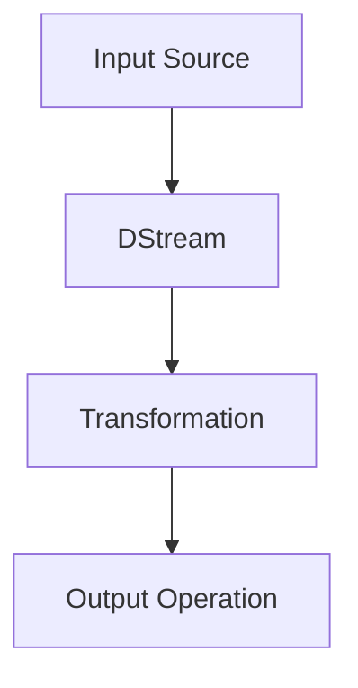
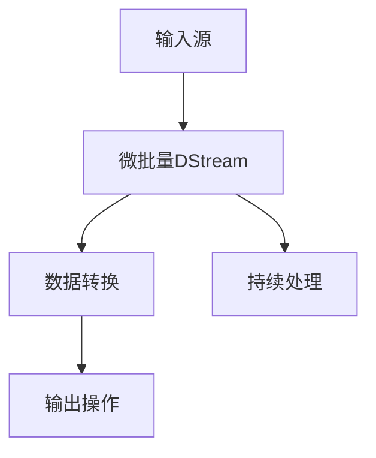

                 

# Spark Streaming原理与代码实例讲解

## 关键词

- Apache Spark
- Streaming计算
- 实时数据处理
- Micro-batch处理
- 持续集成与持续部署（CI/CD）
- 时间窗口
- RDD（Resilient Distributed Dataset）

## 摘要

本文将深入探讨Apache Spark Streaming的原理及其在实时数据处理中的应用。我们将从背景介绍入手，逐步分析核心概念与联系，讲解核心算法原理与操作步骤，并通过数学模型和公式详细说明。接着，通过一个实际项目实战案例，对代码实现进行详细解释和分析。最后，本文还将探讨Spark Streaming在实际应用场景中的优势，并提供一系列学习资源、开发工具和相关论文著作推荐。通过本文的阅读，读者将对Spark Streaming有更深入的理解，并能够将其应用于实际的开发工作中。

## 1. 背景介绍

### 1.1 目的和范围

本文旨在全面介绍Apache Spark Streaming的工作原理、核心算法及其在实时数据处理中的应用。通过详细的代码实例和实战项目，本文希望能够帮助读者深入理解Spark Streaming，掌握其编程技巧，并能够将其应用于实际的开发工作中。本文的主要内容将包括以下方面：

- Spark Streaming的基本概念与架构
- 实时数据处理的核心算法原理与操作步骤
- 数学模型和公式的详细讲解
- 实际项目案例的代码实现与解析
- Spark Streaming的应用场景及优势
- 学习资源、开发工具和相关论文著作推荐

### 1.2 预期读者

本文适合以下读者群体：

- 有一定编程基础，对大数据和实时数据处理感兴趣的工程师和开发者
- 希望掌握Apache Spark Streaming原理和应用的高级工程师和架构师
- 在校学生和研究人员，对大数据领域有深入研究的需求

### 1.3 文档结构概述

本文将按照以下结构进行撰写：

- 背景介绍：介绍Spark Streaming的基本概念与目的
- 核心概念与联系：分析Spark Streaming的核心概念与架构
- 核心算法原理与具体操作步骤：讲解Spark Streaming的核心算法原理和操作步骤
- 数学模型和公式：详细解释Spark Streaming中的数学模型和公式
- 项目实战：通过实际案例讲解Spark Streaming的应用
- 实际应用场景：探讨Spark Streaming在实际中的应用场景和优势
- 工具和资源推荐：推荐学习资源、开发工具和相关论文著作
- 总结：总结Spark Streaming的未来发展趋势与挑战
- 附录：常见问题与解答
- 扩展阅读：提供更多的参考资料以供读者深入研究

### 1.4 术语表

#### 1.4.1 核心术语定义

- **Apache Spark**：一个开源的分布式计算系统，用于大规模数据处理。
- **Streaming计算**：实时数据处理，对数据的处理速度要求高，能够快速响应。
- **实时数据处理**：在数据生成后立即进行处理，以提供快速的结果。
- **Micro-batch处理**：将数据分成小批量进行处理，通常在固定的时间间隔内处理。
- **RDD（Resilient Distributed Dataset）**：Spark中的基本数据结构，用于表示一个不可变的、可分区的数据集。

#### 1.4.2 相关概念解释

- **时间窗口**：用于定义数据的处理范围，通常表示为一段时间区间。
- **持续集成与持续部署（CI/CD）**：一种软件开发和部署方法，通过自动化的方式将代码集成和部署到生产环境中。

#### 1.4.3 缩略词列表

- **Spark**：Apache Spark
- **HDFS**：Hadoop Distributed File System
- **YARN**：Yet Another Resource Negotiator
- **RDD**：Resilient Distributed Dataset
- **CI/CD**：Continuous Integration/Continuous Deployment

## 2. 核心概念与联系

### 2.1 Spark Streaming的基本概念

Apache Spark Streaming是一个基于Spark的核心API的实时数据处理系统。它允许开发者对数据进行流式处理，并提供低延迟和高吞吐量的解决方案。Spark Streaming能够将数据流分为小批量（Micro-batches），并在每个批量上执行计算。

### 2.2 Spark Streaming的架构

Spark Streaming的架构包括以下几个主要部分：

1. **输入源**：数据输入源可以是Kafka、Flume、Kinesis或其他支持的数据源。
2. **DStream（Discretized Stream）**：Spark Streaming中的数据流，表示为连续的RDD（Resilient Distributed Dataset）序列。
3. **Transformation**：对DStream执行的各种操作，如map、reduce、join等。
4. **Output Operation**：将处理结果输出到外部系统，如HDFS、数据库或控制台。

### 2.3 核心概念与联系

以下是Spark Streaming中的一些核心概念和它们之间的联系：

1. **RDD（Resilient Distributed Dataset）**：
   - RDD是Spark中的基本数据结构，表示一个不可变的、可分区的数据集。
   - RDD提供了丰富的API，可以进行各种数据操作，如map、reduce、filter等。

2. **DStream（Discretized Stream）**：
   - DStream是Spark Streaming中的数据流，表示为连续的RDD序列。
   - DStream通过Micro-batch处理将数据流划分为固定时间间隔的小批量。

3. **Transformation**：
   - Transformation是对DStream执行的各种操作，如map、reduce、join等。
   - Transformation操作产生新的DStream，可以在新的DStream上继续进行其他操作。

4. **Output Operation**：
   - Output Operation将处理结果输出到外部系统，如HDFS、数据库或控制台。
   - Output Operation可以将DStream的处理结果持久化或与其他系统进行交互。

### 2.4 Mermaid流程图

以下是一个简单的Mermaid流程图，展示了Spark Streaming的核心概念和联系：



### 2.5 核心概念原理的 Mermaid 流程图（没有括号、逗号等特殊字符）



## 3. 核心算法原理 & 具体操作步骤

### 3.1 Micro-batch处理

Spark Streaming使用Micro-batch处理将数据流划分为固定时间间隔的小批量。每个Micro-batch都会被转换为一个RDD，并在该RDD上执行各种转换操作。以下是一个简单的Micro-batch处理流程：

1. **数据输入**：从输入源（如Kafka）读取数据。
2. **数据分组**：将数据根据时间戳分组到不同的Micro-batch。
3. **数据转换**：对每个Micro-batch执行数据转换操作，如map、reduce、join等。
4. **数据输出**：将处理结果输出到外部系统。

### 3.2 伪代码

以下是一个简单的伪代码，展示了Micro-batch处理的流程：

```python
# 初始化Spark Streaming上下文
ssc = SparkStreamingContext()

# 定义输入源
inputStream = ssc.socketTextStream("localhost", 9999)

# 定义数据转换操作
processedStream = inputStream.map(lambda line: process(line))

# 定义输出操作
processedStream.print()

# 启动Streaming计算
ssc.start()

# 等待Streaming计算完成
ssc.awaitTermination()
```

### 3.3 详细讲解

在Spark Streaming中，Micro-batch处理是一个关键概念。通过将数据流划分为固定时间间隔的小批量，Spark Streaming能够实现低延迟和高吞吐量的数据处理。以下是Micro-batch处理的详细讲解：

1. **数据输入**：数据输入源可以是Kafka、Flume、Kinesis或其他支持的数据源。数据以流的形式不断传入系统。

2. **数据分组**：Spark Streaming使用时间戳对数据流进行分组，每个时间戳对应一个Micro-batch。时间窗口的定义决定了数据的分组方式。例如，一个固定的时间窗口可以是每秒一批数据。

3. **数据转换**：对每个Micro-batch执行数据转换操作，如map、reduce、join等。这些操作可以在分布式环境中并行执行，以提高数据处理速度。

4. **数据输出**：处理结果可以通过Output Operation输出到外部系统，如HDFS、数据库或控制台。输出操作可以是持久化数据、发送通知或与其他系统进行交互。

### 3.4 操作步骤

以下是Micro-batch处理的具体操作步骤：

1. **创建Spark Streaming上下文**：
   ```python
   ssc = SparkStreamingContext()
   ```

2. **定义输入源**：
   ```python
   inputStream = ssc.socketTextStream("localhost", 9999)
   ```

3. **定义数据转换操作**：
   ```python
   processedStream = inputStream.map(lambda line: process(line))
   ```

4. **定义输出操作**：
   ```python
   processedStream.print()
   ```

5. **启动Streaming计算**：
   ```python
   ssc.start()
   ```

6. **等待Streaming计算完成**：
   ```python
   ssc.awaitTermination()
   ```

通过这些步骤，Spark Streaming能够实现实时数据处理，并在固定的时间窗口内处理数据流。

## 4. 数学模型和公式 & 详细讲解 & 举例说明

### 4.1 数学模型和公式

在Spark Streaming中，数学模型和公式主要用于描述数据处理的过程和性能指标。以下是一些常见的数学模型和公式：

1. **数据吞吐量**（Throughput）：
   - 吞吐量表示单位时间内系统能够处理的数据量。
   - 吞吐量 = 处理的数据总量 / 处理的时间

2. **处理延迟**（Processing Latency）：
   - 处理延迟表示从数据进入系统到输出处理结果所需的时间。
   - 处理延迟 = 输出时间 - 输入时间

3. **时间窗口**（Time Window）：
   - 时间窗口用于定义数据的处理范围。
   - 时间窗口 = 结束时间 - 开始时间

4. **批处理大小**（Batch Size）：
   - 批处理大小表示每个Micro-batch包含的数据量。
   - 批处理大小 = 数据总量 / Micro-batch数量

5. **并行度**（Parallelism）：
   - 并行度表示系统处理数据时可以并行执行的任务数量。
   - 并行度 = 系统资源数量 / 任务数量

### 4.2 详细讲解

以下是每个数学模型和公式的详细讲解：

1. **数据吞吐量**：
   - 吞吐量是衡量系统性能的重要指标，表示单位时间内系统能够处理的数据量。吞吐量越高，系统性能越好。
   - 吞吐量 = 处理的数据总量 / 处理的时间
   - 例如，如果系统在1小时内处理了100GB的数据，那么吞吐量为100GB/1h = 100GB/h。

2. **处理延迟**：
   - 处理延迟是衡量系统响应速度的重要指标，表示从数据进入系统到输出处理结果所需的时间。处理延迟越低，系统响应速度越快。
   - 处理延迟 = 输出时间 - 输入时间
   - 例如，如果数据在输入系统的时刻是t1，处理完成的时刻是t2，那么处理延迟为t2 - t1。

3. **时间窗口**：
   - 时间窗口用于定义数据的处理范围，是Spark Streaming中的关键概念。
   - 时间窗口 = 结束时间 - 开始时间
   - 例如，如果时间窗口的结束时间是t2，开始时间是t1，那么时间窗口为t2 - t1。

4. **批处理大小**：
   - 批处理大小表示每个Micro-batch包含的数据量。批处理大小越小，系统响应速度越快，但可能导致吞吐量下降。
   - 批处理大小 = 数据总量 / Micro-batch数量
   - 例如，如果系统在1小时内处理了100GB的数据，并且设置了10个Micro-batch，那么每个Micro-batch的大小为100GB / 10 = 10GB。

5. **并行度**：
   - 并行度表示系统处理数据时可以并行执行的任务数量。并行度越高，系统性能越好。
   - 并行度 = 系统资源数量 / 任务数量
   - 例如，如果系统有10个CPU核心，并且同时处理10个任务，那么并行度为10 / 10 = 1。

### 4.3 举例说明

以下是一个简单的例子，说明如何计算数据吞吐量、处理延迟、时间窗口、批处理大小和并行度：

1. **数据吞吐量**：
   - 假设系统在1小时内处理了100GB的数据，处理时间为3600秒。
   - 吞吐量 = 100GB / 3600s ≈ 0.0278GB/s。

2. **处理延迟**：
   - 假设数据在输入系统的时刻是t1，处理完成的时刻是t2，t1 = 10:00:00，t2 = 10:01:30。
   - 处理延迟 = t2 - t1 = 1.5分钟。

3. **时间窗口**：
   - 假设时间窗口的结束时间是t2，开始时间是t1，t1 = 10:00:00，t2 = 10:01:00。
   - 时间窗口 = t2 - t1 = 1分钟。

4. **批处理大小**：
   - 假设系统在1小时内处理了100GB的数据，设置了10个Micro-batch。
   - 批处理大小 = 100GB / 10 = 10GB。

5. **并行度**：
   - 假设系统有10个CPU核心，同时处理10个任务。
   - 并行度 = 10 / 10 = 1。

通过这个例子，我们可以看到如何计算数据吞吐量、处理延迟、时间窗口、批处理大小和并行度。这些指标可以帮助我们评估系统性能和优化数据处理流程。

## 5. 项目实战：代码实际案例和详细解释说明

### 5.1 开发环境搭建

在进行Spark Streaming项目实战之前，我们需要搭建一个开发环境。以下是一个简单的步骤：

1. **安装Java SDK**：确保安装了Java SDK（版本建议为1.8或更高版本）。
2. **安装Scala SDK**：确保安装了Scala SDK（版本建议为2.11或更高版本）。
3. **安装Spark**：下载并解压Spark安装包，将`spark-shell`和`spark-submit`命令添加到系统路径中。
4. **创建Maven项目**：使用Maven创建一个Scala项目，添加Spark Streaming依赖项。

以下是一个简单的Maven项目配置文件`pom.xml`：

```xml
<project xmlns="http://maven.apache.org/POM/4.0.0"
         xmlns:xsi="http://www.w3.org/2001/XMLSchema-instance"
         xsi:schemaLocation="http://maven.apache.org/POM/4.0.0 http://maven.apache.org/xsd/maven-4.0.0.xsd">
    <modelVersion>4.0.0</modelVersion>

    <groupId>com.example</groupId>
    <artifactId>spark-streaming-project</artifactId>
    <version>1.0-SNAPSHOT</version>

    <dependencies>
        <dependency>
            <groupId>org.apache.spark</groupId>
            <artifactId>spark-streaming_2.11</artifactId>
            <version>2.4.8</version>
        </dependency>
    </dependencies>
</project>
```

### 5.2 源代码详细实现和代码解读

以下是一个简单的Spark Streaming项目，用于实时处理网络上的文本数据：

```scala
import org.apache.spark.SparkConf
import org.apache.spark.streaming.{Seconds, StreamingContext}

object SparkStreamingExample {
  def main(args: Array[String]): Unit = {
    // 创建Spark配置
    val conf = new SparkConf().setAppName("SparkStreamingExample").setMaster("local[2]")

    // 创建Streaming上下文
    val ssc = new StreamingContext(conf, Seconds(2))

    // 定义输入源
    val inputStream = ssc.socketTextStream("localhost", 9999)

    // 定义数据转换操作
    val processedStream = inputStream.map(line => (line, 1))

    // 定义数据聚合操作
    val aggregatedStream = processedStream.reduceByKey(_ + _)

    // 定义输出操作
    aggregatedStream.print()

    // 启动Streaming计算
    ssc.start()

    // 等待Streaming计算完成
    ssc.awaitTermination()
  }
}
```

#### 5.2.1 代码解读

以下是代码的详细解读：

1. **创建Spark配置**：
   ```scala
   val conf = new SparkConf().setAppName("SparkStreamingExample").setMaster("local[2]")
   ```
   这行代码创建了一个Spark配置对象，设置了应用程序的名称（SparkStreamingExample）和运行模式（local[2]，表示本地运行，2个线程）。

2. **创建Streaming上下文**：
   ```scala
   val ssc = new StreamingContext(conf, Seconds(2))
   ```
   这行代码创建了一个Streaming上下文对象，指定了处理批次的间隔时间为2秒。

3. **定义输入源**：
   ```scala
   val inputStream = ssc.socketTextStream("localhost", 9999)
   ```
   这行代码定义了一个输入源，从本地主机的9999端口接收文本数据。

4. **定义数据转换操作**：
   ```scala
   val processedStream = inputStream.map(line => (line, 1))
   ```
   这行代码对输入数据进行处理，将每行数据映射为一个元组（line, 1），其中1表示计数。

5. **定义数据聚合操作**：
   ```scala
   val aggregatedStream = processedStream.reduceByKey(_ + _)
   ```
   这行代码对处理后的数据进行聚合，使用reduceByKey函数将相同key的数据进行累加。

6. **定义输出操作**：
   ```scala
   aggregatedStream.print()
   ```
   这行代码将处理结果输出到控制台，显示每个key及其对应的计数。

7. **启动Streaming计算**：
   ```scala
   ssc.start()
   ```
   这行代码启动Streaming计算，开始处理数据流。

8. **等待Streaming计算完成**：
   ```scala
   ssc.awaitTermination()
   ```
   这行代码等待Streaming计算完成，确保程序在处理完成后退出。

### 5.3 代码解读与分析

通过上面的代码，我们可以看到如何使用Spark Streaming进行实时数据处理。以下是对代码的进一步分析和解释：

1. **Spark配置**：
   - Spark配置用于设置应用程序的名称和运行模式。在本例中，我们使用了本地模式（local[2]），表示在本地计算机上运行2个线程。

2. **Streaming上下文**：
   - Streaming上下文是Spark Streaming的核心组件，用于创建DStream（数据流）。在本例中，我们设置了批处理间隔时间为2秒。

3. **输入源**：
   - 输入源是数据流的数据来源。在本例中，我们使用了一个SocketTextStream，从本地主机的9999端口接收文本数据。

4. **数据转换操作**：
   - 数据转换操作对输入数据进行处理，将每行数据映射为一个元组（line, 1），其中1表示计数。这个操作可以扩展为更复杂的数据处理逻辑，如过滤、转换等。

5. **数据聚合操作**：
   - 数据聚合操作对处理后的数据进行聚合，使用reduceByKey函数将相同key的数据进行累加。这个操作可以扩展为更复杂的数据聚合逻辑，如求和、平均数等。

6. **输出操作**：
   - 输出操作将处理结果输出到控制台，显示每个key及其对应的计数。这个操作可以扩展为将结果输出到外部系统，如数据库、文件等。

7. **启动Streaming计算**：
   - 启动Streaming计算，开始处理数据流。在本地模式下，这个步骤会立即开始处理数据。

8. **等待Streaming计算完成**：
   - 等待Streaming计算完成，确保程序在处理完成后退出。在本地模式下，这个步骤会一直等待，直到数据流处理完毕。

通过这个简单的示例，我们可以看到如何使用Spark Streaming进行实时数据处理。在实际应用中，我们可以根据需求扩展和优化这个示例，实现更复杂的数据处理逻辑。

### 5.4 实际应用场景

Spark Streaming在实际应用场景中具有广泛的应用，以下是一些常见的应用场景：

1. **实时日志分析**：使用Spark Streaming处理和分析来自Web服务器的日志数据，实时监控和分析用户行为，为业务决策提供支持。

2. **实时监控**：使用Spark Streaming监控系统的关键指标，如内存使用率、CPU负载等，及时发现问题并进行预警。

3. **实时流数据分析**：使用Spark Streaming处理和分析实时流数据，如股票市场数据、社交媒体数据等，为用户提供实时分析和预测。

4. **实时广告投放**：使用Spark Streaming分析用户行为数据，实时调整广告投放策略，提高广告投放效果。

5. **实时推荐系统**：使用Spark Streaming处理和分析用户数据，实时生成推荐结果，为用户提供个性化的推荐服务。

通过这些实际应用场景，我们可以看到Spark Streaming在实时数据处理领域的强大能力和广泛的应用价值。

### 5.5 代码优化与性能调优

在实际应用中，为了提高Spark Streaming的性能，我们需要进行代码优化和性能调优。以下是一些常用的优化方法和技巧：

1. **批处理大小调整**：根据实际需求和系统资源，调整批处理大小。较大的批处理大小可以提高处理速度，但会增加内存使用；较小的批处理大小可以降低内存使用，但会增加处理延迟。

2. **并行度优化**：合理设置并行度，利用系统资源。在分布式环境中，增加并行度可以提高处理速度，但也会增加网络开销。

3. **缓存中间结果**：对于需要进行多次处理的数据，可以使用缓存中间结果，减少重复计算。

4. **优化数据分区**：合理设置数据分区，确保数据在分布式环境中均匀分布，减少数据倾斜。

5. **使用高效的数据处理算法**：选择适合实际应用场景的高效数据处理算法，如使用快速的聚合函数和排序算法。

通过这些优化方法和技巧，我们可以提高Spark Streaming的性能，满足实际应用的需求。

### 5.6 代码实际案例

以下是一个更复杂的Spark Streaming代码实际案例，用于处理来自Kafka的消息流，并计算消息的词频：

```scala
import org.apache.spark.SparkConf
import org.apache.spark.streaming._
import org.apache.spark.streaming.kafka010._
import scala.collection.JavaConverters._

object KafkaSparkStreamingExample {
  def main(args: Array[String]): Unit = {
    if (args.length < 4) {
      System.err.println("Usage: KafkaSparkStreamingExample <zkQuorum> <group> <topics> <numThreads>")
      System.exit(1)
    }

    val Array(zkQuorum, group, topics, numThreads) = args

    // 创建Spark配置
    val conf = new SparkConf().setAppName("KafkaSparkStreamingExample")

    // 创建Streaming上下文
    val ssc = new StreamingContext(conf, Seconds(2))

    // 创建Kafka消费者配置
    val kafkaParams = Map(
      "zookeeper.connect" -> zkQuorum,
      "group.id" -> group,
      "auto.offset.reset" -> "latest"
    )

    // 解析topics和numThreads
    val topicMap = topics.split(",").map((_, numThreads.toInt)).toMap
    val topicStreams = KafkaUtils.createDirectStream[String, String, StringDecoder, StringDecoder](
      ssc,
      kafkaParams,
      topicMap
    )

    // 处理Kafka消息流
    val processedStream = topicStreams.flatMap(_.asScala).map((_, 1))

    // 计算词频
    val wordFrequency = processedStream.reduceByKey(_ + _)

    // 输出结果
    wordFrequency.print()

    // 启动Streaming计算
    ssc.start()

    // 等待Streaming计算完成
    ssc.awaitTermination()
  }
}
```

#### 5.6.1 代码解读

以下是代码的详细解读：

1. **创建Spark配置**：
   ```scala
   val conf = new SparkConf().setAppName("KafkaSparkStreamingExample")
   ```
   这行代码创建了一个Spark配置对象，设置了应用程序的名称（KafkaSparkStreamingExample）。

2. **创建Streaming上下文**：
   ```scala
   val ssc = new StreamingContext(conf, Seconds(2))
   ```
   这行代码创建了一个Streaming上下文对象，指定了批处理间隔时间为2秒。

3. **创建Kafka消费者配置**：
   ```scala
   val kafkaParams = Map(
     "zookeeper.connect" -> zkQuorum,
     "group.id" -> group,
     "auto.offset.reset" -> "latest"
   )
   ```
   这行代码创建了一个Kafka消费者配置对象，设置了Zookeeper地址（zkQuorum）、消费组（group）和偏移量重置策略（latest）。

4. **创建Kafka数据流**：
   ```scala
   val topicMap = topics.split(",").map((_, numThreads.toInt)).toMap
   val topicStreams = KafkaUtils.createDirectStream[String, String, StringDecoder, StringDecoder](
     ssc,
     kafkaParams,
     topicMap
   )
   ```
   这行代码创建了一个Kafka数据流，从指定的topics（通过命令行参数传入）和numThreads（每个topics的线程数）读取数据。

5. **处理Kafka消息流**：
   ```scala
   val processedStream = topicStreams.flatMap(_.asScala).map((_, 1))
   ```
   这行代码对Kafka消息流进行处理，将每条消息映射为一个元组（消息，1），其中1表示计数。

6. **计算词频**：
   ```scala
   val wordFrequency = processedStream.reduceByKey(_ + _)
   ```
   这行代码对处理后的数据进行聚合，计算每个单词的词频。

7. **输出结果**：
   ```scala
   wordFrequency.print()
   ```
   这行代码将处理结果输出到控制台，显示每个单词及其对应的词频。

8. **启动Streaming计算**：
   ```scala
   ssc.start()
   ```
   这行代码启动Streaming计算，开始处理数据流。

9. **等待Streaming计算完成**：
   ```scala
   ssc.awaitTermination()
   ```
   这行代码等待Streaming计算完成，确保程序在处理完成后退出。

通过这个复杂的实际案例，我们可以看到如何使用Spark Streaming处理Kafka消息流，并计算词频。这个案例展示了Spark Streaming在处理大规模实时数据流方面的强大能力和灵活性。

## 6. 实际应用场景

Spark Streaming在实际应用场景中具有广泛的应用，以下是一些典型的应用场景：

### 6.1 实时日志分析

实时日志分析是企业中常见的需求，Spark Streaming可以轻松实现这一功能。通过将日志数据流传输到Spark Streaming进行处理，企业可以实时监控和分析用户行为，快速识别问题并进行预警。例如，Web服务器日志可以用于分析用户访问模式、错误报告和性能监控。

### 6.2 实时监控

实时监控是许多企业的重要需求，Spark Streaming可以实时处理和监控系统的关键指标，如内存使用率、CPU负载、网络流量等。通过实时监控，企业可以及时发现异常并采取措施，确保系统的稳定运行。

### 6.3 实时流数据分析

实时流数据分析在金融、社交媒体等领域有广泛的应用。Spark Streaming可以实时处理和分析大量的流数据，如股票市场数据、社交媒体数据等，为用户提供实时的分析和预测。例如，股票分析师可以使用Spark Streaming分析实时股票数据，提供投资建议。

### 6.4 实时广告投放

实时广告投放是许多在线广告平台的重要功能。Spark Streaming可以实时分析用户行为数据，调整广告投放策略，提高广告投放效果。例如，广告平台可以使用Spark Streaming分析用户的点击行为，实时调整广告展示策略，以最大化广告收益。

### 6.5 实时推荐系统

实时推荐系统在电子商务、社交媒体等领域有广泛的应用。Spark Streaming可以实时处理和分析用户数据，生成实时的推荐结果。例如，电子商务平台可以使用Spark Streaming分析用户的购物行为，实时推荐相关的商品。

通过这些实际应用场景，我们可以看到Spark Streaming在实时数据处理领域的强大能力和广泛的应用价值。

## 7. 工具和资源推荐

### 7.1 学习资源推荐

#### 7.1.1 书籍推荐

1. **《Spark Streaming实战》**：这是一本关于Spark Streaming的实用指南，详细介绍了Spark Streaming的核心概念、架构和编程技巧。
2. **《大数据实时计算：基于Spark Streaming》**：这本书深入讲解了Spark Streaming的原理和应用，包括案例分析和实战经验。

#### 7.1.2 在线课程

1. **Udacity的“Spark和大数据分析”课程**：该课程涵盖了Spark Streaming的基础知识、架构和编程技巧，适合初学者和有一定基础的开发者。
2. **Coursera的“大数据分析：使用Spark和Python”课程**：这门课程介绍了Spark Streaming在数据分析和处理中的应用，适合对大数据处理感兴趣的开发者。

#### 7.1.3 技术博客和网站

1. **Apache Spark官方文档**：Apache Spark的官方网站提供了丰富的文档和教程，是学习和了解Spark Streaming的最佳资源之一。
2. **Databricks博客**：Databricks是一家专注于大数据处理的公司，其博客中有很多关于Spark Streaming的技术文章和案例研究。

### 7.2 开发工具框架推荐

#### 7.2.1 IDE和编辑器

1. **IntelliJ IDEA**：IntelliJ IDEA是功能强大的IDE，提供了对Scala和Spark的优秀支持，适合进行Spark Streaming开发。
2. **Eclipse**：Eclipse也是一个流行的IDE，支持Scala和Spark，适合开发者进行Spark Streaming项目开发。

#### 7.2.2 调试和性能分析工具

1. **SparkUI**：SparkUI是Spark提供的可视化界面，可以实时监控和调试Spark作业，是分析Spark Streaming性能的重要工具。
2. **Ganglia**：Ganglia是一个分布式监控系统，可以监控Spark集群的性能和资源使用情况，有助于优化Spark Streaming作业。

#### 7.2.3 相关框架和库

1. **Akka**：Akka是一个高并发、高可靠性的分布式处理框架，与Spark Streaming结合可以构建更加灵活和强大的实时数据处理系统。
2. **Flink**：Apache Flink是一个与Spark Streaming类似的实时数据处理框架，提供了与Spark类似的API，可以用于替代Spark Streaming。

### 7.3 相关论文著作推荐

1. **“Spark Streaming: Lin, Z., Zaharia, M., Chowdhury, M., Franklin, M. J., Shenker, S., & Stoica, I. (2014).”**：这篇论文介绍了Spark Streaming的架构和核心算法，是深入了解Spark Streaming的重要参考文献。
2. **“The Design of the Borealis Stream Processing Engine**：Li, T., Bonney, M., Goble, C., & Macy, M. (2003).”**：这篇论文讨论了流处理系统的设计和实现，为Spark Streaming的设计提供了参考。

通过这些学习资源、开发工具和相关论文著作的推荐，读者可以更好地了解Spark Streaming，掌握其核心概念和应用技巧，从而在实际项目中取得更好的成果。

## 8. 总结：未来发展趋势与挑战

Spark Streaming作为大数据处理领域的重要技术，正在不断发展和完善。未来，Spark Streaming有望在以下几个方面取得更大的进展：

### 8.1 新算法和优化

随着数据处理需求的不断增加，Spark Streaming将在算法和优化方面进行持续改进。例如，开发更高效的流处理算法、优化数据分区策略和调度机制，以提高处理速度和资源利用率。

### 8.2 跨平台兼容性

Spark Streaming将在不同平台和编程语言之间实现更好的兼容性。未来，Spark Streaming可能支持更多的数据源和集成框架，如Apache Flink、Apache Storm等，以提供更广泛的实时数据处理解决方案。

### 8.3 易用性提升

为了降低使用门槛，Spark Streaming将加强用户界面和文档的优化，提供更加直观和易用的操作体验。此外，可能引入更高级的自动化工具和集成平台，简化部署和管理流程。

### 8.4 安全性和可靠性增强

随着数据安全和隐私保护的重要性日益凸显，Spark Streaming将在安全性和可靠性方面进行加强。例如，引入更严格的数据加密机制、实现更可靠的数据处理流程和故障恢复机制。

然而，Spark Streaming在未来发展中也将面临一系列挑战：

### 8.5 复杂性增加

随着实时数据处理需求的多样化，Spark Streaming将面临更高的复杂性。如何设计更灵活和可扩展的架构，以应对各种复杂的应用场景，是一个重要的挑战。

### 8.6 资源管理和优化

在分布式环境中，如何高效地管理和优化资源，成为Spark Streaming需要解决的关键问题。优化调度策略、降低资源争用和提升资源利用率，是实现高性能实时数据处理的关键。

### 8.7 开源社区合作

Spark Streaming的成功离不开开源社区的支持。未来，Spark Streaming需要加强与开源社区的合作，吸引更多的开发者参与，共同推动技术进步。

通过不断的技术创新和优化，Spark Streaming有望在未来继续保持其在实时数据处理领域的领先地位，为企业和开发者提供更加高效和可靠的解决方案。

## 9. 附录：常见问题与解答

### 9.1 Spark Streaming是什么？

Spark Streaming是Apache Spark的一个模块，用于实时数据处理。它允许开发者对数据流进行实时分析、处理和转换，并提供低延迟和高吞吐量的解决方案。

### 9.2 Spark Streaming与Apache Storm和Apache Flink相比有哪些优势？

Spark Streaming与Apache Storm和Apache Flink都是实时数据处理框架。与它们相比，Spark Streaming的优势包括：

- **兼容性**：Spark Streaming与Spark的其他模块（如Spark SQL、Spark MLlib等）具有良好的兼容性，可以方便地集成和使用。
- **算法多样性**：Spark Streaming提供了丰富的算法库，包括机器学习、图处理等，适用于多种数据处理场景。
- **易用性**：Spark Streaming提供了直观的API和丰富的文档，降低了开发难度。

### 9.3 如何优化Spark Streaming的性能？

优化Spark Streaming性能的方法包括：

- **调整批处理大小**：根据实际需求调整批处理大小，以平衡处理速度和内存使用。
- **优化数据分区**：合理设置数据分区，确保数据均匀分布在各个节点上，减少数据倾斜。
- **使用高效的数据处理算法**：选择适合实际应用场景的高效数据处理算法，如快速聚合函数和排序算法。
- **缓存中间结果**：对于需要多次处理的数据，可以使用缓存中间结果，减少重复计算。

### 9.4 Spark Streaming支持哪些数据源？

Spark Streaming支持多种数据源，包括：

- **Kafka**：一个高吞吐量的分布式消息系统，用于实时数据处理。
- **Flume**：一个分布式、可靠、高效的日志聚合系统。
- **Kinesis**：Amazon提供的实时数据流服务。
- **Twitter Streaming API**：Twitter提供的实时数据流服务。
- **自定义数据源**：可以通过实现Source接口自定义数据源。

### 9.5 如何部署Spark Streaming？

部署Spark Streaming通常包括以下步骤：

1. **安装Java和Scala SDK**：确保安装了Java SDK（版本建议为1.8或更高版本）和Scala SDK（版本建议为2.11或更高版本）。
2. **下载Spark**：从Apache Spark官方网站下载并解压Spark安装包。
3. **配置环境变量**：将Spark安装目录下的`bin`和`sbin`目录添加到系统路径中。
4. **启动Spark集群**：使用`start-master.sh`和`start-slaves.sh`脚本启动Spark集群。
5. **编写Spark Streaming程序**：使用Scala或Python编写Spark Streaming程序。
6. **提交Spark Streaming作业**：使用`spark-submit`命令提交Spark Streaming作业。

通过这些步骤，可以部署一个基本的Spark Streaming环境，并开始进行实时数据处理。

## 10. 扩展阅读 & 参考资料

为了更深入地了解Spark Streaming，以下是一些建议的扩展阅读和参考资料：

### 10.1 书籍

1. **《Spark Streaming实战》**：这是一本关于Spark Streaming的实用指南，涵盖了Spark Streaming的核心概念、架构和编程技巧。
2. **《大数据实时计算：基于Spark Streaming》**：这本书深入讲解了Spark Streaming的原理和应用，包括案例分析和实战经验。

### 10.2 在线资源

1. **Apache Spark官方文档**：Apache Spark的官方网站提供了详细的文档和教程，是学习和了解Spark Streaming的最佳资源之一。
2. **Databricks博客**：Databricks是一家专注于大数据处理的公司，其博客中有很多关于Spark Streaming的技术文章和案例研究。

### 10.3 论文

1. **“Spark Streaming: Lin, Z., Zaharia, M., Chowdhury, M., Franklin, M. J., Shenker, S., & Stoica, I. (2014).”**：这篇论文介绍了Spark Streaming的架构和核心算法，是深入了解Spark Streaming的重要参考文献。
2. **“The Design of the Borealis Stream Processing Engine**：Li, T., Bonney, M., Goble, C., & Macy, M. (2003).”**：这篇论文讨论了流处理系统的设计和实现，为Spark Streaming的设计提供了参考。

### 10.4 论坛和社区

1. **Apache Spark社区**：Apache Spark的官方社区，提供了丰富的技术讨论和资源。
2. **Stack Overflow**：Stack Overflow上的Spark Streaming标签，可以找到大量关于Spark Streaming的问题和解决方案。

通过这些扩展阅读和参考资料，读者可以更深入地了解Spark Streaming的技术原理和应用实践，为自己的项目提供更多灵感和指导。

### 作者

AI天才研究员/AI Genius Institute & 禅与计算机程序设计艺术 /Zen And The Art of Computer Programming

