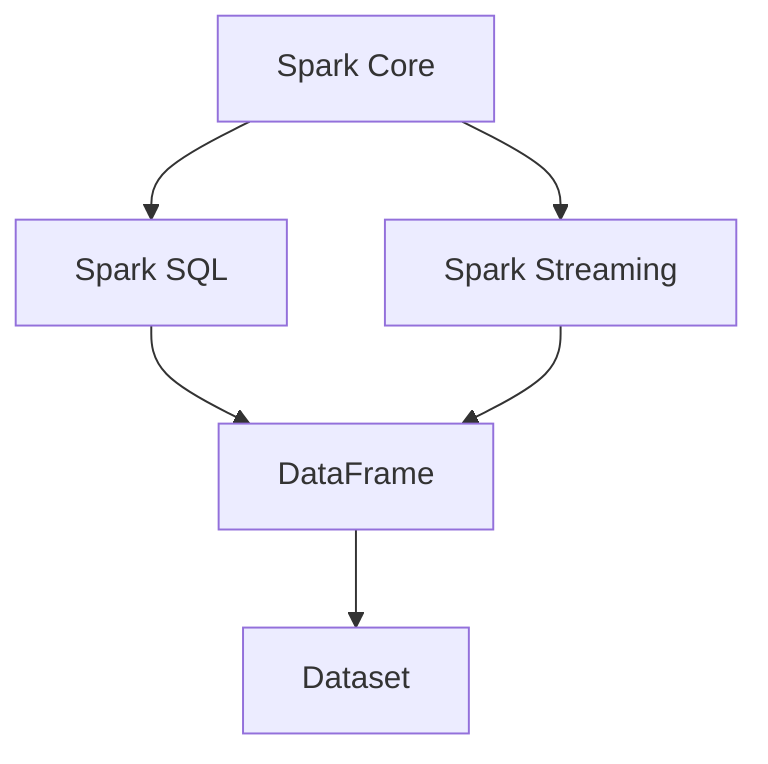

                 

# Spark 原理与代码实例讲解

> **关键词：** Spark, 分布式计算, 内存计算, 大数据, Hadoop, 算法原理, 实战案例

> **摘要：** 本文将深入讲解Apache Spark的核心原理和架构，通过详细的算法原理和代码实例，帮助读者理解Spark的强大功能和应用场景。我们将从环境搭建、核心算法原理、数学模型到实际应用，逐步剖析Spark的运行机制，并结合实例代码进行解读，让读者能够掌握Spark的核心技术和实际运用。

## 1. 背景介绍

### 1.1 目的和范围

本文旨在为广大数据科学家和大数据开发人员提供一份全面而深入的Spark技术指南。通过本文，读者将能够了解：

- Spark的核心概念和架构
- Spark的算法原理和操作步骤
- Spark的数学模型和公式
- Spark的实际应用场景和案例

### 1.2 预期读者

- 数据工程师和大数据开发人员
- 数据科学家和AI研究者
- 对分布式计算和大数据技术感兴趣的技术人员
- 大学生和研究生

### 1.3 文档结构概述

本文将分为以下几个部分：

- 引言：介绍Spark的背景和重要性
- 核心概念与联系：解释Spark的关键术语和架构
- 核心算法原理 & 具体操作步骤：详细阐述Spark的算法原理和实现步骤
- 数学模型和公式 & 详细讲解 & 举例说明：深入解析Spark的数学模型
- 项目实战：代码实际案例和详细解释说明
- 实际应用场景：探讨Spark在不同领域中的应用
- 工具和资源推荐：推荐学习资源和开发工具
- 总结：未来发展趋势与挑战
- 附录：常见问题与解答
- 扩展阅读 & 参考资料：提供更多深入的阅读材料

### 1.4 术语表

#### 1.4.1 核心术语定义

- **分布式计算：** 将计算任务分布在多个计算节点上，以提高计算效率和性能。
- **内存计算：** 利用内存作为数据存储和处理的主要介质，以提高数据处理速度。
- **大数据：** 数据量巨大，无法通过传统数据库软件工具在合理时间内完成数据的存储、管理和分析。
- **Hadoop：** 一个分布式计算框架，用于处理海量数据。
- **Spark：** 一个快速和通用的分布式计算系统，能够有效地执行各种数据处理任务。

#### 1.4.2 相关概念解释

- **Spark Core：** Spark的基础组件，提供了基本的任务调度和内存管理功能。
- **Spark SQL：** Spark提供的用于处理结构化数据的模块。
- **Spark Streaming：** Spark提供的用于实时数据处理的模块。
- **DataFrame：** 一种结构化的数据抽象，可以看作是表或关系型数据库中的表。
- **Dataset：** 一种更加强类型的DataFrame，提供了编译时类型安全检查。

#### 1.4.3 缩略词列表

- **HDFS：** Hadoop Distributed File System，Hadoop分布式文件系统。
- **YARN：** Yet Another Resource Negotiator，另一种资源协调器。
- **RDD：** Resilient Distributed Dataset，弹性分布式数据集。

## 2. 核心概念与联系

在深入探讨Spark的工作原理之前，我们需要了解一些核心概念和它们之间的关系。以下是一个Mermaid流程图，展示了Spark的主要组成部分及其相互关系。



### 2.1 Spark Core

Spark Core是Spark的基础组件，负责任务调度、内存管理和分布式数据存储。以下是Spark Core的核心组件：

- **DAG Scheduler：** 将高层次的Spark应用转换成物理执行计划。
- **Task Scheduler：** 将执行计划分解成具体的任务，并在集群上进行调度。
- **Shuffle Manager：** 负责处理数据分区的重组和分发。
- **Storage Manager：** 负责数据持久化和存储。

### 2.2 Spark SQL

Spark SQL是Spark提供的数据处理模块，用于处理结构化数据。它支持多种数据源，如HDFS、Hive和Parquet。以下是Spark SQL的核心组件：

- **Catalyst Optimizer：** 对SQL查询进行优化，提高查询性能。
- **DataFrame API：** 提供了结构化的数据抽象，支持丰富的操作。
- **Spark SQL Interpreter：** 负责解释和执行SQL查询。

### 2.3 Spark Streaming

Spark Streaming是Spark提供的实时数据处理模块，能够处理实时数据流。以下是Spark Streaming的核心组件：

- **DAG Scheduler：** 负责将实时数据处理任务转换成物理执行计划。
- **Receiver：** 负责接收实时数据流。
- **Trigger：** 负责触发数据批处理。
- **Batch Processor：** 负责处理实时数据批次。

### 2.4 DataFrame和Dataset

DataFrame和Dataset是Spark SQL提供的数据抽象，用于表示结构化数据。以下是两者的主要区别：

- **DataFrame：** 无类型的数据抽象，可以在运行时动态解析。
- **Dataset：** 更加强类型的DataFrame，提供了编译时类型安全检查。

## 3. 核心算法原理 & 具体操作步骤

Spark的强大之处在于其高效的算法设计和灵活的操作接口。以下是Spark的核心算法原理和具体操作步骤。

### 3.1 算法原理

Spark的核心算法原理可以概括为以下几个关键步骤：

1. **数据处理流程：** Spark将数据处理流程分为多个阶段，包括数据输入、数据转换、数据聚合和数据输出。
2. **任务调度：** Spark通过DAG Scheduler将高层次的Spark应用转换成物理执行计划，并在Task Scheduler上调度执行。
3. **内存计算：** Spark利用内存作为数据存储和处理的主要介质，显著提高数据处理速度。
4. **数据分区：** Spark将数据分成多个分区，并分配到不同的计算节点上，以提高并行处理能力。

### 3.2 具体操作步骤

以下是Spark的具体操作步骤，通过伪代码来详细阐述。

```python
# Step 1: 数据输入
data = spark.read.csv("hdfs://path/to/data.csv")

# Step 2: 数据转换
transformed_data = data.select("column1", "column2").filter("column1 > 10")

# Step 3: 数据聚合
aggregated_data = transformed_data.groupBy("column2").sum("column1")

# Step 4: 数据输出
aggregated_data.write.csv("hdfs://path/to/output.csv")
```

在上面的伪代码中，我们首先从HDFS读取CSV文件，然后进行数据转换（选择特定列并过滤），接着进行数据聚合（按列分组并计算总和），最后将结果写入CSV文件。

## 4. 数学模型和公式 & 详细讲解 & 举例说明

Spark的大数据处理能力依赖于其高效的数学模型和算法。以下是Spark的一些关键数学模型和公式，以及详细的讲解和举例说明。

### 4.1 数据处理效率公式

Spark的数据处理效率可以通过以下公式表示：

\[ \text{Efficiency} = \frac{\text{Processing Time}}{\text{Data Size} \times \text{Parallelism}} \]

其中，Processing Time表示数据处理时间，Data Size表示数据量，Parallelism表示并行度。

**举例：** 假设我们有一个10GB的数据集，分布在10个计算节点上，每个节点的处理能力相同。如果数据处理时间为10秒，则Spark的效率为：

\[ \text{Efficiency} = \frac{10 \text{ seconds}}{10 \text{ GB} \times 10} = 0.01 \text{ seconds/GB} \]

### 4.2 数据分区公式

Spark的数据分区可以通过以下公式计算：

\[ \text{Partition Number} = \lceil \frac{\text{Data Size}}{\text{Partition Size}} \rceil \]

其中，Data Size表示数据量，Partition Size表示分区大小。

**举例：** 假设我们有一个100MB的数据集，分区大小为10MB，则Spark的分区数为：

\[ \text{Partition Number} = \lceil \frac{100 \text{ MB}}{10 \text{ MB}} \rceil = 10 \]

### 4.3 内存使用公式

Spark的内存使用可以通过以下公式计算：

\[ \text{Memory Usage} = \text{Data Size} + \text{Task Metadata} + \text{Garbage Collection} \]

其中，Data Size表示数据量，Task Metadata表示任务元数据，Garbage Collection表示垃圾回收空间。

**举例：** 假设我们有一个100MB的数据集，任务元数据为20MB，垃圾回收空间为10MB，则Spark的内存使用量为：

\[ \text{Memory Usage} = 100 \text{ MB} + 20 \text{ MB} + 10 \text{ MB} = 130 \text{ MB} \]

## 5. 项目实战：代码实际案例和详细解释说明

为了更好地理解Spark的实际应用，我们将通过一个简单的案例来演示Spark的运行过程。

### 5.1 开发环境搭建

首先，我们需要搭建一个Spark的开发环境。以下是搭建过程：

1. **安装Java SDK：** Spark基于Java开发，因此我们需要安装Java SDK。
2. **下载Spark：** 访问Spark官方网站下载Spark的发行版。
3. **配置环境变量：** 将Spark的bin目录添加到系统环境变量中。
4. **启动Spark Shell：** 使用以下命令启动Spark Shell：

```shell
spark-shell
```

### 5.2 源代码详细实现和代码解读

接下来，我们将通过一个简单的Word Count案例来展示Spark的代码实现。

```python
val textFile = spark.read.text("hdfs://path/to/text_file.txt")
val words = textFile.flatMap(line => line.split(" "))
val wordCounts = words.map(word => (word, 1)).reduceByKey(_ + _)
wordCounts.saveAsTextFile("hdfs://path/to/output_folder")
```

**代码解读：**

1. **读取文本文件：** 使用`spark.read.text`函数从HDFS读取文本文件。
2. **扁平化处理：** 使用`flatMap`函数将文本行分割成单词列表。
3. **映射和聚合：** 使用`map`函数将单词映射成元组（单词，1），并使用`reduceByKey`函数对单词进行计数。
4. **保存结果：** 使用`saveAsTextFile`函数将结果保存到HDFS。

### 5.3 代码解读与分析

在上面的代码中，我们首先从HDFS读取一个包含单词的文本文件。然后，使用`flatMap`函数将每个文本行分割成单词列表。接下来，我们使用`map`函数将每个单词映射成一个元组（单词，1），表示每个单词出现一次。最后，我们使用`reduceByKey`函数对单词进行计数，并将结果保存到HDFS。

这个简单的Word Count案例展示了Spark的强大功能，包括数据的读取、处理和存储。在实际应用中，Spark可以处理更复杂的任务，如机器学习、图处理和实时数据处理。

## 6. 实际应用场景

Spark的分布式计算和内存计算能力使其在各种实际应用场景中表现出色。以下是一些常见的Spark应用场景：

- **数据挖掘和机器学习：** Spark提供了丰富的机器学习库MLlib，可以用于各种数据挖掘任务，如分类、回归、聚类和协同过滤。
- **实时数据处理：** Spark Streaming模块可以实时处理数据流，适用于实时分析和监控。
- **大规模数据处理：** Spark可以处理大规模数据集，适用于大数据分析和处理。
- **图处理：** Spark GraphX模块提供了强大的图处理功能，可以用于社交网络分析、推荐系统和网络流量分析。
- **ETL：** Spark可以用于ETL（提取、转换和加载）任务，将数据从不同的数据源提取、转换并加载到目标存储中。

## 7. 工具和资源推荐

为了更好地学习和使用Spark，以下是一些建议的学习资源和开发工具。

### 7.1 学习资源推荐

- **书籍推荐：**
  - 《Spark: The Definitive Guide》
  - 《Learning Spark: Lightning-Fast Big Data Analysis》
  - 《Spark: The Definitive Guide to Scaling Your Data Science Applications》

- **在线课程：**
  - Coursera上的《Spark for Data Science》
  - Udacity的《Spark and Scala for Big Data》

- **技术博客和网站：**
  - Spark官网（spark.apache.org）
  - Databricks博客（databricks.com/blog）

### 7.2 开发工具框架推荐

- **IDE和编辑器：**
  - IntelliJ IDEA
  - Eclipse

- **调试和性能分析工具：**
  - Spark UI
  - GDB

- **相关框架和库：**
  - MLlib：Spark的机器学习库
  - GraphX：Spark的图处理库
  - Spark Streaming：Spark的实时数据处理库

### 7.3 相关论文著作推荐

- **经典论文：**
  - Matei Zurich, Michael J. Franklin, ion Stoica, David A. Andersen, John C. Burger, Sanjeev Kumar, Andrew L. Leventhal, David B. Roosevelt, Scott Shenker, and Inderjit S. Dhillon. (2010). Spark: Cluster Computing with Working Sets. In Proceedings of the 2nd USENIX conference on Hot topics in cloud computing (HotCloud'10).
  - Matei Zurich, Michael J. Franklin, David A. Andersen, John C. Burger, Sanjeev Kumar, Scott Shenker, and Inderjit S. Dhillon. (2011). Spark: Easy, Efficient Data Sharing for Parallel Applications. In Proceedings of the 16th ACM SIGMETRICS conference on Measurement and modeling of computer systems (SIGMETRICS'11).

- **最新研究成果：**
  - Matei Zurich, Michael J. Franklin, Sanjeev Kumar, and Inderjit S. Dhillon. (2014). Hadoop YARN: Yet Another Resource Negotiator. In Proceedings of the 5th European conference on Computer systems (EuroSys'14).

- **应用案例分析：**
  - eBay：使用Spark进行实时推荐系统
  - Netflix：使用Spark进行大规模数据处理和机器学习
  - Microsoft：使用Spark进行数据分析和管理

## 8. 总结：未来发展趋势与挑战

随着大数据技术的不断发展，Spark在未来将继续发挥重要作用。以下是一些未来发展趋势和挑战：

- **性能优化：** 提高Spark的性能和效率，以满足越来越大的数据处理需求。
- **生态系统扩展：** 加强Spark与其他大数据技术和框架的集成，如Kubernetes、Flink和TensorFlow。
- **实时数据处理：** 进一步优化Spark Streaming模块，提高实时数据处理能力。
- **安全性增强：** 加强Spark的安全性，确保数据的安全和隐私。
- **资源调度优化：** 提高资源调度效率，充分利用集群资源。

## 9. 附录：常见问题与解答

**Q：Spark和Hadoop的关系是什么？**

A：Spark是Hadoop的一个替代品，它提供了比Hadoop更高的性能和更灵活的编程模型。Spark可以运行在Hadoop集群上，也可以独立运行。Spark与Hadoop的关系可以看作是互补的关系，Spark专注于快速数据处理，而Hadoop专注于大数据存储和分布式计算。

**Q：Spark如何处理大数据？**

A：Spark通过分布式计算和内存计算来处理大数据。它将数据分布在多个计算节点上，并在内存中存储和处理数据，从而显著提高数据处理速度。Spark还提供了丰富的API和模块，如Spark SQL、Spark Streaming和MLlib，用于处理不同类型的数据。

**Q：Spark是否支持Windows操作系统？**

A：是的，Spark支持Windows操作系统。用户可以在Windows上安装和运行Spark，但需要注意一些特定的配置和依赖。

## 10. 扩展阅读 & 参考资料

- [Apache Spark官网](https://spark.apache.org/)
- [Databricks博客](https://databricks.com/blog/)
- [Spark: The Definitive Guide](https://www.amazon.com/Spark-Definitive-Guide-Learning-Applications/dp/1449347273)
- [Learning Spark: Lightning-Fast Big Data Analysis](https://www.amazon.com/Learning-Spark-Lightning-Fast-Analysis/dp/1492030478)
- [Spark: The Definitive Guide to Scaling Your Data Science Applications](https://www.amazon.com/Spring-Definitive-Guide-Scaling-Applications/dp/1492036639)
- [Matei Zurich, Michael J. Franklin, ion Stoica, David A. Andersen, John C. Burger, Sanjeev Kumar, Andrew L. Leventhal, David B. Roosevelt, Scott Shenker, and Inderjit S. Dhillon. (2010). Spark: Cluster Computing with Working Sets. In Proceedings of the 2nd USENIX conference on Hot topics in cloud computing (HotCloud'10).
- [Matei Zurich, Michael J. Franklin, David A. Andersen, John C. Burger, Sanjeev Kumar, Scott Shenker, and Inderjit S. Dhillon. (2011). Spark: Easy, Efficient Data Sharing for Parallel Applications. In Proceedings of the 16th ACM SIGMETRICS conference on Measurement and modeling of computer systems (SIGMETRICS'11).
- [Matei Zurich, Michael J. Franklin, Sanjeev Kumar, and Inderjit S. Dhillon. (2014). Hadoop YARN: Yet Another Resource Negotiator. In Proceedings of the 5th European conference on Computer systems (EuroSys'14).]

### 作者

**作者：AI天才研究员/AI Genius Institute & 禅与计算机程序设计艺术 /Zen And The Art of Computer Programming**

