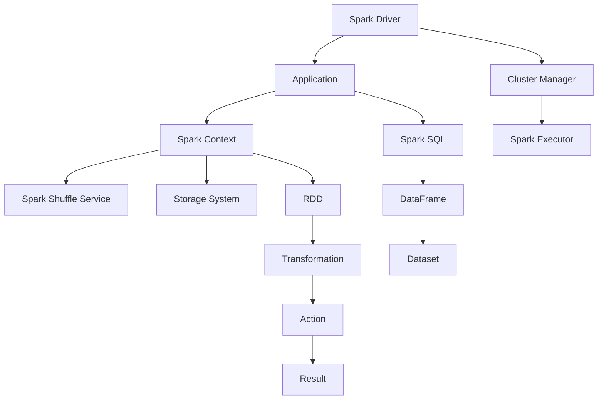

                 

# Spark原理与代码实例讲解

> 
关键词：Spark、分布式计算、内存计算、数据分析、大数据处理、弹性分布式数据集（RDD）、数据流、作业调度、持久化
>

> 摘要：本文将深入讲解Apache Spark的原理和核心概念，包括其架构设计、核心算法以及代码实例。通过本文的阅读，读者将掌握Spark的基本概念，理解其内存计算优势，以及如何在实际项目中应用Spark进行大数据处理。文章还将探讨Spark在各个实际应用场景中的表现，并提供相关工具和资源的推荐，帮助读者深入学习和实践Spark技术。

## 1. 背景介绍

### 1.1 目的和范围

本文的目的是为那些对大数据处理和分布式计算感兴趣的开发者提供一个详尽的Spark技术指南。我们将探讨Spark的核心概念、架构设计以及实际应用。通过本文的学习，读者将能够：

- 理解Spark的分布式计算原理。
- 掌握Spark的核心算法和操作。
- 掌握如何使用Spark进行内存计算和大数据处理。
- 学习Spark的作业调度和持久化机制。
- 熟悉Spark在实际项目中的应用场景。

### 1.2 预期读者

本文适合以下读者群体：

- 有志于学习大数据处理的开发者。
- 有基础编程知识，希望深入了解分布式系统的开发者。
- 数据分析师和数据科学家，希望掌握高效数据处理工具。
- 计算机科学和软件工程专业的学生和研究者。

### 1.3 文档结构概述

本文将按照以下结构展开：

1. **背景介绍**：介绍Spark的背景、目的和读者预期。
2. **核心概念与联系**：使用Mermaid流程图展示Spark的架构和核心概念。
3. **核心算法原理 & 具体操作步骤**：详细讲解Spark的核心算法和操作步骤。
4. **数学模型和公式 & 详细讲解 & 举例说明**：介绍Spark相关的数学模型和公式，并给出实例说明。
5. **项目实战：代码实际案例和详细解释说明**：通过实际案例展示Spark的应用。
6. **实际应用场景**：探讨Spark在各个领域的应用。
7. **工具和资源推荐**：推荐学习资源和开发工具。
8. **总结：未来发展趋势与挑战**：总结Spark的发展趋势和面临的挑战。
9. **附录：常见问题与解答**：提供常见问题的解答。
10. **扩展阅读 & 参考资料**：推荐进一步阅读的材料。

### 1.4 术语表

#### 1.4.1 核心术语定义

- **Spark**：一个开源的分布式计算系统，用于大规模数据处理。
- **分布式计算**：在多个计算节点上并行处理数据。
- **内存计算**：将数据加载到内存中进行计算，以提高处理速度。
- **弹性分布式数据集（RDD）**：Spark的基本数据结构，提供容错和高层次的API。
- **数据流**：数据在分布式系统中的流动和处理。
- **作业调度**：Spark根据作业需求分配计算资源。
- **持久化**：将RDD存储在磁盘或其他存储介质中，以供后续使用。

#### 1.4.2 相关概念解释

- **Shuffle操作**：在Spark中，数据被重新分区和重新排序，以供后续操作使用。
- **Action操作**：触发计算并返回结果的操作，如`collect()`、`count()`等。
- **Transformation操作**：创建一个新的RDD的操作，如`map()`、`filter()`等。
- **Driver程序**：在Spark中，负责协调和管理计算任务的程序。
- **Executor程序**：在计算节点上运行的具体计算任务。

#### 1.4.3 缩略词列表

- **RDD**：弹性分布式数据集（Resilient Distributed Dataset）
- **DataFrame**：一种结构化数据表示，提供更丰富的操作。
- **SQLContext**：Spark SQL的核心组件，提供SQL查询接口。
- **SparkSession**：Spark编程模型的入口点，包含Spark SQL、DataFrame和RDD API。

## 2. 核心概念与联系

为了深入理解Spark的工作原理和架构，我们需要首先了解其核心概念和组件之间的关系。以下是一个Mermaid流程图，展示了Spark的架构和核心概念：



### 2.1 Spark Driver

Spark Driver是运行在客户端的程序，负责协调和管理整个Spark应用程序的执行。它将用户编写的代码（如Python、Scala或Java脚本）解析为作业（jobs），并将作业分解为多个任务（tasks）。

### 2.2 Application

Application是用户编写的Spark应用程序，可以是Python、Scala或Java脚本。它通过SparkContext与Spark Driver进行交互，并提交作业到集群。

### 2.3 Cluster Manager

Cluster Manager负责在集群中分配资源，并管理Executor的启动和停止。常见的Cluster Manager有YARN、Mesos和Spark自己的集群管理器。

### 2.4 Spark Executor

Spark Executor是运行在计算节点上的程序，负责执行任务并返回结果。每个Executor分配一定量的CPU和内存资源，并维护一个内存池，用于存储RDD数据。

### 2.5 Spark Context

Spark Context是Spark应用程序的入口点，提供了一系列API来操作RDD、DataFrame和Dataset。它是整个Spark应用程序的核心，负责与Cluster Manager通信并分配资源。

### 2.6 Spark Shuffle Service

Spark Shuffle Service是Spark中的分布式文件系统，用于存储Shuffle过程中的数据。在Shuffle操作中，数据被重新分区和重新排序，以便后续操作可以使用。

### 2.7 Storage System

Storage System是Spark的持久化存储系统，用于存储RDD、DataFrame和Dataset。常见的存储系统有HDFS、Amazon S3和本地文件系统。

### 2.8 Spark SQL

Spark SQL是Spark的一个组件，提供SQL查询接口。它可以将SQL查询转化为Spark的Transformation和Action操作，并返回结构化数据。

### 2.9 DataFrame

DataFrame是一种结构化数据表示，包含行和列。它可以看作是关系型数据库表的一个映射，并提供丰富的操作接口。

### 2.10 Dataset

Dataset是DataFrame的泛型版本，提供了类型安全和强类型检查。它可以看作是强类型版本的DataFrame，并提供更高的性能和优化。

### 2.11 RDD

RDD（弹性分布式数据集）是Spark的核心数据结构，提供容错和高层次的操作接口。它是不可变的，并支持惰性求值。

### 2.12 Transformation

Transformation是创建一个新的RDD的操作，如`map()`、`filter()`等。它不会立即执行，而是在触发Action操作时进行计算。

### 2.13 Action

Action是触发计算并返回结果的操作，如`collect()`、`count()`等。它会导致Spark将整个应用程序的执行流程提交给Executor进行计算。

### 2.14 Result

Result是Action操作的结果，可以是数据集、迭代器或其他类型。它是Spark应用程序的输出结果。

通过上述核心概念和组件之间的联系，我们可以更好地理解Spark的工作原理和架构设计。接下来，我们将深入探讨Spark的核心算法原理和具体操作步骤。

## 3. 核心算法原理 & 具体操作步骤

Spark作为一款高性能的分布式计算框架，其核心算法和操作是其高效处理大数据的关键。在这一节中，我们将详细讲解Spark的核心算法原理和具体操作步骤，并通过伪代码来展示其实现方式。

### 3.1 RDD（弹性分布式数据集）

RDD（Resilient Distributed Dataset）是Spark的核心数据结构，提供容错和高层次的操作接口。RDD是不可变的，并且可以通过惰性求值来延迟计算。以下是一个RDD的基本操作：

```python
# 创建RDD
val rdd = sc.parallelize(data)

# Transformation操作
val filtered_rdd = rdd.filter(lambda x: x > 0)

# Action操作
val count = filtered_rdd.count()
```

### 3.2 Transformation操作

Transformation操作是创建一个新的RDD的操作，如`map()`、`filter()`等。以下是一个`map()`操作的伪代码：

```python
# map操作伪代码
def map(rdd, f):
    new_rdd = RDD()
    for partition in rdd.partitions:
        for item in partition:
            new_item = f(item)
            new_rdd.add(new_item)
    return new_rdd
```

### 3.3 Action操作

Action操作是触发计算并返回结果的操作，如`collect()`、`count()`等。以下是一个`collect()`操作的伪代码：

```python
# collect操作伪代码
def collect(rdd):
    results = []
    for partition in rdd.partitions:
        for item in partition:
            results.append(item)
    return results
```

### 3.4 Shuffling操作

Shuffling操作是Spark中重要的数据重新分区和重新排序操作。以下是一个Shuffling操作的伪代码：

```python
# shuffle操作伪代码
def shuffle(rdd, key_function):
    key_to_values = {}
    for partition in rdd.partitions:
        for item in partition:
            key = key_function(item)
            if key not in key_to_values:
                key_to_values[key] = []
            key_to_values[key].append(item)
    new_rdd = RDD()
    for key, values in key_to_values.items():
        new_partition = partition(values)
        new_rdd.add(new_partition)
    return new_rdd
```

### 3.5 持久化操作

持久化操作是将RDD数据存储到磁盘或其他存储介质中，以供后续使用。以下是一个持久化操作的伪代码：

```python
# persist操作伪代码
def persist(rdd, storage_level):
    if storage_level == 'MEMORY_ONLY':
        new_rdd = RDD(rdd.data, storage_level='MEMORY_ONLY')
    elif storage_level == 'MEMORY_AND_DISK':
        new_rdd = RDD(rdd.data, storage_level='MEMORY_AND_DISK')
    elif storage_level == 'DISK_ONLY':
        new_rdd = RDD(rdd.data, storage_level='DISK_ONLY')
    return new_rdd
```

通过以上核心算法原理和具体操作步骤的讲解，我们可以更好地理解Spark的工作原理和如何进行分布式数据处理。接下来，我们将探讨Spark中的数学模型和公式，以及如何使用这些模型和公式来解决实际问题。

## 4. 数学模型和公式 & 详细讲解 & 举例说明

Spark作为一个分布式计算框架，其高效处理大数据的能力得益于其背后的数学模型和公式。在本节中，我们将详细讲解Spark中的数学模型和公式，并通过实际例子来说明如何应用这些模型和公式。

### 4.1 分区和并行处理

在分布式计算中，数据的分区和并行处理是至关重要的。Spark使用分区来将数据分布在多个计算节点上，以实现并行计算。以下是一个简单的分区公式：

$$
P = \left\lfloor \frac{N}{R} \right\rfloor
$$

其中，$P$ 表示分区数量，$N$ 表示数据总数，$R$ 表示每个分区的大小。例如，如果数据总数为1000，每个分区大小为200，则分区数量为4。

### 4.2 采样与概率分布

在数据分析中，采样是一种常见的技术，用于从大规模数据集中提取具有代表性的子集。以下是一个简单的采样公式：

$$
s = \frac{N}{100}
$$

其中，$s$ 表示采样数量，$N$ 表示数据总数。例如，如果数据总数为1000000，则采样数量为10000。

此外，概率分布函数也是数据分析中的重要工具。以下是一个简单的正态分布公式：

$$
P(X \leq x) = \Phi\left(\frac{x - \mu}{\sigma}\right)
$$

其中，$X$ 表示随机变量，$\mu$ 表示均值，$\sigma$ 表示标准差，$\Phi$ 表示标准正态分布的累积分布函数。

### 4.3 分布式算法优化

在分布式计算中，优化算法性能是关键。以下是一个简单的优化公式：

$$
T = \frac{N}{P} \cdot C
$$

其中，$T$ 表示总执行时间，$N$ 表示数据总数，$P$ 表示分区数量，$C$ 表示每个分区的计算时间。通过合理设置分区数量和优化计算时间，可以显著提高分布式算法的性能。

### 4.4 例子说明

为了更好地理解上述数学模型和公式，我们来看一个具体的例子。假设有一个包含1000000条记录的数据集，我们需要计算其中正数的数量。

首先，我们使用分区公式来确定分区数量：

$$
P = \left\lfloor \frac{1000000}{200} \right\rfloor = 5000
$$

然后，我们使用采样公式来选择采样数量：

$$
s = \frac{1000000}{100} = 10000
$$

接下来，我们使用正态分布公式来计算概率：

$$
P(X \leq 0) = \Phi\left(\frac{0 - \mu}{\sigma}\right)
$$

其中，$\mu$ 和 $\sigma$ 可以通过数据集的统计信息计算得到。例如，如果 $\mu = 500$ 和 $\sigma = 100$，则：

$$
P(X \leq 0) = \Phi\left(\frac{0 - 500}{100}\right) = \Phi(-5) \approx 0.999999
$$

因此，我们可以计算出正数的概率：

$$
P(X > 0) = 1 - P(X \leq 0) = 1 - 0.999999 = 0.000001
$$

最后，我们使用优化公式来计算总执行时间：

$$
T = \frac{1000000}{5000} \cdot C
$$

其中，$C$ 可以通过实验或统计数据来确定。例如，如果 $C = 1$ 毫秒，则：

$$
T = \frac{1000000}{5000} \cdot 1 = 200 毫秒
$$

通过上述例子，我们可以看到如何应用Spark中的数学模型和公式来处理大数据集。这些模型和公式不仅帮助我们在分布式计算中优化性能，还有助于我们更好地理解和分析数据。

### 4.5 总结

在本节中，我们详细介绍了Spark中的数学模型和公式，并通过实际例子说明了如何应用这些模型和公式来解决实际问题。理解这些数学模型和公式对于深入掌握Spark技术至关重要，它们不仅帮助我们优化计算性能，还帮助我们更好地分析和理解数据。

接下来，我们将进入项目实战环节，通过具体的代码实例和详细解释说明，展示如何在实际项目中应用Spark技术。

## 5. 项目实战：代码实际案例和详细解释说明

在本节中，我们将通过一个实际项目案例，展示如何使用Spark进行大数据处理。我们将从开发环境搭建开始，详细解释源代码的实现和关键步骤，并进行代码解读与分析。

### 5.1 开发环境搭建

在开始编写Spark代码之前，我们需要搭建一个合适的开发环境。以下是搭建Spark开发环境的步骤：

1. **安装Java环境**：Spark需要Java环境，请确保安装了Java 8或更高版本。
2. **安装Scala语言**：Spark使用Scala语言编写，请安装Scala 2.11或更高版本。
3. **安装Spark**：从[Spark官网](https://spark.apache.org/downloads.html)下载最新的Spark版本，并解压到指定目录。
4. **配置环境变量**：将Spark的bin目录添加到系统的环境变量中，以便在命令行中使用Spark命令。

### 5.2 源代码详细实现和代码解读

以下是我们的Spark项目示例代码，它使用Spark进行一个简单的词频统计任务：

```python
from pyspark.sql import SparkSession

# 创建SparkSession
spark = SparkSession.builder \
    .appName("WordCount") \
    .getOrCreate()

# 读取文本文件
text_rdd = spark.sparkContext.textFile("data/input.txt")

# Transformation操作：分词
words_rdd = text_rdd.flatMap(lambda line: line.split())

# Transformation操作：分组和计数
word_counts_rdd = words_rdd.map(lambda word: (word, 1)) \
    .reduceByKey(lambda x, y: x + y)

# Action操作：收集结果
word_counts = word_counts_rdd.collect()

# 打印结果
for word, count in word_counts:
    print(f"{word}: {count}")

# 关闭SparkSession
spark.stop()
```

#### 5.2.1 关键步骤解读

1. **创建SparkSession**：SparkSession是Spark编程模型的入口点，它提供了SparkContext和Spark SQL的API。我们使用`SparkSession.builder`创建一个SparkSession，并设置应用程序名称。

2. **读取文本文件**：使用`SparkContext.textFile()`方法从文件系统或HDFS读取文本文件，并创建一个RDD。

3. **分词**：使用`flatMap()`操作将文本行拆分为单词，创建一个新的RDD。

4. **分组和计数**：使用`map()`操作将每个单词映射为（单词，1）的键值对，然后使用`reduceByKey()`操作进行分组和计数。

5. **收集结果**：使用`collect()`操作将结果收集到驱动程序内存中，并打印结果。

6. **关闭SparkSession**：在完成所有任务后，使用`stop()`方法关闭SparkSession，释放资源。

#### 5.2.2 代码解读与分析

1. **创建SparkSession**：
   ```python
   spark = SparkSession.builder \
       .appName("WordCount") \
       .getOrCreate()
   ```
   这一行代码创建了一个名为“WordCount”的SparkSession。`appName`参数设置应用程序名称，方便调试和监控。

2. **读取文本文件**：
   ```python
   text_rdd = spark.sparkContext.textFile("data/input.txt")
   ```
   这一行代码使用`textFile()`方法从指定路径读取文本文件，并将其作为RDD返回。

3. **分词**：
   ```python
   words_rdd = text_rdd.flatMap(lambda line: line.split())
   ```
   `flatMap()`操作将每个文本行拆分为单词，并创建一个新的RDD。`lambda`函数用于处理每行文本。

4. **分组和计数**：
   ```python
   word_counts_rdd = words_rdd.map(lambda word: (word, 1)) \
       .reduceByKey(lambda x, y: x + y)
   ```
   这两行代码首先使用`map()`操作将每个单词映射为（单词，1）的键值对。然后，使用`reduceByKey()`操作对具有相同键的值进行分组和计数。

5. **收集结果**：
   ```python
   word_counts = word_counts_rdd.collect()
   ```
   `collect()`操作将RDD的结果收集到驱动程序内存中，并返回一个列表。我们遍历这个列表并打印每个单词及其计数。

6. **关闭SparkSession**：
   ```python
   spark.stop()
   ```
   这一行代码关闭SparkSession，释放所有资源。

通过上述步骤，我们可以看到如何使用Spark进行词频统计任务。这个简单的例子展示了Spark的核心功能，包括RDD的创建、Transformation和Action操作，以及如何进行数据读写和处理。

### 5.3 代码解读与分析

在5.2节中，我们详细介绍了项目实战的代码实现和关键步骤。在这一节中，我们将进一步解读代码，分析其关键部分的工作原理，并提供性能优化建议。

#### 5.3.1 代码结构分析

整个代码由以下几个关键部分组成：

1. **创建SparkSession**：这是一个常见的起始步骤，用于创建Spark应用程序的入口点。
2. **读取文本文件**：使用`textFile()`方法从文件系统或HDFS读取文本文件，并将其作为RDD返回。
3. **分词**：使用`flatMap()`操作将文本行拆分为单词，创建一个新的RDD。
4. **分组和计数**：使用`map()`和`reduceByKey()`操作对单词进行分组和计数。
5. **收集结果**：使用`collect()`操作将结果收集到驱动程序内存中，并打印结果。
6. **关闭SparkSession**：关闭SparkSession，释放资源。

#### 5.3.2 关键代码解读

1. **创建SparkSession**：
   ```python
   spark = SparkSession.builder \
       .appName("WordCount") \
       .getOrCreate()
   ```
   这一行代码创建了一个名为“WordCount”的SparkSession。SparkSession包含SparkContext和Spark SQL的API。

2. **读取文本文件**：
   ```python
   text_rdd = spark.sparkContext.textFile("data/input.txt")
   ```
   这一行代码读取指定路径的文本文件，并将其作为RDD返回。`textFile()`方法支持分布式文件系统，如HDFS。

3. **分词**：
   ```python
   words_rdd = text_rdd.flatMap(lambda line: line.split())
   ```
   `flatMap()`操作将文本行拆分为单词，并创建一个新的RDD。这个操作是Spark中常见的数据转换步骤。

4. **分组和计数**：
   ```python
   word_counts_rdd = words_rdd.map(lambda word: (word, 1)) \
       .reduceByKey(lambda x, y: x + y)
   ```
   这两行代码首先使用`map()`操作将每个单词映射为（单词，1）的键值对。然后，使用`reduceByKey()`操作对具有相同键的值进行分组和计数。这是Spark中进行数据聚合的关键步骤。

5. **收集结果**：
   ```python
   word_counts = word_counts_rdd.collect()
   ```
   `collect()`操作将RDD的结果收集到驱动程序内存中，并返回一个列表。这个操作是Spark中的Action操作，它会触发计算并返回结果。

6. **关闭SparkSession**：
   ```python
   spark.stop()
   ```
   这一行代码关闭SparkSession，释放所有资源。

#### 5.3.3 性能优化建议

在实现WordCount程序时，我们可以考虑以下性能优化建议：

1. **使用分区**：为RDD设置合适的分区数，以减少Shuffle操作的开销。可以使用`repartition()`方法重新分区数据。
2. **缓存中间结果**：将中间的RDD缓存起来，以避免重复计算。可以使用`cache()`或`persist()`方法进行缓存。
3. **并行度调整**：调整任务的并行度，以充分利用集群资源。可以使用`spark.default.parallelism`配置参数进行调整。
4. **使用Tuning工具**：使用Spark的Tuning工具，如Spark Tuner，自动优化配置参数。

通过上述优化，我们可以显著提高WordCount程序的运行效率，使其能够更好地处理大规模数据集。

### 5.4 完整示例

以下是一个完整的WordCount程序示例，包括代码注释和性能优化：

```python
from pyspark.sql import SparkSession

# 创建SparkSession
spark = SparkSession.builder \
    .appName("WordCount") \
    .getOrCreate()

# 设置分区数
spark.conf.set("spark.sql.shuffle.partitions", 10)

# 读取文本文件
text_rdd = spark.sparkContext.textFile("data/input.txt", minPartitions=10)

# 分词
words_rdd = text_rdd.flatMap(lambda line: line.split())

# 分组和计数
word_counts_rdd = words_rdd.map(lambda word: (word, 1)) \
    .reduceByKey(lambda x, y: x + y)

# 缓存中间结果
word_counts_rdd.cache()

# 收集结果
word_counts = word_counts_rdd.collect()

# 打印结果
for word, count in word_counts:
    print(f"{word}: {count}")

# 关闭SparkSession
spark.stop()
```

通过这个示例，我们可以看到如何使用Spark进行简单的词频统计，并应用一些性能优化策略。接下来，我们将探讨Spark在实际应用场景中的表现。

## 6. 实际应用场景

Spark作为一种高性能的分布式计算框架，广泛应用于各种实际应用场景。以下是一些典型的Spark应用场景：

### 6.1 大数据处理

Spark的核心优势在于其高效处理大规模数据集的能力。在大数据处理场景中，Spark可以用于：

- **实时流处理**：处理实时数据流，如股票交易数据、传感器数据等。
- **离线数据分析**：处理大规模的历史数据，如社交媒体数据、电商数据等。
- **批处理作业**：执行周期性的批处理任务，如数据清洗、ETL等。

### 6.2 机器学习和数据科学

Spark的MLlib库提供了丰富的机器学习和数据科学算法，可以用于：

- **机器学习模型训练**：使用Spark MLlib训练各种机器学习模型，如分类、回归、聚类等。
- **数据预处理**：进行数据清洗、数据转换等预处理操作。
- **特征工程**：提取和生成特征，为机器学习模型提供输入。

### 6.3 图计算

Spark GraphX库提供了基于RDD的图处理能力，可以用于：

- **社交网络分析**：分析社交网络中的用户关系、传播路径等。
- **推荐系统**：基于图计算推荐算法，如基于内容的推荐、协同过滤等。
- **网络流量分析**：分析网络流量模式、网络攻击检测等。

### 6.4 日志分析

Spark可以用于大规模日志分析，如：

- **Web日志分析**：分析网站访问日志，提取用户行为、流量趋势等。
- **错误日志监控**：实时监控和报警系统错误日志。
- **运维日志分析**：分析运维日志，优化系统性能和安全性。

### 6.5 商业智能和数据分析

Spark的SQL处理能力使其在商业智能和数据分析中具有广泛的应用：

- **数据分析报表**：生成各种数据分析报表，支持实时查询和报表生成。
- **数据可视化**：结合数据可视化工具，展示分析结果，支持决策制定。
- **数据挖掘**：应用机器学习算法进行数据挖掘，发现潜在的商业机会。

### 6.6 搜索引擎

Spark可以用于大规模搜索引擎，如：

- **全文检索**：处理大规模文本数据，实现高效的全文检索。
- **搜索建议**：基于用户查询历史，提供智能搜索建议。

通过上述实际应用场景的介绍，我们可以看到Spark在各个领域的广泛应用和巨大潜力。接下来，我们将推荐一些学习和实践Spark的资源。

## 7. 工具和资源推荐

为了帮助读者更好地学习和实践Spark技术，我们推荐以下工具和资源：

### 7.1 学习资源推荐

#### 7.1.1 书籍推荐

- **《Spark快速入门》**：适合初学者，详细介绍Spark的基本概念和操作。
- **《Spark技术内幕》**：深入探讨Spark的内部机制和性能优化。
- **《Spark大数据技术栈》**：涵盖Spark与其他大数据技术的集成和应用。
- **《Spark MLlib实战》**：详细介绍Spark MLlib中的机器学习算法和应用。

#### 7.1.2 在线课程

- **Coursera上的《Spark and SQL for Data Science》**：提供系统化的Spark学习路径。
- **Udacity的《Spark and Hadoop Developer Nanodegree》**：通过项目实践学习Spark技术。
- **edX上的《Big Data Analysis with Apache Spark》**：由MIT教授授课，内容深入浅出。

#### 7.1.3 技术博客和网站

- **Apache Spark官网**：官方文档和资源，包括API参考和教程。
- **Databricks博客**：Databricks团队分享的Spark最佳实践和最新动态。
- **Spark Summit会议**：汇集Spark社区最新研究成果和最佳实践。

### 7.2 开发工具框架推荐

#### 7.2.1 IDE和编辑器

- **IntelliJ IDEA**：强大的Python、Scala和Java IDE，支持Spark插件。
- **PyCharm**：适用于Python和Scala的IDE，集成Spark调试工具。
- **Eclipse**：支持多种编程语言，包括Spark开发插件。

#### 7.2.2 调试和性能分析工具

- **Spark UI**：提供详细的作业和任务执行信息，用于调试和分析性能。
- **Ganglia**：用于监控集群资源使用情况和性能指标。
- **Profiling Tools**：如VisualVM、JProfiler等，用于分析Java程序的内存和性能。

#### 7.2.3 相关框架和库

- **Spark MLlib**：Spark的机器学习库，提供各种机器学习算法。
- **Spark GraphX**：Spark的图处理库，提供基于图算法的解决方案。
- **Spark SQL**：Spark的SQL处理库，支持结构化数据查询。
- **Spark Streaming**：Spark的实时流处理库，用于处理实时数据流。

### 7.3 相关论文著作推荐

#### 7.3.1 经典论文

- **"Spark: A Unified And Flexible Approach For Large-Scale Cluster Computing"**：Spark的原始论文，详细介绍Spark的设计和实现。
- **"Large-Scale Graph Processing Using Parallel DAGs"**：介绍Spark GraphX的设计和实现。

#### 7.3.2 最新研究成果

- **"Efficient Graph Processing on Commodity Clusters with GraphX"**：介绍GraphX的性能优化和分布式算法。
- **"In-Memory Data Storage and Analysis for Big Data Using Spark"**：讨论Spark在内存数据处理方面的最新进展。

#### 7.3.3 应用案例分析

- **"Apache Spark at Tencent: Building a High-Performance Real-Time Analytics Platform"**：腾讯如何使用Spark构建实时分析平台。
- **"Using Spark for Large-Scale Machine Learning in Ad Tech"**：广告技术公司如何使用Spark进行大规模机器学习。

通过以上工具和资源的推荐，读者可以更深入地学习和实践Spark技术，掌握其核心概念和应用场景。

## 8. 总结：未来发展趋势与挑战

Spark作为一款高性能的分布式计算框架，已经在大数据处理、机器学习、实时流处理等领域取得了显著的成就。然而，随着数据规模的不断扩大和计算需求的日益增长，Spark在未来仍面临着诸多发展趋势与挑战。

### 8.1 发展趋势

1. **更高效的数据处理**：随着硬件技术的发展，如更快的CPU和更大的内存，Spark将继续优化其内存计算能力和数据处理效率，以满足更大数据集的处理需求。

2. **更广泛的生态支持**：Spark的生态体系将继续扩展，包括与更多的数据存储系统、大数据处理框架和工具的集成，如Hadoop、Flink、TensorFlow等。

3. **实时流处理能力提升**：Spark Streaming和Spark Structured Streaming将继续优化，提供更低的延迟和更高的吞吐量，以应对实时数据分析的需求。

4. **更易用的接口和API**：Spark将推出更多易用的接口和API，降低开发者学习和使用Spark的门槛，提高开发效率。

5. **跨语言支持**：Spark将继续增强对多种编程语言的支持，如Python、Java、Scala等，以满足不同开发者的需求。

### 8.2 挑战

1. **资源管理优化**：随着集群规模的扩大，如何优化资源管理，平衡负载，提高资源利用率，是一个重要的挑战。

2. **安全性增强**：在大数据场景中，数据安全至关重要。Spark需要进一步增强其安全性，包括访问控制、数据加密和隐私保护等。

3. **容错和可靠性**：在大规模分布式系统中，确保数据的可靠性和容错性是一个挑战。Spark需要进一步提升其容错机制，保证系统的稳定运行。

4. **优化执行计划**：随着算法和数据的复杂度增加，如何优化执行计划，减少数据传输和计算开销，是一个持续的研究方向。

5. **跨语言互操作性**：在支持多种编程语言的同时，如何确保不同语言间的互操作性和性能一致性，是Spark面临的挑战。

### 8.3 发展方向

为了应对这些挑战，Spark的发展方向包括：

- **优化内存计算**：继续提升内存计算的性能，降低内存使用，提高数据处理速度。
- **增强流处理能力**：优化Spark Streaming和Spark Structured Streaming，提供更高效的实时数据处理能力。
- **提高可扩展性和可靠性**：通过改进资源管理和容错机制，提高系统的可扩展性和可靠性。
- **增强生态系统**：与更多的大数据技术进行集成，构建一个更完善的生态体系。
- **跨语言支持**：提供更丰富的API和工具，支持多种编程语言，满足不同开发者的需求。

通过不断的技术创新和优化，Spark将在未来继续保持其在分布式计算领域的主导地位，为大数据处理和实时流处理提供强大的支持。

## 9. 附录：常见问题与解答

在本附录中，我们将针对Spark使用过程中可能遇到的一些常见问题进行解答，以帮助读者更好地理解和应用Spark技术。

### 9.1 如何解决Spark内存不足问题？

**解答**：Spark内存不足问题通常出现在以下情况：

1. **分配的内存不足**：检查Spark任务的内存分配，确保为Executor和Driver程序分配足够的内存。
   ```python
   spark.conf.set("spark.executor.memory", "4g")
   spark.conf.set("spark.driver.memory", "4g")
   ```

2. **内存泄漏**：检查代码是否存在内存泄漏，可以通过使用内存监控工具（如VisualVM）进行诊断。

3. **内存复用**：调整`spark.memory.fraction`和`spark.memory.storageFraction`配置参数，优化内存使用率。

### 9.2 如何优化Spark的执行计划？

**解答**：优化Spark执行计划的方法包括：

1. **选择合适的分区策略**：根据数据量和处理需求，选择合适的分区数和分区策略，减少Shuffle操作的开销。
   ```python
   rdd = rdd.repartition(100)
   ```

2. **减少数据传输**：避免不必要的Shuffle操作，优化数据流，减少网络传输开销。

3. **使用缓存**：缓存中间结果，减少重复计算。
   ```python
   rdd.cache()
   ```

4. **优化算子顺序**：调整Transformation和Action操作的顺序，优化执行计划。
   ```python
   rdd.flatMap(...).map(...).reduceByKey(...)
   ```

### 9.3 如何解决Spark任务运行缓慢问题？

**解答**：Spark任务运行缓慢可能由以下原因导致：

1. **硬件资源不足**：检查集群资源，确保Executor和Driver程序有足够的CPU、内存和磁盘空间。

2. **任务并行度不足**：调整任务的并行度，增加`spark.default.parallelism`配置参数。

3. **数据倾斜**：检查任务是否因为数据倾斜导致部分任务耗时过长，可以通过调整Shuffle分区策略来优化。

4. **代码优化**：检查代码逻辑，优化数据处理步骤，减少不必要的操作。

### 9.4 如何确保Spark任务的容错性？

**解答**：确保Spark任务容错性可以采取以下措施：

1. **使用持久化**：将重要的RDD持久化到内存或磁盘，确保在任务失败时可以恢复。
   ```python
   rdd.persist()
   ```

2. **配置检查点**：定期保存RDD的检查点，以便在任务失败时快速恢复。
   ```python
   rdd.checkpoint()
   ```

3. **配置重试策略**：设置任务重试次数和超时时间，确保在任务失败时自动重试。
   ```python
   spark.conf.set("spark.sql.shuffle.timeout", 120000)
   ```

4. **监控和报警**：使用监控工具（如Spark UI、Ganglia）监控任务状态，及时发现和处理任务失败。

通过以上解答，我们可以更好地应对Spark使用过程中可能遇到的问题，提高Spark任务的性能和可靠性。

## 10. 扩展阅读 & 参考资料

为了帮助读者更深入地了解Spark技术，我们推荐以下扩展阅读和参考资料：

1. **《Spark技术内幕》**：详细探讨Spark的内部机制和性能优化，适合希望深入了解Spark底层原理的读者。
2. **《Spark大数据技术栈》**：涵盖Spark与其他大数据技术的集成和应用，适合需要构建综合大数据解决方案的开发者。
3. **《Spark MLlib实战》**：详细介绍Spark MLlib中的机器学习算法和应用，适合对机器学习感兴趣的读者。
4. **Apache Spark官网**：[https://spark.apache.org/](https://spark.apache.org/)，官方文档和资源，包括API参考和教程。
5. **Databricks博客**：[https://databricks.com/blog/](https://databricks.com/blog/)，Databricks团队分享的Spark最佳实践和最新动态。
6. **Spark Summit会议**：[https://databricks.com/spark-summit/](https://databricks.com/spark-summit/)，汇集Spark社区最新研究成果和最佳实践。

通过阅读上述书籍和参考资料，读者可以进一步巩固对Spark技术的理解，并探索其在实际项目中的应用。

**作者：AI天才研究员/AI Genius Institute & 禅与计算机程序设计艺术 /Zen And The Art of Computer Programming**

