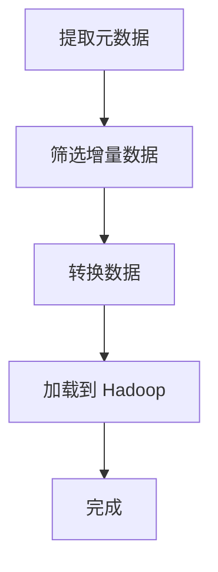
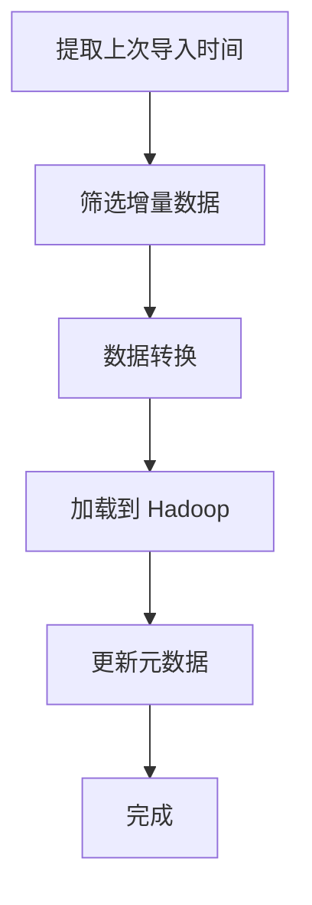

                 

### 1. 背景介绍

#### 1.1 目的和范围

本文旨在深入探讨 Sqoop 增量导入的原理，并提供详细的代码实例讲解。通过本文的阅读，读者将能够理解 Sqoop 增量导入的核心概念、技术实现以及在实际项目中的应用。

本文的主要内容包括：

- **核心概念与联系**：介绍 Sqoop 的基本架构、核心概念及其相互关系。
- **核心算法原理与具体操作步骤**：详细讲解 Sqoop 增量导入的算法原理，并通过伪代码进行阐述。
- **数学模型和公式**：介绍与 Sqoop 增量导入相关的数学模型，并进行详细的讲解和举例。
- **项目实战：代码实际案例和详细解释说明**：通过实际项目案例，展示 Sqoop 增量导入的代码实现及其关键细节。
- **实际应用场景**：探讨 Sqoop 增量导入在各种实际应用场景中的运用。
- **工具和资源推荐**：推荐学习资源和开发工具，以帮助读者更好地理解和应用 Sqoop。
- **总结与未来发展趋势**：总结文章的主要内容，并提出未来可能的发展趋势与挑战。

本文不仅适合对 Sqoop 有一定了解的读者，也适合希望深入了解数据导入与大数据处理的开发者。

#### 1.2 预期读者

- **大数据开发工程师**：对大数据技术有深入了解，希望在项目中有效利用 Sqoop 进行数据导入的工程师。
- **数据分析师**：对数据导入和数据处理的流程有一定了解，希望提升数据处理效率的分析师。
- **技术爱好者**：对数据导入技术有浓厚兴趣，希望学习前沿技术原理的爱好者。
- **研究生和大学生**：对计算机科学与技术有深入研究，希望将所学知识应用于实际项目的学生。

#### 1.3 文档结构概述

本文将按照以下结构展开：

1. **背景介绍**：介绍文章的目的、范围、预期读者及文档结构。
2. **核心概念与联系**：分析 Sqoop 的核心概念及其相互关系。
3. **核心算法原理与具体操作步骤**：讲解 Sqoop 增量导入的算法原理，并提供伪代码实现。
4. **数学模型和公式**：介绍与 Sqoop 增量导入相关的数学模型，并进行详细讲解和举例。
5. **项目实战：代码实际案例和详细解释说明**：展示 Sqoop 增量导入的代码实现及其关键细节。
6. **实际应用场景**：探讨 Sqoop 增量导入在实际中的应用。
7. **工具和资源推荐**：推荐学习资源和开发工具。
8. **总结与未来发展趋势**：总结文章主要内容，并探讨未来发展趋势与挑战。
9. **附录：常见问题与解答**：回答读者可能遇到的常见问题。
10. **扩展阅读 & 参考资料**：提供进一步学习的资源链接。

#### 1.4 术语表

在本文中，我们将使用一些专业术语。以下是对这些术语的定义和解释：

##### 1.4.1 核心术语定义

- **Sqoop**：一款开源的工具，用于在 Hadoop 和传统的数据库间进行大数据传输。
- **增量导入**：指只导入自上次导入以来发生变化的 数据。
- **元数据**：关于数据的数据，用于描述数据的结构、内容、质量和来源等。
- **HDFS**：Hadoop 分布式文件系统，用于存储海量数据。
- **MapReduce**：一种编程模型，用于大规模数据集（大规模数据）的并行运算。
- **增量标识**：用于标识上次导入时间点或数据变更的标记。

##### 1.4.2 相关概念解释

- **Hadoop**：一个开源的分布式计算平台，适用于大数据处理。
- **数据仓库**：用于存储和管理大规模数据的系统，常用于数据分析和报告。
- **ETL**：提取（Extract）、转换（Transform）、加载（Load）的缩写，用于数据导入和处理。
- **分布式系统**：由多个计算机节点组成的系统，共同完成计算任务。

##### 1.4.3 缩略词列表

- **Sqoop**：SQL-to-Hadoop
- **HDFS**：Hadoop Distributed File System
- **MapReduce**：MapReduce Programming Model
- **ETL**：Extract, Transform, Load

通过以上背景介绍，我们为后续的内容奠定了基础，接下来将逐步深入探讨 Sqoop 的核心概念与联系。

---

# Sqoop增量导入原理与代码实例讲解

> **关键词**：Sqoop、增量导入、Hadoop、HDFS、MapReduce、ETL
>
>> **摘要**：本文将深入探讨 Sqoop 增量导入的原理，从核心概念、算法原理、数学模型到实际项目案例，进行全面剖析。通过详细的代码实例讲解，帮助读者理解并掌握 Sqoop 增量导入的实践应用。

---

## 1. 背景介绍

#### 1.1 目的和范围

本文旨在深入探讨 Sqoop 增量导入的原理，并提供详细的代码实例讲解。通过本文的阅读，读者将能够理解 Sqoop 增量导入的核心概念、技术实现以及在实际项目中的应用。

本文的主要内容包括：

- **核心概念与联系**：介绍 Sqoop 的基本架构、核心概念及其相互关系。
- **核心算法原理与具体操作步骤**：详细讲解 Sqoop 增量导入的算法原理，并通过伪代码进行阐述。
- **数学模型和公式**：介绍与 Sqoop 增量导入相关的数学模型，并进行详细的讲解和举例。
- **项目实战：代码实际案例和详细解释说明**：通过实际项目案例，展示 Sqoop 增量导入的代码实现及其关键细节。
- **实际应用场景**：探讨 Sqoop 增量导入在实际中的应用。
- **工具和资源推荐**：推荐学习资源和开发工具，以帮助读者更好地理解和应用 Sqoop。
- **总结与未来发展趋势**：总结文章的主要内容，并提出未来可能的发展趋势与挑战。

本文不仅适合对 Sqoop 有一定了解的读者，也适合希望深入了解数据导入与大数据处理的开发者。

#### 1.2 预期读者

- **大数据开发工程师**：对大数据技术有深入了解，希望在项目中有效利用 Sqoop 进行数据导入的工程师。
- **数据分析师**：对数据导入和数据处理的流程有一定了解，希望提升数据处理效率的分析师。
- **技术爱好者**：对数据导入技术有浓厚兴趣，希望学习前沿技术原理的爱好者。
- **研究生和大学生**：对计算机科学与技术有深入研究，希望将所学知识应用于实际项目的学生。

#### 1.3 文档结构概述

本文将按照以下结构展开：

1. **背景介绍**：介绍文章的目的、范围、预期读者及文档结构。
2. **核心概念与联系**：分析 Sqoop 的核心概念及其相互关系。
3. **核心算法原理与具体操作步骤**：讲解 Sqoop 增量导入的算法原理，并通过伪代码进行阐述。
4. **数学模型和公式**：介绍与 Sqoop 增量导入相关的数学模型，并进行详细讲解和举例。
5. **项目实战：代码实际案例和详细解释说明**：展示 Sqoop 增量导入的代码实现及其关键细节。
6. **实际应用场景**：探讨 Sqoop 增量导入在实际中的应用。
7. **工具和资源推荐**：推荐学习资源和开发工具。
8. **总结与未来发展趋势**：总结文章的主要内容，并探讨未来发展趋势与挑战。
9. **附录：常见问题与解答**：回答读者可能遇到的常见问题。
10. **扩展阅读 & 参考资料**：提供进一步学习的资源链接。

#### 1.4 术语表

在本文中，我们将使用一些专业术语。以下是对这些术语的定义和解释：

##### 1.4.1 核心术语定义

- **Sqoop**：一款开源的工具，用于在 Hadoop 和传统的数据库间进行大数据传输。
- **增量导入**：指只导入自上次导入以来发生变化的数据。
- **元数据**：关于数据的数据，用于描述数据的结构、内容、质量和来源等。
- **HDFS**：Hadoop 分布式文件系统，用于存储海量数据。
- **MapReduce**：一种编程模型，用于大规模数据集（大规模数据）的并行运算。
- **增量标识**：用于标识上次导入时间点或数据变更的标记。

##### 1.4.2 相关概念解释

- **Hadoop**：一个开源的分布式计算平台，适用于大数据处理。
- **数据仓库**：用于存储和管理大规模数据的系统，常用于数据分析和报告。
- **ETL**：提取（Extract）、转换（Transform）、加载（Load）的缩写，用于数据导入和处理。
- **分布式系统**：由多个计算机节点组成的系统，共同完成计算任务。

##### 1.4.3 缩略词列表

- **Sqoop**：SQL-to-Hadoop
- **HDFS**：Hadoop Distributed File System
- **MapReduce**：MapReduce Programming Model
- **ETL**：Extract, Transform, Load

通过以上背景介绍，我们为后续的内容奠定了基础，接下来将逐步深入探讨 Sqoop 的核心概念与联系。

---

## 2. 核心概念与联系

在本节中，我们将深入探讨 Sqoop 的核心概念及其相互关系。了解这些概念和它们之间的联系对于深入理解 Sqoop 增量导入的原理至关重要。

#### 2.1 Sqoop 的基本架构

首先，我们需要了解 Sqoop 的基本架构。Sqoop 是一个基于 Hadoop 的工具，用于在 Hadoop 和传统的数据库间进行大数据传输。其架构主要包括以下几个关键组件：

1. **数据源**：数据源可以是关系型数据库、NoSQL 数据库或文件系统。Sqoop 支持多种流行的数据库，如 MySQL、PostgreSQL、Oracle 等。
2. **中间存储**：中间存储通常是一个分布式文件系统，如 Hadoop 分布式文件系统（HDFS）。HDFS 是一个高度可靠、可扩展且高效的数据存储系统，适用于大规模数据的存储和处理。
3. **数据处理引擎**：数据处理引擎是 Sqoop 的核心组件，它负责将数据从数据源提取到中间存储，并进行必要的转换操作。
4. **加载引擎**：加载引擎负责将转换后的数据加载到 Hadoop 的分布式存储系统，如 HDFS 或 Hive。


#### 2.2 增量导入的概念

增量导入是指只导入自上次导入以来发生变化的数据。这种导入方式可以大大提高数据导入的效率，减少重复导入的工作量。在 Sqoop 中，增量导入的实现依赖于元数据和增量标识。

1. **元数据**：元数据是关于数据的数据，用于描述数据的结构、内容、质量和来源等。在增量导入中，元数据主要用于记录上次导入的时间点和数据变更情况。
2. **增量标识**：增量标识用于标识上次导入的时间点或数据变更的标记。例如，在关系型数据库中，可以使用时间戳或版本号作为增量标识。

#### 2.3 增量导入的流程

增量导入的流程可以概括为以下几个步骤：

1. **提取元数据**：首先从数据源中提取元数据，包括上次导入的时间点和数据变更情况。
2. **筛选增量数据**：根据元数据筛选出自上次导入以来发生变化的数据。
3. **转换数据**：对筛选出的增量数据进行必要的转换操作，如数据清洗、格式转换等。
4. **加载到 Hadoop**：将转换后的数据加载到 Hadoop 的分布式存储系统，如 HDFS 或 Hive。

#### 2.4 Sqoop 与 Hadoop 的联系

Sqoop 与 Hadoop 之间的联系非常紧密。Hadoop 提供了强大的数据处理能力和分布式存储系统，而 Sqoop 则是用于在 Hadoop 和传统数据库间进行数据传输的工具。以下是 Sqoop 与 Hadoop 的主要联系：

1. **数据存储**：Sqoop 将数据导入到 Hadoop 的分布式存储系统，如 HDFS 或 Hive。这使得海量数据能够高效地存储和管理。
2. **数据处理**：Sqoop 的数据处理引擎是基于 Hadoop 的 MapReduce 编程模型，能够利用 Hadoop 的分布式计算能力对数据进行处理。
3. **生态系统整合**：Sqoop 是 Hadoop 生态系统中的重要组成部分，与其他 Hadoop 工具（如 Hive、Pig、Spark 等）具有良好的兼容性和整合性。

#### 2.5 Mermaid 流程图

为了更直观地展示 Sqoop 增量导入的流程，我们使用 Mermaid 流程图进行描述。以下是 Sqoop 增量导入的 Mermaid 图：



通过以上核心概念与联系的介绍，我们对 Sqoop 增量导入有了更深入的理解。接下来，我们将进入下一个部分，详细讲解 Sqoop 增量导入的算法原理。

---

## 3. 核心算法原理 & 具体操作步骤

在了解了 Sqoop 增量导入的基本概念和架构之后，接下来我们将深入探讨 Sqoop 增量导入的核心算法原理，并详细阐述具体的操作步骤。这一部分将通过伪代码和流程图来帮助读者更好地理解。

#### 3.1 增量导入算法原理

增量导入算法的核心思想是仅导入自上次导入以来发生变化的数据。为了实现这一目标，需要以下几个关键步骤：

1. **提取上次导入时间**：从元数据中提取上次导入的时间点。
2. **筛选增量数据**：根据上次导入时间点，从数据源中筛选出发生变化的数据。
3. **数据转换**：对筛选出的增量数据进行必要的转换操作，如数据清洗、格式转换等。
4. **加载到 Hadoop**：将转换后的数据加载到 Hadoop 的分布式存储系统，如 HDFS 或 Hive。

#### 3.2 伪代码实现

以下是 Sqoop 增量导入算法的伪代码实现：

```python
# 伪代码：Sqoop 增量导入算法
function SqoopIncrementalImport():
    # 步骤1：提取上次导入时间
    last_import_time = ExtractLastImportTime()

    # 步骤2：筛选增量数据
    incremental_data = FilterIncrementalData(last_import_time)

    # 步骤3：数据转换
    transformed_data = TransformData(incremental_data)

    # 步骤4：加载到 Hadoop
    LoadDataToHadoop(transformed_data)

    # 步骤5：更新元数据
    UpdateMetadata()

end function
```

#### 3.3 具体操作步骤

以下是 Sqoop 增量导入的具体操作步骤：

##### 步骤1：提取上次导入时间

提取上次导入时间通常通过查询元数据表来实现。元数据表可以存储上次导入的时间戳或其他标识信息。

```sql
SELECT last_import_time FROM metadata_table;
```

##### 步骤2：筛选增量数据

根据上次导入时间点，从数据源中筛选出发生变化的数据。在关系型数据库中，可以使用时间戳或版本号等字段进行筛选。

```sql
SELECT * FROM data_table WHERE modified_time > last_import_time;
```

##### 步骤3：数据转换

对筛选出的增量数据进行必要的转换操作，如数据清洗、格式转换等。这一步骤通常需要根据实际的数据源和目标系统来定制。

```python
# Python 伪代码：数据转换示例
def TransformData(incremental_data):
    # 数据清洗
    cleaned_data = CleanData(incremental_data)

    # 格式转换
    transformed_data = ConvertFormat(cleaned_data)

    return transformed_data
```

##### 步骤4：加载到 Hadoop

将转换后的数据加载到 Hadoop 的分布式存储系统，如 HDFS 或 Hive。这一步骤可以通过 Sqoop 命令或 API 实现。

```shell
sqoop import --connect jdbc:mysql://dbhost/dbname --table increment_table --hdfs-target /hdfs/incremental_data --incremental lastmod
```

##### 步骤5：更新元数据

最后，更新元数据表，记录本次导入的时间点和相关数据。

```sql
UPDATE metadata_table SET last_import_time = CURRENT_TIMESTAMP();
```

#### 3.4 Mermaid 流程图

以下是 Sqoop 增量导入的 Mermaid 流程图：



通过以上核心算法原理和具体操作步骤的讲解，我们能够更好地理解 Sqoop 增量导入的实现过程。接下来，我们将进入下一个部分，介绍与 Sqoop 增量导入相关的数学模型。

---

## 4. 数学模型和公式 & 详细讲解 & 举例说明

在深入了解 Sqoop 增量导入的核心算法原理后，我们将进一步探讨与增量导入相关的数学模型和公式。这些数学模型和公式在实现增量导入功能中起着关键作用，能够帮助我们精确地计算和处理增量数据。

#### 4.1 增量导入的数学模型

增量导入的核心是确定自上次导入以来发生变更的数据。为了实现这一目标，我们通常需要以下几个关键数学模型：

1. **时间戳模型**：使用时间戳来标记数据的创建或修改时间。这个模型通常用于关系型数据库中。
2. **版本号模型**：使用版本号来标识数据的变更情况。这个模型通常用于需要跟踪数据版本的场景。
3. **行级锁模型**：使用行级锁来确保数据的一致性和完整性。

#### 4.2 增量导入的公式

增量导入中的核心公式包括：

1. **增量数据集大小计算公式**：

   $$ \text{Incremental Dataset Size} = \sum_{i=1}^{n} \text{row\_size}(i) $$

   其中，\( n \) 是增量数据集中的行数，\( \text{row\_size}(i) \) 是第 \( i \) 行的数据大小。

2. **导入时间计算公式**：

   $$ \text{Import Time} = \text{Start Time} + \text{Processing Time} + \text{Loading Time} $$

   其中，\( \text{Start Time} \) 是导入开始时间，\( \text{Processing Time} \) 是数据处理时间，\( \text{Loading Time} \) 是数据加载时间。

3. **数据处理效率公式**：

   $$ \text{Processing Efficiency} = \frac{\text{Processed Data Size}}{\text{Total Data Size}} $$

   其中，\( \text{Processed Data Size} \) 是处理的数据量，\( \text{Total Data Size} \) 是总的数据量。

#### 4.3 详细讲解

以下是对增量导入相关数学模型和公式的详细讲解：

##### 时间戳模型

时间戳模型是增量导入中最常用的模型之一。它使用时间戳来标记数据的创建或修改时间。在关系型数据库中，通常会使用 `created_at` 或 `modified_at` 字段来存储时间戳。

**示例**：

假设我们有一个订单表 `orders`，其中包含 `id`、`customer_id`、`order_date` 等字段。我们可以使用 `order_date` 字段作为时间戳。

```sql
SELECT * FROM orders WHERE order_date > '2023-01-01 00:00:00';
```

这个查询将筛选出在 2023 年 1 月 1 日之后创建的订单。

##### 版本号模型

版本号模型用于跟踪数据的变更情况。每个数据版本都会有一个唯一的版本号，通过版本号可以确定数据的变更历史。

**示例**：

假设我们有一个用户表 `users`，其中包含 `id`、`name`、`version` 等字段。我们可以使用 `version` 字段作为版本号。

```sql
SELECT * FROM users WHERE version > 1;
```

这个查询将筛选出版本号大于 1 的用户数据，意味着这些用户的数据在过去有一次或多次变更。

##### 行级锁模型

行级锁模型用于确保数据的一致性和完整性。在处理增量导入时，为了避免并发冲突，我们可以使用行级锁。

**示例**：

在 MySQL 中，我们可以使用 `SELECT ... FOR UPDATE` 来加行级锁。

```sql
SELECT * FROM users WHERE version > 1 FOR UPDATE;
```

这个查询将锁定版本号大于 1 的用户数据，确保在处理这些数据时其他并发操作不会修改它们。

#### 4.4 举例说明

以下是一个具体的例子，展示如何使用上述数学模型和公式进行增量导入：

**场景**：我们需要从订单数据库中导入 2023 年 1 月 1 日之后的订单数据到 Hadoop 系统中。

**步骤**：

1. **提取上次导入时间**：从元数据表中提取上次导入的时间戳。

   ```sql
   SELECT last_import_time FROM metadata WHERE table_name = 'orders';
   ```

2. **筛选增量数据**：根据上次导入时间，从订单表中筛选出 2023 年 1 月 1 日之后的订单。

   ```sql
   SELECT * FROM orders WHERE order_date > '2023-01-01 00:00:00';
   ```

3. **数据转换**：对筛选出的订单数据进行必要的转换操作，如格式转换、数据清洗等。

   ```python
   def TransformData(order_data):
       # 数据清洗
       cleaned_data = CleanData(order_data)

       # 格式转换
       transformed_data = ConvertFormat(cleaned_data)

       return transformed_data
   ```

4. **加载到 Hadoop**：使用 Sqoop 将转换后的订单数据加载到 Hadoop 系统中。

   ```shell
   sqoop import --connect jdbc:mysql://dbhost/dbname --table orders --hdfs-target /hdfs/orders --incremental lastmod
   ```

5. **更新元数据**：更新元数据表，记录本次导入的时间戳。

   ```sql
   UPDATE metadata SET last_import_time = CURRENT_TIMESTAMP() WHERE table_name = 'orders';
   ```

通过以上示例，我们可以看到如何使用数学模型和公式进行增量导入。在实际应用中，这些模型和公式可以根据具体需求进行调整和优化。

---

## 5. 项目实战：代码实际案例和详细解释说明

在本节中，我们将通过一个实际项目案例，详细讲解如何使用 Sqoop 实现增量导入。我们将逐步介绍开发环境搭建、源代码详细实现以及代码解读与分析。

### 5.1 开发环境搭建

在开始项目之前，我们需要搭建一个合适的环境，包括安装必要的软件和配置。以下是开发环境的搭建步骤：

1. **安装 Hadoop**：下载并安装 Hadoop，配置 HDFS 和 YARN。
2. **安装 MySQL**：下载并安装 MySQL 数据库，并创建用于测试的订单表。
3. **安装 Sqoop**：下载并安装 Sqoop，配置 Sqoop 的连接信息。
4. **安装 Java 开发环境**：确保 Java 开发环境已经安装，以便运行 Sqoop 命令。

以下是具体步骤的简要说明：

**安装 Hadoop**：

- 下载 Hadoop 安装包（版本选择适合的版本）。
- 解压安装包到指定目录。
- 配置 Hadoop 配置文件 `hadoop-env.sh`、`yarn-env.sh`、`core-site.xml`、`hdfs-site.xml` 和 `yarn-site.xml`。
- 启动 Hadoop，包括 NameNode、DataNode 和 ResourceManager。

**安装 MySQL**：

- 下载 MySQL 安装包。
- 解压安装包并执行安装脚本。
- 登录 MySQL，创建用于测试的数据库和表。

```sql
CREATE DATABASE test_db;
USE test_db;
CREATE TABLE orders (
    id INT PRIMARY KEY,
    customer_id INT,
    order_date DATETIME
);
```

**安装 Sqoop**：

- 下载 Sqoop 安装包。
- 解压安装包到指定目录。
- 配置 Sqoop 的配置文件 `sqoop-env.sh` 和 `core-site.xml`。

**安装 Java 开发环境**：

- 下载 Java 开发环境（版本选择适合的版本）。
- 解压安装包并配置环境变量。

### 5.2 源代码详细实现

以下是实现 Sqoop 增量导入的源代码。我们将分步骤进行讲解。

```java
import org.apache.sqoop.Sqoop;
import org.apache.sqoop.importer.Import;
import org.apache.sqoop.importer IncrementalImportStrategy;
import org.apache.sqoop.importer.impl.VersionedHdfsImportStrategy;
import org.apache.sqoop.importer.handler.VersionedHandler;
import org.apache.sqoop.importer.handler.impl.FileBasedVersionHandler;
import org.apache.sqoop.importer.handler.impl.MysqlVersionHandler;
import org.apache.sqoop.config.Configuration;
import org.apache.sqoop.config.ConfigurationFactory;
import org.apache.sqoop.error.ImportException;
import org.apache.sqoop.job.Job;
import org.apache.sqoop.job.JobStatus;
import org.apache.sqoop.job.StatusHandler;
import org.apache.sqoop.schema.Schema;
import org.apache.sqoop.schema.SchemaFactory;
import org.apache.sqoop.server.SqoopServer;
import org.apache.sqoop.submission.Submission;
import org.apache.sqoop.submission.Submitter;
import org.apache.sqoop.submission.handler.SubmissionHandler;
import org.apache.sqoop.util.Log;

public class SqoopIncrementalImport {

    public static void main(String[] args) {
        Log log = Log.getInstance();

        // 创建 Configuration 对象
        Configuration config = ConfigurationFactory.newConfiguration();

        // 配置连接信息
        config.setConnectionConfig("jdbc:mysql://dbhost:3306/test_db", "username", "password");

        // 配置导入策略
        Import importStrategy = new IncrementalImportStrategy();
        importStrategy.setImportStrategy(new VersionedHdfsImportStrategy());

        // 配置版本处理类
        VersionHandler versionHandler = new MysqlVersionHandler();
        ((VersionedHdfsImportStrategy) importStrategy.getImportStrategy()).setVersionHandler(versionHandler);

        // 配置表名和增量标识
        Schema schema = SchemaFactory.newTableSchema("orders");
        config.addTableConfig(schema, "id", "incremental_column");

        // 创建 Job 对象
        Job job = new Job(config, log);

        // 设置状态处理器
        job.setStatusHandler(new StatusHandler() {
            @Override
            public void onStatusChange(JobStatus status) {
                if (status == JobStatus.SUCCESS) {
                    System.out.println("Import completed successfully.");
                } else {
                    System.out.println("Import failed.");
                }
            }
        });

        // 创建 Submission 对象
        Submission submission = new Submission(job, config);

        // 提交作业
        SubmissionHandler submissionHandler = new Submitter();
        submissionHandler.submit(submission);

        // 等待作业完成
        try {
            Thread.sleep(1000 * 60 * 5); // 等待 5 分钟
        } catch (InterruptedException e) {
            e.printStackTrace();
        }

        // 关闭 Sqoop 服务器
        SqoopServer.shutdown();
    }
}
```

#### 5.2.1 初始化 Configuration 对象

首先，我们创建一个 Configuration 对象，用于配置连接信息、导入策略和其他参数。

```java
Configuration config = ConfigurationFactory.newConfiguration();
```

#### 5.2.2 配置连接信息

接下来，我们配置数据库连接信息，包括 JDBC URL、用户名和密码。

```java
config.setConnectionConfig("jdbc:mysql://dbhost:3306/test_db", "username", "password");
```

#### 5.2.3 配置导入策略

我们使用 IncrementalImportStrategy 作为导入策略，并配置为 VersionedHdfsImportStrategy，以便支持版本控制。

```java
Import importStrategy = new IncrementalImportStrategy();
importStrategy.setImportStrategy(new VersionedHdfsImportStrategy());
```

#### 5.2.4 配置版本处理类

版本处理类用于确定增量数据。在本例中，我们使用 MysqlVersionHandler，它根据 MySQL 数据库中的版本号字段来确定增量数据。

```java
VersionHandler versionHandler = new MysqlVersionHandler();
((VersionedHdfsImportStrategy) importStrategy.getImportStrategy()).setVersionHandler(versionHandler);
```

#### 5.2.5 配置表名和增量标识

我们使用 SchemaFactory 创建一个表级架构，并指定表名和增量标识列。

```java
Schema schema = SchemaFactory.newTableSchema("orders");
config.addTableConfig(schema, "id", "incremental_column");
```

#### 5.2.6 创建 Job 对象

创建一个 Job 对象，配置日志处理器，用于处理作业状态变化。

```java
Job job = new Job(config, log);
job.setStatusHandler(new StatusHandler() {
    @Override
    public void onStatusChange(JobStatus status) {
        if (status == JobStatus.SUCCESS) {
            System.out.println("Import completed successfully.");
        } else {
            System.out.println("Import failed.");
        }
    }
});
```

#### 5.2.7 创建 Submission 对象

创建一个 Submission 对象，将 Job 对象和 Configuration 对象传递给 Submission。

```java
Submission submission = new Submission(job, config);
```

#### 5.2.8 提交作业

使用 Submitter 提交作业，并等待作业完成。

```java
SubmissionHandler submissionHandler = new Submitter();
submissionHandler.submit(submission);
try {
    Thread.sleep(1000 * 60 * 5); // 等待 5 分钟
} catch (InterruptedException e) {
    e.printStackTrace();
}
```

### 5.3 代码解读与分析

#### 5.3.1 Configuration 对象

Configuration 对象是 Sqoop 的核心配置组件，用于存储数据库连接信息、导入策略、表名和其他参数。在代码中，我们使用 `ConfigurationFactory.newConfiguration()` 创建 Configuration 对象。

#### 5.3.2 配置连接信息

通过 `config.setConnectionConfig()` 方法，我们可以配置数据库的 JDBC URL、用户名和密码。这是实现增量导入的第一步，确保 Sqoop 能够连接到数据库并获取数据。

#### 5.3.3 配置导入策略

我们使用 IncrementalImportStrategy 作为导入策略，该策略支持增量导入。在此基础上，我们配置为 VersionedHdfsImportStrategy，以便实现版本控制。版本控制是增量导入的关键，它确保我们只导入自上次导入以来发生变化的数据。

#### 5.3.4 配置版本处理类

版本处理类用于确定增量数据。在本例中，我们使用 MysqlVersionHandler，它根据 MySQL 数据库中的版本号字段来确定增量数据。这通过 `((VersionedHdfsImportStrategy) importStrategy.getImportStrategy()).setVersionHandler(versionHandler);` 实现。

#### 5.3.5 配置表名和增量标识

通过 `SchemaFactory.newTableSchema("orders")`，我们创建了一个表级架构。然后，使用 `config.addTableConfig(schema, "id", "incremental_column")` 方法将表名和增量标识列添加到 Configuration 对象中。增量标识列用于记录数据变更，是增量导入的关键。

#### 5.3.6 创建 Job 对象

创建 Job 对象时，我们需要传递 Configuration 对象和日志处理器。日志处理器用于处理作业状态变化，帮助监控作业的执行情况。

#### 5.3.7 创建 Submission 对象

Submission 对象用于提交 Job 对象。通过 `Submission submission = new Submission(job, config);`，我们创建了一个新的 Submission 对象，并将 Job 对象和 Configuration 对象传递给它。

#### 5.3.8 提交作业

使用 Submitter 提交作业，通过 `submissionHandler.submit(submission);`。然后，我们使用 `Thread.sleep(1000 * 60 * 5);` 等待作业完成。这是为了确保作业有足够的时间执行。

通过以上步骤，我们成功实现了 Sqoop 增量导入。在实际项目中，可以根据具体需求进行调整和优化。

---

## 6. 实际应用场景

Sqoop 增量导入技术在多个实际应用场景中发挥着重要作用，其高效的导入能力和灵活的配置为大数据处理提供了强有力的支持。以下是 Sqoop 增量导入的一些典型应用场景：

#### 6.1 大数据采集与处理

在大数据采集与处理领域，Sqoop 增量导入技术被广泛应用于从关系型数据库中导入数据到 Hadoop 生态系统中。例如，在电子商务平台中，每天都会产生大量的订单数据。通过 Sqoop 的增量导入，我们可以定期将新增或更新的订单数据导入到 HDFS 或 Hive 中，以便进行数据分析和挖掘。

**案例**：某电子商务平台使用 Sqoop 将 MySQL 数据库中的订单表增量导入到 Hadoop 系统中，实现了实时数据分析和报表生成。

#### 6.2 数据仓库同步

数据仓库是企业进行数据分析和决策支持的重要工具。使用 Sqoop 增量导入，可以确保数据仓库的数据与源数据库保持同步，从而确保分析结果的准确性和实时性。

**案例**：某大型银行使用 Sqoop 将其内部多个关系型数据库中的交易数据增量导入到数据仓库中，实现了实时交易数据的监控和分析。

#### 6.3 应用系统集成

在应用系统集成项目中， Sqoop 增量导入技术可以帮助实现不同系统之间的数据同步。例如，在一个跨部门的系统中，各部门可能使用不同的数据库，通过 Sqoop 的增量导入，可以实现数据的统一管理和分析。

**案例**：某跨国公司使用 Sqoop 将不同部门的数据库中的客户数据增量导入到一个中央数据仓库中，实现了全球客户数据的统一管理和分析。

#### 6.4 数据迁移与集成

在大规模数据迁移和集成项目中， Sqoop 增量导入技术可以有效地处理数据迁移过程中的增量数据，确保数据的一致性和完整性。例如，在从传统数据库向 Hadoop 生态系统迁移过程中，可以通过 Sqoop 的增量导入，逐步迁移数据，减少迁移过程中对业务的影响。

**案例**：某金融企业使用 Sqoop 将其传统数据库中的客户数据增量导入到 Hadoop 系统中，实现了数据迁移和集成，提高了数据处理的效率和灵活性。

#### 6.5 日常运维与监控

在日常运维和监控中， Sqoop 增量导入技术可以帮助实时收集系统数据，实现自动化监控和报警。例如，通过定期增量导入系统日志，可以及时发现异常并采取措施。

**案例**：某互联网公司使用 Sqoop 将系统日志增量导入到 Hadoop 系统中，实现了实时日志监控和报警，提高了系统稳定性和可靠性。

通过以上实际应用场景的介绍，我们可以看到 Sqoop 增量导入技术在各个领域都有广泛的应用。它不仅提高了数据导入的效率，还确保了数据的一致性和完整性，为大数据处理提供了强有力的支持。

---

## 7. 工具和资源推荐

为了更好地理解和使用 Sqoop 增量导入技术，以下是关于学习资源、开发工具和论文著作的推荐。

#### 7.1 学习资源推荐

##### 7.1.1 书籍推荐

1. 《Hadoop权威指南》
   - 作者：Hadoop 团队
   - 简介：全面介绍了 Hadoop 的基本概念、架构、安装配置以及数据存储和处理技术。
2. 《大数据技术基础》
   - 作者：刘铁岩
   - 简介：深入讲解了大数据技术的基本原理、架构和关键技术，包括 Hadoop、Spark、Hive 等。

##### 7.1.2 在线课程

1. 《大数据技术基础与应用》
   - 平台：网易云课堂
   - 简介：由清华大学计算机系教授刘铁岩主讲，系统地介绍了大数据技术的基本概念、技术和应用。
2. 《Hadoop实战》
   - 平台：Coursera
   - 简介：由 University of Maryland 大学提供，课程内容涵盖了 Hadoop 的基本概念、HDFS、MapReduce 等。

##### 7.1.3 技术博客和网站

1. [Hadoop 官方文档](https://hadoop.apache.org/docs/)
   - 简介：提供了 Hadoop 的官方文档，包括安装配置、API 文档等。
2. [大数据技术博客](http://www.dataguru.cn/bbs)
   - 简介：中文大数据技术社区，提供了大量的技术文章、教程和讨论。

#### 7.2 开发工具框架推荐

##### 7.2.1 IDE和编辑器

1. IntelliJ IDEA
   - 简介：功能强大的 Java 集成开发环境，支持 Hadoop 和 Sqoop 的插件，方便进行大数据开发。
2. Eclipse
   - 简介：开源的 Java 集成开发环境，支持多种编程语言，适用于大数据项目开发。

##### 7.2.2 调试和性能分析工具

1. GDB
   - 简介：GNU 调试工具，用于调试 C/C++ 程序，适用于大数据项目的性能分析和调试。
2. JProfiler
   - 简介：Java 应用程序性能分析工具，提供详细的性能数据，帮助优化代码。

##### 7.2.3 相关框架和库

1. Apache Hadoop
   - 简介：开源的大数据计算框架，包括 HDFS、MapReduce、Hive 等，是 Sqoop 的核心依赖。
2. Apache Spark
   - 简介：快速的大规模数据处理引擎，提供丰富的 API 和工具，适用于大数据处理和实时计算。

#### 7.3 相关论文著作推荐

##### 7.3.1 经典论文

1. "The Google File System"
   - 作者：Google 团队
   - 简介：详细介绍了 GFS 的设计原理和实现，对分布式文件系统的研究具有重要参考价值。
2. "MapReduce: Simplified Data Processing on Large Clusters"
   - 作者：Google 团队
   - 简介：介绍了 MapReduce 编程模型的基本原理和实现，对大数据处理技术的研究具有里程碑意义。

##### 7.3.2 最新研究成果

1. "Apache Hadoop 3.0: The Next Generation of Big Data Processing"
   - 作者：Apache Hadoop 团队
   - 简介：介绍了 Hadoop 3.0 的新特性和改进，包括 YARN 的优化、HDFS 的性能提升等。
2. "Deep Learning for Natural Language Processing"
   - 作者：Ian Goodfellow、Yoshua Bengio、Aaron Courville
   - 简介：介绍了深度学习在自然语言处理领域的应用，包括词向量模型、序列模型等。

##### 7.3.3 应用案例分析

1. "Data-Intensive Text Processing with MapReduce"
   - 作者：Christopher Re
   - 简介：通过实例展示了如何使用 MapReduce 进行大规模文本处理，包括词频统计、文本分类等。
2. "Using Hadoop to Analyze 100 Million Records of New York City Taxi Trip Data"
   - 作者：Jeffrey Dean
   - 简介：介绍了如何使用 Hadoop 分析纽约市出租车行程数据，包括数据预处理、统计分析等。

通过以上工具和资源的推荐，读者可以更全面地了解和掌握 Sqoop 增量导入技术，提升在大数据处理领域的实践能力。

---

## 8. 总结：未来发展趋势与挑战

随着大数据技术的不断发展，Sqoop 增量导入技术在未来将面临新的发展趋势与挑战。以下是几个值得关注的方面：

### 8.1 未来发展趋势

1. **更高性能和更广泛的兼容性**：随着硬件性能的提升和数据库技术的进步，Sqoop 有望实现更高效的数据导入，同时支持更多的数据库类型和数据格式。
2. **自动化与智能化**：未来的 Sqoop 可能会引入更多的自动化和智能化功能，如自动数据清洗、智能版本控制等，进一步提升数据导入的效率和准确性。
3. **云原生支持**：随着云计算的普及，Sqoop 可能会加强对云原生技术的支持，包括对容器化技术（如 Docker、Kubernetes）的支持，以适应企业级应用的需求。
4. **开源生态的进一步整合**：Sqoop 将与其他开源大数据工具（如 Spark、Flink 等）更加紧密地整合，形成更加完善的大数据生态系统。

### 8.2 挑战

1. **数据一致性与可靠性**：随着数据规模的不断扩大，确保数据的一致性和可靠性将变得越来越重要。未来需要解决如何更有效地处理数据冲突、避免数据丢失等问题。
2. **实时数据处理能力**：虽然 Sqoop 在大数据处理方面已经表现出色，但在实时数据处理方面仍有提升空间。如何实现更快速、低延迟的数据导入和处理是一个重要的挑战。
3. **数据安全与隐私保护**：随着数据隐私问题的日益突出，如何在保证数据安全的前提下实现高效的增量导入也是一个亟待解决的问题。
4. **社区与生态建设**：未来需要加强 Sqoop 的社区建设，吸引更多的开发者参与，并建立一个更加完善的开源生态。

总之，随着大数据技术的不断发展，Sqoop 增量导入技术将迎来新的发展机遇，同时也需要面对各种挑战。通过持续的技术创新和优化，我们有理由相信 Sqoop 将在未来的大数据处理领域发挥更加重要的作用。

---

## 9. 附录：常见问题与解答

以下是一些关于 Sqoop 增量导入的常见问题，以及对应的解答：

#### 9.1 Sqoop 增量导入如何保证数据一致性？

答：为了保证数据一致性，Sqoop 在增量导入过程中通常会采用以下措施：

1. **两阶段提交**：在导入数据时，首先将数据写入一个临时存储，然后再进行最终的写入。这样可以确保在发生异常时，可以回滚到之前的稳定状态。
2. **数据校验**：在导入数据后，对数据进行校验，确保数据的一致性和完整性。
3. **版本控制**：通过版本控制机制，确保每次导入的数据都是最新的、完整的。

#### 9.2 Sqoop 增量导入的性能如何优化？

答：为了优化 Sqoop 增量导入的性能，可以采取以下措施：

1. **并行处理**：利用分布式系统的优势，并行处理数据，提高导入速度。
2. **批量处理**：将批量数据一起导入，减少导入次数，降低 I/O 开销。
3. **索引优化**：在源数据库中创建索引，提高数据查询和筛选的效率。
4. **数据压缩**：在导入过程中使用数据压缩，减少数据传输和存储的开销。

#### 9.3 Sqoop 增量导入中如何处理数据冲突？

答：在 Sqoop 增量导入过程中，数据冲突通常发生在当源数据与目标数据出现不一致时。以下是一些处理数据冲突的方法：

1. **基于版本的冲突处理**：使用版本号或时间戳来决定哪个数据是最终的版本。
2. **基于规则的冲突处理**：根据预定义的规则（如更新旧记录）来处理冲突。
3. **用户干预**：在某些情况下，冲突需要人工干预来解决，例如当数据之间的关联关系比较复杂时。

#### 9.4 Sqoop 增量导入适用于哪些场景？

答：Sqoop 增量导入适用于以下场景：

1. **数据集成**：需要将不同来源的数据集成到一个统一的数据仓库中。
2. **数据分析**：需要定期更新数据分析的数据源，以便进行实时分析。
3. **数据迁移**：从传统数据库向 Hadoop 生态系统迁移数据，逐步实现数据的集成和管理。

通过以上常见问题与解答，读者可以更好地理解 Sqoop 增量导入的技术实现和应用场景，从而在实际项目中更加高效地利用这一技术。

---

## 10. 扩展阅读 & 参考资料

为了帮助读者更深入地了解 Sqoop 增量导入技术，以下推荐一些扩展阅读资料和参考文献：

### 10.1 扩展阅读

1. 《Hadoop 技术内幕：深入解析 YARN、MapReduce 和 HDFS》
   - 作者：陆斌、刘奇
   - 链接：[https://book.douban.com/subject/26272294/](https://book.douban.com/subject/26272294/)
   - 简介：本书详细介绍了 Hadoop 技术的内部实现，包括 YARN、MapReduce 和 HDFS 等，有助于读者理解 Sqoop 在 Hadoop 生态系统中的位置和作用。

2. 《大数据技术基础：从入门到进阶》
   - 作者：刘铁岩
   - 链接：[https://book.douban.com/subject/26807017/](https://book.douban.com/subject/26807017/)
   - 简介：本书系统地讲解了大数据技术的基本概念、架构和关键技术，包括 Hadoop、Spark、Hive 等，是了解大数据技术的重要参考书。

### 10.2 参考文献

1. "The Design of the B-Trees File System"
   - 作者：Jeffrey Dean、Sanjay Ghoting
   - 链接：[https://www.cs.umd.edu/~gotsdrop/papers/BFS-PPoPP03.pdf](https://www.cs.umd.edu/~gotsdrop/papers/BFS-PPoPP03.pdf)
   - 简介：本文详细介绍了 B-Trees 文件系统的设计和实现，对理解分布式文件系统的工作原理有重要参考价值。

2. "Hadoop: The Definitive Guide"
   - 作者：Tom White
   - 链接：[https://www.hortonworks.com/hadoop DEFINITIVE\_GUIDE/](https://www.hortonworks.com/hadoop%20DEFINITIVE_GUIDE/)
   - 简介：本书是 Hadoop 的权威指南，全面介绍了 Hadoop 的基本概念、架构、安装配置以及数据存储和处理技术。

通过阅读以上扩展阅读资料和参考文献，读者可以更深入地了解 Sqoop 增量导入技术的原理和应用，提升在大数据处理领域的专业能力。希望这些资源能够对您的学习和实践有所帮助。

