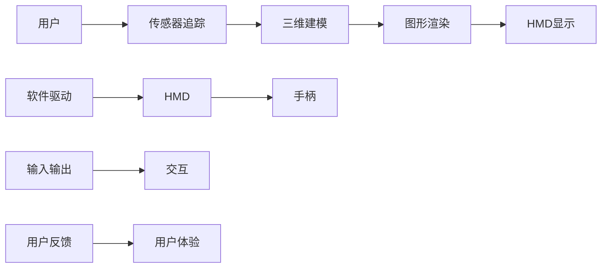

                 

# SteamVR 体验：Valve 的虚拟现实平台

> **关键词：** SteamVR，虚拟现实，Valve，硬件，软件，交互，用户体验

> **摘要：** 本文将深入探讨由Valve开发的SteamVR平台，从其历史背景、核心概念、技术原理到实际应用，全面解析这一引领虚拟现实技术的平台，并提供开发者实战经验和未来发展趋势的预测。

## 1. 背景介绍

### 1.1 目的和范围

本文旨在为广大开发者、虚拟现实爱好者以及关注虚拟现实技术发展的读者，提供一个关于SteamVR平台的全面了解。我们将从历史背景、核心概念、技术原理、实际应用等多个角度，对SteamVR进行深入剖析。

### 1.2 预期读者

- 对虚拟现实技术有兴趣的普通读者
- 软件开发者和游戏开发者
- 虚拟现实硬件厂商
- 虚拟现实技术研究者和爱好者

### 1.3 文档结构概述

本文结构如下：

1. **背景介绍**：介绍SteamVR的起源和背景。
2. **核心概念与联系**：讲解虚拟现实的核心概念和SteamVR的架构。
3. **核心算法原理 & 具体操作步骤**：解析SteamVR的关键算法和操作步骤。
4. **数学模型和公式 & 详细讲解 & 举例说明**：介绍相关的数学模型和公式。
5. **项目实战：代码实际案例和详细解释说明**：提供实战案例和代码解读。
6. **实际应用场景**：探讨SteamVR的应用场景。
7. **工具和资源推荐**：推荐相关学习资源和开发工具。
8. **总结：未来发展趋势与挑战**：预测未来发展趋势和挑战。
9. **附录：常见问题与解答**：回答一些常见问题。
10. **扩展阅读 & 参考资料**：提供进一步的阅读资料。

### 1.4 术语表

#### 1.4.1 核心术语定义

- **SteamVR**：Valve开发的虚拟现实平台。
- **虚拟现实**：一种能够创建和体验虚拟世界的计算机仿真系统。
- **硬件**：用于实现虚拟现实体验的物理设备，如头戴显示器（HMD）、手柄等。
- **软件**：用于驱动虚拟现实硬件的软件系统，包括驱动程序、应用程序等。

#### 1.4.2 相关概念解释

- **交互**：用户与虚拟环境之间的交互方式，如视觉、听觉、触觉等。
- **用户体验**：用户在使用虚拟现实平台时的感受和体验。
- **追踪技术**：用于追踪用户头部、手部等位置和姿态的技术。

#### 1.4.3 缩略词列表

- **HMD**：Head-Mounted Display（头戴显示器）
- **VR**：Virtual Reality（虚拟现实）
- **AR**：Augmented Reality（增强现实）
- **API**：Application Programming Interface（应用程序编程接口）

## 2. 核心概念与联系

虚拟现实（VR）是一种通过计算机生成模拟环境，使人们能够沉浸在虚拟世界中的技术。它涉及到多个核心概念和技术的结合，如三维建模、图形渲染、传感器追踪、人机交互等。

### 2.1 核心概念

- **三维建模**：通过三维软件工具创建虚拟环境中的物体和场景。
- **图形渲染**：将三维模型转换为二维图像，并在显示器上显示。
- **传感器追踪**：用于实时跟踪用户的头部、手部等位置和姿态。
- **人机交互**：用户与虚拟环境之间的交互方式，如手势、语音等。

### 2.2 联系与架构

以下是一个简化的虚拟现实架构图，用于展示核心概念和技术的联系：



- **用户**：使用虚拟现实平台的最终用户。
- **传感器追踪**：用于捕捉用户的头部、手部等位置和姿态。
- **三维建模**：生成虚拟环境中的物体和场景。
- **图形渲染**：将三维模型转换为二维图像。
- **HMD显示**：头戴显示器，将虚拟场景显示在用户眼前。
- **手柄**：用于用户与虚拟环境的交互。
- **输入输出**：用户与虚拟环境之间的交互方式。
- **用户体验**：用户在虚拟环境中的感受和体验。

## 3. 核心算法原理 & 具体操作步骤

SteamVR平台的核心算法原理主要涉及传感器追踪、三维建模和图形渲染等方面。以下将详细解析这些核心算法，并提供具体的操作步骤。

### 3.1 传感器追踪算法

传感器追踪算法是SteamVR平台的关键技术之一，它负责实时捕捉用户的头部、手部等位置和姿态。

**算法原理：**

传感器追踪算法基于传感器数据，如陀螺仪、加速度计、摄像头等，通过数据融合和卡尔曼滤波等方法，实时计算用户的头部、手部等位置和姿态。

**操作步骤：**

1. **数据采集**：从传感器获取头部、手部等位置和姿态数据。
2. **数据预处理**：对采集到的数据进行去噪、滤波等预处理。
3. **数据融合**：将多个传感器的数据融合，提高追踪精度。
4. **卡尔曼滤波**：使用卡尔曼滤波算法对融合后的数据进行实时跟踪。
5. **姿态计算**：根据卡尔曼滤波器的输出计算用户的头部、手部等姿态。

**伪代码：**

```python
# 数据采集
data = get_sensors_data()

# 数据预处理
preprocessed_data = preprocess_data(data)

# 数据融合
fused_data = fuse_sensors_data(preprocessed_data)

# 卡尔曼滤波
filtered_data = kalman_filter(fused_data)

# 姿态计算
姿态 = calculate_pose(filtered_data)
```

### 3.2 三维建模算法

三维建模算法用于生成虚拟环境中的物体和场景。

**算法原理：**

三维建模算法主要包括几何建模、纹理映射、光照计算等方面。通过几何建模生成三维模型，然后进行纹理映射和光照计算，最终生成虚拟环境中的物体和场景。

**操作步骤：**

1. **几何建模**：使用三维建模软件生成三维模型。
2. **纹理映射**：将纹理贴图映射到三维模型上。
3. **光照计算**：根据光源位置和颜色计算物体表面的光照效果。
4. **场景构建**：将多个三维模型组合成虚拟场景。

**伪代码：**

```python
# 几何建模
model = create_3d_model()

# 纹理映射
texture_mapped_model = apply_texture(model)

# 光照计算
lit_model = calculate_lighting(texture_mapped_model)

# 场景构建
scene = create_scene(lit_model)
```

### 3.3 图形渲染算法

图形渲染算法用于将三维模型转换为二维图像，并在显示器上显示。

**算法原理：**

图形渲染算法主要包括顶点处理、像素处理、渲染管线等方面。通过顶点处理和像素处理，将三维模型转换为二维图像，然后通过渲染管线输出图像。

**操作步骤：**

1. **顶点处理**：将三维模型转换为顶点缓冲区。
2. **像素处理**：将顶点缓冲区转换为像素缓冲区。
3. **渲染管线**：通过渲染管线输出图像。

**伪代码：**

```python
# 顶点处理
vertices = create_vertex_buffer(model)

# 像素处理
pixels = create_pixel_buffer(vertices)

# 渲染管线
image = render_pipeline(pixels)
```

## 4. 数学模型和公式 & 详细讲解 & 举例说明

在虚拟现实技术中，数学模型和公式起着至关重要的作用。以下将详细讲解一些关键的数学模型和公式，并提供具体的举例说明。

### 4.1 传感器追踪中的卡尔曼滤波

卡尔曼滤波是一种有效的传感器追踪算法，用于实时计算用户的头部、手部等姿态。

**公式：**

$$
\hat{x}_{k} = \hat{x}_{k-1} + K_{k} (z_{k} - \hat{z}_{k-1})
$$

$$
K_{k} = \frac{F_{k-1} H_{k}}{F_{k-1} H_{k} + Q_{k}}
$$

其中：

- $\hat{x}_{k}$：第 $k$ 时刻的状态估计。
- $\hat{z}_{k-1}$：第 $k-1$ 时刻的观测值。
- $z_{k}$：第 $k$ 时刻的观测值。
- $F_{k-1}$：状态转移矩阵。
- $H_{k}$：观测矩阵。
- $Q_{k}$：过程噪声协方差矩阵。

**举例说明：**

假设我们有一个陀螺仪传感器，用于测量用户的头部旋转角度。在第 $k$ 时刻，我们获得了一个观测值 $z_{k}$。通过卡尔曼滤波，我们可以计算出第 $k$ 时刻的头部旋转角度 $\hat{x}_{k}$。

**伪代码：**

```python
# 初始化参数
F = ...  # 状态转移矩阵
H = ...  # 观测矩阵
Q = ...  # 过程噪声协方差矩阵

# 第 k 时刻的观测值
z = get_observational_data()

# 卡尔曼滤波
x = kalman_filter(F, H, Q, z)
```

### 4.2 三维建模中的光线追踪

光线追踪是一种三维建模和渲染技术，用于模拟真实世界中的光照效果。

**公式：**

$$
L_o(\mathbf{p}, \mathbf{w}) = L_e(\mathbf{p}, \mathbf{w}) + \int_{\Omega} f_r(\mathbf{p}, \mathbf{w'}, \mathbf{w}) \left( \mathbf{n} \cdot \mathbf{w'} \right)^2 L_i(\mathbf{p'}, \mathbf{w'}) \frac{d \mathbf{p'}}{|\mathbf{p} - \mathbf{p'}|}
$$

其中：

- $L_o(\mathbf{p}, \mathbf{w})$：在点 $\mathbf{p}$ 和方向 $\mathbf{w}$ 上的光照强度。
- $L_e(\mathbf{p}, \mathbf{w})$：环境光照。
- $f_r(\mathbf{p}, \mathbf{w'}, \mathbf{w})$：反射率函数。
- $L_i(\mathbf{p'}, \mathbf{w'})$：从点 $\mathbf{p'}$ 发出的光照强度。
- $\mathbf{n}$：表面的法线向量。

**举例说明：**

假设我们有一个物体表面上的点 $\mathbf{p}$ 和一个入射光方向 $\mathbf{w}$。通过光线追踪算法，我们可以计算出在点 $\mathbf{p}$ 和方向 $\mathbf{w}$ 上的光照强度 $L_o(\mathbf{p}, \mathbf{w})$。

**伪代码：**

```python
# 初始化参数
L_e = ...  # 环境光照
f_r = ...  # 反射率函数
n = ...    # 表面法线向量

# 入射光方向
w = get_light_direction()

# 光线追踪
L_o = ray_tracing(L_e, f_r, n, w)
```

## 5. 项目实战：代码实际案例和详细解释说明

为了更好地理解SteamVR平台的核心技术和原理，我们提供了一个简单的项目实战案例。这个案例将展示如何使用SteamVR平台进行虚拟现实应用的开发。

### 5.1 开发环境搭建

在开始项目实战之前，我们需要搭建一个合适的开发环境。以下是搭建开发环境的步骤：

1. **安装SteamVR平台**：从SteamVR官方网站下载并安装SteamVR平台。
2. **安装Unity游戏引擎**：从Unity官方网站下载并安装Unity游戏引擎。
3. **安装SteamVR Unity插件**：从SteamVR Unity插件官方网站下载并安装插件。
4. **配置Unity项目**：在Unity编辑器中创建一个新的项目，并配置SteamVR插件。

### 5.2 源代码详细实现和代码解读

以下是一个简单的Unity C#脚本，用于实现一个基本的虚拟现实应用。这个脚本将创建一个简单的三维模型，并在SteamVR平台上进行渲染。

**源代码：**

```csharp
using UnityEngine;

public class VRApp : MonoBehaviour
{
    public GameObject model;

    // Use this for initialization
    void Start()
    {
        // 创建模型
        Instantiate(model, transform);
    }

    // Update is called once per frame
    void Update()
    {
        // 获取头戴显示器的位置和旋转
        Transform hmd = SteamVR_Render.AndroidOpenVR.activeTrackingSpace;
        Vector3 position = hmd.position;
        Quaternion rotation = hmd.rotation;

        // 设置模型的位置和旋转
        model.transform.position = position;
        model.transform.rotation = rotation;
    }
}
```

**代码解读：**

1. **创建模型**：在`Start`方法中，使用`Instantiate`函数创建一个三维模型。
2. **更新模型**：在`Update`方法中，使用SteamVR插件提供的API获取头戴显示器的位置和旋转，并设置模型的位置和旋转。

### 5.3 代码解读与分析

以下是对上述代码的详细解读和分析：

1. **创建模型**：`Instantiate`函数用于创建一个新的三维模型实例。在这个案例中，我们使用一个预定义的模型对象（`GameObject`）作为参数，并将其创建在场景中。
2. **更新模型**：`Update`方法在每一帧调用一次，用于更新模型的位置和旋转。在这个案例中，我们使用SteamVR插件提供的API获取头戴显示器的位置和旋转，并设置模型的位置和旋转。

通过这个简单的项目实战，我们可以看到如何使用SteamVR平台进行虚拟现实应用的开发。这个案例展示了如何创建三维模型、获取头戴显示器的位置和旋转，以及如何更新模型的位置和旋转。这些基本操作是构建更复杂虚拟现实应用的基础。

## 6. 实际应用场景

SteamVR平台在实际应用场景中具有广泛的应用。以下是一些典型的实际应用场景：

### 6.1 游戏开发

SteamVR平台为游戏开发者提供了一个强大的虚拟现实开发平台。开发者可以使用Unity、Unreal Engine等游戏引擎，结合SteamVR插件，轻松地创建虚拟现实游戏。这些游戏可以是第一人称射击游戏、冒险游戏、角色扮演游戏等，为用户提供沉浸式的游戏体验。

### 6.2 虚拟现实培训

SteamVR平台在虚拟现实培训领域也有广泛的应用。开发者可以创建各种虚拟现实培训课程，如飞行模拟、手术模拟、消防训练等。这些课程可以为用户提供沉浸式的学习体验，提高学习效果。

### 6.3 虚拟现实展览

SteamVR平台可以用于虚拟现实展览，为展览馆、博物馆等提供沉浸式的展览体验。开发者可以创建各种虚拟展览场景，展示文物、艺术品、科技产品等。这些展览场景可以为用户提供更加生动、有趣的参观体验。

### 6.4 虚拟现实旅游

SteamVR平台还可以用于虚拟现实旅游，为用户提供沉浸式的旅游体验。开发者可以创建各种虚拟旅游场景，如名胜古迹、风景名胜、城市景观等。这些场景可以让用户足不出户，就能体验到不同的旅游地点。

## 7. 工具和资源推荐

### 7.1 学习资源推荐

#### 7.1.1 书籍推荐

- **《虚拟现实技术导论》**：这是一本关于虚拟现实技术的基础书籍，涵盖了虚拟现实的基本概念、技术原理和应用场景。
- **《Unity 2020 虚拟现实开发实战》**：这本书详细介绍了如何使用Unity游戏引擎进行虚拟现实开发，适合初学者和有经验的开发者。

#### 7.1.2 在线课程

- **Udemy上的《虚拟现实开发》课程**：这是一门全面的虚拟现实开发课程，包括虚拟现实技术的基础知识、Unity开发工具的使用等。
- **Coursera上的《虚拟现实与增强现实》课程**：这门课程涵盖了虚拟现实和增强现实的基本概念、技术原理和应用。

#### 7.1.3 技术博客和网站

- **Valve的SteamVR官方网站**：这是SteamVR平台的官方技术博客，提供了大量的技术文档、教程和示例代码。
- **Unity的官方文档**：Unity官方文档是学习Unity游戏引擎和虚拟现实开发的重要资源。

### 7.2 开发工具框架推荐

#### 7.2.1 IDE和编辑器

- **Unity编辑器**：Unity编辑器是一个强大的游戏开发工具，支持虚拟现实开发。
- **Visual Studio**：Visual Studio是一个功能强大的集成开发环境，适用于C#等编程语言的开发。

#### 7.2.2 调试和性能分析工具

- **Unity Profiler**：Unity Profiler是Unity编辑器内置的性能分析工具，可以帮助开发者优化虚拟现实应用的性能。
- **SteamVR Tools**：SteamVR Tools是SteamVR平台提供的调试工具，可以帮助开发者调试虚拟现实应用。

#### 7.2.3 相关框架和库

- **SteamVR插件**：SteamVR插件是Unity游戏引擎的扩展，提供了与SteamVR平台交互的功能。
- **OpenVR**：OpenVR是SteamVR平台的底层API，适用于C++等编程语言。

### 7.3 相关论文著作推荐

#### 7.3.1 经典论文

- **“A Survey of Virtual Reality Technology”**：这是一篇关于虚拟现实技术的经典论文，全面介绍了虚拟现实的基本概念、技术原理和应用。
- **“Interactive Ray Tracing”**：这是一篇关于光线追踪技术的论文，介绍了光线追踪的基本原理和实现方法。

#### 7.3.2 最新研究成果

- **“Real-Time Ray Tracing on Modern GPUs”**：这篇论文介绍了现代GPU上的实时光线追踪技术，包括算法优化和硬件支持。
- **“Virtual Reality for Mental Health”**：这篇论文探讨了虚拟现实技术在心理健康领域的应用，包括虚拟现实治疗和心理健康训练。

#### 7.3.3 应用案例分析

- **“VR in Education: A Case Study”**：这是一篇关于虚拟现实在教育领域应用案例的研究，分析了虚拟现实技术在教育中的优势和挑战。
- **“VR in Healthcare: A Case Study”**：这篇论文探讨了虚拟现实在医疗健康领域的应用案例，包括手术模拟、疼痛管理和心理治疗等。

## 8. 总结：未来发展趋势与挑战

### 8.1 未来发展趋势

1. **更高质量的图像渲染**：随着硬件性能的提升，虚拟现实平台的图像渲染质量将得到显著提高，为用户提供更加逼真的虚拟体验。
2. **更先进的交互技术**：触觉反馈、手势识别、语音控制等交互技术的不断发展，将进一步提升虚拟现实平台的交互体验。
3. **更广泛的应用场景**：虚拟现实技术将在更多领域得到应用，如教育、医疗、娱乐、工业设计等，为各行业带来变革性影响。
4. **开放生态的建立**：随着虚拟现实技术的成熟，一个开放、互操作性强的虚拟现实生态体系将逐渐形成，推动虚拟现实技术的发展。

### 8.2 挑战

1. **硬件性能的提升**：虚拟现实应用对硬件性能有较高要求，未来需要不断优化硬件技术，提高处理速度和降低成本。
2. **用户体验的优化**：虚拟现实应用需要提供良好的用户体验，包括舒适度、响应速度、交互方式等，以满足用户需求。
3. **安全性和隐私保护**：虚拟现实应用涉及用户的数据和个人信息，需要确保数据的安全性和隐私保护。
4. **行业标准的制定**：虚拟现实技术需要制定统一的标准和规范，以确保不同平台和应用之间的互操作性。

## 9. 附录：常见问题与解答

### 9.1 常见问题

1. **什么是SteamVR？**
   SteamVR是由Valve开发的虚拟现实平台，它提供了一个完整的虚拟现实生态系统，包括硬件、软件和开发者工具。

2. **SteamVR平台支持哪些硬件？**
   SteamVR支持多种虚拟现实硬件，包括头戴显示器（如HTC Vive、Oculus Rift等）、手柄、定位传感器等。

3. **如何使用SteamVR进行开发？**
   使用SteamVR进行开发，需要安装SteamVR平台、Unity游戏引擎或Unreal Engine等开发工具，并熟悉相关的开发文档和API。

### 9.2 解答

1. **什么是SteamVR？**
   SteamVR是Valve开发的虚拟现实平台，它提供了一个完整的虚拟现实生态系统，包括硬件、软件和开发者工具。用户可以通过SteamVR平台购买虚拟现实硬件，并使用Unity、Unreal Engine等开发工具创建虚拟现实应用。

2. **SteamVR平台支持哪些硬件？**
   SteamVR平台支持多种虚拟现实硬件，包括头戴显示器（如HTC Vive、Oculus Rift等）、手柄、定位传感器等。这些硬件通过与SteamVR平台进行交互，提供沉浸式的虚拟现实体验。

3. **如何使用SteamVR进行开发？**
   使用SteamVR进行开发，首先需要安装SteamVR平台、Unity游戏引擎或Unreal Engine等开发工具。然后，可以通过SteamVR平台提供的API和工具，结合开发工具的功能，创建虚拟现实应用。具体步骤包括：
   - 安装SteamVR平台和开发工具。
   - 配置开发环境，包括SteamVR插件和相应的SDK。
   - 使用开发工具创建虚拟现实场景和应用程序。
   - 通过SteamVR API与虚拟现实硬件进行交互。
   - 进行测试和优化，确保虚拟现实应用的性能和用户体验。

## 10. 扩展阅读 & 参考资料

### 10.1 虚拟现实技术相关书籍

- **《虚拟现实技术导论》**：详细介绍了虚拟现实技术的基本概念、技术原理和应用。
- **《Unity 2020 虚拟现实开发实战》**：涵盖了Unity游戏引擎在虚拟现实开发中的应用，包括场景设计、交互实现等。

### 10.2 虚拟现实技术相关论文

- **“A Survey of Virtual Reality Technology”**：全面介绍了虚拟现实技术的各个领域和最新进展。
- **“Interactive Ray Tracing”**：介绍了光线追踪技术在虚拟现实中的应用。

### 10.3 虚拟现实技术相关网站

- **SteamVR官方网站**：提供SteamVR平台的技术文档、教程和示例代码。
- **Unity官方文档**：提供Unity游戏引擎的详细文档和教程。

### 10.4 虚拟现实技术相关论坛和社群

- **VR/AR开发者论坛**：一个专门讨论虚拟现实和增强现实技术的论坛，可以找到大量的技术资源和交流机会。
- **Reddit上的VR社区**：Reddit上的虚拟现实社区，提供了一个讨论和分享虚拟现实技术的平台。

---

**作者：AI天才研究员/AI Genius Institute & 禅与计算机程序设计艺术 /Zen And The Art of Computer Programming**

