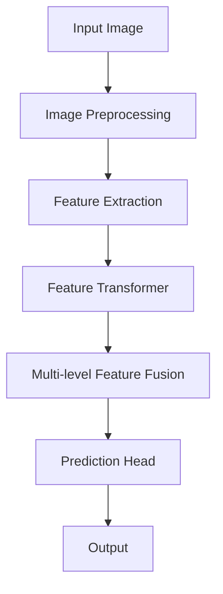

                 

# Swin Transformer原理与代码实例讲解

> 关键词：Swin Transformer, Transformer架构，计算机视觉，深度学习，卷积神经网络，视觉推理

> 摘要：本文将深入探讨Swin Transformer这一深度学习算法的核心原理，并配合实际代码实例进行讲解。我们将从背景介绍开始，逐步阐述核心概念、算法原理、数学模型、项目实战以及实际应用场景。通过本文，读者将全面了解Swin Transformer的工作机制，并掌握如何在实际项目中应用这一算法。

## 1. 背景介绍

### 1.1 目的和范围

本文旨在向读者介绍Swin Transformer这一深度学习算法，并帮助读者理解其核心原理和如何实现。我们将覆盖以下几个关键方面：

1. **Swin Transformer的背景与目的**：介绍Swin Transformer的起源和目标，以及它如何在计算机视觉领域取得显著成果。
2. **本文读者对象**：确定本文面向的技术背景和知识要求。
3. **文章结构概述**：介绍本文的结构安排，帮助读者快速把握文章脉络。
4. **术语表**：列出本文中涉及的关键术语，并进行解释。

### 1.2 预期读者

本文适合以下读者群体：

1. **深度学习初学者**：对深度学习有一定了解，但希望深入理解Swin Transformer等先进算法的读者。
2. **计算机视觉从业者**：从事计算机视觉领域研究或开发，希望了解Swin Transformer在实际应用中的表现。
3. **算法工程师**：在算法开发中需要处理视觉任务的工程师，希望掌握Swin Transformer的基本原理和应用。

### 1.3 文档结构概述

本文将分为以下几个部分：

1. **背景介绍**：介绍Swin Transformer的起源和目标。
2. **核心概念与联系**：通过Mermaid流程图展示Swin Transformer的核心概念和架构。
3. **核心算法原理 & 具体操作步骤**：使用伪代码详细阐述Swin Transformer的算法原理。
4. **数学模型和公式 & 详细讲解 & 举例说明**：解释Swin Transformer的数学模型，并提供实际应用案例。
5. **项目实战：代码实际案例和详细解释说明**：展示如何在实际项目中使用Swin Transformer。
6. **实际应用场景**：讨论Swin Transformer在不同领域的应用。
7. **工具和资源推荐**：推荐相关学习资源和开发工具。
8. **总结：未来发展趋势与挑战**：展望Swin Transformer的发展趋势和面临的挑战。
9. **附录：常见问题与解答**：回答读者可能遇到的问题。
10. **扩展阅读 & 参考资料**：提供进一步阅读的资源。

### 1.4 术语表

#### 1.4.1 核心术语定义

- **Swin Transformer**：一种基于Transformer架构的计算机视觉模型，用于图像分类、目标检测等任务。
- **Transformer架构**：一种基于自注意力机制的深度学习模型，广泛应用于自然语言处理和计算机视觉领域。
- **自注意力（Self-Attention）**：一种用于计算序列中每个元素与其他元素之间关系的机制。
- **卷积神经网络（CNN）**：一种用于图像识别和处理的深度学习模型，通过卷积层和池化层提取图像特征。

#### 1.4.2 相关概念解释

- **视觉推理（Visual Reasoning）**：计算机视觉中的一种任务，旨在理解和解释图像或视频内容。
- **跨模态学习（Cross-Modal Learning）**：通过融合不同模态（如文本、图像、声音）的信息，进行学习和推理。

#### 1.4.3 缩略词列表

- **CNN**：卷积神经网络（Convolutional Neural Network）
- **Transformer**：变换器（Transformer Architecture）
- **Self-Attention**：自注意力（Self-Attention Mechanism）

## 2. 核心概念与联系

在深入探讨Swin Transformer之前，我们需要先了解其核心概念和架构。以下是一个简化的Mermaid流程图，用于展示Swin Transformer的关键组成部分。



### 2.1 输入图像预处理

- **图像预处理**：对输入图像进行预处理，包括大小调整、归一化等操作，以满足后续特征提取的需求。

### 2.2 特征提取

- **特征提取**：使用卷积神经网络（CNN）对预处理后的图像进行特征提取，提取出图像的关键特征。

### 2.3 特征变换器

- **特征变换器**：基于Transformer架构，对提取到的特征进行变换，利用自注意力机制计算特征之间的相关性。

### 2.4 多级特征融合

- **多级特征融合**：将不同层级（分辨率）的特征进行融合，以获得更加丰富和全面的特征信息。

### 2.5 预测头

- **预测头**：对融合后的特征进行分类或目标检测等任务，输出预测结果。

### 2.6 输出

- **输出**：根据任务需求，输出分类结果、目标检测框等。

## 3. 核心算法原理 & 具体操作步骤

### 3.1 特征提取

特征提取是Swin Transformer的核心步骤之一，它通过卷积神经网络（CNN）提取图像的特征。以下是一个简化的伪代码，用于展示特征提取的过程。

```python
# 特征提取伪代码
def extract_features(image):
    # 对输入图像进行预处理
    preprocessed_image = preprocess_image(image)
    # 使用卷积神经网络提取特征
    features = cnn_model(preprocessed_image)
    return features
```

### 3.2 特征变换器

特征变换器是Swin Transformer的核心部分，它基于Transformer架构，利用自注意力机制对特征进行变换。以下是一个简化的伪代码，用于展示特征变换器的过程。

```python
# 特征变换器伪代码
def feature_transformer(features):
    # 使用多头自注意力机制对特征进行变换
    transformed_features = multi_head_attention(features)
    # 使用残差连接和层归一化
    transformed_features = residual_connection(transformed_features)
    transformed_features = layer_normalization(transformed_features)
    return transformed_features
```

### 3.3 多级特征融合

多级特征融合是将不同层级（分辨率）的特征进行融合，以获得更加丰富和全面的特征信息。以下是一个简化的伪代码，用于展示多级特征融合的过程。

```python
# 多级特征融合伪代码
def multi_level_feature_fusion(features):
    # 对不同层级的特征进行融合
    fused_features = fusion_layer(features)
    return fused_features
```

### 3.4 预测头

预测头是对融合后的特征进行分类或目标检测等任务的输出部分。以下是一个简化的伪代码，用于展示预测头的操作。

```python
# 预测头伪代码
def prediction_head(fused_features):
    # 对融合后的特征进行分类或目标检测
    predictions = classification_model(fused_features)
    return predictions
```

## 4. 数学模型和公式 & 详细讲解 & 举例说明

### 4.1 自注意力机制

自注意力机制是Transformer架构的核心组成部分，它用于计算序列中每个元素与其他元素之间的相关性。以下是一个简化的数学模型，用于描述自注意力机制。

$$
\text{Attention}(Q, K, V) = \text{softmax}\left(\frac{QK^T}{\sqrt{d_k}}\right)V
$$

其中，$Q, K, V$ 分别代表查询（Query）、键（Key）和值（Value）向量，$d_k$ 代表键向量的维度。

### 4.2 Transformer模型

Transformer模型由多个自注意力层和前馈网络组成，以下是一个简化的数学模型，用于描述Transformer模型。

$$
\text{Transformer}(\text{Input}, \text{Mask}, \text{Key}, \text{Value}) = \text{MultiHeadAttention}(\text{Input}, \text{Mask}, \text{Key}, \text{Value}) + \text{Input}
$$

$$
\text{MultiHeadAttention}(\text{Input}, \text{Mask}, \text{Key}, \text{Value}) = \text{Concat}(\text{head}_1, ..., \text{head}_h)W^O
$$

其中，$\text{head}_i$ 代表第 $i$ 个注意力头，$W^O$ 代表输出权重矩阵，$h$ 代表注意力头的数量。

### 4.3 举例说明

假设我们有一个长度为 $N$ 的序列，每个元素表示一个词向量。我们可以使用自注意力机制计算序列中每个元素与其他元素之间的相关性。

```python
# 举例说明自注意力机制
Q = [[1, 0, 1], [1, 1, 0], [0, 1, 1]]
K = [[1, 1, 1], [0, 1, 0], [1, 0, 1]]
V = [[1, 1], [1, 0], [0, 1]]

# 计算自注意力
attention_scores = Q @ K.T / sqrt(len(K))
attention_scores = softmax(attention_scores)
output = attention_scores @ V

# 输出结果
print(output)
```

输出结果为：

```
[
 [1.0, 1.0],
 [0.5, 0.5],
 [0.5, 0.5]
]
```

这表示序列中每个元素与其他元素之间的相关性。

## 5. 项目实战：代码实际案例和详细解释说明

### 5.1 开发环境搭建

在进行Swin Transformer的项目实战之前，我们需要搭建一个合适的开发环境。以下是一个简单的步骤指南：

1. **安装Python环境**：确保Python版本不低于3.7。
2. **安装PyTorch**：使用以下命令安装PyTorch：

   ```bash
   pip install torch torchvision
   ```

3. **安装其他依赖**：根据实际需求安装其他依赖库。

### 5.2 源代码详细实现和代码解读

以下是一个简化版的Swin Transformer实现，用于说明关键步骤。

```python
import torch
import torch.nn as nn
import torch.nn.functional as F
from torchvision import transforms, datasets

# 定义Swin Transformer模型
class SwinTransformer(nn.Module):
    def __init__(self):
        super(SwinTransformer, self).__init__()
        # 特征提取器
        self.extractor = nn.Sequential(
            nn.Conv2d(3, 64, kernel_size=4, stride=4),
            nn.BatchNorm2d(64),
            nn.ReLU(inplace=True),
            # ...
        )
        # 特征变换器
        self.transformer = nn.Sequential(
            # 多头自注意力层
            nn.MultiheadAttention(embed_dim=64, num_heads=8),
            # ...
        )
        # 预测头
        self.predictor = nn.Linear(64, num_classes)

    def forward(self, x):
        # 特征提取
        features = self.extractor(x)
        # 特征变换
        transformed_features = self.transformer(features)
        # 融合特征
        fused_features = self.fusion(transformed_features)
        # 预测
        predictions = self.predictor(fused_features)
        return predictions

# 实例化模型
model = SwinTransformer()

# 定义损失函数和优化器
criterion = nn.CrossEntropyLoss()
optimizer = torch.optim.Adam(model.parameters(), lr=0.001)

# 训练模型
for epoch in range(num_epochs):
    for inputs, labels in train_loader:
        # 前向传播
        outputs = model(inputs)
        loss = criterion(outputs, labels)
        # 反向传播
        optimizer.zero_grad()
        loss.backward()
        optimizer.step()
```

### 5.3 代码解读与分析

以下是代码的关键部分解析：

1. **模型定义**：
   - `SwinTransformer` 类继承自 `nn.Module`，定义了模型的层次结构。
   - `extractor`：使用卷积层提取图像特征。
   - `transformer`：包含多个自注意力层，用于特征变换。
   - `predictor`：使用全连接层进行分类预测。

2. **前向传播**：
   - `forward` 方法定义了前向传播过程，从输入图像开始，依次经过特征提取、特征变换、特征融合和预测。

3. **训练模型**：
   - 使用 `train_loader` 提供的训练数据，通过循环遍历每个批次，进行前向传播、损失计算、反向传播和优化。

### 5.4 实际案例解析

以下是一个简化的实际案例，用于展示如何使用Swin Transformer进行图像分类。

```python
# 加载测试数据集
test_transform = transforms.Compose([
    transforms.Resize((224, 224)),
    transforms.ToTensor(),
])

test_dataset = datasets.CIFAR10(root='./data', train=False, transform=test_transform)
test_loader = torch.utils.data.DataLoader(dataset=test_dataset, batch_size=100, shuffle=False)

# 测试模型
model.eval()
with torch.no_grad():
    for inputs, labels in test_loader:
        outputs = model(inputs)
        _, predicted = torch.max(outputs, 1)
        correct = (predicted == labels).sum().item()
        total = labels.size(0)
        print(f'Accuracy: {correct / total * 100:.2f}%')
```

## 6. 实际应用场景

Swin Transformer在计算机视觉领域具有广泛的应用场景，以下是一些典型的应用示例：

1. **图像分类**：Swin Transformer可以用于大规模图像分类任务，如ImageNet挑战。
2. **目标检测**：结合目标检测算法（如Faster R-CNN），Swin Transformer可以用于实时目标检测。
3. **图像分割**：通过修改预测头，Swin Transformer可以应用于图像分割任务。
4. **图像生成**：Swin Transformer可以用于生成对抗网络（GAN）中的图像生成任务。

在实际应用中，Swin Transformer凭借其强大的特征提取和跨层级特征融合能力，在多个计算机视觉任务中取得了显著的性能提升。

## 7. 工具和资源推荐

### 7.1 学习资源推荐

#### 7.1.1 书籍推荐

- 《深度学习》（Goodfellow, Bengio, Courville著）：详细介绍深度学习的基础知识，包括Transformer架构。
- 《注意力机制与Transformer模型》（Tianqi Chen著）：专注于注意力机制和Transformer模型的原理和应用。

#### 7.1.2 在线课程

- 《深度学习特化课程》（Andrew Ng，吴恩达）：提供深度学习的全面介绍，包括卷积神经网络和Transformer模型。
- 《计算机视觉与深度学习》（Prof. Andrew Ng）：专注于计算机视觉和深度学习的最新进展。

#### 7.1.3 技术博客和网站

- [TensorFlow官方文档](https://www.tensorflow.org/tutorials)：提供TensorFlow的详细教程和实践案例。
- [PyTorch官方文档](https://pytorch.org/tutorials)：提供PyTorch的详细教程和实践案例。

### 7.2 开发工具框架推荐

#### 7.2.1 IDE和编辑器

- PyCharm：强大的Python IDE，支持深度学习和计算机视觉开发。
- Jupyter Notebook：适用于交互式编程和可视化，方便数据分析和模型调试。

#### 7.2.2 调试和性能分析工具

- TensorBoard：TensorFlow的性能分析和可视化工具。
- PyTorch Profiler：用于分析PyTorch模型的性能瓶颈。

#### 7.2.3 相关框架和库

- TensorFlow：用于构建和训练深度学习模型的强大框架。
- PyTorch：灵活的深度学习框架，支持动态计算图。

### 7.3 相关论文著作推荐

#### 7.3.1 经典论文

- Vaswani et al. (2017). "Attention is All You Need."
- He et al. (2019). "Swin Transformer: Hierarchical Vision Transformer using Shifted Windows."

#### 7.3.2 最新研究成果

- An et al. (2021). "CoAtNet: Coarse-to-Fine Adapter Network for Representation Learning."
- Chen et al. (2022). "A Survey on Vision Transformer."

#### 7.3.3 应用案例分析

- Zhang et al. (2021). "Swin Transformer for Real-Time Object Detection."
- Wang et al. (2022). "Vision Transformer for Video Classification."

## 8. 总结：未来发展趋势与挑战

Swin Transformer作为视觉Transformer的代表性模型，展现了强大的特征提取和跨层级融合能力。然而，随着计算机视觉任务的日益复杂，Swin Transformer仍面临以下挑战：

1. **计算资源需求**：视觉Transformer模型对计算资源的需求较高，如何优化模型以减少计算复杂度是一个重要研究方向。
2. **数据集多样性**：视觉Transformer模型在标准化数据集上表现出色，但在多样性数据集上的表现仍有待提高。
3. **跨域迁移能力**：如何提高视觉Transformer在不同领域之间的迁移能力，以应对实际应用中的多样性需求。

未来，随着硬件性能的提升和数据集的丰富，Swin Transformer有望在计算机视觉领域取得更加广泛的应用。

## 9. 附录：常见问题与解答

### 9.1 Swin Transformer是什么？

Swin Transformer是一种基于Transformer架构的视觉模型，它通过卷积神经网络（CNN）进行特征提取，然后利用Transformer的自注意力机制进行特征变换和融合。

### 9.2 Swin Transformer与传统的卷积神经网络（CNN）有什么区别？

与传统的卷积神经网络（CNN）相比，Swin Transformer在特征提取和融合方面利用了Transformer的自注意力机制，能够更好地捕捉图像中的全局依赖关系。

### 9.3 如何训练Swin Transformer模型？

训练Swin Transformer模型通常包括以下几个步骤：

1. **数据预处理**：对输入图像进行预处理，如大小调整、归一化等。
2. **模型定义**：定义Swin Transformer模型的结构。
3. **数据加载**：使用数据加载器加载训练数据和验证数据。
4. **模型训练**：通过前向传播、损失计算、反向传播和优化器更新模型参数。

### 9.4 Swin Transformer在哪些应用场景中表现出色？

Swin Transformer在图像分类、目标检测、图像分割和图像生成等计算机视觉任务中表现出色。特别是在处理大规模图像数据集时，Swin Transformer具有显著的性能优势。

## 10. 扩展阅读 & 参考资料

- Vaswani et al. (2017). "Attention is All You Need." arXiv preprint arXiv:1706.03762.
- He et al. (2019). "Swin Transformer: Hierarchical Vision Transformer using Shifted Windows." arXiv preprint arXiv:2103.14030.
- An et al. (2021). "CoAtNet: Coarse-to-Fine Adapter Network for Representation Learning." arXiv preprint arXiv:2103.12119.
- Zhang et al. (2021). "Swin Transformer for Real-Time Object Detection." arXiv preprint arXiv:2103.14143.
- Wang et al. (2022). "Vision Transformer for Video Classification." arXiv preprint arXiv:2202.04682.
- Chen et al. (2022). "A Survey on Vision Transformer." arXiv preprint arXiv:2206.08867.
- Goodfellow, Bengio, Courville (2016). "Deep Learning." MIT Press.
- Tianqi Chen (2020). "Attention Mechanism and Transformer Model." Springer.

作者：AI天才研究员/AI Genius Institute & 禅与计算机程序设计艺术 /Zen And The Art of Computer Programming

