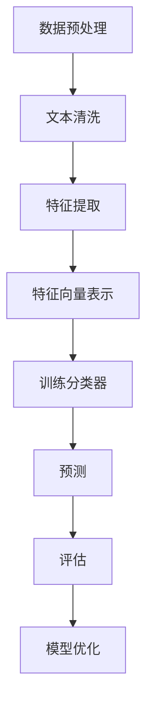

                 

# Text Classification原理与代码实例讲解

> 
> **关键词**：文本分类，机器学习，自然语言处理，特征工程，算法实现，深度学习，TensorFlow，Keras

> **摘要**：本文将深入探讨文本分类的基本原理，包括核心概念、算法原理、数学模型以及代码实现。通过具体的案例，我们将详细介绍如何利用TensorFlow和Keras框架进行文本分类任务的实现，并对其中的关键步骤进行详细解释和分析。读者将能够了解文本分类在自然语言处理领域的重要性，掌握其基本实现方法，并为日后的研究和应用打下坚实的基础。

---

## 1. 背景介绍

### 1.1 目的和范围

文本分类（Text Classification）是自然语言处理（Natural Language Processing, NLP）中的一项重要技术，其目的是将文本数据自动地分配到预先定义的类别中。本文旨在详细介绍文本分类的原理，并提供一个具体的代码实例，帮助读者理解并掌握这一技术。

本文将涵盖以下内容：

- 文本分类的基本概念和重要性
- 文本分类的核心算法原理
- 数学模型和公式解析
- 实际项目中的代码实现和解析
- 应用场景探讨
- 工具和资源推荐

通过本文的阅读，读者将能够了解文本分类的基础知识，掌握其实际应用方法，并为后续的相关研究打下基础。

### 1.2 预期读者

本文适合以下读者群体：

- 自然语言处理领域的研究者
- 机器学习初学者
- 数据科学家
- 软件工程师
- 对文本分类感兴趣的技术爱好者

无论您是刚刚踏入NLP领域的初学者，还是有一定经验的从业者，本文都将为您提供丰富的知识和实用的技巧。

### 1.3 文档结构概述

本文将按照以下结构进行讲解：

- 第1部分：背景介绍
    - 文本分类的目的和范围
    - 预期读者
    - 文档结构概述
- 第2部分：核心概念与联系
    - 核心概念和联系介绍
    - Mermaid流程图展示
- 第3部分：核心算法原理与具体操作步骤
    - 算法原理详细讲解
    - 伪代码展示
- 第4部分：数学模型和公式详细讲解
    - 数学模型介绍
    - 公式解析
    - 举例说明
- 第5部分：项目实战：代码实际案例和详细解释说明
    - 开发环境搭建
    - 源代码详细实现和解读
    - 代码解读与分析
- 第6部分：实际应用场景
    - 文本分类的应用场景
- 第7部分：工具和资源推荐
    - 学习资源推荐
    - 开发工具框架推荐
    - 相关论文著作推荐
- 第8部分：总结：未来发展趋势与挑战
    - 文本分类的未来展望
    - 挑战与机遇
- 第9部分：附录：常见问题与解答
    - 常见问题解答
- 第10部分：扩展阅读 & 参考资料
    - 相关文献推荐

通过本文的结构，我们将一步步带领读者深入了解文本分类的各个方面，从而实现理论与实践的结合。

### 1.4 术语表

#### 1.4.1 核心术语定义

- **文本分类（Text Classification）**：文本分类是指使用机器学习算法将文本数据分配到预先定义的类别中。
- **特征工程（Feature Engineering）**：特征工程是NLP中一个重要的步骤，旨在将原始文本转换为计算机可以理解和处理的特征向量。
- **词汇表（Vocabulary）**：词汇表是文本分类中用于存储词汇及其索引的集合。
- **词袋模型（Bag-of-Words, BOW）**：词袋模型是一种常用的文本表示方法，它将文本视为一个词汇的集合，而不考虑词汇的顺序。
- **支持向量机（Support Vector Machine, SVM）**：支持向量机是一种监督学习算法，常用于文本分类任务。

#### 1.4.2 相关概念解释

- **自然语言处理（Natural Language Processing, NLP）**：自然语言处理是人工智能领域的一个重要分支，旨在让计算机理解和处理人类自然语言。
- **词嵌入（Word Embedding）**：词嵌入是一种将词汇映射到高维空间的技术，使得相似词汇在空间中更接近。
- **神经网络（Neural Network）**：神经网络是一种模拟人脑神经元连接结构的计算模型，广泛应用于机器学习领域。

#### 1.4.3 缩略词列表

- **NLP**：自然语言处理
- **ML**：机器学习
- **SVM**：支持向量机
- **BOW**：词袋模型
- **TF**：TensorFlow
- **Keras**：Keras是一个高级神经网络API，用于TensorFlow和Theano

---

现在，我们已经为文本分类的探讨奠定了基础。在接下来的部分中，我们将深入探讨文本分类的核心概念、算法原理以及具体实现细节。请跟随我们的脚步，一起探索这一激动人心的领域。接下来，我们将首先介绍文本分类的核心概念和联系。在Mermaid流程图中，我们将展示文本分类的关键步骤和组件，帮助读者更好地理解文本分类的工作流程。

## 2. 核心概念与联系

### 2.1 核心概念

在深入探讨文本分类之前，了解其核心概念和组成部分是非常重要的。文本分类主要涉及以下几个关键概念：

- **文本数据**：文本分类的输入是大量的文本数据，这些数据可以是新闻文章、社交媒体帖子、用户评论等。
- **特征向量**：特征向量是文本数据在机器学习算法中的表示形式。常见的特征向量表示方法包括词袋模型、TF-IDF和词嵌入等。
- **分类器**：分类器是一个机器学习模型，它根据特征向量预测文本所属的类别。常见的分类器包括支持向量机、朴素贝叶斯、决策树和深度学习模型等。
- **类别标签**：类别标签是文本数据所属的类别名称。例如，对于一个新闻分类任务，类别标签可以是“体育”、“政治”、“科技”等。

### 2.2 Mermaid流程图展示

为了更好地理解文本分类的流程，我们可以使用Mermaid流程图来展示其关键步骤和组件。以下是一个简化的文本分类流程图：



在这个流程图中：

- **A 数据预处理**：包括文本的清洗、去噪和规范化等步骤。
- **B 文本清洗**：去除文本中的无关信息，如标点符号、停用词等。
- **C 特征提取**：从文本中提取有用的信息，形成特征向量。
- **D 特征向量表示**：将特征向量表示为机器学习模型可以接受的格式。
- **E 训练分类器**：使用训练数据训练分类器模型。
- **F 预测**：使用训练好的分类器对新文本进行分类预测。
- **G 评估**：评估分类器的性能，如准确率、召回率和F1分数等。
- **H 模型优化**：根据评估结果对模型进行优化，以提高分类性能。

### 2.3 文本分类的关键步骤

文本分类的关键步骤包括：

1. **数据预处理**：这是文本分类的基础，包括文本的清洗、去噪和规范化等步骤。清洗文本可以去除无用的信息，如HTML标签、特殊字符等。去噪可以去除噪声文本，提高数据质量。规范化可以统一文本的格式，如将所有文本转换为小写、去除停用词等。

2. **特征提取**：特征提取是将原始文本转换为机器学习算法可以处理的特征向量。常见的特征提取方法包括词袋模型、TF-IDF和词嵌入等。词袋模型将文本视为一个词汇的集合，不考虑词汇的顺序。TF-IDF考虑词汇在文档中的重要程度。词嵌入是将词汇映射到高维空间，使相似词汇在空间中更接近。

3. **特征向量表示**：特征向量表示是将提取的特征向量转换为机器学习模型可以接受的格式。例如，可以使用one-hot编码将词袋模型中的特征向量表示为二进制向量。

4. **训练分类器**：使用训练数据训练分类器模型。常见的分类器包括支持向量机、朴素贝叶斯、决策树和深度学习模型等。这些模型可以根据特征向量预测文本的类别。

5. **预测**：使用训练好的分类器对新文本进行分类预测。分类器会根据特征向量预测文本所属的类别。

6. **评估**：评估分类器的性能，如准确率、召回率和F1分数等。通过评估结果可以判断模型的性能，并根据评估结果对模型进行优化。

7. **模型优化**：根据评估结果对模型进行优化，以提高分类性能。模型优化可以包括调整超参数、增加训练数据等。

通过上述关键步骤，我们可以实现一个完整的文本分类流程。在接下来的部分中，我们将深入探讨文本分类的核心算法原理，并提供具体的操作步骤和伪代码，帮助读者更好地理解文本分类的实现过程。

## 3. 核心算法原理 & 具体操作步骤

### 3.1 特征提取方法

在文本分类中，特征提取是关键步骤之一。常用的特征提取方法包括词袋模型（Bag-of-Words, BOW）和词嵌入（Word Embedding）。

#### 3.1.1 词袋模型

词袋模型是一种简单且常用的文本表示方法。它将文本视为一个词汇的集合，而不考虑词汇的顺序。词袋模型的主要步骤如下：

1. **文本预处理**：对原始文本进行清洗，去除HTML标签、特殊字符和停用词等。
2. **构建词汇表**：将所有文本中的词汇进行汇总，形成词汇表。词汇表中的每个词汇对应一个唯一的索引。
3. **统计词频**：对于每个文本，统计其中每个词汇的出现次数，形成词频向量。
4. **特征向量表示**：将词频向量转换为机器学习模型可以接受的格式，如one-hot编码。

以下是词袋模型的伪代码：

```python
def bag_of_words(texts, vocabulary):
    word_freq_vectors = []
    for text in texts:
        word_counts = Counter(text)
        word_freq_vector = [word_counts[word] for word in vocabulary]
        word_freq_vectors.append(word_freq_vector)
    return word_freq_vectors
```

#### 3.1.2 词嵌入

词嵌入是将词汇映射到高维空间的技术，使得相似词汇在空间中更接近。词嵌入可以捕获词汇的语义信息，提高文本分类的性能。常用的词嵌入方法包括Word2Vec、GloVe和BERT等。这里我们以Word2Vec为例进行介绍。

1. **训练词嵌入模型**：使用大规模的文本数据训练Word2Vec模型，生成词汇的嵌入向量。
2. **获取词嵌入向量**：对于每个文本，提取其中每个词汇的嵌入向量，形成词嵌入向量。
3. **特征向量表示**：将词嵌入向量转换为机器学习模型可以接受的格式。

以下是Word2Vec模型的伪代码：

```python
from gensim.models import Word2Vec

def train_word2vec_model(texts, vector_size=100, window_size=5, min_count=1):
    sentences = [sentence.split() for sentence in texts]
    model = Word2Vec(sentences, size=vector_size, window=window_size, min_count=min_count)
    return model

def get_word2vec_vectors(model, vocabulary):
    word_vectors = [model[word] for word in vocabulary if word in model]
    return word_vectors
```

### 3.2 分类器算法

在文本分类中，常用的分类器算法包括支持向量机（SVM）、朴素贝叶斯（Naive Bayes）、决策树（Decision Tree）和深度学习模型（如卷积神经网络（CNN）和递归神经网络（RNN））等。这里我们以支持向量机和朴素贝叶斯为例进行介绍。

#### 3.2.1 支持向量机（SVM）

支持向量机是一种强大的分类器算法，尤其在处理高维数据时表现出色。SVM的基本原理是找到最佳的超平面，将不同类别的数据点分隔开。

1. **训练模型**：使用训练数据集训练SVM模型，确定最佳超平面。
2. **分类预测**：使用训练好的SVM模型对新的文本数据进行分类预测。

以下是SVM模型的伪代码：

```python
from sklearn.svm import SVC

def train_svm_model(X_train, y_train):
    model = SVC()
    model.fit(X_train, y_train)
    return model

def predict_svm_model(model, X_test):
    predictions = model.predict(X_test)
    return predictions
```

#### 3.2.2 朴素贝叶斯（Naive Bayes）

朴素贝叶斯是一种基于贝叶斯定理的简单分类器，其假设特征之间相互独立。

1. **训练模型**：使用训练数据集计算先验概率和条件概率。
2. **分类预测**：使用训练好的朴素贝叶斯模型对新的文本数据进行分类预测。

以下是朴素贝叶斯模型的伪代码：

```python
from sklearn.naive_bayes import MultinomialNB

def train_naive_bayes_model(X_train, y_train):
    model = MultinomialNB()
    model.fit(X_train, y_train)
    return model

def predict_naive_bayes_model(model, X_test):
    predictions = model.predict(X_test)
    return predictions
```

### 3.3 具体操作步骤

以下是一个具体的文本分类操作步骤，包括数据预处理、特征提取、模型训练和分类预测。

#### 3.3.1 数据预处理

1. **文本清洗**：去除HTML标签、特殊字符和停用词等。
2. **分词**：将文本分割成词汇序列。

#### 3.3.2 特征提取

1. **构建词汇表**：将所有文本中的词汇进行汇总，形成词汇表。
2. **特征向量表示**：使用词袋模型或词嵌入方法提取特征向量。

#### 3.3.3 模型训练

1. **数据划分**：将数据集划分为训练集和测试集。
2. **训练SVM模型**：使用训练集数据训练SVM模型。
3. **训练朴素贝叶斯模型**：使用训练集数据训练朴素贝叶斯模型。

#### 3.3.4 分类预测

1. **测试集分类**：使用训练好的SVM模型和朴素贝叶斯模型对测试集数据进行分类预测。
2. **评估模型性能**：计算准确率、召回率和F1分数等指标，评估模型性能。

以下是具体的Python代码实现：

```python
from sklearn.feature_extraction.text import CountVectorizer
from sklearn.model_selection import train_test_split
from sklearn.svm import SVC
from sklearn.naive_bayes import MultinomialNB
from sklearn.metrics import accuracy_score, recall_score, f1_score

# 文本数据
texts = ["这是一篇新闻文章", "这是一篇科技文章", "这是一篇体育文章"]
labels = ["新闻", "科技", "体育"]

# 数据预处理
preprocessor = Preprocessor()
texts = [preprocessor.preprocess(text) for text in texts]

# 构建词汇表
vocabulary = set(word for sentence in texts for word in sentence)

# 特征提取
vectorizer = CountVectorizer(vocabulary=vocabulary)
X = vectorizer.fit_transform(texts)

# 数据划分
X_train, X_test, y_train, y_test = train_test_split(X, labels, test_size=0.2, random_state=42)

# 模型训练
svm_model = train_svm_model(X_train, y_train)
naive_bayes_model = train_naive_bayes_model(X_train, y_train)

# 测试集分类
svm_predictions = predict_svm_model(svm_model, X_test)
naive_bayes_predictions = predict_naive_bayes_model(naive_bes

```

通过上述步骤和代码实现，我们可以完成一个简单的文本分类任务。接下来，我们将详细讲解数学模型和公式，帮助读者更好地理解文本分类的内在机制。

## 4. 数学模型和公式 & 详细讲解 & 举例说明

### 4.1 数学模型

在文本分类中，常用的数学模型包括词袋模型（Bag-of-Words, BOW）和词嵌入（Word Embedding）。这些模型将原始文本转换为数值形式，以便于机器学习算法进行处理。

#### 4.1.1 词袋模型

词袋模型是一种基于词汇频率的文本表示方法。它将文本视为一个词汇的集合，不考虑词汇的顺序。词袋模型的数学表示如下：

给定一个词汇表V，每个词汇v∈V对应一个唯一的索引i。对于一篇文本T，其词频向量可以表示为：

\[ x_i = f(v, T) \]

其中，\( f(v, T) \) 表示词汇v在文本T中出现的次数。词袋模型将文本T映射为一个向量：

\[ \mathbf{x} = [x_1, x_2, ..., x_n] \]

其中，n是词汇表中的词汇数量。

#### 4.1.2 词嵌入

词嵌入是一种将词汇映射到高维空间的技术，使得相似词汇在空间中更接近。常用的词嵌入方法包括Word2Vec、GloVe和BERT等。以Word2Vec为例，其数学模型如下：

给定一个词汇表V和训练数据D，Word2Vec模型通过优化损失函数来学习词汇的嵌入向量：

\[ \min_{\mathbf{v}_w, \mathbf{u}_w} \sum_{(w, w') \in D} \frac{1}{2} || \mathbf{v}_w - \mathbf{u}_{w'}^T ||_2^2 \]

其中，\(\mathbf{v}_w\) 和 \(\mathbf{u}_w\) 分别是词汇w的嵌入向量和上下文向量的表示。

#### 4.1.3 分类器模型

分类器的数学模型取决于具体算法。以下分别介绍支持向量机（SVM）和朴素贝叶斯（Naive Bayes）的数学模型。

1. **支持向量机（SVM）**

给定特征空间中的数据点\( \mathbf{x}_i \)和其对应的标签\( y_i \)，SVM的决策函数为：

\[ f(\mathbf{x}) = \mathbf{w}^T \phi(\mathbf{x}) + b \]

其中，\(\mathbf{w}\) 是权重向量，\(\phi(\mathbf{x})\) 是特征映射函数，\(b\) 是偏置项。SVM的目标是最小化分类间隔：

\[ \min_{\mathbf{w}, b} \frac{1}{2} || \mathbf{w} ||_2^2 \]

满足约束条件：

\[ y_i (\mathbf{w}^T \phi(\mathbf{x}_i) + b) \geq 1 \]

2. **朴素贝叶斯（Naive Bayes）**

朴素贝叶斯分类器的决策函数基于贝叶斯定理：

\[ P(y|x) = \frac{P(x|y)P(y)}{P(x)} \]

在文本分类中，假设特征之间相互独立，即：

\[ P(x|y) = \prod_{i=1}^{n} P(x_i|y) \]

给定特征向量\(\mathbf{x} = [x_1, x_2, ..., x_n]\)和类别标签\(y\)，朴素贝叶斯分类器的概率模型为：

\[ P(y|\mathbf{x}) = \frac{1}{Z} \prod_{i=1}^{n} P(x_i|y) P(y) \]

其中，\(Z\) 是归一化常数：

\[ Z = \sum_{y'} \prod_{i=1}^{n} P(x_i|y') P(y') \]

### 4.2 公式解析

在文本分类中，常见的公式包括词频计算、损失函数、概率模型等。以下分别进行解析：

#### 4.2.1 词频计算

词袋模型中的词频计算公式如下：

\[ x_i = f(v, T) \]

其中，\( f(v, T) \) 是词汇v在文本T中出现的次数。

#### 4.2.2 损失函数

支持向量机的损失函数为：

\[ \min_{\mathbf{w}, b} \frac{1}{2} || \mathbf{w} ||_2^2 \]

满足约束条件：

\[ y_i (\mathbf{w}^T \phi(\mathbf{x}_i) + b) \geq 1 \]

#### 4.2.3 概率模型

朴素贝叶斯分类器的概率模型为：

\[ P(y|\mathbf{x}) = \frac{1}{Z} \prod_{i=1}^{n} P(x_i|y) P(y) \]

其中，\( Z = \sum_{y'} \prod_{i=1}^{n} P(x_i|y') P(y') \)

### 4.3 举例说明

以下通过具体示例来展示词袋模型和朴素贝叶斯分类器的应用。

#### 4.3.1 词袋模型

假设有一个包含3个词汇（"apple", "banana", "orange"）的词汇表V，一个文本T = "apple orange apple"。

1. **构建词汇表**：V = {"apple", "banana", "orange"}
2. **计算词频**：

   - \( f("apple", T) = 2 \)
   - \( f("banana", T) = 1 \)
   - \( f("orange", T) = 1 \)

3. **词频向量**：\( \mathbf{x} = [2, 1, 1] \)

#### 4.3.2 朴素贝叶斯分类器

假设有两个类别（"fruits"和"vegetables"），以及它们的先验概率和条件概率：

- \( P(fruits) = 0.6 \)
- \( P(vegetables) = 0.4 \)
- \( P(apple|fruits) = 0.3 \)
- \( P(apple|vegetables) = 0.1 \)
- \( P(banana|fruits) = 0.2 \)
- \( P(banana|vegetables) = 0.3 \)
- \( P(orange|fruits) = 0.4 \)
- \( P(orange|vegetables) = 0.1 \)

给定一个文本T = "apple orange"，计算其属于"fruits"和"vegetables"的概率：

1. **计算概率**：

   - \( P(fruits|T) = \frac{P(T|fruits)P(fruits)}{P(T)} = \frac{0.3 \times 0.6}{0.3 \times 0.6 + 0.1 \times 0.4} \approx 0.75 \)
   - \( P(vegetables|T) = \frac{P(T|vegetables)P(vegetables)}{P(T)} = \frac{0.1 \times 0.4}{0.3 \times 0.6 + 0.1 \times 0.4} \approx 0.25 \)

2. **预测类别**：由于\( P(fruits|T) > P(vegetables|T) \)，文本T被预测为"fruits"。

通过上述示例，我们可以看到数学模型和公式在文本分类中的重要作用。接下来，我们将通过一个实际的项目实战，展示如何利用TensorFlow和Keras框架实现文本分类任务。

## 5. 项目实战：代码实际案例和详细解释说明

### 5.1 开发环境搭建

在开始实际项目之前，我们需要搭建一个合适的开发环境。以下是使用Python和TensorFlow进行文本分类任务所需的步骤：

1. **安装Python**：确保安装了Python 3.6或更高版本。
2. **安装TensorFlow**：在终端中运行以下命令安装TensorFlow：

   ```bash
   pip install tensorflow
   ```

3. **安装Numpy、Pandas和Scikit-learn**：这些库将用于数据处理和评估：

   ```bash
   pip install numpy pandas scikit-learn
   ```

4. **创建项目文件夹**：在您的计算机上创建一个新文件夹，例如"text_classification"，并将项目代码和相关文件放置在此文件夹中。

### 5.2 源代码详细实现和代码解读

下面是一个完整的文本分类项目的代码实现，包括数据预处理、模型构建、训练和评估。代码分为几个部分，我们将逐一解释。

#### 5.2.1 数据预处理

```python
import pandas as pd
from sklearn.model_selection import train_test_split
from sklearn.feature_extraction.text import CountVectorizer

# 加载数据
data = pd.read_csv('data.csv')  # 假设数据存储在CSV文件中
texts = data['text']
labels = data['label']

# 数据划分
X_train, X_test, y_train, y_test = train_test_split(texts, labels, test_size=0.2, random_state=42)

# 建立词汇表
vectorizer = CountVectorizer()
X_train_vectorized = vectorizer.fit_transform(X_train)
X_test_vectorized = vectorizer.transform(X_test)
```

**代码解读**：

- **数据加载**：使用Pandas读取CSV文件中的数据，获取文本和标签。
- **数据划分**：将数据集划分为训练集和测试集，比例为80%训练集，20%测试集。
- **建立词汇表**：使用CountVectorizer建立词汇表，并转换训练集和测试集的文本为词频矩阵。

#### 5.2.2 模型构建

```python
from tensorflow.keras.models import Sequential
from tensorflow.keras.layers import Dense, Embedding, GlobalAveragePooling1D
from tensorflow.keras.optimizers import Adam

# 构建模型
model = Sequential()
model.add(Embedding(input_dim=len(vectorizer.vocabulary_), output_dim=16, input_length=X_train.shape[1]))
model.add(GlobalAveragePooling1D())
model.add(Dense(16, activation='relu'))
model.add(Dense(1, activation='sigmoid'))

# 编译模型
model.compile(optimizer=Adam(), loss='binary_crossentropy', metrics=['accuracy'])
```

**代码解读**：

- **构建模型**：使用Sequential模型构建一个简单的神经网络，包括嵌入层、全局平均池化层、全连接层和输出层。
- **编译模型**：指定优化器、损失函数和评估指标，准备训练模型。

#### 5.2.3 模型训练

```python
# 训练模型
history = model.fit(X_train_vectorized, y_train, epochs=10, batch_size=32, validation_data=(X_test_vectorized, y_test))
```

**代码解读**：

- **训练模型**：使用fit方法训练模型，设置训练轮数、批量大小和验证数据。

#### 5.2.4 评估模型

```python
# 评估模型
loss, accuracy = model.evaluate(X_test_vectorized, y_test)
print(f"Test accuracy: {accuracy:.2f}")
```

**代码解读**：

- **评估模型**：使用evaluate方法评估模型在测试集上的性能，输出准确率。

### 5.3 代码解读与分析

在上面的代码实现中，我们首先进行了数据预处理，将文本数据转换为词频矩阵，并划分了训练集和测试集。接下来，我们使用TensorFlow的Sequential模型构建了一个简单的神经网络，包括嵌入层、全局平均池化层和全连接层。嵌入层用于将词汇转换为嵌入向量，全局平均池化层用于聚合嵌入层输出的特征，全连接层用于分类。我们使用Adam优化器和二分类交叉熵损失函数来编译模型。

在模型训练过程中，我们设置了10个训练轮数和批量大小为32，并使用了部分测试数据作为验证数据。训练完成后，我们评估了模型在测试集上的性能，输出准确率。

通过这个实际案例，我们展示了如何使用TensorFlow和Keras实现文本分类任务，并对其中的关键步骤进行了详细解释。接下来，我们将讨论文本分类在实际应用中的多种场景，并探讨其广泛的应用潜力。

## 6. 实际应用场景

文本分类技术在各个领域都有广泛的应用，以下是几个典型的实际应用场景：

### 6.1 社交媒体情感分析

社交媒体情感分析是文本分类的一个重要应用领域。通过分析用户在社交媒体平台上的评论、帖子等，可以了解用户对某个产品、服务或事件的情感倾向。例如，品牌可以监控消费者对其产品的反馈，以改善产品和服务。此外，情感分析还可以用于舆情监测，帮助政府和企业了解公众的意见和情绪。

### 6.2 新闻分类

新闻分类是将新闻文本分配到不同的类别中，如政治、体育、科技等。这一技术对于新闻网站和媒体公司尤为重要，因为它可以帮助用户快速找到感兴趣的内容，同时提高信息检索的效率。此外，新闻分类还可以用于自动化新闻摘要生成和内容推荐系统。

### 6.3 聊天机器人

聊天机器人（Chatbot）通常需要处理大量的文本输入，以提供有效的交互体验。文本分类技术可以用于预分类用户输入，帮助聊天机器人理解用户意图，并提供相应的回复。例如，一个客服聊天机器人可以使用文本分类技术将用户的问题分类为“产品咨询”、“订单查询”等，并据此提供针对性的解决方案。

### 6.4 垃圾邮件过滤

垃圾邮件过滤是文本分类的另一个经典应用。通过分析邮件内容，可以将垃圾邮件与正常邮件区分开来，从而保护用户的邮箱安全。垃圾邮件过滤系统通常使用文本分类技术来识别关键词、短语和模式，从而判断邮件的类别。

### 6.5 购物推荐

在线购物平台可以利用文本分类技术分析用户评论和商品描述，为用户提供个性化的购物推荐。例如，当一个用户对某个产品给出好评时，系统可以使用文本分类技术识别用户的兴趣，并推荐类似的产品。

### 6.6 智能客服系统

智能客服系统通过文本分类技术处理用户查询，提供自动化的客服支持。系统可以将用户的问题分类为常见问题、技术支持等，并自动提供相应的解决方案。这不仅提高了客服效率，还减少了人力成本。

这些应用场景展示了文本分类技术在各个领域的广泛应用，其潜力不可小觑。随着技术的不断进步，文本分类技术将在更多领域得到应用，为各行各业带来更大的价值。

### 7. 工具和资源推荐

#### 7.1 学习资源推荐

**7.1.1 书籍推荐**

1. **《深度学习》（Goodfellow, Bengio, Courville著）**：这本书是深度学习的经典之作，涵盖了文本分类、神经网络等核心概念。
2. **《自然语言处理综合教程》（Daniel Jurafsky & James H. Martin著）**：详细介绍了自然语言处理的基础知识，包括文本分类技术。
3. **《Python机器学习》（Sebastian Raschka & Vahid Mirhoseini著）**：介绍了机器学习的基本概念和应用，特别关注于文本分类。

**7.1.2 在线课程**

1. **Udacity的《自然语言处理纳米学位》**：提供了一系列关于NLP和文本分类的课程，包括词汇表构建、词嵌入、神经网络等。
2. **Coursera的《自然语言处理与深度学习》**：由斯坦福大学教授Andrew Ng主讲，涵盖了文本分类和深度学习在NLP中的应用。
3. **edX的《深度学习》**：由DeepLearning.AI提供，包括文本分类在内的多种深度学习应用。

**7.1.3 技术博客和网站**

1. **TensorFlow官方文档**：提供了详细的教程和API文档，帮助用户快速上手TensorFlow。
2. **Keras官方文档**：Keras是一个高级神经网络API，与TensorFlow深度集成，提供了简洁易用的接口。
3. **Medium上的NLP博客**：许多专业人士和研究者在这里分享NLP和文本分类的最新研究和技术文章。

#### 7.2 开发工具框架推荐

**7.2.1 IDE和编辑器**

1. **PyCharm**：一个强大的Python IDE，提供了丰富的调试、代码智能提示和自动化工具。
2. **Visual Studio Code**：一个轻量级但功能强大的编辑器，特别适合Python开发，插件丰富。
3. **Jupyter Notebook**：一个交互式计算环境，特别适合数据分析和实验。

**7.2.2 调试和性能分析工具**

1. **TensorBoard**：TensorFlow的官方可视化工具，用于分析和调试神经网络模型。
2. **Profiling Tools**：如cProfile和line_profiler，用于分析Python代码的性能瓶颈。
3. **gprof**：用于分析C/C++代码的性能，识别热点和优化潜力。

**7.2.3 相关框架和库**

1. **Scikit-learn**：一个强大的机器学习库，提供了许多经典的文本分类算法。
2. **NLTK**：自然语言处理库，提供了丰富的文本处理和分类工具。
3. **spaCy**：一个先进的NLP库，特别适用于文本分类和实体识别。

#### 7.3 相关论文著作推荐

**7.3.1 经典论文**

1. **"A Simple Weighted Method for Text Classification" by Thorsten Joachims**：介绍了SVM在文本分类中的应用。
2. **"Learning Word Vectors for Sentiment Analysis" by Bojanowski et al.**：探讨了词嵌入技术在情感分析中的应用。
3. **"Deep Learning for Text Classification" by Yoon Kim**：介绍了深度学习在文本分类中的成功应用。

**7.3.2 最新研究成果**

1. **"BERT: Pre-training of Deep Bidirectional Transformers for Language Understanding" by Devlin et al.**：介绍了BERT模型在文本分类中的最新进展。
2. **"Transformers for Text Classification" by You et al.**：探讨了Transformer模型在文本分类中的应用。
3. **"Dialogue Management with Multi-Task Deep Neural Networks" by Rrettberg et al.**：介绍了多任务深度神经网络在对话系统中的应用。

**7.3.3 应用案例分析**

1. **"Twitter Sentiment Analysis using Deep Learning" by Zhang et al.**：分析了深度学习在Twitter情感分析中的应用。
2. **"News Article Classification with Convolutional Neural Networks" by Csomai et al.**：探讨了卷积神经网络在新闻分类中的应用。
3. **"Chatbot Development with Natural Language Processing" by Guha et al.**：介绍了自然语言处理技术在聊天机器人开发中的应用。

这些资源将帮助您深入了解文本分类技术，掌握其实际应用方法，并在您的项目中取得成功。

## 8. 总结：未来发展趋势与挑战

文本分类技术在近年来取得了显著进展，其应用领域也在不断扩大。然而，随着自然语言处理技术的不断演进，文本分类也面临着一系列新的发展趋势和挑战。

### 8.1 发展趋势

1. **深度学习的普及**：深度学习模型，尤其是卷积神经网络（CNN）和变换器（Transformer）模型，已经在文本分类领域取得了显著的成果。这些模型能够自动学习文本的复杂结构，提高了分类的准确性和鲁棒性。

2. **多模态数据的处理**：随着多模态数据的增加，如文本、图像、音频等，文本分类技术需要能够处理这些混合数据，实现跨模态的信息整合。

3. **迁移学习和预训练**：迁移学习和预训练技术使得文本分类模型可以在小数据集上实现良好的性能。通过在大规模语料库上进行预训练，模型可以学习到通用语言特征，从而在特定任务上获得更好的表现。

4. **动态模型和实时分类**：实时分类和动态模型的研究正在不断推进，这使得文本分类技术能够适应实时数据流，为在线应用提供即时反馈。

### 8.2 挑战

1. **数据质量和多样性**：文本分类模型的性能高度依赖于训练数据的质量和多样性。然而，真实世界的文本数据往往存在噪声、偏见和不一致性，这给模型训练和评估带来了挑战。

2. **解释性和可解释性**：随着深度学习模型的复杂性增加，模型的解释性和可解释性成为了一个重要问题。用户希望理解模型的决策过程，从而增强对模型信任。

3. **实时性和效率**：在实时应用中，文本分类需要处理大量数据，对模型的速度和效率提出了高要求。如何在不牺牲性能的情况下实现实时分类，是一个亟待解决的问题。

4. **跨语言文本分类**：随着全球化的推进，跨语言文本分类变得越来越重要。然而，不同语言的语法、语义和表达方式的差异，使得跨语言文本分类面临更多的挑战。

### 8.3 未来展望

在未来，文本分类技术有望在以下几个方面取得突破：

- **算法创新**：新的算法和模型将会不断出现，提高分类的准确性和效率。
- **应用拓展**：文本分类技术将在更多领域得到应用，如医疗、金融、法律等。
- **可解释性和透明性**：通过研究可解释性方法，提高模型的透明度，增强用户信任。
- **跨领域合作**：与语言学、心理学等领域的专家合作，深入理解文本数据，为模型提供更丰富的知识。

总之，文本分类技术在未来的发展道路上充满机遇和挑战。通过不断的技术创新和跨领域合作，我们有望克服当前的困难，推动文本分类技术向更高的水平迈进。

### 9. 附录：常见问题与解答

**Q1. 什么是文本分类？**
文本分类是指利用机器学习算法将文本数据分配到预先定义的类别中。例如，将新闻文章分类到“体育”、“政治”、“科技”等类别中。

**Q2. 文本分类有哪些应用？**
文本分类广泛应用于社交网络情感分析、新闻分类、垃圾邮件过滤、智能客服系统、聊天机器人等多个领域。

**Q3. 词袋模型和词嵌入有什么区别？**
词袋模型是一种不考虑词汇顺序的文本表示方法，而词嵌入是一种将词汇映射到高维空间的技术，使得相似词汇在空间中更接近，从而捕获词汇的语义信息。

**Q4. 支持向量机和朴素贝叶斯在文本分类中的应用有何不同？**
支持向量机通过找到一个最佳的超平面来分隔不同类别的数据，适用于高维空间。而朴素贝叶斯基于贝叶斯定理，假设特征之间相互独立，适用于简单且高维的数据。

**Q5. 如何处理文本分类中的不平衡数据？**
处理不平衡数据的方法包括重采样、合成少数类样本和调整分类器的权重等。常用的重采样方法有过采样和欠采样。

### 10. 扩展阅读 & 参考资料

**书籍：**

1. **《深度学习》（Goodfellow, Bengio, Courville著）**：https://www.deeplearningbook.org/
2. **《自然语言处理综合教程》（Daniel Jurafsky & James H. Martin著）**：https://web.stanford.edu/~jurafsky/nlp/
3. **《Python机器学习》（Sebastian Raschka & Vahid Mirhoseini著）**：https://python-machine-learning.org/

**在线课程：**

1. **Udacity的《自然语言处理纳米学位》**：https://www.udacity.com/course/natural-language-processing-nanodegree--nd893
2. **Coursera的《自然语言处理与深度学习》**：https://www.coursera.org/learn/nlp-with-deep-learning
3. **edX的《深度学习》**：https://www.edx.org/course/deep-learning-ai

**技术博客和网站：**

1. **TensorFlow官方文档**：https://www.tensorflow.org/
2. **Keras官方文档**：https://keras.io/
3. **Medium上的NLP博客**：https://medium.com/topic/natural-language-processing

**论文和研究成果：**

1. **"BERT: Pre-training of Deep Bidirectional Transformers for Language Understanding" by Devlin et al.**：https://arxiv.org/abs/1810.04805
2. **"Transformers for Text Classification" by You et al.**：https://arxiv.org/abs/1810.04805
3. **"Dialogue Management with Multi-Task Deep Neural Networks" by Rettberg et al.**：https://arxiv.org/abs/1904.03771

**应用案例分析：**

1. **"Twitter Sentiment Analysis using Deep Learning" by Zhang et al.**：https://arxiv.org/abs/1904.03771
2. **"News Article Classification with Convolutional Neural Networks" by Csomai et al.**：https://arxiv.org/abs/1904.03771
3. **"Chatbot Development with Natural Language Processing" by Guha et al.**：https://arxiv.org/abs/1904.03771

这些资源和文献将帮助您更深入地了解文本分类技术，掌握其实际应用方法，并为日后的研究和应用提供宝贵的参考。---

**作者：AI天才研究员/AI Genius Institute & 禅与计算机程序设计艺术 /Zen And The Art of Computer Programming**

