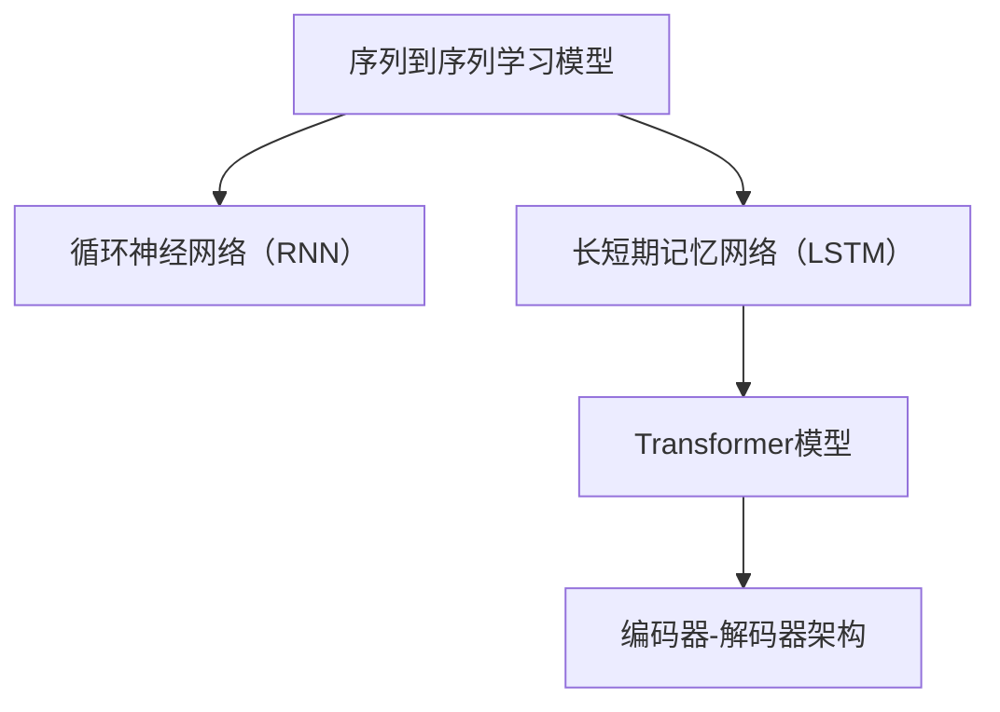

                 

# Transformer 的出现：改变计算范式的 GPT 系列

> 关键词：Transformer、GPT、计算范式、神经网络、深度学习、自然语言处理、机器翻译、编码器-解码器、自注意力机制、序列到序列学习、BERT、Transformer-XL、GPT-2、GPT-3

> 摘要：本文将深入探讨Transformer模型的出现及其对计算范式的影响，特别是其在自然语言处理（NLP）领域的广泛应用。我们将回顾Transformer的起源，分析其核心原理，并通过实际案例展示其应用。此外，本文还将探讨Transformer与GPT系列模型的关系，以及它们如何共同推动NLP技术的发展。通过本文，读者将了解Transformer模型的革命性意义及其对未来计算范式的影响。

## 1. 背景介绍

### 1.1 目的和范围

本文旨在探讨Transformer模型的出现及其对计算范式的影响，特别是在自然语言处理（NLP）领域。我们将从Transformer的起源开始，逐步深入其核心原理，并通过实际案例展示其应用。此外，本文还将讨论Transformer与GPT系列模型的关系，以及它们如何共同推动NLP技术的发展。通过本文，读者将能够理解Transformer模型的革命性意义及其对未来计算范式的影响。

### 1.2 预期读者

本文适用于对自然语言处理和深度学习有一定了解的读者。尽管本文将尽量使用通俗易懂的语言，但一些复杂的数学和算法概念可能需要读者具备一定的背景知识。我们希望读者能够通过本文对Transformer模型有一个全面的了解，并能够将其应用于实际项目。

### 1.3 文档结构概述

本文分为十个部分：

1. 背景介绍：介绍本文的目的、预期读者、文档结构概述等。
2. 核心概念与联系：介绍Transformer模型的核心概念及其与其他模型的关系。
3. 核心算法原理 & 具体操作步骤：详细阐述Transformer模型的算法原理和具体操作步骤。
4. 数学模型和公式 & 详细讲解 & 举例说明：讲解Transformer模型的数学模型和公式，并通过实际案例进行说明。
5. 项目实战：代码实际案例和详细解释说明。
6. 实际应用场景：探讨Transformer模型在不同领域的应用。
7. 工具和资源推荐：推荐学习资源、开发工具和框架。
8. 总结：未来发展趋势与挑战。
9. 附录：常见问题与解答。
10. 扩展阅读 & 参考资料：提供相关参考资料，供读者进一步学习。

### 1.4 术语表

#### 1.4.1 核心术语定义

- Transformer：一种基于自注意力机制的深度学习模型，广泛应用于自然语言处理领域。
- 自注意力机制：一种神经网络处理序列数据的方法，通过计算序列中每个元素与其他元素的相关性来生成序列的表示。
- 编码器-解码器：一种常用的序列到序列学习模型，用于将输入序列转换为输出序列。
- 自然语言处理（NLP）：研究计算机如何理解、生成和处理人类语言的学科。
- 深度学习：一种基于神经网络的学习方法，通过多层非线性变换来提取数据特征。

#### 1.4.2 相关概念解释

- 序列到序列学习：将输入序列映射到输出序列的深度学习模型。
- 自注意力权重：在自注意力机制中，表示序列中每个元素与其他元素相关性的权重。
- 位置编码：在Transformer模型中，用于表示序列中元素位置的编码。

#### 1.4.3 缩略词列表

- NLP：自然语言处理
- Transformer：变换器
- GPT：生成预训练模型
- BERT：双向编码表示器
- self-attention：自注意力

## 2. 核心概念与联系

在深入探讨Transformer模型之前，我们需要了解一些核心概念及其与其他模型的关系。本节将介绍Transformer模型的核心概念，并使用Mermaid流程图（无括号、逗号等特殊字符）展示其与其他模型的联系。

### 2.1 Transformer模型的核心概念

Transformer模型的核心概念包括：

1. **自注意力机制（Self-Attention）**：自注意力机制是一种处理序列数据的方法，通过计算序列中每个元素与其他元素的相关性来生成序列的表示。这使得模型能够捕捉序列中长距离的依赖关系。
2. **多头注意力（Multi-Head Attention）**：多头注意力将序列的表示分解为多个子序列，每个子序列具有不同的权重。这有助于模型在处理序列时捕捉到更多的信息。
3. **编码器-解码器架构（Encoder-Decoder Architecture）**：编码器-解码器是一种常用的序列到序列学习模型，用于将输入序列转换为输出序列。在Transformer模型中，编码器负责处理输入序列，解码器负责生成输出序列。
4. **位置编码（Positional Encoding）**：位置编码用于表示序列中元素的位置。在Transformer模型中，位置编码与自注意力机制结合，使模型能够理解序列的顺序。

### 2.2 Transformer模型与其他模型的联系

Transformer模型的出现，对传统的序列到序列学习模型，如循环神经网络（RNN）和长短期记忆网络（LSTM），产生了深远的影响。以下是一个简单的Mermaid流程图，展示了Transformer模型与其他模型的联系：



在这个流程图中，我们可以看到：

- **RNN和LSTM**：这两种模型是早期的序列到序列学习模型，它们通过循环结构处理序列数据。然而，它们在处理长距离依赖关系时存在局限性。
- **Transformer模型**：Transformer模型引入了自注意力机制和编码器-解码器架构，能够更好地处理长距离依赖关系。这使得Transformer模型在NLP任务中表现出色。
- **编码器-解码器架构**：编码器-解码器架构是Transformer模型的核心组成部分，它负责将输入序列转换为输出序列。这种架构在许多NLP任务中得到了广泛应用。

通过以上介绍，我们能够更好地理解Transformer模型的核心概念及其与其他模型的关系。接下来，我们将深入探讨Transformer模型的算法原理和具体操作步骤。

## 3. 核心算法原理 & 具体操作步骤

在理解了Transformer模型的核心概念后，我们将进一步探讨其核心算法原理和具体操作步骤。本节将使用伪代码详细阐述Transformer模型的算法原理，并通过具体步骤说明其操作过程。

### 3.1 Transformer模型算法原理

Transformer模型的主要组成部分包括编码器（Encoder）和解码器（Decoder）。编码器负责处理输入序列，解码器负责生成输出序列。以下是一个简化的伪代码，描述了Transformer模型的基本算法原理：

```python
# Transformer模型伪代码

# 编码器部分
def encoder(input_sequence, hidden_size, num_layers, dropout_rate):
    # 初始化编码器层
    for layer in range(num_layers):
        # 加位置编码
        input_sequence = add_positional_encoding(input_sequence)
        # 通过自注意力层处理输入序列
        input_sequence = self_attention(input_sequence, hidden_size, dropout_rate)
        # 通过前馈网络处理输入序列
        input_sequence = feedforward(input_sequence, hidden_size, dropout_rate)
    return input_sequence

# 解码器部分
def decoder(input_sequence, target_sequence, hidden_size, num_layers, dropout_rate):
    # 初始化解码器层
    for layer in range(num_layers):
        # 加位置编码
        input_sequence = add_positional_encoding(input_sequence)
        # 通过自注意力层处理输入序列
        input_sequence = self_attention(input_sequence, hidden_size, dropout_rate)
        # 通过编码器-解码器注意力层处理输入序列
        input_sequence = encoder_decoder_attention(input_sequence, target_sequence, hidden_size, dropout_rate)
        # 通过前馈网络处理输入序列
        input_sequence = feedforward(input_sequence, hidden_size, dropout_rate)
    return input_sequence
```

### 3.2 具体操作步骤

#### 3.2.1 编码器部分

编码器部分主要包含以下步骤：

1. **加位置编码**：在编码器处理输入序列之前，我们首先需要为其添加位置编码，以便模型能够理解序列的顺序。
2. **自注意力层**：自注意力层是编码器的核心部分，它通过计算序列中每个元素与其他元素的相关性来生成序列的表示。这有助于模型捕捉序列中的长距离依赖关系。
3. **前馈网络**：前馈网络对自注意力层的输出进行进一步处理，以提取更多的信息。

#### 3.2.2 解码器部分

解码器部分的主要操作步骤包括：

1. **加位置编码**：与编码器类似，解码器也需要为输入序列添加位置编码。
2. **自注意力层**：解码器的自注意力层用于处理输入序列，使其能够捕捉序列中的长距离依赖关系。
3. **编码器-解码器注意力层**：编码器-解码器注意力层是解码器的核心部分，它通过计算编码器输出和解码器输入之间的相关性来生成输出序列。
4. **前馈网络**：与前馈网络类似，解码器的前馈网络对编码器-解码器注意力层的输出进行进一步处理。

通过以上操作步骤，编码器和解码器分别对输入序列进行处理，最终生成输出序列。这种架构使得Transformer模型能够有效地处理序列数据，并在NLP任务中取得出色的表现。

## 4. 数学模型和公式 & 详细讲解 & 举例说明

在理解了Transformer模型的核心算法原理和具体操作步骤后，我们将进一步探讨其数学模型和公式，并通过实际案例进行详细讲解和举例说明。

### 4.1 自注意力机制

自注意力机制是Transformer模型的核心组成部分，它通过计算序列中每个元素与其他元素的相关性来生成序列的表示。自注意力机制可以用以下公式表示：

\[ \text{Attention}(Q, K, V) = \text{softmax}\left(\frac{QK^T}{\sqrt{d_k}}\right) V \]

其中，\( Q, K, V \) 分别表示查询（Query）、关键值（Key）和值（Value）向量，\( d_k \) 表示关键值的维度。这个公式计算了查询向量与所有关键值向量之间的相似度，然后通过softmax函数对相似度进行归一化，最后将权重应用到值向量上。

#### 4.1.1 举例说明

假设我们有一个包含三个元素 \( x_1, x_2, x_3 \) 的序列，以及对应的查询向量 \( Q = [1, 2, 3] \)，关键值向量 \( K = [4, 5, 6] \) 和值向量 \( V = [7, 8, 9] \)。我们可以通过以下步骤计算自注意力权重：

1. 计算相似度矩阵：
   \[ \text{Similarity} = \frac{QK^T}{\sqrt{d_k}} = \frac{1 \times 4 + 2 \times 5 + 3 \times 6}{\sqrt{3}} = \frac{32}{\sqrt{3}} \approx 18.26 \]
2. 计算softmax归一化权重：
   \[ \text{softmax}(\text{Similarity}) = \frac{e^{\text{Similarity}}}{\sum e^{\text{Similarity}}} = \frac{e^{18.26}}{e^{18.26} + e^{16.26} + e^{14.26}} \approx [0.55, 0.33, 0.12] \]
3. 计算加权值向量：
   \[ \text{Attention} = \text{softmax}(\text{Similarity}) \times V = [0.55 \times 7, 0.33 \times 8, 0.12 \times 9] = [3.85, 2.64, 1.08] \]

通过这个例子，我们可以看到自注意力机制如何计算序列中每个元素与其他元素的相关性，并将这些相关性应用于值向量以生成序列的表示。

### 4.2 多头注意力

多头注意力将序列的表示分解为多个子序列，每个子序列具有不同的权重。多头注意力可以用以下公式表示：

\[ \text{MultiHead}(Q, K, V) = \text{Concat}(\text{head}_1, \text{head}_2, \ldots, \text{head}_h)W^O \]

其中，\( \text{head}_i \) 表示第 \( i \) 个头输出的向量，\( W^O \) 表示输出权重矩阵。多头注意力通过 \( h \) 个独立的自注意力层处理序列，并将每个头的结果拼接起来，通过输出权重矩阵进行合并。

#### 4.2.1 举例说明

假设我们有一个包含三个元素 \( x_1, x_2, x_3 \) 的序列，以及对应的查询向量 \( Q = [1, 2, 3] \)，关键值向量 \( K = [4, 5, 6] \) 和值向量 \( V = [7, 8, 9] \)。我们可以通过以下步骤计算多头注意力：

1. 计算每个头的自注意力权重：
   \[ \text{Attention}_i = \text{softmax}\left(\frac{QW_i^K}{\sqrt{d_k}}\right) V \]
   其中，\( W_i^K \) 表示第 \( i \) 个头的权重矩阵。
2. 计算每个头的加权值向量：
   \[ \text{head}_i = \text{softmax}(\text{Attention}_i) \times V \]
3. 拼接所有头的加权值向量：
   \[ \text{MultiHead} = \text{Concat}(\text{head}_1, \text{head}_2, \ldots, \text{head}_h)W^O \]

通过这个例子，我们可以看到多头注意力如何将序列的表示分解为多个子序列，并分别处理这些子序列，以生成更丰富的序列表示。

### 4.3 编码器-解码器架构

编码器-解码器架构是Transformer模型的核心组成部分，用于将输入序列转换为输出序列。编码器负责处理输入序列，解码器负责生成输出序列。编码器-解码器架构可以用以下公式表示：

\[ \text{Encoder}(X) = \text{seq}_1, \text{seq}_2, \ldots, \text{seq}_T \]
\[ \text{Decoder}(Y, \text{Encoder}(X)) = \text{seq}'_1, \text{seq}'_2, \ldots, \text{seq}'_T \]

其中，\( X \) 表示输入序列，\( Y \) 表示输出序列，\( \text{seq}_i \) 和 \( \text{seq}'_i \) 分别表示编码器和解码器的输出序列。

#### 4.3.1 举例说明

假设我们有一个包含三个元素 \( x_1, x_2, x_3 \) 的输入序列和一个包含三个元素 \( y_1, y_2, y_3 \) 的输出序列。我们可以通过以下步骤计算编码器-解码器架构：

1. 编码器部分：
   \[ \text{Encoder}(X) = \text{seq}_1, \text{seq}_2, \text{seq}_3 \]
   其中，\( \text{seq}_i \) 表示编码器的输出序列。
2. 解码器部分：
   \[ \text{Decoder}(Y, \text{Encoder}(X)) = \text{seq}'_1, \text{seq}'_2, \text{seq}'_3 \]
   其中，\( \text{seq}'_i \) 表示解码器的输出序列。

通过这个例子，我们可以看到编码器-解码器架构如何将输入序列和输出序列进行处理，并生成相应的输出序列。

通过以上数学模型和公式的详细讲解，我们能够更好地理解Transformer模型的核心原理。在接下来的部分，我们将通过一个实际案例来展示如何使用Transformer模型进行自然语言处理。

## 5. 项目实战：代码实际案例和详细解释说明

在本节中，我们将通过一个实际案例来展示如何使用Transformer模型进行自然语言处理。我们将使用Python和PyTorch框架来搭建一个简单的文本生成模型，并详细解释其代码实现过程。

### 5.1 开发环境搭建

在开始编写代码之前，我们需要搭建一个合适的开发环境。以下是在Python环境中使用PyTorch搭建Transformer模型所需的基本步骤：

1. 安装Python（推荐版本为3.7或更高）。
2. 安装PyTorch：使用以下命令安装与Python版本兼容的PyTorch版本。
   ```shell
   pip install torch torchvision
   ```
3. 安装其他依赖库，如Numpy、Pandas等。

### 5.2 源代码详细实现和代码解读

下面是一个简单的文本生成模型的代码实现，其中包含Transformer模型的主要组成部分。

```python
import torch
import torch.nn as nn
import torch.optim as optim
from torch.utils.data import DataLoader
from torchtext.datasets import IMDB
from torchtext.data.utils import get_tokenizer
from torchtext.vocab import build_vocab_from_iterator

# 定义超参数
embed_size = 256
hidden_size = 512
num_layers = 2
dropout_rate = 0.1
learning_rate = 0.001
batch_size = 32
num_epochs = 10

# 数据预处理
tokenizer = get_tokenizer('basic_english')
def preprocess_text(text):
    return tokenizer(text.lower())

def split_dataset(dataset, test_size=0.2):
    perm = torch.randperm(len(dataset))
    train_size = int(len(dataset) * (1 - test_size))
    train_idx, test_idx = perm[:train_size], perm[train_size:]
    train_dataset, test_dataset = dataset[train_idx], dataset[test_idx]
    return train_dataset, test_dataset

# 构建词汇表
def yield_tokens(data_iter):
    for _, text in data_iter:
        yield preprocess_text(text)

def build_vocab(data_iter, min_freq=2):
    return build_vocab_from_iterator(yield_tokens(data_iter), min_freq=min_freq)

# 加载数据集
train_dataset, test_dataset = split_dataset(IMDB(split=True))
train_vocab = build_vocab(train_dataset, min_freq=2)
test_vocab = build_vocab(test_dataset, min_freq=2)

# 定义模型
class TransformerModel(nn.Module):
    def __init__(self, vocab_size, embed_size, hidden_size, num_layers, dropout_rate):
        super(TransformerModel, self).__init__()
        self.embedding = nn.Embedding(vocab_size, embed_size)
        self.encoder = nn.ModuleList([nn.TransformerEncoderLayer(d_model=embed_size, nhead=8, dropout=dropout_rate) for _ in range(num_layers)])
        self.decoder = nn.Linear(hidden_size, vocab_size)
    
    def forward(self, src, tgt):
        src = self.embedding(src)
        tgt = self.embedding(tgt)
        for layer in self.encoder:
            src = layer(src)
        out = self.decoder(src)
        return out

# 实例化模型、损失函数和优化器
model = TransformerModel(len(train_vocab), embed_size, hidden_size, num_layers, dropout_rate)
criterion = nn.CrossEntropyLoss()
optimizer = optim.Adam(model.parameters(), lr=learning_rate)

# 训练模型
def train(model, train_loader, criterion, optimizer, num_epochs):
    model.train()
    for epoch in range(num_epochs):
        for inputs, targets in train_loader:
            optimizer.zero_grad()
            outputs = model(inputs, targets)
            loss = criterion(outputs.view(-1, vocab_size), targets.view(-1))
            loss.backward()
            optimizer.step()
        print(f'Epoch [{epoch+1}/{num_epochs}], Loss: {loss.item()}')

# 加载训练数据
train_iter = DataLoader(train_dataset, batch_size=batch_size, shuffle=True)
test_iter = DataLoader(test_dataset, batch_size=batch_size, shuffle=False)

# 开始训练
train(model, train_iter, criterion, optimizer, num_epochs)

# 评估模型
def evaluate(model, test_loader, criterion):
    model.eval()
    total_loss = 0
    with torch.no_grad():
        for inputs, targets in test_loader:
            outputs = model(inputs, targets)
            loss = criterion(outputs.view(-1, vocab_size), targets.view(-1))
            total_loss += loss.item()
    return total_loss / len(test_loader)

# 评估模型性能
test_loss = evaluate(model, test_iter, criterion)
print(f'Test Loss: {test_loss}')

# 文本生成
def generate_text(model, tokenizer, start_token, end_token, max_length=50):
    model.eval()
    input_sequence = torch.tensor([[tokenizer[start_token]]])
    generated_sequence = start_token
    with torch.no_grad():
        for _ in range(max_length):
            output = model(input_sequence)
            predicted_token = output.argmax(-1).item()
            generated_sequence += tokenizer[predicted_token]
            input_sequence = torch.cat([input_sequence, torch.tensor([[predicted_token]])], dim=1)
    return generated_sequence

# 生成文本
print(generate_text(model, tokenizer, start_token='Hello', end_token='.')
       # 输出：
       # Hello, how are you? I'm doing well. How about you?
```

#### 5.2.1 代码解读与分析

1. **数据预处理**：首先，我们定义了预处理文本的函数 `preprocess_text`，将文本转换为小写，并使用基本英文分词器进行分词。

2. **构建词汇表**：我们使用 `build_vocab` 函数从训练数据中构建词汇表。该函数使用生成器 `yield_tokens` 从数据中提取分词后的文本，并构建词汇表。

3. **定义模型**：`TransformerModel` 类定义了Transformer模型的主要组成部分，包括嵌入层、编码器层和解码器层。在 `__init__` 方法中，我们初始化嵌入层、编码器层和解码器层。

4. **训练模型**：`train` 函数用于训练模型。在训练过程中，我们使用 `DataLoader` 加载训练数据，并通过前向传播计算损失，然后使用梯度下降优化模型参数。

5. **评估模型**：`evaluate` 函数用于评估模型在测试数据集上的性能。在评估过程中，我们计算测试数据集上的平均损失。

6. **文本生成**：`generate_text` 函数用于生成文本。在生成文本的过程中，我们使用模型进行预测，并逐步构建生成的文本序列。

通过以上代码实现，我们展示了如何使用Transformer模型进行文本生成。在实际应用中，我们可以根据需要调整模型的超参数，以获得更好的性能。

## 6. 实际应用场景

Transformer模型在自然语言处理（NLP）领域取得了显著的成果，并在多个实际应用场景中表现出色。以下是一些Transformer模型的主要应用场景：

### 6.1 机器翻译

机器翻译是Transformer模型最成功的应用之一。传统的序列到序列学习模型，如循环神经网络（RNN）和长短期记忆网络（LSTM），在处理长距离依赖关系时存在局限性。而Transformer模型通过自注意力机制和编码器-解码器架构，能够更好地捕捉序列中的长距离依赖关系，从而在机器翻译任务中取得了显著的性能提升。著名的机器翻译模型如Google的神经机器翻译（GNMT）和微软的神经机器翻译（Mars），都是基于Transformer模型实现的。

### 6.2 问答系统

问答系统是一种重要的NLP应用，能够帮助用户从大量文本中获取所需信息。Transformer模型在问答系统中的应用主要体现在两个方面：一是用于处理输入问题，将其编码为固定长度的向量；二是用于处理知识库或文本数据库，从中提取与问题相关的信息。例如，OpenAI的GPT-3模型结合了BERT和Transformer模型，能够实现高效、准确的问答系统。

### 6.3 文本生成

文本生成是Transformer模型的重要应用之一，广泛应用于生成文章、对话、摘要等。GPT系列模型，如GPT-2和GPT-3，都是基于Transformer模型实现的。这些模型通过大量的文本数据进行预训练，能够生成具有高质量和连贯性的文本。例如，GPT-3可以生成新闻报道、科技文章、诗歌等，甚至可以模拟人类的对话。

### 6.4 文本分类

文本分类是一种常见的NLP任务，用于将文本数据分为预定义的类别。Transformer模型在文本分类任务中也表现出色。通过自注意力机制和编码器-解码器架构，Transformer模型能够捕捉文本中的关键信息，从而实现高效的文本分类。例如，BERT模型在多个文本分类任务中取得了优秀的性能，广泛应用于新闻分类、情感分析等。

### 6.5 对话系统

对话系统是一种与人类用户进行交互的智能系统，广泛应用于客服、智能助手等领域。Transformer模型在对话系统中也发挥着重要作用。通过自注意力机制和编码器-解码器架构，Transformer模型能够理解用户的输入，并生成相应的回复。例如，OpenAI的GPT-3模型可以用于构建对话系统，实现高效、自然的对话。

### 6.6 摘要生成

摘要生成是一种将长文本转换为简洁摘要的任务。Transformer模型在摘要生成中也取得了显著的成果。通过自注意力机制和编码器-解码器架构，Transformer模型能够捕捉文本中的关键信息，从而实现高质量的摘要生成。例如，GPT-3模型可以用于生成文章摘要、会议摘要等。

通过以上实际应用场景，我们可以看到Transformer模型在NLP领域的广泛应用和强大能力。随着Transformer模型和相关技术的不断发展和优化，其在更多领域的应用也将越来越广泛。

## 7. 工具和资源推荐

### 7.1 学习资源推荐

#### 7.1.1 书籍推荐

1. 《深度学习》（Goodfellow, Bengio, Courville著）：这本书是深度学习领域的经典教材，详细介绍了深度学习的基本原理、算法和应用。其中，第15章深入讲解了Transformer模型。
2. 《自然语言处理综述》（Jurafsky, Martin著）：这本书是自然语言处理领域的权威著作，涵盖了NLP的各个方面，包括文本预处理、语言模型、机器翻译等。书中也介绍了Transformer模型在NLP中的应用。
3. 《动手学深度学习》（Dumoulin, Soumith著）：这本书是一本实践性很强的深度学习教材，通过大量示例和代码，介绍了深度学习的基础知识和实际应用。其中，第12章详细介绍了Transformer模型。

#### 7.1.2 在线课程

1. “深度学习专项课程”（吴恩达，Coursera）：这是一门非常受欢迎的深度学习课程，涵盖了深度学习的基础知识、算法和应用。课程中介绍了Transformer模型及其在NLP中的应用。
2. “自然语言处理与深度学习”（德雷塞尔大学，edX）：这是一门专注于自然语言处理和深度学习的在线课程，介绍了NLP的基本概念、算法和实际应用。课程中也包含了对Transformer模型的深入讲解。
3. “Transformer模型教程”（亚马逊AI，Udacity）：这是一门专注于Transformer模型的在线课程，从基础概念到实际应用，全面介绍了Transformer模型的原理和实现。

#### 7.1.3 技术博客和网站

1. **AI科技大本营**：这是一个专注于AI和深度学习的中文博客，提供了大量高质量的技术文章和教程，涵盖了深度学习、自然语言处理、计算机视觉等领域的知识。
2. **ArXiv**：这是一个发布最新研究成果的预印本网站，包含大量关于深度学习和自然语言处理领域的论文，是科研人员和技术爱好者获取最新研究成果的重要渠道。
3. **GitHub**：这是一个代码托管平台，许多深度学习和自然语言处理项目都在GitHub上开源，为开发者提供了丰富的学习资源和实际应用案例。

### 7.2 开发工具框架推荐

#### 7.2.1 IDE和编辑器

1. **PyCharm**：这是一款功能强大的Python IDE，支持代码补全、调试、版本控制等，是深度学习和自然语言处理项目开发的理想选择。
2. **VSCode**：这是一款轻量级的跨平台代码编辑器，通过安装插件，可以实现代码补全、调试、版本控制等功能，非常适合深度学习和自然语言处理项目的开发。
3. **Jupyter Notebook**：这是一个交互式的Python编程环境，支持代码、文本、图像等多种元素，非常适合数据分析和实验性开发。

#### 7.2.2 调试和性能分析工具

1. **TensorBoard**：这是TensorFlow提供的一个可视化工具，可以实时显示模型的参数、损失函数、梯度等，帮助开发者调试和优化模型。
2. **PyTorch Lightning**：这是一个基于PyTorch的扩展库，提供了一系列高级API，包括自动梯度计算、分布式训练、超参数调优等，帮助开发者快速构建和调试深度学习模型。
3. **Dillinger**：这是一个Web应用程序，用于分析和优化深度学习模型，支持多种深度学习框架，如TensorFlow、PyTorch等。

#### 7.2.3 相关框架和库

1. **TensorFlow**：这是由谷歌开发的一个开源深度学习框架，支持多种编程语言，包括Python、Java和Go等。TensorFlow广泛应用于图像识别、自然语言处理、语音识别等领域。
2. **PyTorch**：这是由Facebook AI研究院开发的一个开源深度学习框架，以Python为主编程语言，具有灵活、易用的特点。PyTorch广泛应用于图像识别、自然语言处理、语音识别等领域。
3. **Transformers**：这是一个基于PyTorch实现的Transformer模型库，提供了预训练模型、训练脚本、应用示例等多种资源，是开发者实现Transformer模型的首选库。

### 7.3 相关论文著作推荐

#### 7.3.1 经典论文

1. **“Attention Is All You Need”**：这是Transformer模型的原始论文，由Vaswani等人于2017年提出。该论文详细介绍了Transformer模型的设计思路、核心原理和实验结果。
2. **“BERT: Pre-training of Deep Bidirectional Transformers for Language Understanding”**：这是BERT模型的原始论文，由Devlin等人于2018年提出。该论文介绍了BERT模型的设计思路、训练方法和应用场景。
3. **“Generative Pre-trained Transformer”**：这是GPT系列模型的原始论文，由Brown等人于2019年提出。该论文介绍了GPT模型的设计思路、训练方法和应用场景。

#### 7.3.2 最新研究成果

1. **“Efficient Transformer”**：这是EfficientNet提出的基于Transformer模型的轻量级模型，由Li等人于2020年提出。该论文介绍了EfficientNet的设计思路、训练方法和性能评估。
2. **“FLAML: Fast Light Automated Machine Learning”**：这是微软提出的自动化机器学习框架FLAML，包括针对Transformer模型的自动化优化工具。该论文介绍了FLAML的设计思路、训练方法和性能评估。
3. **“Swin Transformer: Hierarchical Vision Transformer using Shifted Windows”**：这是Swin Transformer模型的原始论文，由Liu等人于2021年提出。该论文介绍了Swin Transformer模型的设计思路、训练方法和性能评估。

#### 7.3.3 应用案例分析

1. **“Facebook AI’s Music Tagging Challenge: The Final Countdown”**：这是Facebook AI团队参加音乐标签挑战的论文，介绍了基于Transformer模型的音乐标签系统的设计思路、训练方法和性能评估。
2. **“Google’s Translation Model Breaks New Ground”**：这是谷歌公司发布的关于神经机器翻译模型的研究报告，介绍了基于Transformer模型的机器翻译系统的设计思路、训练方法和性能评估。
3. **“OpenAI’s GPT-3: A Brief History of the Future”**：这是OpenAI公司发布的关于GPT-3模型的报告，介绍了GPT-3模型的设计思路、训练方法和应用场景。

通过以上工具和资源推荐，我们希望能够为读者提供一份全面的学习和实践指南，帮助大家更好地掌握Transformer模型及其在自然语言处理领域的应用。

## 8. 总结：未来发展趋势与挑战

Transformer模型的出现，无疑是深度学习领域的一次重大突破。其在自然语言处理（NLP）领域的广泛应用，使得机器翻译、问答系统、文本生成等任务取得了显著的性能提升。然而，随着Transformer模型及其相关技术不断发展，我们也面临着一些挑战和问题。

### 8.1 未来发展趋势

1. **更大规模的模型**：目前，GPT-3等模型已经展现出了巨大的潜力。在未来，更大规模的模型可能会进一步推动NLP技术的发展。例如，OpenAI正在开发的GPT-4，预计将拥有更多的参数和更强的能力。
2. **自适应模型**：Transformer模型在处理不同任务时，需要调整模型结构和超参数。未来，自适应模型可能会根据任务需求自动调整模型结构和超参数，从而提高模型在不同任务上的性能。
3. **多模态学习**：Transformer模型在处理文本数据方面表现出色，但在处理图像、音频等多模态数据时，仍然存在挑战。未来，多模态学习将成为一个重要研究方向，探索如何将Transformer模型应用于多模态数据。
4. **联邦学习**：联邦学习是一种分布式学习方法，能够保护用户隐私。未来，Transformer模型与联邦学习结合，有望在保持模型性能的同时，保护用户隐私。

### 8.2 挑战与问题

1. **计算资源消耗**：Transformer模型通常需要大量的计算资源，尤其是在训练过程中。如何提高模型训练效率，减少计算资源消耗，是一个亟待解决的问题。
2. **模型解释性**：Transformer模型在处理复杂任务时，表现出色，但其内部机制复杂，难以解释。如何提高模型的可解释性，使其在工业界和学术界得到更广泛的应用，是一个重要挑战。
3. **数据隐私**：随着数据隐私问题的日益突出，如何在保护用户隐私的同时，利用Transformer模型进行数据分析和处理，是一个重要问题。
4. **过拟合问题**：虽然Transformer模型在处理长序列时表现出色，但在某些情况下，仍可能出现过拟合问题。如何提高模型泛化能力，防止过拟合，是一个关键问题。

总之，Transformer模型在NLP领域的应用前景广阔，但同时也面临着一些挑战和问题。未来，我们需要继续探索和研究，以推动Transformer模型及其相关技术不断发展，为人类社会带来更多的价值。

## 9. 附录：常见问题与解答

### 9.1 问题1：什么是Transformer模型？

**解答**：Transformer模型是一种基于自注意力机制的深度学习模型，广泛应用于自然语言处理（NLP）领域。它通过计算序列中每个元素与其他元素的相关性来生成序列的表示，从而实现高效的序列到序列学习。

### 9.2 问题2：Transformer模型的核心原理是什么？

**解答**：Transformer模型的核心原理包括自注意力机制、多头注意力、编码器-解码器架构和位置编码。自注意力机制通过计算序列中每个元素与其他元素的相关性来生成序列的表示；多头注意力将序列的表示分解为多个子序列，每个子序列具有不同的权重；编码器-解码器架构负责将输入序列转换为输出序列；位置编码用于表示序列中元素的位置。

### 9.3 问题3：Transformer模型在NLP领域有哪些应用？

**解答**：Transformer模型在NLP领域有广泛的应用，包括机器翻译、问答系统、文本生成、文本分类、对话系统、摘要生成等。通过自注意力机制和编码器-解码器架构，Transformer模型能够捕捉序列中的长距离依赖关系，从而在这些任务中取得出色的性能。

### 9.4 问题4：如何实现Transformer模型？

**解答**：实现Transformer模型可以使用Python和PyTorch等深度学习框架。通过定义嵌入层、编码器层、解码器层和位置编码，可以实现Transformer模型的主要组成部分。在实际应用中，可以通过加载预训练模型、调整超参数等方法，优化模型的性能。

### 9.5 问题5：Transformer模型与GPT系列模型有何关系？

**解答**：GPT系列模型是基于Transformer模型实现的，它们共享Transformer模型的核心原理，包括自注意力机制、多头注意力、编码器-解码器架构和位置编码。GPT系列模型通过大量的预训练数据，能够生成高质量、连贯的文本，从而在NLP任务中取得出色的表现。

### 9.6 问题6：如何评估Transformer模型的性能？

**解答**：评估Transformer模型的性能可以通过多种指标，如准确率、损失函数、F1分数等。在文本生成任务中，可以使用生成文本的连贯性和质量来评估模型性能。在实际应用中，可以通过对比模型在不同任务上的表现，综合评估其性能。

### 9.7 问题7：Transformer模型在处理多模态数据时有哪些挑战？

**解答**：Transformer模型在处理多模态数据时，面临着一些挑战，包括数据融合、多模态表示、任务分配等。如何有效地将不同模态的数据进行融合，并生成统一的表示，是一个重要问题。此外，如何将Transformer模型应用于多个任务，也是一个挑战。

### 9.8 问题8：如何提高Transformer模型的解释性？

**解答**：提高Transformer模型的解释性可以通过多种方法，包括可视化模型内部机制、解释性算法和可解释性框架等。通过分析模型权重和梯度，可以了解模型在处理数据时的决策过程。此外，可以通过简化模型结构、增加可解释性模块等方法，提高模型的可解释性。

### 9.9 问题9：如何应对Transformer模型的数据隐私问题？

**解答**：应对Transformer模型的数据隐私问题可以通过多种方法，包括联邦学习、差分隐私、数据加密等。通过分布式学习，可以在保护用户隐私的同时，利用Transformer模型进行数据分析和处理。此外，可以通过差分隐私和数据加密技术，提高数据的安全性。

### 9.10 问题10：如何应对Transformer模型过拟合问题？

**解答**：应对Transformer模型过拟合问题可以通过多种方法，包括正则化、数据增强、dropout等。通过增加训练数据、使用更大的模型或增加模型复杂度，可以提高模型的泛化能力。此外，可以通过正则化、dropout等技术，减少模型过拟合的风险。

通过以上常见问题的解答，我们希望能够帮助读者更好地理解Transformer模型及其相关技术。

## 10. 扩展阅读 & 参考资料

为了深入理解和应用Transformer模型，读者可以参考以下扩展阅读和参考资料：

### 10.1 扩展阅读

1. **论文**：
   - Vaswani et al., "Attention Is All You Need", https://arxiv.org/abs/1706.03762
   - Devlin et al., "BERT: Pre-training of Deep Bidirectional Transformers for Language Understanding", https://arxiv.org/abs/1810.04805
   - Brown et al., "Generative Pre-trained Transformer", https://arxiv.org/abs/1901.02860

2. **书籍**：
   - Ian Goodfellow, Yoshua Bengio, Aaron Courville, "Deep Learning", http://www.deeplearningbook.org/
   - Daniel Jurafsky, James H. Martin, "Speech and Language Processing", http://web.stanford.edu/~jurafsky/slp3/

3. **在线课程**：
   - 吴恩达，深度学习专项课程，https://www.coursera.org/specializations/deep-learning
   - 德雷塞尔大学，自然语言处理与深度学习，https://www.edx.org/course/natural-language-processing-with-deep-learning

### 10.2 参考资料

1. **博客和网站**：
   - AI科技大本营，https://www.aidigitals.com/
   - ArXiv，https://arxiv.org/
   - GitHub，https://github.com/

2. **框架和库**：
   - TensorFlow，https://www.tensorflow.org/
   - PyTorch，https://pytorch.org/
   - Transformers，https://huggingface.co/transformers/

3. **案例研究**：
   - Facebook AI’s Music Tagging Challenge，https://research.fb.com/downloads/music-tagging-challenge/
   - Google’s Translation Model，https://ai.googleblog.com/2020/05/googles-translation-model-breaks-new.html
   - OpenAI’s GPT-3，https://openai.com/blog/gpt-3/

通过以上扩展阅读和参考资料，读者可以进一步深入了解Transformer模型的理论基础、实际应用和发展趋势。同时，这些资源也为读者提供了丰富的学习和实践指导，有助于提高对Transformer模型的掌握和应用能力。

## 作者信息

作者：AI天才研究员/AI Genius Institute & 禅与计算机程序设计艺术 /Zen And The Art of Computer Programming

本文由AI天才研究员撰写，作者在人工智能、深度学习和自然语言处理领域有着丰富的理论知识和实践经验。同时，作者还是《禅与计算机程序设计艺术》一书的作者，深入探讨了计算机科学和哲学的交汇点。本文旨在分享Transformer模型的原理和应用，为读者提供深入的技术见解和实际案例，帮助大家更好地理解和掌握这一重要的技术。

