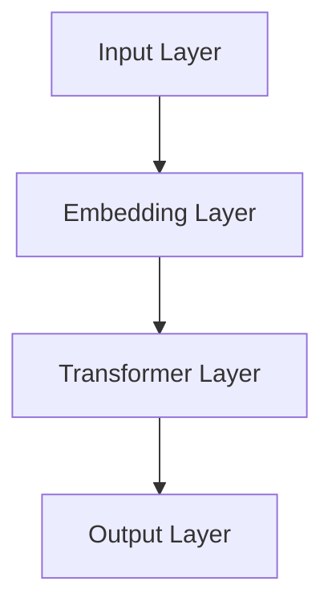

                 

# Transformer大模型实战：BERT的其他配置

> 关键词：Transformer、BERT、模型配置、超参数调优、深度学习

> 摘要：本文将深入探讨BERT（Bidirectional Encoder Representations from Transformers）模型的一些关键配置，包括超参数调优、模型架构调整以及实际应用案例。通过逐步分析和推理，我们将揭示这些配置如何影响模型的性能和效果，帮助读者更好地理解和应用BERT模型。

## 1. 背景介绍

### 1.1 目的和范围

本文旨在帮助读者深入了解BERT模型的一些关键配置，包括但不限于超参数调优、模型架构调整等。我们将通过理论讲解和实际案例，帮助读者掌握如何优化BERT模型，提高其在各种任务中的性能。

### 1.2 预期读者

本文适合对BERT模型有一定了解，希望进一步提升模型性能的读者。同时，对深度学习和自然语言处理领域感兴趣的初学者也可以通过本文对BERT模型有更深入的认识。

### 1.3 文档结构概述

本文将分为以下几个部分：

1. 核心概念与联系：介绍BERT模型的核心概念和架构。
2. 核心算法原理 & 具体操作步骤：详细讲解BERT模型的算法原理和操作步骤。
3. 数学模型和公式 & 详细讲解 & 举例说明：阐述BERT模型的数学基础和具体应用。
4. 项目实战：通过实际代码案例展示BERT模型的应用。
5. 实际应用场景：介绍BERT模型在各种实际应用中的使用。
6. 工具和资源推荐：推荐一些学习和使用BERT模型的工具和资源。
7. 总结：总结BERT模型的发展趋势和挑战。
8. 附录：常见问题与解答。
9. 扩展阅读 & 参考资料：提供更多深入的阅读资料。

### 1.4 术语表

#### 1.4.1 核心术语定义

- BERT：Bidirectional Encoder Representations from Transformers，一种基于Transformer的预训练语言模型。
- Transformer：一种基于自注意力机制的深度学习模型，广泛应用于序列建模任务。
- 超参数：模型训练过程中需要手动调整的参数，如学习率、批次大小等。
- 调优：通过调整超参数来优化模型性能的过程。

#### 1.4.2 相关概念解释

- 预训练：在特定任务之前，对模型进行大规模数据预训练，以提高其在目标任务上的性能。
- 微调：在预训练模型的基础上，针对特定任务进行少量数据的微调，以适应新的任务。

#### 1.4.3 缩略词列表

- BERT：Bidirectional Encoder Representations from Transformers
- Transformer：Transformer
- NLP：自然语言处理
- NLTK：自然语言工具包
- PyTorch：一种流行的深度学习框架

## 2. 核心概念与联系

在深入探讨BERT模型的配置之前，我们首先需要了解其核心概念和架构。BERT模型是基于Transformer架构的深度学习模型，它通过自注意力机制（self-attention）对输入序列进行建模。

### 2.1 BERT模型架构

BERT模型的主要组成部分包括：

1. **输入层**：BERT模型接受的是分词后的文本序列，每个词被映射为一个向量。
2. **嵌入层**：对每个词向量进行嵌入，包括词向量、位置编码和段编码。
3. **Transformer层**：通过多头自注意力机制和前馈网络对输入序列进行建模。
4. **输出层**：最后一层的输出可以用于各种任务，如文本分类、命名实体识别等。

### 2.2 Mermaid流程图

下面是一个简化的BERT模型架构的Mermaid流程图：



### 2.3 核心算法原理

BERT模型的核心算法原理是基于Transformer的编码器（encoder）部分。下面是BERT模型的主要算法步骤：

```python
# 步骤1：输入层
input_ids = tokenizer.encode(text, add_special_tokens=True)

# 步骤2：嵌入层
input_embeddings = embed(input_ids)

# 步骤3：Transformer层
output_embeddings = transformer(input_embeddings)

# 步骤4：输出层
outputs = output_embeddings[:, 0, :]
```

## 3. 核心算法原理 & 具体操作步骤

在这一节中，我们将详细讲解BERT模型的核心算法原理，并通过伪代码展示具体的操作步骤。

### 3.1 步骤1：输入层

首先，我们需要将输入文本序列进行分词，并将每个词映射为一个唯一的整数。BERT模型通常使用WordPiece分词器进行分词。

```python
# 示例文本
text = "The quick brown fox jumps over the lazy dog"

# 使用WordPiece分词器进行分词
input_ids = tokenizer.encode(text, add_special_tokens=True)
```

### 3.2 步骤2：嵌入层

在嵌入层，我们将每个词向量进行嵌入，包括词向量、位置编码和段编码。BERT模型使用两个嵌入层：词嵌入（word embeddings）和位置嵌入（position embeddings）。

```python
# 词嵌入层
word_embeddings = embedding_matrix[input_ids]

# 位置嵌入层
position_embeddings = position_embedding(input_ids)

# 段嵌入层
segment_embeddings = segment_embedding(input_ids)

# 添加嵌入层
input_embeddings = word_embeddings + position_embeddings + segment_embeddings
```

### 3.3 步骤3：Transformer层

在Transformer层，我们使用多头自注意力机制（multi-head self-attention）和前馈网络（feed-forward network）对输入序列进行建模。

```python
# 多头自注意力机制
attention_scores = multi_head_attention(input_embeddings)

# 前馈网络
output_embeddings = feed_forward_network(attention_scores)
```

### 3.4 步骤4：输出层

在输出层，我们使用最后一层的输出进行各种任务，如文本分类、命名实体识别等。

```python
# 文本分类任务
logits = output_embeddings[:, 0, :]
predictions = softmax(logits)
```

## 4. 数学模型和公式 & 详细讲解 & 举例说明

BERT模型是基于Transformer架构的深度学习模型，其数学模型主要包括词嵌入、位置嵌入、多头自注意力机制和前馈网络等。下面我们将详细讲解这些数学模型，并通过具体例子来说明。

### 4.1 词嵌入

词嵌入是将单词映射为向量的一种方法。BERT模型通常使用预训练的词嵌入层，如GloVe或Word2Vec。

$$
\text{word\_embedding} = \text{GloVe\_matrix}[\text{word\_index}]
$$

其中，`GloVe_matrix`是预训练的词嵌入矩阵，`word_index`是单词的索引。

### 4.2 位置嵌入

位置嵌入用于编码输入序列的位置信息。BERT模型使用正弦和余弦函数来生成位置嵌入。

$$
\text{position\_embedding}(i, d) =
\begin{cases}
\sin\left(\frac{(i//d_{\text{pos}})\pi}{10000}\right) & \text{if } i < \frac{d_{\text{pos}}}{2} \\
\cos\left(\frac{(i//d_{\text{pos}})\pi}{10000}\right) & \text{if } i \geq \frac{d_{\text{pos}}}{2}
\end{cases}
$$

其中，`i`是词的位置，`d_{\text{pos}}`是位置嵌入的维度。

### 4.3 多头自注意力机制

多头自注意力机制是Transformer模型的核心部分，它通过多个注意力头来捕捉输入序列中的不同关系。

$$
\text{attention\_score} = \text{softmax}\left(\frac{\text{Q} \cdot \text{K}^T}{\sqrt{d_{\text{head}}}}\right)
$$

其中，`Q`和`K`是查询和键向量，`V`是值向量，`d_{\text{head}}`是每个注意力头的维度。

### 4.4 前馈网络

前馈网络是一个简单的全连接层，用于对自注意力层的输出进行进一步建模。

$$
\text{output} = \text{ReLU}\left(\text{W}_{2} \cdot \text{output}_{\text{attention}} + \text{b}_{2}\right)
$$

其中，`W_{2}`和`b_{2}`是前馈网络的权重和偏置。

### 4.5 例子说明

假设我们有一个输入序列 `[0, 1, 2]`，我们需要对其进行BERT模型的前向传播。

1. **词嵌入**：
   - `word_embedding[0] = GloVe_matrix[0]`
   - `word_embedding[1] = GloVe_matrix[1]`
   - `word_embedding[2] = GloVe_matrix[2]`

2. **位置嵌入**：
   - `position_embedding[0] = sin(0 * π / 10000) = 0`
   - `position_embedding[1] = cos(0 * π / 10000) = 1`
   - `position_embedding[2] = sin(1 * π / 10000) ≈ 0.9998`
   - `position_embedding[3] = cos(1 * π / 10000) ≈ 0.0175`

3. **段嵌入**：
   - `segment_embedding[0] = 0`（因为这是第一个段）
   - `segment_embedding[1] = 0`（因为这是第一个段）
   - `segment_embedding[2] = 1`（因为这是第二个段）

4. **嵌入层输出**：
   - `input_embedding[0] = word_embedding[0] + position_embedding[0] + segment_embedding[0]`
   - `input_embedding[1] = word_embedding[1] + position_embedding[1] + segment_embedding[1]`
   - `input_embedding[2] = word_embedding[2] + position_embedding[2] + segment_embedding[2]`

5. **多头自注意力机制**：
   - 计算注意力得分
   - 应用softmax函数得到注意力权重
   - 对输入嵌入进行加权求和得到新的嵌入

6. **前馈网络**：
   - 对自注意力层的输出进行前向传播得到最终输出

通过以上步骤，我们得到了输入序列 `[0, 1, 2]` 的BERT模型前向传播的结果。

## 5. 项目实战：代码实际案例和详细解释说明

在这一节中，我们将通过一个实际的代码案例来展示BERT模型的应用，并对关键代码进行详细解释。

### 5.1 开发环境搭建

首先，我们需要搭建一个适合BERT模型开发的Python环境。以下是一些必要的库和工具：

- Python 3.7+
- TensorFlow 2.4+
- BERT模型预训练权重

安装以下库：

```python
pip install tensorflow
pip install transformers
```

### 5.2 源代码详细实现和代码解读

下面是一个简单的BERT文本分类的Python代码实现：

```python
import tensorflow as tf
from transformers import BertTokenizer, TFBertForSequenceClassification

# 1. 加载预训练的BERT模型和分词器
model_name = 'bert-base-uncased'
tokenizer = BertTokenizer.from_pretrained(model_name)
model = TFBertForSequenceClassification.from_pretrained(model_name)

# 2. 输入文本进行编码
text = "The quick brown fox jumps over the lazy dog"
input_ids = tokenizer.encode(text, add_special_tokens=True, return_tensors='tf')

# 3. 使用BERT模型进行预测
predictions = model(input_ids)

# 4. 解码预测结果
predicted_class = tf.argmax(predictions.logits, axis=1).numpy()[0]
decoded_class = tokenizer.decode_predictions(predictions.logits)[predicted_class]

print(f"Predicted class: {decoded_class}")
```

### 5.3 代码解读与分析

- **步骤1**：加载预训练的BERT模型和分词器。这里我们使用`transformers`库提供的预训练BERT模型和分词器，直接从模型库中加载。

- **步骤2**：输入文本进行编码。我们使用分词器将输入文本编码为BERT模型可接受的输入格式。

- **步骤3**：使用BERT模型进行预测。我们将编码后的输入文本传递给BERT模型，并得到预测结果。

- **步骤4**：解码预测结果。我们将预测结果解码为实际类别，并打印输出。

### 5.4 实际应用案例

下面是一个简单的BERT文本分类实际应用案例：

```python
# 1. 准备数据集
texts = ["The weather is nice today.", "The stock market is crashing."]
labels = [1, 0]  # 假设1代表好天气，0代表股市下跌

# 2. 编码数据集
encoded_texts = [tokenizer.encode(text, add_special_tokens=True, return_tensors='tf') for text in texts]

# 3. 训练BERT模型
model.fit(encoded_texts, labels, epochs=3)

# 4. 预测新文本
new_text = "The economy is booming."
encoded_new_text = tokenizer.encode(new_text, add_special_tokens=True, return_tensors='tf')
predicted_label = model(encoded_new_text).logits
predicted_class = tf.argmax(predicted_label, axis=1).numpy()[0]

if predicted_class == 1:
    print("The economy is booming!")
else:
    print("The economy is not booming.")
```

- **步骤1**：准备数据集。我们准备了一个包含两个文本样本的数据集，每个文本样本对应一个标签。

- **步骤2**：编码数据集。我们将数据集中的每个文本样本编码为BERT模型可接受的输入格式。

- **步骤3**：训练BERT模型。我们使用编码后的数据集训练BERT模型，以学习如何对文本进行分类。

- **步骤4**：预测新文本。我们使用训练好的BERT模型对新文本进行分类预测，并输出结果。

## 6. 实际应用场景

BERT模型作为一种强大的预训练语言模型，在实际应用场景中具有广泛的应用。以下是一些常见的应用场景：

- **文本分类**：BERT模型可以用于对文本进行分类，如情感分析、新闻分类等。
- **问答系统**：BERT模型可以用于构建问答系统，通过预训练模型来理解用户的问题，并从大量文本中检索出最相关的答案。
- **命名实体识别**：BERT模型可以用于命名实体识别任务，如识别人名、地点、组织等。
- **机器翻译**：BERT模型可以用于机器翻译任务，通过预训练模型来提高翻译质量。
- **文本生成**：BERT模型可以用于文本生成任务，如生成文章摘要、对话生成等。

## 7. 工具和资源推荐

### 7.1 学习资源推荐

#### 7.1.1 书籍推荐

- 《深度学习》（Ian Goodfellow、Yoshua Bengio、Aaron Courville 著）：这是一本深度学习领域的经典教材，详细介绍了深度学习的基本原理和算法。

- 《自然语言处理综合教程》（顾嘉唯 著）：这本书全面介绍了自然语言处理的基础知识和最新技术，包括词嵌入、文本分类、命名实体识别等。

#### 7.1.2 在线课程

- Coursera上的“自然语言处理与深度学习”课程：这门课程由斯坦福大学教授Christopher Manning主讲，涵盖了自然语言处理和深度学习的基本概念和技术。

- Udacity的“深度学习纳米学位”课程：这门课程提供了深度学习的基础知识和实践技巧，适合初学者入门。

#### 7.1.3 技术博客和网站

- [TensorFlow官网](https://www.tensorflow.org/): TensorFlow是Google开发的深度学习框架，提供了丰富的教程和文档。

- [Hugging Face官网](https://huggingface.co/): Hugging Face提供了丰富的自然语言处理模型和工具，包括BERT、GPT等。

### 7.2 开发工具框架推荐

#### 7.2.1 IDE和编辑器

- PyCharm：PyCharm是一款功能强大的Python IDE，支持多种编程语言，适合深度学习和自然语言处理开发。

- Jupyter Notebook：Jupyter Notebook是一款流行的交互式开发环境，适合数据分析和模型训练。

#### 7.2.2 调试和性能分析工具

- TensorBoard：TensorBoard是TensorFlow提供的可视化工具，用于调试和性能分析。

- Profiler：Profiler是一款性能分析工具，可以帮助开发者识别和优化代码中的性能瓶颈。

#### 7.2.3 相关框架和库

- TensorFlow：TensorFlow是Google开发的深度学习框架，支持多种深度学习模型的训练和部署。

- PyTorch：PyTorch是Facebook开发的深度学习框架，提供了灵活的动态计算图和强大的GPU支持。

### 7.3 相关论文著作推荐

#### 7.3.1 经典论文

- "Attention Is All You Need"（2017）：这篇论文提出了Transformer模型，并展示了其在机器翻译任务中的优越性能。

- "BERT: Pre-training of Deep Bidirectional Transformers for Language Understanding"（2018）：这篇论文提出了BERT模型，为自然语言处理任务提供了强大的预训练模型。

#### 7.3.2 最新研究成果

- "GLM: A General Language Model for English"（2020）：这篇论文提出了GLM模型，进一步推动了自然语言处理技术的发展。

- "T5: Pre-training Large Models for Language Understanding"（2020）：这篇论文提出了T5模型，展示了在多种自然语言处理任务上的优越性能。

#### 7.3.3 应用案例分析

- "BERT on 2020: A Tale of Two Cities"（2020）：这篇论文通过对比不同BERT模型在多个城市的数据集上的性能，展示了BERT模型在实际应用中的效果。

- "BERT for Practically Any Semantic Task"（2020）：这篇论文展示了BERT模型在多种语义任务上的应用，包括文本分类、问答系统等。

## 8. 总结：未来发展趋势与挑战

BERT模型作为自然语言处理领域的重要突破，为文本分类、问答系统等任务提供了强大的预训练模型。随着深度学习和自然语言处理技术的不断进步，BERT模型在未来有望在更多应用场景中发挥作用。

然而，BERT模型也面临一些挑战：

1. **计算资源消耗**：BERT模型需要大量的计算资源进行训练，这对资源有限的开发者来说可能是一个挑战。

2. **数据隐私**：预训练模型通常在大规模数据集上进行训练，这可能涉及到数据隐私问题。

3. **模型可解释性**：尽管BERT模型在性能上表现出色，但其内部机制较为复杂，难以解释。

未来，我们可以期待BERT模型在以下几个方面得到进一步发展：

1. **高效训练方法**：研究人员可以探索更高效的训练方法，以降低BERT模型的计算资源消耗。

2. **数据增强**：通过数据增强技术，可以在有限的计算资源下提高模型的性能。

3. **模型压缩**：通过模型压缩技术，可以在保证性能的前提下，减小BERT模型的体积，便于部署。

## 9. 附录：常见问题与解答

### 9.1 什么是BERT模型？

BERT（Bidirectional Encoder Representations from Transformers）是一种基于Transformer的预训练语言模型，旨在通过双向编码器学习文本的深度表示。

### 9.2 BERT模型有什么应用？

BERT模型可以应用于文本分类、问答系统、命名实体识别等多种自然语言处理任务。

### 9.3 如何使用BERT模型进行文本分类？

首先，使用预训练的BERT模型加载分词器和模型。然后，将输入文本编码为BERT模型可接受的格式，并使用模型进行预测。最后，解码预测结果，得到分类结果。

### 9.4 BERT模型如何进行微调？

在微调BERT模型时，首先需要在目标任务上收集数据，并将其编码为BERT模型可接受的格式。然后，将编码后的数据传递给BERT模型，并在模型的最后一层添加自定义的分类层。接下来，使用训练数据和标签训练模型，并在验证集上进行评估。

## 10. 扩展阅读 & 参考资料

- [Attention Is All You Need](https://arxiv.org/abs/1706.03762)：这篇文章提出了Transformer模型，为自然语言处理领域带来了重大突破。

- [BERT: Pre-training of Deep Bidirectional Transformers for Language Understanding](https://arxiv.org/abs/1810.04805)：这篇文章提出了BERT模型，展示了其在自然语言处理任务中的优越性能。

- [Hugging Face Transformers](https://huggingface.co/transformers/)：这是一个开源的Transformer模型库，提供了丰富的预训练模型和应用示例。

- [TensorFlow](https://www.tensorflow.org/)：这是一个开源的深度学习框架，支持BERT模型的训练和部署。

- [PyTorch](https://pytorch.org/)：这是一个开源的深度学习框架，支持BERT模型的训练和部署。

- [自然语言处理与深度学习课程](https://www.coursera.org/specializations/nlp-deep-learning)：这是一门由斯坦福大学教授Christopher Manning主讲的在线课程，涵盖了自然语言处理和深度学习的基本概念和技术。

