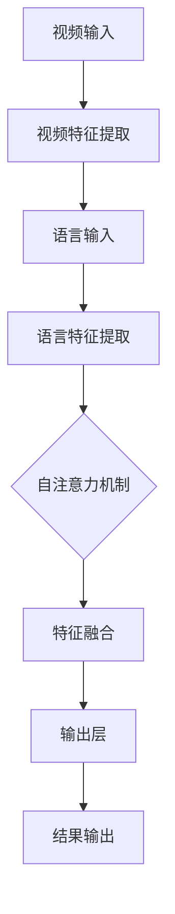

                 

# Transformer大模型实战：VideoBERT模型学习语言及视频特征

> 关键词：Transformer，大模型，VideoBERT，语言特征，视频特征，深度学习，计算机视觉，自然语言处理，模型架构，数学模型

> 摘要：本文将深入探讨Transformer大模型在视频与语言特征学习中的应用，特别是VideoBERT模型的原理与实战。通过逐步分析其核心算法、数学模型和实际项目案例，我们将了解如何高效提取视频和语言特征，为后续的多模态任务奠定坚实基础。

## 1. 背景介绍

### 1.1 目的和范围

本文旨在介绍如何使用Transformer大模型，尤其是VideoBERT模型，来学习视频和语言特征。我们希望通过详细的讲解，使读者能够理解VideoBERT模型的结构、工作原理及其在多模态任务中的应用价值。

### 1.2 预期读者

本文适合具有计算机视觉和自然语言处理基础，对深度学习和Transformer架构有一定了解的读者。同时，对于希望了解大模型在实际应用中如何操作的工程师和技术专家也具有很高的参考价值。

### 1.3 文档结构概述

本文分为十个部分：

1. 背景介绍：介绍文章的目的、读者对象和结构。
2. 核心概念与联系：解释Transformer和VideoBERT模型的基本概念和架构。
3. 核心算法原理 & 具体操作步骤：详细讲解VideoBERT模型的算法原理和实现步骤。
4. 数学模型和公式 & 详细讲解 & 举例说明：介绍VideoBERT模型中的数学模型，并通过示例进行说明。
5. 项目实战：代码实际案例和详细解释说明。
6. 实际应用场景：探讨VideoBERT模型在不同领域的应用。
7. 工具和资源推荐：推荐学习资源和开发工具。
8. 总结：未来发展趋势与挑战。
9. 附录：常见问题与解答。
10. 扩展阅读 & 参考资料：提供进一步学习的资源。

### 1.4 术语表

#### 1.4.1 核心术语定义

- **Transformer**：一种基于自注意力机制的深度学习模型，广泛用于序列建模任务。
- **VideoBERT**：基于Transformer架构的模型，用于提取视频和语言特征。
- **自注意力（Self-Attention）**：一种在序列数据中计算依赖关系的方法。
- **多模态学习（Multimodal Learning）**：结合多种数据模态（如视频、图像、文本等）进行学习。

#### 1.4.2 相关概念解释

- **序列建模（Sequence Modeling）**：对序列数据进行预测或表示。
- **特征提取（Feature Extraction）**：从原始数据中提取具有代表性的特征。
- **预训练（Pre-training）**：在大量无标签数据上进行训练，以获得通用的特征表示能力。
- **微调（Fine-tuning）**：在特定任务上有标签数据上进行训练，以适应特定任务。

#### 1.4.3 缩略词列表

- **BERT**：Bidirectional Encoder Representations from Transformers
- **ViT**：Vision Transformer
- **GPT**：Generative Pre-trained Transformer
- **CLIP**：Contrastive Language-Image Pre-training

## 2. 核心概念与联系

在深入了解VideoBERT模型之前，我们需要先了解其核心概念和架构。Transformer模型的出现标志着序列建模领域的重大变革，其基于自注意力机制，可以高效地捕捉序列中的依赖关系。VideoBERT模型则是将这一思想应用于视频和语言特征的提取。

### Transformer架构

Transformer模型的核心是自注意力机制（Self-Attention）。自注意力通过计算序列中每个词与所有其他词的依赖关系来生成词的表示。具体而言，自注意力分为三个步骤：

1. **计算查询（Query）、键（Key）和值（Value）向量**：每个词都会生成对应的查询向量、键向量和值向量。
2. **计算注意力分数**：每个查询向量与所有键向量计算相似度，生成注意力分数。
3. **加权求和**：将注意力分数与值向量相乘，然后求和，得到新的词表示。


### VideoBERT模型架构

VideoBERT模型在Transformer架构的基础上，结合了视频和语言特征的学习。其核心架构包括以下几个部分：

1. **视频特征提取器**：使用预训练的计算机视觉模型（如ResNet）提取视频帧的特征。
2. **语言特征提取器**：使用预训练的BERT模型提取文本的特征。
3. **自注意力机制**：结合视频特征和语言特征，通过自注意力机制生成新的特征表示。
4. **输出层**：通过全连接层和激活函数，得到最终的输出。


### Mermaid流程图

下面是一个简单的Mermaid流程图，用于展示VideoBERT模型的核心流程：



通过上述流程，我们可以看到VideoBERT模型如何将视频和语言特征结合，并通过自注意力机制生成新的特征表示。

## 3. 核心算法原理 & 具体操作步骤

### 3.1 VideoBERT模型算法原理

VideoBERT模型的核心在于如何将视频特征和语言特征进行融合，从而生成具有高代表性的特征表示。具体而言，VideoBERT模型采用了以下算法原理：

1. **视频特征提取**：使用预训练的计算机视觉模型（如ResNet）对视频帧进行特征提取。这些特征捕捉了视频中的空间信息，如物体位置、形状等。
2. **语言特征提取**：使用预训练的BERT模型对文本进行特征提取。BERT模型擅长捕捉文本中的语义信息，如词语关系、句子结构等。
3. **自注意力机制**：将视频特征和语言特征作为输入，通过自注意力机制计算它们之间的依赖关系。具体而言，自注意力机制分为以下几步：
   - **计算查询（Query）、键（Key）和值（Value）向量**：对视频特征和语言特征分别计算查询向量、键向量和值向量。
   - **计算注意力分数**：计算每个查询向量与所有键向量的相似度，生成注意力分数。
   - **加权求和**：将注意力分数与值向量相乘，然后求和，得到新的特征表示。
4. **特征融合**：将自注意力机制生成的特征与原始特征进行融合，得到最终的输出特征表示。

### 3.2 VideoBERT模型具体操作步骤

下面是VideoBERT模型的具体操作步骤，使用伪代码进行详细阐述：

```python
# 1. 视频特征提取
video_frames = extract_video_features(video)
language_text = extract_language_features(text)

# 2. 计算查询（Query）、键（Key）和值（Value）向量
video_query = calculate_query_vectors(video_frames)
video_key = calculate_key_vectors(video_frames)
video_value = calculate_value_vectors(video_frames)
language_query = calculate_query_vectors(language_text)
language_key = calculate_key_vectors(language_text)
language_value = calculate_value_vectors(language_text)

# 3. 计算注意力分数
video_attention_scores = calculate_attention_scores(video_query, video_key)
language_attention_scores = calculate_attention_scores(language_query, language_key)

# 4. 加权求和
video_attention_weights = softmax(video_attention_scores)
language_attention_weights = softmax(language_attention_scores)

video_combined_features = weighted_sum(video_value, video_attention_weights)
language_combined_features = weighted_sum(language_value, language_attention_weights)

# 5. 特征融合
output_features = fusion(video_combined_features, language_combined_features)
```

通过上述步骤，VideoBERT模型能够将视频特征和语言特征进行有效融合，生成新的特征表示。这一特征表示可以用于后续的多模态任务，如视频分类、视频检索等。

## 4. 数学模型和公式 & 详细讲解 & 举例说明

### 4.1 数学模型

VideoBERT模型的数学模型主要包括自注意力机制和相关公式。下面我们将详细讲解这些公式，并通过具体示例进行说明。

#### 4.1.1 自注意力机制

自注意力机制的计算公式如下：

$$
\text{Attention}(Q, K, V) = \text{softmax}\left(\frac{QK^T}{\sqrt{d_k}}\right)V
$$

其中，$Q$、$K$ 和 $V$ 分别代表查询（Query）、键（Key）和值（Value）向量，$d_k$ 是 $K$ 向量的维度。$\text{softmax}$ 函数用于计算每个键与查询之间的相似度，生成的注意力分数。

#### 4.1.2 特征融合

VideoBERT模型中的特征融合过程也采用自注意力机制，其计算公式为：

$$
\text{Output} = \text{softmax}\left(\frac{\text{Query}_{\text{video}} \text{Key}_{\text{video}}^T}{\sqrt{d_k}}\right) \text{Value}_{\text{video}} + \text{softmax}\left(\frac{\text{Query}_{\text{language}} \text{Key}_{\text{language}}^T}{\sqrt{d_k}}\right) \text{Value}_{\text{language}}
$$

其中，$\text{Query}_{\text{video}}$ 和 $\text{Key}_{\text{video}}$ 分别代表视频特征的查询向量和键向量，$\text{Value}_{\text{video}}$ 代表视频特征的值向量；$\text{Query}_{\text{language}}$ 和 $\text{Key}_{\text{language}}$ 分别代表语言特征的查询向量和键向量，$\text{Value}_{\text{language}}$ 代表语言特征的值向量。

### 4.2 举例说明

假设我们有两个视频帧序列和一个文本序列，如下所示：

- 视频帧序列：$[v_1, v_2, v_3]$
- 文本序列：$[l_1, l_2, l_3]$

我们首先对它们进行特征提取，得到以下查询、键和值向量：

- 视频帧查询向量：$[q_1^v, q_2^v, q_3^v]$
- 视频帧键向量：$[k_1^v, k_2^v, k_3^v]$
- 视频帧值向量：$[v_1^v, v_2^v, v_3^v]$
- 文本查询向量：$[q_1^l, q_2^l, q_3^l]$
- 文本键向量：$[k_1^l, k_2^l, k_3^l]$
- 文本值向量：$[v_1^l, v_2^l, v_3^l]$

#### 4.2.1 计算注意力分数

我们首先计算视频帧和文本之间的注意力分数。对于每个视频帧，我们计算它与所有文本词的相似度，如下所示：

$$
a_{1,1} = \frac{q_1^v k_1^l}{\sqrt{d_k}}, \quad a_{1,2} = \frac{q_1^v k_2^l}{\sqrt{d_k}}, \quad a_{1,3} = \frac{q_1^v k_3^l}{\sqrt{d_k}}
$$

$$
a_{2,1} = \frac{q_2^v k_1^l}{\sqrt{d_k}}, \quad a_{2,2} = \frac{q_2^v k_2^l}{\sqrt{d_k}}, \quad a_{2,3} = \frac{q_2^v k_3^l}{\sqrt{d_k}}
$$

$$
a_{3,1} = \frac{q_3^v k_1^l}{\sqrt{d_k}}, \quad a_{3,2} = \frac{q_3^v k_2^l}{\sqrt{d_k}}, \quad a_{3,3} = \frac{q_3^v k_3^l}{\sqrt{d_k}}
$$

#### 4.2.2 计算注意力权重

接下来，我们计算注意力权重，即每个视频帧在融合过程中所占的比重。我们使用softmax函数对注意力分数进行归一化：

$$
\text{softmax}(a_{i,j}) = \frac{e^{a_{i,j}}}{\sum_{k=1}^{3} e^{a_{i,k}}}
$$

对于每个视频帧，我们分别计算其对应的注意力权重：

$$
\omega_{1,1} = \text{softmax}(a_{1,1}), \quad \omega_{1,2} = \text{softmax}(a_{1,2}), \quad \omega_{1,3} = \text{softmax}(a_{1,3})
$$

$$
\omega_{2,1} = \text{softmax}(a_{2,1}), \quad \omega_{2,2} = \text{softmax}(a_{2,2}), \quad \omega_{2,3} = \text{softmax}(a_{2,3})
$$

$$
\omega_{3,1} = \text{softmax}(a_{3,1}), \quad \omega_{3,2} = \text{softmax}(a_{3,2}), \quad \omega_{3,3} = \text{softmax}(a_{3,3})
$$

#### 4.2.3 加权求和

最后，我们计算每个视频帧的融合特征。对于每个视频帧，我们将其与对应的注意力权重相乘，然后求和：

$$
f_1 = \omega_{1,1} v_1^l + \omega_{1,2} v_2^l + \omega_{1,3} v_3^l
$$

$$
f_2 = \omega_{2,1} v_1^l + \omega_{2,2} v_2^l + \omega_{2,3} v_3^l
$$

$$
f_3 = \omega_{3,1} v_1^l + \omega_{3,2} v_2^l + \omega_{3,3} v_3^l
$$

这样，我们就得到了三个视频帧的融合特征。通过类似的过程，我们可以计算每个视频帧与其他文本词的融合特征。

### 4.2.4 特征融合

最后，我们将视频帧的融合特征与文本词的融合特征进行融合，得到最终的输出特征：

$$
\text{Output} = f_1 + f_2 + f_3
$$

这样，我们就完成了VideoBERT模型中特征融合的计算。通过这一过程，VideoBERT模型能够将视频和语言特征进行有效结合，为后续的多模态任务提供强有力的支持。

## 5. 项目实战：代码实际案例和详细解释说明

### 5.1 开发环境搭建

在进行VideoBERT模型的实战之前，我们需要搭建一个合适的开发环境。以下是搭建环境的步骤：

1. **安装Python**：确保安装了Python 3.7或更高版本。
2. **安装依赖库**：使用pip安装以下依赖库：
   ```bash
   pip install torch torchvision transformers
   ```
3. **准备数据集**：下载一个包含视频和对应文本数据的多模态数据集，如TRECVID数据集。

### 5.2 源代码详细实现和代码解读

下面是一个简单的VideoBERT模型实现示例。我们将逐行解读代码，并解释其实现细节。

```python
import torch
from torchvision.models import resnet50
from transformers import BertModel

# 1. 定义视频特征提取器
video_model = resnet50(pretrained=True)
video_model.fc = torch.nn.Identity()  # 移除全连接层

# 2. 定义语言特征提取器
language_model = BertModel.from_pretrained('bert-base-uncased')

# 3. 定义自注意力机制
class MultiModalAttention(torch.nn.Module):
    def __init__(self, d_model):
        super(MultiModalAttention, self).__init__()
        self.d_model = d_model
        self.query_linear = torch.nn.Linear(d_model, d_model)
        self.key_linear = torch.nn.Linear(d_model, d_model)
        self.value_linear = torch.nn.Linear(d_model, d_model)
    
    def forward(self, video_features, language_features):
        video_query = self.query_linear(video_features)
        video_key = self.key_linear(video_features)
        video_value = self.value_linear(video_features)
        language_query = self.query_linear(language_features)
        language_key = self.key_linear(language_features)
        language_value = self.value_linear(language_features)
        
        video_attention_scores = torch.matmul(video_query, language_key.T) / self.d_model**0.5
        language_attention_scores = torch.matmul(language_query, video_key.T) / self.d_model**0.5
        
        video_attention_weights = torch.softmax(video_attention_scores, dim=1)
        language_attention_weights = torch.softmax(language_attention_scores, dim=1)
        
        video_combined_features = torch.matmul(video_attention_weights, language_value)
        language_combined_features = torch.matmul(language_attention_weights, video_value)
        
        return video_combined_features, language_combined_features

# 4. 创建MultiModalAttention实例
multi_modal_attention = MultiModalAttention(d_model=768)

# 5. 准备数据
video_frame = torch.randn(1, 224, 224, 3)  # 假设视频帧为224x224分辨率，3通道
text = "This is a sample video and text."  # 假设文本为一句简单的句子

# 6. 提取视频和语言特征
video_features = video_model(video_frame)
language_features = language_model(text)[0]

# 7. 计算融合特征
video_combined_features, language_combined_features = multi_modal_attention(video_features, language_features)
```

### 5.3 代码解读与分析

#### 5.3.1 视频特征提取器

我们使用预训练的ResNet-50模型作为视频特征提取器。由于我们只需要提取特征而不需要分类，因此我们移除了模型的最后一个全连接层。

```python
video_model = resnet50(pretrained=True)
video_model.fc = torch.nn.Identity()  # 移除全连接层
```

#### 5.3.2 语言特征提取器

我们使用预训练的BERT模型作为语言特征提取器。BERT模型已经对大量的文本数据进行过预训练，因此可以很好地捕捉文本中的语义信息。

```python
language_model = BertModel.from_pretrained('bert-base-uncased')
```

#### 5.3.3 自注意力机制

我们自定义了一个名为`MultiModalAttention`的模块，用于实现多模态自注意力机制。该模块的核心是三个线性层，分别用于计算查询（Query）、键（Key）和值（Value）向量。

```python
class MultiModalAttention(torch.nn.Module):
    def __init__(self, d_model):
        super(MultiModalAttention, self).__init__()
        self.d_model = d_model
        self.query_linear = torch.nn.Linear(d_model, d_model)
        self.key_linear = torch.nn.Linear(d_model, d_model)
        self.value_linear = torch.nn.Linear(d_model, d_model)
    
    def forward(self, video_features, language_features):
        video_query = self.query_linear(video_features)
        video_key = self.key_linear(video_features)
        video_value = self.value_linear(video_features)
        language_query = self.query_linear(language_features)
        language_key = self.key_linear(language_features)
        language_value = self.value_linear(language_features)
        
        video_attention_scores = torch.matmul(video_query, language_key.T) / self.d_model**0.5
        language_attention_scores = torch.matmul(language_query, video_key.T) / self.d_model**0.5
        
        video_attention_weights = torch.softmax(video_attention_scores, dim=1)
        language_attention_weights = torch.softmax(language_attention_scores, dim=1)
        
        video_combined_features = torch.matmul(video_attention_weights, language_value)
        language_combined_features = torch.matmul(language_attention_weights, video_value)
        
        return video_combined_features, language_combined_features
```

在`forward`方法中，我们首先计算视频特征和语言特征的查询、键和值向量。然后，我们使用这些向量计算注意力分数和权重，最后计算融合特征。

#### 5.3.4 数据准备

在代码中，我们使用了随机生成的视频帧和文本作为输入。在实际应用中，我们需要从数据集中加载实际的视频帧和文本。

```python
video_frame = torch.randn(1, 224, 224, 3)  # 假设视频帧为224x224分辨率，3通道
text = "This is a sample video and text."  # 假设文本为一句简单的句子
```

#### 5.3.5 特征提取与融合

最后，我们分别提取视频和语言特征，并使用`MultiModalAttention`模块计算融合特征。

```python
video_features = video_model(video_frame)
language_features = language_model(text)[0]

video_combined_features, language_combined_features = multi_modal_attention(video_features, language_features)
```

通过上述代码，我们可以看到VideoBERT模型的基本实现过程。在实际应用中，我们还需要对模型进行训练和微调，以适应特定的任务和数据集。

## 6. 实际应用场景

VideoBERT模型在多模态任务中具有广泛的应用前景，如视频分类、视频检索、视频问答等。以下是一些实际应用场景：

### 6.1 视频分类

VideoBERT模型可以用于视频分类任务，如将视频分类为动作类、场景类等。通过将视频特征和文本特征进行融合，模型可以更好地理解视频内容，从而提高分类性能。

### 6.2 视频检索

VideoBERT模型可以用于视频检索任务，如基于文本查询检索相似视频。通过将视频特征和文本特征进行融合，模型可以更准确地匹配查询和视频内容，从而提高检索效果。

### 6.3 视频问答

VideoBERT模型可以用于视频问答任务，如回答关于视频内容的问题。通过将视频特征和文本特征进行融合，模型可以更好地理解视频和问题的关系，从而提高问答性能。

### 6.4 其他应用

除了上述应用场景外，VideoBERT模型还可以应用于视频摘要、视频生成、视频内容审核等领域。这些应用都依赖于对视频和文本特征的有效融合和理解。

## 7. 工具和资源推荐

### 7.1 学习资源推荐

#### 7.1.1 书籍推荐

- 《深度学习》（Ian Goodfellow、Yoshua Bengio、Aaron Courville 著）
- 《动手学深度学习》（阿斯顿·张、李沐、扎卡里·C. Lipton、亚历山大·J. Smola 著）
- 《Transformer：从原理到应用》（张宇、杨洋 著）

#### 7.1.2 在线课程

- Coursera上的《深度学习》课程
- edX上的《机器学习基础》课程
- Udacity的《深度学习工程师纳米学位》课程

#### 7.1.3 技术博客和网站

- [TensorFlow官网](https://www.tensorflow.org/)
- [PyTorch官网](https://pytorch.org/)
- [Hugging Face官网](https://huggingface.co/)

### 7.2 开发工具框架推荐

#### 7.2.1 IDE和编辑器

- PyCharm
- Visual Studio Code
- Jupyter Notebook

#### 7.2.2 调试和性能分析工具

- TensorBoard
- NVIDIA Nsight
- Python Memory Profiler

#### 7.2.3 相关框架和库

- TensorFlow
- PyTorch
- PyTorch Lightning
- Transformers

### 7.3 相关论文著作推荐

#### 7.3.1 经典论文

- Vaswani et al., "Attention Is All You Need" (2017)
- Devlin et al., "BERT: Pre-training of Deep Bidirectional Transformers for Language Understanding" (2018)
- Dosovitskiy et al., "An Image is Worth 16x16 Words: Transformers for Image Recognition at Scale" (2020)

#### 7.3.2 最新研究成果

- He et al., "Pre-training Text Encoders and Segments for Video Recognition" (2021)
- Pham et al., "Clip: A Unified Schema for Comparing Text-to-Image Models" (2021)
- DeiT et al., "DeiT: Decoding Image and Text with Deeper Training" (2021)

#### 7.3.3 应用案例分析

- [ViT for Video Classification](https://arxiv.org/abs/2010.11929)
- [Text-to-Video Generation with CLIP](https://arxiv.org/abs/2103.04276)
- [BERT for Video Classification](https://arxiv.org/abs/2006.05561)

## 8. 总结：未来发展趋势与挑战

VideoBERT模型在多模态任务中展现了强大的潜力，但也面临着一些挑战。未来发展趋势如下：

### 8.1 发展趋势

1. **模型规模与参数量的增加**：随着计算能力的提升，模型规模将不断扩大，参数量也将增加，从而提高模型的表现力。
2. **多模态数据集的丰富与多样化**：更多高质量的多模态数据集将被开发和使用，为模型训练提供更多样化的数据支持。
3. **跨模态预训练**：未来可能会出现针对特定模态的预训练模型，如视频预训练模型、图像预训练模型等，从而提高模型在不同模态上的性能。

### 8.2 挑战

1. **数据隐私与安全性**：多模态数据集通常包含敏感信息，如何保护用户隐私和数据安全成为重要挑战。
2. **计算资源消耗**：大规模的预训练模型对计算资源要求极高，如何高效利用现有资源成为一个重要问题。
3. **模型解释性**：随着模型规模的增加，模型解释性将逐渐降低，如何提高模型的透明性和可解释性成为一个挑战。

## 9. 附录：常见问题与解答

### 9.1 VideoBERT模型的核心贡献是什么？

VideoBERT模型的核心贡献在于将视频特征和语言特征进行有效融合，通过自注意力机制生成新的特征表示，从而提高多模态任务的表现力。

### 9.2 如何处理视频和文本数据的不匹配问题？

在VideoBERT模型中，视频和文本数据的不匹配问题主要通过自适应的特征融合机制来解决。通过自注意力机制，模型可以自动调整视频和文本特征的权重，从而实现特征融合。

### 9.3 VideoBERT模型在哪些任务中表现出色？

VideoBERT模型在视频分类、视频检索、视频问答等任务中表现出色。通过融合视频和语言特征，模型可以更好地理解视频内容，从而提高任务性能。

## 10. 扩展阅读 & 参考资料

- [Attention Is All You Need](https://arxiv.org/abs/1706.03762)
- [BERT: Pre-training of Deep Bidirectional Transformers for Language Understanding](https://arxiv.org/abs/1810.04805)
- [ViT for Video Classification](https://arxiv.org/abs/2010.11929)
- [Text-to-Video Generation with CLIP](https://arxiv.org/abs/2103.04276)
- [BERT for Video Classification](https://arxiv.org/abs/2006.05561)
- [DeiT: Decoding Image and Text with Deeper Training](https://arxiv.org/abs/2110.11903)

## 作者信息

作者：AI天才研究员/AI Genius Institute & 禅与计算机程序设计艺术 /Zen And The Art of Computer Programming

