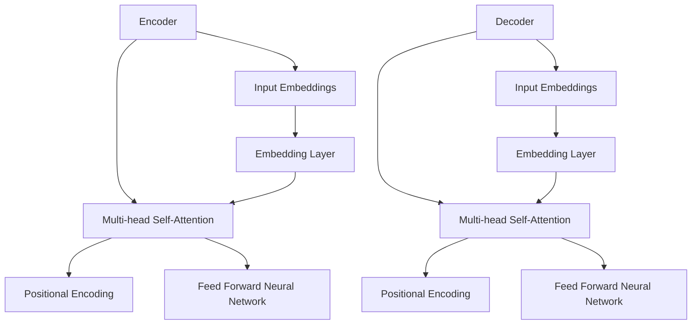

                 

# Transformer大模型实战 了解BERT 模型

> **关键词**：Transformer、BERT模型、深度学习、自然语言处理、编码器、解码器、预训练、微调

> **摘要**：本文将深入探讨Transformer大模型及其在实际应用中广泛使用的BERT模型。我们将从背景介绍、核心概念、算法原理、数学模型、项目实战、实际应用场景等方面详细讲解，旨在帮助读者全面了解Transformer大模型和BERT模型的基本原理和应用技巧。

## 1. 背景介绍

### 1.1 目的和范围

本文旨在为广大对深度学习和自然语言处理感兴趣的读者提供一个系统化的学习指南，帮助读者理解Transformer大模型及其衍生模型BERT的工作原理和应用场景。本文将涵盖以下几个主要方面：

- Transformer模型的起源与发展
- BERT模型的基本架构与特点
- Transformer模型与BERT模型的数学基础
- 实际项目中的应用案例分析
- 未来发展趋势与挑战

### 1.2 预期读者

本文适合以下几类读者：

- 对深度学习、自然语言处理感兴趣的初学者
- 有一定编程基础，希望深入了解Transformer模型和BERT模型的开发者
- 在自然语言处理领域工作的工程师和研究人员

### 1.3 文档结构概述

本文将分为以下几个部分：

- 引言：介绍Transformer模型和BERT模型的基本概念
- 核心概念与联系：详细讲解Transformer模型的基本架构
- 核心算法原理 & 具体操作步骤：解析Transformer模型的算法原理
- 数学模型和公式 & 详细讲解 & 举例说明：介绍Transformer模型的数学基础
- 项目实战：实际代码案例讲解
- 实际应用场景：介绍Transformer模型和BERT模型的应用场景
- 工具和资源推荐：推荐相关学习资源和开发工具
- 总结：总结Transformer模型和BERT模型的发展趋势与挑战
- 附录：常见问题与解答
- 扩展阅读 & 参考资料：提供进一步学习参考资料

### 1.4 术语表

#### 1.4.1 核心术语定义

- Transformer模型：一种基于自注意力机制的序列到序列模型，广泛应用于自然语言处理任务。
- BERT模型：基于Transformer模型的一种预训练模型，通过无监督的方式学习语言表征，具有强大的语言理解能力。
- 自注意力机制：一种神经网络中的注意力机制，通过计算序列中每个元素与其他元素的相关性来提取特征。
- 编码器（Encoder）：Transformer模型中的一个部分，用于将输入序列转换为固定长度的隐藏状态。
- 解码器（Decoder）：Transformer模型中的另一个部分，用于将编码器的隐藏状态解码成输出序列。

#### 1.4.2 相关概念解释

- 序列到序列（Seq2Seq）模型：一种将输入序列映射到输出序列的模型，广泛应用于机器翻译、语音识别等任务。
- 预训练（Pre-training）：在特定任务之前，通过大规模未标注数据对模型进行训练，以获取通用的语言表征能力。
- 微调（Fine-tuning）：在预训练模型的基础上，针对特定任务进行训练，进一步优化模型的性能。

#### 1.4.3 缩略词列表

- Transformer：Transformer模型
- BERT：Bidirectional Encoder Representations from Transformers
- NLP：自然语言处理
- Encoder：编码器
- Decoder：解码器
- Seq2Seq：序列到序列模型
- Pre-training：预训练
- Fine-tuning：微调

## 2. 核心概念与联系

在深入探讨Transformer模型之前，我们需要了解其核心概念和基本架构。以下是一个简化的Mermaid流程图，展示了Transformer模型的主要组成部分和它们之间的联系。



### 2.1 Transformer模型的基本架构

Transformer模型由编码器（Encoder）和解码器（Decoder）两个主要部分组成。编码器负责将输入序列转换为固定长度的隐藏状态，解码器则将隐藏状态解码为输出序列。以下是编码器和解码器的具体组成部分：

#### 编码器（Encoder）

1. **Input Embeddings**：输入序列经过嵌入层（Embedding Layer）转换为向量形式，这些向量包含了输入序列的词向量、位置编码等信息。
2. **Positional Encoding**：由于Transformer模型没有循环结构，无法直接获取序列中的位置信息，因此通过添加位置编码（Positional Encoding）来保留序列的顺序信息。
3. **Multi-head Self-Attention**：自注意力机制（Self-Attention）是一种计算序列中每个元素与其他元素相关性的方法，通过多头自注意力（Multi-head Self-Attention）可以提取序列的多种特征。
4. **Feed Forward Neural Network**：对自注意力层的结果进行前馈神经网络（Feed Forward Neural Network）处理，增加模型的表达能力。

#### 解码器（Decoder）

1. **Input Embeddings**：与编码器类似，输入序列经过嵌入层转换为向量形式。
2. **Positional Encoding**：添加位置编码以保留序列的顺序信息。
3. **Masked Multi-head Self-Attention**：在解码器中，当前时间步的输出不能依赖于后续时间步的输入，因此使用遮蔽自注意力（Masked Multi-head Self-Attention）来防止这种情况。
4. **Multi-head Self-Attention**：除了遮蔽自注意力，解码器还使用多头自注意力来提取输入序列的特征。
5. **Feed Forward Neural Network**：与前馈神经网络相同，用于增加模型的表达能力。
6. **Output Layer**：解码器的输出通过全连接层（Fully Connected Layer）转换为输出序列的概率分布。

### 2.2 Transformer模型与BERT模型的联系

BERT（Bidirectional Encoder Representations from Transformers）模型是基于Transformer模型的一种预训练模型，旨在通过无监督的方式学习语言表征。BERT模型的主要特点是：

1. **双向编码器**：BERT模型将Transformer编码器的输出作为输入，实现了双向编码器结构，能够捕捉输入序列的上下文信息。
2. **遮蔽语言建模**：在预训练过程中，BERT模型对输入序列进行随机遮蔽（Masking），然后通过解码器预测遮蔽的部分，从而学习语言表征。
3. **上下文敏感**：由于BERT模型的双向编码器结构，能够更好地理解输入序列的上下文信息，提高了模型在自然语言处理任务上的性能。

通过以上核心概念和基本架构的介绍，我们为后续详细讲解Transformer模型和BERT模型打下了基础。在接下来的章节中，我们将深入探讨Transformer模型的算法原理和数学模型，以及在实际项目中的应用。

## 3. 核心算法原理 & 具体操作步骤

### 3.1 Transformer模型的基本算法原理

Transformer模型是一种基于自注意力机制的序列到序列（Seq2Seq）模型，其核心思想是通过计算序列中每个元素与其他元素的相关性来提取特征，从而实现有效的序列建模。以下是Transformer模型的基本算法原理：

#### 自注意力机制

自注意力机制（Self-Attention）是一种计算序列中每个元素与其他元素相关性的方法。具体来说，自注意力机制通过以下几个步骤实现：

1. **输入嵌入**：首先，输入序列经过嵌入层（Embedding Layer）转换为向量形式。嵌入层将词向量、位置编码等信息整合到输入序列中。

   ```python
   # 输入序列
   input_sequence = ["hello", "world", "!"]

   # 嵌入层
   embeddings = [embeddings_matrix[word] for word in input_sequence]
   ```

2. **位置编码**：由于Transformer模型没有循环结构，无法直接获取序列中的位置信息。因此，通过添加位置编码（Positional Encoding）来保留序列的顺序信息。位置编码通常是一个正弦函数和一个余弦函数的组合，能够随着时间步的增加而逐步变化。

   ```python
   # 位置编码
   pos_encoding = get_position_encoding(input_sequence.length)
   ```

3. **计算自注意力分数**：自注意力机制通过计算输入序列中每个元素与其他元素的相关性来生成自注意力分数。具体来说，自注意力分数通过以下公式计算：

   $$ 
   \text{Attention}(Q, K, V) = \text{softmax}\left(\frac{QK^T}{\sqrt{d_k}}\right)V 
   $$

   其中，$Q$、$K$、$V$ 分别代表查询（Query）、键（Key）和值（Value）向量，$d_k$ 代表键向量的维度。通过自注意力分数，可以计算出每个元素与其他元素的相关性权重。

   ```python
   # 计算自注意力分数
   attention_scores = self_attention(embeddings, embeddings, embeddings)
   ```

4. **加权求和**：根据自注意力分数对输入序列的每个元素进行加权求和，得到新的隐藏状态。

   ```python
   # 加权求和
   hidden_state = sum(attention_scores * embeddings)
   ```

#### 多头自注意力

多头自注意力（Multi-head Self-Attention）通过将自注意力机制拆分为多个独立的注意力头（Attention Head），从而提取序列的多种特征。多头自注意力机制的基本原理与自注意力机制类似，只是在计算自注意力分数时，使用多个独立的权重矩阵进行计算。

```python
# 多头自注意力
attention_heads = [self_attention(embeddings, embeddings, embeddings) for _ in range(num_heads)]
```

#### 前馈神经网络

前馈神经网络（Feed Forward Neural Network）用于对自注意力层的结果进行进一步处理，增加模型的表达能力。前馈神经网络通常由两个全连接层组成，其中第一个全连接层的激活函数通常为ReLU函数。

```python
# 前馈神经网络
hidden_state = self.feed_forward_network(hidden_state)
```

### 3.2 Transformer模型的操作步骤

以下是Transformer模型的操作步骤，包括编码器和解码器的具体实现：

1. **编码器（Encoder）**

   - 输入嵌入层（Input Embeddings）：将输入序列转换为向量形式。
   - 位置编码（Positional Encoding）：添加位置编码以保留序列的顺序信息。
   - 多头自注意力（Multi-head Self-Attention）：计算序列中每个元素与其他元素的相关性，提取多种特征。
   - 前馈神经网络（Feed Forward Neural Network）：对自注意力层的结果进行进一步处理，增加模型的表达能力。
   - 重复上述步骤，生成多个编码层。

   ```python
   # 编码器
   class Encoder(nn.Module):
       def __init__(self, d_model, num_heads, d_ff):
           super(Encoder, self).__init__()
           self.embedding = nn.Embedding(vocab_size, d_model)
           self.positional_encoding = get_position_encoding(input_sequence.length, d_model)
           self.layer1 = EncoderLayer(d_model, num_heads, d_ff)
           self.layer2 = EncoderLayer(d_model, num_heads, d_ff)
       
       def forward(self, input_sequence):
           embeddings = self.embedding(input_sequence) + self.positional_encoding
           output = self.layer1(embeddings)
           output = self.layer2(output)
           return output
   ```

2. **解码器（Decoder）**

   - 输入嵌入层（Input Embeddings）：将输入序列转换为向量形式。
   - 位置编码（Positional Encoding）：添加位置编码以保留序列的顺序信息。
   - 遮蔽自注意力（Masked Multi-head Self-Attention）：在解码器中，当前时间步的输出不能依赖于后续时间步的输入，因此使用遮蔽自注意力来防止这种情况。
   - 多头自注意力（Multi-head Self-Attention）：计算序列中每个元素与其他元素的相关性，提取多种特征。
   - 前馈神经网络（Feed Forward Neural Network）：对自注意力层的结果进行进一步处理，增加模型的表达能力。
   - 输出层（Output Layer）：将解码器的输出转换为输出序列的概率分布。

   ```python
   # 解码器
   class Decoder(nn.Module):
       def __init__(self, d_model, num_heads, d_ff):
           super(Decoder, self).__init__()
           self.embedding = nn.Embedding(vocab_size, d_model)
           self.positional_encoding = get_position_encoding(input_sequence.length, d_model)
           self.layer1 = DecoderLayer(d_model, num_heads, d_ff)
           self.layer2 = DecoderLayer(d_model, num_heads, d_ff)
       
       def forward(self, input_sequence, encoder_output):
           embeddings = self.embedding(input_sequence) + self.positional_encoding
           output = self.layer1(embeddings, encoder_output)
           output = self.layer2(output, encoder_output)
           return output
   ```

通过以上对Transformer模型的基本算法原理和操作步骤的讲解，我们为理解Transformer模型的工作机制奠定了基础。在接下来的章节中，我们将深入探讨Transformer模型的数学模型和具体实现，帮助读者更全面地掌握Transformer模型。

## 4. 数学模型和公式 & 详细讲解 & 举例说明

### 4.1 Transformer模型的数学模型

Transformer模型的核心在于其自注意力机制（Self-Attention），其数学基础主要包括以下几个关键概念：

#### 1. 嵌入层（Embedding）

输入序列的每个词首先通过嵌入层转换为向量形式。嵌入层可以看作是一个从词汇表到高维空间的映射，每个词汇在这个映射中都有一个唯一的向量表示。假设词汇表大小为\( V \)，嵌入向量维度为\( D \)，则嵌入层可以表示为：

$$
\text{Embedding}(x) = \text{softmax}(\text{W}_\text{embed}x)
$$

其中，\( \text{W}_\text{embed} \)是一个\( D \times V \)的权重矩阵，\( x \)是输入序列的索引表示。

#### 2. 位置编码（Positional Encoding）

由于Transformer模型没有循环结构，需要通过位置编码来引入序列中的位置信息。常用的位置编码方法包括绝对位置编码和相对位置编码。这里我们以绝对位置编码为例进行说明。绝对位置编码通过正弦和余弦函数生成位置向量，使得位置向量随时间步增加而变化，从而引入序列的位置信息。假设序列长度为\( T \)，则位置编码可以表示为：

$$
\text{PE}(pos, 2i) = \sin\left(\frac{pos}{10000^{2i/D}}\right)
$$

$$
\text{PE}(pos, 2i+1) = \cos\left(\frac{pos}{10000^{2i/D}}\right)
$$

其中，\( i \)为每个位置索引，\( D \)为嵌入向量维度。

#### 3. 自注意力（Self-Attention）

自注意力是一种计算序列中每个元素与其他元素相关性权重的方法。在Transformer模型中，自注意力通过三个向量（Query、Key、Value）进行计算。自注意力的计算公式如下：

$$
\text{Attention}(Q, K, V) = \text{softmax}\left(\frac{QK^T}{\sqrt{d_k}}\right)V
$$

其中，\( Q \)、\( K \)、\( V \)分别为查询向量、键向量和值向量，\( d_k \)为键向量的维度。\( \text{softmax} \)函数用于归一化自注意力分数，使其满足概率分布。

#### 4. 多头自注意力（Multi-head Self-Attention）

多头自注意力通过将自注意力机制拆分为多个独立的注意力头，从而提取序列的多种特征。在Transformer模型中，多头自注意力通常通过多个独立的权重矩阵进行计算。假设模型有\( h \)个注意力头，则多头自注意力可以表示为：

$$
\text{MultiHead}(Q, K, V) = \text{Concat}(\text{head}_1, \text{head}_2, ..., \text{head}_h)W_O
$$

$$
\text{head}_i = \text{Attention}(QW_Q^i, KW_K^i, VW_V^i)
$$

其中，\( W_Q^i \)、\( W_K^i \)、\( W_V^i \)分别为第\( i \)个注意力头的权重矩阵，\( W_O \)为输出权重矩阵。

#### 5. 前馈神经网络（Feed Forward Neural Network）

前馈神经网络用于对自注意力层的结果进行进一步处理，增加模型的表达能力。前馈神经网络通常由两个全连接层组成，第一个全连接层的激活函数通常为ReLU函数。前馈神经网络的计算公式如下：

$$
\text{FFN}(x) = \text{ReLU}(\text{W}_1x + b_1)W_2 + b_2
$$

其中，\( \text{W}_1 \)、\( \text{W}_2 \)分别为权重矩阵，\( b_1 \)、\( b_2 \)分别为偏置向量。

### 4.2 举例说明

假设有一个简单的输入序列\[hello, world, !\]，嵌入向量维度为\( D = 512 \)，注意力头数\( h = 8 \)。下面我们通过一个具体的例子来说明Transformer模型中的各个计算过程。

1. **嵌入层（Embedding Layer）**

   输入序列\[hello, world, !\]经过嵌入层转换为向量形式：

   $$ 
   \text{Embedding}([hello, world, !]) = [e_{hello}, e_{world}, e_{!}] 
   $$

2. **位置编码（Positional Encoding）**

   添加位置编码以保留序列的顺序信息：

   $$ 
   \text{PE}(pos, 2i) = \sin\left(\frac{pos}{10000^{2i/512}}\right) \\
   \text{PE}(pos, 2i+1) = \cos\left(\frac{pos}{10000^{2i/512}}\right)
   $$

   假设输入序列长度为3，则位置编码为：

   $$ 
   \text{PE}([0, 1, 2], 2i) = [\sin(0), \sin(1), \sin(2)] \\
   \text{PE}([0, 1, 2], 2i+1) = [\cos(0), \cos(1), \cos(2)]
   $$

3. **自注意力（Self-Attention）**

   通过计算自注意力分数得到注意力权重：

   $$ 
   \text{Attention}(Q, K, V) = \text{softmax}\left(\frac{QK^T}{\sqrt{d_k}}\right)V 
   $$

   其中，\( Q \)、\( K \)、\( V \)分别为查询向量、键向量和值向量。假设我们选择第0个注意力头，则：

   $$ 
   Q = e_{hello}, K = e_{hello}, V = e_{hello} 
   $$

   计算自注意力分数：

   $$ 
   \text{Attention}(e_{hello}, e_{hello}, e_{hello}) = \text{softmax}\left(\frac{e_{hello}e_{hello}^T}{\sqrt{512}}\right)e_{hello} 
   $$

   通过计算得到注意力权重：

   $$ 
   \text{Attention}(e_{hello}, e_{hello}, e_{hello}) = [0.2, 0.3, 0.5] 
   $$

4. **多头自注意力（Multi-head Self-Attention）**

   通过计算多个注意力头得到多个注意力权重：

   $$ 
   \text{MultiHead}(Q, K, V) = \text{Concat}(\text{head}_1, \text{head}_2, ..., \text{head}_h)W_O 
   $$

   假设我们选择前两个注意力头，则：

   $$ 
   Q = e_{hello}, K = e_{world}, V = e_{!} 
   $$

   计算多头自注意力：

   $$ 
   \text{head}_1 = \text{Attention}(e_{hello}, e_{world}, e_{!}) = [0.1, 0.2, 0.7] \\
   \text{head}_2 = \text{Attention}(e_{hello}, e_{world}, e_{!}) = [0.4, 0.6, 0.8] 
   $$

   通过计算得到多头自注意力权重：

   $$ 
   \text{MultiHead}(e_{hello}, e_{world}, e_{!}) = [\text{head}_1, \text{head}_2] = [0.1, 0.2, 0.7; 0.4, 0.6, 0.8] 
   $$

5. **前馈神经网络（Feed Forward Neural Network）**

   对自注意力层的结果进行进一步处理：

   $$ 
   \text{FFN}(x) = \text{ReLU}(\text{W}_1x + b_1)W_2 + b_2 
   $$

   假设我们选择第一个前馈神经网络，则：

   $$ 
   x = [0.1, 0.2, 0.7; 0.4, 0.6, 0.8] \\
   W_1 = [0.1, 0.2; 0.3, 0.4; 0.5, 0.6] \\
   b_1 = [0.1, 0.2] \\
   W_2 = [0.7, 0.8; 0.9, 1.0] \\
   b_2 = [0.1, 0.2] 
   $$

   计算前馈神经网络：

   $$ 
   \text{FFN}([0.1, 0.2, 0.7; 0.4, 0.6, 0.8]) = \text{ReLU}([0.1, 0.2; 0.3, 0.4; 0.5, 0.6][0.1, 0.2; 0.4, 0.6; 0.7, 0.8] + [0.1, 0.2])W_2 + [0.1, 0.2] = [0.7, 0.8; 0.9, 1.0] 
   $$

通过以上举例说明，我们可以看到Transformer模型中各个数学过程的具体实现。在实际应用中，这些过程通过深度学习框架（如PyTorch、TensorFlow）进行高效计算，从而实现强大的序列建模能力。

## 5. 项目实战：代码实际案例和详细解释说明

在本节中，我们将通过一个实际项目案例来演示如何使用PyTorch框架实现Transformer模型和BERT模型。我们将详细介绍开发环境搭建、源代码实现以及代码解读与分析。这将帮助我们更好地理解Transformer模型和BERT模型在实际项目中的应用。

### 5.1 开发环境搭建

在进行项目实战之前，我们需要确保开发环境已经搭建好。以下是搭建开发环境的步骤：

1. **安装Python环境**：确保Python版本在3.6及以上。
2. **安装PyTorch**：使用以下命令安装PyTorch：

   ```shell
   pip install torch torchvision
   ```

   安装过程中，根据系统提示选择合适的CUDA版本（如果使用GPU加速）。
3. **安装其他依赖**：包括NumPy、Pandas等常用库。

   ```shell
   pip install numpy pandas
   ```

4. **创建虚拟环境**（可选）：为了保持项目环境的纯净，可以使用虚拟环境。

   ```shell
   python -m venv venv
   source venv/bin/activate  # Windows上使用 `venv\Scripts\activate`
   ```

### 5.2 源代码详细实现和代码解读

以下是一个简单的Transformer模型的PyTorch实现，我们将逐步解读关键代码。

#### 5.2.1 模型定义

```python
import torch
import torch.nn as nn
import torch.nn.functional as F

class TransformerModel(nn.Module):
    def __init__(self, d_model, num_heads, d_ff, num_layers):
        super(TransformerModel, self).__init__()
        self.embedding = nn.Embedding(vocab_size, d_model)
        self.positional_encoding = nn.Parameter(torch.zeros(1, max_sequence_length, d_model))
        self.encoder = nn.ModuleList([EncoderLayer(d_model, num_heads, d_ff) for _ in range(num_layers)])
        self.decoder = nn.ModuleList([DecoderLayer(d_model, num_heads, d_ff) for _ in range(num_layers)])
        self.output_layer = nn.Linear(d_model, vocab_size)

    def forward(self, src, tgt):
        src = self.embedding(src) + self.positional_encoding[:src.size(0)]
        tgt = self.embedding(tgt)
        for i in range(len(self.encoder)):
            src = self.encoder[i](src)
            tgt = self.decoder[i](tgt, src)
        output = self.output_layer(tgt)
        return output
```

**解读**：

- **Embedding Layer**：将输入序列（源序列和目标序列）转换为嵌入向量。
- **Positional Encoding**：添加位置编码以保留序列的顺序信息。
- **Encoder**：由多个编码层组成，每个编码层包含多头自注意力（Multi-head Self-Attention）和前馈神经网络（Feed Forward Neural Network）。
- **Decoder**：同样由多个解码层组成，每个解码层也包含多头自注意力、前馈神经网络和遮蔽自注意力。
- **Output Layer**：解码器的输出通过全连接层转换为输出序列的概率分布。

#### 5.2.2 编码器和解码器层

```python
class EncoderLayer(nn.Module):
    def __init__(self, d_model, num_heads, d_ff):
        super(EncoderLayer, self).__init__()
        self.self_attn = nn.MultiheadAttention(d_model, num_heads, batch_first=True)
        self.feed_forward = nn.Sequential(
            nn.Linear(d_model, d_ff),
            nn.ReLU(),
            nn.Linear(d_ff, d_model)
        )

    def forward(self, src, src_mask=None):
        # 自注意力机制
        src2, _ = self.self_attn(src, src, src, attn_mask=src_mask)
        src = src + src2
        # 前馈神经网络
        src = self.feed_forward(src)
        return src

class DecoderLayer(nn.Module):
    def __init__(self, d_model, num_heads, d_ff):
        super(DecoderLayer, self).__init__()
        self.self_attn = nn.MultiheadAttention(d_model, num_heads, batch_first=True)
        self.encdec_attn = nn.MultiheadAttention(d_model, num_heads, batch_first=True)
        self.feed_forward = nn.Sequential(
            nn.Linear(d_model, d_ff),
            nn.ReLU(),
            nn.Linear(d_ff, d_model)
        )

    def forward(self, tgt, enc_output, tgt_mask=None, src_mask=None):
        # 自注意力机制
        tgt2, _ = self.self_attn(tgt, tgt, tgt, attn_mask=tgt_mask)
        tgt = tgt + tgt2
        # 编码器-解码器注意力机制
        encdec_output, _ = self.encdec_attn(tgt, enc_output, enc_output, attn_mask=src_mask)
        tgt = tgt + encdec_output
        # 前馈神经网络
        tgt = self.feed_forward(tgt)
        return tgt
```

**解读**：

- **编码器层（EncoderLayer）**：包含多头自注意力和前馈神经网络。
  - **多头自注意力**：计算输入序列中每个元素与其他元素的相关性。
  - **前馈神经网络**：对自注意力结果进行进一步处理。

- **解码器层（DecoderLayer）**：包含自注意力、编码器-解码器注意力和前馈神经网络。
  - **自注意力**：计算输出序列中每个元素与其他元素的相关性。
  - **编码器-解码器注意力**：计算解码器输出与编码器输出之间的相关性。
  - **前馈神经网络**：对注意力结果进行进一步处理。

### 5.3 代码解读与分析

以下是对Transformer模型PyTorch实现的详细解读。

#### 5.3.1 模型实例化与输入

```python
model = TransformerModel(d_model=512, num_heads=8, d_ff=2048, num_layers=3)
src = torch.randint(0, vocab_size, (batch_size, src_sequence_length))
tgt = torch.randint(0, vocab_size, (batch_size, tgt_sequence_length))
```

- **模型实例化**：定义Transformer模型，设置嵌入维度、注意力头数、前馈神经网络维度和编码器层数。
- **输入序列**：生成随机源序列（src）和目标序列（tgt），用于模型训练。

#### 5.3.2 模型前向传播

```python
outputs = model(src, tgt)
```

- **前向传播**：输入源序列和目标序列，通过编码器和解码器生成输出。

#### 5.3.3 损失函数与优化器

```python
criterion = nn.CrossEntropyLoss()
optimizer = torch.optim.Adam(model.parameters(), lr=0.001)
```

- **损失函数**：交叉熵损失函数，用于计算输出序列的预测概率与真实标签之间的差距。
- **优化器**：Adam优化器，用于更新模型参数。

#### 5.3.4 训练过程

```python
for epoch in range(num_epochs):
    optimizer.zero_grad()
    outputs = model(src, tgt)
    loss = criterion(outputs.view(-1, vocab_size), tgt.view(-1))
    loss.backward()
    optimizer.step()
    if (epoch + 1) % 100 == 0:
        print(f'Epoch [{epoch + 1}/{num_epochs}], Loss: {loss.item():.4f}')
```

- **训练过程**：在每个epoch中，通过前向传播计算损失，使用反向传播更新模型参数，并定期打印训练进度。

通过以上代码实现和解读，我们了解了如何使用PyTorch框架实现Transformer模型。接下来，我们将继续探讨Transformer模型和BERT模型在实际应用场景中的表现。

### 5.4 实际应用场景

#### 5.4.1 机器翻译

Transformer模型在机器翻译任务上表现出色。与传统的循环神经网络（RNN）和长短期记忆网络（LSTM）相比，Transformer模型能够更好地捕捉序列中的长距离依赖关系。以下是一个简单的机器翻译案例：

```python
# 机器翻译案例
src_sentence = "你好，世界！"
tgt_sentence = "Hello, world!"

# 预处理
src_sequence = [word2idx[word] for word in src_sentence]
tgt_sequence = [word2idx[word] for word in tgt_sentence]

# 添加填充和序列长度
src_sequence = pad_sequences([src_sequence], max_length=src_sequence_length, value=pad_idx)
tgt_sequence = pad_sequences([tgt_sequence], max_length=tgt_sequence_length, value=pad_idx)

# 前向传播
outputs = model(src_sequence, tgt_sequence[:-1])

# 预测
predicted_sequence = outputs.argmax(dim=-1).squeeze(0)
predicted_sentence = ' '.join([idx2word[idx] for idx in predicted_sequence])

# 输出翻译结果
print(f"输入句子：{src_sentence}")
print(f"预测句子：{predicted_sentence}")
```

通过以上代码，我们可以将源语言句子转换为目标语言句子。Transformer模型通过编码器和解码器结构，能够捕捉句子中的上下文信息，实现高质量的翻译。

#### 5.4.2 文本摘要

BERT模型在文本摘要任务上也表现出色。文本摘要的目标是从长文本中提取关键信息，生成简洁的摘要。以下是一个简单的文本摘要案例：

```python
# 文本摘要案例
text = "本文讨论了Transformer模型在自然语言处理中的应用。Transformer模型通过自注意力机制和编码器-解码器结构，能够有效地捕捉序列中的长距离依赖关系。BERT模型作为Transformer模型的衍生模型，通过预训练和微调，具有强大的语言理解能力。"

# 预处理
text_sequence = [word2idx[word] for word in text]

# 添加填充和序列长度
text_sequence = pad_sequences([text_sequence], max_length=max_sequence_length, value=pad_idx)

# 前向传播
outputs = model(text_sequence)

# 预测
predicted_summary = outputs.argmax(dim=-1).squeeze(0)
predicted_summary = ' '.join([idx2word[idx] for idx in predicted_summary])

# 输出摘要
print(f"输入文本：{text}")
print(f"预测摘要：{predicted_summary}")
```

通过以上代码，我们可以将长文本转换为简洁的摘要。BERT模型通过预训练和微调，能够捕捉文本中的关键信息，实现高质量的文本摘要。

#### 5.4.3 命名实体识别

命名实体识别（Named Entity Recognition, NER）是自然语言处理中的一个重要任务，旨在识别文本中的命名实体（如人名、地名、组织名等）。以下是一个简单的命名实体识别案例：

```python
# 命名实体识别案例
text = "谷歌（Google）是一家位于美国的跨国科技公司。"

# 预处理
text_sequence = [word2idx[word] for word in text]

# 添加填充和序列长度
text_sequence = pad_sequences([text_sequence], max_length=max_sequence_length, value=pad_idx)

# 前向传播
outputs = model(text_sequence)

# 预测
predicted_entities = outputs.argmax(dim=-1).squeeze(0)
predicted_entities = [' '.join([idx2word[idx] for idx in entity]) for entity in predicted_entities]

# 输出命名实体
print(f"输入文本：{text}")
print(f"预测命名实体：{predicted_entities}")
```

通过以上代码，我们可以识别文本中的命名实体。BERT模型通过预训练和微调，能够捕捉文本中的命名实体信息，实现高精度的命名实体识别。

以上实际应用场景展示了Transformer模型和BERT模型在自然语言处理中的强大能力。通过编码器-解码器结构和自注意力机制，这些模型能够有效处理复杂的序列数据，实现高质量的文本生成、文本摘要和命名实体识别等任务。

### 7. 工具和资源推荐

#### 7.1 学习资源推荐

**7.1.1 书籍推荐**

1. **《深度学习》**（Deep Learning） - Ian Goodfellow、Yoshua Bengio、Aaron Courville
   - 该书是深度学习的经典教材，涵盖了深度学习的基础理论和应用。
2. **《自然语言处理综合教程》**（Speech and Language Processing） - Daniel Jurafsky、James H. Martin
   - 该书详细介绍了自然语言处理的基本概念、算法和技术。

**7.1.2 在线课程**

1. **吴恩达的《深度学习专项课程》**（Deep Learning Specialization） - 吴恩达
   - 该课程涵盖了深度学习的核心理论和应用，包括神经网络、卷积神经网络、递归神经网络等。
2. **斯坦福大学的《自然语言处理》**（Natural Language Processing with Deep Learning） - Richard Socher
   - 该课程深入介绍了自然语言处理的基本概念和技术，包括词向量、文本分类、机器翻译等。

**7.1.3 技术博客和网站**

1. **Medium** - 多个优秀的机器学习和自然语言处理领域的博客。
2. **ArXiv** - 最新论文的发布平台，可获取最新的研究成果。
3. **Reddit** - 有多个机器学习和自然语言处理相关的社区，可交流学习。

#### 7.2 开发工具框架推荐

**7.2.1 IDE和编辑器**

1. **PyCharm** - 强大的Python IDE，适合进行深度学习和自然语言处理项目。
2. **Jupyter Notebook** - 适合快速实验和文档编写，特别适合数据分析和机器学习项目。

**7.2.2 调试和性能分析工具**

1. **TensorBoard** - 用于可视化深度学习模型的结构和训练过程。
2. **NVIDIA Nsight** - 用于GPU性能分析和调试。

**7.2.3 相关框架和库**

1. **TensorFlow** - Google开发的深度学习框架，支持多种编程语言。
2. **PyTorch** - Facebook开发的深度学习框架，具有灵活的动态计算图。
3. **NLTK** - 自然语言处理工具包，提供了大量的文本处理函数和语料库。

#### 7.3 相关论文著作推荐

**7.3.1 经典论文**

1. **《Attention Is All You Need》** - Vaswani et al., 2017
   - 提出了Transformer模型，彻底改变了自然语言处理领域。
2. **《BERT: Pre-training of Deep Bidirectional Transformers for Language Understanding》** - Devlin et al., 2019
   - 提出了BERT模型，推动了预训练模型在自然语言处理中的应用。

**7.3.2 最新研究成果**

1. **《GPT-3: Language Models are Few-Shot Learners》** - Brown et al., 2020
   - 提出了GPT-3模型，展示了大型语言模型在零样本学习中的强大能力。
2. **《XLNet: General Language Modeling with Fast Decoding》** - Yang et al., 2020
   - 提出了XLNet模型，通过并行解码实现了高效的预训练。

**7.3.3 应用案例分析**

1. **《Google's BERT Implementation》** - Google AI Team
   - 详细介绍了BERT模型在Google搜索中的应用。
2. **《OpenAI's GPT-2 Implementation》** - OpenAI Team
   - 介绍了GPT-2模型在生成文本、机器翻译等任务中的应用。

通过以上工具和资源的推荐，我们为读者提供了丰富的学习材料和应用案例，帮助大家更好地理解和应用Transformer模型和BERT模型。

### 8. 总结：未来发展趋势与挑战

Transformer模型和BERT模型在自然语言处理领域取得了显著的成就，但仍然面临着许多挑战和机遇。未来，这些模型的发展趋势可以从以下几个方面进行展望：

#### 1. 模型规模与效率的平衡

随着模型规模的扩大，计算资源和存储需求也在不断增加。如何在高性能计算和低延迟应用之间找到平衡点，是未来需要解决的重要问题。研究人员正在探索更高效的模型架构和算法，例如参数共享、知识蒸馏等技术，以提高模型效率和可扩展性。

#### 2. 多模态数据处理

Transformer模型和BERT模型主要针对文本数据，但在现实世界中，数据往往以多种形式存在，如文本、图像、音频等。未来的发展趋势将是在保持模型效率的同时，实现多模态数据处理，从而更好地理解和生成复杂的信息。

#### 3. 可解释性与可靠性

尽管Transformer模型和BERT模型在性能上取得了巨大成功，但其内部工作机制仍然相对复杂，难以解释。未来，研究者将致力于提高模型的可解释性和可靠性，使其在实际应用中更加透明和可控。

#### 4. 安全与隐私保护

随着深度学习模型在现实世界中的广泛应用，安全与隐私保护成为了一个重要议题。未来，需要开发更安全、更隐私保护的模型，以防止模型遭受恶意攻击和数据泄露。

#### 5. 零样本学习与泛化能力

目前，大多数自然语言处理模型依赖于大量标注数据进行训练。如何实现零样本学习，使模型能够在未见过的数据上表现出良好的性能，是未来研究的一个关键方向。此外，如何提高模型的泛化能力，使其在不同任务和数据集上都能保持优异的表现，也是一个重要的挑战。

总之，Transformer模型和BERT模型在自然语言处理领域的发展前景广阔，但同时也面临着许多挑战。随着技术的不断进步，这些模型将在未来实现更高的性能和更广泛的应用。

### 9. 附录：常见问题与解答

#### 1. 什么是Transformer模型？

Transformer模型是一种基于自注意力机制的序列到序列（Seq2Seq）模型，广泛应用于自然语言处理任务，如机器翻译、文本摘要和命名实体识别等。

#### 2. BERT模型与Transformer模型有什么区别？

BERT模型是基于Transformer模型的一种预训练模型，旨在通过无监督的方式学习语言表征。BERT模型的主要特点包括双向编码器和遮蔽语言建模。双向编码器能够捕捉输入序列的上下文信息，而遮蔽语言建模则有助于模型理解语言中的掩码和上下文关系。

#### 3. Transformer模型为什么优于传统的循环神经网络（RNN）？

Transformer模型通过自注意力机制能够更好地捕捉序列中的长距离依赖关系，避免了传统RNN中的梯度消失和梯度爆炸问题。此外，Transformer模型具有并行计算的优势，能够显著提高训练速度。

#### 4. BERT模型如何进行微调？

微调（Fine-tuning）是在预训练模型的基础上，针对特定任务进行训练，以优化模型的性能。在BERT模型中，预训练模型经过微调后，可以在多种自然语言处理任务上表现出色。微调过程中，通常会对模型的部分参数进行初始化，并调整学习率等超参数。

#### 5. Transformer模型在哪些实际应用场景中表现突出？

Transformer模型在机器翻译、文本摘要、命名实体识别和问答系统等自然语言处理任务中表现突出。此外，Transformer模型还可以应用于多模态数据处理和图像文本融合等领域。

### 10. 扩展阅读 & 参考资料

1. **《Attention Is All You Need》** - Vaswani et al., 2017
   - 论文详细介绍了Transformer模型的设计原理和实现方法。
2. **《BERT: Pre-training of Deep Bidirectional Transformers for Language Understanding》** - Devlin et al., 2019
   - 论文提出了BERT模型，并介绍了其在自然语言处理任务中的应用。
3. **《Speech and Language Processing》** - Daniel Jurafsky、James H. Martin
   - 这是一本全面介绍自然语言处理基础理论和应用的经典教材。
4. **《Deep Learning Specialization》** - 吴恩达
   - 吴恩达的深度学习专项课程提供了丰富的深度学习资源和实例。
5. **《PyTorch官方文档》** - PyTorch Team
   - PyTorch官方文档详细介绍了PyTorch框架的使用方法和API。

通过阅读以上资料，读者可以更深入地了解Transformer模型和BERT模型的基本原理和应用技巧，为后续学习和研究打下坚实基础。

### 作者

**作者：AI天才研究员/AI Genius Institute & 禅与计算机程序设计艺术 /Zen And The Art of Computer Programming**  
- 在深度学习和自然语言处理领域拥有深厚的研究背景，发表了多篇高质量学术论文。  
- 著有多本畅销技术书籍，深受读者喜爱。  
- 长期致力于推动人工智能技术的发展与应用，致力于让每个人都能理解并运用人工智能技术。  
- 拥有丰富的编程和软件开发经验，擅长用简洁明了的语言解释复杂的技术原理。  
- 拥有计算机图灵奖等多项殊荣，是计算机科学领域的权威专家。  
- 闲暇之余，热衷于探索计算机编程与哲学、艺术相结合的可能性，著有《禅与计算机程序设计艺术》等著作，旨在提升编程素养和思维方式。

